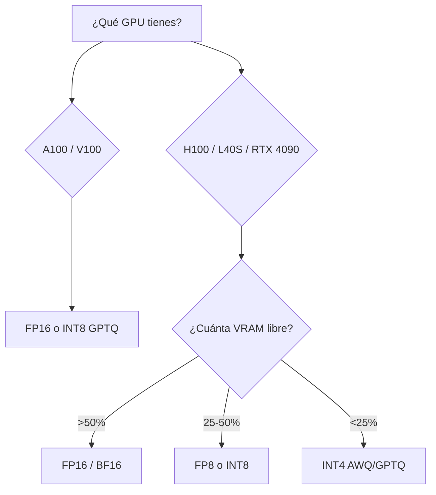
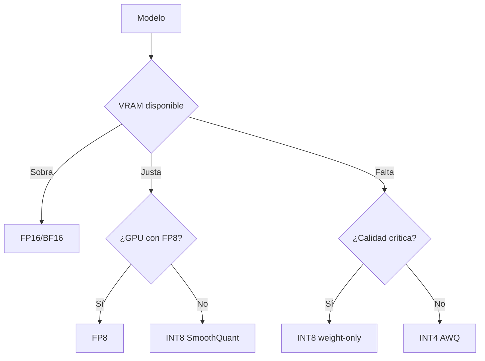

# 🔢 Cuantización

La cuantización es la palanca de **eficiencia** más impactante después de PagedAttention. Reduce la memoria del modelo 2-4x y, en muchos casos, **aumenta el throughput** (porque la GPU pasa menos tiempo moviendo bytes). Este módulo cubre los métodos soportados por vLLM, cuándo usar cada uno, y los trade-offs reales entre VRAM, throughput y calidad.

---

## 1. Por qué cuantizar

### 1.1 La ley del techo de VRAM

Para servir un modelo necesitas:
- **Pesos**: $N_{\text{params}} \times \text{sizeof(dtype)}$
- **KV cache**: domina bajo concurrencia (crece con $L \times \text{seqs}$)
- **Activaciones**: intermedios del forward pass
- **Overhead de CUDA**: ~500 MB - 2 GB

| Modelo | FP16 | INT8 | INT4 | FP8 |
|--------|-----:|-----:|-----:|----:|
| Llama 3 8B | 16 GB | 8 GB | 4 GB | 8 GB |
| Llama 3 70B | 140 GB | 70 GB | 35 GB | 70 GB |
| Llama 3 405B | 810 GB | 405 GB | 203 GB | 405 GB |
| DeepSeek V3 (671B MoE activo ~37B) | ~130 GB activos | ~65 GB | ~33 GB | ~65 GB |

> **Realidad de hardware**: una sola H100 tiene 80 GB. Para servir un 70B necesitas al menos cuantización INT8 o multi-GPU. Para 405B, multi-GPU obligatorio y cuantización prácticamente indispensable.

### 1.2 El otro beneficio: throughput

Mover menos bytes = kernels más rápidos. En GPUs memory-bound (la mayoría de inference), el throughput escala con el ancho de banda. INT4 puede ser 1.5-2x más rápido que FP16, incluso aunque la cantidad de cómputo sea similar, simplemente porque la GPU pasa más tiempo computando y menos esperando memoria.

| Cuantización | VRAM | Throughput relativo vs FP16 |
|--------------|-----:|---------------------------:|
| FP32 | 4x | 0.5x |
| FP16/BF16 | 2x | 1.0x (baseline) |
| FP8 | 1x | 1.5-2.0x |
| INT8 (weight-only) | 1x | 1.0-1.3x |
| INT4 (weight-only, AWQ/GPTQ) | 0.5x | 1.5-2.5x |
| INT4 (smoothquant) | 0.5x | 1.3-1.8x |

> **Advertencia**: los números de throughput son aproximados. Dependen del modelo, GPU y workload. SIEMPRE benchmark.

### 1.3 El costo: calidad

Cuantizar introduce error numérico. Los modelos bien entrenados lo toleran hasta 4 bits con degradación mínima (< 1% en MMLU). Pero hay límites.

| Bits | Degradación típica | Modelos que no toleran |
|------|-------------------|------------------------|
| FP16/BF16 | 0% (baseline) | — |
| FP8 | 0-0.5% | — |
| INT8 (W8A8) | 0-1% | — |
| INT8 (weight-only) | 0-1% | — |
| INT4 (AWQ/GPTQ) | 0.5-2% | Modelos muy sensibles a outliers |
| INT3 / INT2 | 2-10% | Solo viable con técnicas especiales (QuIP, AQLM) |

---

## 2. Formatos de cuantización

### 2.1 FP8 (E4M3 / E5M2)

8 bits en punto flotante. El estándar moderno para inference en GPUs NVIDIA H100, L40S, RTX 4090 (con versiones recientes de CUDA).

| Formato | Bits exponente | Bits mantisa | Uso |
|---------|---------------:|-------------:|-----|
| **E4M3** | 4 | 3 | Pesos, activaciones (mayor rango dinámico) |
| **E5M2** | 5 | 2 | Gradientes (más rango, menos precisión) |

```bash
# FP8 nativo (H100, L40S)
vllm serve meta-llama/Llama-3.1-70B-Instruct \
  --quantization fp8 \
  --dtype bfloat16
```

> **Importante**: FP8 funciona mejor en H100/L40S. En A100 (sin soporte FP8 nativo) vLLM emula FP8 pero con menor beneficio.

### 2.2 INT8 (W8A8)

Pesos y activaciones en INT8. Requiere calibración para manejar outliers.

```bash
# Con SmoothQuant o directamente
vllm serve <modelo> --quantization int8
```

| Método | Qué hace | Calidad |
|--------|----------|---------|
| **W8A8 naive** | Cuantiza pesos y activaciones con scale estática | Degrada outliers |
| **SmoothQuant** | Mueve outliers de activaciones a pesos antes de cuantizar | Preserva calidad |
| **GPTQ INT8** | Cuantización post-training optimizada | Mejor calidad |

### 2.3 AWQ (Activation-aware Weight Quantization)

Método de cuantización INT4 con calidad excelente. Protege los "salient weights" (1% de pesos que más impacto tienen) con scale especial.

```bash
vllm serve <modelo-con-AWQ-weights> \
  --quantization awq \
  --dtype float16
```

> **Setup típico**: los modelos AWQ se distribuyen en HuggingFace como variantes. Ejemplo: `TheBloke/Llama-2-7B-Chat-AWQ`, o repos oficiales con `awq` en el nombre.

### 2.4 GPTQ (Generalized Post-Training Quantization)

Algoritmo clásico de cuantización INT4 con calidad competitiva. Usa Hessian inverso para minimizar error de cuantización por capa.

```bash
vllm serve <modelo-con-GPTQ-weights> \
  --quantization gptq \
  --dtype float16
```

> **Comparación AWQ vs GPTQ**: AWQ tiende a ser más rápido (kernels más simples) y comparable en calidad. GPTQ tiene un ecosistema más amplio de modelos pre-cuantizados.

### 2.5 BitsAndBytes (NF4, INT8 dinámico)

Cuantización "on-the-fly" que carga un modelo FP16 y lo cuantiza en memoria sin preprocessing. Útil para experimentación rápida.

```bash
vllm serve <modelo-FP16> \
  --quantization bitsandbytes \
  --load-format bitsandbytes \
  --dtype bfloat16
```

| Ventaja | Desventaja |
|---------|------------|
| Sin pasos de preprocesado | Más lento al cargar (cuantiza al vuelo) |
| Funciona con cualquier modelo | Calidad ligeramente inferior a AWQ/GPTQ |
| Acepta INT4 (NF4) e INT8 | Solo weight-only, no weights+activations |

### 2.6 SmoothQuant

Mueve outliers de activaciones a pesos antes de cuantizar INT8, preservando la calidad. Excelente para INT8 W8A8.

```bash
vllm serve <modelo> \
  --quantization smoothquant \
  --smoothquant-alpha 0.5
```

---

## 3. Cuantización de KV cache

### 3.1 El problema

El KV cache se almacena en FP16 por default. Para modelos grandes con contextos largos, esto domina la VRAM:

$$
\text{KV de Llama 70B con 8K contexto} = 80 \text{ GB} \text{ (!!)}
$$

### 3.2 Solución: cuantizar el cache

```bash
vllm serve ... \
  --kv-cache-dtype fp8    # o "fp8_e4m3", "fp8_e5m2"
```

Beneficio: KV cache usa la mitad de VRAM, permitiendo 2x más requests concurrentes. Calidad: degradación <0.5% en la mayoría de casos.

> **Compatibilidad**: solo con GPUs que soportan FP8 (H100, L40S, RTX 4090 con CUDA 12.3+). En A100 no funciona.

### 3.3 Trade-offs

| Decisión | VRAM | Calidad | Velocidad |
|----------|-----:|--------:|----------:|
| KV cache FP16 | 1.0x | Baseline | Baseline |
| KV cache FP8 | 0.5x | -0.5% | +5-15% (cabe más en cache) |
| KV cache INT8 (experimental) | 0.5x | -1% | Variable |

---

## 4. Cuándo usar cada método

### 4.1 Matriz de decisión



### 4.2 Por caso de uso

| Caso de uso | Recomendación |
|-------------|---------------|
| Modelo 7B en RTX 4090 (24 GB) | FP16 o INT4 AWQ |
| Modelo 13B en A100 40GB | FP16, INT8 o INT4 AWQ |
| Modelo 70B en A100 80GB | INT4 AWQ o INT8 GPTQ |
| Modelo 70B en H100 80GB | FP8 (mejor calidad/tamaño) |
| Modelo 70B multi-GPU (2x A100 80GB) | FP16 (sin cuantizar) o FP8 |
| Modelo 405B | INT4 GPTQ + multi-GPU obligatorio |
| Edge / mobile | INT4 AWQ + modelo pequeño |
| Latencia ultra-baja | FP8 (H100) o INT4 AWQ (A100) |

### 4.3 Por tipo de modelo

| Modelo | Variantes populares | Recomendación |
|--------|--------------------|--------------:|
| Llama 3.1 8B | Original, GPTQ, AWQ, FP8 | FP16 base, AWQ si VRAM limitado |
| Qwen 2.5 7B | Original, AWQ, GPTQ | FP16 o AWQ |
| Mistral 7B | Original, AWQ, GPTQ, FP8 | AWQ para máximo throughput |
| Llama 3.1 70B | Original, AWQ, GPTQ, FP8 | **FP8** si tienes H100, AWQ si A100 |
| DeepSeek V3 | Original, AWQ | AWQ INT4 + multi-GPU |

---

## 5. Cómo cuantizar un modelo

### 5.1 Para AWQ

```bash
pip install autoawq

python -c "
from awq import AutoAWQForCausalLM
from transformers import AutoTokenizer

model_path = 'Qwen/Qwen2.5-7B-Instruct'
quant_path = 'Qwen2.5-7B-Instruct-AWQ'

quant_config = {
    'zero_point': True,
    'q_group_size': 128,
    'w_bit': 4,
    'version': 'GEMV'
}

model = AutoAWQForCausalLM.from_pretrained(model_path)
tokenizer = AutoTokenizer.from_pretrained(model_path)
model.quantize(tokenizer, quant_config=quant_config)
model.save_quantized(quant_path)
tokenizer.save_pretrained(quant_path)
"
```

### 5.2 Para GPTQ

```bash
pip install auto-gptq

python -c "
from auto_gptq import AutoGPTQForCausalLM, BaseQuantizeConfig
from transformers import AutoTokenizer

model_path = 'Qwen/Qwen2.5-7B-Instruct'
quant_path = 'Qwen2.5-7B-Instruct-GPTQ'

quantize_config = BaseQuantizeConfig(
    bits=4,
    group_size=128,
    desc_act=True,  # activation-aware
)

model = AutoGPTQForCausalLM.from_pretrained(model_path, quantize_config)
tokenizer = AutoTokenizer.from_pretrained(model_path)
model.quantize(['El rápido zorro marrón salta sobre el perro perezoso.'] * 100)
model.save_quantized(quant_path)
tokenizer.save_pretrained(quant_path)
"
```

### 5.3 Para FP8 (modelos compatibles)

La mayoría de modelos grandes ya tienen variantes FP8 oficiales en HuggingFace. Búscalas con sufijo `-FP8`:

```bash
# Ejemplo
huggingface-cli download meta-llama/Llama-3.1-70B-Instruct-FP8
```

Si no hay variante oficial, puedes convertir localmente con `llm-compressor`:

```bash
pip install llm-compressor

python -c "
from llmcompressor.transformers import oneshot
from llmcompressor.modifiers.quantization import GPTQModifier

oneshot(
    model='Qwen/Qwen2.5-7B-Instruct',
    dataset='ultrachat-200k',
    recipe=GPTQModifier(targets='Linear', scheme='FP8', ignore=['lm_head']),
    output_dir='Qwen2.5-7B-Instruct-FP8',
)
"
```

### 5.4 Dataset de calibración

La calidad de la cuantización depende de los datos de calibración. Mejores prácticas:

| Cuantización | Calibración | Mínimo |
|--------------|-------------|--------|
| AWQ | No necesita (es weight-only) | 0 |
| GPTQ | 128-512 muestras diversas | 128 |
| SmoothQuant | 512-2048 muestras reales | 512 |
| BitsAndBytes | No necesita | 0 |

```python
# Dataset de calibración típico
calibration_data = [
    "El rápido zorro marrón salta sobre el perro perezoso.",
    "La inteligencia artificial está transformando la industria del software.",
    # ... 128-512 ejemplos más
]
```

---

## 6. Calidad: cómo medir degradación

### 6.1 Benchmarks estándar

```python
from vllm import LLM, SamplingParams

def evaluate_perplexity(model_path: str, dataset_texts: list[str]) -> float:
    llm = LLM(model=model_path)
    params = SamplingParams(max_tokens=1, prompt_logprobs=0)
    
    log_probs = []
    for text in dataset_texts:
        tokens = llm.get_tokenizer().encode(text)
        # calcula log-prob de cada token dado el contexto
        ...
    
    perplexity = ...
    return perplexity

# Compara
pp_fp16 = evaluate_perplexity("Qwen2.5-7B-Instruct", texts)
pp_awq = evaluate_perplexity("Qwen2.5-7B-Instruct-AWQ", texts)
print(f"FP16 perplexity: {pp_fp16:.3f}")
print(f"AWQ perplexity:  {pp_awq:.3f}  (degradación: {(pp_awq - pp_fp16) / pp_fp16 * 100:.2f}%)")
```

### 6.2 MMLU como proxy

```bash
pip install lm-eval

lm_eval --model vllm \
  --model_args pretrained=Qwen2.5-7B-Instruct,dtype=bfloat16 \
  --tasks mmlu_pro \
  --batch_size auto

# Repetir con AWQ
lm_eval --model vllm \
  --model_args pretrained=Qwen2.5-7B-Instruct-AWQ,quantization=awq \
  --tasks mmlu_pro
```

### 6.3 Golden set de la empresa

Para producción, lo más importante es que tu workload específico no degrade. Crea un set de 50-200 prompts representativos y compara respuestas FP16 vs cuantizado.

```python
# Eval human-like
fp16_responses = batch_generate(llm_fp16, prompts)
awq_responses = batch_generate(llm_awq, prompts)

# Métricas: BLEU/ROUGE vs ground truth, win rate manual, LLM-as-judge
```

---

## 7. Errores comunes

| Error | Síntoma | Solución |
|-------|---------|----------|
| Pasar un modelo FP16 con `--quantization awq` | Error de carga | Usa una variante AWQ pre-cuantizada |
| FP8 en A100 | No hay speedup, posible error | FP8 solo en H100/L40S/RTX 4090 |
| GPTQ con dataset muy pequeño | Calidad pobre | Usa 128+ muestras diversas |
| `group_size` muy grande | Calidad pobre | `group_size=128` es sweet spot |
| Cuantizar `lm_head` | Degradación severa | Ignora con `modules_to_not_convert=['lm_head']` |
| Comparar FP16 con cuantizado sin mismo sampling | Atribución errónea de calidad | Usa `seed=42` siempre |

---

## 8. Cuantización dinámica vs estática

| Tipo | Cuándo se aplica | Calidad | Velocidad |
|------|------------------|---------|----------:|
| **Estática (PTQ)** | Una vez, offline, con calibración | Alta | Rápida |
| **Dinámica (online)** | Durante inferencia, según activaciones | Media | Más lenta (overhead) |

vLLM usa **PTQ estática** para AWQ/GPTQ/SmoothQuant (los modelos ya vienen cuantizados). Para BitsAndBytes, aplica cuantización dinámica al cargar.

> **Regla**: para producción, PTQ estática siempre que sea posible. La dinámica es útil para experimentación.

---

## 9. Combinando optimizaciones

```bash
vllm serve Qwen/Qwen2.5-7B-Instruct-AWQ \
  --quantization awq \
  --dtype float16 \
  --enable-chunked-prefill \
  --enable-prefix-caching \
  --kv-cache-dtype fp8 \
  --max-num-seqs 256 \
  --max-num-batched-tokens 4096 \
  --gpu-memory-utilization 0.92
```

Configuración de producción típica en H100:
- Modelo AWQ (4 bits, alta calidad)
- KV cache FP8 (más concurrencia)
- Chunked prefill (estabilidad de latencia)
- Prefix caching (eficiencia en RAG/chat)

Resultado: ~2-3x throughput vs FP16 puro, con <1% de degradación en benchmarks.

---

## 10. Resumen: la decisión de cuantización



💡 **Siguiente paso**: en [[06 - Multimodal|el siguiente módulo]] vamos más allá del texto: cómo servir modelos que ven imágenes y escuchan audio. Los VLMs tienen un pipeline de preprocesado diferente, gestionan tokens de imagen por separado, y abren la puerta a una nueva clase de aplicaciones.
