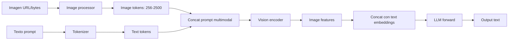
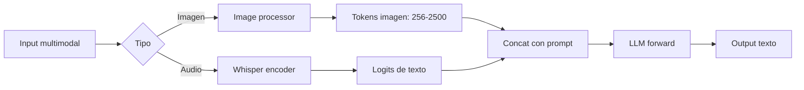

# 🖼️ Multimodal: Visión y Audio

vLLM no se limita a texto. Soporta nativamente **modelos visión-lenguaje** (VLMs como Qwen-VL, LLaVA, Pixtral, Gemma 3) y **modelos de audio** (Whisper para STT, TTS engines). Este módulo cubre los detalles únicos de servir modelos multimodales: el pipeline de preprocesado, el formato extendido de mensajes, las consideraciones de VRAM y throughput, y los modelos recomendados para cada caso.

---

## 1. Por qué multimodal es diferente

### 1.1 Pipeline de inferencia

Un VLM tiene un pipeline más complejo que un LLM puro:



El encoder de visión añade:
- **Latencia de preprocesado**: resize, normalize, patch embedding.
- **Latencia de vision encoder**: ViT, SigLIP, CLIP.
- **Memoria extra**: las image features ocupan espacio en la KV cache.

### 1.2 Impacto en throughput y VRAM

| Aspecto | LLM puro | VLM |
|---------|----------|-----|
| Prefill (1 imagen 1024x1024) | 100 ms (texto) | 300-600 ms (encoder + tokens) |
| KV cache extra | 0 | 256-2500 tokens de imagen |
| VRAM modelo | 14 GB (7B) | 16-18 GB (7B + vision tower) |
| Throughput agregado | ~3500 tok/s | ~1500-2500 tok/s |

---

## 2. Modelos visión-lenguaje soportados

vLLM soporta decenas de VLMs. Los más relevantes para producción:

| Modelo | Tamaño | Encoder | Idiomas | Licencia | Caso de uso |
|--------|-------:|---------|---------|----------|-------------|
| **Qwen2.5-VL** | 3B, 7B, 72B | ViT propio | 30+ | Apache | Default, SOTA open |
| **Qwen2-VL** | 2B, 7B, 72B | ViT propio | 30+ | Apache | Generación multimodal |
| **Pixtral 12B** | 12B | ViT propio | EN+FR+DE | Apache | Mistral, alternativa |
| **Llama 3.2 Vision** | 11B, 90B | CLIP-style | EN | Llama | Caso de referencia |
| **Gemma 3** | 4B, 12B, 27B | SigLIP | EN | Gemma | Google, multimodal nativo |
| **LLaVA-OneVision** | 0.5B-72B | SigLIP | EN | Apache | Flexible |
| **InternVL 2.5** | 1B-78B | InternViT | EN+CN | MIT | Mejor en benchmarks |
| **MiniCPM-V 2.6** | 8B | SigLIP | EN+CN | Apache | Edge, muy eficiente |

> **Recomendación 2026**: **Qwen2.5-VL-7B-Instruct** (Apache, multilingüe, excelente calidad) o **Qwen2.5-VL-72B-Instruct** (cuando hay GPU de sobra). Para edge: **MiniCPM-V 2.6**.

---

## 3. Servir un VLM

### 3.1 Comando básico

```bash
vllm serve Qwen/Qwen2.5-VL-7B-Instruct \
  --port 8000 \
  --host 0.0.0.0 \
  --max-model-len 16384 \
  --gpu-memory-utilization 0.9 \
  --limit-mm-per-prompt image=4  # máximo 4 imágenes por prompt
```

### 3.2 Consumo con la API OpenAI

```python
from openai import OpenAI
import base64

client = OpenAI(base_url="http://localhost:8000/v1", api_key="EMPTY")


def encode_image(path: str) -> str:
    with open(path, "rb") as f:
        return base64.b64encode(f.read()).decode("utf-8")


image_b64 = encode_image("foto.jpg")

response = client.chat.completions.create(
    model="Qwen/Qwen2.5-VL-7B-Instruct",
    messages=[
        {
            "role": "user",
            "content": [
                {
                    "type": "image_url",
                    "image_url": {"url": f"data:image/jpeg;base64,{image_b64}"}
                },
                {
                    "type": "text",
                    "text": "¿Qué hay en esta imagen? Describe en detalle."
                }
            ]
        }
    ],
    max_tokens=500,
)
print(response.choices[0].message.content)
```

### 3.3 Formatos de URL de imagen

| Formato | Ejemplo | Notas |
|---------|---------|-------|
| **Base64 data URL** | `data:image/jpeg;base64,...` | Embebido en el request |
| **URL HTTP** | `https://example.com/img.jpg` | vLLM descarga |
| **URL HTTPS** | `https://...` | Igual |
| **Ruta local** | ❌ no soportado | Codifica a base64 antes |

```python
# URL HTTP
response = client.chat.completions.create(
    model="...",
    messages=[{
        "role": "user",
        "content": [
            {"type": "image_url", "image_url": {"url": "https://example.com/cat.jpg"}},
            {"type": "text", "text": "¿Es un gato?"}
        ]
    }]
)
```

### 3.4 Múltiples imágenes

```python
messages = [{
    "role": "user",
    "content": [
        {"type": "image_url", "image_url": {"url": img1_url}},
        {"type": "image_url", "image_url": {"url": img2_url}},
        {"type": "text", "text": "¿Cuál es la diferencia entre las dos imágenes?"}
    ]
}]
```

> **Límite**: `--limit-mm-per-prompt image=N` controla cuántas imágenes acepta. Default suele ser 1.

---

## 4. Configuraciones específicas de visión

### 4.1 Resolución de entrada

vLLM ajusta la resolución automáticamente según el modelo:

| Modelo | Resolución nativa | Comportamiento |
|--------|------------------|----------------|
| Qwen2.5-VL | Dinámica (múltiples de 28) | Smart resize, preserva aspect ratio |
| LLaVA-OneVision | Dinámica (tile-based) | Divide imágenes grandes en tiles |
| Pixtral 12B | Hasta 1024x1024 | Resize simple |
| Gemma 3 | 896x896 | Fija |

```bash
# Forzar máximo de píxeles por imagen (controla VRAM)
vllm serve Qwen2.5-VL-7B \
  --mm-encoder-tp-mode data \
  --limit-mm-per-prompt image=4
```

### 4.2 Tokens de imagen

La imagen se convierte en N tokens. N depende del modelo y resolución:

| Modelo | 512x512 | 1024x1024 | 2048x2048 |
|--------|--------:|----------:|----------:|
| Qwen2.5-VL (smart resize) | ~256 | ~1024 | ~4096 |
| LLaVA-OneVision (tiles) | ~576 | ~2304 | ~9216 |
| Pixtral 12B | 256 | 1024 | 4096 |

> **Impacto**: cada token de imagen consume KV cache. Imagen 2048x2048 ≈ 4096 tokens de KV cache ≈ 0.5 GB en FP16. Limita resolución o número de imágenes para mantener concurrencia.

### 4.3 Prefill vs Vision encoder

El vision encoder es independiente del LLM. Si tienes varias GPUs:

```bash
# Distribuir el vision encoder en GPUs distintas del LLM
vllm serve Qwen2.5-VL-72B \
  --tensor-parallel-size 4 \
  --mm-encoder-tp-mode data
```

---

## 5. Audio: Speech-to-Text (Whisper)

### 5.1 Servir Whisper

```bash
vllm serve openai/whisper-large-v3 \
  --port 8000 \
  --max-model-len 448 \
  --enforce-eager
```

Whisper tiene contexto fijo (448 tokens = ~30s de audio), así que `--max-model-len=448`.

### 5.2 Transcripción

```python
client = OpenAI(base_url="http://localhost:8000/v1", api_key="EMPTY")

with open("audio.mp3", "rb") as f:
    response = client.audio.transcriptions.create(
        model="openai/whisper-large-v3",
        file=("audio.mp3", f, "audio/mpeg"),
        language="es",  # opcional, "es", "en", "auto"
        response_format="text",  # text, json, srt, vtt
    )
print(response)
```

### 5.3 Formatos de respuesta

| Formato | Output |
|---------|--------|
| `text` | Solo el texto transcrito |
| `json` | `{"text": "...", "language": "es", "duration": 12.5}` |
| `srt` | Subtítulos SRT con timestamps |
| `vtt` | Subtítulos WebVTT |
| `verbose_json` | JSON con segments, words, etc. |

```python
# Con timestamps
with open("audio.mp3", "rb") as f:
    response = client.audio.transcriptions.create(
        model="openai/whisper-large-v3",
        file=("audio.mp3", f),
        response_format="verbose_json",
        timestamp_granularities=["segment", "word"],
    )
for segment in response.segments:
    print(f"[{segment.start:.2f}s - {segment.end:.2f}s] {segment.text}")
```

### 5.4 Traducción (audio → texto en inglés)

```python
with open("audio_es.mp3", "rb") as f:
    translation = client.audio.translations.create(
        model="openai/whisper-large-v3",
        file=("audio_es.mp3", f),
    )
print(translation.text)  # siempre en inglés
```

---

## 6. Audio: Text-to-Speech (TTS)

vLLM soporta TTS con modelos como `SpeakLeash/bielik-11b-tts` o los nuevos modelos Kokoro / StyleTTS2.

```bash
vllm serve <tts-model> --port 8000
```

```python
response = client.audio.speech.create(
    model="tts-model",
    voice="alloy",  # depende del modelo
    input="Hola mundo, esto es una prueba de TTS.",
    response_format="mp3",  # mp3, opus, aac, flac
)

with open("output.mp3", "wb") as f:
    f.write(response.content)
```

> **Estado del arte (2026)**: TTS open source está mejorando rápido. Para máxima calidad, modelos comerciales (ElevenLabs, OpenAI TTS) siguen siendo superiores, pero vLLM + Kokoro ofrece calidad decente en local.

---

## 7. Embeddings multimodales

vLLM también soporta modelos de embedding multimodales:

```bash
vllm serve BAAI/bge-visualized-base-en-v1.5 \
  --max-model-len 4096 \
  --trust-remote-code
```

```python
response = client.embeddings.create(
    model="BAAI/bge-visualized-base-en-v1.5",
    input=[
        {"content": "una imagen de un gato", "image": image_b64},
        "texto plano sin imagen",
    ],
)
```

Útil para retrieval multimodal: buscar imágenes con texto o texto con imágenes.

---

## 8. Optimizaciones para multimodal

### 8.1 Límite de imágenes por prompt

```bash
# Acepta hasta 8 imágenes por request
vllm serve ... --limit-mm-per-prompt image=8
```

Aumentar esto multiplica el prefill. Mantener bajo (1-4) para latencia estable.

### 8.2 Resolución dinámica

```bash
# Forzar tamaño máximo de imagen
vllm serve Qwen2.5-VL-7B \
  --mm-processor-kwargs '{"max_pixels": 1280 * 28 * 28}'  # smart resize
```

`max_pixels` limita el total de patches. Útil para evitar imágenes enormes que maten el prefill.

### 8.3 Caché de embeddings visuales

vLLM cachea las image features por hash. Si la misma imagen se envía varias veces, el vision encoder solo corre una vez:

```python
# Primera request: encoder corre, ~300ms
response1 = client.chat.completions.create(
    model="...",
    messages=[{"role": "user", "content": [
        {"type": "image_url", "image_url": {"url": img_url}},
        {"type": "text", "text": "Describe."}
    ]}]
)

# Segunda request con misma imagen: cache hit, ~50ms
response2 = client.chat.completions.create(
    model="...",
    messages=[{"role": "user", "content": [
        {"type": "image_url", "image_url": {"url": img_url}},  # misma imagen
        {"type": "text", "text": "Ahora en español."}
    ]}]
)
```

---

## 9. Errores comunes

| Error | Síntoma | Solución |
|-------|---------|----------|
| `image too large` | Error 400 | Reduce resolución o usa smart resize |
| `Too many images` | Error 400 | `--limit-mm-per-prompt image=N` |
| TTFT altísimo (5-10s) | Vision encoder grande | Baja `--max-num-batched-tokens` |
| OOM al cargar | Vision tower grande | Cuantiza o usa modelo más pequeño |
| `unknown model architecture` | Modelo no soportado | Verifica [lista de modelos soportados](https://docs.vllm.ai/en/latest/models/supported_models.html) |
| Idioma mal detectado | `language=auto` falla | Especifica `language="es"` |

---

## 10. Caso de uso: OCR visual

Un caso popular: usar un VLM para OCR en lugar de Tesseract.

```python
def ocr_with_vlm(image_path: str) -> str:
    img_b64 = encode_image(image_path)
    response = client.chat.completions.create(
        model="Qwen/Qwen2.5-VL-7B-Instruct",
        messages=[{
            "role": "user",
            "content": [
                {"type": "image_url", "image_url": {"url": f"data:image/jpeg;base64,{img_b64}"}},
                {"type": "text", "text": "Transcribe TODO el texto de la imagen. Solo el texto, sin comentarios."}
            ]
        }],
        temperature=0,
        max_tokens=2000,
    )
    return response.choices[0].message.content
```

Comparación con Tesseract:

| Caso | Tesseract | VLM (Qwen2.5-VL) |
|------|-----------|-------------------|
| Texto impreso limpio | Excelente, rápido | Excelente, más lento |
| Texto manuscrito | Pobre | Bueno |
| Documentos con tablas | Necesita configuración | Nativo |
| Idiomas | 100+ pero con packs | 30+ out-of-the-box |
| Layout complejo | Limitado | Robusto |
| Velocidad | <100ms | 500-2000ms |
| Costo | Gratis local | VRAM |

> **Regla**: usa Tesseract para OCR masivo simple; usa VLM cuando hay layout complejo, manuscrito o semántica.

---

## 11. Caso de uso: video understanding

Para video, divide en frames y envía como múltiples imágenes:

```python
import cv2

def extract_frames(video_path: str, n_frames: int = 8) -> list[str]:
    cap = cv2.VideoCapture(video_path)
    total = int(cap.get(cv2.CAP_PROP_FRAME_COUNT))
    indices = [int(i * total / n_frames) for i in range(n_frames)]
    frames = []
    for idx in indices:
        cap.set(cv2.CAP_PROP_POS_FRAMES, idx)
        ret, frame = cap.read()
        if ret:
            _, buf = cv2.imencode(".jpg", frame, [cv2.IMWRITE_JPEG_QUALITY, 80])
            frames.append(base64.b64encode(buf).decode())
    cap.release()
    return frames


def describe_video(video_path: str) -> str:
    frames = extract_frames(video_path, n_frames=8)
    content = []
    for f in frames[:8]:
        content.append({"type": "image_url", "image_url": {"url": f"data:image/jpeg;base64,{f}"}})
    content.append({"type": "text", "text": "Describe qué pasa en este video basándote en los frames."})
    
    response = client.chat.completions.create(
        model="Qwen/Qwen2.5-VL-7B-Instruct",
        messages=[{"role": "user", "content": content}],
        max_tokens=500,
    )
    return response.choices[0].message.content
```

> **Costo**: 8 frames a 512x512 ≈ 2048 tokens de imagen ≈ 0.3 GB KV cache. Aceptable para concurrencia media.

---

## 12. Resumen



💡 **Siguiente paso**: en [[07 - Distributed y Multi-GPU|el siguiente módulo]] escalamos a multi-GPU: tensor parallelism, pipeline parallelism, multi-nodo. Las técnicas de este módulo aplican a modelos 70B+ que no caben en una sola GPU.
