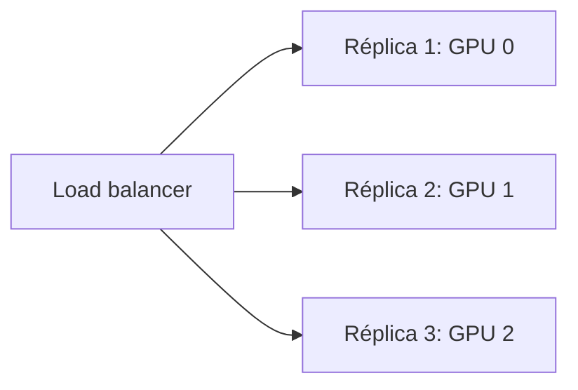
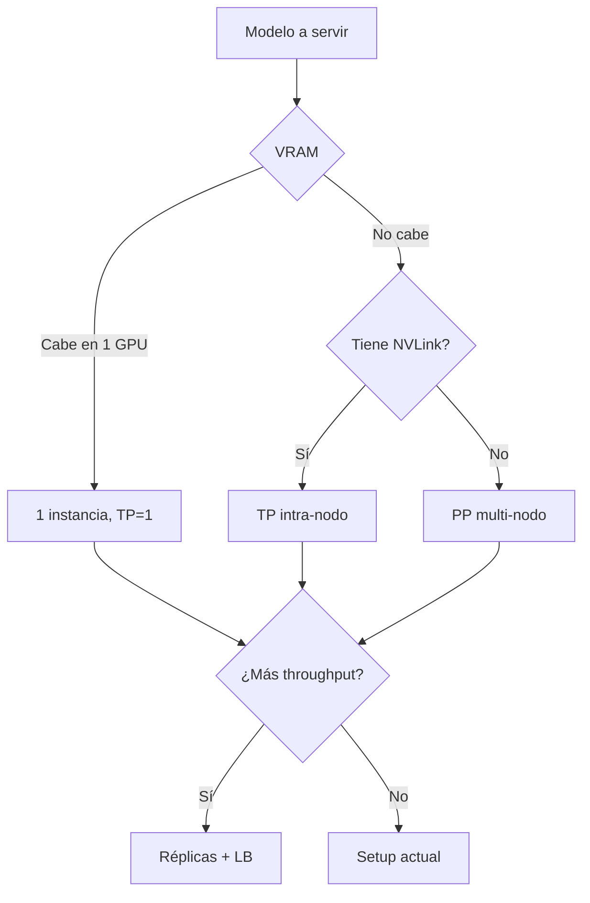

# 🌐 Distributed y Multi-GPU

Para modelos 70B+ y alta concurrencia, una sola GPU no es suficiente. vLLM escala a multi-GPU y multi-nodo usando estrategias de paralelismo bien establecidas. Este módulo cubre las tres estrategias principales (tensor, pipeline, data parallelism), cómo elegirlas según tu modelo y hardware, y los trade-offs prácticos en producción.

---

## 1. Las tres estrategias de paralelismo

### 1.1 Tensor Parallelism (TP)

Parte **cada capa** del modelo entre múltiples GPUs. Cada GPU calcula una fracción de cada matmul; los resultados se combinan vía collectives (all-reduce).

```mermaid
flowchart LR
    A[Input] --> B[GPU 0: W[:, 0:d/2]]
    A --> C[GPU 1: W[:, d/2:d]]
    B --> D[all-reduce]
    C --> D
    D --> E[Output]
```

Para una capa linear $Y = X W$ con $W$ de shape $(d \times d)$:

$$
W = [W_1 | W_2], \quad W_1 \in (d \times d/2), \quad W_2 \in (d \times d/2)
$$

- GPU 0: $Y_1 = X W_1$
- GPU 1: $Y_2 = X W_2$
- All-reduce: $Y = [Y_1 | Y_2]$

> **Pros**: comunicación rápida (NVLink entre GPUs de un mismo nodo); latencia baja.
> **Cons**: requiere fast interconnect; limitado a 1 nodo en general.

### 1.2 Pipeline Parallelism (PP)

Parte las **capas** del modelo entre GPUs. Cada GPU procesa un subconjunto secuencial de capas; los outputs se pasan a la siguiente GPU.


> **Pros**: baja comunicación (solo activations entre stages); funciona entre nodos.
> **Cons**: introduce "pipeline bubbles" (tiempo muerto mientras esperan datos); requiere tuning de micro-batches.

### 1.3 Data Parallelism (DP / réplicas)

Réplicas **completas** del modelo en distintas GPUs/nodos. Cada request va a una réplica. No hay comunicación entre réplicas durante la inferencia.



> **Pros**: lineal en throughput; cero comunicación; simple de escalar.
> **Cons**: no reduce latencia; requiere N copias del modelo en VRAM.

### 1.4 Resumen comparativo

| Estrategia | Reduce latencia | Escala throughput | Comunicación | Multi-nodo | Cuándo usar |
|------------|:---------------:|:-----------------:|:------------:|:----------:|-------------|
| **Tensor Parallel** | ✅ | ✅ | Alta (NVLink) | Limitado | Modelo no cabe en 1 GPU, mismo nodo |
| **Pipeline Parallel** | ❌ (peor) | ✅ | Media | ✅ | Modelo muy grande (>100B) |
| **Data Parallel** | ❌ | ✅ (lineal) | Cero | ✅ | Maximizar concurrencia |
| **Híbrido (TP+PP)** | Parcial | ✅ | Variable | ✅ | Modelos enormes (405B+) |

---

## 2. Tensor Parallelism en vLLM

### 2.1 Uso básico

```bash
# Modelo 70B en 4 GPUs
vllm serve meta-llama/Llama-3.1-70B-Instruct \
  --tensor-parallel-size 4 \
  --gpu-memory-utilization 0.9
```

vLLM automáticamente:
1. Detecta las GPUs visibles (`CUDA_VISIBLE_DEVICES` o `--tensor-parallel-size`).
2. Carga una fracción del modelo en cada GPU.
3. Inserta los collectives (all-reduce) en las capas attention y MLP.
4. Coordina la KV cache entre GPUs.

### 2.2 Selección de GPUs

```bash
# Específicas GPUs
CUDA_VISIBLE_DEVICES=0,1,2,3 vllm serve ... --tensor-parallel-size 4

# Solo 2 GPUs específicas
CUDA_VISIBLE_DEVICES=0,2 vllm serve ... --tensor-parallel-size 2
```

### 2.3 Interconnect importa

| Conexión | Ancho de banda | TP recomendado |
|----------|---------------:|:---------------:|
| NVLink (H100, A100 SXM) | 900 GB/s | Hasta 8 GPUs |
| NVLink (RTX 4090) | 100 GB/s | 2-4 GPUs |
| PCIe Gen4 | 64 GB/s | 2 GPUs |
| PCIe Gen3 | 32 GB/s | 1 GPU (TP no aporta) |
| InfiniBand (multi-nodo) | 200-400 Gb/s | Limitado, prefiere PP/DP |

> **Regla**: usa TP solo dentro de un nodo. Para multi-nodo, combina TP intra-nodo + PP inter-nodo, o usa DP.

### 2.4 Memory savings vs latencia

TP divide la VRAM usada por el modelo:

| Modelo | TP=1 (1 GPU) | TP=2 (2 GPUs) | TP=4 (4 GPUs) | TP=8 (8 GPUs) |
|--------|:------------:|:-------------:|:-------------:|:-------------:|
| Llama 70B FP16 | 140 GB ❌ | 70 GB ✅ | 35 GB ✅ | 17.5 GB ✅ |
| Llama 405B FP8 | 405 GB ❌ | 203 GB ❌ | 102 GB ❌ | 51 GB ✅ |

> **Costo**: la latencia de cada forward pass se mantiene similar (compute se reparte) pero los collectives añaden 10-30% de overhead. Throughput total se mantiene, pero la latencia por request puede subir ligeramente.

---

## 3. Pipeline Parallelism en vLLM

### 3.1 Activación

```bash
# Modelo 405B en 4 nodos de 8 GPUs cada uno
vllm serve meta-llama/Llama-3.1-405B-Instruct-FP8 \
  --tensor-parallel-size 8 \
  --pipeline-parallel-size 4
```

Cada pipeline stage corre en un nodo distinto, con TP intra-nodo.

### 3.2 Cuándo PP es mejor que TP

PP gana cuando:
- El interconnect **entre** GPUs de un nodo es lento (no NVLink).
- El modelo es tan grande que TP necesita muchos nodos (costoso).
- La latencia no es crítica (batch processing).

PP pierde cuando:
- La latencia importa (decode autoregresivo sufre del bubble).
- Batch size es pequeño (pocas requests en flight).

---

## 4. Data Parallelism (réplicas)

### 4.1 Con Kubernetes

La forma más natural de hacer DP es levantar múltiples pods de vLLM idénticos y poner un load balancer delante:

```yaml
# k8s deployment
apiVersion: apps/v1
kind: Deployment
metadata:
  name: vllm-server
spec:
  replicas: 4  # 4 réplicas
  template:
    spec:
      containers:
      - name: vllm
        image: vllm/vllm-openai:latest
        args:
          - "vllm"
          - "serve"
          - "Qwen/Qwen2.5-7B-Instruct"
          - "--port=8000"
        resources:
          limits:
            nvidia.com/gpu: 1
---
apiVersion: v1
kind: Service
metadata:
  name: vllm-lb
spec:
  selector:
    app: vllm-server
  ports:
  - port: 80
      targetPort: 8000
  type: LoadBalancer
```

> **Beneficio**: cada request va a la réplica menos cargada. Linear scaling con réplicas (asumiendo que el LB es stateless).

### 4.2 Routing strategies

| Estrategia | Pros | Cons |
|------------|------|------|
| **Round-robin** | Simple, balanceado | No considera carga real |
| **Least connections** | Mejor balance | Requiere tracking |
| **Prefix-aware (cache locality)** | Maximiza prefix cache hit | Complejo |
| **Sticky by user/session** | Cache de conversación | Sesgo de carga |

vLLM expone métricas de carga. Un LB inteligente (Envoy, custom) puede usarlas:

```yaml
# Métricas para LB
- vllm:num_requests
- vllm:gpu_cache_usage_perc
- vllm:num_preemptions_total
```

### 4.3 Trade-off DP vs TP

| Decisión | VRAM total | Throughput | Latencia p99 |
|----------|-----------:|-----------:|-------------:|
| 1 instancia TP=4 (4 GPUs) | 4 GPU | 1x | baja |
| 4 instancias TP=1 (4 GPUs) | 4 GPU | 1x | baja |
| 1 instancia TP=4 + 4 réplicas (16 GPUs) | 16 GPU | 4x | baja |
| 4 instancias TP=2 (8 GPUs) | 8 GPU | 2x | baja |

> **Recomendación**: para escalar throughput, prefiere DP (réplicas) sobre aumentar TP. Es más simple, más resiliente (un fallo no mata todo) y permite actualizar gradualmente.

---

## 5. Configuraciones recomendadas por tamaño de modelo

### 5.1 Modelo 7B-13B

```bash
# En 1 GPU
vllm serve Qwen/Qwen2.5-7B-Instruct --gpu-memory-utilization 0.9

# Para escalar concurrencia: réplicas
# K8s: replicas: 8
```

### 5.2 Modelo 70B

```bash
# 4x A100 80GB
vllm serve meta-llama/Llama-3.1-70B-Instruct \
  --tensor-parallel-size 4

# 2x H100 80GB con cuantización
vllm serve meta-llama/Llama-3.1-70B-Instruct-AWQ \
  --tensor-parallel-size 2 \
  --quantization awq
```

### 5.3 Modelo 405B

```bash
# 8x H100 80GB con FP8
vllm serve meta-llama/Llama-3.1-405B-Instruct-FP8 \
  --tensor-parallel-size 8

# 16x A100 80GB con INT4
vllm serve meta-llama/Llama-3.1-405B-Instruct-AWQ \
  --tensor-parallel-size 8 \
  --pipeline-parallel-size 2
```

### 5.4 Modelo 671B (DeepSeek V3 MoE)

```bash
# 8x H100 80GB con FP8
vllm serve deepseek-ai/DeepSeek-V3-FP8 \
  --tensor-parallel-size 8 \
  --max-model-len 16384
```

---

## 6. Multi-nodo con Ray

### 6.1 Setup

```bash
# En nodo head
ray start --head --port=6379

# En cada nodo worker
ray start --address=<head-ip>:6379 --num-gpus=8
```

### 6.2 vLLM distribuido

```bash
# En el nodo head
vllm serve deepseek-ai/DeepSeek-V3-FP8 \
  --tensor-parallel-size 16 \
  --pipeline-parallel-size 2 \
  --distributed-executor-backend ray
```

Ray orquesta los workers, maneja la comunicación entre nodos y recovery.

### 6.3 Latencia inter-nodo

| Conexión | Latencia | Throughput |
|----------|---------:|-----------:|
| NVLink intra-nodo | ~1-2 μs | 900 GB/s |
| InfiniBand NDR | ~3-5 μs | 400 Gb/s |
| Ethernet 100 GbE | ~10 μs | 100 Gb/s |
| Ethernet 25 GbE | ~20 μs | 25 Gb/s |

> **Implicación**: PP entre nodos con Ethernet 25 GbE es lento. Usa InfiniBand o NVLink over Fabric.

---

## 7. Comparación con otros frameworks

| Framework | TP | PP | DP | Multi-nodo | Notas |
|-----------|:--:|:--:|:--:|:----------:|-------|
| **vLLM** | ✅ | ✅ | ✅ | ✅ (Ray) | El más versátil |
| TensorRT-LLM | ✅ | ✅ | ✅ | ✅ | Más rápido en NVIDIA puro |
| SGLang | ✅ | ❌ | ✅ | ✅ | Más moderno, radix attention |
| TGI | ✅ | ❌ | ✅ | ✅ | HF-friendly |
| llama.cpp | ❌ | ❌ | ❌ | ❌ | CPU/GPU única |

---

## 8. Debugging distribuido

### 8.1 Logs de inicialización

```
INFO worker.py:251] Initializing worker 0 on GPU 0
INFO worker.py:251] Initializing worker 1 on GPU 1
INFO worker.py:251] Initializing worker 2 on GPU 2
INFO worker.py:251] Initializing worker 3 on GPU 3
INFO engine.py:142] All workers initialized
INFO worker.py:312] Memory usage per GPU: 17.3 GB (model: 14.0 GB, KV cache: 3.3 GB)
```

Si alguna worker falla al inicializar, todo el servidor falla. Busca:

```bash
# Verificar que NCCL funciona entre GPUs
python -c "
import torch
import torch.distributed as dist
dist.init_process_group(backend='nccl')
print('NCCL version:', torch.cuda.nccl.version())
print('Available GPUs:', torch.cuda.device_count())
"
```

### 8.2 Problemas comunes

| Problema | Síntoma | Solución |
|----------|---------|----------|
| NCCL timeout | Worker hangs en init | Verifica firewall, `NCCL_DEBUG=INFO` |
| OOM en una GPU pero no en otras | Load imbalance | Reduce `--gpu-memory-utilization` o usa TP mayor |
| GPU 0 hot, otras idle | Scheduling issue | Verifica `--max-num-batched-tokens` |
| Latencia alta en TP | NVLink saturado | Reduce TP o usa PP |
| Throughput no escala con réplicas | LB no balancea | Verifica métricas, considera prefix-aware LB |

### 8.3 Variables de entorno útiles

```bash
export NCCL_DEBUG=INFO          # verbose logging
export NCCL_IB_DISABLE=0        # usar InfiniBand
export NCCL_SOCKET_IFNAME=eth0 # network interface
export CUDA_VISIBLE_DEVICES=0,1,2,3
```

---

## 9. Checklist de scaling

```
[ ] ¿Cuánta VRAM necesita el modelo?
    - 7-13B → 1 GPU
    - 70B → 4x A100 o 2x H100
    - 405B → 8x H100 mínimo

[ ] ¿Cuánta concurrencia necesitas?
    - <50 requests/s → 1 instancia TP
    - 50-500 requests/s → 1 instancia TP + réplicas
    - >500 requests/s → múltiples instancias TP + réplicas

[ ] ¿Latencia o throughput?
    - Latencia crítica → TP más grande, menos réplicas
    - Throughput crítico → más réplicas, TP más pequeño

[ ] ¿Infraestructura?
    - 1 nodo con NVLink → TP agresivo
    - Múltiples nodos con InfiniBand → TP+PP con Ray
    - Sin fast interconnect → solo DP (réplicas)
```

---

## 10. Resumen de estrategias



💡 **Siguiente paso**: en [[08 - Observabilidad y Deployment|el siguiente módulo]] aterrizamos todo en producción: métricas Prometheus, K8s, autoscaling, health checks y graceful shutdown. Lo que separa un servidor de investigación de un sistema 24/7.
