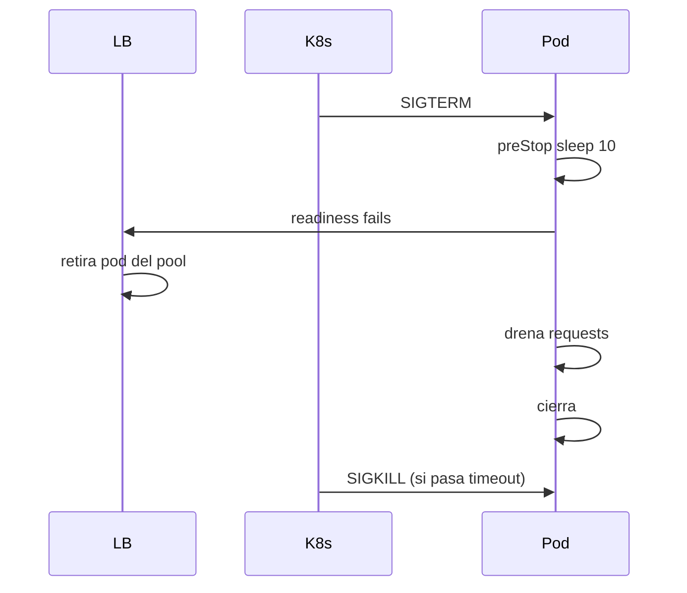

# 📊 Observabilidad y Deployment

Un servidor vLLM en producción necesita tres cosas: **métricas detalladas** (para saber si está sano), **deployment robusto** (para que no se caiga) y **autoscaling** (para responder a la demanda). Este módulo cubre el camino desde `vllm serve` en tu laptop hasta una flota de pods en Kubernetes con monitoring de primer nivel.

---

## 1. Métricas Prometheus

### 1.1 Endpoint nativo

vLLM expone métricas Prometheus en `:8000/metrics`:

```bash
curl http://localhost:8000/metrics
# Formato Prometheus estándar
```

### 1.2 Métricas clave

| Métrica | Tipo | Qué mide | SLO típico |
|---------|------|----------|------------|
| `vllm:num_requests` | gauge | Requests activas ahora | <max-num-seqs |
| `vllm:gpu_cache_usage_perc` | gauge | % de KV cache ocupada | <80% |
| `vllm:cpu_cache_usage_perc` | gauge | % de CPU cache usada (si swap) | <50% |
| `vllm:request_success_total` | counter | Total de requests exitosas | — |
| `vllm:request_error_total` | counter | Total de errores | <0.1% |
| `vllm:request_preempt_total` | counter | Total de preemptions | <0.01% |
| `vllm:prompt_tokens_total` | counter | Total tokens de prompt procesados | — |
| `vllm:generation_tokens_total` | counter | Total tokens generados | — |
| `vllm:time_to_first_token_seconds` | histogram | TTFT distribución | p99 < 500ms |
| `vllm:time_per_output_token_seconds` | histogram | TPOT distribución | p99 < 100ms |
| `vllm:e2e_request_latency_seconds` | histogram | Latencia end-to-end | p99 < 30s |
| `vllm:gpu_utilization` | gauge | % GPU compute | >70% bajo carga |
| `vllm:num_preemptions_total` | counter | Cuántas requests fueron preempted | — |
| `vllm:num_requests_swapped` | gauge | Requests en CPU (swapped) | 0 idealmente |
| `vllm:kv_cache_usage_perc` | gauge | % de bloques KV ocupados | <90% |

### 1.3 Queries útiles en PromQL

```promql
# Throughput en tokens/s (último minuto)
rate(vllm:generation_tokens_total[1m]) + rate(vllm:prompt_tokens_total[1m])

# TTFT p99
histogram_quantile(0.99, rate(vllm:time_to_first_token_seconds_bucket[5m]))

# TPOT p99
histogram_quantile(0.99, rate(vllm:time_per_output_token_seconds_bucket[5m]))

# Tasa de error
rate(vllm:request_error_total[5m]) /
  (rate(vllm:request_success_total[5m]) + rate(vllm:request_error_total[5m]))

# GPU cache pressure
vllm:gpu_cache_usage_perc

# Latencia e2e p50
histogram_quantile(0.50, rate(vllm:e2e_request_latency_seconds_bucket[5m]))
```

### 1.4 Métricas GPU (DCGM)

Para métricas de GPU detalladas (temperatura,功耗, throttling), usa NVIDIA DCGM exporter:

```bash
# Deploy DCGM exporter
helm install dcgm-exporter nvidia-dcgm-exporter

# Métricas
DCGM_FI_DEV_GPU_UTIL
DCGM_FI_DEV_GPU_TEMP
DCGM_FI_DEV_POWER_USAGE
DCGM_FI_DEV_FB_USED  # framebuffer usado
DCGM_FI_DEV_FB_TOTAL
DCGM_FI_DEV_SM_CLOCK
```

### 1.5 Dashboard Grafana

Paneles esenciales para vLLM:

```yaml
# Métricas de carga
- num_requests (gauge)
- gpu_cache_usage_perc (gauge)
- gpu_utilization (gauge)
- gpu_memory_used / gpu_memory_total

# Métricas de latencia
- TTFT p50, p95, p99
- TPOT p50, p95, p99
- E2E latency p50, p95, p99

# Métricas de negocio
- requests/s
- tokens/s (prompt + generation)
- success rate
- preemptions/min

# Métricas GPU
- power draw
- temperature
- memory bandwidth
- SM clock
```

---

## 2. Logging

### 2.1 Niveles

```bash
vllm serve ... --log-level info
# Valores: DEBUG, INFO, WARNING, ERROR, CRITICAL
```

| Nivel | Cuándo | Volumen |
|-------|--------|---------|
| DEBUG | Investigación detallada | Muy alto |
| INFO | Default | Medio |
| WARNING | Eventos anormales pero no fatales | Bajo |
| ERROR | Fallos recuperables | Bajo |
| CRITICAL | Fallos fatales | Mínimo |

### 2.2 Logs estructurados

Para producción, usa un formato JSON:

```bash
# Vía env var
export VLLM_LOGGING_CONFIG_PATH=/path/to/log_config.json
```

```json
{
  "version": 1,
  "formatters": {
    "json": {
      "class": "pythonjsonlogger.jsonlogger.JsonFormatter",
      "format": "%(asctime)s %(name)s %(levelname)s %(message)s"
    }
  },
  "handlers": {
    "console": {
      "class": "logging.StreamHandler",
      "formatter": "json"
    }
  },
  "loggers": {
    "vllm": {"handlers": ["console"], "level": "INFO"}
  }
}
```

### 2.3 Desactivar logs verbosos

```bash
# No loguear cada request
vllm serve ... --disable-log-requests

# Reducir ruido de bibliotecas
export TRANSFORMERS_VERBOSITY=error
export VLLM_USE_V1=1
```

### 2.4 Logs críticos a monitorear

```
ERROR: Out of memory              → OOM, escalar
ERROR: CUDA error                 → GPU crashed
ERROR: NCCL error                 → Comunicación multi-GPU
WARNING: Request preempted        → KV cache saturado
WARNING: Prefix cache hit rate low → Evaluar flag
ERROR: Model not loaded           → Falla de carga
```

---

## 3. Health checks para Kubernetes

### 3.1 Endpoints

| Endpoint | Significado | Cuándo 200 |
|----------|-------------|-----------|
| `/health` | Proceso vivo | Siempre que el servidor HTTP responda |
| `/ready` | Modelo cargado, listo para inferir | Después de cargar el modelo |
| `/v1/models` | API funcional | Mismo que `/ready` |

### 3.2 Liveness probe

```yaml
livenessProbe:
  httpGet:
    path: /health
    port: 8000
  initialDelaySeconds: 30
  periodSeconds: 10
  timeoutSeconds: 5
  failureThreshold: 3
```

> **Cuidado**: el liveness probe mata el pod si falla. No lo apuntes a `/ready` (si el modelo está recargando, no quieres que mate el pod). Usa `/health`.

### 3.3 Readiness probe

```yaml
readinessProbe:
  httpGet:
    path: /ready
    port: 8000
  initialDelaySeconds: 60  # dejar tiempo para cargar modelo
  periodSeconds: 5
  timeoutSeconds: 3
  failureThreshold: 2
```

> **Importante**: el readiness determina si el pod recibe tráfico. Mientras carga el modelo, el pod no está listo y el LB no le envía requests. Una vez listo, recibe tráfico.

### 3.4 Startup probe

Para modelos grandes que tardan minutos en cargar:

```yaml
startupProbe:
  httpGet:
    path: /ready
    port: 8000
  initialDelaySeconds: 10
  periodSeconds: 10
  timeoutSeconds: 3
  failureThreshold: 60  # 10 min para cargar
```

---

## 4. Despliegue en Kubernetes

### 4.1 Deployment básico

```yaml
apiVersion: apps/v1
kind: Deployment
metadata:
  name: vllm-server
  labels:
    app: vllm
spec:
  replicas: 3
  selector:
    matchLabels:
      app: vllm
  template:
    metadata:
      labels:
        app: vllm
    spec:
      containers:
      - name: vllm
        image: vllm/vllm-openai:latest
        command: ["vllm", "serve"]
        args:
          - "Qwen/Qwen2.5-7B-Instruct"
          - "--host=0.0.0.0"
          - "--port=8000"
          - "--max-model-len=8192"
          - "--enable-chunked-prefill"
          - "--enable-prefix-caching"
          - "--api-key=$(VLLM_API_KEY)"
        env:
        - name: VLLM_API_KEY
          valueFrom:
            secretKeyRef:
              name: vllm-secrets
              key: api-key
        - name: HF_TOKEN
          valueFrom:
            secretKeyRef:
              name: hf-secrets
              key: token
        ports:
        - containerPort: 8000
        resources:
          requests:
            nvidia.com/gpu: 1
            memory: "32Gi"
            cpu: "8"
          limits:
            nvidia.com/gpu: 1
            memory: "48Gi"
            cpu: "16"
        livenessProbe:
          httpGet: {path: /health, port: 8000}
          initialDelaySeconds: 30
          periodSeconds: 10
        readinessProbe:
          httpGet: {path: /ready, port: 8000}
          initialDelaySeconds: 60
          periodSeconds: 5
        startupProbe:
          httpGet: {path: /ready, port: 8000}
          periodSeconds: 10
          failureThreshold: 60
        volumeMounts:
        - name: shm
          mountPath: /dev/shm
      volumes:
      - name: shm
        emptyDir:
          medium: Memory
          sizeLimit: "4Gi"
```

### 4.2 Service

```yaml
apiVersion: v1
kind: Service
metadata:
  name: vllm-service
spec:
  selector:
    app: vllm
  ports:
  - port: 80
    targetPort: 8000
  type: ClusterIP
```

### 4.3 Ingress

```yaml
apiVersion: networking.k8s.io/v1
kind: Ingress
metadata:
  name: vllm-ingress
  annotations:
    nginx.ingress.kubernetes.io/proxy-read-timeout: "600"
    nginx.ingress.kubernetes.io/proxy-send-timeout: "600"
    # IMPORTANTE: para streaming SSE, timeouts largos
spec:
  rules:
  - host: api.example.com
    http:
      paths:
      - path: /v1
        pathType: Prefix
        backend:
          service:
            name: vllm-service
            port:
              number: 80
```

> **Crítico para streaming**: los proxies por defecto tienen timeouts de 60s. vLLM con streaming puede mantener conexiones abiertas minutos. Configura timeouts largos o desactívalos para `/v1/chat/completions`.

### 4.4 PersistentVolume para modelos

Descargar el modelo cada vez que arranca un pod es lento. Usa un PVC compartido:

```yaml
apiVersion: v1
kind: PersistentVolumeClaim
metadata:
  name: hf-cache
spec:
  accessModes: [ReadWriteMany]
  storageClassName: nfs  # o cephfs, EFS, etc.
  resources:
    requests:
      storage: 500Gi
```

```yaml
# En el pod
volumeMounts:
- name: hf-cache
  mountPath: /root/.cache/huggingface
volumes:
- name: hf-cache
  persistentVolumeClaim:
    claimName: hf-cache
```

Alternativa moderna: descargar al inicio con un initContainer.

### 4.5 Helm chart

Para despliegues repetibles, usa Helm. El chart oficial está en `vllm-project/vllm-helm` o el de `kserve`.

```bash
helm repo add vllm https://vllm-project.github.io/vllm-helm
helm install vllm vllm/vllm \
  --set model=Qwen/Qwen2.5-7B-Instruct \
  --set autoscaling.enabled=true \
  --set autoscaling.minReplicas=2 \
  --set autoscaling.maxReplicas=10
```

---

## 5. Autoscaling

### 5.1 HPA (Horizontal Pod Autoscaler)

```yaml
apiVersion: autoscaling/v2
kind: HorizontalPodAutoscaler
metadata:
  name: vllm-hpa
spec:
  scaleTargetRef:
    apiVersion: apps/v1
    kind: Deployment
    name: vllm-server
  minReplicas: 2
  maxReplicas: 10
  metrics:
  - type: Pods
    pods:
      metric:
        name: vllm_num_requests
      target:
        type: AverageValue
        averageValue: "50"  # 50 requests por pod
  - type: Resource
    resource:
      name: cpu
      target:
        type: Utilization
        averageUtilization: 70
```

### 5.2 KEDA (event-driven)

KEDA permite escalar por métricas externas o Prometheus:

```yaml
apiVersion: keda.sh/v1alpha1
kind: ScaledObject
metadata:
  name: vllm-scaler
spec:
  scaleTargetRef:
    name: vllm-server
  minReplicaCount: 2
  maxReplicaCount: 20
  triggers:
  - type: prometheus
    metadata:
      serverAddress: http://prometheus:9090
      metricName: vllm_num_requests
      threshold: "50"
      query: |
        avg(vllm:num_requests) by (pod)
```

### 5.3 Cuándo NO escalar

> **Advertencia crítica**: vLLM tarda minutos en arrancar (descargar modelo + cargar + compilar kernels). Escalar agresivamente causa:
> - Cold start de 2-5 minutos (mala UX).
> - Spike de GPU durante el warm-up.
> - Costes de modelo cargado múltiples veces.

**Estrategia correcta**:
- **minReplicas = 1.5x del tráfico base esperado** (para absorber picos normales).
- **maxReplicas basado en capacidad de GPU disponible**.
- **Pre-warm con rolling update**, no HPA.
- **Scale-up rápido, scale-down lento** (estabilization window >5 min).

### 5.4 Scale to zero (serverless)

Servidores serverless (Modal, RunPod, BentoML) manejan el cold start automáticamente. Para Kubernetes "puro", vLLM no es ideal para serverless estricto por el peso del modelo.

---

## 6. Graceful shutdown

### 6.1 El problema

Si Kubernetes mata un pod abruptamente (SIGKILL), las requests en flight se pierden. Los clientes ven errores 502.

### 6.2 La solución

vLLM maneja SIGTERM correctamente:

1. Recibe SIGTERM.
2. Deja de aceptar nuevas requests (readiness probe falla).
3. Espera a que las requests en flight terminen (hasta `terminationGracePeriodSeconds`).
4. Si no terminaron, las cancela.
5. Cierra.

```yaml
spec:
  terminationGracePeriodSeconds: 60  # dar tiempo a requests largas
  containers:
  - name: vllm
    lifecycle:
      preStop:
        exec:
          command: ["sleep", "10"]  # esperar a que el LB lo retire
```

### 6.3 PreStop hook

El hook `preStop: sleep 10` da tiempo para que el ingress/LB retire el pod del pool antes de empezar el shutdown. Sin esto, hay un momento donde el LB aún envía tráfico al pod que ya está cerrando.



---

## 7. ConfigMaps y Secrets

### 7.1 ConfigMap para configuración

```yaml
apiVersion: v1
kind: ConfigMap
metadata:
  name: vllm-config
data:
  MODEL: "Qwen/Qwen2.5-7B-Instruct"
  MAX_MODEL_LEN: "8192"
  GPU_MEMORY_UTILIZATION: "0.9"
  MAX_NUM_SEQS: "256"
```

```yaml
envFrom:
- configMapRef:
    name: vllm-config
```

### 7.2 Secrets para credenciales

```yaml
apiVersion: v1
kind: Secret
metadata:
  name: vllm-secrets
type: Opaque
stringData:
  api-key: "sk-..."
  hf-token: "hf_..."
```

---

## 8. Monitoreo GPU

### 8.1 DCGM (Data Center GPU Manager)

```bash
# Deploy
helm install dcgm-exporter nvidia-dcgm-exporter

# Métricas útiles
DCGM_FI_DEV_GPU_UTIL      # %
DCGM_FI_DEV_FB_USED       # MB
DCGM_FI_DEV_FB_FREE       # MB
DCGM_FI_DEV_GPU_TEMP      # °C
DCGM_FI_DEV_POWER_USAGE   # W
DCGM_FI_DEV_SM_CLOCK      # MHz
DCGM_FI_DEV_PCIE_RX_BYTES
DCGM_FI_DEV_PCIE_TX_BYTES
DCGM_FI_DEV_XID_ERRORS    # Xid errors = problemas graves
```

### 8.2 Alertas recomendadas

```yaml
groups:
- name: vllm
  rules:
  - alert: HighLatency
    expr: histogram_quantile(0.99, rate(vllm:time_to_first_token_seconds_bucket[5m])) > 1
    for: 5m
    annotations:
      summary: "TTFT p99 > 1s"
  
  - alert: HighErrorRate
    expr: |
      rate(vllm:request_error_total[5m]) /
      (rate(vllm:request_success_total[5m]) + rate(vllm:request_error_total[5m])) > 0.01
    for: 5m
    annotations:
      summary: "Error rate > 1%"
  
  - alert: HighPreemptRate
    expr: rate(vllm:num_preemptions_total[5m]) > 0.1
    for: 5m
    annotations:
      summary: "Preemptions occurring"
  
  - alert: HighMemoryUsage
    expr: vllm:gpu_cache_usage_perc > 0.9
    for: 2m
    annotations:
      summary: "KV cache > 90%"
  
  - alert: GPUTempHigh
    expr: DCGM_FI_DEV_GPU_TEMP > 85
    for: 5m
    annotations:
      summary: "GPU temp > 85°C"
  
  - alert: XidErrors
    expr: DCGM_FI_DEV_XID_ERRORS > 0
    annotations:
      summary: "GPU Xid error detected"
```

---

## 9. Cost optimization

### 9.1 Right-sizing

| Acción | Beneficio |
|--------|-----------|
| Cuantizar (AWQ/FP8) | 1.5-2x más requests por GPU |
| Reducir `--max-num-seqs` | Menos concurrencia por pod, más pods en mismo hardware |
| Usar GPUs L4 o L40S en vez de H100 | 3-5x más barato para inferencia FP16 |
| Spot/preemptible instances | 60-80% descuento |

### 9.2 Caching

| Nivel | Qué cachea | Beneficio |
|-------|-----------|-----------|
| **Prefix cache** | KV cache de prefijos compartidos | 5-10x throughput en chat/RAG |
| **Disk cache de HF** | Modelo pre-descargado | Cold start -3 min |
| **NCCL init cache** | Compilaciones de collectives | -30s al arranque |

### 9.3 Spot interruption handling

```yaml
spec:
  nodeSelector:
    karpenter.sh/capacity-type: spot
  tolerations:
  - key: "cloud.google.com/gke-spot"
    operator: "Equal"
    value: "true"
    effect: "NoSchedule"
```

vLLM maneja SIGTERM correctamente (ver [[#6. Graceful shutdown]]), pero las requests en flight se cancelan. Acepta este trade-off para spot instances baratas.

---

## 10. Troubleshooting checklist

```
[ ] ¿El pod no arranca?
    → Ver logs: kubectl logs -f <pod>
    → ¿OOM? Aumenta memory limit
    → ¿GPU no detectada? Verifica nvidia device plugin
    → ¿Modelo no descarga? Verifica HF_TOKEN y PVC

[ ] ¿Lentitud?
    → Ver métricas: TTFT, TPOT, GPU util
    → GPU util <70% → cuello de botella en CPU/IO
    → Cache pressure alto → escala horizontalmente

[ ] ¿OOM en GPU?
    → Reduce --gpu-memory-utilization
    → Cuantiza el modelo
    → Reduce --max-model-len
    → Reduce --max-num-seqs

[ ] ¿Preemptions frecuentes?
    → Reduce concurrencia externa (rate limit)
    → Sube --max-num-batched-tokens
    → Habilita prefix caching

[ ] ¿Errores 5xx?
    → Ver logs estructurados
    → Ver métricas: vllm:request_error_total{error_type=...}
```

---

## 11. Resumen

```mermaid
flowchart LR
    A[vLLM Server] --> B[Prometheus :8000/metrics]
    A --> C[/health, /ready]
    A --> D[Logs JSON]
    B --> E[Prometheus]
    E --> F[Grafana]
    E --> G[Alertmanager]
    G --> H[Slack / PagerDuty]
    C --> I[K8s liveness/readiness]
    I --> J[LB / Ingress]
    D --> K[ELK / Loki / CloudWatch]
```

💡 **Siguiente paso**: en [[09 - Caso Practico|el módulo final]] integramos todo en un sistema completo: API multi-tenant con autenticación, gateway (LiteLLM), monitoring, autoscaling y disaster recovery. Es la culminación del curso.
