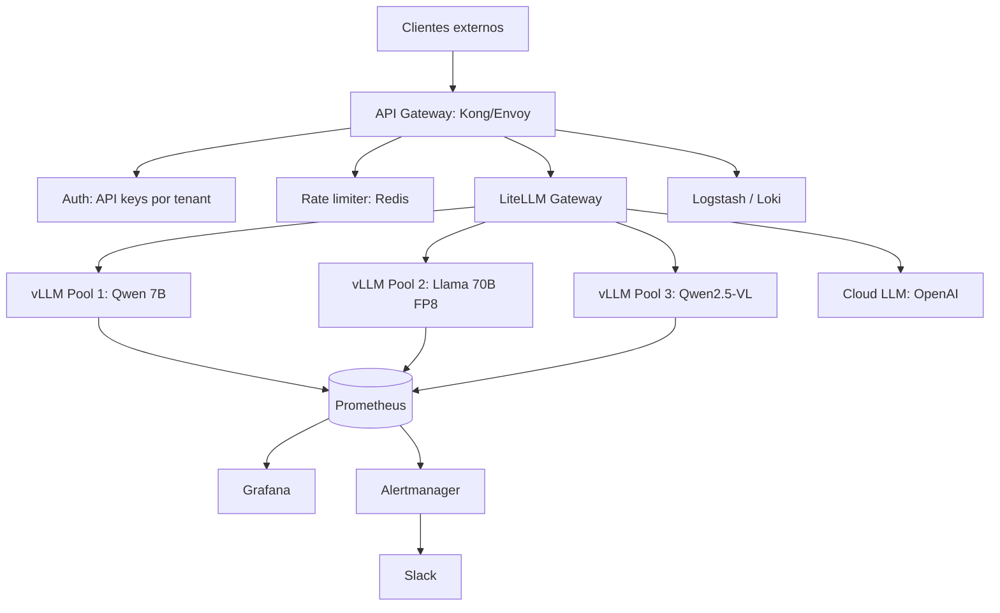
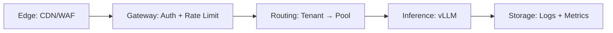

# 🏗️ Caso Práctico: API Multi-Tenant de LLMs en Producción

Este módulo integra todo el curso en un sistema end-to-end: una API multi-tenant de LLMs que sirve múltiples modelos a clientes distintos, con autenticación, rate limiting, routing inteligente, monitoring, y disaster recovery. Es la culminación del curso: del `vllm serve` en una laptop a un SaaS real.

---

## 1. Arquitectura del sistema



### 1.1 Componentes

| Componente | Función | Tecnología |
|------------|---------|------------|
| API Gateway | Routing, auth, rate limit | Kong, Envoy, custom |
| LiteLLM | Unificación de providers, fallback | Python service |
| vLLM pools | Inferencia especializada | vLLM servers |
| Redis | Rate limit, cache | Redis |
| Prometheus | Métricas | Prometheus |
| Grafana | Visualización | Grafana |
| Alertmanager | Alertas | Alertmanager |
| Logs | Centralización | ELK / Loki |

### 1.2 Capas del sistema



---

## 2. Estructura del proyecto

```
llm-platform/
├── infra/
│   ├── docker-compose.yml          # dev local
│   ├── docker-compose.prod.yml     # producción
│   ├── k8s/
│   │   ├── vllm-pools/
│   │   │   ├── qwen-7b.yaml
│   │   │   ├── llama-70b-fp8.yaml
│   │   │   └── qwen-vl.yaml
│   │   ├── litellm/
│   │   │   └── deployment.yaml
│   │   ├── redis.yaml
│   │   └── ingress.yaml
│   ├── helm/
│   │   └── values.yaml
│   └── terraform/
│       └── gpu-pools/
├── gateway/
│   ├── auth.py
│   ├── rate_limit.py
│   ├── routing.py
│   ├── main.py
│   └── tests/
├── models/
│   ├── pools.yaml
│   └── routing-rules.yaml
├── config/
│   ├── tenants.yaml                # definición de tenants
│   ├── limits.yaml                 # rate limits por tier
│   └── alerts.yaml
├── scripts/
│   ├── deploy.sh
│   ├── smoke-test.sh
│   └── benchmark.sh
├── tests/
│   ├── integration/
│   ├── load/
│   └── chaos/
├── Makefile
└── README.md
```

---

## 3. Configuración de tenants

### 3.1 Definición de tiers

```yaml
# config/tenants.yaml
tenants:
  - id: acme-corp
    name: "ACME Corporation"
    api_key_hash: "sha256:abcd1234..."  # nunca el key en claro
    tier: enterprise
    limits:
      rpm: 10000            # requests por minuto
      tpm: 5000000          # tokens por minuto
      concurrent: 200       # requests simultáneas
    allowed_models:
      - qwen-7b
      - llama-70b-fp8
      - qwen-vl
    cost_center: "eng-ai-platform"
  
  - id: startup-xyz
    name: "Startup XYZ"
    api_key_hash: "sha256:efgh5678..."
    tier: pro
    limits:
      rpm: 1000
      tpm: 500000
      concurrent: 20
    allowed_models:
      - qwen-7b
      - qwen-vl
    cost_center: "self-serve"
  
  - id: free-tier-user
    tier: free
    limits:
      rpm: 60
      tpm: 30000
      concurrent: 2
    allowed_models:
      - qwen-7b
```

### 3.2 Definición de pools de modelos

```yaml
# models/pools.yaml
pools:
  - name: qwen-7b
    backend: vllm
    url: http://vllm-qwen-7b:8000
    model_id: "Qwen/Qwen2.5-7B-Instruct"
    capabilities: [chat, completion, embeddings]
    resources:
      gpu: A100
      memory_util: 0.9
      max_num_seqs: 256
    cost_per_1k_tokens: 0.0001  # USD
  
  - name: llama-70b-fp8
    backend: vllm
    url: http://vllm-llama-70b:8000
    model_id: "meta-llama/Llama-3.1-70B-Instruct-FP8"
    capabilities: [chat, completion]
    resources:
      gpu: H100
      memory_util: 0.92
      max_num_seqs: 64
    cost_per_1k_tokens: 0.001
  
  - name: qwen-vl
    backend: vllm
    url: http://vllm-qwen-vl:8000
    model_id: "Qwen/Qwen2.5-VL-7B-Instruct"
    capabilities: [chat, vision]
    resources:
      gpu: A100
      memory_util: 0.9
      max_num_seqs: 128
    cost_per_1k_tokens: 0.0002
```

### 3.3 Routing rules

```yaml
# models/routing-rules.yaml
rules:
  # Tier enterprise puede usar todo
  - match:
      tier: enterprise
    action:
      strategy: cost-optimized  # elige el pool más barato que satisfaga
      fallback_chain:
        - llama-70b-fp8
        - qwen-7b
  
  # Tier pro no tiene acceso a 70B
  - match:
      tier: pro
    action:
      strategy: capability-match
      allowed_pools: [qwen-7b, qwen-vl]
  
  # Free solo Qwen 7B
  - match:
      tier: free
    action:
      strategy: capability-match
      allowed_pools: [qwen-7b]
      max_output_tokens: 500
```

---

## 4. Gateway con autenticación y rate limiting

### 4.1 Servicio principal

```python
# gateway/main.py
"""API Gateway para LLM multi-tenant."""
from __future__ import annotations

import asyncio
import time
from contextlib import asynccontextmanager

import httpx
import yaml
from fastapi import Depends, FastAPI, Header, HTTPException, Request
from fastapi.responses import StreamingResponse

from .auth import verify_api_key, get_tenant
from .rate_limit import check_rate_limit
from .routing import select_pool


# Cargar configuración al inicio
with open("config/tenants.yaml") as f:
    TENANTS = {t["id"]: t for t in yaml.safe_load(f)["tenants"]}

with open("models/pools.yaml") as f:
    POOLS = {p["name"]: p for p in yaml.safe_load(f)["pools"]}


@asynccontextmanager
async def lifespan(app: FastAPI):
    app.state.client = httpx.AsyncClient(timeout=httpx.Timeout(60.0, read=300.0))
    yield
    await app.state.client.aclose()


app = FastAPI(title="LLM Gateway", lifespan=lifespan)


@app.post("/v1/chat/completions")
async def chat_completions(
    request: Request,
    authorization: str = Header(...),
):
    # 1) Auth
    api_key = authorization.replace("Bearer ", "")
    tenant = await get_tenant(api_key, TENANTS)
    if not tenant:
        raise HTTPException(401, "Invalid API key")
    
    # 2) Body
    body = await request.json()
    model = body.get("model", "qwen-7b")
    
    # 3) Verificar acceso al modelo
    if model not in tenant["allowed_models"] and model != "default":
        if model not in [p["model_id"] for p in POOLS.values() if p["name"] in tenant["allowed_models"]]:
            raise HTTPException(403, f"Model {model} not allowed for tier {tenant['tier']}")
    
    # 4) Rate limit
    tokens_est = len(body.get("messages", [])) * 100  # heurística simple
    await check_rate_limit(tenant, tokens_est)
    
    # 5) Routing
    pool = select_pool(tenant, model, POOLS)
    
    # 6) Forward
    target_url = f"{pool['url']}/v1/chat/completions"
    
    if body.get("stream", False):
        return StreamingResponse(
            stream_response(app.state.client, target_url, body, tenant),
            media_type="text/event-stream",
        )
    else:
        return await forward_request(app.state.client, target_url, body, tenant)


async def forward_request(client, url, body, tenant):
    """Forward non-streaming request."""
    t0 = time.time()
    response = await client.post(url, json=body)
    latency = time.time() - t0
    
    # Logging
    log_request(tenant, body, response, latency)
    
    return response.json()


async def stream_response(client, url, body, tenant):
    """Forward streaming request."""
    t0 = time.time()
    total_tokens = 0
    async with client.stream("POST", url, json=body) as response:
        async for line in response.aiter_lines():
            if line:
                yield line + "\n\n"
                if "data: " in line and "[DONE]" not in line:
                    # parse para contar tokens
                    ...
    
    log_request(tenant, body, None, time.time() - t0)


def log_request(tenant, body, response, latency):
    """Log a una fuente centralizada."""
    # JSON a stdout, luego recogido por Promtail/Fluentd
    print({
        "tenant": tenant["id"],
        "model": body.get("model"),
        "latency": latency,
        "tokens": response.usage.total_tokens if response else 0,
        "ts": time.time(),
    })


if __name__ == "__main__":
    import uvicorn
    uvicorn.run(app, host="0.0.0.0", port=8080)
```

### 4.2 Auth

```python
# gateway/auth.py
import hashlib
from typing import Optional

# En producción, esto vive en una DB cifrada, no en YAML
API_KEYS = {
    "sk-acme-corp-12345": "sha256:abcd1234...",
    "sk-startup-xyz-67890": "sha256:efgh5678...",
}


def hash_key(key: str) -> str:
    return hashlib.sha256(key.encode()).hexdigest()


async def get_tenant(api_key: str, tenants: dict) -> Optional[dict]:
    """Resuelve API key → tenant."""
    expected_hash = API_KEYS.get(api_key)
    if not expected_hash:
        return None
    
    # Buscar tenant por hash
    for tenant in tenants.values():
        if tenant.get("api_key_hash") == expected_hash:
            return tenant
    return None
```

### 4.3 Rate limiting con Redis

```python
# gateway/rate_limit.py
import time

import redis.asyncio as redis

# Conectar
_redis: redis.Redis | None = None


async def init_redis():
    global _redis
    _redis = redis.from_url("redis://redis:6379")


async def check_rate_limit(tenant: dict, tokens: int):
    """Verifica RPM y TPM por tenant."""
    if _redis is None:
        await init_redis()
    
    tenant_id = tenant["id"]
    limits = tenant["limits"]
    now = int(time.time())
    minute = now // 60
    
    # Token bucket: increment + expire
    pipe = _redis.pipeline()
    
    # Requests counter
    pipe.incr(f"rl:{tenant_id}:req:{minute}")
    pipe.expire(f"rl:{tenant_id}:req:{minute}", 90)
    
    # Tokens counter
    pipe.incrby(f"rl:{tenant_id}:tok:{minute}", tokens)
    pipe.expire(f"rl:{tenant_id}:tok:{minute}", 90)
    
    results = await pipe.execute()
    req_count = results[0]
    tok_count = results[2]
    
    if req_count > limits["rpm"]:
        raise HTTPException(429, f"Rate limit exceeded: {limits['rpm']} RPM")
    if tok_count > limits["tpm"]:
        raise HTTPException(429, f"Token rate limit exceeded: {limits['tpm']} TPM")
```

### 4.4 Routing

```python
# gateway/routing.py
import random
from typing import Optional


def select_pool(tenant: dict, requested_model: str, pools: dict) -> dict:
    """Selecciona el pool óptimo para el tenant y modelo."""
    allowed = tenant["allowed_models"]
    
    # 1) Si pidió un modelo específico que está permitido
    for pool_name, pool in pools.items():
        if pool_name in allowed and (
            pool["model_id"] == requested_model
            or requested_model == pool_name
        ):
            return pool
    
    # 2) Si pidió un modelo pero no está permitido, usar default
    default_pool = pools.get(allowed[0]) if allowed else None
    if not default_pool:
        raise ValueError(f"No pools available for tenant {tenant['id']}")
    
    return default_pool
```

---

## 5. vLLM pools con Kubernetes

### 5.1 Pool de Qwen 7B (multi-réplica)

```yaml
# infra/k8s/vllm-pools/qwen-7b.yaml
apiVersion: apps/v1
kind: Deployment
metadata:
  name: vllm-qwen-7b
spec:
  replicas: 3
  selector:
    matchLabels:
      app: vllm-qwen-7b
  template:
    metadata:
      labels:
        app: vllm-qwen-7b
        pool: qwen-7b
    spec:
      nodeSelector:
        nvidia.com/gpu.product: NVIDIA-A100-SXM4-80GB
      containers:
      - name: vllm
        image: vllm/vllm-openai:latest
        command: ["vllm", "serve"]
        args:
          - "Qwen/Qwen2.5-7B-Instruct"
          - "--port=8000"
          - "--max-model-len=8192"
          - "--max-num-seqs=256"
          - "--max-num-batched-tokens=4096"
          - "--enable-chunked-prefill"
          - "--enable-prefix-caching"
          - "--gpu-memory-utilization=0.92"
          - "--dtype=bfloat16"
        ports:
        - containerPort: 8000
        resources:
          requests:
            nvidia.com/gpu: 1
            memory: "32Gi"
          limits:
            nvidia.com/gpu: 1
            memory: "48Gi"
        livenessProbe:
          httpGet: {path: /health, port: 8000}
          periodSeconds: 10
        readinessProbe:
          httpGet: {path: /ready, port: 8000}
          periodSeconds: 5
        startupProbe:
          httpGet: {path: /ready, port: 8000}
          periodSeconds: 10
          failureThreshold: 60
        lifecycle:
          preStop:
            exec:
              command: ["sleep", "10"]
      terminationGracePeriodSeconds: 60
---
apiVersion: v1
kind: Service
metadata:
  name: vllm-qwen-7b
spec:
  selector:
    pool: qwen-7b
  ports:
  - port: 8000
    targetPort: 8000
```

### 5.2 Pool de Llama 70B FP8 (con TP)

```yaml
# infra/k8s/vllm-pools/llama-70b-fp8.yaml
apiVersion: apps/v1
kind: Deployment
metadata:
  name: vllm-llama-70b
spec:
  replicas: 2  # 2 réplicas, cada una con 4 GPUs
  selector:
    matchLabels:
      app: vllm-llama-70b
  template:
    metadata:
      labels:
        app: vllm-llama-70b
        pool: llama-70b-fp8
    spec:
      nodeSelector:
        nvidia.com/gpu.product: NVIDIA-H100-80GB-HBM3
        nvidia.com/gpu.count: "4"  # asegurar 4 GPUs disponibles
      containers:
      - name: vllm
        image: vllm/vllm-openai:latest
        command: ["vllm", "serve"]
        args:
          - "meta-llama/Llama-3.1-70B-Instruct-FP8"
          - "--port=8000"
          - "--tensor-parallel-size=4"
          - "--max-model-len=16384"
          - "--max-num-seqs=64"
          - "--kv-cache-dtype=fp8"
          - "--enable-chunked-prefill"
          - "--enable-prefix-caching"
        resources:
          requests:
            nvidia.com/gpu: 4
            memory: "200Gi"
          limits:
            nvidia.com/gpu: 4
            memory: "320Gi"
        # ... health checks
```

### 5.3 Pool de Qwen-VL

```yaml
# infra/k8s/vllm-pools/qwen-vl.yaml
apiVersion: apps/v1
kind: Deployment
metadata:
  name: vllm-qwen-vl
spec:
  replicas: 2
  selector:
    matchLabels:
      app: vllm-qwen-vl
  template:
    spec:
      nodeSelector:
        nvidia.com/gpu.product: NVIDIA-A100-SXM4-80GB
      containers:
      - name: vllm
        args:
          - "Qwen/Qwen2.5-VL-7B-Instruct"
          - "--port=8000"
          - "--max-model-len=16384"
          - "--limit-mm-per-prompt=image=4"
          - "--max-num-seqs=128"
```

---

## 6. Observabilidad

### 6.1 Métricas del gateway

```python
# gateway/main.py
from prometheus_client import Counter, Histogram, generate_latest

REQUESTS_TOTAL = Counter(
    "gateway_requests_total",
    "Total requests by tenant, model, and status",
    ["tenant", "model", "status"]
)
REQUEST_LATENCY = Histogram(
    "gateway_request_latency_seconds",
    "Request latency by tenant and model",
    ["tenant", "model"],
    buckets=[0.1, 0.25, 0.5, 1, 2, 5, 10, 30, 60]
)
TOKENS_TOTAL = Counter(
    "gateway_tokens_total",
    "Total tokens by tenant, model, and type",
    ["tenant", "model", "type"]  # type: prompt, completion
)


@app.middleware("http")
async def metrics_middleware(request: Request, call_next):
    start = time.time()
    response = await call_next(request)
    latency = time.time() - start
    
    tenant = request.state.tenant if hasattr(request.state, "tenant") else "unknown"
    model = request.state.model if hasattr(request.state, "model") else "unknown"
    
    REQUESTS_TOTAL.labels(
        tenant=tenant,
        model=model,
        status=response.status_code
    ).inc()
    REQUEST_LATENCY.labels(tenant=tenant, model=model).observe(latency)
    
    return response


@app.get("/metrics")
def metrics():
    return Response(generate_latest(), media_type="text/plain")
```

### 6.2 Alertas de producción

```yaml
# config/alerts.yaml
groups:
- name: gateway
  rules:
  - alert: HighLatency
    expr: |
      histogram_quantile(0.99, 
        rate(gateway_request_latency_seconds_bucket{tenant="acme-corp"}[5m])
      ) > 5
    for: 5m
    annotations:
      summary: "ACME Corp p99 latency > 5s"
  
  - alert: TenantQuotaExhausted
    expr: |
      rate(rl_acme-corp_req_total[1m]) > 8000
    for: 2m
    annotations:
      summary: "ACME Corp approaching 10k RPM limit"
  
  - alert: HighErrorRate
    expr: |
      rate(gateway_requests_total{status=~"5.."}[5m]) /
      rate(gateway_requests_total[5m]) > 0.05
    for: 5m
    annotations:
      summary: "Error rate > 5%"
  
  - alert: PoolUnhealthy
    expr: up{job="vllm-qwen-7b"} == 0
    for: 1m
    annotations:
      summary: "Qwen 7B pool unhealthy"
  
  - alert: CostAnomaly
    expr: |
      rate(gateway_tokens_total[1h]) * 0.0001 > 100
    for: 1h
    annotations:
      summary: "Hourly cost > $100"
```

---

## 7. Testing

### 7.1 Smoke test

```python
# tests/integration/test_smoke.py
import pytest
from openai import OpenAI


@pytest.fixture
def client():
    return OpenAI(
        base_url="http://gateway:8080/v1",
        api_key="sk-acme-corp-12345",
    )


def test_health(client):
    """Verifica que el gateway responde."""
    # No hay endpoint /health, pero una llamada barata lo confirma
    response = client.chat.completions.create(
        model="qwen-7b",
        messages=[{"role": "user", "content": "Di 'OK'."}],
        max_tokens=10,
    )
    assert "OK" in response.choices[0].message.content or response.choices[0].message.content


def test_rate_limit(client):
    """Verifica rate limiting."""
    # Hacer 100 requests rápidos
    for _ in range(100):
        try:
            client.chat.completions.create(
                model="qwen-7b",
                messages=[{"role": "user", "content": "ok"}],
                max_tokens=5,
            )
        except Exception as e:
            if "429" in str(e):
                return  # esperado
            raise
    # Si llegamos aquí sin 429, free tier no está limitado o somos enterprise
    # Ajustar el test según tier


def test_auth_required():
    """Sin API key debe fallar."""
    from openai import OpenAI
    client = OpenAI(base_url="http://gateway:8080/v1", api_key="")
    with pytest.raises(Exception):
        client.chat.completions.create(
            model="qwen-7b",
            messages=[{"role": "user", "content": "hi"}],
        )
```

### 7.2 Load test con Locust

```python
# tests/load/locustfile.py
from locust import HttpUser, task, between


class LLMUser(HttpUser):
    wait_time = between(1, 3)
    
    def on_start(self):
        self.client.headers["Authorization"] = f"Bearer {self.environment.parsed_options.api_key}"
    
    @task(10)
    def chat_short(self):
        self.client.post(
            "/v1/chat/completions",
            json={
                "model": "qwen-7b",
                "messages": [{"role": "user", "content": "Hola"}],
                "max_tokens": 50,
            },
        )
    
    @task(3)
    def chat_long(self):
        self.client.post(
            "/v1/chat/completions",
            json={
                "model": "qwen-7b",
                "messages": [
                    {"role": "system", "content": "Eres un asistente detallado." * 50},
                    {"role": "user", "content": "Explica quantum computing."},
                ],
                "max_tokens": 500,
            },
        )
    
    @task(1)
    def vision(self):
        # Skip si no hay imagen disponible
        pass
```

```bash
# Correr load test
locust -f tests/load/locustfile.py \
  --host http://gateway:8080 \
  --api-key sk-acme-corp-12345 \
  --users 100 --spawn-rate 10 --run-time 5m
```

### 7.3 Chaos testing

```python
# tests/chaos/test_failover.py
"""Verifica que el sistema degrada gracefully cuando un pool falla."""


def test_pool_failover(gateway_client):
    """Si el pool 70B cae, debe hacer fallback al 7B."""
    # Inyectar fallo: kubectl delete pod vllm-llama-70b-0
    
    response = gateway_client.post(
        "/v1/chat/completions",
        json={
            "model": "llama-70b-fp8",
            "messages": [{"role": "user", "content": "test"}],
        },
    )
    
    # Debe responder (posiblemente con modelo fallback)
    assert response.status_code in (200, 503)
    
    # 503 solo si no hay fallback
    if response.status_code == 200:
        # Verificar que se usó el fallback
        assert response.json()["model"].startswith("Qwen")
```

---

## 8. Disaster recovery

### 8.1 Escenarios y respuestas

| Escenario | Impacto | Respuesta |
|-----------|---------|-----------|
| 1 pod muere | Pérdida de capacidad temporal | K8s levanta pod nuevo, otros absorben |
| GPU se cuelga | Pérdida de capacidad | dcgmi health check, drain, replace |
| Modelo corrupto | No arranca | PVC separado, re-descarga |
| Redis down | Rate limit no funciona | Fail-open (permite todo) + alerta |
| Gateway down | API no responde | Múltiples réplicas + LB |
| Toda la región down | Total | Multi-región con failover |

### 8.2 Backup de configuración

```bash
# Backup automático cada 6h
0 */6 * * * /scripts/backup-configs.sh

# scripts/backup-configs.sh
#!/usr/bin/env bash
set -euo pipefail

DATE=$(date +%Y%m%d_%H%M%S)
S3_BUCKET="s3://llm-platform-backups/configs"

aws s3 sync config/ "$S3_BUCKET/$DATE/config/" --exclude "*.local.yaml"
aws s3 sync infra/k8s/ "$S3_BUCKET/$DATE/k8s/"
aws s3 sync models/ "$S3_BUCKET/$DATE/models/"

# Retain solo últimos 30 días
aws s3 ls "$S3_BUCKET/" | while read -r line; do
    DATE_DIR=$(echo "$line" | awk '{print $2}' | tr -d '/')
    if [[ "$DATE_DIR" < "$(date -d '30 days ago' +%Y%m%d_%H%M%S)" ]]; then
        aws s3 rm --recursive "$S3_BUCKET/$DATE_DIR/"
    fi
done
```

### 8.3 Runbooks

```markdown
# Runbook: TTFT p99 > 2s

1. **Diagnosticar**:
   - Grafana: ver `gateway_request_latency_seconds` por pool
   - Prometheus: `histogram_quantile(0.99, rate(vllm:time_to_first_token_seconds_bucket[5m]))`
   - nvidia-smi: verificar GPU util y memory

2. **Si GPU util >90%**: el pool está saturado.
   - Acción: escalar réplicas (`kubectl scale deployment vllm-qwen-7b --replicas=5`)
   - Verificar: HPA debería hacerlo auto, pero en picos puede tardar

3. **Si GPU util <50%**: cuello de botella upstream.
   - Verificar: `kubectl logs` en gateway, ¿errores de timeout a vLLM?
   - Verificar: ¿Redis está respondiendo?
   - Acción: reiniciar gateway si es necesario

4. **Si errores en una sola tenant**: rate limit mal configurado.
   - Acción: revisar `tenants.yaml`, ajustar límites

5. **Escalación**: si nada funciona en 15 min, paginar on-call.
```

---

## 9. Cost tracking y billing

### 9.1 Tracking por tenant

```python
# gateway/billing.py
"""Calcula coste por request."""
import time

from fastapi import Request

from .auth import get_tenant
from .routing import select_pool


@app.middleware("http")
async def billing_middleware(request: Request, call_next):
    if "/v1/chat/completions" not in str(request.url):
        return await call_next(request)
    
    # Capturar request
    api_key = request.headers.get("Authorization", "").replace("Bearer ", "")
    tenant = await get_tenant(api_key, TENANTS)
    if not tenant:
        return await call_next(request)
    
    body = await request.json()
    pool = select_pool(tenant, body.get("model", "qwen-7b"), POOLS)
    cost_per_1k = pool["cost_per_1k_tokens"]
    
    # Forward
    response = await call_next(request)
    response_data = response.body if hasattr(response, "body") else None
    
    # Calcular coste
    if response_data and "usage" in response_data:
        usage = response_data["usage"]
        total_tokens = usage.get("total_tokens", 0)
        cost = total_tokens / 1000 * cost_per_1k
        
        # Enviar a sistema de billing
        BILLING_QUEUE.publish({
            "tenant_id": tenant["id"],
            "pool": pool["name"],
            "tokens": total_tokens,
            "cost_usd": cost,
            "ts": time.time(),
        })
    
    return response
```

### 9.2 Dashboard de costes

```yaml
# Grafana panel
queries:
  - title: "Coste por tenant (últimas 24h)"
    query: |
      sum by (tenant_id) (
        rate(billing_cost_usd_total[24h])
      )
  
  - title: "Coste por modelo"
    query: |
      sum by (pool) (
        rate(billing_cost_usd_total[1h])
      )
  
  - title: "Tokens por tenant (top 10)"
    query: |
      topk(10, 
        sum by (tenant_id) (rate(billing_tokens_total[1h]))
      )
```

---

## 10. Disaster recovery drill

Mensualmente, ejecuta un drill completo:

```bash
#!/usr/bin/env bash
# scripts/dr-drill.sh
set -euo pipefail

echo "=== DR Drill: Pool failure ==="

# 1) Cae un pod
echo "Killing pod..."
kubectl delete pod -l app=vllm-qwen-7b --grace-period=0

# 2) Verifica que el sistema responde (otros pods absorben)
sleep 5
HEALTH=$(curl -s -o /dev/null -w "%{http_code}" \
  -X POST http://gateway:8080/v1/chat/completions \
  -H "Authorization: Bearer sk-acme-corp-12345" \
  -H "Content-Type: application/json" \
  -d '{"model":"qwen-7b","messages":[{"role":"user","content":"hi"}],"max_tokens":5}')
echo "Health response: $HEALTH (expect 200)"

# 3) Verifica métricas
echo "Checking Prometheus..."
ERROR_RATE=$(curl -s 'http://prometheus:9090/api/v1/query?query=rate(gateway_requests_total{status="5.."}[1m])' | jq '.data.result[0].value[1] // "0"')
echo "Error rate during incident: $ERROR_RATE"

# 4) Verifica alerta disparada
echo "Checking Alertmanager..."
# ...

# 5) Reporte
echo "=== DR Drill complete ==="
```

---

## 11. Métricas operativas

### 11.1 SLI/SLO

| SLI | SLO target |
|-----|------------|
| Availability (success rate) | 99.9% mensual |
| TTFT p99 | < 1s |
| TPOT p99 | < 100ms |
| Throughput | > 1000 tokens/s |
| Error rate | < 0.5% |

### 11.2 Error budget

Con 99.9% availability, tienes 43 minutos de downtime al mes. Si te excedes, priorizas reliability sobre features.

---

## 12. Próximos pasos

Una vez operando este sistema, los siguientes movimientos naturales son:

1. **Multi-región**: deploy el mismo stack en 2-3 regiones con failover global.
2. **Fine-tuning on-demand**: usa el cluster para entrenar modelos custom por tenant.
3. **Agentic features**: añade módulos de agentes (function calling, RAG, etc.).
4. **Cost optimization**: introduce spot instances para pools no críticos.
5. **SLA diferenciado**: tier enterprise con GPU dedicada, tier pro con shared.
6. **Self-serve portal**: UI para que tenants vean uso, límites, costos.

---

## 📚 Recursos finales

### Documentación oficial

- [vLLM docs](https://docs.vllm.ai)
- [vLLM blog posts](https://blog.vllm.ai)
- [HuggingFace Hub](https://huggingface.co) — modelos
- [LiteLLM](https://github.com/BerriAI/litellm) — gateway
- [K8s + GPU](https://kubernetes.io/docs/concepts/extend-kubernetes/compute-storage-net/device-plugins/)

### Papers relevantes

- Kwon et al. (2023). "Efficient Memory Management for Large Language Model Serving with PagedAttention." SOSP.
- Pope et al. (2023). "Efficiently Scaling Transformer Inference." MLSys.
- Agrawal et al. (2023). "SARATHI: Efficient LLM Inference by Piggybacking Decodes with Chunked Prefills."

### Cursos relacionados en este vault

- [[../09 - Sistemas de LLMs en Produccion/00 - Bienvenida|Sistemas de LLMs en Producción]] — patrones de serving, gateways
- [[../12 - Production RAG/00 - Welcome to Production RAG|Production RAG]] — cómo construir RAG sobre vLLM
- [[../18 - TensorRT-LLM/00 - Welcome to TensorRT-LLM|TensorRT-LLM]] — alternativa NVIDIA pura
- [[../17 - ColBERT, SGLang and Next-Gen Inference/00 - Welcome|ColBERT, SGLang and Next-Gen Inference]] — técnicas avanzadas

¡Felicitaciones por completar el curso de vLLM Production Serving! Ahora tienes el conocimiento para operar un sistema de inferencia LLM a escala de producción.
