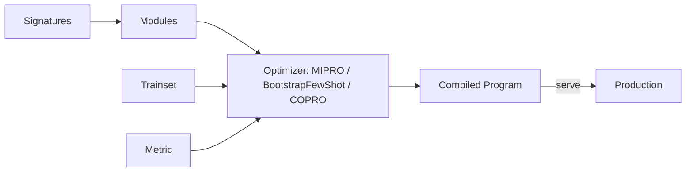

# 🧠 Welcome to DSPy and Prompt Compilation

You wrote a prompt: `"Given the context: {context}, answer the question: {query}"`. It works on 70% of your test cases. You tweak it: `"You are an expert assistant. Read the context carefully: {context}. Now answer: {query}. Be concise."`. 73%. You try three more variations. 71%, 75%, 73%. You give up. The prompt is **brittle**: small changes produce non-monotonic improvements, and you can't tell which tweaks generalize.

DSPy (Declarative Self-improving Python, Stanford NLP) replaces this manual loop with **prompt compilation**. You declare a **signature** (`question, context -> answer`), DSPy selects a **module** (ChainOfThought, ReAct, MultiChainComparison) and an **optimizer** (BootstrapFewShot, MIPRO, COPRO), and the optimizer **automatically finds the best prompt** for your training set. The result: a compiled DSPy program that **beats hand-tuned prompts by 20-50%** on common benchmarks, with reproducible results and zero manual effort.

This is the most important shift in LLM development since the introduction of function calling: **prompts become code that the compiler optimizes**, not text that humans tune. The course teaches you to use DSPy as the **compiler layer** on top of your existing RAG pipelines (10/33), LangGraph agents (07/18), and LLM gateways (06/19).

This is the **operational depth** that the existing notes touch but never make first-class. The [[../../../06 - Large Language Models/12 - Production RAG/00 - Welcome to Production RAG.md|Production RAG]] notes hand-write prompts. The [[../../../07 - AI Agents y Agentic Systems/17 - Production Agent Frameworks/00 - Welcome to Production Agent Frameworks.md|Production Agent Frameworks]] notes show how to swap frameworks. DSPy is the layer that **systematically improves** any of these — replacing the "tweak prompt and pray" loop with measured optimization.

## 🎯 Learning Objectives

- Master DSPy **Signatures** (declarative input/output schemas).
- Use **Modules** (ChainOfThought, ReAct, MultiChainComparison) for prompting patterns.
- Apply **Optimizers** (BootstrapFewShot, MIPRO, COPRO) to find the best prompts.
- Build **DSPy for RAG** with retrieval modules.
- Integrate **DSPy + LangGraph** for compiled agents.
- Apply **DSPy Assertions** for quality constraints.
- Deploy compiled DSPy programs to production with caching, cost control, and monitoring.

## Course Map

| # | Note | Core concept | Closes gap |
|:-:|------|--------------|------------|
| 00 | [[00 - Welcome to DSPy and Prompt Compilation\|You are here]] | Why "prompt engineering" loses to "prompt compilation" | Course map |
| 01 | [[01 - Signatures and Modules\|Signatures]] | Declarative I/O + module types | Gap #1 |
| 02 | [[02 - Optimizers - BootstrapFewShot MIPRO and COPRO\|Optimizers]] | Auto-optimization of prompts and few-shot examples | Gap #2 |
| 03 | [[03 - DSPy for RAG - Retrieval Modules and Signatures\|RAG with DSPy]] | Compiled retrieval pipelines | Gap #3 |
| 04 | [[04 - DSPy + LangGraph Integration\|LangGraph integration]] | Compiled agents inside state graphs | Gap #4 |
| 05 | [[05 - DSPy Assertions and Quality Constraints\|Assertions]] | Hard constraints on output | Gap #5 |
| 06 | [[06 - Production DSPy - Caching Costs Evaluation\|Production]] | Caching, cost control, deployment | Gap #6 |
| 07 | [[07 - Capstone - Compiled RAG Pipeline with DSPy\|Capstone]] | Production DSPy RAG system | Integration |

## Why DSPy Matters

The current state of LLM development is **prompt engineering by trial-and-error**. Industry research (Khattab et al., 2023, "DSPy: Compiling Declarative Language Model Calls into Self-Improving Pipelines") shows this approach plateaus quickly. DSPy replaces it with:

```python
# Pre-DSPy: hand-tuned prompt, brittle
prompt = "You are an expert. Given the context: {context}, answer: {query}. Be concise."
answer = llm.invoke(prompt.format(context=ctx, query=q))

# DSPy: compiled program, optimized for your data
class RAGSignature(dspy.Signature):
    """Answer a question using retrieved context."""
    context: list[str] = dspy.InputField()
    query: str = dspy.InputField()
    answer: str = dspy.OutputField()

program = dspy.ChainOfThought(RAGSignature)
compiled = teleprompter.compile(program, trainset=examples, metric=answer_f1)
result = compiled(context=ctx, query=q)
```

The compiled `compiled` program has been **automatically optimized** for your training data: the prompt, the few-shot examples, and even the choice of `ChainOfThought` vs `Predict` have been tuned. The result is **systematically better** than hand-written prompts.

## DSPy vs Other Frameworks

| Framework | Mental model | Compile time? | Notes |
|-----------|--------------|----------------|-------|
| **LangChain** | Composable chains | No | Manual prompt tuning |
| **LangGraph** | State machines | No | Manual prompt tuning |
| **CrewAI** | Role-based agents | No | Manual prompt tuning |
| **DSPy** | Declarative signatures | **Yes** | Optimizer finds prompts |
| **AutoPrompt** | Automatic prompt search | Yes | Narrower scope, no modules |
| **Guidance** | Constrained generation | No | Different problem |

DSPy is **complementary** to the others. You can run DSPy modules inside LangGraph nodes, use DSPy signatures inside CrewAI agents, or compose DSPy with LangChain tools. **DSPy optimizes the LLM call; the framework orchestrates.**

## The DSPy Compilation Loop



The four ingredients:
1. **Signatures**: declarative input/output (what goes in, what comes out).
2. **Modules**: prompt patterns (`Predict`, `ChainOfThought`, `ReAct`).
3. **Examples**: training data (input/output pairs).
4. **Metric**: how to measure success (F1, accuracy, faithfulness).

The optimizer combines them into a compiled program. **No human writes a prompt.**

## Prerequisites

- **Python 3.11+** with `pip install dspy-ai`.
- **LLM API keys** (OpenAI, Anthropic, or local model via Ollama).
- **RAG fundamentals** ([[../../../10 - Cloud, Infra y Backend/33 - Vector Databases and Semantic Search/00 - Welcome to Vector Databases and Semantic Search.md|10/33]]).
- **LangGraph** ([[../../../07 - AI Agents y Agentic Systems/18 - LangGraph Deep Patterns/00 - Welcome to LangGraph Deep Patterns.md|07/18]]) — for note 04 integration.

## How to Read This Course

1. **Notes 01-02** are the foundation: signatures, modules, optimizers.
2. **Notes 03-04** are the integration: RAG + LangGraph.
3. **Notes 05-06** are the production layer: assertions + deployment.
4. **Note 07** is the capstone.

## 📦 Compression Code

```python
# 📦 Welcome - DSPy RAG in 30 lines

import dspy
import os

# 1. Configure the LM
lm = dspy.LM("openai/gpt-4o-mini", api_key=os.environ["OPENAI_API_KEY"])
dspy.configure(lm=lm)

# 2. Declare the signature
class RAGSignature(dspy.Signature):
    """Answer a question using retrieved context."""
    context: list[str] = dspy.InputField(desc="Retrieved passages")
    query: str = dspy.InputField()
    answer: str = dspy.OutputField(desc="Concise, faithful answer")

# 3. Wrap in a module
class RAG(dspy.Module):
    def __init__(self):
        super().__init__()
        self.generate = dspy.ChainOfThought(RAGSignature)

    def forward(self, query: str, context: list[str]) -> dspy.Prediction:
        return self.generate(context=context, query=query)

# 4. Define training examples and metric
trainset = [
    dspy.Example(context=["Paris is the capital of France."], query="Capital of France?", answer="Paris").with_inputs("context", "query"),
    dspy.Example(context=["Tokyo is Japan's capital."], query="Capital of Japan?", answer="Tokyo").with_inputs("context", "query"),
]

def metric(example, prediction, trace=None) -> float:
    return float(example.answer.lower() in prediction.answer.lower())

# 5. Compile
from dspy.teleprompt import BootstrapFewShot
teleprompter = BootstrapFewShot(metric=metric, max_bootstrapped_demos=2)
compiled = teleprompter.compile(RAG(), trainset=trainset)

# 6. Use the compiled program
result = compiled(query="Capital of Spain?", context=["Madrid is Spain's capital."])
print(result.answer)
# Madrid
```

30 lines from "raw prompt" to "compiled program". **No human wrote a prompt.**

## References

- [[../../../06 - Large Language Models/12 - Production RAG/00 - Welcome to Production RAG.md|Production RAG]] — the RAG fundamentals DSPy compiles.
- [[../../../07 - AI Agents y Agentic Systems/18 - LangGraph Deep Patterns/00 - Welcome to LangGraph Deep Patterns.md|LangGraph Deep Patterns]] — for note 04 integration.
- DSPy docs: https://dspy.ai/
- Khattab et al. (2023). "DSPy: Compiling Declarative Language Model Calls into Self-Improving Pipelines."
- Stanford NLP: https://github.com/stanfordnlp/dspy