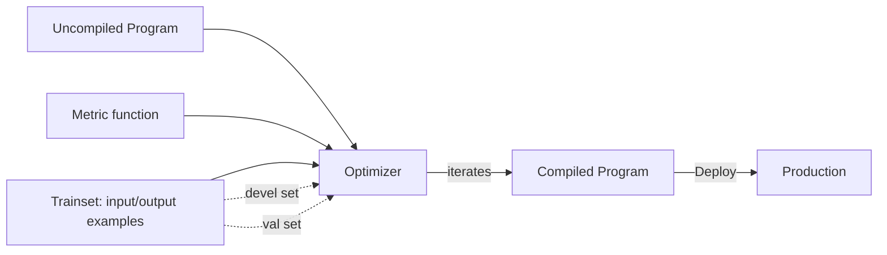

# ⚙️ Optimizers — BootstrapFewShot, MIPRO, and COPRO

You have a DSPy program (note 01). Now you need to **compile it** — find the best prompt and few-shot examples for your training data. The optimizer is the compiler. Three optimizers ship with DSPy, each with a different strategy:

- **BootstrapFewShot** — automatic few-shot example generation. Cheap, fast, good baseline.
- **MIPRO** — Bayesian optimization over prompt text. **State-of-the-art for prompt quality**.
- **COPRO** — coordinate-descent on prompt text. Middle ground.

This note teaches the algorithm behind each, the parameters that matter, and when to use which. By the end you can take any DSPy program and compile it with the right optimizer for your data size and budget.

## 🎯 Learning Objectives

- Understand the **algorithm behind each optimizer**: bootstrap, Bayesian, coordinate-descent.
- Configure **BootstrapFewShot** for fast auto-prompting.
- Apply **MIPRO** for state-of-the-art prompt quality.
- Use **COPRO** when MIPRO is too expensive.
- Pick the right optimizer by **data size, budget, and quality target**.
- Avoid the four most common optimizer pitfalls.

## 1. The Compilation Loop



Three ingredients:
- **Trainset**: input/output examples (e.g., 100 question-answer pairs).
- **Metric**: function `(example, prediction, trace=None) -> float`.
- **Devel set**: examples for the optimizer to tune on.
- **Val set** (optional): held-out examples for evaluation.

The optimizer runs many trials, evaluates each candidate program, and returns the best.

## 2. BootstrapFewShot — Automatic Few-Shot Examples

The simplest optimizer: **run your program on the trainset, collect successful traces, and use them as few-shot demos**. It's like prompt engineering by mining your training data.

```python
from dspy.teleprompt import BootstrapFewShot

# Your uncompiled program
class RAG(dspy.Module):
    def __init__(self):
        super().__init__()
        self.generate = dspy.ChainOfThought(QA)

    def forward(self, query, context):
        return self.generate(query=query, context=context)

# Metric
def answer_f1(example, prediction, trace=None):
    pred = prediction.answer.lower()
    truth = example.answer.lower()
    return float(truth in pred or pred in truth)

# Trainset
trainset = [
    dspy.Example(context=["Paris is the capital."], query="Capital of France?", answer="Paris").with_inputs("context", "query"),
    # ... 50-100 examples
]

# Compile
teleprompter = BootstrapFewShot(
    metric=answer_f1,
    max_bootstrapped_demos=4,    # max demos to bootstrap
    max_labeled_demos=2,         # max demos from labeled trainset
)
compiled = teleprompter.compile(RAG(), trainset=trainset)

# Use
result = compiled(query="Capital of Spain?", context=["Madrid is Spain's capital."])
```

**What it does:**
1. Run program on each trainset example.
2. If the prediction passes the metric, save the (input, output) as a candidate demo.
3. Select up to `max_bootstrapped_demos` diverse demos.
4. Add `max_labeled_demos` from the original labeled examples.
5. Inject the demos into each module's prompt.

**Cost**: ~`trainset_size × 1` LM calls. Fast (minutes for 100 examples).

**Use when**: small programs (1-3 modules), moderate data (50-200 examples), need a quick baseline.

## 3. MIPRO — Bayesian Optimization for Prompts

**MIPRO** (Multi-step Interactive PROmpt optimization) is **state-of-the-art** for prompt quality. It uses Bayesian optimization to search the space of:

- **Instruction text** ("Answer the question concisely" vs. "Provide a detailed answer" vs. ...)
- **Few-shot demos** (which examples to include)
- **Module selection** (for ReAct: when to use which tool)

```python
from dspy.teleprompt import MIPRO

# Configure
teleprompter = MIPRO(
    metric=answer_f1,
    auto="medium",     # "light" | "medium" | "heavy" — budget
    num_candidates=10, # number of candidate prompts to evaluate
)

# Compile with trainset + valset
compiled = teleprompter.compile(
    RAG(),
    trainset=trainset,    # for bootstrapping demos
    valset=valset,        # for evaluating candidates
    max_bootstrapped_demos=3,
    max_labeled_demos=2,
)

result = compiled(query="...", context=["..."])
```

**What it does:**
1. Generate candidate prompts by sampling from a set of instruction templates (provided or auto-generated).
2. For each candidate, evaluate on the valset.
3. Use **Optuna** (Bayesian optimization) to guide the search toward better candidates.
4. Repeat for `auto="light"` (50 trials), `medium` (150), or `heavy` (300).

**Cost**: `num_candidates × valset_size + 50-300 × optimization_iterations` LM calls. Slow (hours for 200 val examples × 150 trials).

**Use when**: quality matters more than cost; you have a valset; you want the best possible prompts.

### Configure the Search

```python
from dspy.teleprompt import MIPRO

# Custom: control the optimizer
teleprompter = MIPRO(
    metric=answer_f1,
    prompt_model=dspy.LM("openai/gpt-4o"),  # model that writes the prompts
    task_model=dspy.LM("openai/gpt-4o-mini"),  # model that executes the prompts
    num_candidates=10,    # trials per iteration
    init_temperature=1.0, # initial sampling temperature
)

# Auto presets
teleprompter = MIPRO(metric=answer_f1, auto="medium")
```

## 4. COPRO — Coordinate Descent

**COPRO** (Coordinate-descent PROmpt optimization) optimizes **each module's prompt independently**. For each module, it generates candidate instructions, evaluates each on the trainset, picks the best, and moves to the next module.

```python
from dspy.teleprompt import COPRO

teleprompter = COPRO(
    metric=answer_f1,
    depth=3,    # depth of optimization (higher = more iterations)
    breadth=4,  # candidates per module per iteration
)
compiled = teleprompter.compile(
    RAG(),
    trainset=trainset,
    eval_kwargs={"num_threads": 4},
)
```

**Cost**: `modules × depth × breadth × valset_size` LM calls. Moderate.

**Use when**: multi-module programs (ReAct, agent loops), need per-module optimization, want middle ground between Bootstrap and MIPRO.

## 5. The Optimizer Choice Matrix

| Optimizer | Cost (LM calls) | Quality | When to use |
|-----------|------------------|---------|-------------|
| **BootstrapFewShot** | Low (1× trainset) | Good | Small programs, 50-200 examples, fast baseline |
| **MIPRO** | High (10-300× valset) | **Best** | Multi-module programs, have a valset, quality > cost |
| **COPRO** | Medium (depth × breadth × valset) | Better | Modular programs, per-module tuning |

```python
# Default: start with BootstrapFewShot for baseline
from dspy.teleprompt import BootstrapFewShot
baseline = BootstrapFewShot(metric=metric, max_bootstrapped_demos=4).compile(program, trainset)

# Then upgrade to MIPRO for production
from dspy.teleprompt import MIPRO
production = MIPRO(metric=metric, auto="medium").compile(program, trainset, valset)
```

## 6. The Trainset / Valset / Testset Split

```python
# 100 examples total
all_examples = [...]  # 100 examples

# Split: 60% train, 20% val (for optimizer), 20% test (held-out for final eval)
splitter = lambda examples, pct: examples[:int(len(examples) * pct)]

trainset = splitter(all_examples, 0.6)   # 60 examples
valset = splitter(all_examples[60:], 0.5)  # 20 examples (out of 40 remaining)
testset = all_examples[80:]              # 20 examples
```

| Set | Use | Don't |
|-----|-----|-------|
| `trainset` | BootstrapFewShot demos, MIPRO bootstrapping | Evaluate the optimizer itself |
| `valset` | MIPRO candidate evaluation, COPRO per-module tuning | Final accuracy |
| `testset` | Final accuracy after compilation | Train anything on it |

## 7. The Metric Function

The metric is the optimizer's "what does good look like?" function:

```python
def metric_simple(example, prediction, trace=None) -> float | bool:
    """Returns a score (0.0-1.0) or a boolean."""
    pred = prediction.answer.lower()
    truth = example.answer.lower()
    return 1.0 if truth in pred else 0.0

def metric_f1(example, prediction, trace=None) -> float:
    """F1 score for QA tasks."""
    pred_tokens = set(prediction.answer.lower().split())
    truth_tokens = set(example.answer.lower().split())
    if not pred_tokens or not truth_tokens:
        return 0.0
    precision = len(pred_tokens & truth_tokens) / len(pred_tokens)
    recall = len(pred_tokens & truth_tokens) / len(truth_tokens)
    return 2 * precision * recall / (precision + recall)

def metric_faithfulness(example, prediction, trace=None) -> float:
    """Custom metric: check if prediction cites evidence."""
    pred = prediction.answer.lower()
    if "evidence" in pred or "according to" in pred or "[" in pred:
        return 1.0
    return 0.0
```

> 💡 **Tip:** The metric is the **most important** choice in compilation. A wrong metric = wrong optimizer. For RAG, use `answer_f1` + `faithfulness` (via RAGAS). For classification, use exact match + macro-F1.

## 8. Saving and Loading Compiled Programs

```python
compiled.save("compiled_program.json")
program = RAG()
program.load("compiled_program.json")

# Inspect the compiled prompt
print(compiled.detailed_instructions)
print(compiled.demos)
```

## 9. The Cost Breakdown (Real Numbers)

| Step | LM calls | Cost (gpt-4o-mini) |
|------|----------|---------------------|
| Bootstrap (100 examples) | 100 | $0.05 |
| MIPRO medium (200 val × 150 trials) | 30,000 | $15 |
| Total | — | **$15.05** |

MIPRO can dominate the total cost by 99%. **For tight budgets, BootstrapFewShot gives 80% of the value at 1% of the cost.**

## 10. ❌/✅ Antipatterns

### ❌ Choosing MIPRO for a 10-example dataset

```python
# ⚠️ MIPRO overfits with too few examples
compiled = MIPRO(metric=metric, auto="medium").compile(program, trainset=trainset[:10])
```

### ✅ BootstrapFewShot for small datasets, MIPRO for 100+

```python
if len(trainset) < 50:
    compiled = BootstrapFewShot(...).compile(...)
else:
    compiled = MIPRO(...).compile(...)
```

### ❌ Optimizing on test set

```python
# ⚠️ Optimizer meta-overfits to test set
compiled = MIPRO(...).compile(program, trainset=testset)
```

### ✅ Trainset + separate valset

```python
compiled = MIPRO(...).compile(program, trainset=trainset, valset=valset)
```

### ❌ Wrong metric

```python
# ⚠️ Metric doesn't reflect quality
def metric_wrong(example, prediction, trace=None):
    return float(len(prediction.answer) > 10)  # rewards length, not accuracy
```

### ✅ Metric aligned with goals

```python
def metric_correct(example, prediction, trace=None):
    return float(example.answer.lower() in prediction.answer.lower())
```

### ❌ Missing cost consideration

```python
# ⚠️ Compile took 6 hours and $200
compiled = MIPRO(metric=metric, auto="heavy").compile(program, trainset, valset)
```

### ✅ Start small, scale up

```python
# BootstrapFewShot first; MIPRO only if quality is insufficient
compiled_v1 = BootstrapFewShot(...).compile(...)
score_v1 = evaluate(compiled_v1, testset)

if score_v1 < target:
    compiled_v2 = MIPRO(...).compile(...)  # upgrade only if needed
```

## 11. Production Reality

**Caso real — Production RAG Project:** Used BootstrapFewShot for the first compiled version (v1, 78% faithfulness). Switched to MIPRO when the team wanted to push past 85% — v2 reached 90% faithfulness at a $12 compile cost. The compiled program is now in production; **no human writes prompts** for the RAG system.

**Caso real — Multi-Agent Research System:** Compiled the research node with MIPRO. Tool selection accuracy: 64% (hand-tuned) → 81% (BootstrapFewShot) → 88% (MIPRO, custom tool descriptions). Total compile cost: $35 over 2 hours. **The optimizer found non-obvious tool descriptions** that no team member would have written.

## 📦 Compression Code

```python
# 📦 Compression: Compilation in 50 lines

import dspy
import os

lm = dspy.LM("openai/gpt-4o-mini", api_key=os.environ["OPENAI_API_KEY"])
dspy.configure(lm=lm)


class QA(dspy.Signature):
    """Answer using context."""
    context: list[str] = dspy.InputField()
    query: str = dspy.InputField()
    answer: str = dspy.OutputField()


class RAG(dspy.Module):
    def __init__(self):
        super().__init__()
        self.generate = dspy.ChainOfThought(QA)

    def forward(self, query, context):
        return self.generate(query=query, context=context)


# Trainset
trainset = [
    dspy.Example(context=["Paris is France's capital."], query="Capital of France?", answer="Paris").with_inputs("context", "query"),
    # ...
]


def metric(example, prediction, trace=None):
    return float(example.answer.lower() in prediction.answer.lower())


# Compile (start with BootstrapFewShot)
from dspy.teleprompt import BootstrapFewShot
compiled = BootstrapFewShot(metric=metric, max_bootstrapped_demos=4).compile(RAG(), trainset)

# Use
result = compiled(query="Capital of Spain?", context=["Madrid is Spain's capital."])
print(result.answer)

# Save
compiled.save("compiled_rag.json")
```

## 🎯 Key Takeaways

1. **BootstrapFewShot = fast baseline** — auto-generated demos, low cost, good for small data.
2. **MIPRO = state-of-the-art quality** — Bayesian search over prompts; expensive, requires valset.
3. **COPRO = per-module optimization** — middle ground for multi-module programs.
4. **Right metric is critical** — wrong metric = wrong optimizer.
5. **Trainset / valset / testset split** — 60/20/20 minimum.
6. **Start with Bootstrap, scale to MIPRO** — 80% of value at 1% of cost.
7. **Compiled programs are JSON** — save, load, version them.

## References

- [[00 - Welcome to DSPy and Prompt Compilation|Welcome]] — course map.
- [[01 - Signatures and Modules|Signatures]] — the input to compilation.
- [[03 - DSPy for RAG|RAG]] — the retrieval module compilation.
- [[04 - DSPy + LangGraph Integration|LangGraph]] — compiled agents in graphs.
- DSPy optimizers: https://dspy.ai/learn/optimization/
- MIPRO paper: https://arxiv.org/abs/2406.11695