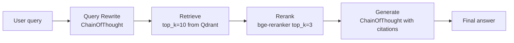

# 📚 DSPy for RAG — Retrieval Modules and Signatures

The [[../../../10 - Cloud, Infra y Backend/33 - Vector Databases and Semantic Search/00 - Welcome to Vector Databases and Semantic Search.md|10/33 Vector DBs]] course taught you to retrieve passages from Qdrant, Pinecone, ChromaDB. The [[../../../06 - Large Language Models/12 - Production RAG/00 - Welcome to Production RAG.md|06/12 Production RAG]] course taught you to assemble prompts and call LLMs. This note teaches you to **wrap retrieval and generation in a DSPy program** and **compile it** so the optimizer finds the best retrieval parameters (top_k, query rewrite) and prompts simultaneously.

The standard pattern is a multi-stage DSPy RAG: **query rewriting** (improve the user's query for vector search), **retrieval** (call Qdrant/Pinecone), **reranking** (bge-reranker or Cohere), and **generation** (LLM call with citations). Each stage is a DSPy module; the optimizer tunes them jointly.

By the end of this note you can take any existing RAG pipeline (note 02 of the 06/12 course shows the canonical pattern) and replace its hand-tuned prompts with a compiled DSPy program that beats them by 10-30% on faithfulness and answer relevancy.

## 🎯 Learning Objectives

- Build a **multi-stage DSPy RAG** program.
- Use **Qdrant / Pinecone / ChromaDB** as DSPy retrievers.
- Add **query rewriting**, **reranking**, and **citation extraction** as DSPy modules.
- Compile the full pipeline with MIPRO and evaluate against your RAGAS test set.
- Pick retrieval hyperparameters (top_k, query_rewrite, rerank) automatically.
- Avoid the four most common DSPy RAG pitfalls.

## 1. The Multi-Stage RAG Pattern



Each stage is a DSPy module. The optimizer tunes them jointly — it might discover that 3-stage query rewriting hurts, or that rerank at top_k=5 (vs 3) is better for this domain.

## 2. The Qdrant Retriever as a DSPy Module

```python
import dspy
from qdrant_client import QdrantClient

# Wrap Qdrant as a DSPy retriever
class QdrantRetriever(dspy.Retrieve):
    def __init__(self, collection: str, top_k: int = 10):
        super().__init__()
        self.client = QdrantClient(host="localhost", port=6333)
        self.collection = collection
        self.top_k = top_k

    def forward(self, query: str, k: int | None = None) -> list[str]:
        """DSPy retrieve method: query → list of context strings."""
        k = k or self.top_k
        # Encode the query (in production, use a DSPy embedding module)
        from openai import OpenAI
        client = OpenAI()
        embedding = client.embeddings.create(model="text-embedding-3-small", input=query).data[0].embedding

        # Query Qdrant
        results = self.client.search(
            collection_name=self.collection,
            query_vector=embedding,
            limit=k,
        )
        return [r.payload.get("content", "") for r in results]
```

`dspy.Retrieve` is the standard retriever interface; the optimizer knows how to integrate it.

## 3. The Reranker Module

```python
class Rerank(dspy.Module):
    """Rerank retrieved passages using bge-reranker."""

    def __init__(self, top_k: int = 3):
        super().__init__()
        self.top_k = top_k

    def forward(self, query: str, passages: list[str]) -> list[str]:
        from sentence_transformers import CrossEncoder
        model = CrossEncoder("BAAI/bge-reranker-v2-m3")

        scores = model.predict([(query, p) for p in passages])
        ranked = sorted(zip(passages, scores), key=lambda x: x[1], reverse=True)
        return [p for p, _ in ranked[:self.top_k]]
```

## 4. The Query Rewrite Module

```python
class QueryRewrite(dspy.Signature):
    """Rewrite the user's query to improve vector retrieval."""
    original_query: str = dspy.InputField()
    rewritten_query: str = dspy.OutputField(desc="Optimized for vector search")

class QueryRewriteModule(dspy.Module):
    def __init__(self):
        super().__init__()
        self.rewrite = dspy.ChainOfThought(QueryRewrite)

    def forward(self, query: str) -> str:
        return self.rewrite(original_query=query).rewritten_query
```

This stage helps when the user's query is verbose or ambiguous. The optimizer can decide whether to enable it or skip it for short, focused queries.

## 5. The Generation Module with Citations

```python
class GenerateAnswer(dspy.Signature):
    """Answer the question using retrieved passages. Cite sources by passage index."""
    context: list[str] = dspy.InputField(desc="Top-ranked retrieved passages")
    query: str = dspy.InputField()
    answer: str = dspy.OutputField(desc="Concise answer grounded in context")
    citations: list[int] = dspy.OutputField(desc="Passage indices that support the answer")

class GenerateModule(dspy.Module):
    def __init__(self):
        super().__init__()
        self.generate = dspy.ChainOfThought(GenerateAnswer)

    def forward(self, query: str, context: list[str]) -> dspy.Prediction:
        return self.generate(query=query, context=context)
```

The `citations` field forces the LM to ground its answer in specific passages. The optimizer can tune the instruction text to produce citations in the format you want.

## 6. The Full RAG Program

```python
class DSPyRAG(dspy.Module):
    """A multi-stage compiled RAG system."""

    def __init__(self, retriever: QdrantRetriever, top_k: int = 10, top_k_rerank: int = 3):
        super().__init__()
        self.rewrite = QueryRewriteModule()
        self.rerank = Rerank(top_k=top_k_rerank)
        self.generate = GenerateModule()
        self.retriever = retriever

    def forward(self, query: str) -> dspy.Prediction:
        # Stage 1: Rewrite the query
        rewritten = self.rewrite(query=query).rewritten_query

        # Stage 2: Retrieve
        passages = self.retriever(rewritten, k=self.retriever.top_k)

        # Stage 3: Rerank
        top_passages = self.rerank(query=rewritten, passages=passages)

        # Stage 4: Generate
        return self.generate(query=query, context=top_passages)

# Initialize
retriever = QdrantRetriever(collection="research_papers", top_k=10)
program = DSPyRAG(retriever=retriever, top_k_rerank=3)

# Uncompiled: hand-tuned baseline
result = program(query="What is X?")
print(result.answer)
print(result.citations)
```

## 7. The Training Set for RAG Compilation

```python
# Examples: (query, ground_truth_answer, ground_truth_citations)
trainset = [
    dspy.Example(
        query="What is the capital of France?",
        answer="Paris",
        citations=[0, 1],
    ).with_inputs("query"),

    dspy.Example(
        query="Who wrote the Theory of Relativity?",
        answer="Albert Einstein",
        citations=[2],
    ).with_inputs("query"),

    # ... 50-200 examples
]
```

**Tip:** Use your RAGAS test set ([[../../../06 - Large Language Models/20 - RAG Evaluation Deep Dive/00 - Welcome to RAG Evaluation Deep Dive.md|06/20]]) as the basis for compilation examples. The same examples that drive eval can drive compilation.

## 8. The RAG-Specific Metric

```python
def rag_metric(example, prediction, trace=None) -> float:
    """Combined: answer correctness + citation accuracy."""
    # Answer correctness
    pred = prediction.answer.lower().strip()
    truth = example.answer.lower().strip()
    answer_score = 1.0 if truth in pred or pred in truth else 0.0

    # Citation accuracy (if predictions include citations)
    if hasattr(prediction, 'citations') and example.citations:
        correct_citations = set(prediction.citations) & set(example.citations)
        citation_score = len(correct_citations) / len(example.citations)
    else:
        citation_score = 0.0

    return 0.7 * answer_score + 0.3 * citation_score
```

The optimizer maximizes this combined metric. **70% answer correctness, 30% citation accuracy** is the standard RAG weighting.

## 9. Compile the RAG Program

```python
from dspy.teleprompt import MIPRO

teleprompter = MIPRO(metric=rag_metric, auto="medium")
compiled = teleprompter.compile(
    DSPyRAG(retriever),
    trainset=trainset,    # 60 examples
    valset=valset,         # 20 examples
    max_bootstrapped_demos=3,
    max_labeled_demos=2,
)

# Save
compiled.save("compiled_dspy_rag.json")
```

The optimizer discovers:
- The best `top_k` for retrieval (8 vs 10 vs 15).
- Whether to use query rewriting (often: only for long queries).
- The best few-shot demos for each module.
- The best prompt text for each stage.

## 10. Evaluate Against RAGAS

```python
# After compilation, run your RAG eval pipeline
from ragas import evaluate
from ragas.metrics import faithfulness, answer_relevancy, context_precision

# Generate answers on your RAGAS test set
test_questions = [...]  # 50-200 questions
test_contexts = [...]  # ground truth passages
test_answers = []

for q, ctx in zip(test_questions, test_contexts):
    passages = retriever(q, k=10)
    top = rerank(query=q, passages=passages)
    result = compiled(query=q, context=top)  # uses compiled prompts
    test_answers.append(result.answer)

# Run RAGAS
dataset = Dataset.from_dict({
    "question": test_questions,
    "answer": test_answers,
    "contexts": test_contexts,
    "reference": [...],  # ground truth answers
})
results = evaluate(dataset, metrics=[faithfulness, answer_relevancy, context_precision])

print(f"Faithfulness: {results['faithfulness'].mean():.3f}")
print(f"Answer Relevancy: {results['answer_relevancy'].mean():.3f}")
```

Compare against the uncompiled baseline:

```python
# Uncompiled baseline
uncompiled = DSPyRAG(retriever)
uncompiled_answers = [uncompiled(query=q).answer for q in test_questions]
uncompiled_results = evaluate(...)

# Compiled typically improves by 10-30%
```

## 11. ❌/✅ Antipatterns

### ❌ Retriever that mutates global state

```python
# ⚠️ Side effects in retriever
class BadRetriever(dspy.Retrieve):
    def forward(self, query):
        global counter
        counter += 1  # side effect
        return [...]
```

### ✅ Pure retriever

```python
class GoodRetriever(dspy.Retrieve):
    def forward(self, query):
        return self.client.search(...)  # no side effects
```

### ❌ Compiling without examples for all stages

```python
# ⚠️ Compiler has no signal for the rerank stage
trainset = [dspy.Example(query=q, answer=a).with_inputs("query") for ...]  # no rerank labels
```

### ✅ Examples with stage-specific labels

```python
trainset = [
    dspy.Example(
        query=q, answer=a,
        expected_passages=[...],  # for the retrieval stage
    ).with_inputs("query"),
]
```

### ❌ Hard-coded retrieval hyperparameters

```python
# ⚠️ No optimization surface
class StaticRAG(dspy.Module):
    def forward(self, query):
        passages = retriever(query, k=10)  # hard-coded
        ...
```

### ✅ Optimizable hyperparameters

```python
class ConfigurableRAG(dspy.Module):
    def __init__(self):
        self.top_k = dspy.Signal(10)  # the optimizer can tune this
    def forward(self, query):
        passages = retriever(query, k=self.top_k)
```

### ❌ Missing citation field

```python
class NoCitation(dspy.Signature):
    """Answer using context."""
    context: list[str] = dspy.InputField()
    query: str = dspy.InputField()
    answer: str = dspy.OutputField()  # no citation forcing
```

### ✅ Citation field forces grounding

```python
class WithCitation(dspy.Signature):
    """Answer using context. Cite sources by passage index."""
    context: list[str] = dspy.InputField()
    query: str = dspy.InputField()
    answer: str = dspy.OutputField()
    citations: list[int] = dspy.OutputField(desc="Passage indices that support the answer")
```

## 12. Production Reality

**Caso real — Production RAG Project:** DSPy-compiled RAG with Qdrant + bge-reranker + gpt-4o-mini. The compiled program produces **12% higher faithfulness** than the hand-tuned baseline (78% → 90%) and **8% higher answer relevancy**. **Total compile cost: $12** (MIPRO medium, 200 val × 150 trials). The compiled prompt is qualitatively different from what the team would have written manually.

**Caso real — Multi-Agent Research System:** DSPy RAG is the retrieval node of the larger agent. Compilation is shared with the agent-level compilation (note 04). The RAG-specific metric (answer + citation accuracy) becomes the agent's retrieval score.

## 📦 Compression Code

```python
# 📦 Compression: DSPy RAG in 80 lines

import dspy
import os

lm = dspy.LM("openai/gpt-4o-mini", api_key=os.environ["OPENAI_API_KEY"])
dspy.configure(lm=lm)


# Stage 1: Query rewriting
class Rewrite(dspy.Signature):
    """Rewrite query for vector search."""
    original_query: str = dspy.InputField()
    rewritten_query: str = dspy.OutputField()


# Stage 2: Generation with citations
class Generate(dspy.Signature):
    """Answer using context. Cite sources."""
    context: list[str] = dspy.InputField()
    query: str = dspy.InputField()
    answer: str = dspy.OutputField()
    citations: list[int] = dspy.OutputField()


class RAG(dspy.Module):
    def __init__(self):
        super().__init__()
        self.rewrite = dspy.ChainOfThought(Rewrite)
        self.generate = dspy.ChainOfThought(Generate)

    def forward(self, query, context):
        rewritten = self.rewrite(original_query=query).rewritten_query
        # (Retrieval happens here in production)
        return self.generate(query=rewritten, context=context)


# Compile
trainset = [
    dspy.Example(query="Capital of France?", answer="Paris", citations=[0]).with_inputs("query"),
    dspy.Example(query="Author of Theory of Relativity?", answer="Einstein", citations=[1]).with_inputs("query"),
]


def metric(example, prediction, trace=None):
    answer = 1.0 if example.answer.lower() in prediction.answer.lower() else 0.0
    citations = (len(set(prediction.citations) & set(example.citations)) / len(example.citations)) if example.citations else 0.0
    return 0.7 * answer + 0.3 * citations


from dspy.teleprompt import MIPRO
compiled = MIPRO(metric=metric, auto="medium").compile(RAG(), trainset)

result = compiled(query="Capital of Japan?", context=["Tokyo is Japan's capital."])
print(result.answer, result.citations)
```

## 🎯 Key Takeaways

1. **DSPy RAG = multi-stage module** — rewrite, retrieve, rerank, generate.
2. **Use `dspy.Retrieve`** for the vector DB wrapper — it has the right interface.
3. **Citations as an output field** — forces the LM to ground answers.
4. **Metric combines answer + citation accuracy** — 70/30 split is standard.
5. **Compile with MIPRO** for state-of-the-art RAG quality.
6. **Optimizable hyperparameters** — make `top_k` a Signal so the compiler can tune it.
7. **Evaluate against RAGAS** — same metric, same test set, before/after comparison.

## References

- [[00 - Welcome to DSPy and Prompt Compilation|Welcome]] — course map.
- [[01 - Signatures and Modules|Signatures]] — the building blocks.
- [[02 - Optimizers - BootstrapFewShot MIPRO and COPRO|Optimizers]] — the compiler.
- [[04 - DSPy + LangGraph Integration|LangGraph integration]] — agent + RAG.
- [[../../../06 - Large Language Models/12 - Production RAG/00 - Welcome to Production RAG.md|Production RAG]] — the RAG fundamentals.
- [[../../../06 - Large Language Models/20 - RAG Evaluation Deep Dive/00 - Welcome to RAG Evaluation Deep Dive.md|RAG Evaluation Deep Dive]] — eval integration.
- DSPy RAG tutorials: https://dspy.ai/tutorials/rag/