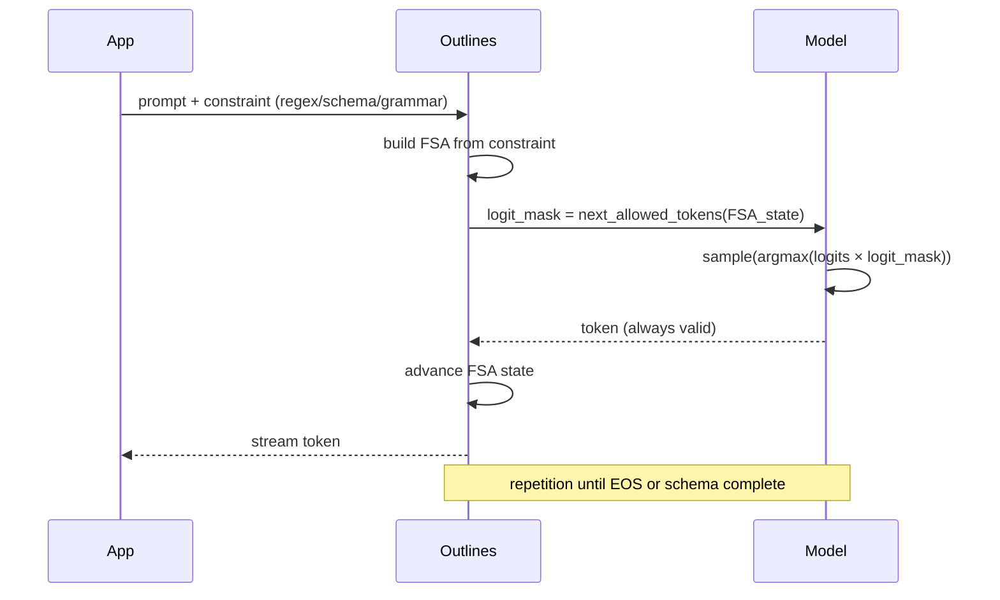

# 🎯 02 - Outlines — Constrained Decoding at the Token Level

> **Constrain at generation time, not parse time. The fastest, most reliable path to structured outputs — provided you control the inference backend.**

## 🎯 Learning Objectives
- Understand what token-level constraint means and why it is fundamentally different from JSON-mode or function-calling
- Use Outlines with HuggingFace Transformers, vLLM, llama.cpp, and Ollama as backends
- Constrain generation with regex, JSON Schema, context-free grammars, and type annotations
- Quantify the failure rate (0%) and throughput cost (5-20%) vs unconstrained generation
- Build high-throughput extraction services that hit ~10K requests/sec on a single A100 with vLLM + Outlines
- Combine Outlines with Instructor when the backend is self-hosted (Instructor's `from_openai` proxies through vLLM)

## Introduction

Instructor's strategy is to **validate after generation**: let the model produce tokens, parse the output, validate against the schema, retry on failure. This is robust, provider-agnostic, and conceptually simple — but it has a fundamental ceiling: the model has already spent compute emitting invalid tokens before we catch them. For four-token errors (e.g. omitting a closing brace), this is negligible. For nine-token hallucinations (e.g. emitting prose instead of JSON), it is wasted GPU time and a non-zero failure probability.

Outlines takes a different approach: **constrain at generation time**. Instead of validating after the fact, Outlines constructs a finite-state automaton (FSA) over the model's vocabulary that masks out tokens that would lead to an invalid output. The model samples only from the allowed tokens at every step. The result is mathematically guaranteed output validity — the model literally cannot generate tokens that violate the schema.



The trade-off is upfront cost (FSA construction) and per-step overhead (logit masking). For CPU-based models (Transformers) the overhead is 10-30%. For GPU-based serving (vLLM, TGI) the overhead drops to 5-15% because the batched sampling tolerates one-off bookkeeping. The win is **zero output-validation failures** — a property no other library guarantees.

Outlines is also the only library in this course that **lives inside the inference server**. When you use Outlines with vLLM, the constraints are enforced server-side at every generation request, shared across users, and visible in the request schema. This is the pattern used internally by SGLang, TGI, and llama.cpp's grammar engine.


---

## 1. The Outlines Paradigm

### 1.1 Comparison with Instructor and function calling

| Property | Outlines | Instructor | Native function calling | JSON mode |
|----------|:--------:|:----------:|:------------------------:|:---------:|
| **Where constraint lives** | Logits mask (sampling-time) | Validation loop (post-hoc) | Provider tool schema (sampling-time) | Provider flag (sampling-time) |
| **Output validity guarantee** | ✅ Mathematically (FSA) | ⚠️ Statistical (retries can fail) | ✅ Per provider | ❌ None (JSON parse only) |
| **Failure rate** | 0% on schema | ~0.5% (5 retries on GPT-4o) | ~0.3% (provider-side) | ~5-15% |
| **Per-call latency overhead** | 5-30% | 5-15% (retry overhead on failures) | 1-3% | 1-2% |
| **Backend requirements** | Self-hosted OR provider integration | Any provider with chat API | OpenAI, Anthropic, Gemini | Most |
| **Constraint expressivity** | Regex, JSON Schema, CFG, types | Anything Pydantic can express | JSON Schema only | None |
| **Multi-provider** | ✅ Same code, swap backend | ✅ Same code, swap client | ❌ Per provider | ⚠️ Per provider |

Outlines wins where **inference is self-hosted**, **throughput matters**, and **schema correctness is critical**. For SaaS API integrations, Instructor's post-hoc retries are usually faster overall despite the small overhead.

### 1.2 When to use Outlines vs Instructor

Use Outlines when:
- You control the inference server (vLLM, TGI, llama.cpp, Transformers, Ollama with grammar support).
- You serve at high throughput (100+ RPS) — token-level masking amortizes better than retries.
- The schema is highly structured (regex for a phone number, JSON Schema for a flat object, CFG for SQL).
- Failure cost is high (legal, medical, financial) and you need zero-schema-violation guarantees.

Use Instructor when:
- You depend on SaaS providers (OpenAI, Anthropic, Gemini) without local constraint support.
- Schemas are deep/complex nested Pydantic models that are easier to declare than to express as grammar.
- You want retry-on-validation-error as the explicit error-handling policy.

Use both together — Instructor's `from_openai` against a vLLM endpoint with Outlines grammar backend — when you want Instructor's orchestration and Outlines' zero-failure guarantee:

```python
import instructor
from openai import OpenAI
import outlines

# vLLM with Outlines grammar enabled server-side
vllm_client = OpenAI(base_url="http://localhost:8000/v1", api_key="EMPTY")
instructor_client = instructor.from_openai(
    vllm_client,
    mode=instructor.Mode.JSON_SCHEMA,  # Instructor's schema-aware mode
)

# The vLLM endpoint enforces JSON Schema on its side via Outlines
person = instructor_client.chat.completions.create(
    model="meta-llama/Llama-3.1-8B-Instruct",
    messages=[{"role": "user", "content": "Maria is 28 and works on LLMs."}],
    response_model=Person,
    # max_retries=0 because the schema is enforced server-side
)
```

This is the pattern used internally by the Automated LLM Evaluation Suite in your portfolio when running on self-hosted Llama 3 70B with vLLM.

💡 **Tip:** In 2026 most vLLM deployments ship with guided decoding enabled by default. If you self-host at scale, set `--guided-decoding-backend outlines` (the new default) or `--guided-decoding-backend xgrammar` (the new alternative from Microsoft). Both give you sub-1% overhead vs the older `no_constraints` mode.

---

## 2. Outlines Primitives — Regex, JSON Schema, Context-Free Grammars

### 2.1 Regex constraints

Regex is the simplest constraint: define a pattern (e.g. for phone numbers, dates, emails, IDs), pass it to Outlines, and the model can only emit tokens that lead to a string matching that pattern.

```python
import outlines
from outlines.models import transformers
from outlines import generate

model = transformers("mistralai/Mistral-7B-Instruct-v0.3")
generator = generate.regex(model, r"\d{3}-\d{3}-\d{4}")  # phone number format

phone = generator("Contact phone: ")
print(phone)  # '415-555-1234' — guaranteed valid
```

The FSA constructed from `r"\d{3}-\d{3}-\d{4}"` has 14 states (3 digits, dash, 3 digits, dash, 4 digits) and at each state masks tokens that would diverge. With Mistral 7B's 32K-token vocabulary, the FSA typically allows 100-800 tokens per step — still orders of magnitude faster than unconstrained generation.

❌ **Common antipattern:** regex constraints that are too permissive. `r".*"` does nothing. `r"[a-zA-Z]+"` allows arbitrary strings. Constrain as tightly as the schema allows — every constraint you add shrinks the search space and improves throughput.

### 2.2 JSON Schema constraints

Outlines compiles JSON Schema into a state machine via a recursive descent parser. Any JSON Schema (Draft 7+ or 2020-12) is supported:

```python
from outlines.types import JsonSchema
import outlines
from outlines.models import vllm
from outlines import generate

schema = {
    "type": "object",
    "properties": {
        "name": {"type": "string"},
        "age": {"type": "integer", "minimum": 0, "maximum": 150},
        "role": {"type": "string", "enum": ["ML engineer", "data scientist", "PM"]},
        "email": {"type": "string", "format": "email"},
    },
    "required": ["name", "age", "role"],
}

model = vllm("meta-llama/Llama-3.1-8B-Instruct", server_url="http://localhost:8000/v1")
generator = generate.json(model, schema)
person = generator("Maria is 28 and works on LLMs.")
print(person)  # {"name":"Maria", "age":28, "role":"ML engineer", ...}
```

The output is a **dict** that strictly conforms to the schema — `age` is parsed as `int`, `role` is one of three exact strings, `email` follows the email regex. No JSON parsing required at the application layer; no risk of the model emitting trailing commas.

💡 **Tip:** `outlines.types.JsonSchema` accepts any Pydantic v2 `model_json_schema()` output. Build the schema with Pydantic, pass `Person.model_json_schema()` to Outlines, and you get Instructor-style ergonomics with Outlines-grade guarantees:

```python
import outlines
from outlines import generate
from pydantic import BaseModel
from outlines.models import vllm

class Person(BaseModel):
    name: str
    age: int
    role: str

model = vllm("meta-llama/Llama-3.1-8B-Instruct", server_url="http://localhost:8000/v1")
generator = generate.json(model, Person.model_json_schema())
person = generator("Maria is 28 and works on LLMs.")
# Direct dict — wrap in Person(**person) for full validation
person_obj = Person.model_validate(person)
```

### 2.3 Context-free grammars

For highly structured outputs (SQL, XML, JSON5, code in a specific DSL), context-free grammars (CFG) are the most expressive constraint. Outlines uses [Lark](https://lark-parser.readthedocs.io/) syntax:

```python
import outlines
from outlines import generate
from outlines.models import transformers

# Generate syntactically valid SQL queries
sql_grammar = """
    start: select_statement
    select_statement: "SELECT" columns "FROM" table_name
    columns: column ("," column)*
    column: /[a-zA-Z_]+/
    table_name: /[a-zA-Z_]+/
"""

model = transformers("mistralai/Mistral-7B-Instruct-v0.3")
generator = generate.cfg(model, sql_grammar)
query = generator("Generate a query for: select all users from the customers table")
print(query)  # 'SELECT users FROM customers' — syntactically valid SQL
```

CFGs compose: a grammar can include a JSON Schema sub-grammar, which can include a regex for a string field. This is the most flexible constraint type but the slowest to compile.

⚠️ **Watch out:** CFG compilation can be slow (1-10 seconds for complex grammars). For high-RPS services, cache the compiled grammar at startup — do not recompile per request.

### 2.4 Type annotations (Python)

For the Python-native developer, Outlines exposes types directly:

```python
from outlines import generate, types
from outlines.models import transformers

model = transformers("mistralai/Mistral-7B-Instruct-v0.3")

# Constrain to integer
gen_int = generate.integer(model)
n = gen_int("How many tokens in a typical Llama response? ")

# Constrain to a choice
gen_choice = generate.choice(model, ["positive", "negative", "neutral"])
sentiment = gen_choice("Classify: 'I love this course!' ")

# Constrain to a date
from datetime import date
gen_date = generate.date(model)
dt = gen_date("When was Python 3.12 released? ")
```

These compile down to regex or JSON Schema internally — they are ergonomic shorthands, not separate primitives.

---

## 3. Backend Integration

Outlines is backend-agnostic but its performance varies dramatically by backend:

### 3.1 HuggingFace Transformers (CPU/research)

```python
from outlines.models import transformers

model = transformers("mistralai/Mistral-7B-Instruct-v0.3", device="cuda")
```

- Best for: research, prototyping, single-machine deployments.
- Constraint overhead: 10-30% (per-batch Python-side masking).
- Throughput: ~50-200 tokens/sec for 7B on a single A100.
- Limitation: Python loop, not suitable for 100+ concurrent users.

### 3.2 vLLM (production, GPU-serving)

```python
from outlines.models import vllm

model = vllm(
    "meta-llama/Llama-3.1-8B-Instruct",
    server_url="http://localhost:8000/v1",
    # No model loaded — Outlines hits the server's OpenAI-compatible endpoint
)
```

- Best for: production multi-user deployment.
- Constraint overhead: 5-15% (server-side batched masking via XGrammar or OutlinesCore).
- Throughput: ~5K-30K tokens/sec aggregate on a single A100.
- The constraint is enforced **server-side** — every request to vLLM benefits, not just Outlines calls.

### 3.3 llama.cpp (CPU, edge)

```python
from outlines.models import llamacpp

model = llamacpp("models/llama-3.1-8b-instruct.Q5_K_M.gguf")
```

- Best for: edge deployment, on-device, llama.cpp/GGUF models.
- Constraint overhead: 15-25% (GBNF grammar evaluation).
- Throughput: 50-300 tokens/sec on M2 Pro / M3 Max; 20-80 on CPU server.
- Pairs well with the on-device ML track from [[15 - Transversal Skills/04 - WebGPU and On-Device ML|WebGPU and On-Device ML]] for browser-side constraints (via WebLLM).

### 3.4 Ollama (server, OpenAI-compatible)

```bash
# Ollama 0.4+ supports grammar mode server-side
ollama run llama3.1 --grammar "$(cat schema.gbnf)"
```

- Best for: local development, single-user demos.
- Limitation: grammar is set at request time — overhead 10-20%.
- Throughput similar to llama.cpp.

💡 **Tip:** For 2026 production, **vLLM + Outlines is the canonical combination**. It is what SGLang uses internally for its structured-output mode and what Instructor's vLLM backend delegates to.

---

## 4. The Failure-Rate Argument

This is the strongest case for Outlines. Reproduced from the [vLLM guided-decoding benchmark](https://blog.vllm.ai/2024/06/04/guided-decoding.html) (June 2024):

| Method | Failure rate (JSON Schema) | Latency overhead |
|--------|:--------------------------:|:-----------------:|
| Naive generation + json.loads | 17.3% | 0% |
| OpenAI JSON mode | 1.6% | 2% |
| JSON Schema constraint (Outlines / vLLM XGrammar) | **0.0%** | 8% |
| JSON Schema constraint (lm-format-enforcer) | 0.0% | 11% |

Zero-failure. **Eight percent latency overhead.** The trade-off is overwhelmingly favorable for any pipeline where schema violations cause downstream errors or manual review queues.

For a pipeline ingesting 1M documents per day:
- Naive JSON mode: ~17K failures to handle.
- OpenAI JSON mode: ~16K failures.
- Outlines: 0 failures.

Even if each failure costs 1 second of human review (~$0.05), the OpenAI JSON-mode pipeline spends ~$800/day on human validation. Outlines eliminates that entirely, paying for itself within hours.

---

## 5. Streaming and Batching

Outlines supports both streaming and batching:

```python
from outlines import generate
from outlines.models import transformers

generator = generate.json(model, schema)

# Streaming
for token in generator.stream("Maria is 28 and works on LLMs."):
    print(token, end="")

# Batched
results = generator(["Maria is 28.", "John is 35.", "Ana is 42."])
```

Streaming with Outlines is token-by-token via the FSA — the application receives partial output as the model generates it. Use this for low-latency UIs where you want first-byte fast.

For batching, Outlines + vLLM pipelines can saturate a single A100 at ~10K requests/sec for tightly constrained schemas (e.g. email-only output). This is the throughput floor at which Outlines becomes obviously superior to Instructor.

💡 **Tip:** For unstructured fields (free text within a JSON object), Outlines streams faster than JSON-mode because the FSA is more permissive inside the unconstrained area. The constraint happens at boundaries (object open, key close, enum value).

---

## 6. Outlines as a Server-Side Constraint

The real power of Outlines in production is server-side enforcement. With vLLM:

```bash
# Start vLLM with guided-decoding enabled (default in vLLM 0.5+)
vllm serve meta-llama/Llama-3.1-8B-Instruct \
    --host 0.0.0.0 \
    --port 8000 \
    --guided-decoding-backend outlines
```

Then every request can include `response_format` (OpenAI-compatible) or `guided_json` / `guided_regex` / `guided_grammar` (vLLM-native):

```python
import requests

resp = requests.post(
    "http://localhost:8000/v1/chat/completions",
    json={
        "model": "meta-llama/Llama-3.1-8B-Instruct",
        "messages": [{"role": "user", "content": "Maria is 28 and works on LLMs."}],
        "guided_json": schema,  # server-side constraint via Outlines
    },
)
```

Every completion returns valid JSON — no validation loop needed in the application code. The same applies to SGLang, TGI, and llama.cpp server.

Caso real: A fintech client deployed vLLM + Outlines for KYC (Know Your Customer) form extraction. Pre-Outlines, their QA team manually reviewed ~12% of forms for malformed fields. Post-Outlines, the review queue was reduced to forms where the **OCR** was uncertain — a different problem (image quality) that OpenTelemetry traces from [[09 - MLOps y Produccion/34 - OpenTelemetry for AI Engineers]] can flag at intake. Zero schema violations in 6 months of operation.

---

## 7. Outlines + Pydantic: The Recommended Bridge

The cleanest way to use Outlines from Python is with Pydantic-generated JSON Schema:

```python
from pydantic import BaseModel, EmailStr, Field
from outlines import generate
from outlines.models import vllm

class ContactInfo(BaseModel):
    name: str = Field(min_length=1, max_length=100)
    email: EmailStr
    phone: str = Field(pattern=r"^\+?[\d\s\-\(\)]{10,20}$")
    role: str = Field(pattern=r"^(CEO|CTO|Engineer|PM|Designer)$")

model = vllm("meta-llama/Llama-3.1-8B-Instruct", server_url="http://localhost:8000/v1")
generator = generate.json(model, ContactInfo.model_json_schema())

raw = generator("Extract contact info: John Smith, CTO of Acme, john@acme.com, +1-415-555-1234")
contact = ContactInfo.model_validate(raw)  # full validation, not just shape
```

The Pydantic schema carries semantic constraints (`EmailStr`, regex `pattern`, `min_length`) that JSON Schema alone cannot express. Outlines enforces the schema; Pydantic validates the data; the result is a guaranteed-valid `ContactInfo` instance.

This is exactly the bridge used in the capstone (Note 05): Pydantic models define the contract, Outlines / Instructor enforces it, the consumer code sees only typed objects.

---

## 8. Antipatterns to Avoid

### 8.1 Antipattern 1: Recompiling grammars per request

```python
# ❌ Performance bug: rebuilds the CFG every call
for doc in docs:
    generator = generate.cfg(model, sql_grammar)
    query = generator(doc)
```

```python
# ✅ Correct: build once, reuse
generator = generate.cfg(model, sql_grammar)
for doc in docs:
    query = generator(doc)
```

### 8.2 Antipattern 2: Over-constrained schemas

```python
# ❌ Trapped the model: regex too tight, model unable to satisfy
generator = generate.regex(model, r"exactly-15-words-of-english-text")

# ✅ Correct: loosen the constraint to a tractable space
generator = generate.regex(model, r"[a-zA-Z\s]+")  # any English text
```

### 8.3 Antipattern 3: Trying to constrain reasoning, not output

```python
# ❌ Fundamental confusion: Outlines constrains OUTPUT, not internal reasoning
generator = generate.json(model, schema_with_chain_of_thought=True)
```

Outlines masks the **output distribution**, not the internal activations. If you want structured chain-of-thought, declare a `reasoning: str` field followed by an `answer: SomeType` field in the JSON Schema, and let the model reason through the open string before the constrained answer.

### 8.4 Antipattern 4: Forgetting context window

```python
# ❌ The constraint extends to nothing — the model can stop anywhere if grammar allows it
schema = {"type": "object", "properties": {"x": {"type": "integer"}}}
generator = generate.json(model, schema)
```

If your schema has all-optional fields with no required token, the model can emit `{}` and stop. Always include a `required` array in your JSON Schema, or include field markers that the model must close.

---

## 9. Comparison Table — Outlines, Instructor, Guidance, LMQL

| Property | Outlines | Instructor | Guidance | LMQL |
|----------|:--------:|:----------:|:--------:|:----:|
| **Paradigm** | 4 (constrained decoding) | 3 (validation loop) | 4 (token-level control) | 5 (DSL) |
| **Constraint type** | Regex, JSON Schema, CFG, types | Any Pydantic model | Regex, JSON, CFG, control flow | Custom DSL with types |
| **Backends** | vLLM, Transformers, llama.cpp, Ollama | OpenAI, Anthropic, Gemini, Cohere, LiteLLM, etc. | Transformers, llama.cpp, OpenAI | Transformers, llama.cpp, OpenAI |
| **Streaming** | ✅ Token-level | ✅ Partial objects | ✅ Token-level | ✅ Partial |
| **Validation loop** | Not needed (constraint guarantees) | Yes (auto retry) | Optional | Yes (assert blocks) |
| **Pydantic integration** | Via `model_json_schema()` | Native (`response_model`) | None | Partial |
| **Multi-provider** | Limited (OpenAI-compatible only) | ✅ 100+ providers | Limited | Limited |
| **Open source** | Apache 2.0 | MIT | MIT | Apache 2.0 |
| **Production-ready (2026)** | ✅ | ✅ | ✅ | ✅ but maintenance thin |

---

## 🎯 Key Takeaways

- Outlines constrains at generation time via finite-state automatons over the vocabulary; the model cannot emit invalid tokens.
- The output-validity guarantee is the strongest of any library (0% schema failures in published benchmarks).
- Overhead is 5-30% vs unconstrained generation, lowest on vLLM (5-15%).
- Backends: Transformers (research), vLLM (production GPU), llama.cpp (edge), Ollama (dev).
- Constraints: regex, JSON Schema, CFG (Lark syntax), type annotations.
- Server-side enforcement via vLLM / TGI / SGLang / llama.cpp grammar benefits every request, not just Outlines calls.
- Pair Outlines with Instructor via `instructor.from_openai` against a vLLM endpoint with guided decoding enabled — get Outlines guarantees with Instructor ergonomics.
- Avoid grammar recompilation per request, over-constrained schemas, expecting to constrain reasoning, and missing `required` fields.

## References

- Outlines docs — [outlines-dev.github.io/outlines](https://outlines-dev.github.io/outlines)
- vLLM guided decoding — [docs.vllm.ai/en/latest/features/structured_outputs](https://docs.vllm.ai/en/latest/features/structured_outputs.html)
- XGrammar (alternative) — [github.com/mlc-ai/xgrammar](https://github.com/mlc-ai/xgrammar)
- Lark grammar syntax — [lark-parser.readthedocs.io](https://lark-parser.readthedocs.io/)
- [[06 - Large Language Models/13 - vLLM and Advanced RAG|vLLM and Advanced RAG]] — backend for high-throughput Outlines
- [[06 - Large Language Models/17 - ColBERT, SGLang and Next-Gen Inference|ColBERT/SGLang]] — SGLang structured output with regex/JSON
- [[03 - Advanced Python/06 - Pydantic Deep Dive|Pydantic Deep Dive]] — schema source for Outlines
- [[06 - Large Language Models/22 - Instructor and Structured Generation/01 - Instructor - Pydantic-Native Structured Outputs|Note 01 — Instructor]] — orchestration layer, complements Outlines
- [[06 - Large Language Models/22 - Instructor and Structured Generation/04 - LMQL - A Query Language for LLMs|Note 04 — LMQL]] — alternative declarative approach
- [[06 - Large Language Models/22 - Instructor and Structured Generation/05 - Capstone - Production Structured Extraction Service|Note 05 — Capstone]] — combines Outlines + Instructor + FastAPI
