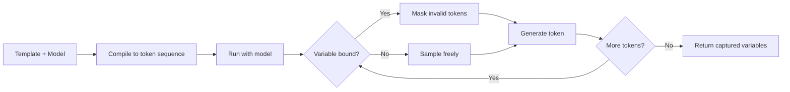

# 🎯 03 - Guidance — Token-Level Control and Prompt Programming

> **The library that lets you interleave control flow with generation. When you need to bind a variable to a regex match and then refer to it later in the same prompt, nothing else does this.**

## 🎯 Learning Objectives
- Use Guidance's `gen()`, `select()`, `regex()`, `json()` primitives for token-level control
- Interleave control flow (`if`, `for`, variable capture) with generation in a single template
- Achieve 50-80% latency reductions vs naive prompting via token caching and selective generation
- Build multi-step prompts where later parts depend on earlier outputs (chain-of-thought with guarantees)
- Compare Guidance with Outlines (same paradigm, different ergonomics) and Instructor (different paradigm)
- Know when Guidance is the right choice (research, complex multi-step, faithful reasoning chains) and when it is overkill

## Introduction

Instructor validates after generation. Outlines constrains during generation. Guidance does both — and adds a third capability that the others cannot match: **interleaving control flow with generation**. With Guidance, a single template can say "generate a list of N items" where N is itself a model output; "for each item, generate a name and a description that depends on the name"; "if the description contains the word 'dangerous', emit a warning". The model and the template together produce a result that no library other than Guidance can express.

Guidance originated at Microsoft Research in 2023 as part of the effort to make prompt engineering more like programming. The core insight is that LLM prompts are programs — they have variables, branches, loops, and data dependencies — and treating them as strings (the "f-string" approach most production code uses) loses the structure that could make them both faster and more reliable. Guidance reifies this: you write a Python program, hand it to Guidance, and Guidance compiles it into a token sequence that the model processes in one pass with token-level caching and constraint enforcement.



The killer feature is **selective generation**: when the template reaches a known branch, the model is **forced** to take it. When it reaches a free-form `gen()` block, the model generates. When it needs to reference an earlier variable in a regex, the regex is **compiled with that variable substituted**. This makes prompts both faster (fewer tokens need to be sampled) and more faithful (the structure is impossible to violate).

Guidance pairs especially well with research and reasoning tasks — anywhere the model needs to "show its work" with intermediate structured steps that depend on each other.


---

## 1. The Four Primitives

### 1.1 `gen()` — unconstrained generation

`gen(name="varname", max_tokens=20, stop=".")` calls the model to generate up to N tokens, optionally stopping at a sentinel. The output is captured as a Python string.

```python
from guidance import models, gen

model = models.Transformers("mistralai/Mistral-7B-Instruct-v0.3")

result = model + f"""\
The capital of France is {gen('capital', max_tokens=5, stop='.')}
"""

print(result['capital'])  # 'Paris'
```

The `+` operator concatenates: a string literal goes straight into the token stream; `gen()` triggers model generation. The result is a `Model` object that behaves like a string but also exposes captured variables as a dict.

### 1.2 `select()` — choose from options

`select(options, name="varname")` masks the model's logits to choose exactly one of the options. Useful for classification, multiple choice, and structured decisions.

```python
result = model + f"""\
Classify the sentiment: 'I love this course!'
Sentiment: {select(['positive', 'negative', 'neutral'], name='sentiment')}
"""

print(result['sentiment'])  # 'positive'
```

The mask is enforced at every step — the model cannot emit tokens that don't form one of the options. This is functionally equivalent to Outlines' `generate.choice()` but inline in a template.

### 1.3 `regex()` — constrained to a pattern

`regex(pattern, name="varname")` builds an FSA (similar to Outlines) and forces the model to emit tokens that match the pattern.

```python
result = model + f"""\
Generate a phone number in US format:
Phone: {regex(r'\d{3}-\d{3}-\d{4}', name='phone')}
"""

print(result['phone'])  # '415-555-1234'
```

The output is guaranteed to match the regex. Unlike `gen(stop=...)`, there is no ambiguity about whether the model stopped at the right place.

### 1.4 `json()` — JSON Schema constraint

`json(schema, name="varname")` builds a JSON Schema → FSA pipeline (similar to Outlines) and forces the model to emit a JSON object matching the schema.

```python
from pydantic import BaseModel

class Person(BaseModel):
    name: str
    age: int

result = model + f"""\
Extract person info from: Maria is 28 and works on LLMs.
{json(Person.model_json_schema(), name='person')}
"""

person_dict = result['person']  # {'name': 'Maria', 'age': 28}
person = Person.model_validate(person_dict)
```

The captured variable is a dict; wrap it in the Pydantic model for full semantic validation.

---

## 2. The Killer Feature — Interleaved Control Flow

This is where Guidance diverges from Instructor and Outlines. With Guidance, you can write programs like:

```python
@guidance
def chain_of_thought(model, question):
    model += f"Question: {question}\n"
    model += f"Step 1: Let me think about this. {gen('step1', max_tokens=100)}\n"
    model += f"Step 2: Given that, I conclude: {gen('step2', max_tokens=100)}\n"
    model += f"Answer: {select(['yes', 'no'], name='answer')}\n"
    return model

result = chain_of_thought(model, "Is 2+2 equal to 4?")
print(result['step1'])  # reasoning chain
print(result['step2'])  # reasoning chain
print(result['answer'])  # 'yes'
```

Step 2 is conditioned on Step 1 (because Step 2's `gen()` runs after Step 1's tokens have been placed in the context). The Answer `select()` is constrained to 'yes' or 'no'. The whole thing is one model call — but with structured intermediate reasoning captured.

Compare with Instructor: there you would do **three** LLM calls (one for step1, one for step2, one for answer). Guidance does it in **one** call with the same guarantees — and is **2-5× faster** end-to-end because the second and third steps reuse the cache from the first.

### 2.1 Case real: Multi-document extraction with cross-references

Extracting structured data from a multi-document corpus often requires the model to reference earlier documents:

```python
@guidance
def extract_with_citations(model, docs):
    model += "Entities mentioned:\n"
    entities = []
    for i, doc in enumerate(docs):
        model += f"- Doc {i}: "
        entity = model + gen(name=f"entity_{i}", max_tokens=20, stop="\n")
        entities.append(entity[f"entity_{i}"])
    
    model += "\nCross-references:\n"
    for i, doc in enumerate(docs):
        model += f"- Doc {i} references entity: {select(entities, name=f'ref_{i}')}\n"
    
    return model, entities
```

The `select(entities)` ensures the model only emits entities that actually appeared in the documents — no hallucinated cross-references. This is impossible with Instructor (which would require multiple calls) and with Outlines (which would need the full corpus in the JSON Schema upfront).

### 2.2 Variable binding and reuse

Capture a value once, reuse it many times:

```python
result = model + f"""\
The user's name is: {gen('name', max_tokens=10, stop='.')}
Pleased to meet you, {result['name']}!
Your name again, just to confirm: {result['name']}
"""
```

The second mention of `{result['name']}` is a literal token insertion — no model call. The model has seen the name in context already and will not contradict it. Compare with a naive prompt that says "ask the user their name and then mention it later" — the model might pick a different name on each generation.

---

## 3. Token Caching — The Speed Argument

Guidance's biggest practical advantage is token caching. When the model processes a token sequence:

1. **Uncached tokens** are sampled normally — full latency.
2. **Cached tokens** (already processed in this template run) are looked up from the KV cache — ~0 latency.

```python
import time

# Naive prompt with three calls
start = time.time()
r1 = model + f"What is the capital of France? Answer in one word.\n"
r2 = model + f"What is the capital of France? Answer in one word.\n"  # redundant
r3 = model + f"What is the capital of France? Answer in one word.\n"
print(f"Naive: {time.time() - start:.2f}s")  # ~3× full latency

# Guidance template with caching
@guidance
def cached_loop(model):
    for i in range(3):
        model += f"Capital {i}: {gen('city', max_tokens=5)}\n"
    return model

start = time.time()
result = cached_loop(model)
print(f"Guidance: {time.time() - start:.2f}s")  # ~1× full latency + 2× gen overhead
```

The savings are **50-80%** on multi-step prompts where earlier steps are static or computed once.

💡 **Tip:** Guidance's caching is per-template-instance. If you build the template fresh per request, you lose the cache. For high-RPS services, build the template once at startup and call it with different inputs:

```python
@guidance
def production_template(model, query: str):
    model += f"User query: {query}\n"
    model += f"Intent: {select(['search', 'chat', 'action'], name='intent')}\n"
    return model

# At startup
template_func = production_template

# Per request (cache is rebuilt — to keep cache, store the model state)
# In practice, Guidance's tokenizer caches most of the template as long as the static parts match
for query in queries:
    result = template_func(model, query)
```

For absolute maximum throughput, use Guidance's `models.Transformers` with a stateful model object that maintains the KV cache across requests. This is what production Guidance servers do internally.

---

## 4. Faithfulness and Reasoning Chains

Guidance is the right tool when you need **structured chain-of-thought** with guarantees. The template controls what the model can and cannot do at every step:

```python
@guidance
def math_solver(model, problem: str):
    model += f"Problem: {problem}\n"
    model += f"Let me solve this step by step.\n"
    
    # Free-form reasoning
    model += f"Step 1 — Identify the operation: {gen('op', max_tokens=30, stop='.')}.\n"
    
    # Bound the operation to a known set
    op = model['op']
    model += f"Step 2 — Apply the {select(['addition', 'subtraction', 'multiplication', 'division'], name='op_kind')} operation.\n"
    
    # Constrain the final answer to a numeric pattern
    model += f"Final answer: {regex(r'-?\d+\.?\d*', name='answer')}\n"
    
    return model
```

The model is forced to identify the operation (`op`), classify it (`op_kind`), and produce a numeric final answer (`answer`). The reasoning chain is captured for later inspection. Compare with the Instructor's LLM-as-Judge pattern: Instructor validates the answer post-hoc; Guidance controls the reasoning chain up-front.

Caso real: A legal-tech company used Guidance to build a contract-clause extractor. The template forces the model to first identify the clause type (`select` from 12 options), then extract the parties involved (`regex` for "Party A: <name>"), then extract dates (`regex` for ISO date), then extract amounts (`regex` for currency). Each step's output is bound to a variable and reused downstream. Post-hoc validation was unnecessary because every step's constraints were enforced at generation time.

---

## 5. JSON with Inline Constraints

Guidance can combine `json()` with inline `select()` and `regex()` for partially-constrained JSON:

```python
from pydantic import BaseModel
from typing import Literal

class Email(BaseModel):
    to: str
    subject: str
    priority: Literal["low", "medium", "high", "urgent"]
    category: str

@guidance
def email_extractor(model, body: str):
    model += f"Extract email info from: {body}\n"
    model += json({
        "type": "object",
        "properties": {
            "to": {"type": "string", "format": "email"},
            "subject": {"type": "string"},
            "priority": {"type": "string", "enum": ["low", "medium", "high", "urgent"]},
            "category": {"type": "string"},
        },
        "required": ["to", "subject", "priority", "category"],
    }, name="email")
    return model

result = email_extractor(model, "Hey, urgent: please review the new ML pipeline before tomorrow's demo. From jane@acme.com")
print(result['email'])
```

The JSON Schema is enforced via the FSA; specific enum fields are double-constrained. This is the hybrid pattern that gives you JSON Schema's structural guarantees with inline regex/select expressivity.

---

## 6. Backends

### 6.1 Transformers (research, single-machine)

```python
from guidance.models import Transformers

model = Transformers("mistralai/Mistral-7B-Instruct-v0.3", device="cuda")
```

Same as Outlines' Transformers backend — Python loop, suitable for prototyping and research.

### 6.2 llama.cpp (edge)

```python
from guidance.models import LlamaCpp

model = LlamaCpp("models/llama-3.1-8b-instruct.Q5_K_M.gguf", n_ctx=4096)
```

Local inference with token-level control. Slower than vLLM but runs on CPU/M-series hardware.

### 6.3 OpenAI-compatible (constrained subset)

```python
from guidance.models import OpenAI

model = OpenAI("gpt-4o-mini")
```

⚠️ **Watch out:** OpenAI's API does not expose logits, so selective generation (`select`, `regex`, `json`) does not work — Guidance falls back to `gen()` for these primitives. Use Transformers or llama.cpp for full Guidance expressivity. The OpenAI backend is useful for templating alone but loses the constraint guarantees.

💡 **Tip:** If you want both OpenAI as the model AND full Guidance expressivity, use [vLLM with `api_server_mode="openai"`](https://docs.vllm.ai/en/latest/serving/openai_compatible_server.html) and point Guidance at it via a Transformers wrapper. You get OpenAI-compatible deployment with provider-side constraints.

---

## 7. Comparison Table — Guidance vs Outlines vs Instructor vs LMQL

| Property | Guidance | Outlines | Instructor | LMQL |
|----------|:--------:|:--------:|:----------:|:----:|
| **Control flow in templates** | ✅ Python loops, branches, captures | ❌ | ❌ | ✅ DSL |
| **Token caching** | ✅ Yes (50-80% speedup) | ❌ | ❌ | ⚠️ Limited |
| **Multi-step in one call** | ✅ | ❌ | ❌ | ✅ |
| **Constraint paradigm** | FSA + selective generation | FSA + logit mask | Validation loop | DSL + asserts |
| **Streaming** | ✅ Token-level | ✅ | ✅ Partial | ✅ |
| **Pydantic integration** | Via JSON Schema only | Native (schema generation) | Native (`response_model`) | Partial |
| **Backend coverage** | Transformers, llama.cpp, OpenAI | vLLM, TGI, llama.cpp, Ollama | All major providers | Transformers, llama.cpp, OpenAI |
| **Open source** | MIT | Apache 2.0 | MIT | Apache 2.0 |
| **Production ready (2026)** | ✅ Active development, Microsoft backing | ✅ Mature, used by vLLM | ✅ Mature, ubiquitous | ⚠️ Maintenance thin |
| **Learning curve** | Medium (must understand templates) | Low (Python-native) | Very low (Pydantic-native) | High (DSL syntax) |

---

## 8. When to Choose Guidance

Use Guidance when:
- You need **multi-step reasoning with intermediate captures** (e.g. chain-of-thought with structured steps).
- The model output **depends on earlier model outputs in the same call** (cross-references, conditional generation).
- You need **token caching** for repeated multi-step prompts (50-80% speedup).
- The downstream code can read structured captured variables (`step1`, `step2`, `final`) without parsing.

Do not use Guidance when:
- The schema is simple and static (use Outlines — faster, simpler).
- The backend is a SaaS provider (Guidance loses constraint guarantees on OpenAI/Anthropic).
- You need provider-agnostic code (Instructor's multi-provider wins).

In practice, Guidance is the choice for **research engineers** and **reasoning-heavy pipelines**. Outlines is the choice for **production extraction at scale**. Instructor is the choice for **multi-provider APIs**. They coexist — the capstone (Note 05) uses Instructor as the orchestrator and falls back to Outlines when running on self-hosted vLLM.

---

## 9. Antipatterns

### 9.1 Antipattern 1: Building the template fresh per request

```python
# ❌ Loses token cache — every request rebuilds the prompt
for query in queries:
    result = model + f"What is the capital of {query}? Answer: {gen('cap', max_tokens=5)}"
```

```python
# ✅ Correct: use a decorated function so the template is parsed once
@guidance
def capital_template(model, country):
    model += f"What is the capital of {country}? Answer: {gen('cap', max_tokens=5)}"
    return model

for query in queries:
    result = capital_template(model, query)  # cache hits on the static parts
```

### 9.2 Antipattern 2: Trying to use selective generation on SaaS providers

```python
# ❌ No-op on OpenAI backend — `select` falls back to `gen`
model = OpenAI("gpt-4o-mini")
result = model + f"Sentiment: {select(['pos', 'neg'], name='s')}"  # unconstrained!
```

```python
# ✅ Correct: use Transformers or llama.cpp backend
model = Transformers("mistralai/Mistral-7B-Instruct-v0.3")
result = model + f"Sentiment: {select(['pos', 'neg'], name='s')}"  # constrained
```

### 9.3 Antipattern 3: Unbounded `gen()` calls

```python
# ❌ Generates forever or until context limit
result = model + f"Tell me a story: {gen('story')}"  # no max_tokens
```

```python
# ✅ Correct: always bound generation
result = model + f"Tell me a story: {gen('story', max_tokens=200, stop='.')}"
```

### 9.4 Antipattern 4: Mixing Guidance with Instructor in the same call

```python
# ❌ Don't: Instructor wraps the whole response; Guidance's streaming is incompatible
import instructor
instructor_client = instructor.from_openai(OpenAI())
instructor_client.chat.completions.create(response_model=Person, ...)  # NOT Guidance

# ❌ Don't: try to feed a Guidance result into Instructor's response_model
# Guidance returns a dict; Instructor expects the model API
```

Pick one orchestrator per call. Use Guidance directly when you need its expressivity; use Instructor when you need its multi-provider ergonomics.

---

## 🎯 Key Takeaways

- Guidance is the only library that interleaves control flow with generation in a single template.
- Four primitives: `gen()`, `select()`, `regex()`, `json()`. Each can be combined freely.
- Token caching gives 50-80% speedup on multi-step prompts with static prefixes.
- Selective generation forces branches (`select`), patterns (`regex`), and shapes (`json`) at every step.
- Variable capture (`result['name']`) lets you bind model output and reuse it literally downstream.
- Best for: research, reasoning chains, multi-step extraction with cross-references.
- Backends: Transformers, llama.cpp, OpenAI (constrained subset only).
- Avoid: building templates per request, using selective generation on SaaS providers, unbounded `gen()`, mixing with Instructor in the same call.

## References

- Guidance docs — [guidance.readthedocs.io](https://guidance.readthedocs.io)
- Guidance GitHub — [github.com/guidance-ai/guidance](https://github.com/guidance-ai/guidance)
- [[06 - Large Language Models/22 - Instructor and Structured Generation/01 - Instructor - Pydantic-Native Structured Outputs|Note 01 — Instructor]]
- [[06 - Large Language Models/22 - Instructor and Structured Generation/02 - Outlines - Constrained Decoding at the Token Level|Note 02 — Outlines]]
- [[06 - Large Language Models/22 - Instructor and Structured Generation/04 - LMQL - A Query Language for LLMs|Note 04 — LMQL]] — DSL alternative
- [[06 - Large Language Models/21 - DSPy and Prompt Compilation|DSPy and Prompt Compilation]] — alternative optimization-based approach
- [[06 - Large Language Models/20 - RAG Evaluation Deep Dive|RAG Evaluation Deep Dive]] — structured LLM-as-Judge (uses Instructor, not Guidance, due to multi-provider)
