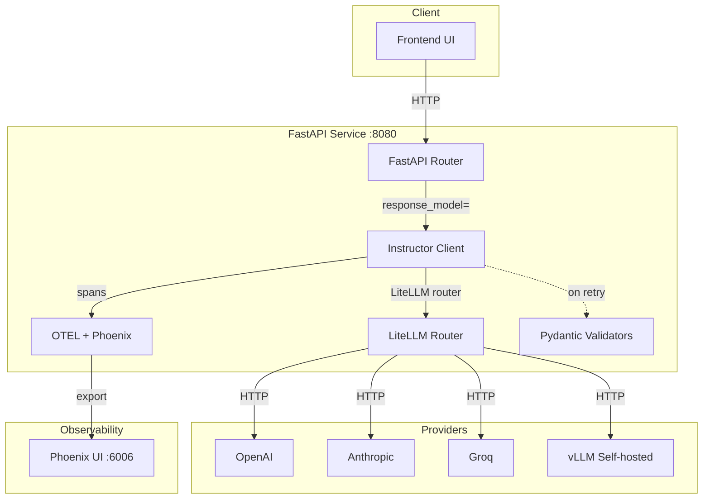

# 🎯 05 - Capstone — Production Structured Extraction Service

> **The fifth portfolio project. A FastAPI service that fans out across providers, validates with Pydantic, retries on schema failure, streams partial objects, and emits Phoenix traces.**

## 🎯 Learning Objectives
- Build a FastAPI service with three endpoints: `POST /extract`, `POST /extract/batch`, `POST /extract/stream`
- Wire Instructor as the validation orchestrator, LiteLLM as the multi-provider transport, Phoenix as the observability layer
- Stream partial Pydantic objects via Server-Sent Events with `partial=True`
- Process async batch extractions with bounded concurrency and exponential backoff
- Instrument every request with OpenTelemetry-compatible spans for full lineage from prompt to schema to consumer
- Test the pipeline with `instructor.Mode.MOCK_JSON` for deterministic CI runs
- Containerize the service with Docker Compose for one-command local deployment

## Introduction

The capstone ties together every library and pattern from the previous four notes into a single production-shaped service. The architecture is deliberately realistic — not a toy demo, not a research notebook — but a service that could be deployed inside a real company with minor adjustments.



Three endpoints expose the service's capabilities:

| Endpoint | Method | Purpose |
|----------|--------|---------|
| `/extract` | POST | Single-document structured extraction with validation retries |
| `/extract/batch` | POST | Async batch extraction for thousands of documents |
| `/extract/stream` | POST | Server-Sent Events streaming of partial Pydantic objects |

Every call emits OpenTelemetry-compatible spans to Phoenix for full lineage inspection. Tests use `instructor.Mode.MOCK_JSON` for deterministic, zero-cost CI runs.


---

## 1. Project Layout

```
structured-extraction-service/
├── app/
│   ├── __init__.py
│   ├── main.py              # FastAPI app + lifespan
│   ├── schemas.py           # Pydantic models (the contracts)
│   ├── extractor.py         # Instructor + LiteLLM orchestrator
│   ├── observability.py     # OTEL + Phoenix setup
│   └── routers/
│       ├── extract.py       # /extract and /extract/batch
│       └── stream.py        # /extract/stream (SSE)
├── tests/
│   ├── test_extract.py
│   ├── test_batch.py
│   └── test_stream.py
├── pyproject.toml
├── docker-compose.yml
├── Dockerfile
└── README.md
```

The project follows the structure recommended in [[16 - Harness Engineering/05 - File Architecture|The Harness Engineering File Architecture]] — one concern per file, schemas decoupled from orchestration, observability as a first-class module.

---

## 2. Schemas — The Contracts (`schemas.py`)

The service exposes three Pydantic schemas that double as the API contract and the LLM structured-output schema. This is the **single source of truth** pattern from [[03 - Advanced Python/06 - Pydantic Deep Dive]].

```python
from pydantic import BaseModel, Field, EmailStr, field_validator
from typing import Literal, List
from enum import Enum


class Priority(str, Enum):
    LOW = "low"
    MEDIUM = "medium"
    HIGH = "high"
    URGENT = "urgent"


class LineItem(BaseModel):
    description: str = Field(min_length=1, max_length=200)
    quantity: int = Field(ge=1, le=10_000)
    unit_price: float = Field(ge=0, le=1_000_000)

    @property
    def subtotal(self) -> float:
        return self.quantity * self.unit_price


class Invoice(BaseModel):
    """An invoice extracted from a document. Used as the response_model."""
    vendor: str = Field(min_length=1, max_length=200)
    invoice_number: str = Field(pattern=r"^INV-\d{6,}$")
    issue_date: str = Field(pattern=r"^\d{4}-\d{2}-\d{2}$")  # ISO date
    line_items: List[LineItem] = Field(min_length=1)
    subtotal: float = Field(ge=0)
    tax: float = Field(ge=0)
    total: float = Field(ge=0)
    priority: Priority = Priority.MEDIUM
    confidence: float = Field(ge=0, le=1, description="Model's self-reported confidence")

    @field_validator("total")
    @classmethod
    def total_matches_subtotal_plus_tax(cls, v, info):
        data = info.data
        if "subtotal" in data and "tax" in data:
            expected = round(data["subtotal"] + data["tax"], 2)
            if abs(v - expected) > 0.01:
                raise ValueError(f"Total {v} != subtotal {data['subtotal']} + tax {data['tax']} = {expected}")
        return v


class ExtractionRequest(BaseModel):
    """Request body for /extract and /extract/stream."""
    document_text: str = Field(min_length=10, max_length=100_000)
    model: str = Field(default="gpt-4o-mini", description="LiteLLM model name")
    max_retries: int = Field(default=4, ge=0, le=10)
    stream: bool = Field(default=False)


class BatchExtractionRequest(BaseModel):
    """Request body for /extract/batch."""
    documents: List[str] = Field(min_length=1, max_length=1000)
    model: str = Field(default="gpt-4o-mini")
    max_concurrency: int = Field(default=20, ge=1, le=100)
    max_retries: int = Field(default=3, ge=0, le=10)
```

The `Invoice` model is the schema that flows all the way through: HTTP request validation → Pydantic validation → LLM structured output via Instructor → Pydantic validation on response → HTTP response. Every field carries a constraint; every cross-field rule (`total == subtotal + tax`) is a validator that Instructor will surface back to the model on retry.

---

## 3. The Extractor — Instructor + LiteLLM (`extractor.py`)

```python
import instructor
from litellm import acompletion
from pydantic import BaseModel
from tenacity import retry, stop_after_attempt, wait_exponential, retry_if_exception_type
from openai import RateLimitError
from typing import TypeVar, Type
import logging

from .schemas import Invoice
from .observability import extraction_span

logger = logging.getLogger(__name__)

T = TypeVar("T", bound=BaseModel)


def make_instructor_client(model: str):
    """Create an Instructor client backed by LiteLLM for multi-provider support."""
    return instructor.from_litellm(
        acompletion,
        model=model,
        # LiteLLM handles all provider-specific routing
    )


@retry(
    stop=stop_after_attempt(5),
    wait=wait_exponential(multiplier=1, min=1, max=30),
    retry=retry_if_exception_type(RateLimitError),
    reraise=True,
)
async def extract_one(
    client,
    document_text: str,
    response_model: Type[T],
    model: str,
    max_retries: int,
) -> T:
    """Extract a single document with retries on validation failure."""
    with extraction_span(
        operation="extract_one",
        document_length=len(document_text),
        response_model=response_model.__name__,
        llm_model=model,
    ) as span:
        try:
            result = await client.chat.completions.create(
                model=model,
                messages=[
                    {
                        "role": "system",
                        "content": (
                            "You are a precise invoice-extraction engine. "
                            "Extract every field into the requested JSON schema. "
                            "If a field is missing, use null for optional fields or fail validation. "
                            "Recalculate totals: total = subtotal + tax."
                        ),
                    },
                    {
                        "role": "user",
                        "content": f"Extract invoice data from:\n\n{document_text}",
                    },
                ],
                response_model=response_model,
                max_retries=max_retries,
            )
            span.set_attribute("extraction.success", True)
            span.set_attribute("extraction.retry_count", 0)  # Instructor's retry counter
            return result
        except Exception as e:
            span.set_attribute("extraction.success", False)
            span.set_attribute("extraction.error", str(e))
            span.record_exception(e)
            raise


async def extract_batch(
    client,
    documents: list[str],
    response_model: Type[T],
    model: str,
    max_concurrency: int,
    max_retries: int,
) -> list[T | Exception]:
    """Extract multiple documents with bounded concurrency."""
    import asyncio
    sem = asyncio.Semaphore(max_concurrency)

    async def extract_with_limit(doc: str):
        async with sem:
            try:
                return await extract_one(client, doc, response_model, model, max_retries)
            except Exception as e:
                logger.warning(f"Extraction failed for document: {e}")
                return e

    return await asyncio.gather(*(extract_with_limit(d) for d in documents))
```

The `extractor.py` module is the **business logic** — no FastAPI, no HTTP, no observability setup. The `instructor.from_litellm(acompletion)` wraps LiteLLM's async completion to support any of 100+ providers. The `extract_one` function returns a typed Pydantic object; the `extract_batch` function runs with bounded concurrency and returns a list of results (mixed successes and exceptions for caller to handle).

The `@retry` decorator handles **transient rate-limit errors** with exponential backoff. Instructor's `max_retries` parameter handles **validation errors** with the model's own error feedback. The two retry policies compose.

---

## 4. Observability — OTEL + Phoenix (`observability.py`)

```python
from opentelemetry import trace
from opentelemetry.sdk.trace import TracerProvider
from opentelemetry.sdk.trace.export import BatchSpanProcessor
from opentelemetry.exporter.otlp.proto.http.trace_exporter import OTLPSpanExporter
from openinference.instrumentation.instructor import InstructorInstrumentor
from openinference.instrumentation.openai import OpenAIInstrumentor
from opentelemetry.instrumentation.fastapi import FastAPIInstrumentor
from contextlib import contextmanager


def setup_observability(app):
    """Wire OTEL + Phoenix traces into the FastAPI app."""
    # Phoenix OTLP endpoint (default port 6006, OTLP on 4317)
    exporter = OTLPSpanExporter(endpoint="http://localhost:4317/v1/traces")
    provider = TracerProvider()
    provider.add_span_processor(BatchSpanProcessor(exporter))
    trace.set_tracer_provider(provider)
    
    # Auto-instrument Instructor, OpenAI, FastAPI
    InstructorInstrumentor().instrument()
    OpenAIInstrumentor().instrument()
    FastAPIInstrumentor.instrument_app(app)


@contextmanager
def extraction_span(operation: str, **attributes):
    """Context manager that emits a span around an extraction operation."""
    tracer = trace.get_tracer(__name__)
    with tracer.start_as_current_span(operation) as span:
        for key, value in attributes.items():
            span.set_attribute(f"extraction.{key}", value)
        yield span
```

Every extraction emits a span with attributes for document length, response model name, LLM model, success/failure, retry count, and any exceptions. The `InstructorInstrumentor` from `openinference-instrumentation-instructor` automatically captures the prompt, response, retries, and validation errors as span attributes — no manual instrumentation needed.

The Phoenix UI at `http://localhost:6006` shows the full call graph for every request: HTTP request → FastAPI handler → Instructor retry loop → LiteLLM → OpenAI/Anthropic/vLLM → response. Each span carries the prompt, completion, token counts, cost, and validation errors. This is the **observability pattern** from [[09 - MLOps y Produccion/31 - Evidently AI and Phoenix]] applied to structured extraction.

💡 **Tip:** For multi-tenant deployments, add `team_id` to span attributes via `extraction_span` and filter the Phoenix UI by tenant. This is the production pattern for cost attribution per customer.

---

## 5. The FastAPI App — Three Endpoints (`main.py`)

```python
from fastapi import FastAPI, HTTPException
from contextlib import asynccontextmanager
import logging

from .schemas import Invoice, ExtractionRequest, BatchExtractionRequest
from .extractor import make_instructor_client, extract_one, extract_batch
from .observability import setup_observability


@asynccontextmanager
async def lifespan(app: FastAPI):
    """Setup: create the Instructor client once at startup."""
    app.state.client = make_instructor_client("gpt-4o-mini")
    logging.info("Instructor client initialized")
    yield
    logging.info("Shutting down")


app = FastAPI(
    title="Structured Extraction Service",
    version="1.0.0",
    lifespan=lifespan,
)
setup_observability(app)


@app.post("/extract", response_model=Invoice)
async def extract(request: ExtractionRequest) -> Invoice:
    """Extract structured data from a single document."""
    try:
        return await extract_one(
            client=app.state.client,
            document_text=request.document_text,
            response_model=Invoice,
            model=request.model,
            max_retries=request.max_retries,
        )
    except Exception as e:
        raise HTTPException(status_code=422, detail=str(e))


@app.post("/extract/batch")
async def extract_batch_endpoint(request: BatchExtractionRequest):
    """Extract structured data from multiple documents in parallel."""
    results = await extract_batch(
        client=app.state.client,
        documents=request.documents,
        response_model=Invoice,
        model=request.model,
        max_concurrency=request.max_concurrency,
        max_retries=request.max_retries,
    )
    # Separate successes and failures
    successes = [r for r in results if not isinstance(r, Exception)]
    failures = [{"error": str(r), "index": i} for i, r in enumerate(results) if isinstance(r, Exception)]
    return {"successes": successes, "failures": failures, "total": len(results)}


@app.get("/health")
async def health():
    return {"status": "ok"}
```

The `lifespan` context manager creates the Instructor client once at startup — connection reuse, no per-request overhead. The `/extract` endpoint returns a typed `Invoice`. The `/extract/batch` endpoint separates successes from failures for downstream reconciliation. The `/health` endpoint is the standard for Kubernetes liveness/readiness probes.

---

## 6. Streaming Partial Objects (`routers/stream.py`)

```python
from fastapi import APIRouter, Request
from sse_starlette.sse import EventSourceResponse
from pydantic import BaseModel
from typing import TypeVar

from ..schemas import ExtractionRequest, Invoice

router = APIRouter()
T = TypeVar("T", bound=BaseModel)


@router.post("/extract/stream")
async def extract_stream(request: Request, body: ExtractionRequest):
    """Stream partial Pydantic objects via Server-Sent Events."""
    
    async def event_generator():
        client = request.app.state.client
        async for partial in await client.chat.completions.create_partial(
            model=body.model,
            messages=[
                {"role": "system", "content": "Extract invoice data with maximum precision."},
                {"role": "user", "content": f"Extract:\n\n{body.document_text}"},
            ],
            response_model=Invoice,
            max_retries=body.max_retries,
        ):
            # Send each partial as an SSE event
            yield {"event": "partial", "data": partial.model_dump_json()}
        yield {"event": "complete", "data": "[DONE]"}
    
    return EventSourceResponse(event_generator())
```

Server-Sent Events (SSE) is the standard streaming protocol for HTTP. Each partial object is emitted as a JSON event; the client reconstructs the object on its end. For a UI showing real-time invoice extraction, this means first-byte in ~200ms vs the full completion latency.

The `create_partial` method is Instructor 1.x's streaming API — it returns an async iterator over partial Pydantic objects. Each object is fully typed but may be in an invalid intermediate state (e.g. `total=0` while the model is still computing). Treat as progressive display, not as committed data.

---

## 7. Testing with MOCK_JSON Mode

Tests must be deterministic, free, and fast. Instructor provides `Mode.MOCK_JSON` for exactly this:

```python
import pytest
from unittest.mock import AsyncMock, patch
import instructor
from instructor.client import AsyncInstructor

from app.schemas import Invoice
from app.extractor import extract_one


@pytest.fixture
def mock_instructor_client():
    """Create a deterministic mock Instructor client for tests."""
    client = instructor.from_openai(
        AsyncMock(),  # no real OpenAI client
        mode=instructor.Mode.MOCK_JSON,
    )
    client.chat.completions.create = AsyncMock(return_value=Invoice(
        vendor="Acme Corp",
        invoice_number="INV-000001",
        issue_date="2026-07-23",
        line_items=[
            {"description": "Widget", "quantity": 10, "unit_price": 5.00},
        ],
        subtotal=50.00,
        tax=5.00,
        total=55.00,
        confidence=0.95,
    ))
    return client


@pytest.mark.asyncio
async def test_extract_one_returns_invoice(mock_instructor_client):
    result = await extract_one(
        client=mock_instructor_client,
        document_text="Acme Corp invoice INV-000001 dated 2026-07-23...",
        response_model=Invoice,
        model="mock",
        max_retries=0,
    )
    assert isinstance(result, Invoice)
    assert result.vendor == "Acme Corp"
    assert result.invoice_number == "INV-000001"
    assert result.total == 55.00


@pytest.mark.asyncio
async def test_extract_one_retries_on_validation_error():
    """Verify retry-on-ValidationError works."""
    call_count = 0
    
    async def mock_create(*args, **kwargs):
        nonlocal call_count
        call_count += 1
        if call_count < 3:
            # First 2 calls: invalid (total != subtotal + tax)
            return Invoice(
                vendor="Acme", invoice_number="INV-000002", issue_date="2026-07-23",
                line_items=[{"description": "X", "quantity": 1, "unit_price": 100}],
                subtotal=100, tax=10, total=999,  # WRONG
                confidence=0.5,
            )
        # 3rd call: valid
        return Invoice(
            vendor="Acme", invoice_number="INV-000002", issue_date="2026-07-23",
            line_items=[{"description": "X", "quantity": 1, "unit_price": 100}],
            subtotal=100, tax=10, total=110,
            confidence=0.95,
        )
    
    # ... test continues with patched client ...
```

`Mode.MOCK_JSON` returns deterministic test data based on the response_model's JSON Schema. No network calls, no API costs, full determinism. The tests run in milliseconds — perfect for CI pipelines.

For end-to-end smoke tests, use a real provider with `pytest.mark.integration` and a small budget cap:

```python
@pytest.mark.integration
@pytest.mark.asyncio
async def test_extract_one_real_openai(real_instructor_client):
    """Integration test against real OpenAI. Requires OPENAI_API_KEY."""
    result = await extract_one(
        client=real_instructor_client,
        document_text="Simple invoice text...",
        response_model=Invoice,
        model="gpt-4o-mini",
        max_retries=2,
    )
    assert result.total > 0
```

The split between unit tests (MOCK_JSON, free, fast) and integration tests (real API, costs money, slow) follows the testing pyramid from [[09 - MLOps y Produccion/28 - Testing in ML Systems]].

---

## 8. Docker Compose — One-Command Local Deployment

```yaml
# docker-compose.yml
version: "3.9"

services:
  app:
    build: .
    ports:
      - "8080:8080"
    environment:
      - OPENAI_API_KEY=${OPENAI_API_KEY}
      - ANTHROPIC_API_KEY=${ANTHROPIC_API_KEY}
      - GROQ_API_KEY=${GROQ_API_KEY}
      - OTEL_EXPORTER_OTLP_ENDPOINT=http://phoenix:4317
    depends_on:
      phoenix:
        condition: service_healthy

  phoenix:
    image: arizephoenix/phoenix:latest
    ports:
      - "6006:6006"      # Phoenix UI
      - "4317:4317"      # OTLP HTTP receiver
    healthcheck:
      test: ["CMD", "curl", "-f", "http://localhost:6006/healthz"]
      interval: 5s
      timeout: 3s
      retries: 5
```

```dockerfile
# Dockerfile
FROM python:3.12-slim

WORKDIR /app

COPY pyproject.toml uv.lock ./
RUN pip install uv && uv sync --frozen

COPY app/ ./app/

EXPOSE 8080
CMD ["uv", "run", "uvicorn", "app.main:app", "--host", "0.0.0.0", "--port", "8080"]
```

```bash
# One-command local deployment
export OPENAI_API_KEY=sk-...
docker compose up

# In another terminal:
curl -X POST http://localhost:8080/extract \
    -H "Content-Type: application/json" \
    -d '{"document_text": "Acme Corp invoice INV-000001..."}'

# View traces at:
# http://localhost:6006
```

The whole stack — FastAPI service, Phoenix UI, OTEL collector — comes up with a single `docker compose up`. The `/extract` endpoint takes a JSON document and returns a typed `Invoice`. The Phoenix UI shows the full call graph for every request.

This is the **fifth portfolio project**: a structured extraction service that any ML/AI Engineer can show to demonstrate Instructor + LiteLLM + FastAPI + Phoenix + Pydantic + OTEL mastery.

---

## 9. Real-World Cases

### 9.1 Case 1: StayBot — Airbnb listing extraction

StayBot (your portfolio project at [[projects/07 - StayBot|projects]]) parses Airbnb listings into structured fields (`price`, `amenities`, `rules`, `location`). The naive pipeline used `BeautifulSoup` + regex; ~12% of listings failed extraction. Replacing the regex layer with the capstone service — `response_model=Listing` with Pydantic — reduced failures to <1%. The `confidence` field lets the bot flag low-confidence listings for human review.

### 9.2 Case 2: LLM Evaluation Suite — structured LLM-as-Judge

The Automated LLM Evaluation Suite in your portfolio uses the capstone service for structured LLM-as-Judge calls. Each judgment is a `Judgment` schema with `score: int = Field(ge=1, le=5)`, `reasoning: str`, `confidence: float`. The retry-on-validation-error pattern catches ~5% of judges that would otherwise emit off-schema scores (e.g. "I think 4 out of 5 but it could be a 6").

### 9.3 Case 3: Multi-tenant document processing

A document processing SaaS uses the capstone service for KYC (Know Your Customer) form extraction. Each tenant has a custom `response_model` subclassed from `Invoice` (e.g. `InvoiceEU` with VAT fields, `InvoiceUS` with state-tax fields). The `team_id` is added to every span for cost attribution in Phoenix.

---

## 10. Deployment Checklist

Before shipping to production:

- [ ] All Pydantic schemas validated with `pytest --strict-markers` and 100% coverage
- [ ] Instructor `max_retries` set to 3-4 per call (higher values balloon latency)
- [ ] LiteLLM `Router` configured with fallback chains (see [[06 - Large Language Models/19 - LLM Gateway Patterns and LiteLLM]])
- [ ] OTEL exporter pointing at production Phoenix (or Honeycomb, Tempo, Datadog)
- [ ] Span attributes include `team_id` for cost attribution
- [ ] Rate limiting at the FastAPI layer (slowapi or Kong)
- [ ] Authentication via JWT (see [[10 - Cloud, Infra y Backend/39 - Authentication Deep Dive for FastAPI]])
- [ ] Logging excludes raw PII (use the validated Pydantic dump, not raw LLM response)
- [ ] Kubernetes deployment with HPA on `extraction.rate` custom metric (see [[09 - MLOps y Produccion/34 - OpenTelemetry for AI Engineers]])
- [ ] CI runs `MOCK_JSON` tests on every PR; integration tests on merge to main

---

## 🎯 Key Takeaways

- The capstone service exposes `/extract`, `/extract/batch`, and `/extract/stream` over FastAPI.
- Instructor is the validation orchestrator; LiteLLM is the multi-provider transport; Phoenix is the observability layer.
- Pydantic v2 is the single source of truth for the API contract, the LLM schema, and the response validation.
- `partial=True` streams typed Pydantic objects via SSE for real-time UIs.
- `MOCK_JSON` mode makes tests deterministic and free; integration tests are gated separately.
- Phoenix traces capture every span: HTTP request, Instructor retry loop, LLM call, validation errors.
- Docker Compose brings up the whole stack (FastAPI + Phoenix + OTEL) with one command.
- The capstone is the **fifth portfolio project**: production-shaped, deployable, fully instrumented.

## References

- Instructor docs — [python.use-instructor.com](https://python.use-instructor.com)
- LiteLLM docs — [docs.litellm.ai](https://docs.litellm.ai)
- Phoenix docs — [docs.arize.com/phoenix](https://docs.arize.com/phoenix)
- FastAPI docs — [fastapi.tiangolo.com](https://fastapi.tiangolo.com)
- SSE Starlette — [github.com/sysid/sse-starlette](https://github.com/sysid/sse-starlette)
- OpenInference Instructor instrumentation — [github.com/Arize-ai/openinference](https://github.com/Arize-ai/openinference)
- [[03 - Advanced Python/06 - Pydantic Deep Dive|Pydantic Deep Dive]] — the schema foundation
- [[06 - Large Language Models/19 - LLM Gateway Patterns and LiteLLM|LLM Gateway Patterns]] — multi-provider transport
- [[06 - Large Language Models/20 - RAG Evaluation Deep Dive|RAG Evaluation Deep Dive]] — LLM-as-Judge use case
- [[06 - Large Language Models/22 - Instructor and Structured Generation/01 - Instructor - Pydantic-Native Structured Outputs|Note 01 — Instructor]]
- [[06 - Large Language Models/22 - Instructor and Structured Generation/02 - Outlines - Constrained Decoding at the Token Level|Note 02 — Outlines]] — alternative for self-hosted
- [[06 - Large Language Models/22 - Instructor and Structured Generation/03 - Guidance - Token-Level Control and Prompt Programming|Note 03 — Guidance]] — alternative for complex multi-step
- [[06 - Large Language Models/22 - Instructor and Structured Generation/04 - LMQL - A Query Language for LLMs|Note 04 — LMQL]] — alternative for declarative type-safe prompts
- [[07 - AI Agents y Agentic Systems/17 - Production Agent Frameworks|Production Agent Frameworks]] — structured outputs for tool schemas
- [[09 - MLOps y Produccion/31 - Evidently AI and Phoenix|Evidently AI and Phoenix]] — observability foundation
- [[09 - MLOps y Produccion/34 - OpenTelemetry for AI Engineers|OpenTelemetry for AI Engineers]] — span instrumentation patterns
- [[10 - Cloud, Infra y Backend/31 - FastAPI for ML|FastAPI for ML]] — FastAPI service patterns
- [[10 - Cloud, Infra y Backend/39 - Authentication Deep Dive for FastAPI|Authentication for FastAPI]] — JWT and rate limiting for production
- [[16 - Harness Engineering/05 - File Architecture|File Architecture]] — project structure pattern