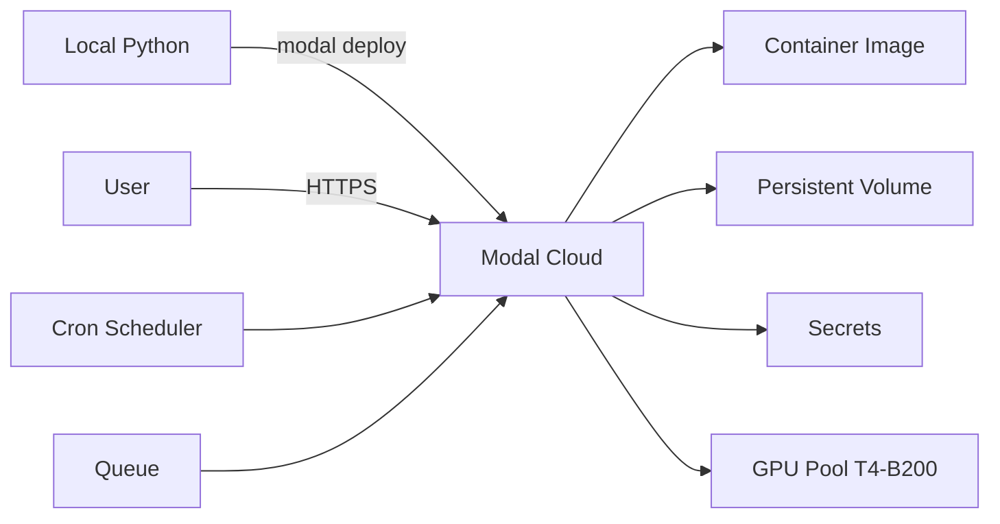

# 🎯 01 - Modal — Python-Native Serverless GPU

> **The most Pythonic GPU platform. Write functions, declare GPU type, deploy with one CLI command. Pay only for the GPU-seconds you consume.**

## 🎯 Learning Objectives
- Build and deploy Modal apps with `@app.function()` and `@app.web_endpoint()`
- Select the right GPU tier (T4, L4, A10G, A100, H100, H200, B200) per workload
- Use Modal Volumes for persistent model storage across cold starts
- Wire Modal Secrets for API keys and database URLs
- Run async, batch, and cron jobs alongside web endpoints
- Stream inference responses via Server-Sent Events with minimal latency

## Introduction

Modal is the Python-native answer to "I need a GPU and I don't want to manage infrastructure." Where AWS Lambda abstracts away servers, Modal abstracts away servers **and GPUs**. You write a Python function, decorate it with `@app.function(gpu="A100")`, deploy with `modal deploy`, and Modal provisions the container, the GPU, and the network — all in 5-15 seconds for a warm start, 30-60 seconds for a cold start.

The platform launched in 2023, reached 100k users in 2024, and crossed $50M ARR in 2025. By 2026 it is the default Pythonic GPU platform for ML teams, ahead of AWS Batch, GCP Cloud Run GPU, and Azure ML. The killer feature is **end-to-end Python** — no YAML, no Terraform, no Kubernetes manifests. The same Python file declares the app, the resources, the secrets, and the deployment target.

For LLM serving, Modal occupies a specific niche. It is **not** the cheapest platform per-token (Together AI and Fireworks win on inference pricing). It is **not** the fastest cold-start (Fireworks wins). It is the **most ergonomic for custom code that needs GPUs** — fine-tuning, custom inference loops, batch processing, async pipelines. The capstone (Note 05) uses Modal for fine-tuning and custom domain inference; Together/Fireworks for production traffic.




---

## 1. The Decorator Model

A Modal app is a Python file with a top-level `App` and decorated functions:

```python
# app.py
import modal

app = modal.App("my-llm-app")

@app.function(
    gpu="A100",  # GPU selection
    memory=8192,  # RAM in MB
    timeout=600,  # max execution time in seconds
    secrets=[modal.Secret.from_name("huggingface")],  # env vars from Modal Secrets
    volumes={"/models": modal.Volume.from_name("model-cache")},  # persistent storage
    image=modal.Image.debian_slim().pip_install("transformers", "torch"),  # container image
)
def generate_text(prompt: str) -> str:
    # Lazy import — only runs inside the container
    from transformers import AutoTokenizer, AutoModelForCausalLM
    import torch
    
    tokenizer = AutoTokenizer.from_pretrained("/models/llama-3-8b")
    model = AutoModelForCausalLM.from_pretrained("/models/llama-3-8b", torch_dtype=torch.float16, device_map="cuda")
    
    inputs = tokenizer(prompt, return_tensors="pt").to("cuda")
    outputs = model.generate(**inputs, max_new_tokens=200)
    return tokenizer.decode(outputs[0], skip_special_tokens=True)


@app.local_entrypoint()
def main(prompt: str = "What is the capital of France?"):
    result = generate_text.remote(prompt)
    print(result)
```

Deploy with `modal deploy app.py`. Run from CLI with `modal run app.py`. Both work with the same file.

The `@app.function()` decorator declares:
- **Resources**: `gpu`, `memory`, `cpu`
- **Lifecycle**: `timeout`, `keep_warm`, `concurrency_limit`
- **State**: `volumes`, `image`
- **Security**: `secrets`

Every decorator parameter maps to a Modal resource abstraction. There is no YAML file to maintain.

---

## 2. GPU Selection — The Pricing Matrix

Modal offers 7 GPU tiers. The choice is the largest cost variable:

| GPU | VRAM | $/hour | $/second | Best for |
|-----|------|--------|----------|----------|
| **T4** | 16 GB | $0.59 | $0.000164 | Small models (< 7B), dev |
| **L4** | 24 GB | $0.80 | $0.000222 | Llama 3.1 8B inference, fast cold start |
| **A10G** | 24 GB | $1.10 | $0.000306 | Llama 3 8B fine-tuning, mid inference |
| **A100** | 40 GB | $2.50 | $0.000694 | Llama 3 70B inference, batch fine-tuning |
| **A100-80GB** | 80 GB | $3.50 | $0.000972 | Llama 3 70B full-precision, big LoRA |
| **H100** | 80 GB | $4.50 | $0.001250 | Frontier training, low-latency inference |
| **H200** | 141 GB | $5.00 | $0.001389 | Very large models, FP8 inference |
| **B200** | 192 GB | $8.00 | $0.002222 | Blackwell-generation training |

For a typical workload:
- **Dev / small inference**: `L4` ($0.80/hr) is the sweet spot
- **Production 7-13B models**: `A10G` ($1.10/hr)
- **Production 70B models**: `A100-80GB` ($3.50/hr) or split across multiple GPUs
- **Frontier training**: `H100` ($4.50/hr) with FSDP from [[06 - Large Language Models/16 - HuggingFace Transformers Deep Dive]]
- **Cutting-edge**: `H200` or `B200`

The cost economics: a 1-second inference on `A100` costs $0.0007. At 1M inferences/day, that's $700/day or $21k/month. Compare to Together AI Llama 3.1 70B at ~$0.88/M tokens: 1M inferences × 1000 output tokens × $0.88/M = $880/day or $26k/month. Modal is competitive for high-throughput inference but loses on per-token cost for low-throughput.

💡 **Tip:** The right GPU is the smallest one that fits your model in memory with comfortable headroom. Llama 3.1 8B in FP16 needs ~16GB VRAM — fits in L4. Llama 3 70B in FP16 needs ~140GB — needs H100/H200. Use `nvidia-smi` to verify fit.

---

## 3. Volumes — Persistent Model Storage

Cold starts lose in-memory state. Modal **Volumes** provide persistent disk storage that survives across container lifetimes:

```python
# Create a Volume
volume = modal.Volume.from_name("llama-models")

@app.function(
    gpu="A100",
    volumes={"/models": volume},
    image=modal.Image.debian_slim().pip_install("transformers", "huggingface_hub"),
)
def load_and_generate(prompt: str) -> str:
    from huggingface_hub import snapshot_download
    import os
    
    # First run: download to volume (slow)
    if not os.path.exists("/models/llama-3-8b"):
        snapshot_download(
            repo_id="meta-llama/Meta-Llama-3-8B-Instruct",
            local_dir="/models/llama-3-8b",
            token=os.environ["HF_TOKEN"],
        )
    
    # Subsequent runs: load from volume (fast)
    from transformers import AutoModelForCausalLM
    model = AutoModelForCausalLM.from_pretrained("/models/llama-3-8b", device_map="cuda")
    # ... generate ...
```

Volume state persists across cold starts. The first invocation downloads the model (~15GB for Llama 3 8B); subsequent invocations load from disk in <10 seconds.

For multi-model scenarios, use **shared volumes**:

```python
@app.function(
    volumes={
        "/models": modal.Volume.from_name("llama-models"),
        "/data": modal.Volume.from_name("user-data"),
    },
)
def serve_user_request(user_id: str, prompt: str) -> str:
    # Load model from /models, user data from /data
    ...
```

Volumes are billed at $0.10/GB-month. A typical 70B model at ~140GB is $14/month to store — much cheaper than re-downloading on every cold start.

---

## 4. Web Endpoints and Async Inference

The `@app.web_endpoint()` decorator exposes a function as an HTTPS endpoint:

```python
@app.function(
    gpu="A100",
    volumes={"/models": modal.Volume.from_name("llama-models")},
)
@modal.web_endpoint(method="POST")
def generate(request: dict) -> dict:
    """POST /generate with body {prompt: str, max_tokens: int}."""
    from transformers import AutoModelForCausalLM, AutoTokenizer
    import torch
    
    prompt = request["prompt"]
    max_tokens = request.get("max_tokens", 200)
    
    tokenizer = AutoTokenizer.from_pretrained("/models/llama-3-8b")
    model = AutoModelForCausalLM.from_pretrained("/models/llama-3-8b", torch_dtype=torch.float16, device_map="cuda")
    
    inputs = tokenizer(prompt, return_tensors="pt").to("cuda")
    outputs = model.generate(**inputs, max_new_tokens=max_tokens)
    text = tokenizer.decode(outputs[0], skip_special_tokens=True)
    
    return {"text": text, "model": "llama-3-8b", "tokens": max_tokens}
```

Modal provisions HTTPS with auto-generated URL. The endpoint scales horizontally — Modal spawns N containers based on concurrent request count.

For **streaming**, use `modal.web_endpoint()` with `streaming=True`:

```python
from fastapi.responses import StreamingResponse

@app.function(gpu="A100")
@modal.web_endpoint()
def stream(request: dict) -> StreamingResponse:
    async def generate():
        # ... yield tokens as they're generated ...
        for token in token_stream(prompt):
            yield f"data: {token}\n\n"
    
    return StreamingResponse(generate(), media_type="text/event-stream")
```

The streaming endpoint keeps the connection open and emits tokens as Server-Sent Events — same pattern as the FastAPI streaming from [[06 - Large Language Models/22 - Instructor and Structured Generation]].

---

## 5. Secrets — API Keys and Credentials

Modal **Secrets** are encrypted env-var bundles injected at runtime:

```python
# Create a secret via CLI
modal secret create openai-keys OPENAI_API_KEY=sk-...

# Reference in code
@app.function(
    secrets=[modal.Secret.from_name("openai-keys")],
)
def call_openai(prompt: str) -> str:
    import openai
    client = openai.OpenAI()  # reads OPENAI_API_KEY from env
    return client.chat.completions.create(
        model="gpt-4o-mini",
        messages=[{"role": "user", "content": prompt}],
    ).choices[0].message.content
```

The secret is decrypted inside the container and injected as environment variables. The CLI command never shows the value in plaintext after creation.

For multiple secrets, list them in `secrets=[...]`:

```python
secrets=[
    modal.Secret.from_name("huggingface"),
    modal.Secret.from_name("openai-keys"),
    modal.Secret.from_name("aws-credentials"),
]
```

For multi-tenant SaaS, pass secrets per request via Modal **Proxy Auth**:

```python
@app.function()
@modal.web_endpoint()
def tenant_specific(request: dict, api_key: str):
    tenant_secrets = fetch_tenant_secrets(api_key)  # from your DB
    # ... use tenant_secrets in the function ...
```

---

## 6. Async, Cron, and Queue Patterns

### 6.1 Async batch processing

```python
@app.function(gpu="A100")
def process_document(doc: dict) -> dict:
    # ... heavy GPU work ...
    return {"id": doc["id"], "result": ...}

@app.local_entrypoint()
def main():
    docs = [{"id": i, "text": "..."} for i in range(100)]
    results = list(process_document.map(docs))  # parallel!
```

`function.map(iterable)` runs the function in parallel across all inputs. Modal schedules them on the GPU pool — typically 10-50x faster than serial.

### 6.2 Cron jobs

```python
@app.function(
    schedule=modal.Cron("0 2 * * *"),  # 2 AM daily
)
def nightly_retrain():
    """Run fine-tuning nightly."""
    # ... train and save to Volume ...
```

### 6.3 Queues

```python
@app.function()
def worker(job: dict):
    # ... process job ...
    pass

# Put jobs on the queue
worker.put({"type": "inference", "data": ...})
```

Modal's queue is built on SQS under the hood. For higher throughput, use multiple workers.

---

## 7. Image Customization

By default, Modal uses `debian_slim`. Customize the container image:

```python
image = (
    modal.Image.debian_slim(python_version="3.12")
    .apt_install("ffmpeg", "libsm6", "libxext6")  # system packages
    .pip_install(
        "transformers==4.45.0",
        "torch==2.4.0",
        "vllm==0.6.0",
    )
    .run_commands("python -c 'import torch; print(torch.cuda.is_available())'")  # verify
)

@app.function(gpu="A100", image=image)
def serve():
    ...
```

The image is built once and cached across all invocations of the app. Subsequent deploys that don't change the image reuse the cached layers.

For HuggingFace models, use `modal.Image.from_huggingface()`:

```python
image = modal.Image.from_huggingface(
    "meta-llama/Meta-Llama-3-8B-Instruct",
    inference=True,  # pre-installs transformers, torch
)
```

This pre-loads the model weights into the image, eliminating the download-on-cold-start step.

---

## 8. The Modal Workflow

```bash
# 1. Install CLI
pip install modal

# 2. Authenticate
modal token new

# 3. Develop locally (the same code runs locally with `modal run`)
modal run app.py

# 4. Deploy to cloud
modal deploy app.py
# Output: https://your-app-name.modal.run

# 5. View logs
modal app logs my-llm-app

# 6. Stop / restart
modal app stop my-llm-app
```

The CLI is the entire deployment story. No Dockerfile, no Kubernetes manifest, no Terraform.

---

## 9. Case Studies

### 9.1 Case real 1: Fine-tuning pipeline

A research team uses Modal to fine-tune Llama 3 8B on domain-specific data. The pipeline runs weekly:

```python
@app.function(
    gpu="A100",
    timeout=3600,  # 1 hour max
    volumes={"/data": data_volume, "/models": model_volume},
    schedule=modal.Cron("0 0 * * 0"),  # Sunday midnight
)
def weekly_finetune():
    from transformers import AutoModelForCausalLM, TrainingArguments, Trainer
    
    model = AutoModelForCausalLM.from_pretrained("/models/llama-3-8b-base")
    dataset = load_dataset("/data/weekly-curated")
    
    trainer = Trainer(
        model=model,
        args=TrainingArguments(output_dir="/models/llama-3-8b-finetuned", num_train_epochs=3),
        train_dataset=dataset,
    )
    trainer.train()
```

Cost: 1 hour/week on A100 = $2.50/week. Compare to keeping an A100 always-on for $63/month.

### 9.2 Case real 2: Custom GPU inference

A legal-tech startup runs a custom contract-analysis model on Modal:

```python
@app.function(
    gpu="A100-80GB",
    volumes={"/models": modal.Volume.from_name("legal-models")},
    keep_warm=1,  # always keep 1 warm container
)
@modal.web_endpoint()
def analyze_contract(contract_text: str) -> dict:
    # Custom LoRA model + custom post-processing
    from peft import PeftModel
    from transformers import AutoModelForCausalLM
    
    base = AutoModelForCausalLM.from_pretrained("/models/llama-3-70b-base")
    model = PeftModel.from_pretrained(base, "/models/legal-lora-v3")
    
    # ... custom analysis ...
    return {"risk_score": ..., "obligations": [...]}
```

With `keep_warm=1`, one container stays running 24/7 ($84/month) for low-latency responses. Additional containers scale up under load.

### 9.3 Case real 3: Batch image generation

An ad-tech startup runs Stable Diffusion XL on Modal for batch image generation:

```python
@app.function(gpu="A100", timeout=600)
def generate_image(prompt: str) -> bytes:
    from diffusers import StableDiffusionXLPipeline
    import torch
    
    pipe = StableDiffusionXLPipeline.from_pretrained(
        "/models/sdxl",
        torch_dtype=torch.float16,
    ).to("cuda")
    
    image = pipe(prompt).images[0]
    
    import io
    buf = io.BytesIO()
    image.save(buf, format="PNG")
    return buf.getvalue()
```

1000 prompts × 5 seconds/prompt on A100 = ~83 minutes = $3.50 total. Compare to $100s of API calls on Replicate.

---

## 10. Antipatterns

### 10.1 Antipattern 1: Loading models outside the function

```python
# ❌ Bug: model loaded at module import, but the module only loads once per cold start
# If the function is invoked concurrently, multiple GPUs share the same model reference
model = AutoModelForCausalLM.from_pretrained(...)  # outside the function!

@app.function(gpu="A100")
def generate(prompt: str) -> str:
    return model.generate(...)  # race condition on concurrent calls

# ✅ Correct: load inside the function, after Modal has provisioned the GPU
@app.function(gpu="A100")
def generate(prompt: str) -> str:
    model = AutoModelForCausalLM.from_pretrained(...)  # inside the function
    return model.generate(...)
```

### 10.2 Antipattern 2: Not using Volumes for models

```python
# ❌ Performance bug: downloads the model on every cold start (15 minutes)
@app.function(gpu="A100")
def generate(prompt: str) -> str:
    model = AutoModelForCausalLM.from_pretrained("meta-llama/Meta-Llama-3-8B-Instruct")

# ✅ Correct: use a Volume to cache the model
@app.function(
    gpu="A100",
    volumes={"/models": modal.Volume.from_name("llama-models")},
)
def generate(prompt: str) -> str:
    model = AutoModelForCausalLM.from_pretrained("/models/llama-3-8b")  # cached
```

### 10.3 Antipattern 3: Over-provisioning GPU

```python
# ❌ Expensive: B200 ($8/hr) for a 1B model
@app.function(gpu="B200")
def generate(prompt: str) -> str:
    return small_model.generate(prompt)

# ✅ Cost-optimized: T4 ($0.59/hr) is enough for a 1B model
@app.function(gpu="T4")
def generate(prompt: str) -> str:
    return small_model.generate(prompt)
```

### 10.4 Antipattern 4: Synchronous long-running requests

```python
# ❌ Timeout: synchronous function with 10-minute inference
@app.function(gpu="A100", timeout=600)
def slow_inference(prompt: str) -> str:
    # ... 10 minutes of generation ...
    return result

# ✅ Correct: use streaming for long-running requests
@app.function(gpu="A100", timeout=600)
@modal.web_endpoint()
def stream_inference(request: dict) -> StreamingResponse:
    async def generate():
        for token in token_stream(prompt):
            yield f"data: {token}\n\n"
    return StreamingResponse(generate(), media_type="text/event-stream")
```

### 10.5 Antipattern 5: Forgetting concurrency limits

```python
# ❌ Bug: unbounded concurrency crashes the GPU
@app.function(gpu="A100")
def process(docs: list[dict]) -> list[dict]:
    return process_document.map(docs)  # 1000 parallel requests on 1 GPU!

# ✅ Correct: bound concurrency
@app.function(gpu="A100")
@modal.concurrent(max_inputs=4)  # only 4 concurrent requests per container
def process(docs: list[dict]) -> list[dict]:
    ...
```

---

## 🎯 Key Takeaways

- Modal is the Python-native GPU platform: `@app.function(gpu=...)`, deploy with `modal deploy`.
- Seven GPU tiers from T4 ($0.59/hr) to B200 ($8/hr); pick the smallest that fits.
- Volumes for persistent model storage; cache large models to avoid re-downloading on cold start.
- Secrets for API keys via `modal secret create`; inject with `secrets=[...]`.
- Web endpoints via `@modal.web_endpoint()`; streaming via SSE.
- Async patterns: `function.map(iterable)` for parallel, `schedule=modal.Cron(...)` for periodic, `worker.put(...)` for queues.
- Image customization with `pip_install()`, `apt_install()`, `run_commands()`, and `from_huggingface()`.
- Avoid module-level model loading, missing Volumes, over-provisioning GPU, synchronous long requests, unbounded concurrency.

## References

- Modal docs — [modal.com/docs](https://modal.com/docs)
- Modal examples — [github.com/modal-labs/modal-examples](https://github.com/modal-labs/modal-examples)
- Modal pricing — [modal.com/pricing](https://modal.com/pricing)
- HuggingFace + Modal — [modal.com/docs/guide/huggingface](https://modal.com/docs/guide/huggingface)
- [[06 - Large Language Models/13 - vLLM and Advanced RAG|vLLM and Advanced RAG]] — self-hosted comparison
- [[06 - Large Language Models/19 - LLM Gateway Patterns and LiteLLM|LLM Gateway Patterns]] — multi-provider routing
- [[06 - Large Language Models/22 - Instructor and Structured Generation|Instructor and Structured Generation]] — structured outputs
- [[10 - Cloud, Infra y Backend/22 - Cloud Computing|Cloud Computing]] — GPU pricing comparisons
- [[10 - Cloud, Infra y Backend/31 - FastAPI for ML|FastAPI for ML]] — service deployment
- [[02 - Docker Profesional|Docker Profesional]] — container fundamentals
- [[06 - Large Language Models/23 - Serverless LLM Platforms and Cost Optimization/03 - Together AI and Fireworks - Production-Grade LLM APIs|Note 03 — Together/Fireworks]]
- [[06 - Large Language Models/23 - Serverless LLM Platforms and Cost Optimization/05 - Capstone - Production Multi-Provider Serverless Stack|Note 05 — Capstone]]