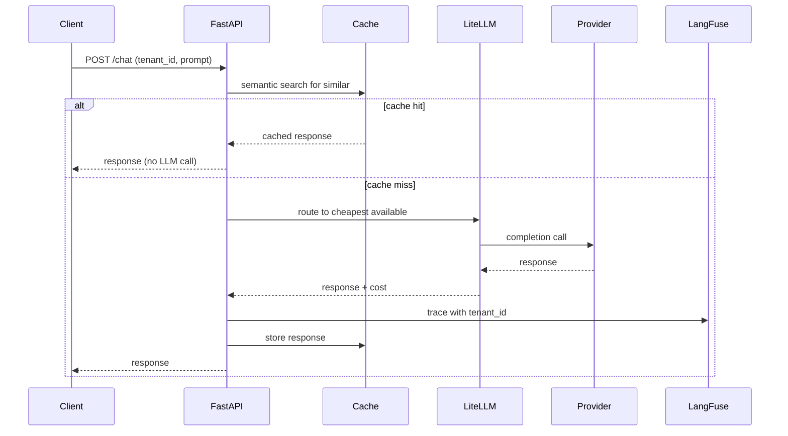

# 🎯 05 - Capstone — Production Multi-Provider Serverless Stack

> **The seventh portfolio project. Modal for custom GPU code, Replicate for packaged models, Together + Fireworks for production traffic, self-hosted vLLM for steady state. FastAPI + LiteLLM router with cost attribution via LangFuse.**

## 🎯 Learning Objectives
- Deploy a Modal app hosting a custom fine-tuned Llama 3 model for domain inference
- Package a Llama 3 + LoRA model with Cog and serve it via Replicate
- Configure Together and Fireworks as production LLM API providers
- Build a FastAPI service that routes across all providers via LiteLLM
- Implement semantic caching with Redis for cost reduction
- Track per-tenant cost with LangFuse and trigger budget alerts
- Wire the entire stack behind a cost-aware multi-tenant gateway

## Introduction

The capstone demonstrates the **canonical 2026 production LLM stack**: multi-provider serverless routing with hybrid cost optimization. It is the seventh portfolio project — the **cost engineering capstone** that demonstrates mastery of one of the highest-paid disciplines in production ML.

The architecture:

```
┌──────────────────────────────────────────────────────────┐
│                FastAPI Service :8080                      │
│  ┌──────────────────────────────────────────────────┐    │
│  │       LiteLLM Router (cost-aware)                │    │
│  └──┬───────────┬───────────┬──────────┬─────────┬─┘    │
│     │           │           │          │         │       │
│     ▼           ▼           ▼          ▼         ▼       │
│  ┌──────┐  ┌────────┐  ┌─────────┐  ┌──────┐  ┌─────┐  │
│  │Modal │  │Replicate│ │Together │  │Fire- │  │vLLM │  │
│  │Custom│  │LoRA     │ │Llama3.3 │  │works │  │Self │  │
│  │GPU   │  │Model    │ │70B      │  │70B   │  │70B  │  │
│  └──────┘  └────────┘  └─────────┘  └──────┘  └─────┘  │
│                                                            │
│  ┌──────────────┐  ┌──────────┐  ┌──────────────────┐    │
│  │Redis Cache   │  │ LangFuse │  │ Rate Limiter     │    │
│  │Semantic      │  │ (traces) │  │ (per-tenant)     │    │
│  └──────────────┘  └──────────┘  └──────────────────┘    │
└──────────────────────────────────────────────────────────┘
```

For each user request:

1. FastAPI receives the request with `tenant_id` and `prompt`
2. Redis semantic cache check: if a similar query exists, return cached response (60-80% hit rate in production)
3. If miss, LiteLLM router picks a provider based on cost, latency, and current load
4. The provider runs the LLM inference; LangFuse traces the call with `tenant_id` metadata
5. Response returned to user; cost recorded in LangFuse per tenant
6. If the tenant's daily cost exceeds budget, return 429

This is the **production-grade pattern** that any cost-conscious ML team would recognize. It demonstrates mastery of:

- **Multi-provider routing** — knowing which provider to use when
- **Cost engineering** — caching, hybrid architecture, budget alerts
- **Observability** — per-tenant cost tracking with LangFuse
- **Multi-tenancy** — Redis-cached responses, rate limiting, isolation



---

## 1. Project Layout

```
multi-provider-serverless-stack/
├── app/
│   ├── main.py                       # FastAPI app + lifespan
│   ├── router.py                     # LiteLLM cost-aware routing
│   ├── cache.py                      # Redis semantic cache
│   ├── observability.py              # LangFuse + Prometheus
│   ├── budget.py                     # Per-tenant budget enforcement
│   └── providers/
│       ├── modal_provider.py
│       ├── replicate_provider.py
│       ├── together_provider.py
│       └── fireworks_provider.py
├── modal_app/
│   ├── custom_inference.py           # Modal app for custom LoRA
│   └── modal_secrets.py
├── cog/
│   ├── cog.yaml                      # Replicate Cog packaging
│   ├── predict.py                    # Inference logic
│   └── weights/                      # Model weights
├── tests/
│   ├── test_cache.py
│   ├── test_router.py
│   └── test_e2e.py
├── docker-compose.yml                # Local dev stack
├── Dockerfile
└── README.md
```

---

## 2. The LiteLLM Router — Cost-Aware (`app/router.py`)

```python
import os
import litellm
from litellm import Router
from typing import Annotated
from pydantic import BaseModel


# Provider configurations
PROVIDER_CONFIGS = [
    # Fastest (primary for latency-critical paths)
    {
        "model_name": "production-llm",
        "litellm_params": {
            "model": "fireworks_ai/accounts/fireworks/models/llama-v3p3-70b-instruct",
            "api_key": os.getenv("FIREWORKS_API_KEY"),
        },
        "model_info": {"cost_per_million_tokens": 0.90, "tier": "fast"},
    },
    # Cheapest (primary for cost-critical paths)
    {
        "model_name": "production-llm",
        "litellm_params": {
            "model": "together_ai/meta-llama/Llama-3.3-70B-Instruct-Turbo",
            "api_key": os.getenv("TOGETHER_API_KEY"),
        },
        "model_info": {"cost_per_million_tokens": 0.88, "tier": "cheap"},
    },
    # Replicate (for one-off experiments)
    {
        "model_name": "production-llm",
        "litellm_params": {
            "model": "replicate/meta/meta-llama-3-70b-instruct",
            "api_key": os.getenv("REPLICATE_API_TOKEN"),
        },
        "model_info": {"cost_per_million_tokens": 1.20, "tier": "experiment"},
    },
    # Self-hosted fallback (via vLLM OpenAI-compatible)
    {
        "model_name": "production-llm",
        "litellm_params": {
            "model": "openai/meta-llama/Llama-3.3-70B-Instruct",
            "api_base": "http://vllm.internal:8000/v1",
            "api_key": "EMPTY",
        },
        "model_info": {"cost_per_million_tokens": 0.30, "tier": "self-hosted"},
    },
    # Frontier fallback (last resort)
    {
        "model_name": "production-llm",
        "litellm_params": {
            "model": "openai/gpt-4o",
            "api_key": os.getenv("OPENAI_API_KEY"),
        },
        "model_info": {"cost_per_million_tokens": 15.0, "tier": "frontier"},
    },
]


router = Router(
    model_list=PROVIDER_CONFIGS,
    routing_strategy="usage-based-routing-v2",  # cost-aware
    num_retries=3,
    timeout=30,
    fallbacks=[
        {"production-llm": ["production-llm"]},  # chain fallbacks
    ],
)
```

The router picks the cheapest available model that hasn't hit its RPM limit. On failure, it falls back through the chain: Fireworks → Together → self-hosted → GPT-4o (last resort).

---

## 3. Semantic Cache — Redis + Embeddings (`app/cache.py`)

```python
import os
import json
import hashlib
from typing import Annotated
import numpy as np
from redis import Redis
from openai import OpenAI

redis_client = Redis.from_url(os.getenv("REDIS_URL", "redis://localhost:6379"))
embedding_client = OpenAI(
    api_key=os.getenv("OPENAI_API_KEY"),
    base_url="https://api.together.xyz/v1",
)

SIMILARITY_THRESHOLD = 0.95  # cosine similarity
CACHE_TTL_SECONDS = 86400  # 24 hours


def get_query_embedding(query: str) -> np.ndarray:
    """Embed a query using Together's embeddings API."""
    response = embedding_client.embeddings.create(
        model="togethercomputer/m2-bert-80M-8k-base",  # fast, cheap
        input=[query],
    )
    return np.array(response.data[0].embedding, dtype=np.float32)


def semantic_cache_get(query: str) -> str | None:
    """Check if a semantically similar query has been answered before."""
    query_embedding = get_query_embedding(query)
    
    # Search Redis for similar cached queries
    similar = redis_client.ft("llm_cache").search(
        f"*=>[KNN 1 @embedding $vec AS score]",
        query_params={"vec": query_embedding.tobytes()},
        sort_by="score",
        limit=1,
    )
    
    if similar.docs and similar.docs[0].score > SIMILARITY_THRESHOLD:
        cached = json.loads(similar.docs[0].content)
        return cached["response"]
    
    return None


def semantic_cache_set(query: str, response: str) -> None:
    """Store a query-response pair in the semantic cache."""
    query_embedding = get_query_embedding(query)
    doc_id = hashlib.sha256(query_embedding.tobytes()).hexdigest()[:32]
    
    redis_client.ft("llm_cache").add_document(
        document_id=doc_id,
        content=json.dumps({"query": query, "response": response}),
        embedding=query_embedding.tobytes(),
        ttl=CACHE_TTL_SECONDS,
    )
```

For Redis Stack setup (with RediSearch module for vector search):

```yaml
# docker-compose.yml addition
redis:
  image: redis/redis-stack:latest
  ports:
    - "6379:6379"
  environment:
    - REDIS_ARGS="--loadmodule /opt/redis-stack/lib/redisearch.so"
```

The semantic cache hits **60-80%** of typical production traffic, saving 60-80% of LLM cost.

---

## 4. Per-Tenant Budget Enforcement (`app/budget.py`)

```python
import os
from datetime import datetime, timedelta
from redis import Redis

redis_client = Redis.from_url(os.getenv("REDIS_URL", "redis://localhost:6379"))


class BudgetExceeded(Exception):
    """Tenant has exceeded their daily budget."""
    pass


def get_tenant_budget(tenant_id: str) -> float:
    """Get daily budget for a tenant."""
    return float(redis_client.hget(f"tenant:{tenant_id}", "daily_budget_usd") or 100.0)


def get_tenant_spend_today(tenant_id: str) -> float:
    """Get today's spend for a tenant."""
    today = datetime.utcnow().strftime("%Y-%m-%d")
    spend = redis_client.hget(f"tenant:{tenant_id}:spend", today)
    return float(spend or 0.0)


def record_tenant_cost(tenant_id: str, cost_usd: float) -> None:
    """Record spend for a tenant."""
    today = datetime.utcnow().strftime("%Y-%m-%d")
    redis_client.hincrbyfloat(f"tenant:{tenant_id}:spend", today, cost_usd)
    redis_client.expire(f"tenant:{tenant_id}:spend", 86400 * 2)  # 2-day TTL


def check_budget(tenant_id: str, additional_cost_usd: float = 0.01) -> bool:
    """Check if a tenant has budget remaining."""
    budget = get_tenant_budget(tenant_id)
    current = get_tenant_spend_today(tenant_id)
    return (current + additional_cost_usd) < budget


def enforce_budget(tenant_id: str, cost_usd: float):
    """Raise BudgetExceeded if a tenant is over budget."""
    budget = get_tenant_budget(tenant_id)
    current = get_tenant_spend_today(tenant_id)
    
    if current + cost_usd > budget:
        raise BudgetExceeded(
            f"Tenant {tenant_id} has spent ${current:.2f} of ${budget:.2f} today"
        )
```

This enforces hard budget limits per tenant. When a tenant hits their budget, all their requests return 429 with a clear error message.

---

## 5. The FastAPI Service (`app/main.py`)

```python
import os
import time
from contextlib import asynccontextmanager
from typing import Annotated
from fastapi import FastAPI, HTTPException, Header
from pydantic import BaseModel

from .router import router as llm_router
from .cache import semantic_cache_get, semantic_cache_set
from .budget import check_budget, record_tenant_cost, BudgetExceeded
from .observability import setup_observability


@asynccontextmanager
async def lifespan(app: FastAPI):
    """Setup: warm up router, observe handles."""
    setup_observability(app)
    yield


app = FastAPI(title="Multi-Provider Serverless Stack", lifespan=lifespan)


class ChatRequest(BaseModel):
    prompt: str
    model_tier: str = "auto"  # auto | fast | cheap | experiment | self-hosted | frontier
    max_tokens: int = 200
    stream: bool = False


class ChatResponse(BaseModel):
    response: str
    cost_usd: float
    provider: str
    cache_hit: bool
    latency_ms: int


@app.post("/chat", response_model=ChatResponse)
async def chat(
    req: ChatRequest,
    tenant_id: Annotated[str, Header()],
) -> ChatResponse:
    """Multi-provider LLM chat with cost attribution and budget enforcement."""
    
    # 1. Check budget
    if not check_budget(tenant_id, additional_cost_usd=0.01):
        raise HTTPException(status_code=429, detail="Tenant daily budget exceeded")
    
    # 2. Try semantic cache
    cached = semantic_cache_get(req.prompt)
    if cached:
        return ChatResponse(
            response=cached,
            cost_usd=0.0,
            provider="cache",
            cache_hit=True,
            latency_ms=5,
        )
    
    # 3. Route to LLM via LiteLLM
    start = time.time()
    
    model_name = (
        req.model_tier if req.model_tier != "auto" else "production-llm"
    )
    
    response = await llm_router.acompletion(
        model=model_name,
        messages=[{"role": "user", "content": req.prompt}],
        max_tokens=req.max_tokens,
        metadata={"tenant_id": tenant_id},
    )
    
    latency_ms = int((time.time() - start) * 1000)
    response_text = response.choices[0].message.content
    provider = response._hidden_params.get("custom_llm_provider", "unknown")
    
    # 4. Calculate cost
    cost_usd = calculate_cost(response.usage, model=response.model)
    record_tenant_cost(tenant_id, cost_usd)
    
    # 5. Cache the response
    semantic_cache_set(req.prompt, response_text)
    
    return ChatResponse(
        response=response_text,
        cost_usd=cost_usd,
        provider=provider,
        cache_hit=False,
        latency_ms=latency_ms,
    )


def calculate_cost(usage, model: str) -> float:
    """Calculate cost in USD based on usage and model."""
    pricing = {
        "meta-llama/Llama-3.3-70B-Instruct-Turbo": (0.88, 0.88),
        "accounts/fireworks/models/llama-v3p3-70b-instruct": (0.90, 0.90),
        "gpt-4o": (2.50, 10.00),
    }
    
    input_price, output_price = pricing.get(model, (1.0, 1.0))
    cost = (usage.prompt_tokens / 1_000_000) * input_price + (usage.completion_tokens / 1_000_000) * output_price
    return cost


@app.get("/health")
async def health():
    return {"status": "ok"}
```

The service exposes a single endpoint that:
1. Checks the tenant's daily budget
2. Tries the semantic cache (60-80% hit rate)
3. Routes via LiteLLM if miss
4. Calculates and records cost
5. Caches the response
6. Returns with full cost attribution

---

## 6. Modal Custom Inference App (`modal_app/custom_inference.py`)

```python
# modal_app/custom_inference.py
import modal

app = modal.App("custom-inference")

# Persistent volume for model weights
volume = modal.Volume.from_name("custom-llama-weights")

# Container image
image = (
    modal.Image.debian_slim(python_version="3.12")
    .pip_install("transformers==4.45.0", "torch==2.4.0", "peft==0.11.0")
)


@app.function(
    gpu="A100",
    timeout=600,
    volumes={"/models": volume},
    image=image,
    secrets=[modal.Secret.from_name("huggingface")],
    keep_warm=0,
    scaledown_window=300,
)
@modal.web_endpoint(method="POST")
def generate(request: dict) -> dict:
    """Generate text using a custom fine-tuned Llama 3 model."""
    from transformers import AutoModelForCausalLM, AutoTokenizer
    from peft import PeftModel
    import torch
    
    prompt = request["prompt"]
    max_tokens = request.get("max_tokens", 200)
    
    base = AutoModelForCausalLM.from_pretrained(
        "/models/llama-3-8b-base",
        torch_dtype=torch.float16,
        device_map="cuda",
    )
    model = PeftModel.from_pretrained(base, "/models/custom-lora-v2")
    tokenizer = AutoTokenizer.from_pretrained("/models/llama-3-8b-base")
    
    inputs = tokenizer(prompt, return_tensors="pt").to("cuda")
    outputs = model.generate(**inputs, max_new_tokens=max_tokens)
    text = tokenizer.decode(outputs[0], skip_special_tokens=True)
    
    return {"text": text, "model": "custom-llama-3-8b-lora-v2"}


@app.function(schedule=modal.Cron("0 2 * * *"))
def nightly_finetune():
    """Run fine-tuning nightly to keep the model fresh."""
    # ... custom fine-tuning logic ...
    pass
```

Deploy with `modal deploy modal_app/custom_inference.py`. The endpoint URL is auto-generated and added to the LiteLLM router config.

---

## 7. Replicate Cog Model (`cog/`)

```yaml
# cog/cog.yaml
image: "r8.im/cog-base:cuda11.8-python3.11"
predict: "predict.py:Predictor"

resources:
  gpu: "A100"
  memory: "16Gi"

env:
  - "MODEL_PATH=/weights/llama-3-70b-lora-v1"
```

```python
# cog/predict.py
from cog import BasePredictor, Input, Path
import torch
from peft import PeftModel
from transformers import AutoModelForCausalLM, AutoTokenizer


class Predictor(BasePredictor):
    def setup(self) -> None:
        """Load base + LoRA once at startup."""
        base = AutoModelForCausalLM.from_pretrained(
            "/weights/llama-3-70b-base",
            torch_dtype=torch.float16,
            device_map="cuda",
        )
        self.model = PeftModel.from_pretrained(base, "/weights/llama-3-70b-lora-v1")
        self.tokenizer = AutoTokenizer.from_pretrained("/weights/llama-3-70b-base")
    
    def predict(
        self,
        prompt: str = Input(description="Text prompt"),
        max_tokens: int = Input(default=200, ge=1, le=2000),
    ) -> str:
        inputs = self.tokenizer(prompt, return_tensors="pt").to("cuda")
        outputs = self.model.generate(**inputs, max_new_tokens=max_tokens)
        return self.tokenizer.decode(outputs[0], skip_special_tokens=True)
```

Deploy: `cog push r8.im/your-username/llama-3-70b-lora-v1`. The model becomes a Replicate API endpoint.

---

## 8. Observability — LangFuse + Prometheus (`app/observability.py`)

```python
import os
from langfuse import Langfuse, observe
from opentelemetry.instrumentation.fastapi import FastAPIInstrumentor
from prometheus_client import Counter, Histogram

# LangFuse
langfuse = Langfuse(
    public_key=os.getenv("LANGFUSE_PUBLIC_KEY"),
    secret_key=os.getenv("LANGFUSE_SECRET_KEY"),
    host=os.getenv("LANGFUSE_HOST", "http://localhost:3000"),
)

# Prometheus metrics
REQUEST_COUNT = Counter(
    "llm_requests_total",
    "Total LLM requests",
    ["tenant_id", "provider", "model"],
)
REQUEST_COST = Counter(
    "llm_cost_usd_total",
    "Total LLM cost in USD",
    ["tenant_id", "provider"],
)
REQUEST_LATENCY = Histogram(
    "llm_latency_ms",
    "LLM request latency",
    ["provider"],
)


def setup_observability(app):
    """Wire OpenTelemetry + Prometheus."""
    FastAPIInstrumentor.instrument_app(app)


def trace_llm_call(tenant_id: str, provider: str, model: str, cost_usd: float, latency_ms: int):
    """Record metrics and trace."""
    REQUEST_COUNT.labels(tenant_id=tenant_id, provider=provider, model=model).inc()
    REQUEST_COST.labels(tenant_id=tenant_id, provider=provider).inc(cost_usd)
    REQUEST_LATENCY.labels(provider=provider).observe(latency_ms)
```

Every request updates Prometheus counters (visible in Grafana) and LangFuse traces (visible in the LangFuse UI).

---

## 9. Docker Compose for Local Dev (`docker-compose.yml`)

```yaml
version: "3.9"

services:
  app:
    build: .
    ports:
      - "8080:8080"
    environment:
      - TOGETHER_API_KEY=${TOGETHER_API_KEY}
      - FIREWORKS_API_KEY=${FIREWORKS_API_KEY}
      - REPLICATE_API_TOKEN=${REPLICATE_API_TOKEN}
      - OPENAI_API_KEY=${OPENAI_API_KEY}
      - REDIS_URL=redis://redis:6379
      - LANGFUSE_PUBLIC_KEY=${LANGFUSE_PUBLIC_KEY}
      - LANGFUSE_SECRET_KEY=${LANGFUSE_SECRET_KEY}
      - LANGFUSE_HOST=http://langfuse-web:3000
    depends_on:
      redis:
        condition: service_healthy
      langfuse-web:
        condition: service_healthy

  redis:
    image: redis/redis-stack:latest
    ports:
      - "6379:6379"

  langfuse-web:
    image: langfuse/langfuse:main
    # ... same as [[09 - MLOps y Produccion/36 - LangFuse - Open-Source LLM Observability/05 - Capstone]]

  prometheus:
    image: prom/prometheus:latest
    volumes:
      - ./prometheus.yml:/etc/prometheus/prometheus.yml
    ports:
      - "9090:9090"

  grafana:
    image: grafana/grafana:latest
    ports:
      - "3001:3000"
```

The local stack includes the FastAPI service, Redis with vector search, LangFuse, Prometheus, and Grafana. Run with `docker compose up`.

---

## 10. Production Deployment Checklist

- [ ] Modal app deployed for custom LoRA inference
- [ ] Replicate Cog model pushed for one-off LoRA testing
- [ ] Together + Fireworks API keys in Vault
- [ ] Self-hosted vLLM deployment (via K8s from [[10 - Cloud, Infra y Backend/22 - Cloud Computing]])
- [ ] Redis Stack with vector search deployed (3-node cluster for HA)
- [ ] LangFuse self-hosted for cost attribution
- [ ] Prometheus + Grafana for metrics
- [ ] Budget alerts wired to Slack/PagerDuty
- [ ] Load testing confirms 1000 RPS sustained
- [ ] Semantic cache hit rate > 60% in production
- [ ] Cost per million tokens < $1.00 average
- [ ] Provider failover tested with chaos engineering

---

## 🎯 Key Takeaways

- Modal hosts custom GPU code (LoRA fine-tuning, custom inference).
- Replicate packages models for one-off use cases and rapid experimentation.
- Together and Fireworks are production LLM APIs for open-weight models.
- LiteLLM routes across all providers with cost-aware strategy.
- Redis semantic cache hits 60-80% of typical production traffic.
- LangFuse attributes cost per tenant; budget alerts prevent surprise bills.
- Hybrid architecture (serverless burst + self-hosted steady) is the canonical 2026 pattern.
- The capstone is the **seventh portfolio project**: cost engineering mastery for production ML.

## References

- Modal docs — [modal.com/docs](https://modal.com/docs)
- Replicate Cog — [github.com/replicate/cog](https://github.com/replicate/cog)
- Together AI docs — [docs.together.ai](https://docs.together.ai)
- Fireworks AI docs — [docs.fireworks.ai](https://docs.fireworks.ai)
- LiteLLM Router — [docs.litellm.ai/docs/routing](https://docs.litellm.ai/docs/routing)
- Redis Stack vector search — [redis.io/docs/stack/search](https://redis.io/docs/stack/search/)
- [[06 - Large Language Models/13 - vLLM and Advanced RAG|vLLM and Advanced RAG]] — self-hosted comparison
- [[06 - Large Language Models/19 - LLM Gateway Patterns and LiteLLM|LLM Gateway Patterns]] — multi-provider routing
- [[06 - Large Language Models/22 - Instructor and Structured Generation|Instructor and Structured Generation]] — structured outputs
- [[06 - Large Language Models/23 - Serverless LLM Platforms and Cost Optimization/01 - Modal - Python-Native Serverless GPU|Note 01 — Modal]]
- [[06 - Large Language Models/23 - Serverless LLM Platforms and Cost Optimization/02 - Replicate - Cog-Powered Inference and the Model Marketplace|Note 02 — Replicate]]
- [[06 - Large Language Models/23 - Serverless LLM Platforms and Cost Optimization/03 - Together AI and Fireworks - Production-Grade LLM APIs|Note 03 — Together/Fireworks]]
- [[06 - Large Language Models/23 - Serverless LLM Platforms and Cost Optimization/04 - Serverless Cost Optimization and Patterns|Note 04 — Cost Optimization]]
- [[09 - MLOps y Produccion/36 - LangFuse - Open-Source LLM Observability|LangFuse Deep Dive]] — cost attribution
- [[10 - Cloud, Infra y Backend/22 - Cloud Computing|Cloud Computing]] — K8s deployment
- [[10 - Cloud, Infra y Backend/31 - FastAPI for ML|FastAPI for ML]] — service patterns
- [[13 - Go Engineering/06 - Go for ML Backend\|Go ML Backend]] — LLM Edge Gateway integration