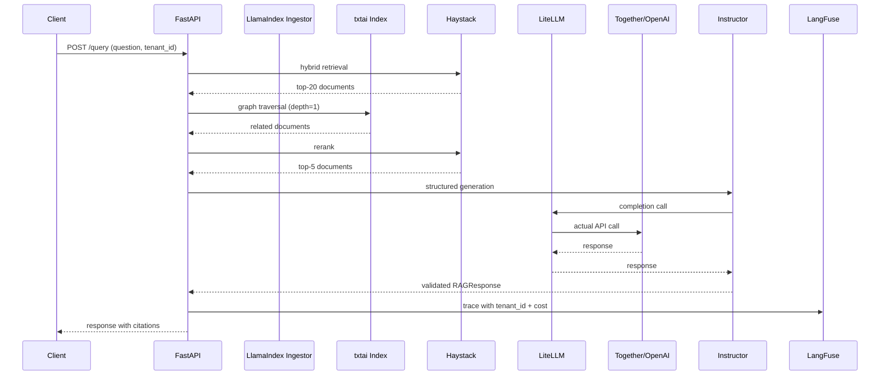

# 🎯 05 - Capstone — Production Hybrid RAG Service

> **The eighth portfolio project. LlamaIndex for multi-modal ingestion, txtai for multi-hop graph retrieval, Haystack for hybrid pipelines + reranking, LiteLLM for multi-provider LLM, LangFuse for cost attribution, Pydantic via Instructor for structured responses.**

## 🎯 Learning Objectives
- Build a production RAG service composing LlamaIndex, Haystack, txtai, and Instructor
- Deploy multi-modal ingestion (PDF, image, audio) via LlamaIndex
- Wire multi-hop graph retrieval via txtai
- Implement hybrid search + cross-encoder reranking via Haystack
- Use LiteLLM to route across OpenAI, Anthropic, Together AI, Fireworks
- Track per-tenant cost via LangFuse with budget enforcement
- Run RAGAS evaluation against a 50-item golden dataset in CI

## Introduction

The capstone is the **multi-framework production RAG service** that demonstrates the cross-framework composition patterns from Note 04. Each framework has a specific responsibility:

- **LlamaIndex** — multi-modal ingestion (PDFs, images, audio)
- **txtai** — multi-hop graph retrieval (when relationships matter)
- **Haystack** — hybrid search + cross-encoder reranking + typed pipeline
- **Instructor + Pydantic** — structured RAG responses with citations
- **LiteLLM** — multi-provider LLM routing
- **LangFuse** — per-tenant cost attribution
- **RAGAS** — offline evaluation on a golden dataset

The architecture:

```
                  ┌──────────────────┐
                  │   FastAPI :8080   │
                  └────────┬─────────┘
                           │
        ┌──────────────────┼──────────────────┐
        │                  │                  │
        ▼                  ▼                  ▼
  ┌──────────┐      ┌──────────┐      ┌─────────────┐
  │/ingest   │      │/search   │      │/query       │
  │LlamaIndex│      │txtai     │      │Haystack    │
  │multi-mod │      │multi-hop │      │hybrid+rerank│
  └─────┬────┘      └─────┬────┘      └──────┬──────┘
        │                  │                  │
        └──────────────────┼──────────────────┘
                           ▼
                ┌──────────────────┐
                │   Qdrant + PG    │
                │  (vector store)  │
                └──────────────────┘
                           ▼
                ┌──────────────────┐
                │  LiteLLM Router  │
                │ (multi-provider) │
                └──────────────────┘
                           ▼
              ┌────────────────────────┐
              │  LLM (Together/OpenAI) │
              └────────────────────────┘
                           ▼
                ┌──────────────────┐
                │ Instructor v2     │
                │ (Pydantic output) │
                └──────────────────┘
                           ▼
                ┌──────────────────┐
                │ LangFuse trace   │
                │ (cost + quality) │
                └──────────────────┘
```



This is the **eighth portfolio project**. It demonstrates mastery of multi-framework composition, multi-modal ingestion, multi-hop retrieval, hybrid search, cross-encoder reranking, structured outputs, multi-provider LLM routing, and production observability.

---

## 1. Project Layout

```
hybrid-rag-service/
├── app/
│   ├── main.py                       # FastAPI app + lifespan
│   ├── ingestor.py                   # LlamaIndex multi-modal ingestion
│   ├── txtai_retriever.py            # txtai multi-hop retrieval
│   ├── haystack_pipeline.py          # Haystack hybrid + reranking
│   ├── llm_router.py                 # LiteLLM multi-provider routing
│   ├── structured_output.py          # Instructor + Pydantic
│   ├── observability.py              # LangFuse + Phoenix
│   └── budget.py                     # Per-tenant budget enforcement
├── data/
│   ├── documents/                    # Raw PDFs, images, audio
│   └── uploads/                      # User-uploaded files
├── eval/
│   ├── golden_dataset.json           # 50 hand-curated test cases
│   └── run_ragas.py                  # CI evaluation runner
├── docker-compose.yml                # Local dev stack
├── Dockerfile
├── pipeline.yaml                     # Haystack pipeline config
└── README.md
```

---

## 2. The Ingestion Pipeline — LlamaIndex Multi-Modal (`app/ingestor.py`)

```python
import os
from pathlib import Path
from llama_index.core import SimpleDirectoryReader, VectorStoreIndex, StorageContext
from llama_index.vector_stores.qdrant import QdrantVectorStore
from llama_index.multi_modal_llms.openai import OpenAIMultiModal
from qdrant_client import QdrantClient
from haystack.dataclasses import Document


def build_multimodal_index(docs_path: str = "./data/documents") -> VectorStoreIndex:
    """Build a multi-modal index from PDFs, images, audio in the documents directory."""
    
    # LlamaIndex auto-detects file types (PDF, image, audio)
    documents = SimpleDirectoryReader(
        docs_path,
        recursive=True,
        # Auto-detect PDF text + images, audio transcripts
        file_extractor={
            ".pdf": ...,  # PDF loader with image extraction
            ".png": ...,  # Image loader with CLIP-style embeddings
            ".mp3": ...,  # Audio loader with Whisper transcription
        },
    ).load_data()
    
    # Qdrant client
    qdrant_client = QdrantClient(url=os.getenv("QDRANT_URL", "http://localhost:6333"))
    qdrant_store = QdrantVectorStore(
        client=qdrant_client,
        collection_name="hybrid_rag_documents",
    )
    
    # Build the multi-modal index
    storage_context = StorageContext.from_defaults(vector_store=qdrant_store)
    index = VectorStoreIndex.from_documents(
        documents,
        storage_context=storage_context,
        transformations=[...],  # chunking, metadata extraction
    )
    
    return index


def export_to_haystack_documents(index: VectorStoreIndex) -> list[Document]:
    """Export LlamaIndex documents to Haystack Document format."""
    haystack_docs = []
    for node in index.docstore.docs.values():
        haystack_docs.append(
            Document(
                content=node.get_content(),
                meta={
                    "doc_id": node.node_id,
                    "source": node.metadata.get("file_path", ""),
                    "file_type": node.metadata.get("file_type", ""),
                    **node.metadata,
                },
            )
        )
    return haystack_docs
```

The ingestor reads PDFs (text + embedded images), images (CLIP embeddings), and audio (Whisper transcripts). LlamaIndex's `SimpleDirectoryReader` handles the file-type detection automatically.

---

## 3. The txtai Multi-Hop Retriever (`app/txtai_retriever.py`)

```python
import os
from txtai import Embeddings


class TxtaiMultiHopRetriever:
    """txtai embeddings + graph for multi-hop retrieval."""
    
    def __init__(self):
        self.embeddings = Embeddings(
            path="sentence-transformers/all-MiniLM-L6-v2",
            content=True,  # hybrid search
            graph={"backend": "networkx"},
        )
    
    def index_documents(self, haystack_documents: list[Document]) -> None:
        """Build the embeddings + graph index from Haystack documents."""
        # Index documents (txtai expects (id, text, tags) tuples)
        indexed = [
            (i, doc.content, doc.meta)
            for i, doc in enumerate(haystack_documents)
        ]
        self.embeddings.index(indexed)
        
        # Add graph relationships based on metadata
        for i, doc in enumerate(haystack_documents):
            source = doc.meta.get("source", "")
            # Documents from the same file are related
            for j, other in enumerate(haystack_documents):
                if i != j and other.meta.get("source") == source:
                    self.embeddings.graph.add((i, j, "from_same_source"))
    
    def search(self, query: str, limit: int = 5, graph_depth: int = 1) -> list[dict]:
        """Search with graph traversal."""
        results = self.embeddings.search(
            query,
            limit=limit,
            graph={"depth": graph_depth} if graph_depth > 0 else False,
        )
        return results
```

The txtai retriever indexes the same documents as Haystack and adds graph edges based on metadata (e.g., "from_same_source", "cites", "references"). For multi-hop queries, the graph traversal finds related documents beyond the initial semantic match.

---

## 4. The Haystack Pipeline — Hybrid + Reranking (`app/haystack_pipeline.py`)

```python
from haystack import Pipeline
from haystack.components.embedders import SentenceTransformersTextEmbedder
from haystack.components.retrievers import InMemoryBM25Retriever, QdrantEmbeddingRetriever
from haystack.components.rankers import SentenceTransformersSimilarityRanker
from haystack.components.joiners import DocumentJoiner
from haystack.components.builders import PromptBuilder


def build_haystack_pipeline(qdrant_url: str) -> Pipeline:
    """Build the hybrid + rerank Haystack pipeline."""
    
    pipeline = Pipeline()
    
    # Dense retriever (Qdrant)
    pipeline.add_component(
        "qdrant_retriever",
        QdrantEmbeddingRetriever(
            document_store=qdrant_url,
            embedding_dim=384,
            top_k=20,
        ),
    )
    
    # Sparse retriever (BM25)
    pipeline.add_component(
        "bm25_retriever",
        InMemoryBM25Retriever(
            document_store=qdrant_url,
            top_k=20,
        ),
    )
    
    # Embedding model for dense queries
    pipeline.add_component(
        "text_embedder",
        SentenceTransformersTextEmbedder(
            model="sentence-transformers/all-MiniLM-L6-v2",
        ),
    )
    
    # Reciprocal Rank Fusion joiner
    pipeline.add_component(
        "joiner",
        DocumentJoiner(
            join_mode="reciprocal_rank_fusion",
            weights=[0.6, 0.4],
        ),
    )
    
    # Cross-encoder reranker
    pipeline.add_component(
        "ranker",
        SentenceTransformersSimilarityRanker(
            model="cross-encoder/ms-marco-MiniLM-L-6-v2",
            top_k=5,
        ),
    )
    
    # Connect
    pipeline.connect("text_embedder.embedding", "qdrant_retriever.query_embedding")
    pipeline.connect("qdrant_retriever.documents", "joiner.documents")
    pipeline.connect("bm25_retriever.documents", "joiner.documents")
    pipeline.connect("joiner.documents", "ranker.documents")
    
    return pipeline
```

The Haystack pipeline performs:
1. Dense retrieval from Qdrant (semantic)
2. Sparse retrieval via BM25 (keyword)
3. Reciprocal Rank Fusion merge
4. Cross-encoder reranking → top-5

---

## 5. The LLM Router — LiteLLM Multi-Provider (`app/llm_router.py`)

```python
import os
import litellm


router = litellm.Router(
    model_list=[
        # Cheap + fast (primary)
        {
            "model_name": "production-llm",
            "litellm_params": {
                "model": "fireworks_ai/accounts/fireworks/models/llama-v3p3-70b-instruct",
                "api_key": os.getenv("FIREWORKS_API_KEY"),
            },
            "model_info": {"tier": "fast", "cost_per_million": 0.90},
        },
        # Cost-optimized (fallback)
        {
            "model_name": "production-llm",
            "litellm_params": {
                "model": "together_ai/meta-llama/Llama-3.3-70B-Instruct-Turbo",
                "api_key": os.getenv("TOGETHER_API_KEY"),
            },
            "model_info": {"tier": "cheap", "cost_per_million": 0.88},
        },
        # Frontier (last resort)
        {
            "model_name": "production-llm",
            "litellm_params": {
                "model": "openai/gpt-4o",
                "api_key": os.getenv("OPENAI_API_KEY"),
            },
            "model_info": {"tier": "frontier", "cost_per_million": 15.0},
        },
    ],
    routing_strategy="usage-based-routing-v2",
    num_retries=3,
    timeout=30,
)
```

The router picks the cheapest available provider (covered in [[06 - Large Language Models/23 - Serverless LLM Platforms and Cost Optimization/05 - Capstone - Production Multi-Provider Serverless Stack|Serverless LLM Capstone]]).

---

## 6. The Structured Output — Instructor + Pydantic (`app/structured_output.py`)

```python
import instructor
from openai import OpenAI
from pydantic import BaseModel, Field
from typing import List


class Citation(BaseModel):
    """A citation pointing to a source document."""
    doc_id: str
    snippet: str
    score: float


class RAGResponse(BaseModel):
    """Structured RAG response with citations."""
    answer: str = Field(description="The answer to the user's question.")
    citations: List[Citation] = Field(description="List of citations used.")
    confidence: float = Field(ge=0, le=1, description="Model's self-reported confidence.")
    follow_up_questions: List[str] = Field(default_factory=list, description="Suggested follow-up questions.")


# Instructor client with LiteLLM as the backend
client = instructor.from_litellm(litellm.acompletion)


async def generate_structured_response(
    question: str,
    documents: list[dict],
    tenant_id: str,
) -> RAGResponse:
    """Generate a typed RAG response."""
    
    context = "\n\n---\n\n".join([
        f"[{doc['id']}] {doc['content'][:500]}"
        for doc in documents
    ])
    
    prompt = f"""Answer the user's question using ONLY the context below. Cite each source.

Context:
{context}

Question: {question}

Provide:
- A direct answer
- All citations used
- Your confidence (0-1)
- Up to 3 follow-up questions"""

    response = await client.chat.completions.create(
        model="production-llm",
        messages=[
            {"role": "system", "content": "You are a precise research assistant. Always cite sources."},
            {"role": "user", "content": prompt},
        ],
        response_model=RAGResponse,
        max_retries=3,
    )
    
    return response
```

The Instructor client validates the response against the Pydantic schema; retries on failure feed the validation error back to the model (covered in [[06 - Large Language Models/22 - Instructor and Structured Generation|Instructor Deep Dive]]).

---

## 7. The FastAPI Service (`app/main.py`)

```python
import os
import time
from contextlib import asynccontextmanager
from typing import Annotated
from fastapi import FastAPI, Header, HTTPException
from pydantic import BaseModel

from .ingestor import build_multimodal_index
from .txtai_retriever import TxtaiMultiHopRetriever
from .haystack_pipeline import build_haystack_pipeline
from .llm_router import router as llm_router
from .structured_output import generate_structured_response, RAGResponse
from .observability import setup_observability
from .budget import check_budget, record_tenant_cost


@asynccontextmanager
async def lifespan(app: FastAPI):
    """Setup: build indexes, hybrid pipeline, multi-hop retriever."""
    # LlamaIndex for multi-modal ingestion
    app.state.llama_index = build_multimodal_index("./data/documents")
    
    # Haystack hybrid pipeline
    app.state.haystack_pipeline = build_haystack_pipeline(
        qdrant_url=os.getenv("QDRANT_URL", "http://localhost:6333"),
    )
    
    # txtai multi-hop
    app.state.txtai_retriever = TxtaiMultiHopRetriever()
    
    setup_observability(app)
    yield


app = FastAPI(title="Production Hybrid RAG Service", lifespan=lifespan)


class QueryRequest(BaseModel):
    question: str
    enable_multi_hop: bool = True
    enable_reranking: bool = True


@app.post("/query", response_model=RAGResponse)
async def query(
    req: QueryRequest,
    tenant_id: Annotated[str, Header()],
) -> RAGResponse:
    """Hybrid RAG: LlamaIndex + txtai + Haystack + Instructor."""
    
    # 1. Check tenant budget
    if not check_budget(tenant_id):
        raise HTTPException(status_code=429, detail="Tenant budget exceeded")
    
    start = time.time()
    
    # 2. Haystack hybrid retrieval (returns top-5 reranked)
    haystack_result = app.state.haystack_pipeline.run({
        "text_embedder": {"text": req.question},
        "bm25_retriever": {"query": req.question},
    })
    documents = haystack_result["ranker"]["documents"]
    
    # 3. Optional: txtai multi-hop expansion
    if req.enable_multi_hop:
        multi_hop_docs = app.state.txtai_retriever.search(
            req.question, limit=3, graph_depth=1
        )
        documents.extend(multi_hop_docs)
    
    # 4. Instructor structured generation
    response = await generate_structured_response(
        question=req.question,
        documents=[{"id": d.id, "content": d.content} for d in documents],
        tenant_id=tenant_id,
    )
    
    # 5. Record cost
    cost_usd = calculate_cost(response, model="production-llm")
    record_tenant_cost(tenant_id, cost_usd)
    
    return response


@app.post("/ingest")
async def ingest_documents(docs_path: str):
    """Re-build the multi-modal index from documents in `docs_path`."""
    app.state.llama_index = build_multimodal_index(docs_path)
    return {"status": "indexed", "path": docs_path}


@app.get("/health")
async def health():
    return {"status": "ok"}
```

The FastAPI service composes all four frameworks:
1. LlamaIndex handles ingestion (`/ingest`)
2. Haystack handles hybrid retrieval
3. txtai handles multi-hop expansion
4. LiteLLM + Instructor handle structured generation

---

## 8. Offline Evaluation — RAGAS (`eval/run_ragas.py`)

```python
"""Run RAGAS evaluation on a golden dataset. CI integration."""
import asyncio
import json
from datasets import Dataset
from ragas import evaluate
from ragas.metrics import (
    context_precision,
    context_recall,
    faithfulness,
    answer_relevancy,
)
from langchain_openai import OpenAIEmbeddings
from app.main import build_app

with open("eval/golden_dataset.json") as f:
    golden_data = json.load(f)


async def run_eval():
    app = build_app()
    questions, answers, contexts, ground_truths = [], [], [], []
    
    for item in golden_data:
        question = item["question"]
        ground_truth = item["answer"]
        
        # Run the RAG pipeline
        response = await app.state.endpoint.query(
            req=item, tenant_id="eval_tenant"
        )
        
        questions.append(question)
        answers.append(response.answer)
        contexts.append([c.snippet for c in response.citations])
        ground_truths.append(ground_truth)
    
    # Build RAGAS dataset
    dataset = Dataset.from_dict({
        "question": questions,
        "answer": answers,
        "contexts": contexts,
        "ground_truth": ground_truths,
    })
    
    # Run RAGAS metrics
    results = evaluate(
        dataset,
        metrics=[
            context_precision,
            context_recall,
            faithfulness,
            answer_relevancy,
        ],
        llm=OpenAIEmbeddings(),
    )
    
    print(f"Context precision: {results['context_precision']:.2%}")
    print(f"Context recall: {results['context_recall']:.2%}")
    print(f"Faithfulness: {results['faithfulness']:.2%}")
    print(f"Answer relevancy: {results['answer_relevancy']:.2%}")
    
    # CI gates
    if results["faithfulness"] < 0.85:
        raise SystemExit(f"FAIL: Faithfulness {results['faithfulness']:.2%} < 85%")


if __name__ == "__main__":
    asyncio.run(run_eval())
```

CI integration:

```yaml
# .github/workflows/eval.yml
- name: RAGAS evaluation
  run: |
    python eval/run_ragas.py
    # Fails if faithfulness < 0.85
```

---

## 9. Observability — LangFuse + Phoenix

```python
from langfuse import observe, langfuse_context


@observe()
async def query_with_observability(req, tenant_id):
    langfuse_context.update_current_observation(metadata={
        "tenant_id": tenant_id,
        "framework_composition": "llamaindex+haystack+txtai",
        "multi_hop": req.enable_multi_hop,
        "rerank": req.enable_reranking,
    })
    
    # Haystack hybrid retrieval
    haystack_result = await app.state.haystack_pipeline.run_async(...)
    langfuse_context.update_current_span(metadata={
        "haystack_documents": len(haystack_result["ranker"]["documents"]),
    })
    
    # txtai multi-hop
    if req.enable_multi_hop:
        multi_hop = await app.state.txtai_retriever.search_async(...)
        langfuse_context.update_current_span(metadata={
            "multihop_documents": len(multi_hop),
        })
    
    # LLM generation
    response = await generate_structured_response(...)
    
    # Cost attribution
    langfuse_context.score_current_observation(
        name="ragas_faithfulness",
        value=response.confidence,
    )
    return response
```

The LangFuse UI shows the multi-framework composition trace with per-tenant cost attribution.

---

## 10. Docker Compose Stack (`docker-compose.yml`)

```yaml
version: "3.9"

services:
  app:
    build: .
    ports:
      - "8080:8080"
    environment:
      - OPENAI_API_KEY=${OPENAI_API_KEY}
      - ANTHROPIC_API_KEY=${ANTHROPIC_API_KEY}
      - TOGETHER_API_KEY=${TOGETHER_API_KEY}
      - FIREWORKS_API_KEY=${FIREWORKS_API_KEY}
      - QDRANT_URL=http://qdrant:6333
      - LANGFUSE_PUBLIC_KEY=${LANGFUSE_PUBLIC_KEY}
      - LANGFUSE_SECRET_KEY=${LANGFUSE_SECRET_KEY}
      - LANGFUSE_HOST=http://langfuse-web:3000
      - PHOENIX_OTLP_ENDPOINT=http://phoenix:4317/v1/traces
    depends_on:
      qdrant:
        condition: service_healthy
      langfuse-web:
        condition: service_healthy

  qdrant:
    image: qdrant/qdrant:latest
    ports:
      - "6333:6333"
    volumes:
      - qdrant_data:/qdrant/storage

  langfuse-web:
    image: langfuse/langfuse:main
    # ... same as [[09 - MLOps y Produccion/36 - LangFuse - Open-Source LLM Observability/05 - Capstone]]

  phoenix:
    image: arizephoenix/phoenix:latest
    ports:
      - "6006:6006"
      - "4317:4317"

  postgres:
    image: postgres:16-alpine
    environment:
      - POSTGRES_USER=postgres
      - POSTGRES_PASSWORD=postgres
      - POSTGRES_DB=langfuse
    volumes:
      - postgres_data:/var/lib/postgresql/data

  redis:
    image: redis:7-alpine
```

The local stack: FastAPI service, Qdrant vector store, LangFuse, Phoenix, Postgres, Redis. One command: `docker compose up`.

---

## 11. Production Deployment Checklist

- [ ] LlamaIndex multi-modal ingestion deployed and tested with sample PDFs/images
- [ ] Haystack hybrid pipeline with cross-encoder reranker
- [ ] txtai multi-hop graph built from document metadata
- [ ] LiteLLM routing across 3+ providers with cost-aware strategy
- [ ] Instructor + Pydantic validation on every LLM response
- [ ] LangFuse cost attribution per `tenant_id` verified in dashboard
- [ ] RAGAS evaluation passing at 85%+ faithfulness in CI
- [ ] Per-tenant budget enforcement with 429 on overflow
- [ ] Docker image deployed to Kubernetes with HPA
- [ ] Phoenix spans visible for retrieval + generation
- [ ] Audit log of all retrievals for compliance

---

## 🎯 Key Takeaways

- The capstone composes 4+ frameworks (LlamaIndex + Haystack + txtai + Instructor) for production RAG.
- LlamaIndex handles multi-modal ingestion (PDF, image, audio); Haystack handles hybrid retrieval; txtai handles multi-hop; LiteLLM + Instructor handle generation.
- LangFuse cost attribution per tenant + RAGAS evaluation in CI enforces quality.
- The 50-item golden dataset + CI runner keeps regressions caught early.
- The capstone is the **eighth portfolio project**: enterprise-grade RAG that demonstrates framework composition mastery.

## References

- Haystack docs — [haystack.deepset.ai](https://haystack.deepset.ai)
- txtai docs — [neuml.github.io/txtai](https://neuml.github.io/txtai/)
- LlamaIndex docs — [docs.llamaindex.ai](https://docs.llamaindex.ai)
- LangChain docs — [python.langchain.com](https://python.langchain.com)
- Instructor docs — [python.use-instructor.com](https://python.use-instructor.com)
- RAGAS — [docs.ragas.io](https://docs.ragas.io)
- LiteLLM Router — [docs.litellm.ai/docs/routing](https://docs.litellm.ai/docs/routing)
- [[06 - Large Language Models/12 - Production RAG|Production RAG]] — foundational RAG patterns
- [[06 - Large Language Models/13 - vLLM and Advanced RAG|vLLM and Advanced RAG]] — vLLM as backend
- [[06 - Large Language Models/19 - LLM Gateway Patterns and LiteLLM|LLM Gateway Patterns]] — multi-provider routing
- [[06 - Large Language Models/22 - Instructor and Structured Generation|Instructor and Structured Generation]] — structured outputs
- [[06 - Large Language Models/23 - Serverless LLM Platforms and Cost Optimization|Serverless LLM Platforms]] — Together/Fireworks for LLM
- [[06 - Large Language Models/24 - Production RAG Frameworks - Haystack and txtai/01 - Haystack Fundamentals - Pipelines, Components, Retrievers|Note 01 — Haystack Fundamentals]]
- [[06 - Large Language Models/24 - Production RAG Frameworks - Haystack and txtai/02 - Haystack Advanced Pipelines - Hybrid Search, Reranking, Agents, and Evaluation|Note 02 — Haystack Advanced]]
- [[06 - Large Language Models/24 - Production RAG Frameworks - Haystack and txtai/03 - txtai Fundamentals - Semantic Search, Graphs, and RAG in One Library|Note 03 — txtai]]
- [[06 - Large Language Models/24 - Production RAG Frameworks - Haystack and txtai/04 - Production RAG Patterns - Comparison, Selection, and Integration|Note 04 — Production Patterns]]
- [[07 - AI Agents y Agentic Systems/18 - LangGraph Deep Patterns|LangGraph Deep Patterns]] — agentic workflows
- [[09 - MLOps y Produccion/20 - RAG Evaluation Deep Dive|RAG Evaluation Deep Dive]] — RAGAS
- [[09 - MLOps y Produccion/31 - Evidently AI and Phoenix|Evidently AI and Phoenix]] — Phoenix spans
- [[09 - MLOps y Produccion/36 - LangFuse - Open-Source LLM Observability|LangFuse Deep Dive]] — cost attribution
- [[10 - Cloud, Infra y Backend/33 - Vector Databases and Semantic Search|Vector Databases]] — Qdrant, Milvus, Pinecone
- [[10 - Cloud, Infra y Backend/31 - FastAPI for ML|FastAPI for ML]] — service deployment
- [[16 - Harness Engineering/05 - File Architecture|File Architecture]] — project structure