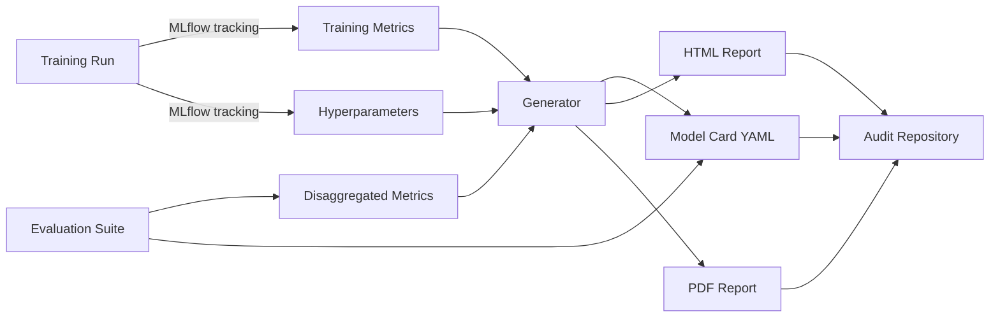

# 🎯 02 - Model Cards and Datasheets for Datasets

> **The documentation regulators require. Mitchell's Model Cards framework (2019) + Gebru's Datasheets framework (2018). The artifacts that satisfy EU AI Act Article 11 + 10 + 13.**

## 🎯 Learning Objectives
- Generate a Mitchell-compliant model card with all 9 sections
- Generate a Gebru-compliant datasheet for training/evaluation data
- Automate model card generation from training metadata
- Use HuggingFace model cards and dataset cards as templates
- Map Mitchell and Gebru sections to EU AI Act Article 11 + 10 + 13
- Distinguish model cards (for trained models) from datasheets (for datasets)
- Avoid the 5 common antipatterns in compliance documentation

## Introduction

Every AI engineer has been asked "what does your model do?" The right answer is a **model card** — a structured document that explains the model's purpose, training data, performance, limitations, and intended use. Similarly, every engineer has been asked "what's in your training data?" The right answer is a **datasheet** — a structured document that describes the dataset's composition, collection process, intended use, and limitations.

These are not optional. The **EU AI Act Article 11** requires technical documentation for high-risk AI systems. **Article 10** requires data quality documentation. **Article 13** requires user-facing instructions. Model cards and datasheets are the canonical way to satisfy these requirements.

The frameworks are not new:
- **Mitchell et al. (2019)** — "Model Cards for Model Reporting" (FAT* conference)
- **Gebru et al. (2018)** — "Datasheets for Datasets" (Communications of the ACM)

Both frameworks are now industry standards. HuggingFace ships them as built-in features. AWS, Azure, and Google Cloud integrate them into their model registries.


---

## 1. Model Card (Mitchell Framework, 2019)

The canonical model card has 9 sections:

### 1.1 The 9 sections

| # | Section | Purpose |
|---|---------|---------|
| 1 | **Model Details** | Basic info: type, version, date, owner |
| 2 | **Intended Use** | Primary use cases and out-of-scope uses |
| 3 | **Factors** | Subgroups, environments, instruments where performance may vary |
| 4 | **Metrics** | Performance metrics and decision thresholds |
| 5 | **Evaluation Data** | Datasets, motivation, preprocessing |
| 6 | **Training Data** | (If disclosed) datasets and preprocessing |
| 7 | **Quantitative Analyses** | Performance disaggregated by factors |
| 8 | **Ethical Considerations** | Risks, harms, mitigations |
| 9 | **Caveats and Recommendations** | Open issues, future work |

### 1.2 Template (YAML)

```yaml
# model_card.yaml — Mitchell-compliant model card
model_details:
  name: "CreditScoringLLM-v1.2"
  type: "Large Language Model (fine-tuned Llama 3.1 70B)"
  version: "1.2.3"
  date: "2026-07-23"
  owner: "Risk Assessment Team, ACME Bank"
  contact: "ai-governance@acmebank.com"
  license: "Internal use only — EU AI Act high-risk"
  citation: "@misc{creditscoring2026, title={CreditScoringLLM}, author={Risk Assessment Team}, year={2026}}"

intended_use:
  primary_uses:
    - "Assist loan officers in scoring loan applications"
    - "Generate explanations for credit decisions (human review required)"
  out_of_scope_uses:
    - "Fully automated loan decisions (human oversight required by Article 14)"
    - "Use on EU residents under 18 (prohibited)"
    - "Use for any non-financial decision (employment, housing)"
  prohibited_uses:
    - "Social scoring (prohibited by EU AI Act Article 5)"

factors:
  relevant_factors:
    - "Geographic region (EU vs non-EU)"
    - "Age group (18-25, 26-45, 46-65, 65+)"
    - "Gender (where applicable)"
    - "Income bracket"
    - "Credit history length"
    - "Employment status"

metrics:
  decision_thresholds:
    - "Confidence threshold: 0.85 (below this, defer to human)"
    - "Disagreement threshold: 0.15 (LLM vs rule-based score difference)"
  performance_metrics:
    - name: "AUC-ROC"
      value: 0.87
      dataset: "internal_validation_set_2026Q2"
    - name: "Precision at threshold"
      value: 0.82
    - name: "Recall at threshold"
      value: 0.79
    - name: "Calibration error"
      value: 0.03
    - name: "Inter-annotator agreement (vs human)"
      value: 0.84

evaluation_data:
  datasets:
    - name: "internal_validation_set_2026Q2"
      size: "10,000 loan applications"
      period: "2026-Q2"
      selection: "Random sample from production traffic"
      preprocessing: "PII removal, feature normalization"
  motivations: "Validate performance before EU deployment"

training_data:
  disclosed: false
  notes: "Training data details in internal data governance document (EU AI Act Article 10 compliance)"

quantitative_analyses:
  by_region:
    - region: "EU"
      auc_roc: 0.86
      sample_size: 6500
    - region: "US"
      auc_roc: 0.88
      sample_size: 3500
  by_age:
    - age_group: "18-25"
      auc_roc: 0.81
      sample_size: 800
    - age_group: "26-45"
      auc_roc: 0.87
      sample_size: 4500
    - age_group: "46-65"
      auc_roc: 0.89
      sample_size: 3500
    - age_group: "65+"
      auc_roc: 0.83
      sample_size: 1200
  by_gender:
    - gender: "F"
      auc_roc: 0.85
      sample_size: 4500
    - gender: "M"
      auc_roc: 0.88
      sample_size: 5500

ethical_considerations:
  risks:
    - "Disparate performance across age groups may violate EU AI Act Article 10 (data quality)"
    - "Use in fully-automated mode would violate Article 14 (human oversight)"
  mitigations:
    - "Human-in-the-loop required for all production decisions"
    - "Quarterly bias audits with disaggregated metrics"
    - "Quarterly model card updates with refreshed evaluation data"
    - "Drift detection on demographic performance parity"

caveats_and_recommendations:
  open_issues:
    - "Performance on 18-25 age group is 6 points below overall AUC — investigate"
    - "Calibration for very high-income applicants is unstable due to small sample"
  recommendations:
    - "Use only with human review (Article 14)"
    - "Do not deploy in jurisdictions where EU AI Act high-risk compliance is incomplete"
    - "Retrain quarterly with refreshed data to address age group gap"
```

### 1.3 Mapping to EU AI Act

| Mitchell Section | EU AI Act Article |
|------------------|-------------------|
| Model Details | Article 11 (technical documentation) |
| Intended Use | Article 13 (transparency to users) |
| Factors + Quantitative Analyses | Article 10 (data quality, bias detection) |
| Metrics | Article 15 (accuracy, robustness) |
| Training Data | Article 10 (data quality) |
| Ethical Considerations | Article 9 (risk management) |
| Caveats | Article 72 (post-market monitoring) |

A Mitchell-compliant model card satisfies most EU AI Act documentation requirements.

---

## 2. Datasheets for Datasets (Gebru Framework, 2018)

The canonical datasheet has 7 sections:

| # | Section | Purpose |
|---|---------|---------|
| 1 | **Motivation** | Why was the dataset created? |
| 2 | **Composition** | What's in the dataset? Instances, features, labels, missing values |
| 3 | **Collection Process** | How was the data collected? Schedule, sampling, preprocessing |
| 4 | **Preprocessing** | What filtering, cleaning, transformation was applied? |
| 5 | **Uses** | What has the dataset been used for? What should it not be used for? |
| 6 | **Distribution** | How is the dataset distributed? License, restrictions |
| 7 | **Maintenance** | Who maintains it? Errata, updates, support |

### 2.1 Template (YAML)

```yaml
# datasheet.yaml — Gebru-compliant datasheet
motivation:
  purpose: "Loan application training data for CreditScoringLLM"
  creators: "Risk Assessment Team, ACME Bank"
  funding: "ACME Bank internal R&D budget"
  rationale: "Need proprietary training data reflecting ACME's loan portfolio"

composition:
  instances:
    total: "500,000 loan applications (2018-2024)"
    train: 400000
    validation: 50000
    test: 50000
  features:
    - name: "applicant_id"
      type: "string (anonymized)"
      description: "Unique identifier"
    - name: "age"
      type: "integer"
      range: "18-90"
      missing_values: 0.02
    - name: "annual_income"
      type: "float"
      range: "0-1000000 EUR"
      missing_values: 0.08
    - name: "credit_history_length"
      type: "integer"
      range: "0-30 years"
    - name: "employment_status"
      type: "categorical"
      values: ["employed", "self-employed", "unemployed", "retired"]
    - name: "loan_outcome"
      type: "categorical"
      values: ["approved", "denied", "defaulted"]
  sensitive_attributes:
    - name: "age"
      protected_attribute: "age discrimination (EU AI Act)"
    - name: "gender"
      protected_attribute: "gender discrimination (EU AI Act)"
    - name: "nationality"
      protected_attribute: "nationality discrimination (EU AI Act)"

collection_process:
  schedule: "Continuous collection 2018-2024"
  sampling: "All loan applications in the period"
  instance_collection: "Extracted from production loan origination system"
  who_was_involved: "Risk Assessment Team, Data Engineering Team"
  ethical_review: "Internal review board approved (ref: IRB-2026-007)"
  consent: "Applicants consented to data use in loan terms of service"

preprocessing:
  cleaning:
    - "Removed applications with >50% missing features"
    - "Removed applications with data entry errors (negative income, age > 120)"
  transformation:
    - "All monetary values normalized to EUR"
    - "Categorical features encoded as integers"
  pii_handling:
    - "Names and addresses removed"
    - "Tax IDs hashed (SHA-256)"
  filtering:
    - "Applications from sanctioned countries removed (compliance)"

uses:
  documented_uses:
    - "Training CreditScoringLLM (this dataset)"
    - "Bias audits (Article 10)"
  recommended_uses:
    - "Credit risk modeling in EU markets"
  prohibited_uses:
    - "Employment decisions"
    - "Housing decisions"
    - "Any non-financial use"
    - "Use in jurisdictions where EU AI Act compliance is incomplete"

distribution:
  license: "Internal use only — ACME Bank proprietary data"
  access: "Internal S3 bucket (s3://acme-internal/credit-data/)"
  restrictions: "Cannot be shared externally without legal approval"

maintenance:
  maintainer: "Data Engineering Team"
  update_frequency: "Quarterly"
  errata_log: "internal/confidential — see data-team wiki"
  contact: "data-eng@acmebank.com"
```

### 2.2 Mapping to EU AI Act

| Gebru Section | EU AI Act Article |
|---------------|-------------------|
| Motivation | Article 11 (technical documentation) |
| Composition | Article 10 (data quality) |
| Collection Process | Article 10 (data provenance) |
| Preprocessing | Article 10 (data quality) |
| Uses | Article 13 (transparency) |
| Distribution | Article 11 (technical documentation) |
| Maintenance | Article 72 (post-market monitoring) |

---

## 3. Automation — Generating Cards from Metadata

Manually writing model cards and datasheets doesn't scale. Automate the generation:

```python
import json
import yaml
from pathlib import Path
from datetime import datetime
from typing import Any


class ModelCardGenerator:
    """Generate a Mitchell-compliant model card from training metadata."""
    
    def __init__(self, model_name: str, model_version: str, owner: str):
        self.model_name = model_name
        self.model_version = model_version
        self.owner = owner
        self.sections = {}
    
    def add_model_details(self, model_type: str, license: str):
        self.sections["model_details"] = {
            "name": self.model_name,
            "type": model_type,
            "version": self.model_version,
            "date": datetime.utcnow().strftime("%Y-%m-%d"),
            "owner": self.owner,
            "license": license,
        }
        return self
    
    def add_intended_use(
        self,
        primary_uses: list[str],
        out_of_scope_uses: list[str],
        prohibited_uses: list[str] = None,
    ):
        self.sections["intended_use"] = {
            "primary_uses": primary_uses,
            "out_of_scope_uses": out_of_scope_uses,
            "prohibited_uses": prohibited_uses or [],
        }
        return self
    
    def add_metrics(self, metrics: list[dict]):
        """Add performance metrics."""
        self.sections["metrics"] = {
            "performance_metrics": metrics,
        }
        return self
    
    def add_quantitative_analyses(self, by_factor: dict[str, list[dict]]):
        """Add disaggregated analyses."""
        self.sections["quantitative_analyses"] = by_factor
        return self
    
    def add_ethical_considerations(self, risks: list[str], mitigations: list[str]):
        self.sections["ethical_considerations"] = {
            "risks": risks,
            "mitigations": mitigations,
        }
        return self
    
    def render_yaml(self) -> str:
        """Render as YAML."""
        return yaml.safe_dump({"model_card": self.sections}, sort_keys=False)
    
    def save(self, output_dir: str = "./compliance/"):
        output_path = Path(output_dir) / f"{self.model_name.replace(' ', '_')}_model_card.yaml"
        output_path.parent.mkdir(parents=True, exist_ok=True)
        output_path.write_text(self.render_yaml())
        return str(output_path)


# Usage in a training pipeline
generator = (
    ModelCardGenerator(
        model_name="CreditScoringLLM",
        model_version="1.2.3",
        owner="Risk Assessment Team, ACME Bank",
    )
    .add_model_details(
        model_type="Large Language Model (fine-tuned Llama 3.1 70B)",
        license="Internal use only — EU AI Act high-risk",
    )
    .add_intended_use(
        primary_uses=["Assist loan officers in scoring loan applications"],
        out_of_scope_uses=["Fully automated loan decisions"],
        prohibited_uses=["Social scoring (EU AI Act Article 5)"],
    )
    .add_metrics([
        {"name": "AUC-ROC", "value": 0.87, "dataset": "validation_2026Q2"},
        {"name": "Calibration error", "value": 0.03},
    ])
    .add_quantitative_analyses({
        "by_age": [
            {"age_group": "18-25", "auc_roc": 0.81, "sample_size": 800},
            {"age_group": "26-45", "auc_roc": 0.87, "sample_size": 4500},
        ],
        "by_region": [
            {"region": "EU", "auc_roc": 0.86},
            {"region": "US", "auc_roc": 0.88},
        ],
    })
    .add_ethical_considerations(
        risks=["Disparate performance across age groups"],
        mitigations=["Quarterly bias audits", "Human-in-the-loop required"],
    )
)

card_path = generator.save()
print(f"Model card saved to {card_path}")
```

This generator runs as part of the training pipeline. Every model deployment includes an up-to-date model card.

---

## 4. HuggingFace Model Cards and Dataset Cards

HuggingFace ships MIT-licensed model and dataset cards. The template (YAML frontmatter + Markdown body):

```yaml
---
license: apache-2.0
datasets:
  - internal_credit_data_2026Q2
language:
  - en
metrics:
  - accuracy
  - auc
tags:
  - credit-scoring
  - high-risk
  - eu-ai-act
---

# Model Card: CreditScoringLLM-v1.2

## Model Details
- **Name**: CreditScoringLLM-v1.2
- **Type**: Fine-tuned Llama 3.1 70B
- **Owner**: ACME Bank Risk Assessment Team
- **License**: Internal use only — EU AI Act high-risk

## Intended Use
[content]

## Factors
[content]

## Metrics
[content]

## Evaluation Data
[content]

## Ethical Considerations
[content]

## Caveats
[content]
```

HuggingFace validates this format and renders it on the model page. The format is also compatible with the Mitchell framework.

---

## 5. The Practical Workflow



Every training run produces an artifact. The artifact is versioned, stored, and retrievable for compliance audits.

---

## 6. Antipatterns

### 6.1 Antipattern 1: Empty model cards

```yaml
# ❌ "We trained a model" — useless for compliance
model_details:
  name: "OurModel"

# ✅ Detailed, specific, traceable
model_details:
  name: "CreditScoringLLM-v1.2.3"
  type: "Fine-tuned Llama 3.1 70B (LoRA r=16 alpha=32)"
  version: "1.2.3"
  date: "2026-07-23"
  owner: "Risk Assessment Team, ACME Bank"
  git_commit: "abc123def456"
  training_dataset_version: "credit_data_2026Q2_v1.4"
```

### 6.2 Antipattern 2: Single-aggregate performance metrics

```yaml
# ❌ Single AUC-ROC — masks disparate performance
metrics:
  - name: "AUC-ROC"
    value: 0.87

# ✅ Disaggregated metrics
quantitative_analyses:
  by_age:
    - age_group: "18-25"
      auc_roc: 0.81  # 6 points below average!
    - age_group: "26-45"
      auc_roc: 0.87
```

### 6.3 Antipattern 3: No "out of scope" section

```yaml
# ❌ Lists only intended uses
intended_use:
  primary_uses: ["Score loan applications"]

# ✅ Explicit out-of-scope and prohibited uses
intended_use:
  primary_uses: ["Score loan applications"]
  out_of_scope_uses:
    - "Fully automated decisions"
    - "Use on minors"
  prohibited_uses:
    - "Social scoring (EU AI Act Article 5)"
    - "Employment decisions"
```

### 6.4 Antipattern 4: No caveats section

```yaml
# ❌ Claims the model is perfect
# (missing caveats section)

# ✅ Honest about limitations
caveats_and_recommendations:
  open_issues:
    - "Performance on 18-25 age group is 6 points below overall AUC"
    - "Calibration for high-income applicants is unstable (n=120)"
  recommendations:
    - "Use only with human review"
    - "Retrain quarterly to address age gap"
```

### 6.5 Antipattern 5: One-time generation, not continuous

```python
# ❌ Generate the card once at deploy; never update
card = generate_model_card(model)  # done forever

# ✅ Regenerate on each significant event (retrain, drift detected, regulation update)
@trigger.on("retrain_complete")
@trigger.on("drift_detected")
@trigger.on("regulation_updated")
def regenerate_card():
    generate_model_card(current_model)
    publish_to_audit_repo()
```

---

## 🎯 Key Takeaways

- Model cards (Mitchell, 9 sections) satisfy EU AI Act Articles 11, 10, 13.
- Datasheets (Gebru, 7 sections) satisfy EU AI Act Articles 10, 11.
- Both frameworks are industry standards; HuggingFace ships them built-in.
- Disaggregated metrics (by age, gender, region) are required to detect bias.
- Automation is essential — manual cards don't scale.
- One-time generation is insufficient; regenerate on retrain, drift, regulation change.
- Map every Mitchell and Gebru section to the EU AI Act article it satisfies.
- Avoid empty cards, single-aggregate metrics, no out-of-scope, no caveats, one-time generation.

## References

- Mitchell et al. (2019) — Model Cards for Model Reporting — [arxiv.org/abs/1810.03993](https://arxiv.org/abs/1810.03993)
- Gebru et al. (2018) — Datasheets for Datasets — [arxiv.org/abs/1803.09010](https://arxiv.org/abs/1803.09010)
- HuggingFace model card docs — [huggingface.co/docs/hub/model-cards](https://huggingface.co/docs/hub/model-cards)
- EU AI Act Article 11 — Technical documentation — [eur-lex.europa.eu](https://eur-lex.europa.eu/legal-content/EN/TXT/?uri=CELEX:32024R1689)
- [[06 - Large Language Models/25 - AI Compliance and Governance/01 - EU AI Act 2024 - Risk Classification and Compliance|Note 01 — EU AI Act]]
- [[06 - Large Language Models/25 - AI Compliance and Governance/03 - Bias and Fairness - AI Fairness 360 and Demographic Parity|Note 03 — Bias and Fairness]]
- [[06 - Large Language Models/25 - AI Compliance and Governance/05 - Capstone - Compliance Pipeline for a Regulated Industry|Note 05 — Capstone]]
- [[06 - Large Language Models/22 - Instructor and Structured Generation|Instructor]] — structured compliance outputs
- [[09 - MLOps y Produccion/36 - LangFuse - Open-Source LLM Observability|LangFuse]] — model usage audit trails