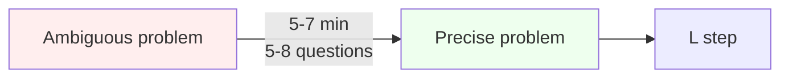
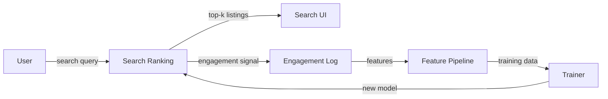
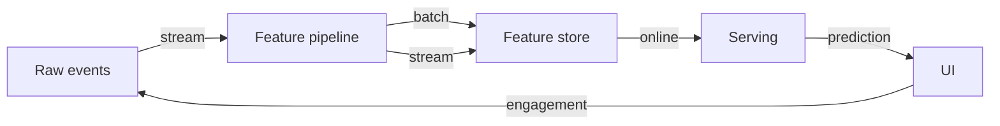
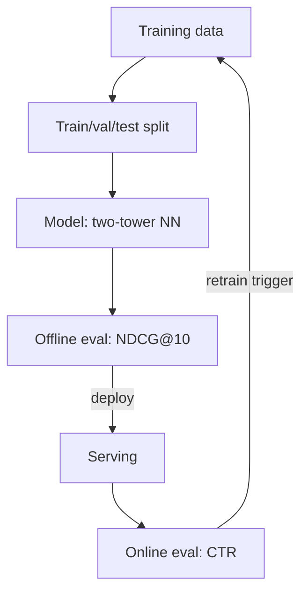
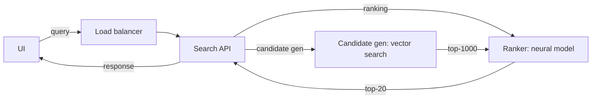

# 🧠 The CLEAR Framework — 5-Step Method for ML System Design

## 🎯 Learning Objectives

- Master the **CLEAR framework** (Clarify → Locate → Estimate → Architect → Refine) and apply it to any ML system design problem
- Recognize the **5-minute-per-step rhythm** that turns a 45-minute interview from chaotic to structured
- Build the **mental muscle memory** of asking clarifying questions before drawing boxes, even when you think the problem is clear
- Calibrate **back-of-envelope math** to the precision the interviewer expects (2-3 significant figures, not 10)
- Generate the **3 Mermaid diagrams every problem needs** (data flow, model architecture, serving topology)
- Learn to **anticipate the follow-up questions** the interviewer will ask in the Refine step

---

## Introduction

Every ML system design interview, regardless of company or problem, follows the same arc: the interviewer gives you an ambiguous problem, you have 45-60 minutes to design a system, and they evaluate you on five axes (clarifying, locating, estimating, architecting, refining). The CLEAR framework is the **decomposition of those five axes into a five-step method** that you can run in your sleep. Once the framework is muscle memory, the problem stops mattering — AirBnB search ranking, DoorDash dispatch, Twitter timeline all reduce to the same five steps, with different parameters.

The framework is not a checklist you read off. It is a **cognitive load manager**: each step has a clear output (questions, components, numbers, diagrams, tradeoffs) that the next step consumes. Without the framework, candidates jump between steps (clarify, then draw a box, then estimate, then clarify again) and the interviewer loses track. With the framework, the candidate moves forward in time, the whiteboard fills in a predictable order, and the interviewer can grade each step in isolation.

For your **portfolio projects**, the framework is also the structure of your design docs. The **LLM Edge Gateway** in Go/Fiber has the same five sections as a CLEAR interview: it clarifies the latency/cost requirements, locates the choke point (Go's HTTP middleware), estimates the QPS, architects the Redis cache + semantic dedup, and refines the LLM Gateway (rate limiting, observability, fallback). The same structure makes the design doc interview-ready and the interview design-doc-ready.

---

## 1. The 5 Steps

### 1.1 C — Clarify (5-7 minutes)

The first 5-7 minutes are **clarifying questions only**. You do not draw a single box. You ask the interviewer questions that turn the ambiguous problem into a precise one.

**The four categories of clarifying questions:**

| Category | What you ask | Example (Airbnb search) |
|----------|--------------|------------------------|
| **Scale** | How many users, queries/sec, items | "How many listings? How many searches per day?" |
| **Latency** | P50/P95/P99, real-time vs batch | "Is search real-time? What's the p95 latency budget?" |
| **Quality** | What metric defines success | "NDCG@10? MRR? Click-through rate? Booking rate?" |
| **Constraints** | Budget, team, infra, data | "Any privacy constraints on user data? Cold-start acceptable?" |

**The rule of thumb**: ask **5-8 questions** in 5-7 minutes. The interviewer expects you to ask. Candidates who do not ask clarifying questions fail the round regardless of how good the rest of the design is.



### 1.2 L — Locate (3-4 minutes)

After clarifying, **locate the system in the broader product**. Draw the high-level context: what is upstream (data sources, user actions), what is downstream (other systems that consume the prediction), and where your system sits.



The Locate step answers the question: "what is the boundary of my system?" The boundary tells you what you own and what you don't. You own the ranking model, the serving infra, the feature pipeline, and the retraining loop. You do not own the listings DB, the user auth, or the payment system.

### 1.3 E — Estimate (3-4 minutes)

Back-of-envelope math. The numbers do not have to be perfect, but they have to be **within 1-2 orders of magnitude**. The goal is to make the architecture decisions justified, not guessed.

**The five numbers you always compute:**

| Number | Formula | Example (Airbnb) |
|--------|---------|------------------|
| QPS | DAU × queries_per_user / 86400 | 50M users × 1 query × 1/100 active = 500K QPS peak |
| Storage | items × size_per_item | 7M listings × 1KB = 7GB |
| Bandwidth | QPS × response_size | 500K × 50KB = 25 GB/s |
| Latency budget | budget / num_stages | 200ms / 5 stages = 40ms per stage |
| Model size | params × bytes_per_param | 100M params × 2 bytes (fp16) = 200MB |

The Estimate step is where candidates fail most often. Either they skip it (the architecture floats without justification) or they go too deep (computing 11 significant figures). The right depth is 2-3 significant figures, plus a clear statement of the assumption.

### 1.4 A — Architect (20-25 minutes)

The architect step is the bulk of the interview. You draw three things: **data flow**, **model architecture**, and **serving topology**.

**Data flow**: from raw events to features to predictions to feedback.



**Model architecture**: training pipeline + the model itself.



**Serving topology**: how the prediction reaches the user.



The Architect step is where most candidates spend 25 minutes. The CLEAR framework gives you 25 minutes for this step. Use the time to draw, not to talk.

### 1.5 R — Refine (5-7 minutes)

The Refine step is the **interviewer's chance to push back**. They will ask: "what if X breaks?", "how does this scale 10x?", "what about cold start?", "how do you avoid feedback loops?". The Refine step is where senior candidates shine and junior candidates freeze.

**The four kinds of follow-up questions:**

| Type | Example (Airbnb) | Good answer |
|------|------------------|-------------|
| **Failure mode** | "What if Qdrant is down?" | "Cached embeddings; fallback to BM25-only ranking with quality degradation alert" |
| **Scale** | "What if listings grow 10x?" | "Sharded by region; rebalance via consistent hashing" |
| **Edge case** | "What if the query is in a language you don't support?" | "Multilingual encoder; fallback to translate-then-rank" |
| **Tradeoff** | "Why not a larger model?" | "Latency budget is 200ms; 100M params fits in 40ms on A10G" |

The Refine step is also where you can show **production experience**: "we learned the hard way at my last job that X breaks at scale, so we do Y." The interviewer's job is to find the gap in your design; your job is to fill it before they ask.

---

## 2. The CLEAR Template

Every CLEAR interview follows the same whiteboard layout:

```
[Whiteboard]

Top-left:    Clarifying questions + answers (5-7 min)
Top-right:   Back-of-envelope numbers (3-4 min)
Center:      Three diagrams (data flow, model, serving) (20-25 min)
Bottom:      Tradeoffs + open questions (5-7 min)
```

The interviewer's mental model: they grade each section in isolation. A 6/10 on architecture with a 9/10 on clarifying is a hire. A 9/10 on architecture with a 3/10 on clarifying is a no-hire. The framework ensures you do not sacrifice one section for another.

---

## 3. The Meta-Skill: Anticipating the Follow-up

The senior-candidate signal is **anticipating the follow-up before the interviewer asks**. There are four patterns to memorize:

1. **The single point of failure**: every system has one. Name it. ("The Qdrant cluster is the SPOF; we mitigate with read replicas.")
2. **The data feedback loop**: every ML system has one. Draw it. ("Predictions → engagement → features → next training run.")
3. **The cold start**: every personalization system has one. Name the strategy. ("New listings get a content-based embedding from text + image; ranking is biased toward recency until we have 10 impressions.")
4. **The online/offline skew**: every model in production has one. Name the mitigation. ("We log the exact features at serving time, not the latest values, so training matches serving.")

If you draw the data feedback loop in the Architect step, the Refine step is 5 minutes of confirming, not 5 minutes of scrambling.

---

## 4. Common Pitfalls

| Pitfall | Symptom | Fix |
|---------|---------|-----|
| Skipping Clarify | Jumping to architecture; missing the actual question | Force yourself to ask 5 questions before drawing anything |
| Numbers without units | "We need 1000 storage" | Always write units (1TB, 500K QPS, 200ms p95) |
| One giant diagram | 30 boxes connected by 50 arrows | Three diagrams, 5-7 boxes each |
| No feedback loop | "We train the model" — full stop | Always close the loop: predictions → engagement → next training |
| No cold-start discussion | "All users have history" | Name the strategy for new users / new items / new markets |
| No online/offline discussion | "We train on the same features" | Always mention feature logging at serving time |
| SpELling out components | "We use... uh... I think... maybe Redis?" | Name the tech confidently; the interviewer cares more about the choice than the brand |
| Going deep too early | 20 minutes on the ranker, 0 minutes on serving | Allocate time by section; use a watch |

---

## 5. Self-Grading Rubric

After every mock interview, self-grade on the five CLEAR steps:

| Step | 0 points | 5 points | 10 points |
|------|----------|----------|-----------|
| **Clarify** | No questions asked | 3-4 questions, mostly obvious | 5-8 questions, surface real ambiguity |
| **Locate** | No context drawn | Vague context, missing boundaries | Clear context, named dependencies |
| **Estimate** | No numbers | Numbers, no units, no assumptions | Numbers with units, assumptions, sensitivity |
| **Architect** | One diagram, all boxes | Two diagrams, some tradeoffs | Three diagrams, feedback loop, cold start |
| **Refine** | No follow-ups handled | Defensive answers, no depth | Anticipated follow-ups, named mitigations |

A score of 35+ out of 50 is a strong hire signal. A score of 25-35 is on the bubble. A score below 25 is a no-hire. Practice until you can score yourself 40+ on every canonical problem.

---

## 📦 Compression Code

```python
# NOTE: 01 - The CLEAR Framework
# CLEAR = Clarify -> Locate -> Estimate -> Architect -> Refine
# Time budget: 5+3+4+25+7 = 44 minutes (45-60 min interview)
# Outputs per step:
#   C: 5-8 clarifying questions (scale, latency, quality, constraints)
#   L: high-level context diagram (upstream/downstream)
#   E: 5 numbers (QPS, storage, bandwidth, latency, model size) with units
#   A: 3 diagrams (data flow, model, serving) + feedback loop
#   R: 4 follow-up patterns (SPOF, feedback loop, cold start, online/offline skew)
# Self-grade: 35+/50 = hire, 25-35 = bubble, <25 = no-hire
# Cross-cuts: 06/32 System Design (SWE patterns), 09/21 Monitoreo, 10/33 Vector DBs

# Whiteboard layout (45-60 min interview)
WHITEBOARD = {
    "top_left": "Clarifying questions + answers (5-7 min)",
    "top_right": "Back-of-envelope numbers (3-4 min)",
    "center": "Three diagrams (data flow, model, serving) (20-25 min)",
    "bottom": "Tradeoffs + open questions (5-7 min)",
}
```

## 🎯 Key Takeaways

- **CLEAR is 5 steps, 5 minutes each** (except Architect at 25 min) — the rhythm turns a chaotic interview into a structured one
- **Clarify before you draw** — 5-8 questions turn an ambiguous problem into a precise one
- **Three diagrams, every problem** — data flow, model architecture, serving topology
- **Close the feedback loop** in the Architect step — predictions → engagement → next training is the senior signal
- **Self-grade 35+/50** is the hire threshold; practice until you hit it on every canonical problem

## References

- Alex Xu, *System Design Interview* Vol 1 & 2
- Alex Xu, *Machine Learning System Design Interview* (the canonical CLEAR source)
- Tecton ML interviews: https://www.tecton.ai/blog/
- interviewing.io ML system design: https://interviewing.io/topics#machine-learning-system-design
- Stanford CS329H: https://stanford-cs329h.github.io/
