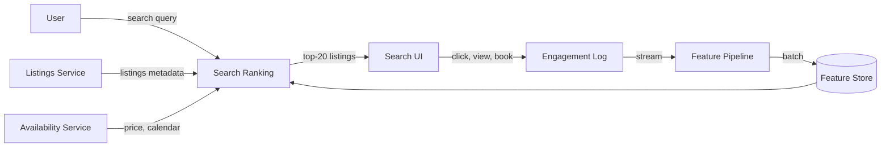
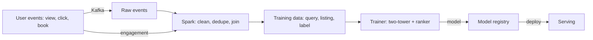
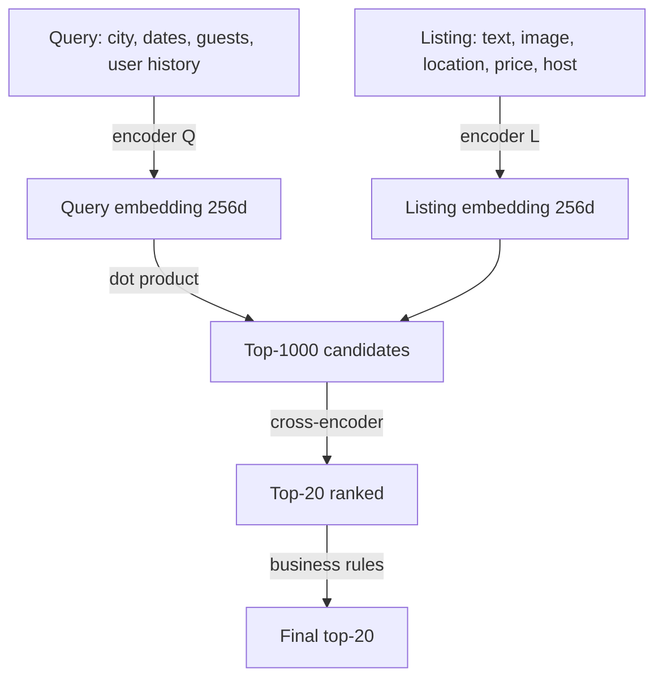
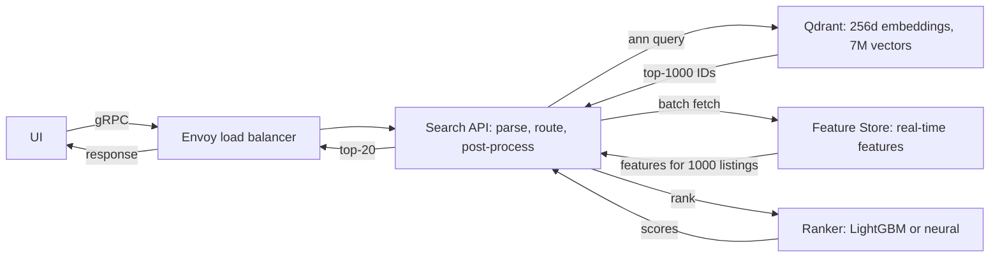

# 🏠 Problem 1 — Airbnb Search Ranking

## 🎯 Learning Objectives

- Design a **two-stage search ranking system** (candidate generation + learning-to-rank) for a marketplace with millions of listings
- Apply the **CLEAR framework** to a search problem and produce a whiteboard-ready design in 45 minutes
- Master the **two-tower neural architecture** for query-listing matching, with cross-encoder re-ranking
- Discuss **cold start** for new listings and new users, **exploration vs exploitation**, and **online/offline skew**
- Calibrate the **latency budget** (50-200ms p95) against the **model complexity** (two-tower vs cross-encoder)

---

## 1. Problem Statement

> Design Airbnb's search ranking system. A user enters a query (city, dates, guests) and sees a list of listings ranked by relevance. The system serves 50M users, 7M active listings, and processes 1B searches per month.

The interviewer's open-ended prompt. The phrase "design" is deliberately vague — your job is to clarify, locate, estimate, architect, refine.

---

## 2. Clarifying Questions (5-7 minutes)

| Category | Question | Why it matters |
|----------|----------|----------------|
| **Scale** | How many DAU? How many searches per day? | QPS calculation |
| **Scale** | How many active listings? | Embedding storage |
| **Latency** | P95 latency budget? | Determines model complexity |
| **Quality** | What metric? NDCG@10? Bookings? Revenue? | Different metrics → different models |
| **Constraints** | Personalization level? Cold-start acceptable? | New listings need content features |
| **Constraints** | Multi-market? Multi-language? | Affects encoder choice |
| **Constraints** | Real-time price/availability? | Affects whether ranking is on stale data |

**Good answers to expect:** "10M DAU, 100K QPS peak, 200ms p95 budget, NDCG@10 + booking rate, English-only, real-time price/availability from a separate service."

---

## 3. Locate (3-4 minutes)



The boundary: **Search Ranking owns the model, the serving infra, the feature pipeline, and the retraining loop**. It does not own listings storage, user auth, payments, or the search UI.

---

## 4. Back-of-Envelope (3-4 minutes)

| Number | Value | Notes |
|--------|-------|-------|
| **QPS** | 100K peak, 30K average | 10M DAU × 1 search × 0.3 / 86400 = ~35K average |
| **Listings** | 7M active, 50M total | 7M active × 1KB = 7GB embeddings |
| **Bandwidth** | 100K QPS × 20KB response = 2 GB/s | Response is 20 listings × 1KB |
| **Latency budget** | 200ms p95 = 50ms × 4 stages | 4 stages: parse query, candidate gen, rank, post-process |
| **Model size** | Two-tower: 50M params × 4 bytes = 200MB | Cross-encoder: 100M params × 4 bytes = 400MB |

**Assumption:** 30% of DAU search per day, 1 search per session. p95 latency from production telemetry of the existing system.

---

## 5. Architecture (20-25 minutes)

### 5.1 Data flow



The data feedback loop is the key diagram. Predictions → engagement → next training run. The loop latency is the "model freshness": for Airbnb, retraining is daily, online learning is not used (too risky).

### 5.2 Two-stage model architecture



**Stage 1: Candidate generation (two-tower)**

- Query encoder: BERT-base fine-tuned on (query, booked_listing) pairs.
- Listing encoder: BERT-base + image CNN, fine-tuned on the same objective.
- Score: dot product of 256-d embeddings.
- Output: top-1000 listings by embedding similarity.
- Latency: ~10ms (single ANN query on Qdrant).

**Stage 2: Ranking (cross-encoder or GBDT)**

- Features: query × listing interactions (price difference, location distance, host response rate, listing popularity, user preferences).
- Model: GBDT (LightGBM) for production simplicity, or neural cross-encoder (100M params) for max quality.
- Output: ranking score, top-20.
- Latency: ~30ms (GBDT) or ~80ms (neural).

### 5.3 Serving topology



The serving topology shows the **3 hot-path stages**: candidate generation (Qdrant), feature fetch (Redis/Feast), ranking (model server). The latency budget is 50ms per stage. The single point of failure is Qdrant — mitigated by read replicas and a BM25 fallback (Elasticsearch).

---

## 6. ML Component Deep Dive

### 6.1 Two-tower training

The two-tower model is trained with **contrastive loss**: given a (query, positive_listing, negative_listings) triple, maximize the similarity between query and positive, minimize the similarity to negatives. Negatives are sampled in-batch (other queries' positives in the same batch). The encoder weights are shared across queries and listings (BERT base), with task-specific heads.

```python
# Pseudocode for two-tower training
import torch
import torch.nn as nn

class TwoTower(nn.Module):
    def __init__(self, query_encoder, listing_encoder, embed_dim=256):
        super().__init__()
        self.q_enc = query_encoder  # BERT base
        self.l_enc = listing_encoder  # BERT + image CNN
        self.q_proj = nn.Linear(768, embed_dim)
        self.l_proj = nn.Linear(768, embed_dim)

    def forward(self, query_tokens, listing_features):
        q_emb = self.q_proj(self.q_enc(query_tokens).pooler_output)
        l_emb = self.l_proj(self.l_enc(listing_features).pooler_output)
        return q_emb, l_emb

# In-batch contrastive loss
def contrastive_loss(q_emb, l_emb, temperature=0.07):
    # q_emb: (B, D), l_emb: (B, D) — B is batch size
    logits = q_emb @ l_emb.T / temperature  # (B, B)
    labels = torch.arange(B)
    return F.cross_entropy(logits, labels)
```

The key insight: the listing encoder can be **precomputed and cached**. Once a listing is indexed, its 256-d embedding never changes (until the model is retrained). This is what makes ANN search tractable: the candidate generation is a single dot product over 7M cached vectors, not 7M forward passes.

### 6.2 Cross-encoder re-ranking

The cross-encoder sees (query, listing) together and predicts a relevance score. It captures interactions that the two-tower misses (e.g., "the user wants a kitchen" interacts with "this listing has a kitchen" → boost). The cost is 1000 forward passes per query (one per candidate) — too slow for the full corpus, fast enough for the top-1000.

For a 100M-param cross-encoder at batch size 32, latency is ~80ms for 1000 listings (32 batches × 2.5ms). Acceptable in the 200ms budget.

### 6.3 Cold start

New listings have **no engagement signal** (no views, no bookings). The two-tower embedding for a new listing is derived from text + image features (the encoder is content-based). The ranker score is dominated by the **content features** and **price competitiveness** until the listing has 10-20 impressions. After that, the engagement-based features take over.

The mitigation: **boost new listings by 10% in ranking for the first 7 days**, then taper. This is "exploration with a budget" — the cost is 10% of relevance for a 7-day window, the benefit is faster cold-start for new hosts.

---

## 7. System Component Deep Dive

### 7.1 Qdrant for ANN search

Qdrant is the right choice for this scale. 7M vectors × 256 dims × 4 bytes = 7GB raw, ~14GB with HNSW index. Single-node Qdrant can serve 100K QPS at <10ms p95 with the HNSW index. Sharding is needed if the corpus grows 10x.

The key parameter is `ef_construction` (build-time) and `ef` (query-time). For Airbnb's scale, `ef_construction=200, ef=100` gives 95% recall@1000 in 5ms.

### 7.2 Feast for online features

Feast serves **real-time features** (price, availability, host response rate) and **batch features** (listing popularity, user preferences). The serving pattern: the API queries Feast for features of the top-1000 candidates, Feast returns them in 5ms (Redis cache). Cold features (no engagement yet) return default values (zero) and the ranker learns to ignore them.

### 7.3 Kafka + Spark for the feedback loop

User events (view, click, book) flow through Kafka into Spark, where they are joined with the query and listing to form training examples. The Spark job runs hourly, producing 100M training examples per day. The trainer consumes from a S3 partition, trains for 4 hours on 8 GPUs, and pushes the new model to the registry.

The end-to-end loop latency is **~24 hours**: events → Spark → training → deploy. This is the model freshness. For faster iteration, the loop can be tightened to 1 hour (more compute, more risk).

---

## 8. Tradeoffs

| Decision | Choice A | Choice B | Pick |
|----------|----------|----------|------|
| **Candidate gen** | Two-tower NN | BM25 + filters | A (better recall, more compute) |
| **Re-ranker** | GBDT (LightGBM) | Cross-encoder NN | A for production (simpler, faster), B for quality ceiling |
| **Vector DB** | Qdrant | Pinecone | A (self-host, lower cost), B (managed) |
| **Retraining** | Daily | Hourly | A (safer, cheaper), B for faster iteration |
| **Cold start** | 10% boost for 7 days | No boost | A (better UX for new hosts) |
| **Multi-market** | Single model | Per-market model | A (data efficiency), B for >100 markets |
| **Online learning** | None | Continuous | A (safer), B for high-volume signals |

---

## 9. Production Reality

### Case: Airbnb's move from GBDT to deep ranking

In 2020, Airbnb published a paper describing their migration from a GBDT-only ranker to a neural network (the "DeepRank" system). The win was ~5% NDCG@10 improvement, which translated to ~1% booking lift — a huge number at Airbnb's scale. The cost was a 3x serving compute increase and 6 months of engineering. The lesson: the neural model wins on quality, but only if the serving infra can afford it.

The follow-up: a two-tower candidate generation layer was added in 2021, replacing the previous filter-based candidate gen. The win was 10% recall@100 improvement at the candidate stage, which compounded with the ranker improvement. The lesson: **invest in candidate generation, not just ranking** — a 10% better candidate set is worth more than a 10% better ranker.

### Failure mode: data feedback loop amplification

A subtle failure mode of ML search ranking is **feedback loop amplification**: if the model ranks Listing A above Listing B, more users see A, more click A, and the next training run learns that A is more relevant. Over time, the model becomes a self-fulfilling prophecy. The mitigation is **position debiasing** (down-weight clicks on top positions) and **exploration** (epsilon-greedy or Thompson sampling on a small fraction of traffic). Airbnb uses both.

---

## 📦 Compression Code

```python
# NOTE: 02 - Problem 1 - Airbnb Search Ranking
# CLEAR: 5 clarifying questions, 1 location diagram, 5 back-of-envelope numbers
# Architecture: 2 stages (candidate gen + re-rank), 2 Mermaid diagrams
# Models: two-tower (50M params, 256d) + cross-encoder (100M params) or LightGBM
# Latency budget: 200ms p95 = 4 stages × 50ms
# QPS: 100K peak, 30K average
# Storage: 7M listings × 1KB = 7GB embeddings
# Cold start: 10% boost for new listings, content-based encoder
# Feedback loop: events -> Kafka -> Spark -> trainer -> 24h freshness
# Production case: Airbnb DeepRank migration (2020), 5% NDCG@10 win
# Failure mode: feedback loop amplification, mitigated by position debiasing + exploration

# Whiteboard diagram (compressed)
TWO_STAGE = {
    "stage_1": "Two-tower ANN (Qdrant, 256d, top-1000, 10ms)",
    "stage_2": "Cross-encoder or GBDT ranker (LightGBM, top-20, 30-80ms)",
    "feedback_loop": "events -> Kafka -> Spark -> trainer -> 24h",
    "cold_start": "10% boost for 7 days, content-based encoder",
}
```

## 🎯 Key Takeaways

- **Two-stage architecture** is the standard for marketplace search: candidate generation (two-tower ANN) + re-ranking (GBDT or cross-encoder)
- **The two-tower embedding is precomputed and cached** — that's what makes ANN tractable at 100K QPS
- **Cold start for new listings** is solved by content-based features (text + image) and a 10% ranking boost for 7 days
- **The feedback loop is 24 hours** — events → Kafka → Spark → trainer → deploy
- **The single point of failure is Qdrant** — mitigate with read replicas and a BM25 fallback (Elasticsearch)

## References

- Airbnb Engineering Blog, *Listing Embeddings in Search Ranking* (2018)
- Airbnb Engineering Blog, *DeepRank* (2020)
- Alex Xu, *Machine Learning System Design Interview* — Chapter on search ranking
- Two-tower models: *Sampling-Bias Corrected Neural Modeling for Large Corpus Item Recommendations* (Microsoft)
- Qdrant documentation: https://qdrant.tech/documentation/
- Feast documentation: https://docs.feast.dev/
