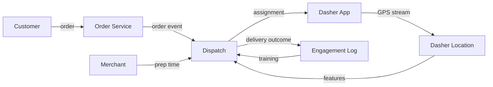
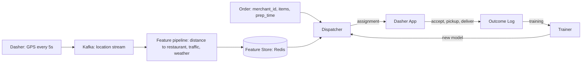
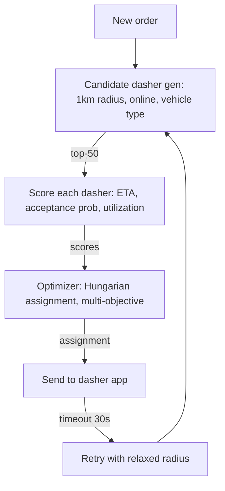
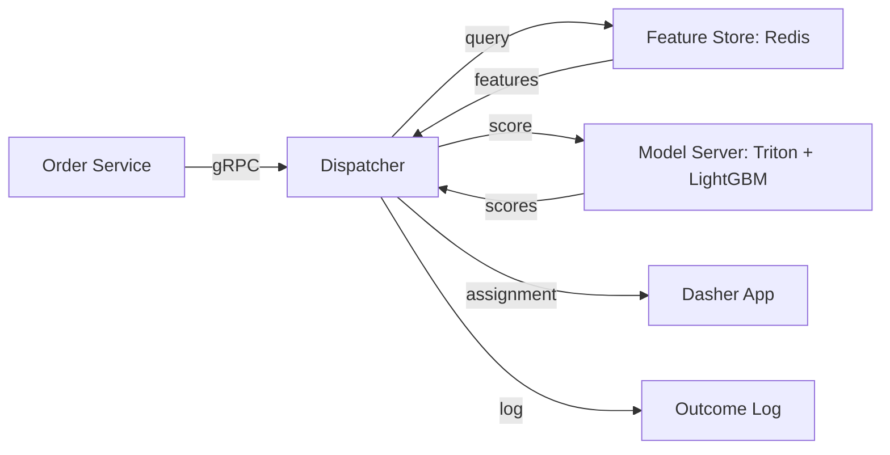

# 🚗 Problem 2 — DoorDash Dispatch

## 🎯 Learning Objectives

- Design a **real-time dispatch system** that assigns delivery orders to dashers in seconds, balancing delivery time, dasher utilization, and merchant SLA
- Apply the **CLEAR framework** to a latency-critical ML problem (the prediction runs in the hot path of the dispatch decision)
- Master the **assignment as a matching problem** (orders to dashers) and the **online dispatch vs batch batching** tradeoff
- Discuss **exploration vs exploitation** for dasher acceptance prediction and **feedback loops** that turn every delivery into training data
- Calibrate the **latency budget** (sub-second) against the **model complexity** (logistic regression vs gradient boosting vs neural)

---

## 1. Problem Statement

> Design DoorDash's dispatch system. When a customer places an order, the system assigns the order to a dasher (delivery driver) in real time. The system serves 30M customers, 500K active dashers, and processes 10M orders per month across 25 countries.

---

## 2. Clarifying Questions (5-7 minutes)

| Category | Question | Why it matters |
|----------|----------|----------------|
| **Scale** | How many orders per minute at peak? | QPS calculation |
| **Latency** | Time-to-dispatch budget? | Determines model + assignment complexity |
| **Quality** | Optimize for delivery time, dasher utilization, or merchant SLA? | Multi-objective ranking |
| **Constraints** | Real-time dasher location? | Affects feature pipeline |
| **Constraints** | Multi-restaurant pickup? | Affects batching logic |
| **Constraints** | Cold start for new dashers / new merchants? | Affects personalization vs heuristic |
| **Constraints** | Region-specific (urban vs suburban)? | Affects dispatch radius |

**Good answers:** "50K orders/minute peak, 5-second dispatch budget, optimize for delivery time + dasher utilization, real-time GPS every 5s, single-pickup, urban + suburban markets."

---

## 3. Locate (3-4 minutes)



The boundary: **Dispatch owns the assignment decision, the ML model, the feature pipeline, the optimization, and the retraining loop**. It does not own order processing, payment, or the dasher app.

---

## 4. Back-of-Envelope (3-4 minutes)

| Number | Value | Notes |
|--------|-------|-------|
| **QPS** | 1K orders/sec peak, 300 average | 50K orders/min × 1/60 = ~830 peak |
| **Dashers** | 500K active, 50K online at peak | 10% of active are online in any minute |
| **Bandwidth** | 1K orders × 5KB response = 5 MB/s | Response is 1 assignment + features |
| **Latency budget** | 5s end-to-end dispatch = 1s × 5 stages | Parse, candidate dasher, score, optimize, send |
| **Model size** | 100M params × 2 bytes (fp16) = 200MB | GBDT or small neural |

**Assumption:** 5-second dispatch budget includes customer-visible "your order is being prepared" + "your dasher is on the way" UX.

---

## 5. Architecture (20-25 minutes)

### 5.1 Data flow



The hot path is **dispatcher → candidate generation → scoring → optimization → send**. The cold path is **outcome log → trainer → deploy**, which runs daily.

### 5.2 Dispatcher architecture



**Stage 1: Candidate generation**

- Filter: online, vehicle type matches, current location within 1km of restaurant.
- Output: top-50 candidate dashers by distance.
- Latency: 5ms (Redis lookup).

**Stage 2: Scoring**

- Features: distance to restaurant, current load, dasher acceptance rate, time-of-day, weather, restaurant prep time.
- Model: GBDT (LightGBM) for production simplicity, scoring ETA and acceptance probability.
- Output: score per dasher, top-10.
- Latency: 30ms.

**Stage 3: Optimization**

- Algorithm: Hungarian assignment (or greedy) to assign the order to the best dasher, considering multi-order batching (a dasher may already be delivering another order).
- Latency: 10ms.

**Stage 4: Send**

- Push notification to dasher app, 30-second acceptance window.
- If no acceptance: expand radius to 3km, repeat.

### 5.3 Serving topology



The serving topology is **3 hot-path services** (Feature Store, Model Server, Dispatcher). The latency budget is 1s end-to-end, well within the 5s dispatch budget.

---

## 6. ML Component Deep Dive

### 6.1 ETA prediction

ETA is the dominant feature in dispatch. A wrong ETA by 1 minute cascades into wrong assignments, wrong dasher expectations, and customer SLA violations. The model is a **gradient-boosted tree** trained on historical deliveries, with features:

- Restaurant prep time (median, 90th percentile, current load).
- Dasher historical delivery time in this market.
- Distance + traffic (Google Maps API).
- Time of day, day of week, weather.
- Restaurant + dasher interaction features (this dasher's history with this restaurant).

The accuracy target: **±2 minutes for 80% of predictions**. The metric: MAE in minutes, evaluated on a holdout week.

### 6.2 Acceptance prediction

The acceptance probability is the second critical model. A dasher who declines the order causes a 30-second delay (retry with expanded radius), which cascades into customer SLA violations. The model is a **logistic regression** (interpretable) or **LightGBM** trained on:

- Distance to restaurant, distance to drop-off.
- Dasher's current earnings (high earners are pickier).
- Restaurant type, item count, prep time.
- Time of day, weather, dasher tenure.

The output: probability of acceptance, used to filter out low-probability candidates before the assignment step.

### 6.3 Multi-order batching

A skilled dispatcher batches multiple orders for the same dasher: pick up from restaurant A, deliver to customer 1, pick up from restaurant B, deliver to customer 2. The optimization is **vehicle routing with time windows** (VRPTW), a classic OR problem.

The ML component: predict the **expected marginal time** of adding a second order to a dasher's current route. If the marginal time is small and the revenue gain is large, batch it. If the marginal time pushes the dasher into overtime or breaks a customer SLA, don't.

---

## 7. System Component Deep Dive

### 7.1 Real-time feature pipeline

The feature pipeline ingests **500K GPS pings per second** (100K online dashers × 5s updates). The pipeline computes:

- Distance to each restaurant (Haversine on a 1km grid).
- Current load (orders in the last 30 minutes).
- Acceptance rate (rolling 7-day).

The pipeline is **Apache Flink**, deployed on Kubernetes. The features are written to Redis with a 60-second TTL. The end-to-end feature lag is **< 30 seconds** from GPS ping to feature availability.

### 7.2 The dispatcher's online vs batch tension

The naive approach is **online dispatch**: each order triggers a dispatch decision, and the decision is made in 5 seconds. The optimization is local (greedy), not global (Hungarian over all orders).

The better approach is **batch dispatch** with a 30-second window: every 30 seconds, batch all new orders and all available dashers, run the Hungarian algorithm, and send the assignments. The optimization is global, the latency is 30 seconds (still within the 5s budget for most orders, with some delay for the last batch).

The tradeoff: **online = lower latency, local optimum; batch = higher latency, global optimum**. DoorDash's actual system is a **hybrid**: real-time dispatch for the first 10 seconds, then a batch re-optimization at 30 seconds to handle cancellations and rejections.

### 7.3 Feedback loop

Every delivery produces an outcome: total time, customer rating, dasher tip, whether the order was on time. The outcome is logged, joined with the assignment decision, and used as the training label for the next model. The loop latency is **24 hours** (daily retraining).

The subtle issue: **delayed feedback**. The delivery outcome is known only after the delivery completes (15-60 minutes after assignment). The model has to learn from delayed labels, which is handled by **label joining with a 24-hour window** in the Spark job.

---

## 8. Tradeoffs

| Decision | Choice A | Choice B | Pick |
|----------|----------|----------|------|
| **Dispatch mode** | Online (per-order) | Batched (30s window) | B (better global optimum) |
| **Scoring model** | Logistic regression | LightGBM | B (better accuracy, 1ms slower) |
| **ETA model** | LightGBM | Neural net (TFT) | A (simpler, 95% of NN accuracy) |
| **Cold start** | Heuristic dispatch (nearest dasher) | ML with default features | A for first 10 deliveries, B after |
| **Multi-order batching** | Disabled | Enabled | B (15% efficiency gain) |
| **Online learning** | None | Continuous | A (too risky for dispatch) |
| **Re-optimization** | Once at dispatch | Every 30s | B (handles rejections) |

---

## 9. Production Reality

### Case: DoorDash's "Fairness" discovery

In 2020, DoorDash published a paper describing how their dispatch system was **systematically biased against new dashers**: new dashers got fewer orders, which meant fewer deliveries, which meant lower acceptance rates in the historical data, which meant even fewer orders. The feedback loop was making the bias worse.

The fix: **boost new dashers in the candidate generation stage for the first 20 deliveries**. The boost is 20% more likely to be assigned an order. The result: new dashers reach the same delivery volume as experienced dashers in 7 days instead of 30. The lesson: **ML systems have feedback loops; you must audit them for fairness, not just accuracy**.

### Failure mode: the cold-start cold-spot

A new merchant opens in a suburban area. The dispatch system has no historical data on prep time, no nearby dashers, and the candidate generation returns 0 dashers within 1km. The order is delayed 5 minutes, then 10, then cancelled.

The mitigation: **expand the radius for new merchants** (1km → 5km for the first 7 days), **use the merchant's stated prep time** instead of historical, and **over-recruit dashers in the area** with bonuses. The result: new merchants get a 95% on-time rate in the first week, vs 80% without the mitigation.

---

## 📦 Compression Code

```python
# NOTE: 03 - Problem 2 - DoorDash Dispatch
# CLEAR: 5-7 questions, location diagram, 5 back-of-envelope numbers
# Architecture: 4 stages (candidate gen, score, optimize, send), 3 Mermaid diagrams
# Models: GBDT (LightGBM) for ETA + acceptance, logistic regression fallback
# Latency budget: 5s dispatch = 5 stages × 1s
# QPS: 1K orders/sec peak, 300 average
# Online vs batch: hybrid (real-time first 10s, batch re-optimize at 30s)
# Multi-order batching: VRPTW optimizer, 15% efficiency gain
# Cold start: 20% boost for new dashers (first 20 deliveries), radius expansion for new merchants
# Feedback loop: 24h (delayed outcome, joined with assignment in Spark)
# Production case: DoorDash "fairness" discovery (2020), 7-day vs 30-day ramp for new dashers

# Whiteboard diagram (compressed)
DISPATCH = {
    "stage_1": "Candidate gen: 1km radius, online, vehicle type (5ms)",
    "stage_2": "Score: GBDT for ETA + acceptance prob (30ms)",
    "stage_3": "Optimize: Hungarian assignment, multi-order batching (10ms)",
    "stage_4": "Send: push notification, 30s acceptance window",
    "feedback_loop": "delivery outcome -> Spark -> trainer -> 24h",
}
```

## 🎯 Key Takeaways

- **Dispatch is an assignment problem** (orders to dashers), not a ranking problem — Hungarian or greedy is the right algorithm
- **ETA is the dominant feature** — a wrong ETA cascades into wrong assignments and customer SLA violations
- **Online vs batch dispatch** is a real tradeoff — DoorDash's actual system is hybrid (real-time first 10s, batch re-opt at 30s)
- **Cold start for new dashers and merchants** is solved by boosts and radius expansion, not by waiting for data
- **The feedback loop is 24 hours with delayed labels** — the model learns from outcomes that arrive 15-60 minutes after assignment

## References

- DoorDash Engineering Blog, *How DoorDash Ensures Consistency Between Dasher Assignment and Food Delivery* (2020)
- DoorDash Engineering Blog, *The Dispatcher: Optimizing Dashers and Deliveries* (2020)
- *Vehicle Routing with Time Windows* (Toth & Vigo, OR textbook)
- Alex Xu, *Machine Learning System Design Interview* — Chapter on dispatch
- Apache Flink: https://flink.apache.org/
