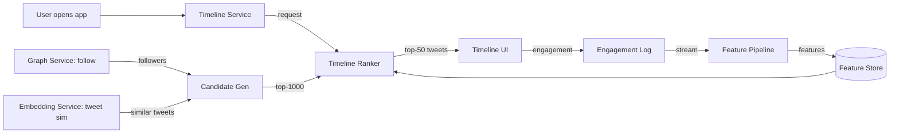
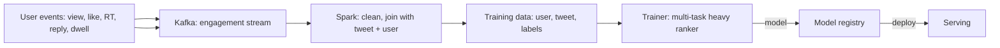
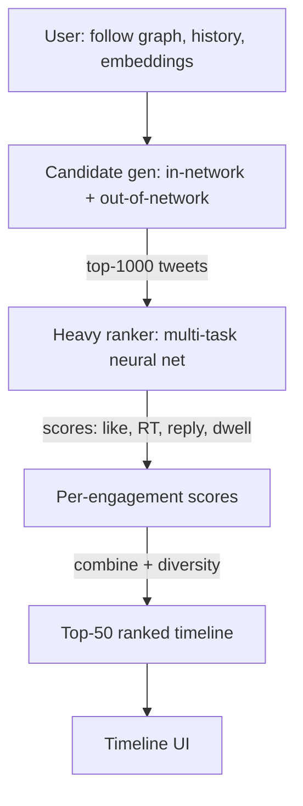
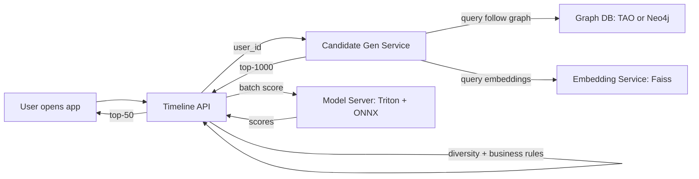

# 🐦 Problem 3 — Twitter/X Timeline Ranking

## 🎯 Learning Objectives

- Design a **multi-objective feed ranking system** that balances relevance, recency, diversity, and engagement in real time
- Apply the **CLEAR framework** to a high-QPS ranking problem (1M+ timeline refreshes per minute)
- Master the **two-stage architecture** for feed ranking: candidate generation (fan-out) + heavy ranker (neural network)
- Discuss the **heavy ranker as a multi-task model** that predicts like, retweet, reply, and dwell time jointly
- Calibrate the **latency budget** (200ms p95) against the **model size** (hundreds of millions of parameters)

---

## 1. Problem Statement

> Design the home timeline ranking for X (formerly Twitter). When a user opens the app, they see a ranked list of tweets from accounts they follow, plus algorithmic recommendations. The system serves 500M users, processes 1B timeline requests per day, and ranks 1,000 tweets per request from a candidate pool of 10M+.

---

## 2. Clarifying Questions (5-7 minutes)

| Category | Question | Why it matters |
|----------|----------|----------------|
| **Scale** | How many DAU? Timeline refreshes per day? | QPS calculation |
| **Quality** | Multi-objective: engagement, time-spent, replies, reports? | Multi-task model design |
| **Latency** | P95 latency for timeline render? | Determines ranker complexity |
| **Constraints** | In-network only, or also out-of-network recommendations? | Affects candidate generation |
| **Constraints** | Real-time trends / breaking news? | Affects feature pipeline |
| **Constraints** | Diversity requirement (political, media types)? | Affects ranker post-processing |
| **Constraints** | A/B test infrastructure? | Affects evaluation pipeline |

**Good answers:** "250M DAU, 1B requests/day, 200ms p95, multi-objective (like, RT, reply, dwell, report), in-network + out-of-network, diversity enforced via heuristics, A/B with stratified sampling."

---

## 3. Locate (3-4 minutes)



The boundary: **Timeline Ranker owns the candidate generation, the ranker model, the feature pipeline, and the post-processing**. It does not own tweet storage, user auth, or the follow graph.

---

## 4. Back-of-Envelope (3-4 minutes)

| Number | Value | Notes |
|--------|-------|-------|
| **QPS** | 12K timeline requests/sec peak, 4K average | 1B requests/day × peak factor |
| **Tweets ranked** | 1K per request × 4K QPS = 4M scored/sec | 4M scoring calls/sec |
| **Candidate pool** | 10M tweets per user (in-network + out-of-network) | 500M users × 200 follows × 50 recent tweets |
| **Latency budget** | 200ms p95 = 4 stages × 50ms | Parse, candidate gen, rank, post-process |
| **Model size** | Heavy ranker: 500M params × 2 bytes = 1GB | Multi-task neural net |

**Assumption:** p95 latency from production telemetry. 50% of users refresh within 1 hour, 30% in 6 hours, 20% after.

---

## 5. Architecture (20-25 minutes)

### 5.1 Data flow



The data feedback loop: every user action is logged, joined with the (user, tweet) pair that produced it, and used as a training label. The loop latency is **4-12 hours** (3 retraining cycles per day).

### 5.2 Two-stage model architecture



**Stage 1: Candidate generation (fan-out)**

- **In-network** (50% of timeline): tweets from accounts the user follows, ranked by recency, filtered by language and muted keywords.
- **Out-of-network** (50% of timeline): tweets from accounts the user does NOT follow, ranked by:
  - Two-tower embedding similarity (user embedding × tweet embedding).
  - Social graph proximity (followers of followers, similar users' engagement).
  - Trending in the user's geo/language.

The candidate generation returns **top-1000 tweets** from a pool of 10M+ per user.

**Stage 2: Heavy ranker (multi-task neural network)**

- Inputs: user features (1K), tweet features (500), user×tweet interaction features (200).
- Architecture: 5-layer transformer with cross-attention between user history and candidate tweets.
- Outputs: 4 engagement probabilities (P(like), P(RT), P(reply), P(dwell>5s)) + P(report).
- Final score: weighted combination, with weights tuned by online A/B testing.
- Latency: ~50ms for 1000 tweets (batched).

### 5.3 Serving topology



The hot path is **API → candidate gen → model server → post-process**. Latency budget 50ms per stage. The single point of failure is the model server — mitigated by a 2-version canary deploy (old + new model both served, 99% / 1% split).

---

## 6. ML Component Deep Dive

### 6.1 Multi-task learning

The heavy ranker predicts 4 engagement probabilities simultaneously. The architecture is a shared backbone (5-layer transformer) with 4 task-specific heads. The losses are weighted:

```python
# Pseudocode for multi-task loss
class MultiTaskRanker(nn.Module):
    def __init__(self, embed_dim=256, num_tasks=4):
        super().__init__()
        self.backbone = TransformerBackbone(embed_dim, num_layers=5)
        self.heads = nn.ModuleList([nn.Linear(embed_dim, 1) for _ in range(num_tasks)])

    def forward(self, user, tweet, history):
        h = self.backbone(user, tweet, history)  # (B, embed_dim)
        return torch.cat([head(h) for head in self.heads], dim=-1)  # (B, 4)

# Combined loss with task weights
def multi_task_loss(scores, labels, weights=[1.0, 0.5, 2.0, 1.5]):
    # weights: like, RT, reply, dwell
    losses = [F.binary_cross_entropy(scores[:, i], labels[:, i]) for i in range(4)]
    return sum(w * l for w, l in zip(weights, losses))
```

The task weights are not arbitrary. They reflect **business value**: a reply is worth more than a like (engagement depth), so reply is weighted higher. A dwell>5s is a strong engagement signal, weighted between like and reply.

### 6.2 Diversity enforcement

Pure engagement optimization leads to **filter bubbles** (the user sees only the type of content they have engaged with before). The mitigation: **diversity post-processing**.

```python
# Greedy diversity reranking
def diversify(tweets, scores, lambda_param=0.5):
    selected = []
    candidates = list(zip(tweets, scores))
    while len(selected) < 50 and candidates:
        # Score: engagement - lambda * max similarity to already selected
        for i, (t, s) in enumerate(candidates):
            if selected:
                max_sim = max(cosine_sim(t.embedding, s_t.embedding) for s_t in selected)
                candidates[i] = (t, s - lambda_param * max_sim)
        # Pick the highest-scored remaining
        best = max(candidates, key=lambda x: x[1])
        selected.append(best[0])
        candidates.remove(best)
    return selected
```

The `lambda_param` controls the diversity-accuracy tradeoff. The right value is tuned by A/B testing: too high, accuracy drops; too low, filter bubbles. Typical values are 0.3-0.6.

### 6.3 Out-of-network cold start

New users have **no follow graph, no engagement history**. The timeline is 100% out-of-network recommendations, ranked by:

- Demographic features (geo, language, device).
- Trending content in the user's geo/language.
- Embedding similarity to a "default user" embedding (population average).

After the first 10 engagements, the system switches to a personalized mix (50% in-network, 50% out-of-network). The cold-start window is 1-3 days for a new user to develop a stable preference profile.

---

## 7. System Component Deep Dive

### 7.1 The follow graph problem

The in-network candidate generation requires fetching the tweets of all accounts the user follows. For a user following 200 accounts, that's 200 fan-out reads, each returning 50 recent tweets → 10K candidate tweets, filtered and ranked to 1000.

The fan-out is the **read amplification** problem: 200 reads per timeline request × 12K QPS = **2.4M reads/sec**. The solution is a **precomputed fan-out** (a.k.a. "fan-out on write"): when a user posts a tweet, the system pushes the tweet to the timelines of all their followers, stored in a fast KV store (TAO, Redis). The timeline read is a single fetch from the KV store, not 200 fan-out reads.

The tradeoff: **fan-out on write** is fast to read but slow to write (one post fans out to 1M+ followers for a celebrity). **Fan-out on read** is slow to read but fast to write. Twitter uses a **hybrid**: fan-out on write for most users, fan-out on read for celebrities.

### 7.2 Real-time features

Some features are time-sensitive: the trending score of a hashtag, the current engagement velocity of a tweet, the user's recent activity. These are computed in a **streaming pipeline** (Flink) and served from a **feature store** (Redis) with a 60-second TTL.

The model is **trained on logged features** (the feature values at serving time, not the latest values), to avoid online/offline skew. The serving infra logs the exact features used for each prediction, and the training data joins with these logs.

---

## 8. Tradeoffs

| Decision | Choice A | Choice B | Pick |
|----------|----------|----------|------|
| **Candidate gen** | Fan-out on read | Fan-out on write (hybrid) | B (Twitter's choice, 99% read latency reduction) |
| **Ranker** | GBDT | Multi-task neural net | B (better quality, 50ms latency is fine) |
| **Multi-task weights** | Equal | Tuned by A/B | B (engagement value varies) |
| **Diversity** | None | Greedy reranking | B (avoid filter bubbles) |
| **Out-of-network** | 50% | 20% / 80% | Tuned by A/B (Twitter's choice: 50%) |
| **Retraining** | Daily | Hourly | B for fresh trends, A for stability |
| **Online learning** | None | Continuous | A (too risky for engagement) |

---

## 9. Production Reality

### Case: X's "For You" timeline launch

In 2023, X launched the "For You" feed that mixed in-network and out-of-network tweets 50/50. The launch was controversial: engagement initially dropped 10% as users saw less in-network content, but recovered over 3 months as the out-of-network recommendations improved. The key insight: **the user adapts to the new mix, and the recommendation quality compounds**.

The architecture: a **two-pool system** that maintains separate candidate pools for in-network and out-of-network, blends them at the ranker stage based on the user's preference profile. The blend ratio is itself a model output: P(in-network) = sigmoid(user_features), so the system learns per-user how much in-network vs out-of-network to show.

### Failure mode: viral misinformation amplification

A viral tweet with high engagement velocity can dominate the timeline within hours. If the tweet is misinformation, the engagement signal reinforces the ranking. The mitigation: **report signal** (P(report)) is a separate model output, and tweets with high P(report) are downweighted in the final score. The report signal is itself a model trained on user reports and moderator actions.

The lesson: **every engagement signal is a potential feedback loop trap**. The mitigation is to model the "negative" signals (report, hide, "not interested") alongside the "positive" ones, and combine them in the final score.

---

## 📦 Compression Code

```python
# NOTE: 04 - Problem 3 - Twitter/X Timeline
# CLEAR: 5-7 questions, location diagram, 5 back-of-envelope numbers
# Architecture: 2 stages (candidate gen + heavy ranker), 3 Mermaid diagrams
# Models: multi-task neural net (5-layer transformer, 4 heads, 500M params)
# Latency budget: 200ms p95 = 4 stages × 50ms
# QPS: 12K timeline requests/sec peak, 4K average
# Fan-out: hybrid (write for normal users, read for celebrities)
# Multi-task: like, RT, reply, dwell + report (negative signal)
# Diversity: greedy reranking with lambda=0.3-0.6
# Cold start: 100% out-of-network for new users, 50/50 after 10 engagements
# Production case: X "For You" launch (2023), 50/50 blend, 3-month adaptation

# Whiteboard diagram (compressed)
TIMELINE = {
    "candidate_gen": "Fan-out hybrid: in-network (KV) + out-of-network (embedding sim)",
    "ranker": "Multi-task transformer, 4 engagement heads, 500M params, 50ms",
    "post_process": "Diversity reranking (lambda=0.5), report downweighting",
    "feedback_loop": "engagement -> Kafka -> Spark -> trainer -> 4-12h",
}
```

## 🎯 Key Takeaways

- **Two-stage architecture** is standard: candidate generation (fan-out hybrid) + heavy ranker (multi-task neural net)
- **Multi-task learning** predicts like, RT, reply, dwell, and report jointly — the negative signal (report) is what prevents misinformation amplification
- **Diversity post-processing** is required to avoid filter bubbles; greedy reranking with lambda=0.3-0.6 is the standard
- **Fan-out on write vs fan-out on read** is a real tradeoff — Twitter uses hybrid (write for normal, read for celebrities)
- **The feedback loop is 4-12 hours** — engagement velocity changes faster than the model can learn, so trending content needs separate handling

## References

- X Engineering Blog, *The Technology Behind X's "For You" Timeline* (2023)
- Twitter Engineering Blog, *The Infrastructure Behind Twitter's Timeline* (ancient but foundational)
- *Multi-Task Learning for Ranking* (Etsy, 2014)
- *Diversity in Recommender Systems* (Antikacioglu et al., 2017)
- Alex Xu, *Machine Learning System Design Interview* — Chapter on feed ranking
- Triton Inference Server: https://www.triton-inference-server.io/
