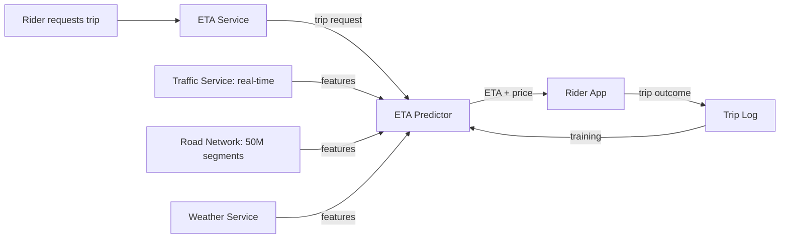
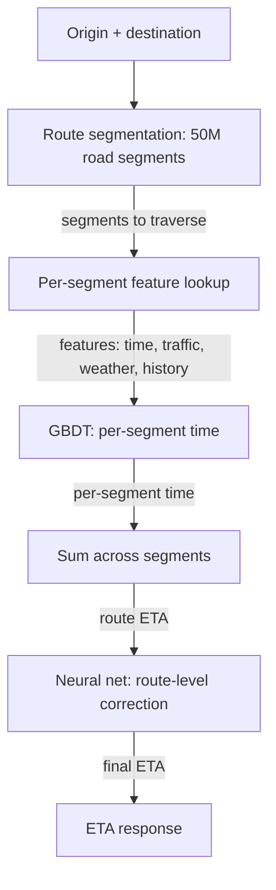
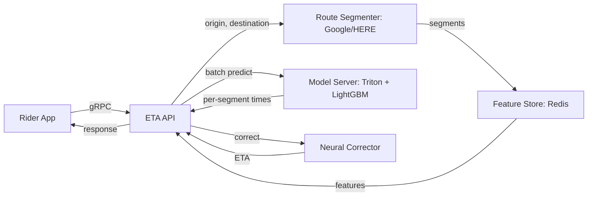

# 🚕 Problem 4 — Uber ETA Prediction

## 🎯 Learning Objectives

- Design a **spatio-temporal prediction system** that estimates arrival times across millions of trips per day with sub-minute accuracy
- Apply the **CLEAR framework** to a regression problem with strong geographic and temporal patterns
- Master the **GBDT + neural net ensemble** pattern, where the GBDT handles tabular features and the neural net handles sequential / graph features
- Discuss **feature engineering for spatio-temporal data** (segment-based travel time, traffic patterns, weather, events)
- Calibrate the **latency budget** (50ms p95) against the **feature pipeline complexity** (real-time traffic + road network)

---

## 1. Problem Statement

> Design Uber's ETA prediction system. When a rider requests a trip, the app shows the estimated time of arrival for the driver and the estimated price. The system serves 130M MAU, processes 25M trips per day, and must predict ETA with ±1 minute accuracy for 80% of predictions.

---

## 2. Clarifying Questions (5-7 minutes)

| Category | Question | Why it matters |
|----------|----------|----------------|
| **Scale** | How many trips per day? How many cities? | QPS + geographic distribution |
| **Latency** | P95 latency for ETA display? | Determines feature pipeline |
| **Quality** | What metric? MAE in minutes? % within ±1 min? | Different metrics → different models |
| **Constraints** | Real-time traffic? | Affects feature pipeline |
| **Constraints** | Road network segmentation? | Affects feature engineering |
| **Constraints** | Multi-modal (rideshare, delivery, freight)? | Affects model scope |
| **Constraints** | Cold start for new cities / new roads? | Affects ramp strategy |

**Good answers:** "25M trips/day, 10K cities, 100ms p95, MAE in minutes + % within ±1 min, real-time traffic (Google/HERE), 50M road segments, multi-modal."

---

## 3. Locate (3-4 minutes)



The boundary: **ETA Predictor owns the model, the feature pipeline, the serving infra, and the retraining loop**. It does not own the trip service, the driver app, or the price engine (though the price engine consumes the ETA).

---

## 4. Back-of-Envelope (3-4 minutes)

| Number | Value | Notes |
|--------|-------|-------|
| **QPS** | 25M trips / day × peak factor = 600 QPS average, 1.5K peak | One ETA per trip, plus refresh every 5s |
| **Segments** | 50M road segments × 1KB features = 50GB | In-memory in feature store |
| **Bandwidth** | 1.5K QPS × 2KB response = 3 MB/s | Response is ETA + route + price |
| **Latency budget** | 100ms p95 = 5 stages × 20ms | Parse, segment, features, predict, post-process |
| **Model size** | GBDT: 100MB, neural: 500MB | GBDT for tabular, NN for sequential |

**Assumption:** 100ms p95 from production telemetry. Traffic varies 5x peak vs off-peak (rush hour, Friday night, events).

---

## 5. Architecture (20-25 minutes)

### 5.1 Data flow


The data feedback loop: every completed trip produces a (predicted, actual) pair that is logged and used as a training example. The loop latency is **24 hours** (daily retraining).

### 5.2 The segment-based architecture



The key architectural decision: **predict the travel time for each road segment, then sum**. This decomposes the problem into 50M small problems (one per segment) that are easier to model than a single "trip" model.

**Stage 1: Route segmentation**

- Input: (origin_lat, origin_lon, destination_lat, destination_lon).
- Output: ordered list of road segments to traverse, with distances.
- Implementation: Google Maps Directions API or HERE Routing API, with 50M road segments in a custom graph.

**Stage 2: Per-segment feature lookup**

- Features per segment: time of day, day of week, holiday flag, weather, traffic speed, segment length, segment type (highway, arterial, local), historical average time.
- Storage: Redis, precomputed hourly.

**Stage 3: Per-segment GBDT prediction**

- Model: LightGBM, 100 trees, max depth 8.
- Input: 30 features per segment.
- Output: predicted travel time in seconds.
- Latency: 5ms per segment, total 100ms for a 20-segment trip.

**Stage 4: Route-level neural correction**

- Model: small MLP that takes the sum of per-segment predictions and corrects for route-level effects (intersections, traffic light timing, driver behavior variance).
- Output: corrected ETA in seconds.
- Latency: 5ms.

### 5.3 Serving topology



The hot path is **API → segmenter → feature store → model server → corrector**. Latency budget 20ms per stage. The single point of failure is the routing API — mitigated by caching popular routes and a fallback routing algorithm.

---

## 6. ML Component Deep Dive

### 6.1 Per-segment GBDT

The per-segment GBDT predicts travel time for a single segment given its features. The features are the same for every segment, which means the model generalizes across segments. The training data is **billions of (segment, time) pairs** aggregated from historical trips.

```python
# Pseudocode for per-segment GBDT
import lightgbm as lgb

# Features per segment
features = [
    "segment_length_m",      # 50-5000m
    "segment_type",          # highway, arterial, local
    "speed_limit_kmh",       # 20-130
    "hour_of_day",           # 0-23
    "day_of_week",           # 0-6
    "is_holiday",            # bool
    "weather_code",          # clear, rain, snow, fog
    "traffic_speed_kmh",     # real-time, 0-130
    "historical_avg_time_s", # 30-day rolling average
    "historical_std_s",      # 30-day rolling std
]

# Train
train_data = lgb.Dataset(X_train, label=y_train)  # y = actual travel time
params = {"objective": "regression", "metric": "mae", "num_leaves": 255, "learning_rate": 0.05}
model = lgb.train(params, train_data, num_boost_round=200)

# Predict
predicted_time = model.predict(X_test)
```

The model accuracy: **MAE 8-12 seconds** per segment, which compounds to **MAE 1-2 minutes** for a typical 20-segment trip. The 80%-within-±1-minute target is met for most trips.

### 6.2 Why not just a neural net for the whole trip?

A neural net for the whole trip would learn the route representation end-to-end, but:

- It needs 100x more training data to match the GBDT's accuracy.
- It is harder to debug (the per-segment decomposition is interpretable).
- It does not generalize to new road segments (the GBDT uses segment features that exist for new segments).

The GBDT is the right choice for the per-segment prediction. The neural net is added as a **route-level corrector** that learns the residuals.

### 6.3 Spatio-temporal features

The key features for ETA are **spatio-temporal**:

- **Time of day** (rush hour, midday, evening, night): the strongest feature for most cities.
- **Day of week** (weekday vs weekend): weekends have different traffic patterns.
- **Holidays and events** (New Year's Eve, concerts, sports games): can cause 10x traffic spikes.
- **Weather** (rain, snow, fog): can cause 2-5x slowdown.
- **Real-time traffic** (current speed on each segment): the most important feature for accuracy.

The model is **trained on logged features** (the feature values at the time of the trip, not the latest values), to avoid online/offline skew.

---

## 7. System Component Deep Dive

### 7.1 Real-time traffic ingestion

The real-time traffic feed comes from **probe vehicles** (Uber's own drivers) and **third-party providers** (Google, HERE). The feed is updated every 1-5 minutes per segment. The ingestion pipeline is **Apache Flink** on Kubernetes, processing 1M events/sec.

The pipeline computes per-segment features: current speed, current travel time, confidence interval. The features are written to Redis with a 5-minute TTL. The end-to-end feature lag is **< 5 minutes** from probe to feature availability.

### 7.2 Segment aggregation for new cities

When Uber launches in a new city, the segment features are **cold** (no historical data). The cold-start strategy:

- **First 30 days**: use the third-party routing API (Google/HERE) for ETA, no ML.
- **30-90 days**: train a GBDT on the small amount of local data, with default features.
- **90+ days**: full ML pipeline with local data.

The launch is enabled by **transfer learning**: the model is pre-trained on a similar city (e.g., Mexico City for a new Latin American city), then fine-tuned on local data. The fine-tuning takes 100x less data than training from scratch.

### 7.3 Feedback loop with delayed labels

The actual travel time is known only after the trip completes. For long trips (1+ hours), the label is delayed by the trip duration. The training pipeline uses **streaming label joining** with a configurable window (default 4 hours), so all labels are joined within 4 hours of trip completion.

The trainer retrains daily on the last 90 days of data. The new model is deployed to canary (1% of traffic), and if the canary MAE is better than the production model, it is promoted to 100%.

---

## 8. Tradeoffs

| Decision | Choice A | Choice B | Pick |
|----------|----------|----------|------|
| **Segment model** | GBDT per segment | Neural net per segment | A (simpler, more accurate) |
| **Route model** | Sum of segments | Neural net for whole route | A + B (sum + neural corrector) |
| **Features** | Precomputed hourly | Streaming real-time | B (more accurate, 5min lag) |
| **Retraining** | Daily | Hourly | A (sufficient for traffic patterns) |
| **Cold start** | Use Google Maps | Use pre-trained model from similar city | B (better accuracy) |
| **Online learning** | None | Continuous | A (too risky for ETA) |
| **Multi-modal** | Single model | Per-mode model | B (rideshare vs delivery are different) |

---

## 9. Production Reality

### Case: Uber's "DeepETA" paper (2020)

In 2020, Uber published a paper describing their move from a GBDT-only model to a **deep learning model** that combines tabular features (GBDT) with sequence features (transformer over the road segments). The result: **5-10% MAE improvement** in the hardest cities (Bangalore, Sao Paulo) where the GBDT struggled with non-linear interactions.

The architecture: a **two-tower model** that takes the segment sequence as input to a transformer (the "sequence tower") and the tabular features as input to an MLP (the "tabular tower"), then fuses the two outputs. The result is more accurate than either alone, but more complex to serve.

The lesson: **deep learning wins on the hardest 10% of cases**. The simple GBDT handles 90% of predictions within ±1 minute; the deep model handles the remaining 10% (unusual traffic, construction, events) with better accuracy.

### Failure mode: the "phantom jam" feedback loop

A subtle failure mode of ETA prediction is the **phantom jam feedback loop**: if the model predicts a higher ETA for a route, drivers avoid that route, traffic clears, and the next prediction is even higher. The loop amplifies the initial error.

The mitigation: **ensemble with a baseline** (the historical average for the same time-of-day / day-of-week) and **clip the prediction** to a reasonable range (e.g., never more than 2x the historical average). The clip prevents the model from going off the rails.

---

## 📦 Compression Code

```python
# NOTE: 05 - Problem 4 - Uber ETA Prediction
# CLEAR: 5-7 questions, location diagram, 5 back-of-envelope numbers
# Architecture: 4 stages (segment, features, predict, correct), 3 Mermaid diagrams
# Models: GBDT per segment (LightGBM, 100 trees) + neural corrector (small MLP)
# Latency budget: 100ms p95 = 5 stages × 20ms
# QPS: 600 average, 1.5K peak
# Segments: 50M road segments × 1KB = 50GB in Redis
# Cold start: 30 days Google Maps, 30-90 days GBDT on small data, 90+ days full ML
# Transfer learning: pre-trained on similar city, fine-tuned on local
# Production case: DeepETA paper (2020), 5-10% MAE improvement on hardest cities
# Failure mode: phantom jam feedback loop, mitigated by clip to 2x historical average

# Whiteboard diagram (compressed)
ETA = {
    "stage_1": "Route segmentation: Google/HERE, 20 segments per trip",
    "stage_2": "Per-segment features: time, traffic, weather, history",
    "stage_3": "GBDT per segment: 100 trees, 30 features, 5ms per segment",
    "stage_4": "Neural corrector: route-level residual, 5ms",
    "feedback_loop": "trip outcome -> Spark -> trainer -> 24h",
}
```

## 🎯 Key Takeaways

- **Segment-based architecture** is the standard: predict per-segment time, sum across segments, correct with a neural net
- **GBDT per segment** is the right model for tabular features; neural net is added as a route-level corrector for the hardest 10%
- **Spatio-temporal features** (time-of-day, day-of-week, traffic, weather) are the strongest predictors
- **Cold start for new cities** uses transfer learning from a similar city, fine-tuned on local data
- **The phantom jam feedback loop** is mitigated by clipping the prediction to 2x the historical average

## References

- Uber Engineering Blog, *DeepETA: How Uber Predicts Arrival Times* (2020)
- Uber Engineering Blog, *Scaling Uber's Mapping Infrastructure* (2018)
- *Gradient Boosting for Spatio-Temporal Prediction* (general ML literature)
- Alex Xu, *Machine Learning System Design Interview* — Chapter on ETA prediction
- HERE Routing API: https://developer.here.com/
- Google Maps Directions API: https://developers.google.com/maps/documentation/directions
