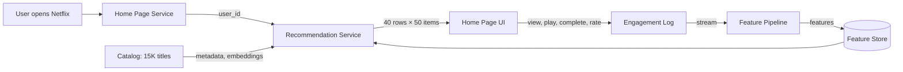
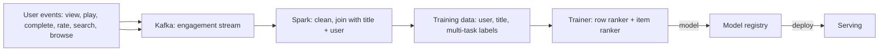
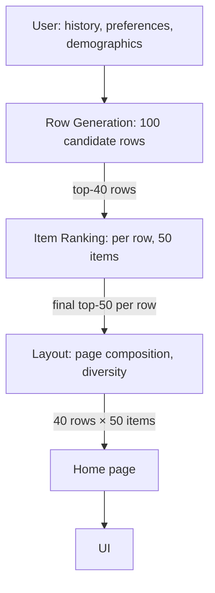
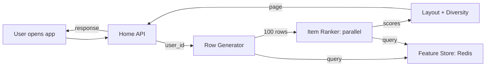

# 🎬 Problem 5 — Netflix Recommendations

## 🎯 Learning Objectives

- Design a **two-stage recommendation system** that personalizes the Netflix home page for 200M+ users across 15K+ titles
- Apply the **CLEAR framework** to a content recommendation problem with a small item catalog (vs. infinite-tail)
- Master the **row-wise vs column-wise** candidate generation tradeoff and why Netflix uses both
- Discuss **the "evidence" ensemble** that combines ratings, viewing history, search queries, and cover art clicks
- Calibrate the **latency budget** (200ms p95) for a system that drives 80% of viewing hours

---

## 1. Problem Statement

> Design Netflix's home page recommendation system. When a user opens Netflix, they see a personalized grid of rows (each row themed: "Top Picks for You", "Trending Now", "Because you watched X"). The system serves 200M users, recommends from 15K titles, and drives 80% of all viewing hours.

---

## 2. Clarifying Questions (5-7 minutes)

| Category | Question | Why it matters |
|----------|----------|----------------|
| **Scale** | How many DAU? How many titles? | QPS + catalog size |
| **Latency** | P95 latency for home page render? | Determines architecture |
| **Quality** | What metric? Viewing hours? Completion rate? Subscriber retention? | Multi-objective ranking |
| **Constraints** | Multi-country? Multi-language? | Affects catalog features |
| **Constraints** | Real-time popularity? | Affects candidate generation |
| **Constraints** | Cold start for new users? | Affects personalization ramp |
| **Constraints** | Row-based UI vs flat list? | Determines row selection vs item ranking |

**Good answers:** "200M users, 15K titles (small), 200ms p95, viewing hours + completion rate, 190 countries, row-based UI with 40 rows × 50 items each."

---

## 3. Locate (3-4 minutes)



The boundary: **Recommendation Service owns the row generation, the item ranking, the feature pipeline, and the retraining loop**. It does not own the streaming service, the catalog ingest, or the user auth.

---

## 4. Back-of-Envelope (3-4 minutes)

| Number | Value | Notes |
|--------|-------|-------|
| **QPS** | 50K home page requests/sec peak, 15K average | 200M users × 1 page/day × peak factor |
| **Titles** | 15K × 1KB features = 15MB | Tiny, fits in any model server's memory |
| **Rows per page** | 40 rows × 50 items = 2,000 items | UI constraint |
| **Latency budget** | 200ms p95 = 4 stages × 50ms | Row gen, item rank, layout, post-process |
| **Model size** | Per-row ranker: 50M params × 2 bytes = 100MB | Smaller than Twitter because catalog is small |

**Assumption:** 200M MAU, 50% open the app daily, peak factor 3x.

---

## 5. Architecture (20-25 minutes)

### 5.1 Data flow



The data feedback loop: every user action is logged, joined with the (user, title) pair, and used as a multi-task training label. Loop latency is **24 hours**.

### 5.2 The two-tier architecture



Netflix's recommendation is **two-tier**: a row generator selects which themed rows to show (e.g., "Top Picks", "Trending in your country", "Because you watched X"), and an item ranker fills each row with 50 titles.

**Tier 1: Row generation**

- Inputs: user history, time of day, country, device.
- Outputs: 100 candidate rows, ranked by predicted engagement.
- Rows are templates: "Top Picks for {user}", "Trending in {country}", "Because you watched {title}".
- Latency: 20ms (mostly database lookups + simple model).

**Tier 2: Item ranking (per row)**

- Inputs: user history, the row's theme, candidate titles for that row.
- Outputs: top-50 titles for the row.
- Latency: 30ms per row × 40 rows = 1.2s (parallelized across rows).

**Layout and diversity**

- Post-processing: ensure no duplicate titles across rows, ensure genre diversity, ensure country-specific content rules.
- Latency: 20ms.

### 5.3 The "evidence" ensemble

```mermaid
flowchart TB
    subgraph EVIDENCE[Evidence Sources]
        E1[Explicit ratings: 1-5 stars]
        E2[Viewing history: what, when, how much]
        E3[Search queries: what they look for]
        E4[Browse behavior: rows clicked, time spent]
        E5[Cover art clicks: which thumbnails they tapped]
    end
    EVIDENCE -->|features| MODEL[Multi-task ranker]
    MODEL -->|P(play), P(complete), P(rate>4)| SCORES[Per-title scores]
```

The key architectural insight: **Netflix uses multiple evidence sources**, not just viewing history. A user who has not watched anything in 6 months can still get good recommendations from search queries, browse behavior, and cover art clicks. The model fuses all evidence sources into a single score per title.

### 5.4 Serving topology



The hot path is **API → row gen → item rank → layout**. The item rank is parallelized across rows (40 parallel calls). Latency budget 50ms per stage.

---

## 6. ML Component Deep Dive

### 6.1 Personalized Video Ranker (PVR)

Netflix's PVR is the canonical example of a **two-tower neural ranker**:

- User tower: encodes user history, demographics, and contextual features into a 256-d embedding.
- Item tower: encodes title metadata, embeddings, and popularity into a 256-d embedding.
- Output: dot product + multi-task heads (P(play), P(complete), P(rate)).

The training uses **implicit feedback** (play, complete) as the primary label, with explicit ratings as a secondary label. The model is trained on the last 90 days of engagement data.

### 6.2 Row-based personalization

The row templates are the **second layer of personalization**. The same user might see "Because you watched Stranger Things" and "Top Picks for You" and "Trending in Colombia" — three different recommendation strategies in one page. The row generator picks which 40 rows to show, and the model decides which 50 titles go in each row.

The row generator is a **separate model** from the item ranker. It predicts P(engage with row) given the row's theme and the user's profile. The top-40 rows by predicted engagement are shown.

### 6.3 Cover art personalization

A subtle but important feature: **the cover art shown for each title is personalized**. The same title can have 5-10 different cover arts, and the model picks the one that the user is most likely to click. A user who watches a lot of action movies sees the action-heavy cover; a user who watches dramas sees the character-focused cover.

The cover art selection model is a small neural net trained on (user, title, cover) → click data. The cost is a 1-2% engagement lift, which is significant at Netflix's scale.

---

## 7. System Component Deep Dive

### 7.1 The "evidence" features

The evidence sources are aggregated into features in a **streaming pipeline** (Flink):

- Viewing history: what, when, how much, completion %.
- Explicit ratings: 1-5 stars.
- Search queries: text, frequency.
- Browse behavior: rows clicked, time on page.
- Cover art clicks: which thumbnail variants.

The features are stored in Redis with 1-hour TTL. The serving pipeline reads ~100 features per title, so a row of 50 titles = 5K features, fetched in 10ms via Redis pipelining.

### 7.2 The row-template catalog

Netflix maintains a catalog of **200+ row templates**, each parameterized:

- "Top Picks for {user}": the default personalized row.
- "Trending in {country}": popularity in the user's country.
- "Because you watched {title}": similar to the most recent title.
- "Award-winning {genre}": titles in the genre that have won awards.
- "New releases": titles released in the last 30 days.
- "Continue watching": the user's in-progress titles.

The row generator picks 100 candidate rows from the catalog, ranked by predicted engagement, and the top 40 are shown.

### 7.3 Feedback loop with delayed labels

The viewing hours label is delayed by the viewing duration. For a 2-hour movie, the label is known 2 hours after the play started. The training pipeline uses **streaming label joining** with a 4-hour window, so all labels are joined within 4 hours of play completion.

The trainer retrains daily on the last 90 days of data. The new model is deployed to canary (1% of traffic), and if the canary viewing hours per user is better, it is promoted to 100%.

---

## 8. Tradeoffs

| Decision | Choice A | Choice B | Pick |
|----------|----------|----------|------|
| **Row generation** | Hand-curated rows | ML-generated rows | B (more relevant, A as fallback) |
| **Item ranker** | GBDT | Neural net (PVR) | B (better quality) |
| **Cover art** | Single cover | Personalized cover | B (1-2% engagement lift) |
| **Cold start** | Popular in country | Demographic-based | B (better than country-only) |
| **Retraining** | Daily | Hourly | A (sufficient for content) |
| **A/B test** | Two-arm | Multi-arm bandit | B (faster convergence on new rows) |
| **Diversity** | None | Genre + country quotas | B (avoid filter bubbles) |

---

## 9. Production Reality

### Case: Netflix's $1M Prize (2009)

In 2009, Netflix ran a public competition to improve their recommendation algorithm by 10%. The winning team succeeded, but Netflix never implemented their solution: the improvement was on a static dataset, and the team did not account for the fact that **recommendations change what users watch**. The lesson: **offline accuracy is not the same as online impact**. A 10% RMSE improvement on a 2009 dataset does not translate to 10% more viewing hours in 2010.

Netflix's actual production system evolved differently: the company moved from explicit ratings to implicit feedback (play, complete), added row-based personalization, and invested heavily in cover art personalization. The viewing hours gain came from these product-level innovations, not from the offline accuracy win.

### Failure mode: the "popularity bias" trap

A naive recommender system that ranks titles by global popularity will recommend the same 100 titles to every user. The result: the system reinforces popularity, and long-tail titles never get discovered. The mitigation: **down-weight global popularity** in the ranking score, and add **exploration** (10% of recommendations are random from the long tail).

Netflix uses a **per-user popularity baseline**: a title's score is adjusted by how popular it is among users similar to the target user, not globally popular. The adjustment prevents the popularity trap while keeping the recommendation relevant.

---

## 📦 Compression Code

```python
# NOTE: 06 - Problem 5 - Netflix Recommendations
# CLEAR: 5-7 questions, location diagram, 5 back-of-envelope numbers
# Architecture: 2 tiers (row gen + item rank), 3 Mermaid diagrams
# Models: PVR (two-tower neural, 256d), row ranker, cover art ranker
# Latency budget: 200ms p95 = 4 stages × 50ms
# QPS: 50K home page requests/sec peak, 15K average
# Titles: 15K catalog (small), 40 rows × 50 items per page = 2K items
# Evidence ensemble: ratings, viewing, search, browse, cover clicks
# Row templates: 200+ parameterized templates, ML picks top 40
# Cold start: demographic-based, 30-day ramp to personalized
# Production case: $1M Prize (2009), offline win never shipped; product innovations did
# Failure mode: popularity bias, mitigated by per-user baseline + exploration

# Whiteboard diagram (compressed)
NETFLIX = {
    "tier_1": "Row generation: 100 candidate rows from 200+ templates, top 40 by predicted engagement",
    "tier_2": "Item ranking per row: PVR two-tower, top 50 per row, parallelized",
    "layout": "Diversity post-process: no duplicates, genre quotas, country rules",
    "evidence": "Ratings, viewing, search, browse, cover clicks, fused into multi-task score",
    "feedback_loop": "engagement -> Kafka -> Spark -> trainer -> 24h",
}
```

## 🎯 Key Takeaways

- **Two-tier architecture** (row generation + item ranking) is the standard for content catalogs: rows are templates, items are scored
- **Evidence ensemble** fuses multiple signals (ratings, viewing, search, browse, cover clicks) into a single score — never rely on viewing alone
- **Cover art personalization** is a 1-2% engagement lift that's often missed — same title, different thumbnail per user
- **The $1M Prize lesson**: offline accuracy wins don't translate to online impact; product innovations matter more
- **Popularity bias** is mitigated by per-user baseline + 10% exploration of the long tail

## References

- Netflix Research Blog, *Personalized Video Ranking* (multiple posts, 2017-2020)
- Netflix Research Blog, *Artwork Personalization* (2017)
- *The Netflix Recommender System* (Gomez-Uribe & Hunt, 2016)
- *Beyond Accuracy: Behavioral Testing of NLP Models with CheckList* (methodology for testing recs)
- Alex Xu, *Machine Learning System Design Interview* — Chapter on recommendations
- Netflix Tech Blog: https://netflixtechblog.com/
