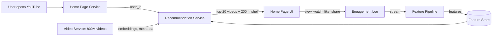
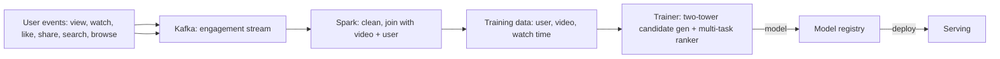
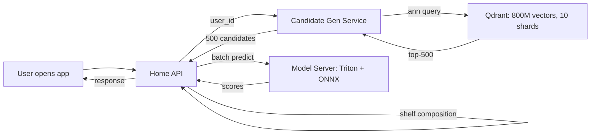

# 📺 Problem 6 — YouTube Recommendations

## 🎯 Learning Objectives

- Design a **deep candidate generation + multi-modal ranking** system for a video catalog of 800M+ videos
- Apply the **CLEAR framework** to a content recommendation problem with an infinite-tail catalog
- Master the **two-tower neural candidate generation** for video embedding (visual + textual + audio)
- Discuss the **"watch time" vs "engagement" objective** and why YouTube optimizes for watch time
- Calibrate the **latency budget** (200ms p95) for a system that serves billions of recommendations per day

---

## 1. Problem Statement

> Design YouTube's home page recommendation system. When a user opens YouTube, they see a ranked list of videos (mix of subscriptions, recommendations, and trending). The system serves 2B MAU, recommends from 800M videos, and drives 70% of all viewing time.

---

## 2. Clarifying Questions (5-7 minutes)

| Category | Question | Why it matters |
|----------|----------|----------------|
| **Scale** | How many DAU? How many videos? | QPS + catalog size |
| **Latency** | P95 latency for home page render? | Determines architecture |
| **Quality** | What metric? Watch time? Click-through rate? Surveys? | Multi-objective ranking |
| **Constraints** | Real-time trends? | Affects candidate generation |
| **Constraints** | Cold start for new videos? | Affects exploration |
| **Constraints** | Multi-language? Multi-region? | Affects catalog features |
| **Constraints** | Embedding model scale? | Affects ANN search cost |

**Good answers:** "2B MAU, 800M videos (infinite tail), 200ms p95, watch time + click rate, 100 countries, real-time trends, embedding model is 100M+ params."

---

## 3. Locate (3-4 minutes)



The boundary: **Recommendation Service owns candidate generation, ranking, feature pipeline, and retraining**. It does not own the video storage, the streaming service, or the channel subscription graph.

---

## 4. Back-of-Envelope (3-4 minutes)

| Number | Value | Notes |
|--------|-------|-------|
| **QPS** | 500K home page requests/sec peak, 150K average | 2B users × 1 page/day × peak factor |
| **Videos** | 800M × 256d × 4 bytes = 800GB embeddings | Single Qdrant cluster with 10 shards |
| **Items ranked** | 200 per shelf × 10 shelves = 2,000 per request | Multiple shelves with own ranking |
| **Latency budget** | 200ms p95 = 4 stages × 50ms | Candidate gen, score, layout, post-process |
| **Model size** | Two-tower: 100M params × 2 bytes = 200MB | Smaller than ranker, since it's an embedding model |

**Assumption:** 2B MAU, 50% open the app daily, peak factor 3x.

---

## 5. Architecture (20-25 minutes)

### 5.1 Data flow



The data feedback loop: every watch event is logged with the watch time, joined with the (user, video) pair, and used as a training label. Loop latency is **24 hours** but with **freshness pipelines** that update popular video embeddings every hour.

### 5.2 The two-stage architecture

```mermaid
flowchart TB
    USER[User: history, subscriptions, embeddings] --> CG[Candidate gen: two-tower ANN]
    CG -->|top-500 videos| RANK[Multi-task ranker: watch time prediction]
    RANK -->|P(click), P(watch_time>30s), P(like)| SCORES[Per-video scores]
    SCORES -->|diversity + business rules| FINAL[Top-20 + shelf composition]
    FINAL --> UI[Home Page UI]
```

**Stage 1: Candidate generation (two-tower ANN)**

- User tower: encodes watch history, subscriptions, demographics into a 256-d embedding.
- Video tower: encodes video content (visual, textual, audio) into a 256-d embedding.
- Output: dot product → top-500 videos from 800M corpus.
- Latency: 20ms (Qdrant ANN, 10 shards, 80M vectors per shard).

**Stage 2: Multi-task ranker**

- Inputs: user features, video features, user×video interaction features.
- Architecture: 5-layer MLP with multi-task heads.
- Outputs: P(click), P(watch_time>30s), P(like), P(share), P(dislike).
- Final score: weighted combination optimized for **expected watch time**.
- Latency: 50ms for 500 videos (batched).

### 5.3 The watch time objective

```mermaid
flowchart TB
    RANK[Ranker output: P(click), P(watch), P(like)] --> COMBINE[Combine: weighted sum]
    COMBINE -->|expected watch time| SCORE[Per-video expected watch time]
    SCORE -->|rank| OUT[Top videos]
```

The key insight: **YouTube ranks by expected watch time, not by click probability**. A clickbait video that gets clicked but watched for 5 seconds is ranked lower than a long video that gets clicked and watched for 5 minutes. The expected watch time is computed as:

```python
# Expected watch time per video
def expected_watch_time(p_click, p_watch_30s, p_long_watch, avg_watch_time):
    # p_click: P(user clicks on thumbnail)
    # p_watch_30s: P(user watches > 30s given click)
    # p_long_watch: P(user watches > 5min given click)
    # avg_watch_time: average watch time given click (in seconds)
    return p_click * (p_watch_30s * 30 + p_long_watch * avg_watch_time)
```

The model is trained to predict the **log of watch time** (a continuous label), not the binary "click" or "watch" labels. The training loss is MSE on log(watch_time + 1).

### 5.4 Serving topology



The hot path is **API → candidate gen → model server → shelf composition**. The single point of failure is the Qdrant cluster — mitigated by per-shard replicas and a fallback to a popularity-based candidate gen.

---

## 6. ML Component Deep Dive

### 6.1 Multi-modal video embedding

The video tower takes **three input modalities** and produces a single 256-d embedding:

- **Visual**: frame embeddings from a pre-trained CNN (e.g., a ResNet trained on ImageNet, fine-tuned on YouTube video classification).
- **Textual**: title, description, transcript encoded by a transformer.
- **Audio**: speech transcript (if no transcript) or audio embeddings.

The three modalities are concatenated and passed through an MLP to produce the 256-d embedding. The training is **contrastive**: given a (user, video) pair where the user watched the video, maximize the dot product of their embeddings; minimize the dot product with random videos.

### 6.2 The "explore vs exploit" of new videos

New videos have **no engagement signal**. The recommendation system must balance:

- **Exploit**: show the new video to users who are likely to engage (based on the content-based embedding).
- **Explore**: show the new video to a random sample of users to gather engagement data.

The strategy: **boost new videos by 10x in candidate generation for the first 7 days**. This ensures every new video gets ~1K-10K impressions, which is enough to compute an engagement signal. After 7 days, the boost tapers and the video enters the normal candidate generation.

### 6.3 The shelf composition

The home page is composed of **shelves** (rows of videos with a theme). The shelf types include:

- "Top picks" (personalized)
- "Trending" (popular in the user's country)
- "From your subscriptions" (latest from channels the user follows)
- "Because you watched X" (similar to a recent watch)
- "New from creators you follow"

Each shelf has its own candidate generation and ranking. The shelf composition is itself a model: given the user, predict the probability of engaging with each shelf type, and show the top 10 shelves.

---

## 7. System Component Deep Dive

### 7.1 The Qdrant cluster

800M vectors × 256d × 4 bytes = 800GB raw, ~1.5TB with HNSW index. Single-node Qdrant cannot hold this; the cluster is **10 shards**, each with 80M vectors and ~150GB. The ANN query is parallelized across shards (each shard returns its top-100, the merger returns the top-500 overall).

The cluster runs on ~50 nodes (5 per shard, 1 primary + 4 replicas). The cost is ~$50K/month in cloud spend. The QPS is 500K peak, well within the cluster's capacity.

### 7.2 The freshness pipeline

Video embeddings are computed at upload time. But the engagement signal updates over time: a video that was popular last week may be declining. YouTube runs a **freshness pipeline** that recomputes the engagement features (popularity, watch time) every hour for the top 1M videos, and every day for the rest.

The candidate generation uses the latest engagement features, so trending videos surface quickly. The two-tower embedding itself is updated less frequently (every 24 hours), because retraining is expensive.

### 7.3 A/B test infrastructure

YouTube runs **thousands of A/B tests** per year, each one a 1-5% slice of traffic. The infrastructure is **layered** (each user is in a single bucket for each test layer, so they are in either the control or treatment for every test simultaneously). The primary metric is **expected watch time per user per day**; the secondary metrics are CTR, dislike rate, and survey responses.

The A/B test duration is **2-4 weeks**, with a mandatory 1-week cooldown between tests. The reason: the recommendation system has feedback loops, and a 1-week test may not capture the long-term effect. A 4-week test is more reliable.

---

## 8. Tradeoffs

| Decision | Choice A | Choice B | Pick |
|----------|----------|----------|------|
| **Candidate gen** | Two-tower NN | Graph-based (PinSage) | A (simpler, scales better) |
| **Ranker** | GBDT | Multi-task neural net | B (better quality) |
| **Objective** | Click probability | Expected watch time | B (the YouTube choice) |
| **Cold start** | 10x boost for 7 days | Embedding-based personalization | B (better for long-tail) |
| **Shelf composition** | Hand-curated | ML-generated | B (more relevant) |
| **Retraining** | Daily | Hourly | B for popular videos, A for the rest |
| **A/B test duration** | 1 week | 4 weeks | B (catches feedback loops) |

---

## 9. Production Reality

### Case: YouTube's "Deep Neural Networks for YouTube Recommendations" (2016)

In 2016, Google published a now-classic paper describing YouTube's two-stage recommendation system. The paper is the canonical reference for production recommendation systems and is cited in nearly every ML interview prep book. The key contributions:

- The two-tower architecture for candidate generation, with the dot product as the similarity.
- The multi-task ranker with shared embeddings, predicting engagement + satisfaction.
- The "expected watch time" objective, with the log of watch time as the training label.
- The age-aware loss that down-weights older videos to surface fresh content.

The paper's enduring impact: the two-tower + multi-task ranker pattern is now standard in the industry. Every recommendation system in 2026 uses some variant of this architecture.

### Failure mode: the "rabbit hole" feedback loop

A subtle failure mode of YouTube's recommendation is the **rabbit hole**: a user watches one conspiracy video, the system shows more similar videos, the user watches more, and within an hour the user is in a filter bubble of extreme content. The engagement signal reinforces the loop.

The mitigation: **satisfaction surveys** that ask the user "how do you feel about the videos you watched today?" The negative answers are used as a **negative engagement signal** in the ranker, which down-weights videos that produce negative satisfaction. The result: the system is less engaging in the short term but produces higher long-term satisfaction.

The lesson: **engagement is not the same as satisfaction**. A system optimized for engagement can produce rabbit holes; a system optimized for satisfaction is healthier in the long term.

---

## 📦 Compression Code

```python
# NOTE: 07 - Problem 6 - YouTube Recommendations
# CLEAR: 5-7 questions, location diagram, 5 back-of-envelope numbers
# Architecture: 2 stages (candidate gen + ranker), 3 Mermaid diagrams
# Models: two-tower (100M params, 256d) + multi-task ranker (5-layer MLP)
# Latency budget: 200ms p95 = 4 stages × 50ms
# QPS: 500K peak, 150K average
# Catalog: 800M videos, Qdrant cluster 10 shards
# Objective: expected watch time (not CTR)
# Cold start: 10x boost for new videos, 7-day taper
# A/B test: 4-week duration, layered, expected watch time as primary metric
# Production case: 2016 paper, two-tower + multi-task ranker became industry standard
# Failure mode: rabbit hole, mitigated by satisfaction surveys

# Whiteboard diagram (compressed)
YOUTUBE = {
    "candidate_gen": "Two-tower ANN, 256d, 800M vectors, Qdrant 10 shards, top-500, 20ms",
    "ranker": "Multi-task MLP, log(watch_time+1) loss, top-20 + shelves, 50ms",
    "objective": "Expected watch time = P(click) * (P(>30s)*30 + P(>5min)*avg_watch)",
    "freshness": "Engagement features: hourly for top 1M, daily for rest",
    "feedback_loop": "watch events -> Kafka -> Spark -> trainer -> 24h",
}
```

## 🎯 Key Takeaways

- **Watch time is the objective, not CTR** — expected watch time is the metric that drives long-term satisfaction
- **Two-tower + multi-task ranker** is the 2016 paper that became industry standard; the pattern is now universal
- **Multi-modal video embedding** fuses visual, textual, and audio signals into a 256-d vector
- **10x boost for new videos** is the cold-start strategy; 7-day taper brings them into the normal ranking
- **Satisfaction surveys** are the negative engagement signal that prevents rabbit holes

## References

- Google Research, *Deep Neural Networks for YouTube Recommendations* (2016, the canonical paper)
- YouTube Engineering Blog, *Recommending What Videos to Watch* (multiple posts)
- *Will Recommenders Rip YouTube Apart?* (filter bubble research)
- *The YouTube Video Recommendation System* (multiple Google Research posts)
- Alex Xu, *Machine Learning System Design Interview* — Chapter on video recommendations
- Qdrant documentation: https://qdrant.tech/documentation/
