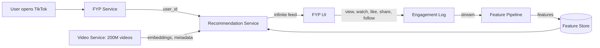
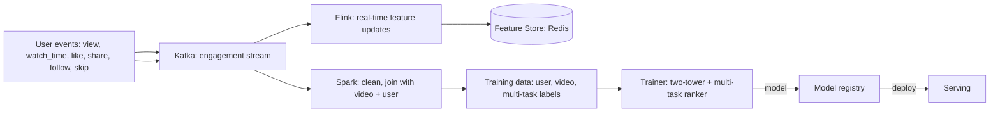
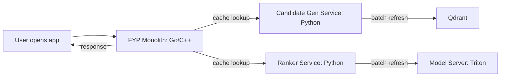
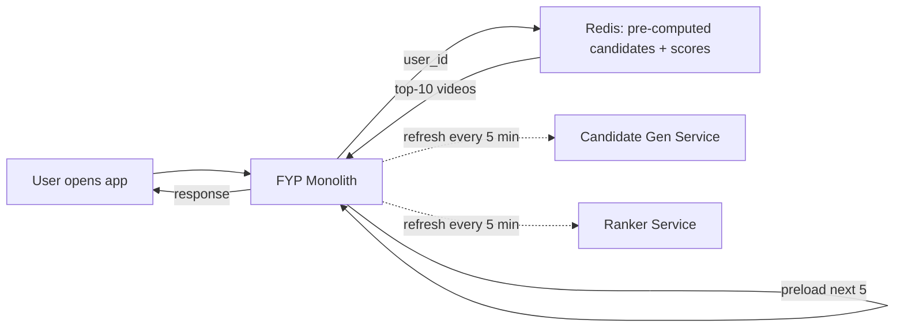

# 🎵 Problem 7 — TikTok For You Page

## 🎯 Learning Objectives

- Design a **short-form video recommendation system** that personalizes the For You Page (FYP) for 1B+ users with sub-second freshness
- Apply the **CLEAR framework** to a content recommendation problem where every interaction is a strong signal
- Master the **monolith + microservices** architecture pattern used by TikTok for low-latency serving at scale
- Discuss the **retention prediction** objective that makes TikTok's FYP the most addictive recommendation system ever built
- Calibrate the **latency budget** (200ms p95) for a system that must respond to user feedback in real time

---

## 1. Problem Statement

> Design TikTok's For You Page (FYP) recommendation system. When a user opens TikTok, they see an infinite feed of short-form videos, each ranked by predicted engagement. The system serves 1B MAU, recommends from 200M+ videos, and the FYP is the only feed (no in-network vs out-of-network distinction).

---

## 2. Clarifying Questions (5-7 minutes)

| Category | Question | Why it matters |
|----------|----------|----------------|
| **Scale** | How many DAU? How many videos? | QPS + catalog size |
| **Latency** | P95 latency for FYP render? | Determines architecture |
| **Quality** | What metric? Watch time? Retention? DAU? | The "TikTok metric" is retention |
| **Constraints** | Real-time signals (likes, shares, watch time)? | Affects feature pipeline |
| **Constraints** | Multi-region? Multi-language? | Affects catalog features |
| **Constraints** | Creator economy? | Affects exploration vs exploitation |
| **Constraints** | No login required for some features? | Affects cold start |

**Good answers:** "1B MAU, 200M+ videos, 200ms p95, retention (DAU/MAU ratio) is the primary metric, real-time signals within seconds, 150+ countries, creator-friendly policies."

---

## 3. Locate (3-4 minutes)



The boundary: **FYP Service owns the infinite feed, the candidate generation, the ranker, the feature pipeline, and the retraining loop**. It does not own the video storage, the streaming, or the social graph (follow).

---

## 4. Back-of-Envelope (3-4 minutes)

| Number | Value | Notes |
|--------|-------|-------|
| **QPS** | 1B MAU × 5 sessions/day × 1 page load/session = 60K QPS average, 200K peak | Higher than YouTube because short-form = more sessions |
| **Videos** | 200M × 256d × 4 bytes = 200GB embeddings | Qdrant 5-shard cluster |
| **Items per FYP** | 10 per swipe × 50 swipes/session = 500 items | User watches 500 videos/day on average |
| **Latency budget** | 200ms p95 = 4 stages × 50ms | Preload next video while user watches current |
| **Model size** | Two-tower: 100M params × 2 bytes = 200MB | Same as YouTube |

**Assumption:** 1B MAU, 50% use the app daily, 5 sessions/day, average session 5 minutes.

---

## 5. Architecture (20-25 minutes)

### 5.1 Data flow



The data feedback loop has **two paths**: a **real-time path** (Flink updates features in seconds) and a **batch path** (Spark retrains the model daily). The real-time path is what makes TikTok's FYP feel responsive: if you like 3 cooking videos in a row, the FYP shifts to cooking within 2-3 swipes.

### 5.2 The two-stage architecture

```mermaid
flowchart TB
    USER[User: watch history, engagement signals, embeddings] --> CG[Candidate gen: two-tower ANN + collaborative filtering]
    CG -->|top-200 videos| RANK[Multi-task ranker: retention prediction]
    RANK -->|P(watch), P(like), P(share), P(follow)| SCORES[Per-video scores]
    SCORES -->|diversity + business rules| FINAL[Top-10 videos]
    FINAL -->|preload next 5 videos| UI[FYP UI]
```

**Stage 1: Candidate generation (two-tower + collaborative filtering)**

- User tower: encodes watch history, engagement signals, demographic features.
- Video tower: encodes video content (visual features from a CNN, audio features, hashtags, captions).
- Hybrid: two-tower for content similarity + collaborative filtering (user-user and video-video similarity) blended together.
- Output: top-200 videos from 200M corpus.
- Latency: 20ms.

**Stage 2: Multi-task ranker (retention prediction)**

- The objective is **retention**: P(user returns to TikTok tomorrow | this video shown).
- Multi-task heads: P(watch), P(like), P(share), P(follow), P(skip).
- Final score: weighted combination optimized for **expected retention**.
- Latency: 50ms for 200 videos (batched).

### 5.3 The retention objective

```mermaid
flowchart TB
    RANK[Ranker output: P(watch), P(like), P(share), P(follow)] --> COMBINE[Combine: retention-weighted]
    COMBINE -->|expected retention| SCORE[Per-video expected retention]
    SCORE -->|rank| OUT[Top videos]
```

The key insight: **TikTok ranks by expected retention, not by watch time per video**. A video that is short but gets the user to swipe to the next video is valued more than a long video that the user watches to the end but does not swipe after. The retention signal is computed from historical cohort data: for users who saw this video, what fraction returned to the app the next day?

The training label is **a 0/1 flag for "user returned to TikTok within 24 hours of the session"**, joined with the videos shown in that session. The ranker learns to predict which video mix produces the highest retention.

### 5.4 The monolith + microservices pattern



The key architectural decision: **the FYP service is a single binary (monolith)** that handles the request, looks up cached results from the candidate gen and ranker services, and returns the response. The candidate gen and ranker are **separate services** that pre-compute their results into a cache (Redis), updated every 5 minutes.

The benefit: the hot path is a single binary, with no network calls between services. The latency is sub-50ms, even for the full pipeline. The tradeoff: the candidate gen and ranker cannot react in real time to user feedback (they run every 5 minutes), but the **real-time features** (likes, watch time) flow through the feature store and are used at serving time.

### 5.5 Serving topology



The hot path is **API → Redis → response**. The single point of failure is Redis — mitigated by per-region replicas and a fallback to the candidate gen service on cache miss.

---

## 6. ML Component Deep Dive

### 6.1 Real-time feature updates

The real-time feature pipeline updates the user embeddings and video features **within seconds of user feedback**. The pipeline is:

- User event (like, share) → Kafka → Flink → user embedding update (incremental gradient descent on the user tower) → Redis.

The user embedding is updated **on every event** for the active user, and the new embedding is used for the next FYP request. The result: if you like 3 cooking videos in a row, your user embedding shifts toward cooking within 3 swipes.

The cost of real-time updates: **high write rate to Redis** (1M events/sec). The mitigation is **sharded Redis** with a hot user cache.

### 6.2 The two-tower + collaborative filtering hybrid

The candidate generation combines two approaches:

- **Two-tower**: content-based, predicts similarity from user history to candidate videos.
- **Collaborative filtering**: behavior-based, predicts similarity from users similar to the target user (user-user CF) and videos similar to the user's history (video-video CF).

The blend: **0.5 × two-tower + 0.3 × user-user CF + 0.2 × video-video CF**. The weights are tuned by A/B testing on retention.

The benefit: the two-tower handles new videos (no engagement signal) via content features; the CF handles long-tail videos (low engagement signal) via similar-user behavior. The hybrid is more robust than either alone.

### 6.3 Cold start for new videos

New videos have **no engagement signal**, but they are uploaded with **hashtags, captions, and visual content** that can be used for the content-based embedding. The strategy:

- **First 24 hours**: show the new video to 1K random users (cold-start impressions).
- **24-72 hours**: if engagement is high, show to 10K more users (validation).
- **72+ hours**: if engagement is high, enter the normal candidate generation.

The cold-start impressions are **boosted in the candidate gen** (the new video appears in the top-200 with a 10x weight). The cost is 1% of FYP slots for the first 24 hours, the benefit is fast feedback on whether the video is engaging.

---

## 7. System Component Deep Dive

### 7.1 The monolith tradeoff

The FYP monolith is a **single Go/C++ binary** that handles 200K QPS with a 50ms p95. The monolith owns:

- Request parsing and routing.
- Cache lookup (Redis).
- Response formatting.
- Logging and metrics.

The monolith does **not** own the candidate gen or ranker models, which are separate services. The monolith is a thin layer over Redis: it reads the pre-computed top-10 videos and returns them. The latency is dominated by Redis lookup (~5ms) and response serialization (~10ms).

The benefit: **no inter-service network calls in the hot path**. The tradeoff: monoliths are harder to evolve; the candidate gen and ranker are separate services so they can be updated independently.

### 7.2 The pre-compute vs on-demand tradeoff

The candidate gen and ranker results are **pre-computed every 5 minutes** for the top 10M users (those active in the last 24 hours). The pre-compute is a batch job that runs every 5 minutes:

- For each active user, run the candidate gen (two-tower ANN) → top-200 videos.
- For each user × video, run the ranker → scores.
- Store the top-10 videos in Redis, keyed by user_id.

The pre-compute cost: 10M users × 200 videos = 2B ranker calls per 5-minute batch = **6.7M ranker calls/sec**. The ranker runs on a cluster of 100 GPUs.

The tradeoff: **pre-compute is faster at serving but cannot react in real time to user feedback**. The mitigation: the real-time features (likes, watch time) flow through the feature store and are used at serving time, so the FYP shifts within 2-3 swipes even with 5-minute pre-compute.

### 7.3 The exploration vs exploitation of new creators

TikTok's algorithm has a strong bias toward **giving new creators a chance**: even with no engagement signal, a new creator's video can surface in the FYP if the content is good. The strategy:

- **First 10 videos**: any new creator gets 1K impressions, distributed across user segments.
- **Top 10% engagement**: enter the trending pool, get 10K more impressions.
- **Top 1% engagement**: enter the global pool, get 100K impressions.

The result: **a new creator can go from 0 to 1M views in 48 hours** if their content is engaging. This is the viral loop that drives TikTok's creator economy.

---

## 8. Tradeoffs

| Decision | Choice A | Choice B | Pick |
|----------|----------|----------|------|
| **Candidate gen** | Two-tower | Two-tower + CF hybrid | B (more robust) |
| **Ranker** | GBDT | Multi-task neural | B (better quality) |
| **Objective** | Watch time | Retention | B (TikTok's choice) |
| **Cold start** | 1K impressions | 10K impressions | A (cost-controlled) |
| **Pre-compute** | 5 minutes | 1 hour | A (more responsive) |
| **Monolith** | Yes | Microservices | A (lower latency) |
| **Real-time features** | Yes | No | A (the magic sauce) |

---

## 9. Production Reality

### Case: TikTok's "For You" algorithm transparency

In 2021, TikTok published a blog post explaining the FYP algorithm. The post was notable for what it included: **a detailed explanation of the inputs (user interactions, video information, device/account settings), the weighting (stronger weights for signals that indicate engagement), and the diversity rules (avoid showing too many similar videos in a row)**.

The transparency was a PR response to regulatory pressure, but it also served as a recruitment tool: the post is a canonical reference for ML engineers, and the FYP algorithm is now the most studied recommendation system in the industry.

The key insight from the post: **the FYP is not just a recommendation system, it's a "content discovery system"**. The goal is not to recommend what the user has already seen, but to help the user discover new content they would not have found otherwise. The diversity rules and the new-creator boost are what make this work.

### Failure mode: the "filter bubble" for short-form content

Short-form video recommendation is **more susceptible to filter bubbles** than long-form: each video is 15-60 seconds, so the user consumes more videos per session, and the system has more chances to push the user down a single direction. The result: a user who watches 3 conspiracy videos in a row sees 10 more in the next 20 minutes.

The mitigation: **mandatory diversity** in the FYP — no more than 2 videos from the same creator in a row, no more than 3 videos from the same topic in a row, and a daily reset of the diversity budget. The result: the user still sees the content they enjoy, but with enough diversity to prevent the filter bubble from being too narrow.

---

## 📦 Compression Code

```python
# NOTE: 08 - Problem 7 - TikTok For You Page
# CLEAR: 5-7 questions, location diagram, 5 back-of-envelope numbers
# Architecture: monolith + microservices (FYP monolith, candidate gen, ranker)
# Models: two-tower (100M params, 256d) + multi-task ranker (5-layer MLP)
# Latency budget: 200ms p95, monolith serves cached results
# QPS: 200K peak, 60K average
# Catalog: 200M videos, Qdrant 5-shard cluster
# Objective: retention (DAU/MAU), not watch time per video
# Real-time features: Flink updates user embedding within seconds
# Pre-compute: 5-min batch for top 10M active users
# Cold start: 1K impressions for new videos, 10x boost in candidate gen
# Exploration: top 1% of new creators get 100K impressions (viral loop)
# Production case: 2021 algorithm transparency post
# Failure mode: filter bubble, mitigated by mandatory diversity

# Whiteboard diagram (compressed)
TIKTOK = {
    "monolith": "FYP Go/C++ binary, Redis cache lookup, 50ms p95",
    "candidate_gen": "Two-tower + CF hybrid, top-200, pre-computed every 5min",
    "ranker": "Multi-task MLP, retention objective, pre-computed every 5min",
    "real_time": "Flink updates user embedding on every event, Redis hot cache",
    "feedback_loop": "engagement -> Kafka -> Flink (real-time) + Spark (daily)",
}
```

## 🎯 Key Takeaways

- **Retention is the objective, not watch time per video** — the metric that drives long-term DAU
- **Monolith + microservices**: FYP monolith serves cached results from pre-computed candidate gen + ranker, no network calls in hot path
- **Real-time features** are the magic sauce: user embedding updates within seconds, FYP shifts within 2-3 swipes
- **Pre-compute every 5 minutes** for top 10M users, with real-time features for personalization
- **New creator boost** is the viral loop: 1K impressions for any new video, 10x in candidate gen

## References

- TikTok Newsroom, *How TikTok Recommends Videos #ForYou* (2021)
- *The TikTok Recommendation System: A Deep Dive* (multiple research papers, 2022-2024)
- *Monolith vs Microservices for Low-Latency Serving* (general ML serving literature)
- Alex Xu, *Machine Learning System Design Interview* — Chapter on feed ranking
- Flink documentation: https://flink.apache.org/
