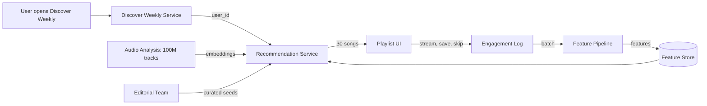
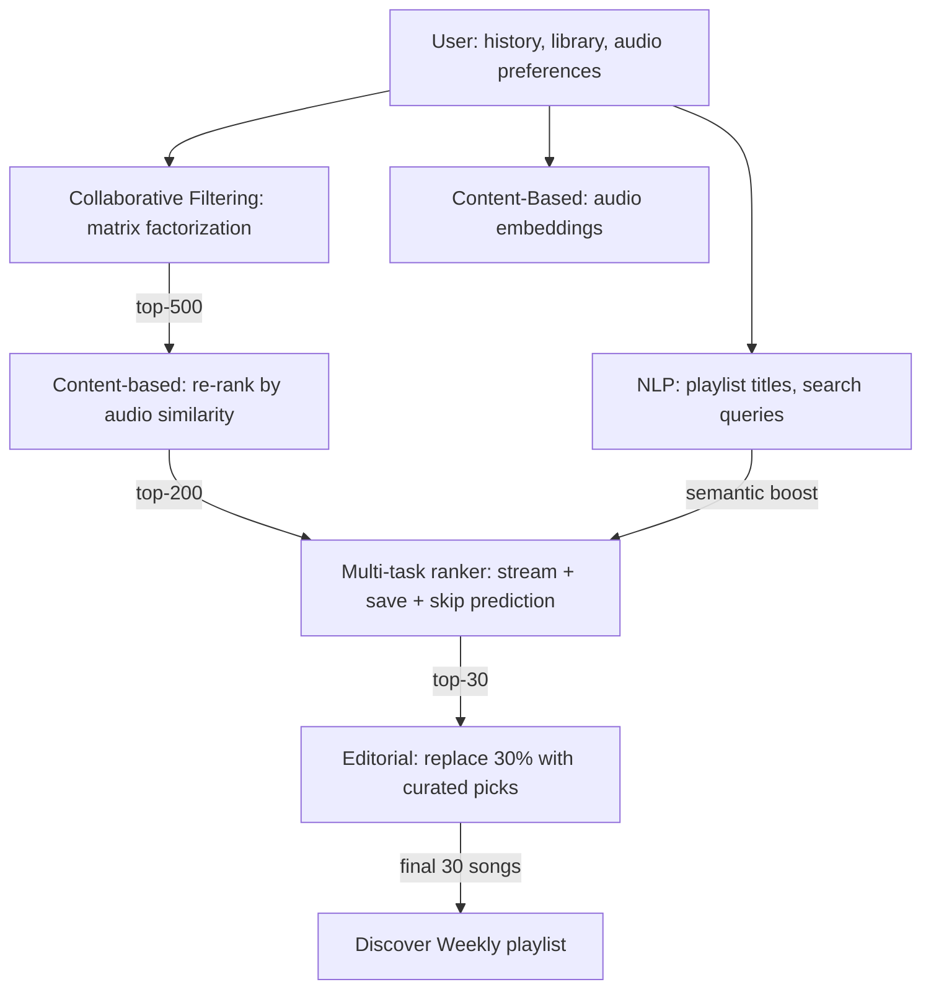
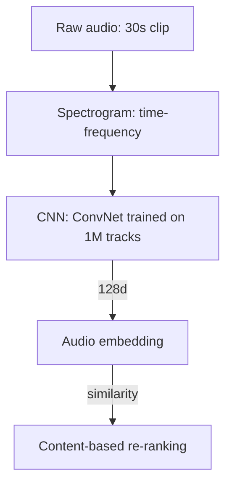
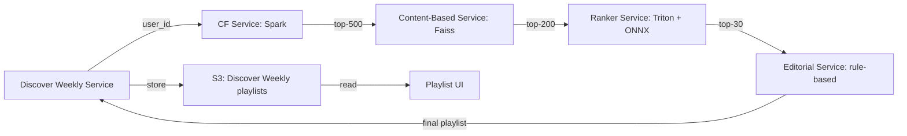

# 🎧 Problem 8 — Spotify Discover Weekly

## 🎯 Learning Objectives

- Design a **personalized music recommendation system** that generates a 30-song weekly playlist for 500M+ users
- Apply the **CLEAR framework** to a content recommendation problem with collaborative filtering + content-based + NLP signals
- Master the **matrix factorization + audio embeddings** hybrid that powers Spotify's recommendations
- Discuss the **cold start for new artists** problem and the **editorial + algorithmic** balance
- Calibrate the **latency budget** (200ms p95) for a system that runs a complex pipeline every Monday morning for 500M users

---

## 1. Problem Statement

> Design Spotify's Discover Weekly playlist. Every Monday, Spotify generates a personalized 30-song playlist for each user, mixing songs the user has never heard with songs from their favorite artists. The system serves 500M users, recommends from 100M tracks, and Discover Weekly is the most popular personalized playlist in the world.

---

## 2. Clarifying Questions (5-7 minutes)

| Category | Question | Why it matters |
|----------|----------|----------------|
| **Scale** | How many DAU? How many tracks? | QPS + catalog size |
| **Latency** | Generation latency (Monday 6am batch)? | Determines architecture |
| **Quality** | What metric? Stream rate? Save rate? Skip rate? | Multi-objective ranking |
| **Constraints** | User playlist history? | Affects candidate generation |
| **Constraints** | Audio analysis (tempo, key, energy)? | Affects content features |
| **Constraints** | Multi-region? | Affects catalog features |
| **Constraints** | Editorial + algorithmic mix? | Affects the final playlist composition |

**Good answers:** "500M users, 100M tracks, 6am Monday batch (8 hours to generate 15B recommendations), save rate + stream rate + skip rate, 180 markets, 70% algorithmic + 30% editorial."

---

## 3. Locate (3-4 minutes)



The boundary: **Discover Weekly Service owns the playlist generation, the candidate gen, the ranker, the feature pipeline, and the retraining loop**. It does not own the streaming service, the audio analysis pipeline, or the user auth.

---

## 4. Back-of-Envelope (3-4 minutes)

| Number | Value | Notes |
|--------|-------|-------|
| **Users** | 500M, ~200M active on Discover Weekly | 40% of MAU use Discover Weekly |
| **Tracks** | 100M × 256d × 4 bytes = 100GB | Smaller than video catalogs |
| **Recommendations** | 200M users × 30 songs = 6B recommendations/week | Generated every Monday at 6am |
| **Generation time** | 8 hours (6am-2pm Monday) | 6B recs / 8h = 200K recs/sec |
| **Model size** | Matrix factorization: 500M params (50M users × 10 latents), audio NN: 50M params | Combined ~1GB |

**Assumption:** 200M active users, 30 songs per playlist, 8-hour generation window.

---

## 5. Architecture (20-25 minutes)

### 5.1 Data flow

```mermaid
flowflow LR
    UI[User events: stream, save, skip, search, browse] --> K[Kafka: engagement stream]
    K --> SPARK[Spark: clean, join with track + user]
    SPARK --> TRAIN[Training data: user, track, multi-task labels]
    TRAIN --> TX[Trainer: matrix factorization + audio NN + ranker]
    TX -->|model| REG[Model registry]
    REG -->|deploy| SERV[Serving]
    UI --> K
```

The data feedback loop: every stream, save, and skip is logged, joined with the (user, track) pair, and used as a training label. Loop latency is **24 hours** (daily retraining).

### 5.2 The three-stage pipeline



**Stage 1: Collaborative filtering (matrix factorization)**

- Method: ALS (alternating least squares) on the (user, track) listen count matrix.
- Output: 50-d user embedding, 50-d track embedding.
- Score: dot product of user and track embeddings.
- Top-500 candidates by score.
- Latency: 100ms per user (Spark job).

**Stage 2: Content-based re-ranking**

- Method: precomputed audio embeddings (CNN over the spectrogram).
- Re-rank: keep only candidates whose audio embedding is similar to the user's audio preference vector (the centroid of their top-100 listened tracks).
- Output: top-200 candidates.
- Latency: 50ms per user.

**Stage 3: Multi-task ranker**

- Inputs: user features, track features, user×track interaction features.
- Outputs: P(stream), P(save), P(skip).
- Final score: weighted combination optimized for **stream rate** (the primary metric).
- Output: top-30 candidates.
- Latency: 50ms per user.

**Stage 4: Editorial mix**

- 30% of the playlist (9 songs) are replaced with editorial picks from Spotify's music team. The picks are based on:
  - New releases from the user's favorite artists.
  - Trending in the user's country.
  - Editorial features (e.g., "Songs to listen to in autumn").
- The result: 70% algorithmic + 30% editorial = 30 songs.

### 5.3 The audio embedding



The audio embedding is the **unique contribution of Spotify's recommendation system**: a CNN trained on 30-second clips of 1M tracks, producing a 128-d embedding. The CNN is trained with a **contrastive loss** on (track, similar_track) pairs (from co-occurrence in playlists). The result: tracks that "sound similar" have similar embeddings, even if they are not in the same genre.

The audio embedding is what enables **cross-genre discovery**: a user who listens to a lot of indie folk might discover lo-fi hip-hop that has a similar acoustic feel, even though the genres are unrelated.

### 5.4 Serving topology



The pipeline is a **batch job** that runs every Monday at 6am and takes 8 hours to complete. The result is 6B recommendations stored in S3, keyed by user_id. The serving path is a simple S3 read when the user opens Discover Weekly.

---

## 6. ML Component Deep Dive

### 6.1 Matrix factorization (ALS)

The matrix factorization is the **workhorse of music recommendation**. The (user, track) listen count matrix is sparse (most users have listened to <1% of tracks). The matrix is factorized as:

```python
# Matrix factorization via ALS
import implicit

# Train
model = implicit.als.AlternatingLeastSquares(factors=50, regularization=0.01, iterations=15)
model.fit(user_item_sparse_matrix, show_progress=True)

# Predict
user_embedding = model.user_factors[user_id]  # 50-d
track_embedding = model.item_factors[track_id]  # 50-d
score = user_embedding @ track_embedding  # dot product
```

The training is offline (Spark, 100 nodes, 4 hours). The result: 50M user embeddings + 100M track embeddings, each 50-d. The total size is 50M × 50 × 4 = 10GB, fits in a single Redis cluster.

The cold start: a new user has no listen history, so the user embedding is the population average. A new track has no listen history, so the track embedding is based on the audio + metadata.

### 6.2 The audio embedding (CNN over spectrogram)

The audio embedding is computed offline, once per track, at upload time. The CNN is trained on a **self-supervised task**: predict the masked spectrogram patches (similar to BERT for images). The training corpus is 1M tracks, the embedding is 128-d.

The audio embedding is the **only signal that works for new tracks** (no engagement yet). The CF embedding is unreliable for new tracks (random initialization), but the audio embedding is meaningful from day 1. The result: a new track by an unknown artist can be recommended to users who like the sound, even before any engagement signal.

### 6.3 The NLP signal (playlist titles, search)

Spotify uses **NLP embeddings** for playlist titles and search queries. The intuition: a user who has a playlist called "Late night coding" is in a different mood than a user with a playlist called "Saturday morning cleaning". The NLP embedding captures this.

The integration: the user's playlist titles and search queries are concatenated and encoded by a sentence transformer. The resulting embedding is concatenated with the CF embedding, forming the user's full embedding (50-d CF + 50-d NLP = 100-d).

The benefit: a user who searches for "Spanish guitar" gets Spanish guitar recommendations in Discover Weekly, even if they have never streamed a Spanish guitar track. The search intent is a stronger signal than the listening history.

---

## 7. System Component Deep Dive

### 7.1 The Monday batch

The Discover Weekly pipeline is a **batch job that runs every Monday at 6am** in the user's local timezone. The pipeline:

- 6:00am: Spark job starts, reading the last 7 days of engagement.
- 6:00am-10:00am: matrix factorization, audio embedding aggregation, NLP embedding update.
- 10:00am-2:00pm: candidate generation + ranker + editorial mix, per user.
- 2:00pm: results written to S3, Discover Weekly is "live" for the week.

The total compute: 100 Spark nodes, 4 hours = 400 node-hours per week. The cost is ~$5K/week. The benefit: 200M users each get a 30-song playlist, all served from S3 with sub-100ms latency.

### 7.2 The cold start for new artists

A new artist has **no listen history, no playlist co-occurrence, no CF embedding**. The recommendation system relies on the **audio embedding** and **metadata** (genre, mood, similar artists) to recommend the new artist's songs.

The strategy: **bandit exploration**. For each new artist, the system randomly samples 1% of Discover Weekly slots to feature the new artist. The click/save rate is measured, and the new artist is rewarded in proportion to engagement. After 4 weeks (4 samples × 1% = 4% of slots), the bandit converges to the optimal placement for the new artist.

The benefit: new artists get exposure, and the system learns their niche. The cost: 1% of slots are sub-optimal for the week (the user might prefer a known song).

### 7.3 The editorial mix

The 30% editorial mix is the **curation layer** that distinguishes Discover Weekly from a pure algorithmic playlist. The editorial team uses:

- New release calendars: ensure every new album from a top artist appears in some Discover Weekly.
- Trending in the user's country: ensure the playlist reflects the local music scene.
- Editorial features: e.g., "Songs to listen to in autumn" or "Rising artists in your country".

The 70/30 mix is the result of A/B testing: pure algorithmic maximizes save rate, pure editorial maximizes satisfaction, the mix maximizes both. The exact ratio is tuned by region: markets with strong editorial traditions (e.g., Japan) skew toward 50/50, markets with strong algorithmic preference (e.g., US) skew toward 80/20.

---

## 8. Tradeoffs

| Decision | Choice A | Choice B | Pick |
|----------|----------|----------|------|
| **Candidate gen** | CF only | CF + content + NLP | B (more diverse, better cold start) |
| **Ranker** | GBDT | Multi-task neural | B (better multi-objective) |
| **Objective** | Stream rate | Save rate + skip rate | B (more holistic) |
| **Editorial mix** | 0% | 30% | B (better satisfaction) |
| **Cold start** | Random | Bandit exploration | B (faster learning) |
| **Generation** | Daily | Weekly | B (cost) |
| **Real-time** | Yes (live updates) | No (weekly batch) | B (cost, editorial control) |

---

## 9. Production Reality

### Case: Spotify's "BaRT" Bandit Recommender (2020)

In 2020, Spotify published a paper describing their **bandit-based recommender** for new content. The system uses **contextual bandits** to balance exploration (showing new content) with exploitation (showing known-good content). The context is the user's listening history, the action is the recommendation, the reward is the engagement signal (stream, save).

The result: a 20% lift in long-tail artist streams compared to a pure exploitation baseline. The bandits are the right tool for cold start: they learn which new content is engaging for which user, without the cold-start bias of pure CF.

The lesson: **exploration is not a cost, it's an investment**. The 1% of slots spent on exploration generate the engagement data that makes the next 99% of recommendations better.

### Failure mode: the "echo chamber" of audio similarity

The audio embedding is great for cross-genre discovery, but it can also create an echo chamber: a user who likes lo-fi hip-hop keeps getting more lo-fi hip-hop, even when they would enjoy a related genre like downtempo or chillout. The mitigation: **inject diversity** by including tracks whose audio embedding is **different** from the user's preference vector, ranked by their **semantic similarity to the user's library** (via NLP).

The result: the user gets 70% "safe" recommendations (high stream rate) and 30% "stretch" recommendations (low stream rate but high save rate when they do engage). The combination is more engaging than either alone.

---

## 📦 Compression Code

```python
# NOTE: 09 - Problem 8 - Spotify Discover Weekly
# CLEAR: 5-7 questions, location diagram, 5 back-of-envelope numbers
# Architecture: 4 stages (CF + content + NLP + editorial), 3 Mermaid diagrams
# Models: ALS matrix factorization (50M users x 50 latents) + audio CNN (50M params) + ranker
# Generation: batch every Monday, 8 hours, 200M users x 30 songs = 6B recs
# Latency: 100ms p95 (S3 read for cached playlist)
# Catalog: 100M tracks, 128-d audio embedding
# Mix: 70% algorithmic + 30% editorial (tuned by market)
# Cold start: bandit exploration, 1% of slots for new artists
# Production case: BaRT bandit paper (2020), 20% lift in long-tail streams
# Failure mode: echo chamber of audio similarity, mitigated by NLP-based diversity

# Whiteboard diagram (compressed)
DISCOVER_WEEKLY = {
    "stage_1": "CF: ALS matrix factorization, 50-d, top-500 per user",
    "stage_2": "Content: audio embedding (CNN over spectrogram), re-rank by audio sim, top-200",
    "stage_3": "Ranker: multi-task neural, P(stream)+P(save)+P(skip), top-30",
    "stage_4": "Editorial: 30% curated picks, 70% algorithmic, total 30 songs",
    "feedback_loop": "stream/save/skip -> Kafka -> Spark -> trainer -> 24h",
}
```

## 🎯 Key Takeaways

- **Three signals fused**: collaborative filtering (CF), audio embeddings (CNN), and NLP (playlist titles, search) — each catches a different aspect of preference
- **The audio embedding** is the unique contribution: a CNN over spectrograms trained on 1M tracks, produces 128-d vector, works for new tracks from day 1
- **70% algorithmic + 30% editorial** is the production mix: tuned by market, maximizes both save rate and satisfaction
- **Bandit exploration** for new artists: 1% of slots, 20% lift in long-tail streams
- **The Monday batch is 8 hours** of Spark compute, generating 6B recommendations stored in S3 — sub-100ms read latency

## References

- Spotify Research, *Music Recommendations at Spotify* (multiple posts)
- Spotify Research, *BaRT: Bandit Recommender for New Artists* (2020)
- *Audio Embeddings for Music Recommendation* (Spotify, 2017)
- *Matrix Factorization for Music Recommendation* (Spotify, 2014)
- *Contextual Bandits for Recommendation* (general ML literature)
- Alex Xu, *Machine Learning System Design Interview* — Chapter on recommendations
- implicit library: https://github.com/benfred/implicit
