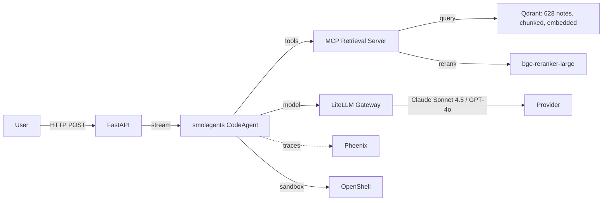
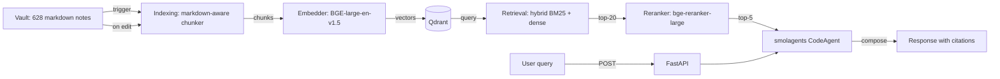
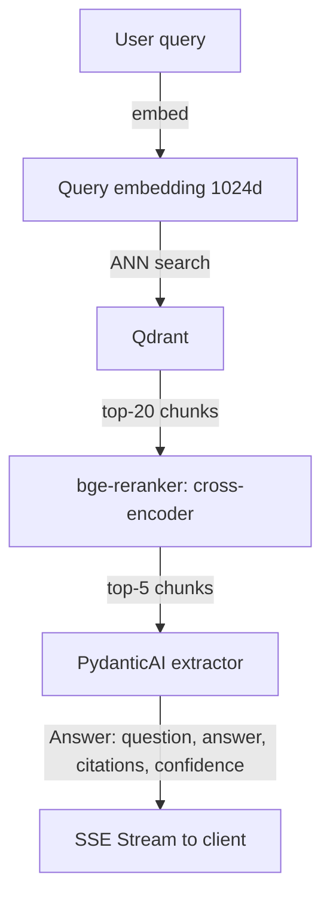
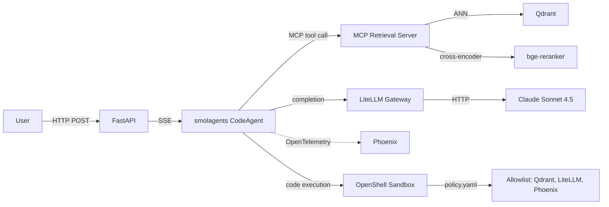

# 🏆 Capstone — Design Your Own ML System

## 🎯 Learning Objectives

- Apply the **CLEAR framework end-to-end** to a self-selected ML system design problem
- Produce a **whiteboard-ready design** with all 4 components: data flow, model architecture, serving topology, feedback loop
- Practice the **interview presentation**: 5 minutes for clarify, 3 for locate, 4 for estimate, 25 for architect, 7 for refine
- Self-grade using the **rubric from note 01** and identify the top 2-3 areas to improve
- Build a **portfolio of 9 designs** (8 canonical + 1 self-selected) that covers the spectrum of ML engineering interviews

---

## Introduction

The capstone is the **integration test for everything in the course**. You pick a system — your own portfolio, a real product, a research problem, a hypothetical — and design it from scratch using the CLEAR framework, the template from each problem note, and the production patterns from notes 02-09. The deliverable is a **whiteboard-ready design** that you can present in 45 minutes and self-grade against the CLEAR rubric.

The capstone is deliberately open-ended because the goal is not to add another canonical problem to your portfolio — you have 8 of those. The goal is to demonstrate that you can apply the framework to a **system you actually know**, which is the strongest signal in a real interview. The interviewer asks "design your own system" or "design a system from your past work" precisely to test this transfer: can you take the framework and apply it to a new domain?

For your **portfolio projects**, the strongest capstone is the **Second Brain RAG** from Plan C in the planning session: a RAG system over the 628+ notes of your Learning vault. The system uses multi-framework composition (smolagents + PydanticAI + MCP), LiteLLM model routing, Phoenix observability, and OpenShell security. Designing this system in an interview is the most powerful demonstration that you understand the production AI stack end-to-end.

---

## 1. The Capstone Format

The capstone is presented as a **45-minute mock interview** with one of the following:

1. **A peer** (engineer friend, study group, online mock interview platform).
2. **An AI interviewer** (a tool like LockedIn AI, PrepAI, or a custom GPT configured to grade ML system design).
3. **Self-recorded** (you record yourself, then self-grade using the CLEAR rubric).

The format is:

- **5 minutes**: present the problem statement (your chosen system).
- **40 minutes**: walk through CLEAR (5 + 3 + 4 + 25 + 7 minutes per step).
- **Self-grade** (5 minutes after): score yourself on the CLEAR rubric (note 01), identify top 3 areas to improve.

The pass criterion: **35+ out of 50** on the CLEAR rubric. The stretch goal: **40+** consistently across multiple runs.

---

## 2. Choosing Your System

The system you choose determines the depth of the design. There are 5 archetypes, each with a different interview signal:

| Archetype | Example | Signal |
|-----------|---------|--------|
| **Your portfolio project** | Second Brain RAG (Plan C), LLM Edge Gateway | "I built this; I can defend it" |
| **A real product you admire** | ChatGPT Search, Perplexity, Notion AI | "I understand the production stack" |
| **A research system you know** | AlphaFold, Segment Anything, Whisper | "I can translate research to production" |
| **A hypothetical at scale** | "Design Netflix for 10B users" | "I can extrapolate beyond current systems" |
| **A novel composition** | "Design a multi-agent RAG over my vault" | "I can compose novel architectures" |

For your **first capstone**, pick **your portfolio project** (Second Brain RAG is the best choice because you know it deeply and it spans the production stack). For your **second capstone**, pick a **real product you admire** (Perplexity or ChatGPT Search). For your **third capstone**, pick a **hypothetical at scale** (e.g., "design YouTube for 10B users in 100 languages").

---

## 3. The Reference Design: Second Brain RAG

The **canonical capstone** is the Second Brain RAG from Plan C. This is the system you would design in the interview:

### 3.1 Problem statement

> Design a RAG system that lets a user query their personal knowledge vault (628+ markdown notes) using natural language. The system must retrieve relevant passages, generate a response with citations, and stream the response in real time. The user is a single person, but the system should be production-ready (deployable as a Docker stack, observable, secure).

### 3.2 Clarifying questions (5 minutes)

| Question | Why it matters |
|----------|----------------|
| Single user or multi-user? | Affects auth, isolation, multi-tenancy |
| What's the latency budget? | Determines model + retrieval complexity |
| What's the metric? Answer relevance, citation accuracy, latency? | Multi-objective |
| Real-time updates to the vault? | Affects indexing pipeline |
| Multi-modal (images, code blocks)? | Affects chunking strategy |
| Security: are the notes sensitive? | Affects access control |
| Self-hosted or cloud? | Affects infra choices |

**Good answers:** "Single user (me), 5s p95 latency, answer relevance + citation accuracy, real-time updates (I edit notes daily), markdown only (no images), notes are public learning material, self-hosted on my machine, deployable to Fly.io for demos."

### 3.3 Locate (3 minutes)



The boundary: **the system owns the retrieval, the agent loop, the model routing, the observability, and the sandbox**. It does not own the vault itself (read-only) or the model provider (external).

### 3.4 Back-of-envelope (3 minutes)

| Number | Value |
|--------|-------|
| **QPS** | 1 (single user), 10 peak for demos |
| **Notes** | 628 × 20 chunks avg = 12,560 chunks |
| **Embeddings** | 12,560 × 1024-d × 4 bytes = 50MB (BGE-large-en-v1.5) |
| **Bandwidth** | 1 QPS × 5KB response = 5 KB/s |
| **Latency budget** | 5s p95 = 1s × 5 stages (parse, retrieve, rerank, generate, stream) |
| **Model size** | Claude Sonnet 4.5: 0 (API), bge-reranker: 2GB (local) |

### 3.5 Architecture (25 minutes)

The architecture has 3 stages, 3 Mermaid diagrams:

**Data flow**



**Model architecture**



**Serving topology**



The 3 diagrams are the core deliverable. The 25 minutes should be spent on drawing them, not on explaining them.

### 3.6 Refine (7 minutes)

The interviewer will push back on the following:

| Pushback | Good answer |
|----------|-------------|
| "What if Qdrant is down?" | "Cached embeddings on disk; fallback to a simpler BM25-only retrieval with quality degradation alert." |
| "What if the model is rate-limited?" | "LiteLLM Gateway has fallback chains; if Claude is rate-limited, automatic retry on GPT-4o." |
| "How do you avoid the agent exfiltrating data?" | "OpenShell sandbox with policy.yaml that allowlists only the retrieval, model, and observability endpoints." |
| "What about real-time updates to the vault?" | "Indexing pipeline triggered on file change; embeds the new chunk in <1s." |
| "How do you evaluate the system?" | "RAGAS on a 20-question dataset with ground truth; metrics: Recall@5, faithfulness, citation accuracy." |
| "What's the cost per query?" | "~$0.05 with Claude Sonnet 4.5 + 5K input + 2.5K output; semantic cache reduces to $0 for repeated queries." |

The 6 pushbacks are the standard set for any production RAG interview. Memorize them.

---

## 4. Self-Grading Worksheet

After every mock interview, fill out this worksheet:

```
CAPSTONE SELF-GRADE — Second Brain RAG

[ Clarify:   /10 ]  Did I ask 5-8 questions? Did I surface real ambiguity?
[ Locate:    /10 ]  Did I draw a clear context diagram with boundaries?
[ Estimate:  /10 ]  Did I compute QPS, storage, bandwidth, latency, model size?
[ Architect: /10 ]  Did I draw 3 diagrams? Did I close the feedback loop?
[ Refine:    /10 ]  Did I handle the 6 standard pushbacks confidently?

TOTAL:       /50

Top 3 areas to improve:
1. _____________
2. _____________
3. _____________
```

A score of 35+ is a strong hire signal. A score of 40+ is a stretch signal. A score below 30 means you need more practice on the framework itself.

---

## 5. The 9-Design Portfolio

By the end of this course, you have **9 designs** in your portfolio:

| # | System | Family | Interview signal |
|---|--------|--------|------------------|
| 1 | Airbnb Search | Search ranking | Marketplace ML |
| 2 | DoorDash Dispatch | Online assignment | Real-time ML |
| 3 | Twitter/X Timeline | Multi-objective feed | Engagement modeling |
| 4 | Uber ETA | Spatio-temporal prediction | Regression with GBDT |
| 5 | Netflix Recs | Two-tier recommendation | Content + row ML |
| 6 | YouTube Recs | Two-tower + multi-modal | Video + cold start |
| 7 | TikTok FYP | Retention + monolith | Short-form + real-time |
| 8 | Spotify Discover | CF + audio + editorial | Multi-signal fusion |
| 9 | Second Brain RAG (capstone) | Multi-framework RAG | Your own system |

The 9 designs cover the spectrum: search, dispatch, feed, prediction, recs (×4), and your own system. A real ML interview at any company will have a problem that maps to one of these 9, or to a combination. The portfolio is the proof that you can design any system, not just the canonical 8.

---

## 6. The Practice Schedule

To go from 25/50 to 40+/50 on the CLEAR rubric:

| Week | Activity | Time | Target |
|------|----------|------|--------|
| 1 | Re-read notes 00-01 (Welcome + CLEAR Framework) | 2h | Memorize the framework |
| 1 | Sketch each canonical design (notes 02-09) on paper, from memory | 4h | Recall 8 designs in <10 min each |
| 2 | Mock interview #1 (peer or AI) on Second Brain RAG | 1h | Self-grade 30+/50 |
| 2 | Identify top 3 areas to improve, re-read relevant notes | 2h | Targeted improvement |
| 3 | Mock interview #2 (different system: Perplexity or ChatGPT Search) | 1h | Self-grade 35+/50 |
| 3 | Re-read CLEAR framework, focus on the 6 standard pushbacks | 2h | Memorize pushbacks |
| 4 | Mock interview #3 (hypothetical: design a new system) | 1h | Self-grade 40+/50 |
| 4 | Final polish: practice the 5-minute presentation, draw diagrams on whiteboard | 2h | Ready for real interview |

Total: **15 hours over 4 weeks**. The investment is small relative to the interview outcome.

---

## 7. Common Failure Modes in the Capstone

| Failure mode | Symptom | Fix |
|--------------|---------|-----|
| Spending 30 minutes on Architect | Other steps get compressed | Use a watch; allocate time by step |
| Forgetting the feedback loop | Interviewer has to remind you | Always close the loop in Architect |
| No numbers | "We need a lot of storage" | Memorize: QPS, storage, bandwidth, latency, model size |
| One giant diagram | 30 boxes connected by 50 arrows | Three diagrams, 5-7 boxes each |
| Defensive in Refine | "It depends..." for every pushback | Name the tradeoff, pick a side, justify |
| No cold start | "All users have history" | Memorize: content-based encoder + boost |
| No online/offline | "We train on the same features" | Memorize: log features at serving time |
| Going deep too early | 20 min on the ranker, 0 on serving | Allocate time by section |

The failure modes are the same for all 9 designs. Memorize them once, apply to all.

---

## 8. The Interview Day Playbook

| Time | Action |
|------|--------|
| **24h before** | Re-read notes 00-01, sketch the 9 designs on paper from memory |
| **1h before** | Eat a light meal, review the 6 standard pushbacks (memorize them) |
| **5 min before** | Find a quiet room, set up whiteboard, take a deep breath |
| **Start of interview** | Read the problem statement carefully, take 30s to think |
| **First 5 min** | Ask 5-8 clarifying questions; do NOT draw yet |
| **Next 3 min** | Draw the Locate diagram, name boundaries |
| **Next 4 min** | Compute back-of-envelope numbers, write them on whiteboard |
| **Next 25 min** | Draw 3 diagrams (data flow, model, serving), close the feedback loop |
| **Next 7 min** | Handle the 6 standard pushbacks confidently |
| **Last 1 min** | Summarize the design, ask the interviewer for feedback |
| **After interview** | Self-grade on the CLEAR rubric, write down 3 areas to improve |

---

## 📦 Compression Code

```python
# NOTE: 10 - Capstone - Design Your Own ML System
# Pick a system, apply CLEAR end-to-end, self-grade 35+/50
# Reference design: Second Brain RAG (Plan C from planning session)
# 9-design portfolio: 8 canonical + 1 self-selected
# Practice schedule: 15h over 4 weeks
# Common failure modes: 8 patterns to avoid
# Interview day playbook: 5+3+4+25+7 minute rhythm

# Whiteboard layout for any CLEAR interview
WHITEBOARD = {
    "top_left": "Clarifying questions + answers (5 min)",
    "top_right": "Back-of-envelope numbers (3 min)",
    "center": "Three diagrams (data flow, model, serving) (25 min)",
    "bottom": "Tradeoffs + pushbacks (7 min)",
}

# The 6 standard pushbacks (memorize)
PUSHBACKS = [
    "What if the main service is down?",
    "What if the model is rate-limited?",
    "How do you avoid the ML system exfiltrating data?",
    "What about real-time updates to the data?",
    "How do you evaluate the system?",
    "What is the cost per query?",
]
```

## 🎯 Key Takeaways

- **Pick a system you know deeply** — your portfolio project is the strongest choice because you can defend every design decision
- **Apply CLEAR end-to-end** in 45 minutes: 5+3+4+25+7 minutes per step, with a watch
- **Self-grade 35+/50** on the CLEAR rubric, identify top 3 areas to improve
- **Memorize the 6 standard pushbacks** — they apply to every production ML system
- **Practice 15 hours over 4 weeks** — the 9-design portfolio is the proof you can design any system, not just the canonical 8

## References

- CLEAR framework: [[01 - The CLEAR Framework - 5-Step Method|The CLEAR Framework]]
- Canonical problems: [[02 - Problem 1 - Airbnb Search Ranking|Airbnb]] | [[03 - Problem 2 - DoorDash Dispatch|DoorDash]] | [[04 - Problem 3 - Twitter-X Timeline|Twitter]] | [[05 - Problem 4 - Uber ETA Prediction|Uber]] | [[06 - Problem 5 - Netflix Recommendations|Netflix]] | [[07 - Problem 6 - YouTube Recommendations|YouTube]] | [[08 - Problem 7 - TikTok For You Page|TikTok]] | [[09 - Problem 8 - Spotify Discover Weekly|Spotify]]
- Related course: [[../32 - System Design for ML/00 - Welcome to System Design for ML|System Design for ML]]
- Plan C reference: Second Brain RAG (from Continuity Prompt planning session)
- Mock interview platforms: Pramp, interviewing.io, LockedIn AI
