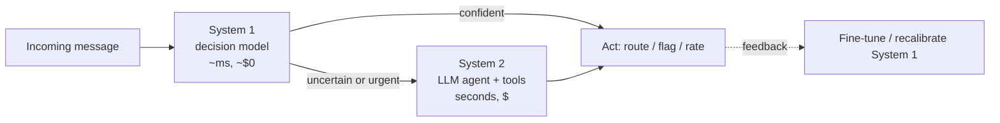

# 🎯 Welcome — Decision Models: System One AI

Most of what software asks a language model to do is not writing. It is deciding: *Is this ticket about billing or security? Is this message urgent? Does this answer need a human?* Using a text generator for those decisions means paying for tokens you throw away, parsing JSON that may not parse, and trusting a "confidence: 0.9" the model invented. In September 2026, **decision models** — also called **System One models** — went mainstream: models that take a state and a set of typed questions and return **calibrated probabilities in a single forward pass**, without generating a word.

## 🎯 Learning Objectives
- Explain what a decision model is and how it differs from a classifier and from an LLM
- Understand the mechanics: **non-autoregressive option scoring**, typed questions (`noul`, `choice`, `score`), and **calibration**
- Compare **Jev** (TypeSafe, hosted) with the open landscape: **Laya, Kev, Von, Clef, NanoJev**, and DIY approaches
- Use **Laya** in practice: API, fine-tuning, calibration, ONNX/CPU inference — and its documented failure modes
- Build a **DIY decision head** on a small open LLM to understand the internals
- Design **System 1 / System 2** routing: decision model first, LLM agent only when needed

## Introduction

The name comes from Daniel Kahneman's two systems of thought: **System 1** is fast, automatic, and cheap; **System 2** is slow, deliberate, and expensive. Applied to AI systems, the idea is that most decisions in a product are System 1 work — routing, triage, flagging, rating — and deserve a fast, cheap, calibrated component, while the rare hard cases are escalated to a System 2 agent built on a full LLM.

TypeSafe AI's **Jev** (limited early access from 15 September 2026) gave the category its API shape: a `state` (text or JSON), a dictionary of typed `questions`, and an `answers` object with probability distributions — no text out. Within weeks, open alternatives appeared: **Laya** (ModernBERT-based encoders, Apache-2.0), **Kev** (Qwen-based, Jev-compatible API), and others. This course explains how they work, compares them with evidence, and puts one of them — Laya — into the **P2 Smart Request Router** project.

The course also sits between two worlds the vault already covers: classical classification and evaluation ([[../../08 - NLP Avanzado/16 - NLP con Transformers/00 - Bienvenida|NLP con Transformers]]) and LLM agents ([[../../07 - AI Agents y Agentic Systems/18 - LangGraph Deep Patterns/00 - Welcome to LangGraph Deep Patterns|LangGraph Deep Patterns]]). Decision models are the missing middle layer.

---

## Course Map

| #  | Note                                          | Core question                                                                    |
|----|-----------------------------------------------|----------------------------------------------------------------------------------|
| 01 | How Decision Models Work                      | What happens in one forward pass, and why are the probabilities trustworthy?     |
| 02 | Jev and the Landscape                         | Which decision models exist, how do they compare, and which can I run locally?   |
| 03 | Laya in Practice                              | How do I use, fine-tune, calibrate, and serve Laya on a CPU — and where does it fail? |
| 04 | DIY - Classification Head on a Small Qwen     | How do I build a decision model myself from an open LLM?                         |
| 05 | System 1 - System 2 Routing Patterns          | How do I combine a decision model with an LLM agent for cost, latency, and quality? |

## Prerequisites
- Transformers basics: encoders, decoders, heads ([[../16 - HuggingFace Transformers Deep Dive/00 - Welcome to HuggingFace Transformers Deep Dive|HuggingFace Transformers Deep Dive]])
- Classification metrics and calibration intuition (precision/recall, probabilities)
- Structured outputs from LLMs ([[../22 - Instructor and Structured Generation/00 - Welcome - The Structured Output Crisis|Instructor and Structured Generation]])

⚠️ **Freshness warning:** this ecosystem is weeks old (September–October 2026). Model names, checkpoints, benchmarks, and prices change quickly, and most published numbers are **vendor-reported**. Every figure in this course cites its source and should be re-verified before you rely on it.

## References
- TypeSafe AI — Jev documentation and API (`POST /v1/systemone`)
- Simon Willison, *Jev introduces a new shape of LLM — System One, aka Decision Models* (2026-09-21)
- Laya — `convaiinnovations/laya` (Hugging Face), `pip install laya`, Apache-2.0
- Daniel Kahneman, *Thinking, Fast and Slow* (2011)
