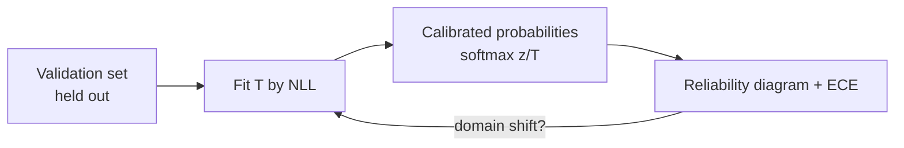

# ⚙️ 01 - How Decision Models Work

Ask an LLM "Is this ticket urgent? Answer yes or no and give your confidence" and you get text: maybe `{"urgent": true, "confidence": 0.95}`, maybe a paragraph, occasionally invalid JSON — and the 0.95 is a number the model *wrote*, not a probability anyone measured. A decision model answers the same question by **scoring the options directly** in one forward pass and returning a probability distribution trained to be **calibrated**: when it says 0.9, it is right about 90% of the time. That difference — scored, not generated — is the whole idea.

## 🎯 Learning Objectives
- Explain why generating text is a poor interface for decisions (cost, parsing, uncalibrated verbal confidence)
- Describe the three architectural families: **option-scoring encoders**, **decoders with a replaced head**, and **logit readers** over frozen LLMs
- Understand typed questions — **`noul`** (yes/no), **`choice`**, **`score`** — and how each maps to a distribution
- Quantify the latency/cost advantage of **one forward pass** vs autoregressive decoding
- Define and compute **calibration**: reliability, **ECE**, Brier score, proper scoring rules
- Apply **temperature scaling** and understand training-time calibration (e.g., **RLCD**)

## Introduction

A decision is a function from a **state** (a ticket, a transaction, a document) to a **distribution over a closed set of answers**. Classic classifiers implement exactly that, but with a fixed label set baked into the output layer: a new question means a new model. LLMs can answer any question you phrase, but through an open-ended text interface built for writing. Decision models combine the two: like an LLM, they accept **questions and options as input** (so one model answers many different questions), and like a classifier, they **score** those options and return probabilities.

The API popularized by TypeSafe's Jev — and copied by open alternatives — makes this explicit. A request contains a `state` and a dictionary of `questions`, each with a `type` (`noul`, `choice`, or `score`), `instructions`, and `criteria` (the options or levels with descriptions). The response contains, per question, a probability distribution plus derived fields (the chosen option, an expected score, a confidence). There is no text to parse and no way for the output to violate its schema.

This note explains the machinery behind that interface, with the math you need to judge whether a decision model's probabilities can be trusted — the property everything in [[05 - System 1 - System 2 Routing Patterns|System 1 / System 2 routing]] depends on.

---

## 1. The Problem and Why This Solution Exists

### Three ways LLM-as-classifier hurts

1. **Cost and latency.** A decision needs a few bits of information, but generation produces tokens sequentially. Even a one-word answer pays the prefill plus several decode steps; JSON with reasoning pays dozens or hundreds.
2. **Parsing and schema failures.** Free text and even "JSON mode" outputs can be malformed, contain extra prose, or invent labels outside the allowed set. Constrained decoding helps but remains sequential.
3. **Verbalized confidence is not a probability.** Models asked to state their confidence tend to report high numbers regardless of correctness; research on eliciting confidence from LLMs (e.g., Tian et al., *Just Ask for Calibration*, 2023) shows verbalized and token-probability confidences can be informative but are often **miscalibrated** without explicit correction.

### What a decision needs

| Requirement | Generated text | Decision model |
|---|---|---|
| Closed answer set | Must be enforced after the fact | By construction (options are inputs) |
| Probabilities | Verbal or token-level, uncalibrated | Native distribution, trained/fitted for calibration |
| Many questions about one state | Many calls or a long prompt | Evaluated in parallel against the same state |
| Latency | Prefill + decode | Single forward pass |

---

## 2. Conceptual Deep Dive

### 2.1 Typed questions

| Type | Answer | Distribution | Derived fields |
|---|---|---|---|
| **`noul`** (Bernoulli) | Yes/no statement | $p = P(\text{true})$ | — |
| **`choice`** | One of $K$ options | $\mathbf{p} \in \Delta^{K-1}$ | `choice = argmax`, `confidence` |
| **`score`** | Level on an ordered scale $0..L$ | $\mathbf{p}$ over levels | $\text{score} = \sum_{k} k\,p_k$, `confidence` |

For `score`, the expected value preserves uncertainty: probabilities $\{0: 0.0, 1: 0.57, 2: 0.43\}$ give $0 \cdot 0 + 1 \cdot 0.57 + 2 \cdot 0.43 = 1.43$ — "between 1 and 2, leaning 1" — instead of collapsing to a single label.

A common **confidence** definition derives from the distribution's shape, e.g., one minus normalized entropy:

$$
\text{conf}(\mathbf{p}) = 1 - \frac{H(\mathbf{p})}{\log K},
\qquad H(\mathbf{p}) = -\sum_k p_k \log p_k
$$

1 when one option has all the mass, 0 when the distribution is uniform.

### 2.2 Architecture families

**(a) Option-scoring encoders (Laya, Von).** A bidirectional encoder (ModernBERT, mmBERT) reads a sequence that concatenates the state, the question, and the options, each option preceded by a marker token. The hidden state at each marker is projected to a scalar logit; a softmax over the option logits gives the `choice` distribution. Because the encoder attends bidirectionally, each option's representation "sees" the state and the question — it is a **cross-encoder** over options:

$$
z_k = \mathbf{w}^\top \mathbf{h}_{[\text{OPT}_k]} + b,
\qquad
p_k = \frac{e^{z_k / T}}{\sum_j e^{z_j / T}}
$$

Trade-off: all options share the sequence's token budget. Laya's documentation notes a fixed budget of a few hundred tokens for options, so a 77-option question leaves only ~3–4 tokens per option — and accuracy collapses on high-cardinality tasks (see [[03 - Laya in Practice|Laya in Practice]]).

**(b) Decoder backbones with a replaced head (Kev, DIY).** A pretrained decoder LLM (e.g., a small Qwen) keeps its transformer "backbone" but its language-modeling head — which maps the last hidden state to a vocabulary of ~150k tokens — is replaced by a small head mapping to the option logits. One forward pass over the prompt yields the final hidden state; the head scores the options. [[04 - DIY - Classification Head on a Small Qwen|Note 04]] builds one.

**(c) Logit readers over frozen LLMs.** Without training anything, prompt a frozen LLM with the question and options and read the **next-token log-probabilities** of each option's first token (or of the full option strings), then renormalize over the allowed options:

$$
p_k \propto P_\theta(\text{option}_k \mid \text{state}, \text{question})
$$

This is cheap to build and works surprisingly well, but probabilities are typically **not calibrated** and are sensitive to option wording and tokenization; projects in this family (e.g., SemIf, mini-jev) explicitly disclaim calibration.

### 2.3 Why one pass is so much cheaper

For an autoregressive model producing $n_{out}$ tokens from an $n_{in}$-token prompt:

$$
L_{\text{LLM}} \approx T_{\text{prefill}}(n_{in}) + n_{out} \cdot T_{\text{decode}}
\qquad
L_{\text{decision}} \approx T_{\text{prefill}}(n_{in})
$$

Decode steps are memory-bandwidth-bound and sequential; a JSON answer with a short rationale ($n_{out} \approx 60$) at 20 ms/token adds over a second. A decision model's cost is one prefill-like forward pass — and **multiple questions about the same state** can be evaluated as a batch (encoders) or with a shared prefix (decoders), so asking four questions costs far less than four calls.

### 2.4 Calibration: what "trustworthy probabilities" means

A model is **perfectly calibrated** if, among all predictions made with confidence $p$, the fraction that is correct equals $p$:

$$
P\big(\hat{Y} = Y \;\big|\; \hat{P} = p\big) = p \quad \forall p \in [0, 1]
$$

**Expected Calibration Error (ECE)** estimates the deviation by binning predictions by confidence into $M$ bins $B_m$:

$$
\text{ECE} = \sum_{m=1}^{M} \frac{|B_m|}{n}\,\big|\,\text{acc}(B_m) - \text{conf}(B_m)\,\big|
$$

The **Brier score** $\frac{1}{n}\sum_i \sum_k (p_{ik} - y_{ik})^2$ and **log loss** are *proper scoring rules*: their expected value is minimized only when the predicted distribution equals the true one. That is why training (or reinforcement learning) against proper scoring rules pushes a model toward calibration. TypeSafe describes Jev's training as **Reinforcement Learning for Calibrated Decisions (RLCD)**; Laya's fine-tuning recipe uses a GRPO-style policy gradient against strictly proper scoring rules plus temperature calibration.

### 2.5 Temperature scaling

Modern neural networks are usually **overconfident** (Guo et al., *On Calibration of Modern Neural Networks*, ICML 2017). The simplest effective fix is to divide logits by a scalar $T > 0$ fitted on a held-out validation set by minimizing negative log-likelihood:

$$
T^* = \arg\min_{T} \; -\sum_{i \in \text{val}} \log \operatorname{softmax}\!\big(\mathbf{z}_i / T\big)_{y_i}
$$

$T > 1$ softens overconfident distributions; accuracy is unchanged (the argmax doesn't move), only the probabilities. Vendor numbers for Laya illustrate the size of the effect: ECE 0.466 → 0.081 after temperature fitting (English checkpoint), 0.314 → 0.106 (multilingual).



⚠️ **Warning:** calibration is **per distribution**. A model calibrated on English support tickets is not calibrated on Spanish messages or on a new product line. Refit $T$ (and re-measure ECE) per domain and per language — the Laya multilingual checkpoint ships **uncalibrated** for exactly this reason.

---

## 3. Production Reality

### Where decision models break

Published documentation for Jev and community testing of the open models converge on the same failure modes:

| Failure mode | Why | Mitigation |
|---|---|---|
| Arithmetic, counting, dates | No step-by-step computation in one pass | Compute numbers in code; pass them as state |
| Many options (> ~20) | Option-token budget; diluted representations | Hierarchical questions (team → sub-intent), or a classic fine-tuned classifier |
| Long, mostly irrelevant state | Signal diluted in context | Trim/structure the state |
| Double negatives, multi-hop indirection | Single-pass reasoning limits | Escalate to System 2 |
| Out-of-distribution inputs (languages, scripts) | Confident but wrong — "fails silently and confidently" | Language detection + routing; OOD detection; calibration per domain |
| Extraction without candidates | Can only score provided options | Use an extractor (e.g., GLiNER) or an LLM |

### Thresholds come from calibration

Calibration is what makes **thresholds meaningful**: if 0.9 means "right 90% of the time", you can choose "act automatically above 0.9, ask for confirmation between 0.5 and 0.9, route to a human below 0.5" and predict the error rates of each band. Without calibration, the same thresholds are guesses. P2 picks its thresholds from a **risk–coverage curve** on validation data.

Caso real: TypeSafe's own guidance for Jev suggests confidence bands of this kind — act automatically on high confidence, confirm in the middle, route to a human when low — which is only sound because the model is trained for calibration. The same pattern applied to an uncalibrated LLM's verbal confidence routinely sends wrong answers down the "automatic" path.

Caso real: in P2, a message like "no me robaron la tarjeta, solo la perdí" combines a negation with an urgent-sounding keyword. The decision model's `urgency` distribution comes out split, its confidence low, and the policy escalates to the System 2 agent — the failure mode becomes a routing signal instead of a silent error.

---

## 4. Code in Practice

### A decision request (Jev-compatible shape)

```json
{
  "model": "laya-multilingual",
  "state": { "channel": "chat", "text": "me cobraron dos veces la suscripción de octubre" },
  "questions": {
    "route":   { "type": "choice", "instructions": "Which team should handle this message?",
                 "criteria": { "disputes": "duplicate or wrong charges, refunds",
                               "cards": "card blocked, lost, activation",
                               "transfers": "transfer delays, limits, fees",
                               "security": "fraud, stolen card, account takeover",
                               "general": "anything else" } },
    "urgency": { "type": "score", "instructions": "How urgent is this for the customer?",
                 "criteria": { "0": "informational", "1": "normal", "2": "high", "3": "critical" } },
    "needs_human": { "type": "noul", "instructions": "A human must act to resolve this." }
  }
}
```

### ❌/✅ Getting a decision

```python
# ❌ Generate, parse, and trust a made-up number
reply = llm.chat("Classify this ticket and give confidence as JSON: ...")
label, conf = json.loads(reply)["label"], json.loads(reply)["confidence"]   # may not parse; conf is verbal

# ✅ Score the options; read a calibrated distribution
answers = decider.predict(state, questions)["answers"]
route = answers["route"]["choice"]; p_route = answers["route"]["probabilities"][route]
```

### 📦 Compression code: confidence, expected score, ECE, and temperature scaling

```python
# 📦 Compression code: the math that makes decision-model probabilities usable
# Covers: entropy-based confidence, expected score, ECE, fitting temperature on validation data
import math
import random

def softmax(z, T=1.0):
    m = max(v / T for v in z)
    e = [math.exp(v / T - m) for v in z]
    s = sum(e)
    return [x / s for x in e]

def confidence(p):
    H = -sum(x * math.log(x) for x in p if x > 0)
    return 1 - H / math.log(len(p))

print("expected score:", sum(k * p for k, p in enumerate([0.0, 0.57, 0.43])))     # 1.43
print(f"confidence peaked={confidence([0.97, 0.01, 0.01, 0.01]):.2f} flat={confidence([0.25]*4):.2f}")

random.seed(3)
def make(n):                                     # overconfident model: logits scaled ×3 beyond the truth
    data = []
    for _ in range(n):
        true_logits = [random.gauss(0, 1.2) for _ in range(4)]
        y = random.choices(range(4), weights=softmax(true_logits))[0]
        data.append(([3 * v for v in true_logits], y))
    return data

val, test = make(4000), make(4000)

def ece(data, T, bins=10):
    buckets = [[] for _ in range(bins)]
    for z, y in data:
        p = softmax(z, T)
        k = max(range(4), key=p.__getitem__)
        buckets[min(int(p[k] * bins), bins - 1)].append((p[k], k == y))
    return sum(len(b) / len(data) * abs(sum(c for _, c in b) / len(b) - sum(q for q, _ in b) / len(b))
               for b in buckets if b)

nll = lambda data, T: -sum(math.log(softmax(z, T)[y] + 1e-12) for z, y in data)
T_star = min((t / 10 for t in range(5, 61)), key=lambda T: nll(val, T))
print(f"T* = {T_star:.1f} | test ECE before = {ece(test, 1.0):.3f} → after = {ece(test, T_star):.3f}")
# ¡Sorpresa! Accuracy is identical before and after (argmax unchanged) — only the honesty of the probabilities improves.
```

---

## 🎯 Key Takeaways
- Decision models **score options** in one forward pass and return distributions — no generation, no parsing, schema-safe by construction.
- Typed questions: **`noul`** (P(true)), **`choice`** (distribution over options), **`score`** (distribution over levels; expected value preserves uncertainty).
- Three families: **option-scoring encoders**, **decoders with a replaced head**, **logit readers** over frozen LLMs (cheap, usually uncalibrated).
- One pass avoids sequential decode: latency ≈ prefill only, and many questions about one state share the work.
- **Calibration** (low ECE) is what makes confidence thresholds meaningful; proper scoring rules and **temperature scaling** get you there.
- Calibration is **per domain/language**; known failure modes include arithmetic, many options, OOD inputs, and negations — route those to System 2.

## References
- Guo, Pleiss, Sun & Weinberger, *On Calibration of Modern Neural Networks* (ICML 2017)
- Naeini, Cooper & Hauskrecht, *Obtaining Well Calibrated Probabilities Using Bayesian Binning* (AAAI 2015) — ECE
- Gneiting & Raftery, *Strictly Proper Scoring Rules, Prediction, and Estimation* (JASA 2007)
- Tian et al., *Just Ask for Calibration* (EMNLP 2023)
- TypeSafe AI — Jev API documentation; flaviocopes.com, *A deep dive into Jev* (2026)
- Laya model card and documentation (Convai Innovations, 2026)
- [[00 - Welcome to Decision Models|Course welcome]] · [[02 - Jev and the Landscape|Next: Jev and the Landscape]]
