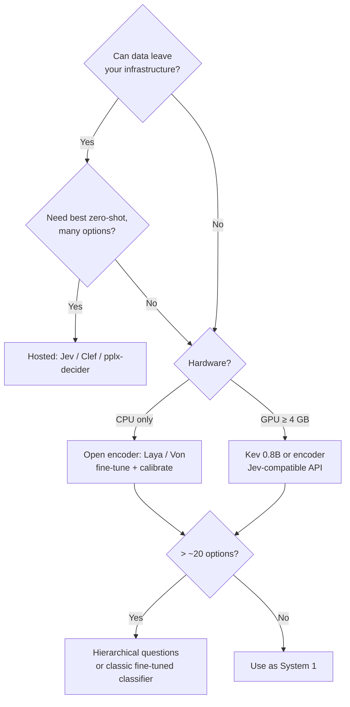

# 🗺️ 02 - Jev and the Landscape

Within a month of Jev's early-access launch, there were more than twenty "Jev alternatives": open encoders, Qwen-based reproductions, logit readers over frozen LLMs, hosted competitors from Cloudflare, Perplexity, and Upstage, and libraries that make any LLM return typed answers. They are not interchangeable — they differ in **architecture, calibration, hardware, license, and API compatibility** — and almost every number about them is vendor-reported. This note maps the landscape so you can choose with your eyes open, and explains why P2 uses Laya.

## 🎯 Learning Objectives
- Describe **Jev**'s API, guarantees, limits, and pricing as published by TypeSafe
- Classify alternatives into **families**: open encoders, decoder reproductions, logit readers, hosted services, libraries
- Compare them on **calibration, latency, hardware, license, and Jev-API compatibility**
- Identify which options run on an **8 GB RAM / 4 GB VRAM** laptop
- Read vendor benchmarks critically: what they measure, what they omit
- Choose a decision model for a project with an explicit, constraint-driven procedure

## Introduction

Jev defined the category's interface: `POST /v1/systemone` with a `state` and typed `questions`, returning calibrated `answers`. That interface turned out to be the most influential part of the launch. Because it is simple and documented, open projects copied it — Laya ships `laya-serve` exposing the same endpoint, Kev and Clef accept the same request format — which means a router built against the interface can swap the engine behind it: a local open model in development, a hosted one in production, or the reverse.

The landscape below is a snapshot from early October 2026, assembled from TypeSafe's documentation, project READMEs and model cards, community write-ups, and the comparison maintained at systemonemodels.org. Treat every figure as a **claim to verify**, and prefer projects that publish their evaluation harness so you can rerun it.

---

## 1. The Problem and Why This Solution Exists

### Why so many alternatives so fast

Jev is **hosted-only** — no weights, no self-hosting — and in limited early access. Teams with data-residency requirements, offline environments, cost sensitivity, or simply no invitation needed something they could run. The architectural ideas were well known (cross-encoders over options, classification heads on LLM backbones, reading option log-probabilities), so reproductions were quick. What remained hard was the part Jev emphasized: **calibration** and **typed-decision training data**.

### Jev in brief (as published)

| Aspect | Published detail |
|---|---|
| Interface | `POST https://api.typesafe.ai/v1/systemone`; `state` (string, array, or object) + `questions` |
| Question types | `noul` (yes/no probability), `choice` (≤ 255 options), `score` (2–10 levels) |
| Execution | Questions evaluated in parallel against the same state; non-autoregressive |
| Latency | ~70–500 ms end to end, most calls around 100 ms (vendor) |
| Limits | 64k tokens shared across state + questions; ~32k for state + longest question; text only |
| Training | RLCD — Reinforcement Learning for Calibrated Decisions |
| Price | $0.042 per million input tokens; output free (~$1.26 per 100k 300-token tickets) |
| Guarantee | Answers always match the question's type and schema |
| Known weaknesses | Arithmetic/dates, multi-hop and double negatives, large irrelevant state, no free-form extraction |
| SDKs | Python, JavaScript, Vercel AI SDK integration |

LiteLLM's routing benchmark reported a median classifier latency of ~127 ms for Jev vs ~688 ms for Claude Haiku on its request-routing task — useful context for the "decision model vs small LLM" comparison, measured by a third party on one workload.

---

## 2. Conceptual Deep Dive

### 2.1 The families

| Family | Mechanism | Examples | Calibration | Typical hardware |
|---|---|---|---|---|
| **Hosted decision APIs** | Proprietary models behind the Jev-style API | Jev (TypeSafe), Solar Decide (Upstage, beta), pplx-decider (Perplexity), Clef (Cloudflare Workers AI), Span-01 (Respan), d1 (Liquid AI) | Trained for it (claims vary) | None (API) |
| **Open option-scoring encoders** | ModernBERT/mmBERT cross-encoders over options | **Laya** (421M / 322M), **Von** (395M), OpenDecision (~400M, NLI zero-shot) | Laya: temperature-fitted; Von: reported; OpenDecision: disclaimed | CPU possible; GPU ~tens of ms |
| **Decoder reproductions** | LLM backbone + replaced/trained head | **Kev** (Qwen3.5 0.8B/4B/9B), Decider (2B), NanoJev (0.6B), Tev1 (LoRA on 4B) | Varies; often trained against the Jev API format | GPU for ≥ 2B |
| **Logit readers** | Frozen LLM; read option log-probs | SemIf/openjev (4B), mini-jev (4B), AnyJev, jev-on-a-laptop | Usually **not** calibrated | GPU or Apple Silicon |
| **Contrastive heads** | Small trained head on a frozen LLM encoder | CLM (head on a Qwen3-8B encoder) | Reported | Large GPU |
| **Libraries (not models)** | Typed outputs from any LLM | Instructor, Outlines, DSPy; SetFit (few-shot classifiers); GLiNER (extraction) | Not calibrated (except trained classifiers) | Whatever the LLM needs |

### 2.2 Comparison of the main open options (vendor/aggregator figures)

| Model | Size / base | License | Latency (reported) | Calibration (reported) | Jev-compatible API | Runs on 8 GB / 4 GB laptop |
|---|---|---|---|---|---|---|
| **Laya** (EN) | 421M, ModernBERT-large, 512 ctx | Apache-2.0 | 32.8–39.5 ms (T4); 193–464 ms CPU | ECE 0.466 → **0.081** with temperature | ✅ `laya-serve` | ✅ CPU (ONNX int8 available) |
| **Laya multilingual** | 322M, mmBERT-base, 1,024 ctx | Apache-2.0 | similar class | ECE 0.314 → 0.106 with temperature; **ships uncalibrated** | ✅ | ✅ CPU |
| **Von** | 395M, ModernBERT | Apache-2.0 | ~23 ms (A10G); CPU via OpenVINO | ECE ~0.107 | — | ✅ CPU |
| **Kev 0.8B** | Qwen3.5-0.8B | Apache-2.0 | 41.5–145 ms (L40S, family range) | Trained to the Jev format | ✅ | 🟡 GPU (fits 4 GB) |
| Kev 4B / 9B | Qwen3.5 | Apache-2.0 | as above | as above | ✅ | ❌ |
| NanoJev | 0.6B, custom | MIT | n/a | n/a | — | 🟡 GPU |
| OpenDecision | ~400M, NLI zero-shot | Apache-2.0 | encoder-class | **Disclaimed** | — | ✅ CPU |
| SemIf / mini-jev | 4B logit readers | MIT | n/a | **Not calibrated** | — | ❌ (mini-jev needs ~8.5 GB) |
| Clef / Clef-flash | 27B / 9B (Qwen-based), open weights | Apache-2.0 | hosted on Workers AI | n/a | ✅ same request format | ❌ locally (hosted) |
| pplx-decider | 27B | Apache-2.0 (weights) / Perplexity API | hosted | Claims calibration error 0.018 vs 0.074 for Jev on its index | — | ❌ locally |

⚠️ **Warning — numbers disagree across sources.** Jev's published ECE appears as 0.246 in Laya's comparison and 0.074 in pplx-decider's — different datasets and binning. Latencies were measured on different GPUs and batch sizes. A single community report measured several **seconds** per request for Laya on a laptop CPU without optimization, against the vendor's 193–464 ms. Benchmark on your hardware with your inputs before deciding.

### 2.3 Accuracy is task-shaped

Laya's own published comparison with Jev is instructive precisely because it is mixed:

| Task | Laya | Jev |
|---|---|---|
| typed-decisions (2,000 decisions) | **0.766** | 0.727 |
| AG News (4 classes) | **0.950** | 0.910 |
| DAIR Emotion | **0.595** | 0.480 |
| **Banking77 (77 options)** | 0.425 | **0.870** |

The open encoder wins on few-option tasks after fine-tuning and **collapses on high-cardinality choice** — the option-token budget leaves only a few tokens per option at 77 labels. Zero-shot (without fine-tuning) Laya scores barely above random on typed decisions (0.362 vs a 0.318 baseline). The lesson generalizes: **pick by your task's shape** (number of options, language, need for calibration, zero-shot vs fine-tuned), not by a headline.

### 2.4 A selection procedure



---

## 3. Production Reality

### Why P2 uses Laya (and how it hedges)

| Constraint (P2) | Implication |
|---|---|
| $0 until the final test; local first | Open weights → Laya, Von, Kev |
| 8 GB RAM, 4 GB VRAM shared with an LLM agent | **CPU** System 1 → encoder (Laya/Von), not Kev |
| Spanish + English messages | **Laya multilingual** (322M) — must be **calibrated by us** |
| 77 Banking77 intents | Map to **~12 routes** (well under the ~20-option collapse); keep fine-grained intent as a secondary, optional question |
| Jev-style API | `laya-serve` exposes `/v1/systemone` → the router's code can later point at Jev or Clef unchanged |
| Calibrated thresholds | Temperature fitting per language on validation data; ECE reported |
| Latency p95 < 300 ms on an i5 CPU | Vendor CPU range fits; community reports don't → **ONNX int8 + batching, measured in M3**; fallback: Von via OpenVINO |

### Interface over implementation

Because the ecosystem moves weekly, P2 hides the model behind its own `decide(state, questions)` function that speaks the Jev request/response shape. Swapping Laya for Von, Kev, or a hosted API becomes a configuration change, and the evaluation harness compares them on the same golden set.

Caso real: early adopters of hosted decision APIs commonly used them first for **request routing in LLM gateways** — deciding which model or tool a request needs — because the decision is small, frequent, and latency-sensitive. LiteLLM published exactly such a benchmark for its auto-router, which is why decision models are often discussed alongside gateways ([[../19 - LLM Gateway Patterns and LiteLLM/00 - Welcome to LLM Gateway Patterns and LiteLLM|LLM Gateway Patterns]]).

Caso real: teams that tried logit readers over a frozen 4B model as a free "Jev on a laptop" found the routing accuracy acceptable but the probabilities unusable for thresholds — the confidence band "act automatically above 0.9" admitted too many errors — and moved to a calibrated encoder or added temperature fitting.

---

## 4. Code in Practice

### One interface, swappable engines

```python
import httpx

ENGINES = {
    "laya-local": "http://localhost:8080/v1/systemone",      # laya-serve (Jev-compatible)
    "jev":        "https://api.typesafe.ai/v1/systemone",     # hosted (needs an API key)
}

def decide(state: dict, questions: dict, engine: str = "laya-local", api_key: str | None = None) -> dict:
    headers = {"Authorization": f"Bearer {api_key}"} if api_key else {}
    r = httpx.post(ENGINES[engine], json={"state": state, "questions": questions},
                   headers=headers, timeout=2.0)
    r.raise_for_status()
    return r.json()["answers"]          # same shape regardless of engine
```

⚠️ **Warning:** "Jev-compatible" usually means the **request/response shape**; field-level details (confidence definitions, model names, extra metadata) can differ. Pin a contract test that validates the response schema of every engine you support.

### ❌/✅ Using a high-cardinality choice

```python
# ❌ 77 options in one choice question on a 322M encoder: options get ~3 tokens each → accuracy collapses
questions = {"intent": {"type": "choice", "criteria": {intent: desc for intent, desc in BANKING77.items()}}}

# ✅ Route first (≤ 12 options), then ask a focused sub-question only when needed
questions = {"route": {"type": "choice", "criteria": ROUTES}}           # disputes, cards, transfers, ...
# second pass (optional): {"sub_intent": {"type": "choice", "criteria": SUB_INTENTS[route]}}
```

### 📦 Compression code: constraint-driven selection over the landscape

```python
# 📦 Compression code: filter and rank decision models by hard constraints, then by soft preferences
# Covers: local feasibility (RAM/VRAM/CPU), license, Jev-API compatibility, calibration evidence
CATALOG = [  # (name, runs_on, vram_gb, license, jev_api, calibration, notes) — Oct 2026 snapshot, verify
    ("Jev",                "api", 0,   "proprietary", True,  "trained (RLCD)", "hosted-only"),
    ("Laya multilingual",  "cpu", 0,   "Apache-2.0",  True,  "temperature (fit yourself)", "322M mmBERT"),
    ("Laya EN",            "cpu", 0,   "Apache-2.0",  True,  "temperature, ECE 0.081", "421M, English only"),
    ("Von",                "cpu", 0,   "Apache-2.0",  False, "reported ECE ~0.107", "395M, OpenVINO CPU"),
    ("Kev 0.8B",           "gpu", 2,   "Apache-2.0",  True,  "trained to Jev format", "Qwen3.5-0.8B"),
    ("Kev 9B",             "gpu", 20,  "Apache-2.0",  True,  "trained to Jev format", "Qwen3.5-9B"),
    ("SemIf",              "gpu", 10,  "MIT",         False, "none", "4B logit reader"),
    ("OpenDecision",       "cpu", 0,   "Apache-2.0",  False, "disclaimed", "NLI zero-shot"),
]

def select(cpu_only: bool, max_vram: float, allow_hosted: bool, need_calibration: bool, multilingual: bool):
    ok = []
    for name, runs, vram, lic, jev, calib, notes in CATALOG:
        if runs == "api" and not allow_hosted: continue
        if cpu_only and runs == "gpu": continue
        if runs == "gpu" and vram > max_vram: continue
        if need_calibration and calib in ("none", "disclaimed"): continue
        if multilingual and "English only" in notes: continue
        score = 2 * jev + ("ECE" in calib or "temperature" in calib) + (lic != "proprietary")
        ok.append((score, name, calib, notes))
    return [n for _, n, *_ in sorted(ok, reverse=True)]

print("P2 (CPU, 4 GB VRAM busy, local, calibrated, ES+EN):",
      select(cpu_only=True, max_vram=0, allow_hosted=False, need_calibration=True, multilingual=True))
print("Prod with GPU, hosted allowed:",
      select(cpu_only=False, max_vram=24, allow_hosted=True, need_calibration=True, multilingual=False))
# ¡Sorpresa! Hard constraints (CPU-only, local, multilingual, calibrated) leave very few options — that's the real selection.
```

---

## 🎯 Key Takeaways
- **Jev** set the interface (`state` + typed `questions` → calibrated `answers`) — and the interface is what the ecosystem standardized on.
- Alternatives fall into families: **hosted APIs, open encoders (Laya, Von), decoder reproductions (Kev), logit readers, libraries**.
- **Calibration** separates usable decision models from logit readers; check whether it is trained, fitted, or disclaimed.
- Accuracy is **task-shaped**: Laya beats Jev on few-option tasks after fine-tuning and collapses at 77 options; zero-shot open encoders are weak.
- Most figures are **vendor-reported** and inconsistent across sources — benchmark on your hardware and data.
- P2 uses **Laya multilingual on CPU** behind a Jev-compatible interface, with ~12 routes, its own temperature calibration, and Von/Kev/Jev as swappable fallbacks.

## References
- TypeSafe AI — Jev documentation; flaviocopes.com, *A deep dive into Jev* (2026)
- Simon Willison, *Jev introduces a new shape of LLM — System One, aka Decision Models* (2026-09-21)
- systemonemodels.org — *Jev alternatives* comparison (accessed 2026-10-06)
- Laya — Hugging Face `convaiinnovations/laya`, GitHub `NandhaKishorM/laya`; Mervin Praison, *Laya: the 33ms open-source decision model* (2026)
- LiteLLM blog — *JEV classifier: 5.43× as fast as Haiku* (auto-router benchmark)
- [[01 - How Decision Models Work|Previous: How Decision Models Work]] · [[03 - Laya in Practice|Next: Laya in Practice]]
