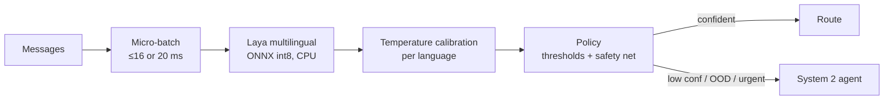

# 🛠️ 03 - Laya in Practice

Laya's launch numbers — 33 ms per decision, beating Jev on several benchmarks, Apache-2.0 — are true *in the conditions they were measured*: a T4 GPU, an English checkpoint, a fine-tuned model, few options. P2 will run it on a laptop CPU, in Spanish and English, with routes derived from 77 banking intents. This note is about closing that gap: how to call Laya, how to design questions it is good at, how to fine-tune and **calibrate** it for your data, how to make it fast on CPU, and how to detect the failure modes its own documentation warns about.

## 🎯 Learning Objectives
- Install and call Laya through its **Python Router** and its **Jev-compatible HTTP server**
- Choose between the **English, multilingual, and typed-decisions** checkpoints
- Design **questions and options** that fit an encoder's option-token budget
- **Fine-tune** Laya on project data (free GPU notebooks or LoRA locally) and know what to expect
- **Calibrate per language** with temperature scaling applied to returned probabilities
- Make it fast on **CPU** (ONNX int8, batching, preloading) and benchmark it honestly
- Detect and handle the documented **failure modes**

## Introduction

Laya (Convai Innovations, Apache-2.0) is an open **option-scoring encoder** family built on ModernBERT and mmBERT ([[01 - How Decision Models Work|how decision models work]]). It answers the same three question types as Jev — `choice`, `score`, `noul` — in one forward pass, can be self-hosted on CPU or GPU, exports to ONNX with int8 quantization, and ships a server that speaks Jev's `/v1/systemone` API. That combination — local, cheap, calibrated-after-fitting, and API-compatible — is why it is P2's System 1.

The documentation is also unusually candid about weaknesses: zero-shot accuracy barely above random on typed decisions, collapse on high-cardinality choices, a multilingual checkpoint that ships uncalibrated, and an English checkpoint that "fails silently and confidently" outside English. Each of those is a design constraint for P2, addressed below.

⚠️ **Version note:** Laya is weeks old. The API calls below follow the project's published examples (October 2026); names may change. Pin the package version and wrap it behind your own `decide()` function ([[02 - Jev and the Landscape|interface over implementation]]).

---

## 1. The Problem and Why This Solution Exists

### What P2 needs from System 1

| Need | Laya feature | Gap to close |
|---|---|---|
| Spanish + English | `laya-multilingual` (mmBERT-base, 322M, 1,024-token context) | Ships **uncalibrated** → fit temperature per language |
| Several decisions per message | Typed questions in one request | Design ≤ ~12 options per choice |
| CPU only | CPU inference; ONNX int8 export | Measure p95 on the i5; batch messages |
| Calibrated thresholds | Temperature fitting (EN ECE 0.466 → 0.081) | Fit on **our** validation data |
| Good accuracy on our routes | Fine-tuning recipe (RLCD + temperature) | Zero-shot is weak → fine-tune |
| Swappable engine | `laya-serve` exposes `/v1/systemone` | Contract test for the response schema |

### Checkpoints

| Checkpoint | Backbone | Params | Context | Use |
|---|---|---|---|---|
| `laya` | ModernBERT-large | 421M | 512 | English base for fine-tuning |
| `laya-multilingual` | mmBERT-base (256k vocab) | 322M | 1,024 (8,192 windowed) | 100+ languages — **P2's choice** |
| `laya-typed-decisions` | ModernBERT-large | 421M | 1,024 | English, fine-tuned for typed decisions |

Downloads are roughly 0.8 GB for the English model and 0.65 GB for the multilingual one (≈ 2.5 GB for the full bundle).

---

## 2. Conceptual Deep Dive

### 2.1 Designing questions for an encoder

An option-scoring encoder places the state, the question, and every option in **one** sequence; options share a fixed budget (a few hundred tokens). Three rules follow:

1. **Few options per choice.** Laya's Banking77 result (0.425 with 77 options vs 0.950 on 4-class AG News) is the budget effect. P2 maps 77 intents to **~12 routes**; a fine-grained sub-intent, when needed, is a second question with only that route's options.
2. **Short, discriminative option descriptions.** `"disputes": "duplicate or wrong charges, refunds"` beats a paragraph; the description is what the encoder compares against the message.
3. **Split concerns into separate questions.** Route, urgency, and "needs a human" are independent decisions — three typed questions, evaluated together, instead of one combined label.

The P2 question set:

| Key | Type | Options / levels | Feeds |
|---|---|---|---|
| `route` | `choice` | ~12 teams/flows | Dispatcher |
| `urgency` | `score` | 0 info · 1 normal · 2 high · 3 critical | Priority + safety net |
| `needs_human` | `noul` | — | Queue vs automation |
| `needs_kb` | `noul` | — | Call P3 (RAG) or not |

### 2.2 Fine-tuning

Zero-shot, Laya scores 0.362 on its typed-decisions benchmark (random baseline 0.318); the published fine-tuning recipe — a GRPO-style policy gradient against strictly proper scoring rules, followed by temperature calibration — reaches 0.766 after ~4–5 hours on free-tier Kaggle (2× T4), 4 epochs, ~30k questions. For P2:

- **Data:** Banking77 (EN) + locally generated Spanish paraphrases, mapped to routes, plus auxiliary labels (urgency, needs_human, needs_kb) and a hand-written hard-case set ([[../../09 - MLOps y Produccion/43 - Real-time Feature Serving with Redis/03 - Point-in-Time Correctness and Train-Serve Skew|no leakage]] across paraphrases of the same source sentence).
- **Where:** the full recipe on a free Kaggle/Colab GPU notebook; on the local 4 GB GPU, a **LoRA** fine-tune of the encoder (via Hugging Face Transformers + PEFT on the published checkpoint) if the SDK's trainer doesn't fit in memory — measured, not assumed.
- **Evaluation:** the same golden set and harness for zero-shot, LoRA, and full fine-tune (P2 baselines B2/B3).

### 2.3 Calibrating returned probabilities

You can calibrate even when you only get **probabilities** back (no logits): log-probabilities are logits up to an additive constant, which softmax ignores. So temperature scaling applies directly:

$$
\tilde{p}_k = \frac{p_k^{1/T}}{\sum_j p_j^{1/T}} = \operatorname{softmax}\!\left(\frac{\log \mathbf{p}}{T}\right)_k
$$

For `noul` answers, apply the same transform to the pair $(p, 1-p)$. Fit $T$ **per language** (and ideally per question) on a validation split, report ECE before and after, and store the temperatures with the model version — they are part of the model.

### 2.4 Making it fast on CPU

$$
L_{\text{msg}} \approx \frac{o + c \cdot k}{k} + T_{\text{wait}}(k),
\qquad
\text{throughput} \approx \frac{k}{o + c\,k}
$$

per message in batches of size $k$ ([[../../09 - MLOps y Produccion/44 - High-Performance Model Serving - Triton and ONNX Runtime/01 - ONNX Runtime for Tabular Models|same model as ONNX scoring]]). Levers, in order:

1. **Preload** the checkpoint at process start. Laya's router documents a **7–10 s cold-swap penalty** when a language checkpoint is loaded on demand.
2. **ONNX export with int8** dynamic quantization (supported by the project) and ONNX Runtime with tuned `intra_op_num_threads`.
3. **Micro-batch** messages (e.g., up to 16 or 20 ms) — encoders amortize well.
4. **Short inputs:** support messages rarely need more than 128–256 tokens; truncate the state.

Vendor CPU latency is 193–464 ms per request; one community report measured several **seconds** per request on a laptop CPU with default settings. P2's M3 milestone measures p50/p95 on the i5-10300H for each lever and keeps **Von (OpenVINO CPU)** as the fallback if p95 > 300 ms.



---

## 3. Production Reality

### Failure modes and their guards (from the project's own documentation)

| Failure mode | Evidence | Guard in P2 |
|---|---|---|
| Weak zero-shot | 0.362 on typed decisions without fine-tuning | Fine-tune; never ship zero-shot |
| High-cardinality collapse | 0.425 on Banking77 (77 options) | ≤ ~12 routes; hierarchical sub-questions |
| `score` questions weakest | SST-5 ordinal accuracy 0.372 | Urgency is also guarded by the **safety net** (low threshold on P(high ∪ critical)) |
| Multilingual uncalibrated | ECE 0.314 before fitting | Per-language temperature; ECE gate in CI |
| English model confident outside English | Mean confidence ≥ 0.885 on scripts where accuracy is ~0 | Use the multilingual checkpoint; detect language; treat unknown languages as OOD → System 2 |
| Soft-distribution matching trails Jev | 0.471 vs 0.580 soft accuracy | Rely on calibrated argmax + thresholds, not raw distribution shape |

### Serving

Two equivalent modes: **in-process** (the stream processor imports the router and calls it on micro-batches — P2's default, no network hop) or **`laya-serve`** (a sidecar exposing `/v1/systemone`, useful for the FastAPI `POST /route` endpoint and for swapping engines). Both go through the same `decide()` wrapper so calibration and the policy are applied identically.

Caso real: Laya's own multilingual evaluation reports 45 of 51 languages above three times the random baseline — good coverage, but a reminder that six languages are not, and that the English checkpoint gives high-confidence answers in languages it cannot read. A router that trusted raw confidence would silently misroute those users; a calibrated, language-aware policy escalates them.

Caso real: in P2's design, the decision to cap `route` at ~12 options came directly from the Banking77 number in Laya's model card — a one-line benchmark result that changed the data design (intent → route mapping) before any code was written.

---

## 4. Code in Practice

### Calling Laya (Python router, as published)

```python
# pip install laya   (pin the version you validate)
from laya import Router

router = Router(preload=True)        # load checkpoints at startup — avoid the 7–10 s cold swap per language

state = {"channel": "chat", "text": "me cobraron dos veces la suscripción de octubre"}
questions = {
    "route": {"type": "choice", "instructions": "Which team should handle this message?",
              "criteria": {"disputes": "duplicate or wrong charges, refunds",
                           "cards": "card blocked, lost, activation",
                           "security": "fraud, stolen card, account takeover",
                           "general": "anything else"}},
    "urgency": {"type": "score", "instructions": "How urgent is this for the customer?",
                "criteria": {"0": "informational", "1": "normal", "2": "high", "3": "critical"}},
    "needs_human": {"type": "noul", "instructions": "A human must act to resolve this."},
}
res = router.predict(state, questions)
print(res["answers"]["route"]["choice"], res["answers"]["route"]["probabilities"])
```

### Serving the Jev-compatible endpoint

```bash
laya-serve --host 0.0.0.0 --port 8080        # exposes POST /v1/systemone (check flags for your version)
curl -s localhost:8080/v1/systemone -H "Content-Type: application/json" \
  -d '{"state": {"text": "perdí mi tarjeta"}, "questions": {"needs_human": {"type": "noul", "instructions": "A human must act."}}}'
```

### ❌/✅ Trusting the output

```python
# ❌ Raw probabilities from an uncalibrated multilingual checkpoint → thresholds mean nothing
if res["answers"]["route"]["probabilities"][route] > 0.9: dispatch(route)

# ✅ Calibrate per language, then apply the policy (thresholds chosen on a risk–coverage curve)
p = calibrate(res["answers"]["route"]["probabilities"], T=TEMPERATURES[lang]["route"])
decision = policy(p, urgency=calibrate(res["answers"]["urgency"]["probabilities"], T=TEMPERATURES[lang]["urgency"]))
```

### 📦 Compression code: per-language temperature on returned probabilities + an honest CPU benchmark harness

```python
# 📦 Compression code: calibrate probabilities you can't see logits for; measure latency the right way
# Covers: softmax(log p / T), ECE per language, micro-batch latency percentiles (stub model)
import math
import random
import statistics
import time

def calibrate(probs: dict, T: float) -> dict:
    keys = list(probs)
    z = [math.log(max(probs[k], 1e-12)) / T for k in keys]
    m = max(z); e = [math.exp(v - m) for v in z]; s = sum(e)
    return {k: v / s for k, v in zip(keys, e)}

def ece(rows, bins=10):
    buckets = [[] for _ in range(bins)]
    for conf, correct in rows:
        buckets[min(int(conf * bins), bins - 1)].append((conf, correct))
    return sum(len(b) / len(rows) * abs(sum(c for _, c in b) / len(b) - sum(q for q, _ in b) / len(b))
               for b in buckets if b)

random.seed(10)
ROUTES = ["disputes", "cards", "security", "general"]
def fake_model_output(lang):                    # Spanish outputs more overconfident than English
    sharp = 4.0 if lang == "es" else 2.0
    true = random.choice(ROUTES)
    logits = {r: random.gauss(1.5 if r == true else 0, 1.0) * sharp for r in ROUTES}
    m = max(logits.values()); e = {r: math.exp(v - m) for r, v in logits.items()}; s = sum(e.values())
    return {r: v / s for r, v in e.items()}, true

for lang in ("en", "es"):
    data = [fake_model_output(lang) for _ in range(3000)]
    val, test = data[:1500], data[1500:]
    def rows(ds, T): return [(max(calibrate(p, T).values()), max(p, key=p.get) == y) for p, y in ds]
    T = min((t / 10 for t in range(5, 80)), key=lambda t: -sum(math.log(calibrate(p, t)[y] + 1e-12) for p, y in val))
    print(f"{lang}: T*={T:.1f}  ECE raw={ece(rows(test, 1.0)):.3f} → calibrated={ece(rows(test, T)):.3f}")

def predict_batch(batch):                       # stub: replace with router.predict on a real batch
    time.sleep(0.030 + 0.006 * len(batch))      # fixed overhead + per-message cost
lat = []
for _ in range(60):
    batch = [None] * 16
    t0 = time.perf_counter(); predict_batch(batch); dt = time.perf_counter() - t0
    lat += [dt] * len(batch)                    # each message in the batch waited for the whole batch
print(f"batch=16: p50={statistics.median(lat)*1000:.0f} ms  p95={statistics.quantiles(lat, n=20)[18]*1000:.0f} ms per message")
# ¡Sorpresa! Each language needs its own temperature — one global T leaves Spanish overconfident.
```

---

## 🎯 Key Takeaways
- Laya = open, Apache-2.0 **option-scoring encoders** (EN 421M, multilingual 322M) with a Python router and a **Jev-compatible** server.
- Design questions for the encoder: **few options**, short descriptions, **separate typed questions** per concern.
- **Fine-tune** before trusting it (zero-shot ≈ random); the published recipe runs on free Kaggle T4s.
- **Calibrate per language** with temperature applied to returned probabilities ($\operatorname{softmax}(\log p / T)$); the multilingual checkpoint ships uncalibrated.
- On CPU: **preload**, **ONNX int8**, **micro-batch**, short inputs — and measure p95; vendor and community CPU numbers disagree.
- Guard documented failures: high-cardinality collapse, weak `score`, confident OOD behavior → hierarchical questions, safety nets, System 2 escalation.

## References
- Laya — Hugging Face `convaiinnovations/laya`, GitHub `NandhaKishorM/laya`, PyPI `laya` (model card, benchmarks, fine-tuning notebook)
- Mervin Praison, *Laya: The 33ms Open-Source Decision Model Beating Jev* (2026) · innFactory, *Laya: Open System One Model as a Jev Alternative* (2026)
- Community report: *Laya, a decision-making System One model* (DEV Community, 2026) — CPU latency observations
- Warner et al., *ModernBERT* (2024) · mmBERT model card
- Guo et al., *On Calibration of Modern Neural Networks* (ICML 2017)
- [[02 - Jev and the Landscape|Previous: Jev and the Landscape]] · [[04 - DIY - Classification Head on a Small Qwen|Next: DIY Classification Head]]
