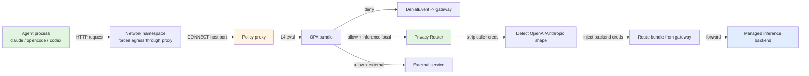
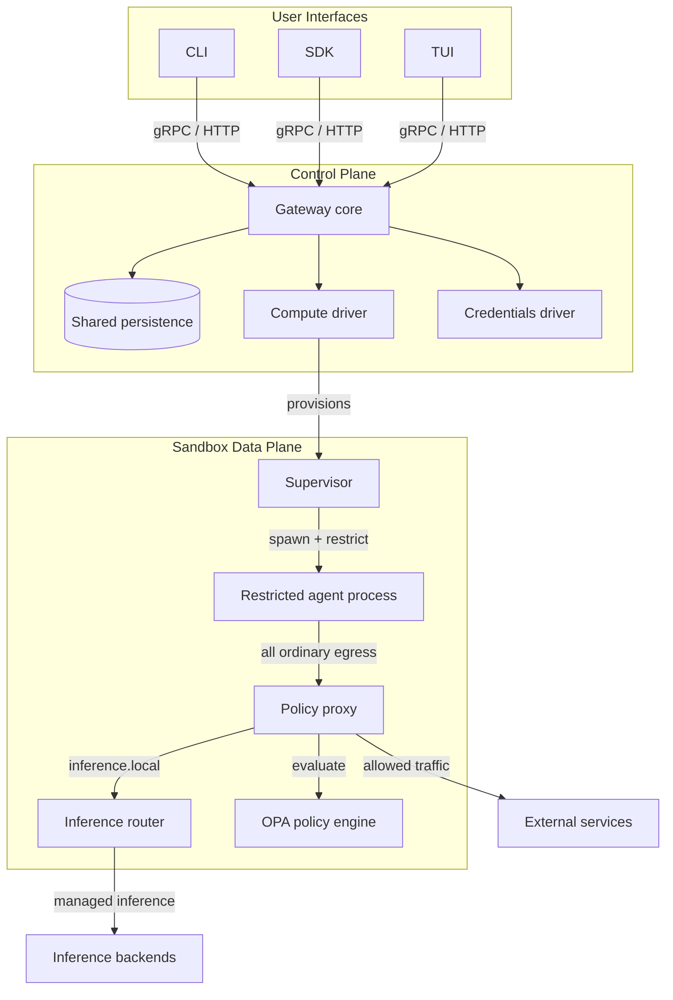
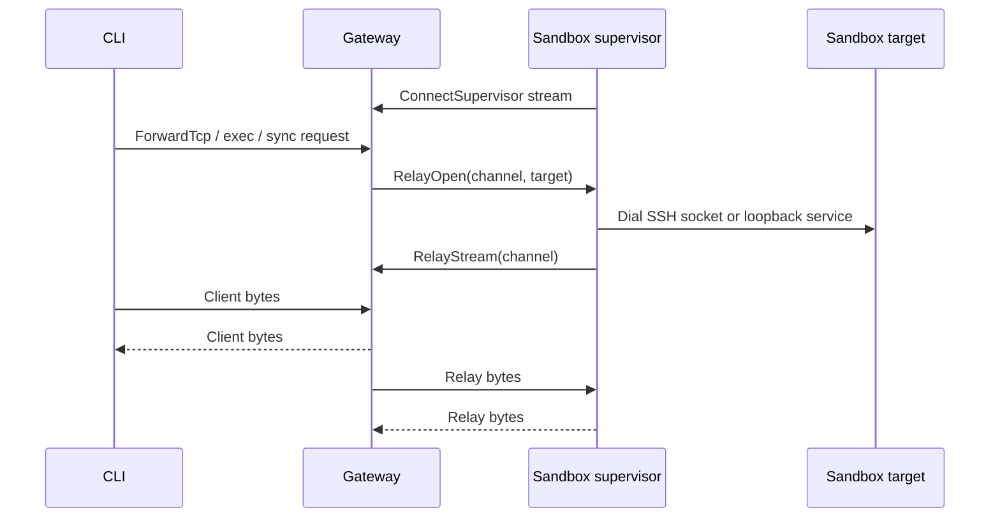

# 🏗️ Architecture - Gateway, Sandbox, Policy Engine, Privacy Router

## 🎯 Learning Objectives

- Understand why **monolithic agent runtimes fail at scale** and why OpenShell splits the system into a Rust control plane (Gateway) and a Rust data plane (Supervisor) that talk over a supervisor-initiated outbound gRPC stream
- Trace the **request flow** for an agent making an outbound call: agent → kernel → proxy → OPA → inference router or external service, with the L7 enrichment stage that does credential stripping
- Read the **compute driver matrix** (Docker, Podman, MicroVM, K8s) as a tradeoff between operational simplicity and isolation strength, and pick the right driver for each portfolio project
- Understand **k3s-in-Docker** as a development-time approximation of the K8s production path, and when it is worth the extra complexity over plain Docker
- Write a minimal **gRPC client** that interacts with an OpenShell sandbox so you can automate policy application and log streaming from your own backend

---

## Introduction

The architecture of OpenShell is one of the cleanest examples in the agent infrastructure space of **separation of concerns as a security property**. Most early agent runtimes — Open Interpreter, the first generation of LangChain agents, the bespoke "agent loop" scripts in half the MLOps repos on GitHub — conflate three things into a single process: the agent's ReAct loop, the tool execution environment, and the network egress point. That conflation is what made the prompt-injection-as-data-exfiltration attack possible: the agent's process was the network egress point, so the prompt controlled the network.

OpenShell refuses to conflate. The **Gateway** is a control plane: it owns API access, durable state, policy and settings delivery, provider and inference configuration, and relay coordination. It does not enforce agent network policy at request time — that would require the gateway to be in the data path, which would mean a network hop for every request and a single point of failure. Instead, the gateway delegates enforcement to a **Supervisor** that lives inside every sandbox. The supervisor is the local security boundary: it prepares isolation, fetches config, injects credentials, runs the proxy, and launches the restricted agent process. The Gateway and Supervisor talk over a **supervisor-initiated outbound gRPC stream**, which means the gateway never has to reach the sandbox — the sandbox reaches the gateway.

This is the same architectural pattern as your [[../../13 - Go Engineering/03 - Microservices with Go/01 - Building APIs with Gin and Fiber.md|LLM Edge Gateway (Go)]], just one layer down the stack. Your Fiber gateway is a chokepoint for LLM traffic — every OpenAI/Anthropic request passes through it, and it can inspect, cache, rate-limit, and audit. OpenShell's Rust gateway is a chokepoint for **agent lifecycle** — every sandbox create/destroy/policy-set operation passes through it, and it can authenticate, authorize, persist, and coordinate. The two gateways are not in conflict; they are complementary. In a production deployment they share a Kubernetes cluster, share observability backends, and route to the same Redis cache (for LLM semantic caching) and the same Postgres database (for sandbox state).

For your portfolio the architecture matters because **the boundary you draw determines the story you can tell in an interview**. If your LLM Edge Gateway story is "I chokepoint LLM traffic," your OpenShell story is "I chokepoint agent lifecycle." Both are the same architectural instinct applied at two different layers of the stack, and that consistency is what makes you memorable.

---

## 1. The Problem and Why This Solution Exists

### Why monolithic agent runtimes fail at scale

A monolithic agent runtime — the kind that ships in a single Python process, like the first generation of LangChain `AgentExecutor`s — has three structural problems that show up the moment you try to run more than one agent in production.

**Problem 1: Process identity is the user's process identity.** When `AgentExecutor` calls a tool that runs `subprocess.run(["curl", ...])`, the curl inherits the parent process's UID, environment, and filesystem access. There is no way to give one agent in the same process a different trust boundary from another. You can swap tool implementations, but you cannot swap the kernel-level identity.

**Problem 2: The LLM is the policy engine.** In a monolithic runtime, the "policy" that decides what the agent can do is encoded in Python: `if "rm -rf" in command: raise SecurityError`. This is a soft policy — a prompt-injected agent can call `subprocess.run` with `["r\u006d", "-rf", "/"]` and the soft policy misses the Unicode escape. Kernel-level policy (Landlock, seccomp, capabilities) cannot be bypassed by Unicode tricks because it operates on syscalls, not on string content.

**Problem 3: There is no audit boundary.** In a monolithic runtime, the only audit log is the LLM's conversation. If the agent exfiltrates a file, the conversation shows the prompt, the tool call, and the response — but not the fact that the curl request reached an unexpected destination, or that the file was opened with `O_RDWR` instead of `O_RDONLY`. A separate policy proxy that emits structured `DenialEvent`s is the only way to get an audit trail that survives the LLM being compromised.

### How the split solves each problem

OpenShell's component split directly addresses each of these:

| Problem                                     | OpenShell's solution                                                                         |
|---------------------------------------------|----------------------------------------------------------------------------------------------|
| Process identity = user's identity          | Supervisor runs the agent as a non-root user inside a network namespace with Landlock + seccomp |
| LLM is the policy engine                    | OPA bundle is evaluated by the proxy in a separate process; the LLM cannot see or modify it   |
| No audit boundary                           | Every denied request emits a structured `DenialEvent`; every policy change is versioned       |

The split is enforced at the process boundary, not at a function call. The Gateway is a separate process. The Supervisor is a separate process. The Policy Proxy is a separate process. The Agent is a separate process. The LLM cannot reach across these boundaries by design — they communicate over gRPC and over the kernel, not over shared memory or function calls. This is what "no escape" means in practice: there is no `import os; os.system("rm -rf /")` path that reaches the host, because `os` in the agent process is a different `os` than the one on the host, with a different filesystem and a different syscall filter.

> 💡 **Tip**: The single most important sentence in the OpenShell architecture docs is in [`architecture/sandbox.md`](https://github.com/NVIDIA/OpenShell/blob/main/architecture/sandbox.md): "The supervisor keeps enough privilege to manage the sandbox, but the agent child loses that privilege before user code runs." Everything else in the design follows from that one commitment.

---

## 2. Conceptual Deep Dive

The four components of OpenShell — Gateway, Sandbox, Policy Engine, Privacy Router — are not a tower of abstractions. They are four physical processes (or process groups) with a defined request flow between them. Understanding the request flow is the fastest way to understand the system.

### The four components

| Component        | What it is                                                                              | Where it runs                              | Failure domain                                |
|------------------|------------------------------------------------------------------------------------------|--------------------------------------------|-----------------------------------------------|
| **Gateway**      | Authenticated control plane: gRPC + HTTP API, SQLite/Postgres persistence, policy revisions, provider/inference config, supervisor session coordination | On the host (single-player) or in a K8s pod | Stale state in DB; supervisors keep last-known-good |
| **Sandbox (Supervisor + agent child)** | Workload-local security boundary: prepares isolation, fetches config, injects credentials, runs the proxy, launches the agent | Inside the container (Docker/Podman/MicroVM/K8s pod) | Sandbox is lost; gateway marks it failed |
| **Policy Engine** | OPA bundle that evaluates network and inference policy on every request                  | Inside the sandbox (in-process with the proxy) | Falls back to "deny" by default (fail-closed) |
| **Privacy Router** | L7 enrichment stage that strips caller credentials, detects inference request shapes, forwards through the gateway-resolved route bundle | Inside the sandbox (separate process from the proxy) | Falls back to "deny" by default (fail-closed) |

### The request flow



The flow has three properties worth noticing:

1. **All ordinary egress goes through the proxy.** The agent cannot make a raw socket connection because the seccomp filter blocks `socket(AF_INET, SOCK_RAW, ...)`, and the network namespace routes all other traffic through the proxy's listening port. There is no path from agent to internet that does not pass the proxy.
2. **`https://inference.local` is special.** It is not subject to network policy — the proxy terminates TLS with the sandbox CA, then hands the request to the Privacy Router. The agent can call `inference.local` even with zero `network_policies` defined.
3. **Denials are structured, not just logged.** A denial produces a `DenialEvent` that flows back to the gateway for aggregation, mechanistic mapping, and the audit log. The agent sees a 403; the operator sees a structured event in `openshell logs`.

### L7 enforcement and credential stripping

The Privacy Router does something that most LLM gateway designs do not: it **strips caller credentials and injects backend credentials**. This is the privacy-preserving property that gives the component its name.

The flow is:

1. The agent calls `https://api.openai.com/v1/chat/completions` with an `Authorization: Bearer sk-agent-...` header (an API key the agent was told to use, possibly leaked from a prompt).
2. The proxy receives the CONNECT for `api.openai.com:443` and the L4 policy says "allow." The proxy completes the TLS handshake and reads the HTTP request.
3. The L7 evaluator checks the method/path against the `access:` preset. `POST /v1/chat/completions` is allowed under the policy's inference configuration.
4. The Privacy Router detects the OpenAI-compatible request shape (it looks for `model`, `messages`, and `Authorization` headers).
5. **Caller credentials are stripped.** The `Authorization: Bearer sk-agent-...` header is removed.
6. **Backend credentials are injected.** The router fetches the route bundle from the gateway, which contains the operator-configured backend credentials (`sk-real-...` in the gateway's encrypted provider store).
7. The request is forwarded to the configured backend (could be the real OpenAI API, a local vLLM, an NIM container, or a self-hosted LiteLLM proxy).
8. The response flows back to the agent with no indication that the credentials were swapped.

The agent thinks it called OpenAI with its own key. The operator knows the agent's key was discarded and the operator's key was used. This is the **credential-boundary property** that makes OpenShell safe to use with untrusted agents in a multi-developer environment — except, of course, that v0.0.53 is single-player mode, so the multi-developer environment is the next milestone, not the current state.

> ⚠️ **Advertencia**: The credential stripping only works for `https://inference.local` traffic. If the agent calls `https://api.openai.com/v1/chat/completions` directly (not through the inference.local indirection), the L7 evaluator will allow it under a `network_policies.openai.endpoints` rule, but the Privacy Router will not be in the path — the request goes out with whatever credentials the agent attached. Always configure your agent to call `inference.local` if you want the credential-boundary property.

### Optimistic concurrency in the gateway

The gateway uses **optimistic concurrency control (OCC)** with a `resource_version` column on every persisted object. Every write goes through a `put_if` helper that takes a `WriteCondition`:

- `MustCreate` — insert-only, fails with `UniqueViolation` if the row exists.
- `MatchResourceVersion(v)` — update-only, fails with `Conflict` if the version has changed.
- `Unconditional` — test-only, gated behind `#[cfg(test)]`.

This matters for two scenarios. **First**, when you call `openshell policy set` while a `openshell sandbox connect` is also running, the gateway serializes the two operations through CAS — the second one either succeeds (it saw the latest version) or fails with `Conflict` (it saw a stale version, and you retry). **Second**, in an HA deployment with multiple gateway replicas behind a load balancer, two replicas cannot silently clobber each other's writes — the CAS prevents the classic "split brain" overwrite that you would otherwise get with naive `UPDATE` statements.

The compile-time enforcement is the interesting part: production builds literally cannot make non-CAS writes, because the `put` and `put_message` methods are `#[cfg(test)]`-gated. The compiler rejects them. This is a pattern worth borrowing for your own Go gateway if you ever want to add CAS protection there.

---

## 3. Production Reality

### Rust internals — why 88.9% Rust is not a vanity metric

The OpenShell GitHub language breakdown at v0.0.53 is **Rust 88.9% / Shell 5.5% / Python 4.6% / CSS 0.3% / OPA 0.3% / TypeScript 0.2%**. The Rust percentage is not branding — it is a load-bearing technical choice for three reasons.

**Reason 1: The supervisor runs inside every sandbox.** A memory-safety bug in the supervisor is a sandbox escape. Rust's ownership model eliminates use-after-free, double-free, and iterator-invalidation bugs at compile time. A C or C++ supervisor would have to be audited line-by-line for memory safety; a Rust supervisor is memory-safe by construction, and the remaining attack surface is logic bugs, not memory corruption.

**Reason 2: The proxy is on the request hot path.** Every outbound `CONNECT` from every agent goes through the proxy. Latency matters: a 10ms-per-request overhead in a chat agent is noticeable; a 10ms-per-request overhead in a 10k-call eval suite is 100 seconds. Rust's zero-cost abstractions and lack of GC pauses keep the proxy's tail latency bounded. There is no Python `gc.collect()` pause at the worst possible moment.

**Reason 3: The gateway is the auth boundary.** Every API call hits the gateway. A buffer overflow in the gateway's TLS parser is a remote root on the host. Rustls (the TLS library OpenShell uses) is audited, memory-safe, and small enough to read end-to-end. The gateway's auth path is the kind of code that benefits most from Rust's safety guarantees.

The 5.5% Shell is the install scripts, the CI glue, and the `nix`/`mise` configuration. The 4.6% Python is the Python SDK bindings, the agent launchers (`claude`, `opencode`, `codex`, `copilot`), and the TUI driver. The 0.3% OPA is the policy bundles — note that OPA policies are stored as a separate language, deliberately not embedded in Rust, so a policy author cannot accidentally rewrite the proxy that enforces the policy.

### Async runtime choice — Tokio all the way down

The Rust async runtime is **Tokio**. The gateway, the supervisor, the proxy, and the inference router all run on Tokio. This is the boring choice, and boring is right. Tokio's `mio` reactor is battle-tested, the `hyper` HTTP server is the fastest in the ecosystem, and the `tonic` gRPC stack is what every Rust backend uses. Choosing `async-std` or `smol` would have been defensible; choosing Tokio means every new contributor already knows the runtime, every debugging tool already supports it, and every library they want to use already targets it.

The Gateway is a gRPC server (`tonic`) that multiplexes HTTP on the same port for health (`/healthz`, `/readyz`), WebSocket tunnels, and edge-auth flows. The supervisor connects to the gateway over an outbound TLS stream (initiated by the supervisor, accepted by the gateway) and multiplexes control, logs, and relay bytes over that single stream. This is the **supervisor-initiated outbound pattern** mentioned in the architecture docs, and it is the reason the gateway never has to dial into a sandbox.

### k3s inside Docker — the dev-time K8s approximation

The compute drivers section of Note 01 mentioned that K8s is the production target but the Helm chart is **Experimental**. The community solution for "I want K8s semantics without the experimental Helm chart" is **k3s-in-Docker**: run a single-node k3s cluster inside a Docker container on your dev machine, and point OpenShell at it as a K8s compute driver.

This is not a hack. k3s is a CNCF-certified Kubernetes distribution packaged as a single binary, and running it inside Docker gives you a full K8s API server, etcd, and kubelet in a single process. The workflow looks like:

```bash
# Start k3s in a Docker container
docker run -d --name k3s \
  --privileged \
  -p 6443:6443 \
  rancher/k3s:latest \
  server --disable=traefik

# Point OpenShell at it
export OPENSHELL_COMPUTE_DRIVER=k8s
export KUBECONFIG=~/.kube/config
openshell sandbox create -- claude
```

For the **Multi-Agent Research System** capstone, k3s-in-Docker is the right answer if you want to validate the K8s code path before committing to the experimental Helm chart. The trade-off is that you are now running Docker, k3s, the OpenShell gateway, and the OpenShell sandbox supervisor — four layers of orchestration on a dev laptop. Plain Docker (the default) is one layer.

### Gateway framework choices — and what they imply

The gateway is a Rust binary that exposes a gRPC API (sandbox lifecycle, provider management, policy updates, settings, inference config, logs, watch streams, relay forwarding) and an HTTP API (health, WebSocket tunnels, edge-auth). The framework choices are:

| Concern               | Choice                                | Why                                                              |
|-----------------------|----------------------------------------|------------------------------------------------------------------|
| gRPC                  | `tonic` on `tokio`                    | Most-used Rust gRPC stack; broad ecosystem                       |
| HTTP                  | `hyper` directly (no Axum/warp)        | Lower abstraction; the gateway's HTTP surface is small (health, WS, edge-auth) |
| TLS                   | `rustls`                              | Memory-safe, audited, no OpenSSL dependency                      |
| Persistence           | SQLite (default) or Postgres           | Same logical schema in both; backend-specific SQL in adapter     |
| Migrations            | `crates/openshell-server/migrations/` | Versioned SQL migrations, one set per backend                    |
| Auth                  | mTLS (default) / OIDC / Cloudflare JWT / plaintext | Pluggable authenticator behind a single trait                  |
| PKI bootstrap         | `openshell-gateway generate-certs`     | Single command, idempotent, shared between K8s and local flows   |
| Optimistic concurrency| `put_if` with `WriteCondition` enum    | Compile-time enforcement of CAS; non-CAS writes are test-only    |

The choice to use `hyper` directly instead of a higher-level framework like Axum or warp is the kind of decision that signals "we know what we are doing and we wanted the lower abstraction." For a gateway that multiplexes gRPC and HTTP on the same port, the framework overhead of Axum is a liability, not a benefit. The same philosophy shows up in [[../../14 - Rust Engineering/01 - Rust Fundamentals/00 - Welcome.md|Rust Fundamentals]] — Rust's strength is that the standard library and a small number of well-chosen crates give you everything you need, and you do not need a framework on top.

### Mermaid architecture diagram


The full Mermaid diagram from the `architecture/README.md` is the canonical reference. Reproduced here for the vault:



The diagram is dense but every arrow has a meaning. The CLI/SDK/TUI → Gateway edge is the API surface. The Gateway → DB edge is the persistence layer. The Gateway → Compute driver → Supervisor edge is the workload lifecycle. The Supervisor → Agent edge is the isolation boundary. The Agent → Proxy → OPA → External/Router chain is the egress policy pipeline. Reading this diagram once a day for a week is the fastest way to internalize the architecture.

---

## 4. Code in Practice

A minimal Python gRPC client that connects to the OpenShell gateway and lists sandboxes. This is the same code shape you would write to integrate OpenShell with your [[../../13 - Go Engineering/03 - Microservices with Go/01 - Building APIs with Gin and Fiber.md|LLM Edge Gateway (Go)]] — replace `grpcurl` with `tonic` and the patterns transfer.

```python
# openshell_client.py
# Minimal gRPC client for the OpenShell gateway.
# Run: openshell-gateway generate-certs --output-dir ~/.local/state/openshell/tls
#      export OPENSHELL_TLS_CA=~/.local/state/openshell/tls/ca.crt
#      python openshell_client.py

import os
import grpc
from openshell.proto import sandbox_pb2, sandbox_pb2_grpc  # generated stubs

GATEWAY = os.environ.get("OPENSHELL_GATEWAY", "127.0.0.1:8443")
CA_PATH = os.environ["OPENSHELL_TLS_CA"]
CLIENT_CERT = os.path.expanduser("~/.local/state/openshell/tls/client/tls.crt")
CLIENT_KEY = os.path.expanduser("~/.local/state/openshell/tls/client/tls.key")

def build_credentials() -> grpc.ChannelCredentials:
    with open(CA_PATH, "rb") as f:
        ca = f.read()
    with open(CLIENT_CERT, "rb") as f:
        cert = f.read()
    with open(CLIENT_KEY, "rb") as f:
        key = f.read()
    return grpc.ssl_channel_credentials(
        root_certificates=ca,
        private_key=key,
        certificate_chain=cert,
    )

def list_sandboxes(stub: sandbox_pb2_grpc.SandboxServiceStub) -> None:
    request = sandbox_pb2.ListSandboxesRequest()
    for sandbox in stub.ListSandboxes(request).sandboxes:
        print(f"- {sandbox.metadata.name}  state={sandbox.status.state}  id={sandbox.metadata.id}")

def apply_policy(stub: sandbox_pb2_grpc.SandboxServiceStub, name: str, policy_path: str) -> None:
    with open(policy_path, "rb") as f:
        policy_bytes = f.read()
    request = sandbox_pb2.UpdateSandboxPolicyRequest(
        sandbox_name=name,
        policy=sandbox_pb2.SandboxPolicy(yaml=policy_bytes),
    )
    response = stub.UpdateSandboxPolicy(request)
    print(f"policy revision {response.revision} applied to {name}")

def stream_logs(stub: sandbox_pb2_grpc.SandboxServiceStub, name: str) -> None:
    request = sandbox_pb2.StreamLogsRequest(sandbox_name=name, follow=True)
    for entry in stub.StreamLogs(request):
        print(f"[{entry.timestamp_ms}] {entry.severity}: {entry.message}")

def main() -> None:
    creds = build_credentials()
    with grpc.secure_channel(GATEWAY, creds) as channel:
        sandbox_stub = sandbox_pb2_grpc.SandboxServiceStub(channel)
        print("=== sandboxes ===")
        list_sandboxes(sandbox_stub)
        print("=== applying policy.yaml to demo sandbox ===")
        apply_policy(sandbox_stub, "demo", "policy.yaml")
        print("=== streaming logs (Ctrl-C to stop) ===")
        stream_logs(sandbox_stub, "demo")

if __name__ == "__main__":
    main()
```

The code has three operational points worth highlighting.

**Point 1: mTLS is the default auth path.** The `build_credentials` function loads the CA, the client certificate, and the client key from the PKI directory that `openshell-gateway generate-certs` creates. This is the same PKI the CLI uses — single-player mode means single CA, and the CLI's `~/.local/state/openshell/tls/` is the source of truth. If you are running the gateway on a remote host, you will need to copy the CA and client materials over (or use one of the other auth modes: OIDC, Cloudflare JWT, or `allow_unauthenticated_users` for trusted dev deployments).

**Point 2: The generated stubs are not in this file.** `sandbox_pb2` and `sandbox_pb2_grpc` are produced by running `protoc` against the `.proto` files in `proto/` in the OpenShell repo. The `python` directory in the repo has a `pyproject.toml` that handles this for you, and `uv tool install openshell` ships the stubs as part of the package. If you are integrating from a non-Python backend, the equivalent is `tonic-build` for Rust or `protoc-gen-go` for Go.

**Point 3: The streaming logs endpoint is the same one the TUI uses.** When you see the TUI auto-refresh, it is calling `StreamLogs` with `follow=True` and rendering the entries. Your Go gateway can do the same thing to surface OpenShell events in your existing observability backend.

### Caso real — LLM Edge Gateway + OpenShell integration

Your **LLM Edge Gateway (Go/Fiber + Redis)** is the LLM-traffic chokepoint. OpenShell's gateway is the agent-lifecycle chokepoint. In a production deployment, both run in the same Kubernetes cluster, both authenticate against the same OIDC provider, both write metrics to the same Prometheus endpoint, and both stream logs to the same Loki/Langfuse backend.

The concrete integration is: when your Fiber gateway receives a request that requires running an agent (e.g., "summarize this PR by running the research agent"), it makes a gRPC call to the OpenShell gateway to create a sandbox with the appropriate policy, runs the agent inside, retrieves the result, and tears down the sandbox. The Fiber gateway handles the LLM-side concerns (rate limiting, semantic caching, cost tracking) and delegates the agent-side concerns (isolation, network policy, credential stripping) to OpenShell. The two gateways are peers, not parent and child.

For the **StayBot** Airbnb agent, the integration looks like: a request hits the FastAPI frontend, the CrewAI orchestrator decides to run the booking agent, the orchestrator (via the OpenShell Python SDK) calls `sandbox.create(name="staybot-booking", policy=supabase_readonly.yaml)`, the agent runs inside the sandbox with policy-enforced Supabase access, the result flows back through the orchestrator, and the sandbox is destroyed. The Supabase credentials never enter the agent's filesystem — they are injected by the gateway and stripped from the response.

This is the same architectural instinct that produced the chokepoint pattern in the first place, applied recursively. The LLM Edge Gateway chokepoints LLM traffic. The OpenShell gateway chokepoints agent lifecycle. The Fiber middleware chain chokepoints cross-cutting concerns (auth, rate limiting, semantic caching) for the LLM gateway. The OPA bundle chokepoints network policy for the sandbox. Each layer is a single point of control for a single concern, and the layers compose without impedance mismatch.

---

## 📦 Compression Code

```python
# NOTE: 02 - Architecture: Gateway, Sandbox, Policy Engine, Privacy Router
# Repo: github.com/NVIDIA/OpenShell @ v0.0.53 (June 2026, Apache-2.0)
# Stack: Rust 88.9% / Shell 5.5% / Python 4.6% / OPA 0.3% / TypeScript 0.2%
# Three runtime components: CLI / Gateway / Supervisor (the supervisor is sandbox-local)
# Gateway: gRPC + HTTP multiplexed on one port; mTLS / OIDC / Cloudflare JWT / plaintext
# Persistence: SQLite (default) or Postgres; protobuf object store; CAS on resource_version
# Compute drivers: Docker / Podman / MicroVM / K8s (Helm experimental, k3s-in-Docker for dev)
# Supervisor pattern: outbound gRPC stream from sandbox to gateway (no inbound reachability needed)
# Policy proxy: L4 (CONNECT host:port) -> mechanistic mapper; L7 (HTTP method/path) -> agent-authored
# Privacy Router: strips caller creds on inference.local, injects backend creds from route bundle
# Auth modes: mTLS user auth | plaintext | allow_unauthenticated_users (dev) | Cloudflare JWT | OIDC
# Sandbox JWTs: gateway-signed, sandbox-scoped, short TTL; k8s driver exchanges projected SA via IssueSandboxToken
# CAS primitives: MustCreate | MatchResourceVersion(v) | Unconditional (test-only)
# LLM Edge Gateway (Go) is the LLM-traffic chokepoint; OpenShell gateway is the agent-lifecycle chokepoint
```

## 🎯 Key Takeaways

- **Monolithic agent runtimes conflate trust boundaries** — OpenShell splits the system into a control plane (Gateway) and a data plane (Supervisor + Proxy + Router) that talk over a supervisor-initiated outbound gRPC stream
- **The four components have a defined request flow** — agent → network namespace → proxy → OPA → external service or Privacy Router → managed inference backend
- **L7 enforcement + credential stripping is the privacy-preserving property** — caller API keys are stripped, operator backend keys are injected, and the agent never knows the swap happened
- **Rust is a load-bearing technical choice** for the supervisor and proxy: memory safety, no GC pauses, and a small auditable TLS stack via rustls
- **k3s-in-Docker is the dev-time K8s approximation** that lets you validate the K8s code path before committing to the experimental Helm chart
- **Optimistic concurrency in the gateway is compile-time enforced** — non-CAS writes are `#[cfg(test)]`-gated and rejected by the compiler in production builds

### What the supervisor relay pattern unlocks

The supervisor-initiated outbound gRPC pattern is more powerful than it first appears. Because every supervisor maintains a live session back to the gateway, the gateway can multiplex several operational concerns over that single connection without ever needing inbound reachability to the sandbox:

- **Connect** — the user runs `openshell sandbox connect demo`, the gateway opens a `RelayOpen` channel over the supervisor's existing stream, the supervisor `dial(2)`s the sandbox's local SSH socket, and bytes flow back to the user's terminal. No port forwarding, no `kubectl port-forward`, no `docker exec` port mapping.
- **Exec** — `openshell sandbox exec demo -- ls -la` uses the same relay pattern. The gateway does not need to know which compute driver the sandbox is running on; the supervisor translates "exec `ls -la`" into a `fork(2)` + `execve(2)` against the agent's user namespace.
- **File sync** — `openshell sandbox cp file.txt demo:/sandbox/` uses tar-based file streaming over the relay. The gateway signs a sandbox-scoped JWT bound to the file-sync operation, the supervisor validates the token, the bytes flow.
- **Service forwarding** — for browser-based sandboxes (e.g., a `claude code` session that spins up a local web UI), the gateway can forward `https://sandbox--service.openshell.localhost` to the supervisor's loopback listener, all over the same stream. TLS-enabled loopback gateways even print `http://` URLs in the CLI output for ergonomics.

The sequence diagram from the gateway architecture doc makes the relay pattern explicit:



The pattern matters because it means the gateway can serve thousands of sandboxes across thousands of compute platforms (Docker on a developer's Mac, Podman on a Linux server, MicroVM on a bare-metal host, K8s pods across three regions) without ever needing to know the sandbox's IP, port, or network topology. The supervisor reaches the gateway; the gateway is the fixed point. This is the same architectural property that made service meshes (Istio, Linkerd) successful, applied to the agent-lifecycle domain.

### Failure semantics — what happens when the gateway goes down

A common interview question for any chokepoint architecture is "what happens when the chokepoint fails?" OpenShell's answer is a careful layering of degraded modes:

1. **The sandbox keeps running.** The supervisor and the agent process do not die when the gateway goes down. The agent's in-flight ReAct loop continues, the kernel-enforced Landlock + seccomp + non-root constraints continue, and the proxy continues to evaluate the **last-known-good OPA bundle** it cached locally.
2. **Live operations fail.** `openshell sandbox connect`, `openshell policy set`, `openshell logs --follow`, and any other operation that requires a live gateway round-trip will return an error. The user sees a "gateway unreachable" message; the agent does not see anything because the agent never talks to the gateway directly.
3. **Config refresh fails gracefully.** The supervisor's config poller detects the gateway is unreachable, logs the failure, and continues serving the last cached config. When the gateway comes back, the supervisor reconnects, reconciles state, and resumes live operations without dropping the agent.
4. **Policy updates cannot be applied.** A user trying to run `openshell policy set` while the gateway is down will see an error. The agent's existing policy remains in force. This is the right behavior — refusing to apply a policy you cannot guarantee was persisted is safer than applying it and losing the audit trail.

The semantic is "degrade to local enforcement, lose global coordination." Compare this to the alternative — "degrade to no enforcement" — which is what a naive chokepoint design would do. OpenShell's choice is the safe one: the kernel primitives keep enforcing even when the control plane is gone, and the operator gets a loud error instead of a silent security hole.

### What this architecture teaches about the agent stack

Three architectural lessons transfer cleanly to the rest of the agent infrastructure you are building:

**Lesson 1: A chokepoint only works if the chokepoint cannot be bypassed.** The supervisor in OpenShell cannot be bypassed because the kernel blocks raw sockets and routes all egress through the proxy. Your LLM Edge Gateway cannot be bypassed because every LLM SDK calls through it. Compare to a "policy middleware" that the agent can simply not call — that is a polite suggestion, not a chokepoint. When you design a security boundary, ask: can the untrusted code reach the protected resource without crossing this boundary? If yes, you do not have a boundary.

**Lesson 2: The split between control plane and data plane is the same split Kubernetes made between `kube-apiserver` and `kubelet`.** The apiserver owns desired state, the kubelet owns local enforcement, and the two talk over a watched-API pattern. OpenShell's gateway is the apiserver, the supervisor is the kubelet, and the gRPC stream is the watch. This pattern shows up everywhere in distributed systems — Consul's control plane vs Envoy's data plane, Istiod vs the sidecar, AWS Control Tower vs individual account policies — and the reason is always the same: enforcement must be local, policy must be global, and the bridge between them is a watched stream.

**Lesson 3: The interesting work is in the protocol between the layers, not in the layers themselves.** The supervisor and the gateway are individually unremarkable. The gRPC API between them, the protobuf schema for `Sandbox`, `Provider`, `InferenceRoute`, and `SandboxPolicy`, the `resource_version` field that carries optimistic concurrency, the `RelayOpen` and `RelayStream` primitives for the supervisor relay — that is where the engineering effort went. The same is true of your [[../../06 - Large Language Models/19 - LLM Gateway Patterns and LiteLLM/00 - Welcome to LLM Gateway Patterns.md|LLM Gateway Patterns and LiteLLM]] work: the LiteLLM proxy is a thin Python service, but the routing, fallback, retry, and cost-tracking logic around it is where the value lives. Invest in the protocol, not the daemon.

## References

- NVIDIA OpenShell repository: https://github.com/NVIDIA/OpenShell
- Architecture README: https://github.com/NVIDIA/OpenShell/blob/main/architecture/README.md
- Gateway architecture: https://github.com/NVIDIA/OpenShell/blob/main/architecture/gateway.md
- Sandbox architecture: https://github.com/NVIDIA/OpenShell/blob/main/architecture/sandbox.md
- Security policy architecture: https://github.com/NVIDIA/OpenShell/blob/main/architecture/security-policy.md
- Compute runtimes architecture: https://github.com/NVIDIA/OpenShell/blob/main/architecture/compute-runtimes.md
- OpenShell official docs: https://docs.nvidia.com/openshell/latest/
- OpenShell Community sandboxes: https://github.com/NVIDIA/OpenShell-Community
- Tokio async runtime: https://tokio.rs/
- rustls TLS library: https://github.com/rustls/rustls
- tonic gRPC framework: https://github.com/hyperium/tonic
