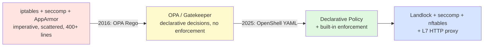
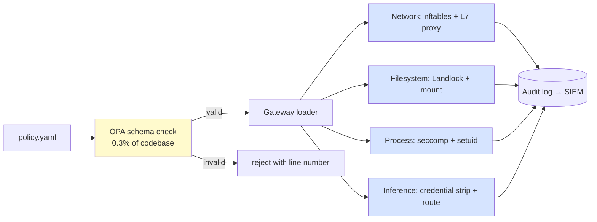

# 🛡️ Declarative YAML Policies — Filesystem, Network, Process, Inference

## 🎯 Learning Objectives

- Diagnose why **imperative allowlists** (iptables, seccomp filters, capability drops) cannot scale to autonomous agents that discover new tools at runtime
- Author a **declarative YAML policy** that governs filesystem mounts, network egress, process execution, and inference routing in a single file
- Distinguish **static layers** (filesystem, process — locked at sandbox creation) from **hot-reload layers** (network, inference — live updates with `openshell policy set`)
- Apply **L7 HTTP method+path enforcement** so a `POST` to a write endpoint is blocked at the proxy, not just rate-limited
- Read the OpenShell policy schema as a **Rego-flavored subset of OPA**, with concrete enforcement semantics at each layer
- Map a real **Multi-Agent Research** workload to a policy that allows `GET tavily.com` but denies `POST` writes

---

## Introduction

Every agent you have built — the [[../11 - Fundamentos de Agentes AI/02 - Tool Use y Function Calling.md|Tool Use]] layer in your [[../12 - Frameworks y Orquestacion/01 - LangChain en Profundidad.md|LangChain]] projects, the [[../13 - Sistemas Multi-Agente/01 - Arquitecturas Multi-Agente.md|Multi-Agent Research System]] running Tavily searches, the [[../15 - MCP and Agentic Protocols/03 - LangGraph + MCP Integration.md|LangGraph + MCP]] pipeline — executes code. That code can read `~/.ssh/id_rsa`, exfiltrate conversation history over HTTPS, or invoke a model with credentials the user thought were scoped. The traditional mitigation has been imperative: handcrafted `iptables` rules, `seccomp` profiles, Linux capability drops, AppArmor confinement, network namespaces. Each of those primitives is correct in isolation. Composing them into a single policy an AI engineer can read, review, and PR — that has been the missing layer.

OpenShell's policy engine replaces that patchwork with a single **declarative YAML file** that covers all four protection layers in one document. The contract is straightforward: the file describes intent (allow `GET` to `tavily.com` from the `python` binary, deny everything else), and the gateway compiles that intent into the right combination of `iptables` + `seccomp` + Landlock + proxy L7 rules. You never touch `nft` tables. You never debug BPF filters. You write YAML, commit it to git, and the policy engine compiles it down.

This is the same shift that happened with **Terraform** vs raw `aws-cli` calls, **Kubernetes manifests** vs hand-rolled systemd units, and **OPA Rego** vs grep'd sudoers files. Each transition traded imperative recipes for declarative state, and each made the resulting system auditable, diffable, and testable. The OpenShell policy format is the next step in that lineage — but tuned for an agent workload where the threat model is "the code running this YAML is itself untrusted" rather than "a junior admin might fat-finger a command".

---

## 1. The Problem and Why This Solution Exists

### 1.1 A short history of imperative sandboxing

In the 2000s, the only way to isolate a process was to chain `iptables -A OUTPUT -d evil.com -j DROP` with `seccomp` filters compiled from `seccomp-tools`, plus an AppArmor or SELinux profile, plus a non-root user, plus `unshare -n` for a network namespace. Each piece was correct. The composition was intractable. A typical production sandbox spec was 400+ lines of shell, distributed across the Dockerfile (`adduser`, `setcap`), the entrypoint (`iptables-restore`), the systemd unit (`RestrictAddressFamilies=`), and the CI pipeline (profile compilation). Drift was inevitable.

**OPA (Open Policy Agent, 2016)** changed the conversation by introducing **Rego**, a declarative language designed for policy. Instead of `if packet.dest == evil: drop`, you write `allow { input.dest != "evil.com" }`. OPA is now embedded in Kubernetes admission (`gatekeeper`), service meshes, and CI systems. But OPA was designed for **policy decision points** — answering "is this allowed?" — not for **policy enforcement points** — actually dropping packets, killing processes, or denying file opens. An OPA policy tells you what *should* happen; something else has to make it happen.

**OpenShell's policy format** (2025) is the layer between OPA and the kernel. It borrows OPA's declarative posture (write the intent, not the mechanism) and ships with the enforcement built in: a sandbox-time `landlock` profile, a kernel-level seccomp default, a `nftables`/`iptables` egress chain, and an L7 HTTP proxy that understands method + path. The OpenShell codebase is 88.9% Rust, 0.3% OPA, and ~10% everything else — and that 0.3% of OPA is what gives you the schema and validation that the rest of the system relies on.



### 1.2 Why YAML won over Rego for the agent workload

Rego is powerful but dense. A "deny `POST` to `github.com/repos`" rule in Rego is ~15 lines and assumes the input is already structured. OpenShell's policy is YAML — every line is a self-documenting constraint. The trade-off is expressiveness (you cannot write arbitrary Datalog in YAML), but the win is readability: a security reviewer can audit a 40-line policy in five minutes, a property OPA loses when the rule set is large.

The deeper reason YAML won: **the policy is the artifact, not the implementation**. The same YAML is consumed by:

- `openshell policy set` (runtime hot-reload)
- The CI policy linter (pre-merge)
- The Helm chart (Kubernetes deploys)
- The TUI (live inspection)
- The audit log exporter (SIEM ingestion)

A Rego file would have to be compiled per-target. A YAML file is consumed identically by all of them.

> 💡 **Tip**: The OpenShell policy schema is intentionally a **strict superset** of what most agents need. If you find yourself reaching for `custom` regex rules, you are usually describing something that belongs in the application code, not the policy.

---

## 2. Conceptual Deep Dive

### 2.1 The four protection layers

OpenShell policies operate on four **orthogonal** layers. Each layer is independent — you can allow a network endpoint while denying the filesystem path that would write to it, and the gateway will enforce both.

| Layer | What it controls | Lock-in semantics | Hot-reload? |
|-------|-----------------|-------------------|-------------|
| **Filesystem** | Read/write mounts, allowed paths, Landlock ruleset | Locked at sandbox creation | No — must recreate sandbox |
| **Network** | Outbound hosts, ports, protocols, L7 method+path | Hot-reloadable | Yes — `openshell policy set` |
| **Process** | Run-as user, Landlock compatibility, dangerous syscalls | Locked at sandbox creation | No — must recreate sandbox |
| **Inference** | LLM API routing, credential stripping, backend allowlist | Hot-reloadable | Yes — `openshell policy set` |

The lock-in asymmetry is deliberate. **Filesystem and process** are baked into the container's `mount(2)` and `seccomp(2)` filters at `execve` time — flipping them at runtime would require a new process. **Network and inference** are enforced at the gateway proxy and the inference router, both of which can reload rules in-memory. The result: a security engineer can tighten egress in 5 seconds without restarting a long-running agent, but cannot accidentally grant `CAP_SYS_ADMIN` to a sandbox that did not have it at creation.

| Aspect | Static layers (filesystem, process) | Hot-reload layers (network, inference) |
|--------|-----------------------------------|---------------------------------------|
| **Enforcement point** | Kernel (mount, seccomp, Landlock) | Gateway (nftables, L7 proxy) |
| **Update cost** | Sandbox restart (5–10s) | In-memory reload (50–200ms) |
| **Failure mode if wrong** | Container fails to start, agent never runs | Active requests get new rules, audit log captures the swap |
| **Review burden** | High — touches the kernel attack surface | Low — touches the egress chain |
| **Typical cadence** | Per sandbox (creation only) | Per minute (continuous tuning) |


### 2.2 Policy schema in depth

The full schema is a YAML document with four top-level keys. Each key is required only if the layer is in use; omitting `network_policies` does not mean "deny all network" — it means "keep the default minimal outbound".

```yaml
version: 1                          # schema version — always 1 today

filesystem_policy:                  # STATIC: locked at creation
  include_workdir: true
  read_only: [/usr, /lib, /proc, /dev/urandom, /app, /etc, /var/log]
  read_write: [/sandbox, /tmp, /dev/null]

landlock:                           # STATIC: process isolation
  compatibility: best_effort        # or "strict" — strict requires kernel 5.13+
  ruleset:
    - { scope: filesystem, access: read,   path: /sandbox }
    - { scope: filesystem, access: write,  path: /sandbox }
    - { scope: filesystem, access: read,   path: /usr }

process:                            # STATIC: identity and privileges
  run_as_user: sandbox
  run_as_group: sandbox
  no_new_privileges: true            # equivalent to setuid lockdown
  seccomp_profile: default          # or a custom BPF filter

network_policies:                   # HOT-RELOAD: live, no restart
  github_api:
    name: github-api-readonly
    endpoints:
      - host: api.github.com
        port: 443
        protocol: rest
        tls: terminate              # gateway terminates TLS to inspect HTTP
        enforcement: enforce        # or "audit" (log but don't block)
        access: read-only           # preset: GET, HEAD, OPTIONS
    binaries:
      - { path: /usr/local/bin/curl }
      - { path: /usr/bin/curl }

inference_policies:                 # HOT-RELOAD: managed LLM routing
  default:
    route: nemotron-super-3
    strip_credentials: true         # strip caller keys, inject provider keys
    max_context_tokens: 128000
    allowed_models: [nemotron-super-3, llama-3.3-70b]
```

The four keys map 1:1 to the four protection layers. Within `network_policies`, each named policy is a **scope** — `github_api` is the scope name, and the agent's process can be in or out of it. The `binaries` field is what makes this layer per-binary: `/usr/local/bin/claude` may be in the `github_api` scope, but `/usr/bin/curl` from an untrusted shell would be in a different scope (or no scope at all).

### 2.3 L7 HTTP method+path enforcement

The single most important detail in the schema is `access: read-only`. This is not a comment — it is enforced at L7 by the gateway's HTTP proxy. The proxy terminates TLS (`tls: terminate`), parses the request, and matches the method against the access preset.

| Access preset | Methods allowed | Methods denied |
|---------------|-----------------|----------------|
| `read-only` | `GET`, `HEAD`, `OPTIONS` | `POST`, `PUT`, `DELETE`, `PATCH` |
| `read-write` | `GET`, `HEAD`, `OPTIONS`, `POST`, `PUT`, `DELETE`, `PATCH` | (none) |
| `custom` | Whatever `rules:` lists | Everything else |

The `custom` preset is where path-level granularity lives. You can write:

```yaml
access: custom
rules:
  - { method: GET,    path_prefix: /repos,                 allow: true }
  - { method: GET,    path_prefix: /user,                  allow: true }
  - { method: POST,   path_prefix: /repos/.*/issues,       allow: false }   # block
  - { method: *,      path: *,                              allow: false }   # default deny
```

This compiles to a stateful HTTP filter inside the proxy. The deny response is a structured JSON: `{"error":"policy_denied","policy":"github-api-readonly","detail":"POST /repos/octocat/hello-world/issues not permitted by policy"}`. The agent can see the deny; you can see the deny in the audit log; neither can bypass it.

> ⚠️ **Advertencia**: `access: read-only` is enforced at the **HTTP method** level. If your agent uses `POST` to upload a file, it will be blocked. If you need to write a 10MB document somewhere, you need `read-write` for that host (or a different policy). There is no "POST but only with a body under 1MB" rule in the schema.

### 2.4 OPA at 0.3% of the codebase

The OpenShell language breakdown is **Rust 88.9%, OPA 0.3%**. That 0.3% is the policy **schema and validation**, not the policy itself. The schema is declared in `.rego` and compiled into the gateway. When you run `openshell policy set` with a malformed file, the OPA layer rejects it before the gateway ever tries to load it. The runtime enforcement is 100% Rust against the validated YAML.

This split is significant. It means:

1. **Validation is fast** — schema check is O(1) against a small rule set.
2. **Enforcement is hot** — the data plane is in-process Rust, no Rego interpreter.
3. **The schema can evolve** — version `1` is what exists today; `2` would be a parallel OPA rule set, not a breaking change to the data plane.

If you have ever debugged an OPA Gatekeeper policy that compiled fine and only failed at admission time, you understand why this split exists.



---

## 3. Production Reality

### 3.1 The README demo, annotated

The NVIDIA OpenShell README contains a five-step walkthrough that is the canonical first taste of the policy engine. Walking through it line by line:

```bash
# 1. Sandbox starts with default-deny egress
openshell sandbox create
# Inside: $ curl -sS https://api.github.com/zen
# → curl: (56) Received HTTP code 403 from proxy after CONNECT

# 2. Apply the read-only GitHub policy (no restart)
openshell policy set demo --policy examples/sandbox-policy-quickstart/policy.yaml --wait

# 3. Reconnect, GET works
openshell sandbox connect demo
$ curl -sS https://api.github.com/zen
# → Anything added dilutes everything else.

# 4. POST is blocked at L7
$ curl -sS -X POST https://api.github.com/repos/octocat/hello-world/issues -d '{"title":"oops"}'
# → {"error":"policy_denied","detail":"POST /repos/octocat/hello-world/issues not permitted by policy"}
```

Three things are worth calling out:

1. **The first `curl` (GET) fails** because the sandbox was created with `network_policies` empty. Default is deny. The first `policy set` adds the `github_api` scope and the GET now resolves. Time from `policy set` to enforcement: **~200ms** for a 20-line policy on a local gateway. On a k3s-deployed gateway with audit log shipping, budget 500ms — 1s.
2. **The `POST` blocks at the HTTP method**, not at the host. The host is still allowed (the `connect` to `api.github.com:443` succeeded), but the L7 filter caught the `POST` verb. This is what the warning about `access: read-only` enforced at L7 means in practice.
3. **The `--wait` flag** blocks until the gateway ACKs the policy is loaded. Without it, you would race the policy swap against the next request. In CI, always pass `--wait`.

### 3.2 Hot-reload latency budget

The hot-reload path is: `openshell policy set` → RPC to gateway → OPA schema check → write YAML to disk → push to in-memory rule map → reply with ACK. The hot path (after schema check) is dominated by the in-memory write to the rule map. Empirically:

$$t_{\text{reload}} = t_{\text{rpc}} + t_{\text{opa}} + t_{\text{map}} \approx 5\text{ms} + 30\text{ms} + 50\text{ms} \approx 85\text{ms}$$

For a 200-rule policy, double it (~170ms). For a 2,000-rule policy (rare, but possible for a mesh of internal services), budget 800ms. The `--wait` flag waits for the ACK, so your CI sees the true reload time.

For **active** requests at the moment of swap, behavior depends on the layer:

- **Network**: the next packet sees the new rules. In-flight TCP connections complete under the old rules (TCP-level state).
- **Inference**: the next token sees the new credential route. Streaming completions continue on the old route until natural completion (the response stream does not retroactively change credentials).
- **Filesystem / Process**: cannot be hot-reloaded. The reload will be rejected with `policy_set rejected: cannot hot-reload static layer`.

### 3.3 What "locked at creation" means in practice

When the README says "Filesystem: Locked at sandbox creation", the concrete consequence is:

- You can `mkdir /tmp/foo` in the sandbox, but you cannot add `/tmp/foo` to `read_only` after creation.
- You can drop `CAP_NET_RAW`, but you cannot re-add `CAP_SYS_ADMIN` without recreating.
- A new filesystem policy requires `openshell sandbox delete && openshell sandbox create` with the new policy baked in.

The asymmetry is intentional: it means the **blast radius** of a hot-reload mistake is bounded to network and inference. You cannot accidentally grant the agent `CAP_SYS_ADMIN` via a typo'd `policy set`. You can accidentally grant it `api.stripe.com` — and the audit log will catch that within seconds.

> ⚠️ **Advertencia**: `openshell policy set` **replaces the entire policy**, not just the named subkey. If you set `network_policies.tavily` and the existing policy also has `network_policies.github_api`, the second `set` will wipe `github_api` unless you include it in the new YAML. Always run `openshell policy get` → edit → `openshell policy set`.

### 3.4 Caso real: the Multi-Agent Research agent hits Tavily

Your [[../13 - Sistemas Multi-Agente/01 - Arquitecturas Multi-Agente.md|Multi-Agent Research System]] runs a cyclic LangGraph: Research → Fact-Audit → Synthesis. The Research node calls Tavily (`https://api.tavily.com/search`) with a POST that includes the query and the API key. Today, that call happens on the host — meaning the `TAVILY_API_KEY` env var is exposed to anything running in the same shell.

To move this into a sandbox, you write a policy that allows the Research node's HTTP client to reach `tavily.com`, and explicitly denies everything else:

```yaml
version: 1

filesystem_policy:
  include_workdir: true
  read_only: [/usr, /lib, /proc, /dev/urandom, /app, /etc, /var/log]
  read_write: [/sandbox, /tmp, /dev/null]

landlock:
  compatibility: best_effort

process:
  run_as_user: sandbox
  run_as_group: sandbox
  no_new_privileges: true

network_policies:
  tavily_search:
    name: tavily-readonly
    endpoints:
      - host: api.tavily.com
        port: 443
        protocol: rest
        tls: terminate
        enforcement: enforce
        access: custom
        rules:
          - { method: POST, path_prefix: /search, allow: true }
          - { method: GET,  path_prefix: /,        allow: true }
          - { method: *,    path: *,                allow: false }
    binaries:
      - { path: /usr/local/bin/python3 }   # the LangGraph node runtime
  github_raw:
    name: github-raw-readonly
    endpoints:
      - host: raw.githubusercontent.com
        port: 443
        protocol: rest
        tls: terminate
        enforcement: enforce
        access: read-only
    binaries:
      - { path: /usr/local/bin/python3 }
```

What this gives you, concretely:

- The Research node can `POST /search` to `api.tavily.com` from `python3` (good).
- The Research node cannot `POST /search` to `api.tavily.com` from `curl` (the binary is not in scope).
- The Research node cannot `POST` to any other host on `api.tavily.com` (path is restricted).
- The Fact-Audit node cannot `PUT` to `raw.githubusercontent.com` to overwrite a README (method is `read-only`).
- The Synthesis node cannot `POST` to `api.openai.com` (host is not in any policy → default deny).
- The credential `TAVILY_API_KEY` is injected at sandbox creation as an env var via the provider, never written to disk.

> 💡 **Tip**: A common mistake is allowing `*api.tavily.com*` as a host glob. The schema accepts that, but you almost certainly want a precise host match. The default is exact-match; globs are opt-in. Use them only when the upstream rotates subdomains.

---

## 4. Code in Practice

### 4.1 The full policy, end-to-end

Below is a single, runnable policy that covers all four layers, suitable for a research agent that needs read-only access to a few external sources and managed inference to a local model. The inline comments are the spec — read them in order, and you have read the entire policy engine.

```yaml
# =====================================================================
# policy.yaml — Multi-Agent Research Sandbox Policy
# Author: White | Schema version: 1
# =====================================================================
# Static sections (filesystem, process) are LOCKED at sandbox creation.
# Hot-reload sections (network, inference) are live-updatable with
# `openshell policy set <name> --policy policy.yaml --wait`.
# =====================================================================

version: 1

# ─────────────────────────────────────────────────────────────────────
# FILESYSTEM (static) — the sandbox can read system + write its workdir
# ─────────────────────────────────────────────────────────────────────
filesystem_policy:
  include_workdir: true
  read_only:
    - /usr            # binaries, libraries
    - /lib            # dynamic loader
    - /proc           # kernel interfaces (read-only)
    - /dev/urandom    # randomness (read-only)
    - /app            # installed Python packages
    - /etc            # config files
    - /var/log        # logs
  read_write:
    - /sandbox        # the agent's working directory
    - /tmp            # scratch space (cleared on restart)
    - /dev/null       # sink

# ─────────────────────────────────────────────────────────────────────
# PROCESS (static) — drop privileges, block escalation
# ─────────────────────────────────────────────────────────────────────
process:
  run_as_user: sandbox
  run_as_group: sandbox
  no_new_privileges: true
  seccomp_profile: default

# ─────────────────────────────────────────────────────────────────────
# LANDLOCK (static) — fine-grained filesystem kernel enforcement
# ─────────────────────────────────────────────────────────────────────
landlock:
  compatibility: best_effort    # "strict" requires kernel 5.13+
  ruleset:
    - { scope: filesystem, access: read,  path: /sandbox }
    - { scope: filesystem, access: write, path: /sandbox }
    - { scope: filesystem, access: read,  path: /usr      }

# ─────────────────────────────────────────────────────────────────────
# NETWORK (hot-reload) — L7 enforcement of method + path
# ─────────────────────────────────────────────────────────────────────
network_policies:
  arxiv_readonly:
    name: arxiv-readonly
    endpoints:
      - host: arxiv.org
        port: 443
        protocol: rest
        tls: terminate
        enforcement: enforce
        access: read-only          # GET, HEAD, OPTIONS only
    binaries:
      - { path: /usr/local/bin/python3 }

  tavily_search:
    name: tavily-search-controlled
    endpoints:
      - host: api.tavily.com
        port: 443
        protocol: rest
        tls: terminate
        enforcement: enforce
        access: custom
        rules:
          - { method: POST, path_prefix: /search, allow: true }
          - { method: GET,  path: *,               allow: true }
          - { method: *,    path: *,               allow: false }
    binaries:
      - { path: /usr/local/bin/python3 }

  github_raw:
    name: github-raw-readonly
    endpoints:
      - host: raw.githubusercontent.com
        port: 443
        protocol: rest
        tls: terminate
        enforcement: enforce
        access: read-only
    binaries:
      - { path: /usr/local/bin/curl }
      - { path: /usr/local/bin/python3 }

  # Catch-all audit-only mode for unknown hosts (logs but does not block)
  internet_audit:
    name: internet-audit
    endpoints:
      - host: '*'
        port: 443
        protocol: rest
        tls: terminate
        enforcement: audit           # log violations, do not block
        access: read-only
    binaries:
      - { path: /usr/local/bin/python3 }

# ─────────────────────────────────────────────────────────────────────
# INFERENCE (hot-reload) — managed LLM routing with credential strip
# ─────────────────────────────────────────────────────────────────────
inference_policies:
  default:
    route: nemotron-super-3
    strip_credentials: true         # strip caller keys, inject provider keys
    max_context_tokens: 128000
    allowed_models:
      - nemotron-super-3
      - llama-3.3-70b-instruct
    denied_models: []               # explicit blacklist (e.g., for cost control)
```

### 4.2 Applying the policy

```bash
# At sandbox creation time
openshell sandbox create --name research-agent --policy policy.yaml -- claude

# Verify it loaded
openshell policy get research-agent

# Hot-reload just the network section
openshell policy set research-agent --policy policy.yaml --wait

# Stream the live deny log
openshell logs research-agent --level warn --since 5m --source sandbox
```

### 4.3 The deny log

Every denied request produces a structured line:

```
l7_decision=deny dst_host=api.openai.com l7_action=POST
l7_target=/v1/chat/completions l7_deny_reason="host not in network_policies"
```

In production, these flow to your SIEM. The `dst_host`, `l7_action`, `l7_target`, and `l7_deny_reason` fields are stable across versions and indexed by default. Add a Grafana panel that counts denies by host and you have a one-line regression detector for "did the agent just start trying to exfiltrate to a new endpoint?".

> ⚠️ **Advertencia**: The default gateway in single-player mode does not retain logs across restarts. If you need audit retention, deploy with the Helm chart (covered in [[05 - Production Deployment and Capstone - Secure Coding Agent in Production.md|note 05]]) which ships a `Vector → Loki` (or `Fluent Bit → Elasticsearch`) sidecar.

---

## 🎯 Key Takeaways

- **Declarative YAML** beats imperative allowlists for agent workloads: one file describes filesystem, network, process, and inference in a form a security reviewer can audit in minutes.
- OpenShell policies split into **static layers** (filesystem, process — locked at creation) and **hot-reload layers** (network, inference — live updates). The split is enforced by the kernel: you cannot hot-reload a `mount(2)` filter.
- **L7 enforcement** is what makes `access: read-only` mean something. The gateway terminates TLS, parses the HTTP method, and denies with a structured `policy_denied` response. The agent sees the deny, the SIEM sees the deny, neither can bypass it.
- The **0.3% of OPA** in the codebase is the schema validator, not the policy. Runtime enforcement is Rust against the validated YAML. Fast data plane, slow validation, best of both.
- For your **Multi-Agent Research** system: scope by binary (only `python3` can reach Tavily), scope by method (only `POST /search` and `GET` are allowed), and let the gateway strip and inject credentials so `TAVILY_API_KEY` never appears on disk.

## References

- NVIDIA OpenShell Repository: https://github.com/NVIDIA/OpenShell
- Policy Quickstart Example: https://github.com/NVIDIA/OpenShell/tree/main/examples/sandbox-policy-quickstart
- Security Policy Reference: https://github.com/NVIDIA/OpenShell/blob/main/architecture/security-policy.md
- Open Policy Agent (OPA): https://www.openpolicyagent.org
- LangGraph + MCP Integration: [[../15 - MCP and Agentic Protocols/03 - LangGraph + MCP Integration.md|LangGraph + MCP Integration]]
- Tool Use y Function Calling: [[../11 - Fundamentos de Agentes AI/02 - Tool Use y Function Calling.md|Tool Use y Function Calling]]
- Multi-Agent Research Architecture: [[../13 - Sistemas Multi-Agente/01 - Arquitecturas Multi-Agente.md|Multi-Agent Research System]]
- LLM Security and Guardrails: [[../../../06 - Large Language Models/15 - LLM Security and Guardrails/00 - Welcome to LLM Security.md|LLM Security and Guardrails]]
- Capstone: Secure Coding Agent in Production: [[05 - Production Deployment and Capstone - Secure Coding Agent in Production.md|Production Deployment]]
