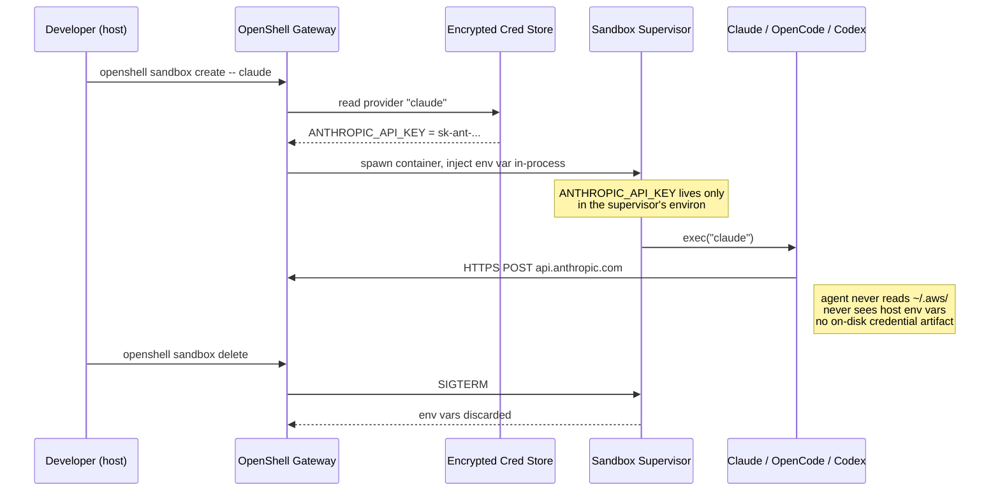

# 🤝 Agent Integrations — Claude, OpenCode, Codex, Copilot, Deep Agents, Hermes, OpenClaw

## 🎯 Learning Objectives

- Diagnose the **credential leak problem** when an autonomous agent runs directly on the host with shell access to `~/.ssh/`, `~/.aws/`, and `~/.config/`
- Master OpenShell's **provider abstraction** — credentials are injected as environment variables at sandbox runtime and never written to the sandbox filesystem
- Wire your [[../15 - MCP and Agentic Protocols/03 - LangGraph + MCP Integration.md|LangGraph + MCP]] agent into a sandbox using the **`OpenShellBackend`** pattern (a drop-in `ModalBackend` replacement)
- Choose between the supported agents: **Claude Code, OpenCode, Codex, GitHub Copilot CLI, OpenClaw, Hermes, Ollama, Pi** — by environment variable, out-of-the-box availability, and source distribution
- Compare **NemoClaw** (the OpenClaw + Hermes blueprint) and **openshell-deepagent** (the LangChain reference) as the two reference stacks for production agent deployment
- Cross-link your existing [[../13 - Sistemas Multi-Agente/01 - Arquitecturas Multi-Agente.md|Multi-Agent Research System]] to a credential-scoped, policy-governed sandbox runtime

---

## Introduction

You have built an agent. The agent uses the [[../11 - Fundamentos de Agentes AI/02 - Tool Use y Function Calling.md|Tool Use]] pattern to call Tavily, [[../12 - Frameworks y Orquestacion/01 - LangChain en Profundidad.md|LangChain]] to chain LLM calls, and [[../15 - MCP and Agentic Protocols/03 - LangGraph + MCP Integration.md|LangGraph + MCP]] to discover tools at runtime. It works on your dev laptop. Now you want to give it a real API key — `ANTHROPIC_API_KEY`, `OPENAI_API_KEY`, `TAVILY_API_KEY` — and run it on a colleague's machine, on a CI runner, or in a long-lived pod. The first thing that breaks is **credentials**.

The default for any agent framework today is to read credentials from the host's environment or `~/.config/` directory. That means an agent running on the same shell as you has read access to `~/.ssh/id_rsa`, `~/.aws/credentials`, `~/.docker/config.json`, the entire `~/.kube/`, the contents of your browser's cookie store, and every other token you have ever used. This is the **credential leak problem**: agents get root by default, and most agents are not audited for what they read before they read it. The [[../../../06 - Large Language Models/15 - LLM Security and Guardrails/00 - Welcome to LLM Security.md|LLM Security]] discipline treats this as a first-class threat; the OpenShell provider abstraction is the runtime that enforces it.

OpenShell's solution is a thin, opinionated **provider** layer. A provider is a named credential bundle (`claude`, `openai`, `tavily`, `github`) that the gateway knows about. When you create a sandbox, you reference one or more providers; the gateway injects the credentials as **environment variables at runtime** into the supervisor process — never into the container image, never into a file in the sandbox. If the agent reads `~/.aws/credentials`, it sees nothing. If the agent runs `printenv`, it sees the scoped env vars from the providers, and nothing else. Combined with the [[03 - Declarative YAML Policies - Filesystem, Network, Process, Inference.md|YAML policy]] from the previous note, you have an agent that can only call the LLM APIs you authorized, only from the binary you authorized, only over the network paths you authorized.

This is the same shape as HashiCorp Vault's dynamic secrets or AWS IAM's role assumption: the **agent identity is distinct from the host identity**, and the scope of access is auditable, time-bound, and policy-gated. The implementation just happens to be a YAML file and a sandbox container.

---

## 1. The Problem and Why This Solution Exists

### 1.1 The credential leak on a hostile host

Consider what an agent can read **without** OpenShell, on a typical dev laptop:

| Path | Contents | Risk if agent reads it |
|------|----------|------------------------|
| `~/.ssh/id_rsa` | Private SSH key | Lateral movement to every server that key can reach |
| `~/.aws/credentials` | Long-lived AWS access keys | Account takeover, S3 exfiltration, EC2 cryptomining |
| `~/.kube/config` | Kubernetes contexts | Cluster admin on every context, `kubectl exec` into prod pods |
| `~/.docker/config.json` | Registry auth | Push malicious images to your private registry |
| `~/.config/gh/hosts.yml` | GitHub tokens | Push to repos, read private code, create releases |
| `~/.npmrc` / `~/.pypirc` | Package publish tokens | Publish backdoored packages in your name |
| `~/.netrc` | Plaintext HTTP basic auth | Reuse on CI, internal services |
| `~/.bash_history` | Everything you've ever typed | Credential recon for every service you've used |
| `~/Documents/*` | Source code, secrets, customer data | IP exfiltration, GDPR violation |

Most agent frameworks — LangGraph, CrewAI, AutoGen, the OpenAI Agents SDK — assume the host is friendly. They import `os.environ["OPENAI_API_KEY"]` and trust that whatever they read is intentional. This is the same assumption that `chmod 777 ~` made in 1995: the host is friendly, so why worry?

OpenShell's stance is the opposite. The host is **hostile-by-default to the agent**, and the agent is **untrusted-by-default to the host**. The provider abstraction is the firewall between them. The agent sees exactly the env vars in the provider manifest. Nothing else exists.

### 1.2 What "credential injection at runtime" means

The OpenShell gateway runs a control plane that holds the **real** credentials — encrypted at rest with a key the gateway process holds in memory, never on disk. When you create a sandbox with `openshell sandbox create -- claude`, the gateway:

1. Reads the `claude` provider record from its own config.
2. Spawns the sandbox container.
3. Starts the supervisor process inside the container.
4. Injects the env var (`ANTHROPIC_API_KEY=...`) into the supervisor's `environ` block — **after** the container starts, **without** writing it to any file inside the container.
5. The supervisor launches the agent (`claude`), which inherits the env var.

The container image on disk has no credentials. A `docker exec` into the container shows no `~/.aws/`. A `tar` of the container filesystem and `strings | grep AKIA` shows nothing. The credentials live for the lifetime of the supervisor process and die with it.



### 1.3 What "auto-discovered" means and when to use it

The CLI auto-discovers credentials for Claude, Codex, OpenCode, and Copilot from your shell environment. If `ANTHROPIC_API_KEY` is set on the host, the gateway notices and offers to use it as the provider — without you running `openshell provider create` explicitly. This is the "I just want to run `claude`" path.

For the "I need to ship this to production with a different key per environment" path, you create providers explicitly with `openshell provider create --type claude --from-existing` and reference them by name. The CLI is the same; the source of truth is the gateway, not the host.

---

## 2. Conceptual Deep Dive

### 2.1 The provider record

A provider record is a small JSON object the gateway stores. You do not edit it directly — `openshell provider create` writes it for you.

```json
{
  "name": "claude-prod",
  "type": "claude",
  "env_var": "ANTHROPIC_API_KEY",
  "source": "keyring:anthropic-prod",
  "created_at": "2026-05-14T19:00:00Z",
  "tags": ["production", "us-east"]
}
```

- `name`: how you reference it (`--provider claude-prod`).
- `type`: the well-known type. Drives the auto-discovery heuristic and the validation rules (e.g., Claude keys start with `sk-ant-`).
- `env_var`: the variable name injected into the sandbox.
- `source`: where the secret physically lives. `keyring:`, `env:`, `vault:`, `file:` are all valid.
- `tags`: free-form, used for policy (`--allow-providers=production`).

### 2.2 The injection contract

When a sandbox starts, the gateway sets env vars in this order:

1. **Static**: anything in the provider record's `env:` block (e.g., `ANTHROPIC_BASE_URL=https://api.anthropic.com`).
2. **Secret**: the credential itself (e.g., `ANTHROPIC_API_KEY=...`).
3. **Sandbox metadata**: `OPENSHELL_SANDBOX_NAME`, `OPENSHELL_GATEWAY_URL`, `OPENSHELL_POLICY_HASH` — for agent self-awareness.

The agent cannot extend the set, cannot read unset vars, and cannot override the injected values with shell `export`. The env block is a **firewall** — what gets in is what the gateway put there, nothing more.

### 2.3 The supported-agent matrix

| Agent | Env var injected | Works OOTB (base image) | Source | Notes |
|-------|------------------|--------------------------|--------|-------|
| **Claude Code** | `ANTHROPIC_API_KEY` | Yes | `sandboxes/base/` | Anthropic's CLI. Most direct integration. |
| **OpenCode** | `OPENAI_API_KEY` or `OPENROUTER_API_KEY` | Yes | `sandboxes/base/` | Multi-model router. The `OPENROUTER_API_KEY` path routes to Anthropic, OpenAI, etc. |
| **Codex** | `OPENAI_API_KEY` | Yes | `sandboxes/base/` | OpenAI's coding CLI. `o3`, `o4-mini`, `gpt-4.1` families. |
| **GitHub Copilot CLI** | `GITHUB_TOKEN` or `COPILOT_GITHUB_TOKEN` | Yes | `sandboxes/base/` | Wraps the Copilot API. Token must have Copilot entitlement. |
| **OpenClaw** | `OPENCLAW_API_KEY` | Yes (via NemoClaw) | `NemoClaw` blueprint | Always-on agent. NemoClaw wraps it with managed inference. |
| **Hermes** | `HERMES_API_KEY` | Yes (via NemoClaw) | `NemoClaw` blueprint | Set `NEMOCLAW_AGENT=hermes` at install. |
| **Ollama** | (none — local) | Community `--from ollama` | `OpenShell-Community/sandboxes/ollama` | No API key needed; runs `ollama serve` inside the sandbox. |
| **Pi** | (none — local) | Community `--from pi` | `OpenShell-Community/sandboxes/pi` | `pi.dev` runtime. |

The "Works OOTB" column matters because the `base` image already has the binary installed, the user created, and the wrapper script wired. To run Claude today: `openshell sandbox create -- claude`. To run Ollama: `openshell sandbox create --from ollama`. The two paths differ because Ollama is a local server, not an API client, and the community sandbox is configured to run `ollama serve` on startup.

### 2.4 Provider types: API-key, keyring, vault, file

OpenShell supports four credential sources:

- **`env:`** — pulled from the host's environment at sandbox creation. Convenient for dev, risky for CI.
- **`keyring:`** — pulled from the OS keyring (macOS Keychain, Linux `secret-tool`). The host process must have access; the gateway does not.
- **`vault:`** — pulled from HashiCorp Vault at runtime, with a token. This is the production-recommended path.
- **`file:`** — read from a file with a `0600` permission check. Last resort; usually a CI-mounted secret.

In a production deployment, **`vault:` is the only sane choice** because the secret never exists in plaintext on the host at all. The gateway's `VAULT_TOKEN` is the only credential the host needs.

---

## 3. Production Reality

### 3.1 Deep dive: `langchain-ai/openshell-deepagent`

The `langchain-ai/openshell-deepagent` repository is the reference integration for LangGraph users. It packages a **drop-in `OpenShellBackend`** for Deep Agents — a class you import and pass to the agent constructor, replacing `ModalBackend` with one line of code change.

The architecture (paraphrased from the project README):

```mermaid
graph TB
    subgraph LG["LangGraph Dev Server (127.0.0.1:2024)"]
        DA[Deep Agent<br/>NVIDIA Nemotron Super 3<br/>tools: execute, write_file, read_file,<br/>edit_file, glob, grep, ls]
        OB[OpenShellBackend]
        FB[FilesystemBackend]
        DA --> OB
        DA --> FB
    end
    OB -->|gRPC| GW[OpenShell Gateway<br/>k3s in Docker]
    GW --> SC[Sandbox Container<br/>policy-enforced]
    FB --> MD[/memory/AGENTS.md<br/>/skills/*.md<br/>local disk]
    style DA fill:#e0f8e0
    style OB fill:#d6e4ff
    style GW fill:#fffacd
    style SC fill:#ffe4e1
```

The key insight from the README: *"This is a drop-in replacement for Modal — swap `ModalBackend` → `OpenShellBackend` and everything else (memory, skills, subagents) stays the same."* That is the engineering achievement. The Deep Agents framework was already backend-agnostic (it abstracts code execution behind a `BaseSandbox` interface); OpenShell just added a new backend implementation. Your existing memory, subagent spawn, and tool contracts continue to work — the only thing that changes is where the `execute()` calls land.

The `OpenShellBackend` translates deep-agent primitives into OpenShell gRPC calls:

- `write_file(path, content)` → sandbox shell: `cat > path << 'EOF' ... EOF`
- `read_file(path)` → sandbox shell: `cat path`
- `execute(cmd)` → `SandboxSession.exec(cmd)` over the gateway gRPC channel
- `edit_file(path, old, new)` → `sed -i` or a Python in-place rewrite
- `glob(pattern)` / `grep(pattern)` → `find` / `grep` invocations

The writable working directory is `/sandbox`. The agent can `write_file("/sandbox/hello.txt", ...)` but cannot write anywhere else — enforced by the Landlock ruleset in the policy.

### 3.2 Deep dive: `NVIDIA/NemoClaw`

NemoClaw is the reference stack for **always-on agents** — OpenClaw (the default) and Hermes. It is not just a sandbox; it is a **plugin system** that wraps the agent with managed inference, network policy, lifecycle, and a single CLI.

The key differences from raw OpenShell:

1. **Managed inference**: NemoClaw routes LLM calls through the gateway's `inference.local` or a configured NVIDIA NIM endpoint, **stripping the caller's API key** and injecting the gateway's key. The agent code never needs to know the model is being proxied.
2. **Network policy baseline**: NemoClaw ships a **default network policy** with operator-approval flow. New hosts require a human in the loop, not just a YAML edit.
3. **Plugin system**: NemoClaw agents are plugins (`nemoclaw-plugin-...`) with a defined lifecycle: `init` → `run` → `shutdown`. You can build your own agent on top.
4. **Blueprint lifecycle**: a NemoClaw "blueprint" is a versioned, signed policy + agent bundle. The blueprint is the unit of deployment.

For the always-on agent use case (long-running OpenClaw in production), NemoClaw is the right choice. For the one-shot coding agent use case (run `claude` in a sandbox, finish the task, kill it), raw OpenShell + the `base` image is the right choice.

### 3.3 Cross-link to your existing systems

The provider abstraction composes with what you have already built:

- **[[../15 - MCP and Agentic Protocols/03 - LangGraph + MCP Integration.md|LangGraph + MCP Integration]]** uses an MCP client to discover tools. The provider is orthogonal — you can discover tools via MCP and call LLMs via the OpenShell-managed inference. The MCP client itself can run inside the sandbox; the gateway still proxies outbound.
- **[[../13 - Sistemas Multi-Agente/01 - Arquitecturas Multi-Agente.md|Multi-Agent Research System]]** can be deployed as a single sandbox with the Research / Fact-Audit / Synthesis nodes as LangGraph subgraphs, all sharing the same provider-injected env vars and the same network policy.
- **[[../15 - MCP and Agentic Protocols/05 - Agent Evaluation and Observability.md|Agent Evaluation]]** can target the sandbox by tracing the `openshell logs` output, the `policy get` snapshots, and the LangGraph traces — three data sources joined by sandbox name and run ID.
- **[[../../../16 - Harness Engineering/00 - Welcome to Harness Engineering and SDD.md|Harness Engineering]]** is the next layer up: the policy is the *spec*, the sandbox is the *runtime*, the agent is the *actor*. Verification (covered in [[../../../16 - Harness Engineering/08 - Verification and Quality Gates.md|Verification and Quality Gates]]) becomes "did the agent stay inside the policy?".

---

## 4. Code in Practice

### 4.1 Creating a provider and a sandbox

The shortest path to a working, credential-scoped agent:

```bash
# 1. Create the provider from an existing host env var
openshell provider create --type claude --from-existing --name claude-prod

# 2. Create the sandbox and attach the provider
openshell sandbox create --name research-agent --provider claude-prod --policy policy.yaml -- claude

# 3. Inside the sandbox, the env var is present
$ printenv | grep ANTHROPIC
ANTHROPIC_API_KEY=sk-ant-...

# 4. But the host's other secrets are NOT present
$ printenv | grep AWS
(empty)

# 5. The agent runs
$ claude "Summarize the README"
```

The `--policy` flag bakes the YAML policy from the previous note into the sandbox at creation. The `-- claude` after the sandbox flags is the **agent command** — the supervisor `exec`s it inside the container.

### 4.2 Deep Agents + OpenShellBackend

If you are building a custom agent on top of Deep Agents, the integration is a class swap:

```python
# agent.py
from deepagents import create_deep_agent
from deepagents.backends import OpenShellBackend, FilesystemBackend
from langchain_nvidia_ai_endpoints import ChatNVIDIA

# 1. The model — Nemotron Super 3 via NVIDIA NIM
model = ChatNVIDIA(model="nemotron-super-3", api_key=os.environ["NVIDIA_API_KEY"])

# 2. The sandbox backend — code execution in OpenShell
sandbox_backend = OpenShellBackend(
    gateway_url=os.environ["OPENSHELL_GATEWAY_URL"],   # e.g. https://127.0.0.1:8080
    sandbox_name=os.environ["OPENSHELL_SANDBOX_NAME"],  # e.g. deepagent-sandbox
)

# 3. The filesystem backend — memory/skills persisted on the local disk
fs_backend = FilesystemBackend(
    root_dir="./agent_state",
    virtual_paths={"/memory": "./agent_state/memory", "/skills": "./agent_state/skills"},
)

# 4. The agent — drop-in for ModalBackend
agent = create_deep_agent(
    model=model,
    backends={"sandbox": sandbox_backend, "filesystem": fs_backend},
    tools=[],   # Deep Agents provides execute, write_file, read_file, edit_file, glob, grep, ls
)

# 5. Invoke
result = await agent.ainvoke({
    "messages": [{"role": "user", "content": "Write a Python script that computes 100 digits of pi."}]
})
print(result["messages"][-1]["content"])
```

The `OpenShellBackend` is a `BaseSandbox` implementation. Every `agent.ainvoke()` that triggers a code-execution tool call becomes a `SandboxSession.exec()` round-trip to the gateway. Every `write_file` becomes a shell command inside the sandbox. Every deny from the L7 policy becomes a Python `PolicyDeniedError` raised in the agent loop, which the framework catches and surfaces to the LLM as a tool error.

### 4.3 Hot-swapping providers mid-session

One of the more interesting patterns: rotate the LLM key without restarting the sandbox.

```bash
# 1. Create a new provider with a new key
openshell provider create --type claude --from-existing --name claude-rotated

# 2. Atomically swap the provider on a running sandbox
openshell provider set research-agent --provider claude-rotated --wait

# 3. The next LLM call uses the new key; in-flight calls complete on the old one
$ claude "..."
```

This is the runtime equivalent of Kubernetes' `kubectl rollout` for secrets. The audit log captures the swap, the policy hash changes, and the agent's behavior is consistent across the rotation (same model, same system prompt, new key).

> ⚠️ **Advertencia**: A `provider set` is **not a policy change**. The agent can still do everything the policy allows — the swap is a key rotation, not a privilege change. If you want to revoke the agent's ability to call Claude entirely, delete the sandbox.

### 4.4 Caso real: integrating the Multi-Agent Research System

Your [[../13 - Sistemas Multi-Agente/01 - Arquitecturas Multi-Agente.md|Multi-Agent Research System]] today is a LangGraph `StateGraph` that runs on your laptop, calls Tavily with a hardcoded `TAVILY_API_KEY` from `os.environ`, and writes intermediate artifacts to `./research_state/`. To move it into a sandboxed runtime, the integration is the `OpenShellBackend` from §4.2 wired into the existing `Research` and `FactAudit` nodes, plus a provider for the Tavily key.

The wiring looks like this:

```python
# research_agent.py
import os
from typing import TypedDict
from langgraph.graph import StateGraph, END
from langchain_openai import ChatOpenAI
from deepagents.backends import OpenShellBackend, FilesystemBackend

class ResearchState(TypedDict):
    query: str
    raw_results: list[dict]
    verified: list[dict]
    synthesis: str

# Provider: created on the host with `openshell provider create --type tavily --name tavily-prod`
# At sandbox start, TAVILY_API_KEY is injected as an env var into the supervisor process.
tavily = ChatOpenAI(
    base_url="https://api.tavily.com/search",
    api_key=os.environ["TAVILY_API_KEY"],   # injected, never on disk
    model="tavily-search",
)

sandbox = OpenShellBackend(
    gateway_url=os.environ["OPENSHELL_GATEWAY_URL"],
    sandbox_name="research-agent",
)

filesystem = FilesystemBackend(root_dir="./agent_state")

def research_node(state: ResearchState) -> ResearchState:
    """Call Tavily, persist raw results, return state."""
    response = tavily.invoke({"query": state["query"]})
    sandbox.write_file("/sandbox/raw_results.json", response.json())
    state["raw_results"] = response.json()["results"]
    return state

def fact_audit_node(state: ResearchState) -> ResearchState:
    """Cross-check facts against local corpus using python in the sandbox."""
    code = """
import json
results = json.load(open('/sandbox/raw_results.json'))
verified = [r for r in results if len(r['content']) > 200]
print(f'Verified {len(verified)} of {len(results)} sources')
json.dump(verified, open('/sandbox/verified.json', 'w'))
"""
    sandbox.execute(code)
    state["verified"] = json.loads(sandbox.read_file("/sandbox/verified.json"))
    return state

g = StateGraph(ResearchState)
g.add_node("research", research_node)
g.add_node("audit",    fact_audit_node)
g.add_edge("research", "audit")
g.add_edge("audit",    END)
g.set_entry_point("research")
graph = g.compile()
```

The network policy from [[03 - Declarative YAML Policies - Filesystem, Network, Process, Inference.md|note 03]] governs which hosts `python3` can reach (`api.tavily.com` POST only, `arxiv.org` GET only, `raw.githubusercontent.com` GET only). The provider governs the credential. The sandbox governs where the code runs and what it can see. The LangGraph graph itself is unchanged from your existing project.

Three things you do not have to change:

1. **The graph structure** — the `StateGraph` definition is identical to the laptop version.
2. **The state shape** — `ResearchState` is the same `TypedDict`.
3. **The tool calling semantics** — `tavily.invoke()` works the same way; the OpenShellBackend just gives you an audited, policy-bounded execution path for the `sandbox.execute()` call inside `fact_audit_node`.

### 4.5 Community agents: Ollama and Pi

The community sandboxes are worth their own note because the deployment model is different. Ollama and Pi are **local servers** — they run inside the sandbox and serve the model over `http://127.0.0.1:11434` (Ollama) or Pi's own port. There is no `API_KEY` to inject.

```bash
# Ollama — local model server, no API key
openshell sandbox create --from ollama --name local-llm

# Inside the sandbox:
$ curl http://127.0.0.1:11434/api/tags
{"models":[{"name":"llama3.2:3b","size":2000000000}, ...]}

$ ollama run llama3.2 "Explain Landlock in one paragraph"
```

The interesting policy question for local agents: the egress network policy still applies. If your Ollama sandbox tries to call `api.openai.com` for any reason, it is blocked. The agent has a local model but no escape hatch to the open internet unless the policy says so.

For Pi (`pi.dev`), the integration is the same pattern: `--from pi` to launch, the binary runs inside the sandbox, and the network policy governs outbound. Pi is a coding-agent runtime in the same family as Claude Code and OpenCode, so the workflow is: `openshell sandbox create --from pi -- pi "edit src/main.rs"`.

> 💡 **Tip**: The `--from` flag accepts three kinds of source: a community catalog name (`ollama`, `pi`, `gemini`, `droid`, `sdg`), a local path to a `Dockerfile`, or a remote container image. The `BYOC` (Bring Your Own Container) path is how you ship a sandbox with custom tools, internal CLIs, or specialized base images.

### 4.6 Provider lifecycle: the four operations

A provider has exactly four lifecycle operations:

| Command | Effect |
|---------|--------|
| `openshell provider create --type X --from-existing --name Y` | Create from host env var, keyring, or vault |
| `openshell provider list` | Show all providers (names + types, never values) |
| `openshell provider set <sandbox> --provider Y --wait` | Hot-swap on a running sandbox |
| `openshell provider delete Y` | Remove from the gateway (kills any sandboxes using it) |

The `provider list` output is intentionally redacted — you see the provider name, type, and the **first 4 + last 4 characters of the key** (`sk-ant-...-A1b2`), never the full secret. The full secret is recoverable only by the gateway, never by a human caller.

The `provider delete` operation is **destructive and cascading**: any sandbox currently using the provider will fail its next LLM call with `provider_not_found`. The audit log captures the deletion; the deny log captures every subsequent call attempt. This is intentional — there is no soft delete for credentials.

---

## 📦 Compression Code

```python
# OPENSHELL_PROVIDER: Credential injection via env vars, never on disk.
# Source: github.com/NVIDIA/OpenShell + langchain-ai/openshell-deepagent
#
# Flow: openshell provider create → openshell sandbox create --provider X -- cmd
# Env var lives in supervisor environ, dies with sandbox, never on container FS.
#
# Supported agents (env var):
#   Claude Code    → ANTHROPIC_API_KEY          (base image)
#   OpenCode       → OPENAI_API_KEY / OPENROUTER_API_KEY  (base image)
#   Codex          → OPENAI_API_KEY             (base image)
#   Copilot CLI    → GITHUB_TOKEN               (base image)
#   OpenClaw       → OPENCLAW_API_KEY           (NemoClaw blueprint)
#   Hermes         → HERMES_API_KEY             (NemoClaw blueprint)
#   Ollama         → (none, local)              (community --from ollama)
#   Pi             → (none, local)              (community --from pi)
#
# Drop-in pattern for Deep Agents:
#   from deepagents.backends import OpenShellBackend
#   sandbox = OpenShellBackend(gateway_url=..., sandbox_name=...)
#   agent = create_deep_agent(model=..., backends={"sandbox": sandbox})
```

## 🎯 Key Takeaways

- The **credential leak problem** is real and pre-OpenShell was unsolved for agent workloads. An agent on the host with shell access can read `~/.ssh/`, `~/.aws/`, and `~/.kube/` by default.
- The **provider abstraction** is the firewall: credentials are injected as env vars at sandbox runtime, never written to a file in the container, and die with the supervisor process.
- Eight agents work out-of-the-box across the `base` and community images, with `NemoClaw` wrapping the always-on OpenClaw/Hermes pattern and `openshell-deepagent` wrapping the LangGraph one-shot pattern.
- **`OpenShellBackend`** is a drop-in `ModalBackend` replacement for Deep Agents — one class swap, no other code changes.
- For your existing **Multi-Agent Research System**, this is the production deployment path: LangGraph inside the sandbox, Tavily reachable via policy, `TAVILY_API_KEY` injected at runtime.

## References

- NVIDIA OpenShell: https://github.com/NVIDIA/OpenShell
- OpenShell Community: https://github.com/NVIDIA/OpenShell-Community
- OpenShell Deep Agent (LangChain reference): https://github.com/langchain-ai/openshell-deepagent
- NVIDIA NemoClaw (OpenClaw + Hermes): https://github.com/NVIDIA/NemoClaw
- Deep Agents Documentation: https://docs.langchain.com/oss/python/deepagents/overview
- The Two Patterns for Agent Sandboxes: https://blog.langchain.com/the-two-patterns-by-which-agents-connect-sandboxes/
- OpenClaw: https://openclaw.ai
- Hermes: https://get-hermes.ai
- LLM Security and Guardrails: [[../../../06 - Large Language Models/15 - LLM Security and Guardrails/00 - Welcome to LLM Security.md|LLM Security and Guardrails]]
- LangGraph + MCP Integration: [[../15 - MCP and Agentic Protocols/03 - LangGraph + MCP Integration.md|LangGraph + MCP Integration]]
- Tool Use y Function Calling: [[../11 - Fundamentos de Agentes AI/02 - Tool Use y Function Calling.md|Tool Use y Function Calling]]
- Multi-Agent Research System: [[../13 - Sistemas Multi-Agente/01 - Arquitecturas Multi-Agente.md|Multi-Agent Research System]]
- Declarative YAML Policies: [[03 - Declarative YAML Policies - Filesystem, Network, Process, Inference.md|Declarative YAML Policies]]
- Capstone: Secure Coding Agent in Production: [[05 - Production Deployment and Capstone - Secure Coding Agent in Production.md|Production Deployment]]
