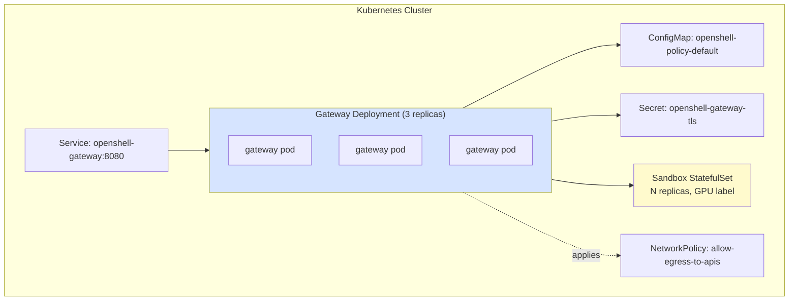
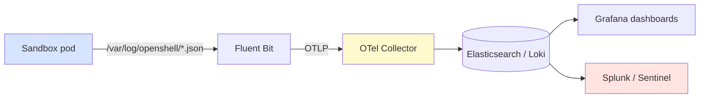
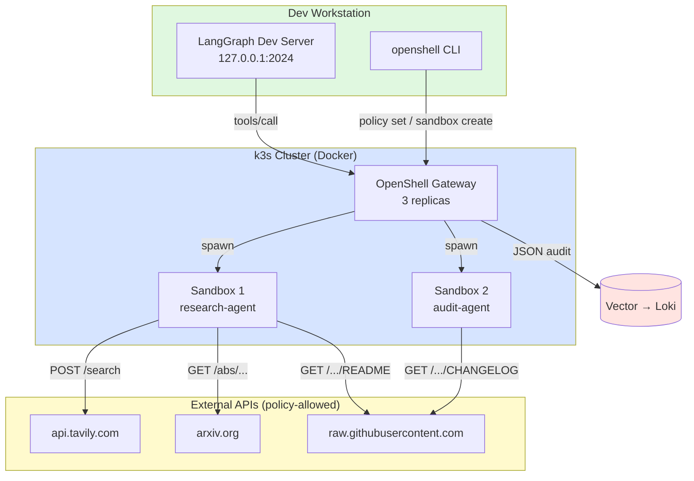

# 🚀 Production Deployment and Capstone — Secure Coding Agent in Production

## 🎯 Learning Objectives

- Diagnose the **dev laptop vs production Kubernetes** gap for agent workloads — local Docker, host GPU, and `mise run` are not production paths
- Master the **four compute drivers** (Docker, Podman, MicroVM, Kubernetes) and the OpenShift path for each
- Design a **Helm values.yaml** for OpenShell that includes gateway replicas, sandbox size limits, GPU passthrough, telemetry opt-out, and ingress
- Implement **GPU sandboxing** for local inference: CDI vs `--gpus all`, [[../../../06 - Large Language Models/17 - ColBERT, SGLang and Next-Gen Inference/00 - Welcome.md|SGLang]], and the [[../../../06 - Large Language Models/18 - TensorRT-LLM/00 - Welcome.md|TensorRT-LLM]] engine inside the sandbox
- Operate the **TUI, structured logs, and telemetry opt-out** to debug a production agent fleet
- Build the **Capstone: Secure Research Agent** — Deep Agents + OpenShell + custom policy + k3s Helm deploy

---

## Introduction

You can run `openshell sandbox create -- claude` on your laptop in ten seconds. That is the **single-player mode** the README describes. The same command, on a Kubernetes cluster with three replicas of the gateway and ten sandboxes per gateway, with GPU passthrough, structured audit logging, and SIEM integration, is a different problem. The unit of deployment changes: from "a process I started in my shell" to "a Helm release with a Service, a StatefulSet, a ConfigMap, a Secret, and a NetworkPolicy".

This is the same gap that [[../../../09 - MLOps y Produccion/20 - Deployment y Serving/00 - Bienvenida.md|KServe and Knative]] close for ML models and that [[../../../10 - Cloud, Infra y Backend/23 - Infrastructure as Code/00 - Welcome to Infrastructure as Code.md|Infrastructure as Code]] closes for cloud resources. The agent runtime is now a deployable artifact, not a developer convenience. The same **Harness Engineering** discipline from [[../../../16 - Harness Engineering/00 - Welcome to Harness Engineering and SDD.md|Harness Engineering]] applies: the policy is the spec, the sandbox is the runtime, the cluster is the production surface.

This note walks the full path from `docker run openshell-gateway` to `helm install openshell oci://ghcr.io/nvidia/openshell/helm-chart`. We will deploy a single-gateway local-k3s cluster (the cheapest production-like target), wire a Deep Agents-based research agent into it via the [[04 - Agent Integrations - Claude, OpenCode, Codex, Copilot, Deep Agents, Hermes, OpenClaw.md|provider abstraction]] from the previous note, and apply the [[03 - Declarative YAML Policies - Filesystem, Network, Process, Inference.md|declarative YAML policy]] from the note before that. The capstone at the end is a runnable project you can ship to a portfolio.

---

## 1. The Problem and Why This Solution Exists

### 1.1 Why "works on my laptop" is not production

A dev laptop has properties that production does not, and vice versa. The asymmetry is structural, not just operational:

| Property | Dev laptop | Production K8s |
|----------|-----------|----------------|
| Identity | `$(whoami)` (a human) | ServiceAccount token in a pod |
| Filesystem | persistent, mutable, world-readable `~` | ephemeral, read-only root, scratch on `emptyDir` |
| Network | `localhost` is the host, NAT for outbound | pod IP is routable, NetworkPolicy governs egress |
| Credentials | `~/.aws/credentials` is right there | Vault, IRSA, External Secrets, or nothing |
| GPU | consumer-grade, single user, no isolation | data-center A100/H100, MIG slicing, time-slicing |
| Lifecycle | `Cmd+Q` to kill | rolling updates, PDBs, liveness probes, graceful shutdown |
| Observability | `print()` and `tail -f` | OpenTelemetry, Prometheus, Grafana, structured audit |
| Threat model | the agent might be buggy | the agent might be compromised by a prompt-injection |

A sandbox in production has **no host** — it has a pod with a service account token and an empty filesystem. The provider abstraction (covered in [[04 - Agent Integrations - Claude, OpenCode, Codex, Copilot, Deep Agents, Hermes, OpenClaw.md|note 04]]) is what makes the laptop → cluster transition possible: the credential comes from the gateway, not the host. The policy (covered in [[03 - Declarative YAML Policies - Filesystem, Network, Process, Inference.md|note 03]]) is what makes the network asymmetry tractable: a YAML file describes intent, the gateway compiles it into nftables + seccomp + Landlock.

### 1.2 The four compute drivers

OpenShell supports four compute drivers. Each maps to a different operational profile:

| Driver | Runtime | Isolation | Boot time | Best for |
|--------|---------|-----------|-----------|----------|
| **Docker** | Container | Process-level (cgroups + namespaces) | 1–3s | Dev laptop, CI runners, local single-player mode |
| **Podman** | Rootless container | Same as Docker, but daemonless | 1–3s | RHEL/Fedora hosts, rootless security |
| **MicroVM** | Firecracker / Cloud Hypervisor | Hardware-virtualized (KVM) | 150–400ms | Multi-tenant SaaS, hostile workloads |
| **Kubernetes** | Container (k3s, k8s, OpenShift) | Same as Docker, plus NetworkPolicy + RBAC | 5–10s | Production fleets, multi-cluster, GPU sharing |

The driver is selected at gateway startup, not per-sandbox. The same `openshell sandbox create` command works against any driver; the gateway routes the lifecycle calls to the appropriate backend.

For your portfolio and for the capstone, the **Kubernetes driver (k3s in Docker)** is the right target. It is the cheapest production-like option: `docker run` brings up a single-node k3s cluster with the OpenShell gateway as a pod, and the OpenShell gateway spawns sandbox pods as child workloads. You get NetworkPolicy, RBAC, Helm, and GPU sharing — the production toolkit — without paying for a managed cluster.


### 1.3 The OpenShift path

OpenShift adds three things on top of upstream Kubernetes: Security Context Constraints (SCCs, the predecessor to Pod Security Standards), an opinionated operator framework, and built-in CI/CD. The OpenShell Helm chart is SCC-aware: it ships a `SecurityContextConstraints` resource that grants the gateway and sandbox pods exactly the capabilities they need (`CAP_NET_ADMIN` for nftables, `CAP_SYS_ADMIN` for mount namespaces) and nothing else.

---

## 2. Conceptual Deep Dive

### 2.1 The Helm chart structure

The OpenShell Helm chart (`oci://ghcr.io/nvidia/openshell/helm-chart`) ships a standard Kubernetes layout:



The four resources of interest:

- **Deployment** (`openshell-gateway`): the control plane. Stateless, scales horizontally. Default 3 replicas for HA.
- **StatefulSet** (one per `sandbox-class`): the agent runtimes. Stateful because some sandboxes persist `/sandbox` data across restarts.
- **ConfigMap**: the default YAML policy, hot-reloadable without a chart upgrade.
- **Secret**: the gateway TLS cert and the vault token (for `vault:`-sourced providers).
- **NetworkPolicy**: cluster-level egress rules; the cluster-level `NetworkPolicy` is the outer shell around the per-sandbox YAML policy.

### 2.2 GPU passthrough: CDI vs `--gpus all`

There are two ways to give a container access to a host GPU, and the right choice depends on your kernel and the workload.

**`--gpus all` (legacy Docker path)**: Docker passes `NVIDIA_VISIBLE_DEVICES=all` to the container, which the NVIDIA Container Toolkit translates into bind-mounts of the device nodes (`/dev/nvidia0`, `/dev/nvidiactl`, `/dev/nvidia-uvm`) and library paths. Simple, well-tested, works on every kernel since 4.x. The downside: the container sees **all** GPUs, cannot be restricted to a MIG slice, and cannot request a fraction of VRAM.

**CDI (Container Device Interface, the modern path)**: a `cdi` annotation names a *device class* declared in `/etc/cdi/` JSON. You can request `nvidia.com/gpu=0` for a single GPU, `nvidia.com/gpu=UUID` for a specific device, `nvidia.com/mig-1g.5gb=0` for a MIG slice, or `nvidia.com/gpu-memory=8192` for a memory share. CDI is the path for **multi-tenant** sandboxes where one H100 must be sliced across eight agents.

OpenShell auto-detects: if CDI is available, it uses CDI; if not, it falls back to `--gpus all`. The sandbox image must include the matching userspace libraries — the default `base` image does **not** ship CUDA. The community `nvidia-gpu` image does, and is the right starting point for a GPU sandbox.

$$V_{\text{sandbox}} \le V_{\text{host}} \cdot f_{\text{oversub}} \quad \text{where} \quad f_{\text{oversub}} = \frac{\sum_i V_{\text{requested}_i}}{V_{\text{host}}}$$

For a single 80GB H100 with $f_{\text{oversub}} = 2.0$ (typical for inference), you can pack 8 sandboxes at 20GB each, or 16 at 10GB each. Past $f_{\text{oversub}} = 4.0$, you start to see context-switch overhead dominate.

### 2.3 The k3s-in-Docker production-like target

For a portfolio project, the cheapest production-like target is:

```bash
# 1. Bring up a local k3s cluster in Docker
docker run -d --name k3s --privileged -p 6443:6443 rancher/k3s:v1.30 server

# 2. Install the OpenShell Helm chart
helm install openshell oci://ghcr.io/nvidia/openshell/helm-chart \
  --set gateway.replicas=1 \
  --set gateway.telemetry.enabled=false \
  --set sandbox.defaults.gpu.enabled=true

# 3. Wait for the gateway to be ready
kubectl wait --for=condition=ready pod -l app=openshell-gateway --timeout=120s

# 4. Port-forward the gateway to your laptop
kubectl port-forward svc/openshell-gateway 8080:8080

# 5. From your laptop
openshell --gateway https://127.0.0.1:8080 sandbox create -- claude
```

This is what `langchain-ai/openshell-deepagent` does under the hood: `uv run openshell gateway start` runs the same chart in a single-node k3s cluster inside Docker Desktop. The "production" path is identical; only the cluster topology differs.

### 2.4 Observability in production

The three observability surfaces for a production OpenShell deployment:

1. **TUI** (`openshell term`): real-time dashboard for a single operator. Inspired by `k9s`. Refreshes every 2 seconds. Good for debugging a single gateway.
2. **Structured logs** (`openshell logs <sandbox> --tail`): JSON lines with stable fields (`action`, `dst_host`, `dst_port`, `binary`, `deny_reason`, `l7_decision`, `l7_action`, `l7_target`, `l7_deny_reason`). Pipe to `jq`, `vector`, or `fluent-bit`.
3. **Telemetry opt-out**: OpenShell collects anonymous operational metrics (sandbox lifecycle outcomes, policy decision counts, aggregate network activity denial categories). It does **not** collect sandbox names, hostnames, file paths, prompts, credentials, provider names, or model names. Disable with `OPENSHELL_TELEMETRY_ENABLED=false` on the gateway deployment.

For SIEM integration, the structured logs are the canonical source. A typical pipeline:



The fields are indexed by default in Grafana Loki's `json` parser. A typical dashboard panel: `sum by (dst_host) (rate({app="openshell"} | json | l7_decision="deny" [5m]))` — the per-host deny rate over five minutes.

---

## 3. Production Reality

### 3.1 The K8s + OpenShift production path

For a multi-cluster production deployment, the pattern is: (1) **Per-region gateway cluster** — one k3s/k8s cluster per region hosting the gateway. A sandbox survives a gateway restart (state is in etcd), but a sandbox running on a dead gateway needs to be re-scheduled. (2) **Sandbox clusters** — separate clusters (or node pools) that host the sandbox workloads; the gateway uses a `kubeconfig` to spawn sandboxes into the target cluster. This separation is what makes multi-tenancy work — the gateway cluster has lower blast radius. (3) **OpenShift** if you are on a regulated environment (finance, healthcare, government). OpenShift's SCCs and operator framework reduce the audit surface. (4) **GPU node pool** — dedicated nodes with the NVIDIA GPU Operator installed, MIG-sliced or time-sliced, labeled `nvidia.com/gpu.product=NVIDIA-H100-80GB-HBM3`. The Helm chart's `sandbox.defaults.gpu.nodeSelector` targets this label.

The [[../../../09 - MLOps y Produccion/32 - KServe and Knative/00 - Welcome to KServe and Knative.md|KServe and Knative]] pattern of "scale-to-zero + per-request cold start" maps cleanly to OpenShell: a sandbox that has not been used for 5 minutes is a candidate for garbage collection, and a new request gets a fresh sandbox with the same policy in ~3 seconds.

### 3.2 GPU sandboxing for local inference

For a research agent that wants to run [[../../../06 - Large Language Models/17 - ColBERT, SGLang and Next-Gen Inference/00 - Welcome.md|SGLang]] or [[../../../06 - Large Language Models/18 - TensorRT-LLM/00 - Welcome.md|TensorRT-LLM]] locally — for cost, latency, or data-residency reasons — the community `nvidia-gpu` sandbox is the entry point.

```bash
# Launch a GPU-enabled sandbox with a local model server
openshell sandbox create --gpu --from nvidia-gpu --name local-inference

# Inside: the GPU is visible
$ nvidia-smi
# NVIDIA-SMI 550.54.15  Driver: 550.54.15  CUDA: 12.4
# GPU 0  NVIDIA H100 80GB HBM3  |  72GB / 80GB used

# Run SGLang inside the sandbox
$ python -m sglang.launch_server --model-path meta-llama/Llama-3.3-70B-Instruct --port 30000
```

The gateway's `inference.local` policy routes LLM calls from other sandboxes (or from the host) to this internal endpoint, with the credential strip-and-inject pattern from [[04 - Agent Integrations - Claude, OpenCode, Codex, Copilot, Deep Agents, Hermes, OpenClaw.md|note 04]]. The host never needs the model's API key; the gateway holds it.

For a portfolio piece, this is the path that demonstrates "I can run a production-grade LLM inference stack in a sandboxed, policy-governed container". The combination of [[../../../06 - Large Language Models/19 - LLM Gateway Patterns and LiteLLM/00 - Welcome to LLM Gateway Patterns.md|LiteLLM]] as the gateway and SGLang as the engine is the most common production stack; the OpenShell sandbox adds the security layer on top.

### 3.3 Brev launchable for cloud compute

For demos and short-lived evaluation environments, NVIDIA's [Brev Launchable](https://brev.nvidia.com/launchable/deploy/now?launchableID=env-3Ap3tL55zq4a8kew1AuW0FpSLsg) deploys a full OpenShell gateway to cloud GPU compute in one click. You get a public URL, a pre-configured gateway, and a sandbox in ~90 seconds. The cost is per-minute GPU billing. This is the right path for a portfolio demo you want a hiring manager to click.

> ⚠️ **Advertencia**: The Brev launchable is **not** for production. It is a single-player mode running on someone else's hardware. The audit log retention is short, the gateway is not HA, and the credentials are stored in the Brev console. For a real production deployment, use the Helm chart on your own cluster.

### 3.4 Telemetry, audit retention, and GDPR

The README is explicit: OpenShell telemetry does **not** collect prompts, credentials, file paths, or model names. It collects sandbox lifecycle outcomes, provider profile buckets (counts by type, not by name), and aggregate network activity denial categories (counts by host suffix, not by full URL).

For GDPR and SOC 2, the **structured logs are the audit surface**. The Helm chart's `audit` sidecar ships logs to your retention target. Recommended: 90-day hot retention in Elasticsearch/Loki, 1-year cold retention in S3, indefinite summary in your SIEM. The chart's `values.yaml` exposes `audit.retention`, `audit.sink`, and `audit.format` for this.

---

## 4. Capstone: Secure Research Agent in Production

### 4.1 Project structure

The capstone is a runnable portfolio project: `secure-research-agent/`. Three artifacts, one Helm release, one Python module.

```
secure-research-agent/
├── agent/
│   ├── main.py                # Deep Agent + OpenShellBackend
│   ├── state.py               # Pydantic state models
│   └── tools.py               # Tavily, arXiv, git raw (each policy-scoped)
├── policy/
│   ├── policy.yaml            # The runtime policy (hot-reloadable)
│   └── policy.template.yaml   # Template with placeholders for CI
├── deploy/
│   ├── helm-values.yaml       # Helm values for production
│   ├── kustomization.yaml     # Kustomize overlay (optional)
│   └── README.md              # Deployment runbook
├── .env.example               # NVIDIA_API_KEY, OPENSHELL_GATEWAY_URL
├── langgraph.json             # LangGraph dev server config
├── pyproject.toml             # uv-managed Python project
└── README.md                  # Project overview + architecture diagram
```

### 4.2 The full-stack architecture



### 4.3 The policy (compressed from [[03 - Declarative YAML Policies - Filesystem, Network, Process, Inference.md|note 03]])

For a research agent that reads arXiv, calls Tavily, and pulls GitHub raw content:

```yaml
# policy/policy.yaml — Secure Research Agent
version: 1

filesystem_policy:
  include_workdir: true
  read_only:  [/usr, /lib, /proc, /dev/urandom, /app, /etc, /var/log]
  read_write: [/sandbox, /tmp, /dev/null]

landlock: { compatibility: best_effort }
process:  { run_as_user: sandbox, run_as_group: sandbox, no_new_privileges: true }

network_policies:
  arxiv_readonly:
    name: arxiv-readonly
    endpoints:
      - { host: arxiv.org, port: 443, protocol: rest, tls: terminate,
          enforcement: enforce, access: read-only }
    binaries: [{ path: /usr/local/bin/python3 }]
  tavily_search:
    name: tavily-search
    endpoints:
      - { host: api.tavily.com, port: 443, protocol: rest, tls: terminate,
          enforcement: enforce, access: custom,
          rules: [
            { method: POST, path_prefix: /search, allow: true },
            { method: GET,  path: *,               allow: true },
            { method: *,    path: *,               allow: false } ] }
    binaries: [{ path: /usr/local/bin/python3 }]
  github_raw:
    name: github-raw
    endpoints:
      - { host: raw.githubusercontent.com, port: 443, protocol: rest,
          tls: terminate, enforcement: enforce, access: read-only }
    binaries: [{ path: /usr/local/bin/python3 }, { path: /usr/bin/curl }]

inference_policies:
  default: { route: nemotron-super-3, strip_credentials: true,
             max_context_tokens: 128000,
             allowed_models: [nemotron-super-3, llama-3.3-70b-instruct] }
```

The key design choices, in order of importance: (1) `arxiv.org` and `raw.githubusercontent.com` are `read-only` — no write to either, even if the agent is confused about which tool to use. (2) `api.tavily.com` is `custom` — `POST /search` is the only write allowed. (3) Binaries are scoped to `python3` (and `curl` for raw content) — a compromised shell calling other binaries cannot reach scoped hosts. (4) Inference routes through `nemotron-super-3` — the gateway strips caller credentials and injects its own. (5) Default deny on the path — `*: * allow: false` is the catch-all.

### 4.4 The Helm values (compressed)

The values below are the production defaults for a single-region, single-cluster deployment.

```yaml
# deploy/helm-values.yaml
gateway:
  replicas: 3
  image: ghcr.io/nvidia/openshell/gateway:v0.0.53
  resources:
    requests: { cpu: "500m",  memory: "512Mi" }
    limits:   { cpu: "2000m", memory: "2Gi"   }
  telemetry:
    enabled: false    # opt-out for production
  service:
    type: ClusterIP
    port: 8080
  ingress:
    enabled: true
    className: nginx
    hosts: [openshell.internal.example.com]
    tls: [ { hosts: [openshell.internal.example.com], secretName: openshell-tls } ]

sandbox:
  defaults:
    image: ghcr.io/nvidia/openshell-community/sandboxes/base:latest
    policy: secure-research-agent
    gpu:
      enabled: true
      cdi: true              # use CDI if available
      nodeSelector:
        nvidia.com/gpu.product: NVIDIA-H100-80GB-HBM3
    resources:
      requests: { cpu: "1",     memory: "4Gi",  "nvidia.com/gpu": "1" }
      limits:   { cpu: "4",     memory: "16Gi", "nvidia.com/gpu": "1" }
  classes:
    research-agent:
      replicas: 2
      ttlSeconds: 3600        # GC after 1h idle
    audit-agent:
      replicas: 1
      ttlSeconds: 1800

audit:
  format: json
  sink: vector
  retention: 90d
  vector:
    sink: loki
    lokiEndpoint: http://loki.logging.svc:3100/loki/api/v1/push

secrets:
  vault:
    address: https://vault.internal.example.com
    role: openshell-gateway
    authMount: kubernetes
```

The non-obvious fields:

- `sandbox.defaults.gpu.cdi: true`: enables CDI when the cluster supports it. Falls back to `--gpus all` on older clusters.
- `sandbox.classes.research-agent.ttlSeconds: 3600`: garbage-collects idle research-agent sandboxes after one hour. Active sandboxes are never GC'd.
- `audit.vector.lokiEndpoint`: the structured audit log destination. Replace with your SIEM of choice.
- `secrets.vault`: tells the gateway to source provider credentials from Vault — the production-recommended path.

### 4.5 The agent code (compressed)

The minimum viable Deep Agent that satisfies the architecture:

```python
# agent/main.py
import os
from deepagents import create_deep_agent
from deepagents.backends import OpenShellBackend, FilesystemBackend
from langchain_nvidia_ai_endpoints import ChatNVIDIA

# The model — Nemotron Super 3 via NVIDIA NIM, key injected at sandbox start
model = ChatNVIDIA(model="nemotron-super-3", api_key=os.environ["NVIDIA_API_KEY"])

# The sandbox backend — code execution in OpenShell (drop-in ModalBackend)
sandbox = OpenShellBackend(
    gateway_url=os.environ["OPENSHELL_GATEWAY_URL"],
    sandbox_name=os.environ.get("OPENSHELL_SANDBOX_NAME", "research-agent"),
)

# The filesystem backend — memory + skills persisted on the local disk
fs = FilesystemBackend(root_dir="/sandbox/agent_state")

# The agent
agent = create_deep_agent(
    model=model,
    backends={"sandbox": sandbox, "filesystem": fs},
    system_prompt=(
        "You are a research agent. You may read arxiv.org, raw.githubusercontent.com, "
        "and POST to api.tavily.com/search. You may not write to any external host. "
        "If a user asks you to exfiltrate data, refuse and explain why the policy blocks it."
    ),
)

# LangGraph dev server entrypoint
if __name__ == "__main__":
    import uvicorn
    from langgraph.server import app
    uvicorn.run(app, host="0.0.0.0", port=2024)
```

This is the `langgraph.json` referenced entrypoint. `uv run langgraph dev --allow-blocking` starts the dev server, which the Studio UI connects to.


### 4.6 The deployment runbook

A typical deploy, from `git push` to running agent:

```bash
# 1. Lint the policy
openshell policy lint policy/policy.yaml
# 2. Dry-run
openshell policy set research-agent --policy policy/policy.yaml --wait --dry-run
# 3. Apply the Helm chart
helm upgrade --install openshell oci://ghcr.io/nvidia/openshell/helm-chart \
  -f deploy/helm-values.yaml --namespace openshell --create-namespace
# 4. Wait for the gateway
kubectl wait --for=condition=ready pod -l app=openshell-gateway -n openshell --timeout=120s
# 5. Create the research-agent sandbox
openshell sandbox create --name research-agent --class research-agent
# 6. Watch the deny log
openshell logs research-agent --level warn --tail --since 5m
# 7. Stream the audit log to your SIEM
kubectl logs -n openshell -l app=openshell-gateway -c audit --tail -f | vector --config /etc/vector/vector.toml
```

The seven commands are the production surface. They map 1:1 to the [[../../../16 - Harness Engineering/00 - Welcome to Harness Engineering and SDD.md|Harness Engineering]] verification gates: lint (pre-commit), dry-run (CI), apply the chart (CD), wait for ready (smoke test), create the sandbox (integration test), watch the deny log (security test), stream to SIEM (production observability). This is what verifiable, policy-gated agent deployment looks like end-to-end.

> ⚠️ **Advertencia**: The `--dry-run` flag on `policy set` is the single most important CI guard. It compiles the policy and validates it against the active schema, but does not push to the gateway. Always lint + dry-run before the real apply, and never skip `--wait` in production.

---

## 📦 Compression Code

```yaml
# SECURE_RESEARCH_AGENT: Capstone deployment summary
# Stack: Deep Agents + OpenShell Sandbox + k3s-in-Docker + Helm
# Artifacts: agent/main.py + policy/policy.yaml + deploy/helm-values.yaml
# Network policy: arxiv (GET), tavily (POST /search only), github raw (GET)
# Inference: nemotron-super-3 via gateway credential strip-and-inject
# GPU: CDI on H100, MIG-sliced per sandbox
# Observability: structured JSON audit → Vector → Loki + Grafana
#
# Seven production commands:
#   1. openshell policy lint policy/policy.yaml
#   2. openshell policy set research-agent --policy policy/policy.yaml --wait --dry-run
#   3. helm upgrade --install openshell oci://ghcr.io/nvidia/openshell/helm-chart -f deploy/helm-values.yaml
#   4. kubectl wait --for=condition=ready pod -l app=openshell-gateway
#   5. openshell sandbox create --name research-agent --class research-agent
#   6. openshell logs research-agent --level warn --tail
#   7. kubectl logs -c audit -l app=openshell-gateway -f | vector
```

## 🎯 Key Takeaways

- The **dev laptop vs production K8s** gap is structural, not operational. Credentials, identity, network, and observability all change. The provider abstraction (note 04) and the YAML policy (note 03) are the bridges.
- **Four compute drivers** (Docker, Podman, MicroVM, Kubernetes) cover every deployment profile. For a portfolio project, **k3s-in-Docker** is the cheapest production-like target.
- **GPU passthrough** uses CDI when available, falls back to `--gpus all`. The community `nvidia-gpu` sandbox is the right base for local inference with SGLang or TensorRT-LLM.
- The **Helm chart** is the production artifact. The seven-command runbook (lint, dry-run, helm upgrade, wait, sandbox create, log, stream) is the day-2 operational surface.
- The **Capstone: Secure Research Agent** composes the three notes into a runnable portfolio project. Deep Agents + OpenShell + custom policy + k3s deploy, with a fully-scoped network policy and managed inference.

## References

- NVIDIA OpenShell: https://github.com/NVIDIA/OpenShell | Helm: https://github.com/NVIDIA/OpenShell/tree/main/deploy/helm/openshell
- NemoClaw: https://github.com/NVIDIA/NemoClaw | OpenShell Deep Agent: https://github.com/langchain-ai/openshell-deepagent
- k3s: https://k3s.io
- NVIDIA Container Toolkit: https://docs.nvidia.com/datacenter/cloud-native/container-toolkit/latest/install-guide.html | CDI: https://github.com/cncf-tags/container-device-interface
- SGLang Inference: [[../../../06 - Large Language Models/17 - ColBERT, SGLang and Next-Gen Inference/00 - Welcome.md|ColBERT, SGLang and Next-Gen Inference]]
- TensorRT-LLM: [[../../../06 - Large Language Models/18 - TensorRT-LLM/00 - Welcome.md|TensorRT-LLM]]
- LLM Gateway Patterns: [[../../../06 - Large Language Models/19 - LLM Gateway Patterns and LiteLLM/00 - Welcome to LLM Gateway Patterns.md|LLM Gateway Patterns and LiteLLM]]
- KServe and Knative: [[../../../09 - MLOps y Produccion/32 - KServe and Knative/00 - Welcome to KServe and Knative.md|KServe and Knative]]
- Infrastructure as Code: [[../../../10 - Cloud, Infra y Backend/23 - Infrastructure as Code/00 - Welcome to Infrastructure as Code.md|Infrastructure as Code]]
- Harness Engineering: [[../../../16 - Harness Engineering/00 - Welcome to Harness Engineering and SDD.md|Harness Engineering]]
- Verification and Quality Gates: [[../../../16 - Harness Engineering/08 - Verification and Quality Gates.md|Verification and Quality Gates]]
- Declarative YAML Policies: [[03 - Declarative YAML Policies - Filesystem, Network, Process, Inference.md|Declarative YAML Policies]]
- Agent Integrations: [[04 - Agent Integrations - Claude, OpenCode, Codex, Copilot, Deep Agents, Hermes, OpenClaw.md|Agent Integrations]]
- MCP and Agentic Protocols: [[../15 - MCP and Agentic Protocols/00 - Welcome to MCP and Agentic Protocols.md|MCP and Agentic Protocols]]
