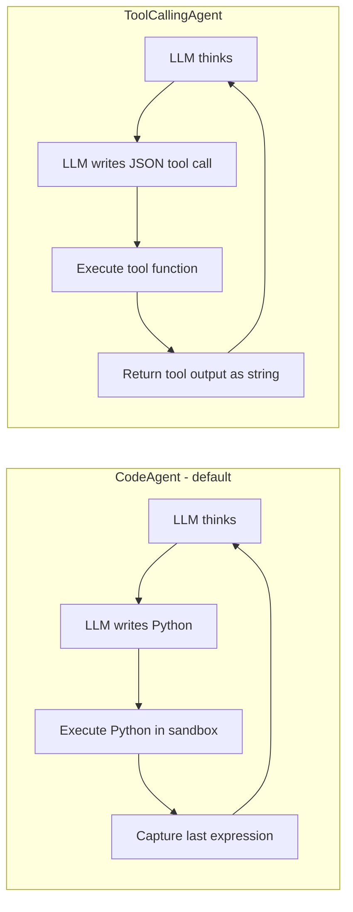

# 🤏 smolagents — Minimal Code Agents from HuggingFace

## 🎯 Learning Objectives

- Understand the **code-as-action philosophy** of smolagents and why writing Python is more powerful than writing JSON for tool calls
- Distinguish **`CodeAgent` from `ToolCallingAgent`** and pick the right one for each workload
- Build custom tools with the **`@tool` decorator** and the `Tool` base class, including type hints that the LLM reads as documentation
- Integrate **E2B sandboxed execution** to run generated code safely in production
- Wire smolagents into [[../../06 - Large Language Models/19 - LLM Gateway Patterns and LiteLLM/00 - Welcome to LLM Gateway Patterns and LiteLLM.md|LiteLLM]] for provider-agnostic model routing
- Compose smolagents with [[../15 - MCP and Agentic Protocols/00 - Welcome to MCP and Agentic Protocols.md|MCP servers]] so the agent discovers external tools at runtime

---

## Introduction

HuggingFace's `smolagents` is the smallest serious agent framework in 2026: ~1,000 lines of core code, one `CodeAgent` class, one `ToolCallingAgent` class, and a `@tool` decorator. That minimalism is the point. Every other agent framework of the previous generation — LangChain, LangGraph, LlamaIndex, CrewAI, AutoGen — made the same architectural choice: tools return **structured text** (JSON or a serialized string), the LLM reads the text, and the next step is decided by the LLM. smolagents flips this: tools return values, the agent **writes Python code that uses those values**, and the Python code is executed. The mental model is the same as the Jupyter notebook a data scientist uses every day — except the data scientist is an LLM.

The framework was released in late 2024 and reached v1.0 in mid-2025. It is the framework that HuggingFace itself uses internally for its research agents (the ones that read arXiv papers, run experiments, and write reports). For your portfolio projects, the immediate value is that `CodeAgent` is a drop-in upgrade for any agent that currently calls tools via JSON: the same tool definition (`@tool`) produces both a JSON-callable interface and a code-callable interface, so you can keep your existing tool surface and gain the expressiveness of arbitrary Python control flow. The cost is the requirement to sandbox code execution — and that is exactly where [[../16 - OpenShell and Agent Sandboxes/00 - Welcome to OpenShell and Agent Sandboxes.md|OpenShell]] and E2B become non-optional in production.

For your **Multi-Agent Research System**, the smolagents upgrade path is direct: replace the LangGraph cyclic agent's tool-calling nodes with a `CodeAgent` that uses the existing Tavily and database tools, and the agent gains the ability to do multi-step data transformations (`results = [search(q) for q in queries]; top3 = sorted(results, key=lambda r: r.score)[:3]`) without the framework writing the loop. For the **StayBot** Airbnb agent, smolagents is overkill — the tool surface is small and the workflow is linear — but you can still benefit from `ToolCallingAgent` for fast prototyping before committing to CrewAI 1.0's role-based ceremony.

---

## 1. The Problem and Why This Solution Exists

### 1.1 The JSON tool-call ceiling

Every tool-calling agent since GPT-4 function calling (mid-2023) has worked the same way. The LLM emits a structured JSON blob naming a tool and its arguments. The framework executes the tool, gets back a string, and feeds that string back into the LLM context. The LLM then decides the next tool call. This works for one tool at a time, but it falls apart as soon as the workflow involves any of the following:

- **Loops**: "for each of these 10 queries, call the search tool, then aggregate the results" — the LLM has to either emit 10 separate tool calls in one turn (saturating the JSON budget) or do 10 turns (saturating the context window with intermediate results).
- **Conditionals**: "if the search result mentions a date in 2025, search again with a different query; otherwise stop" — JSON tool calls have no native branching.
- **Composition**: "call search(q1), call search(q2), return the intersection of titles" — multi-tool composition requires either a single mega-tool that does it all, or N separate tool turns with the LLM tracking the state.
- **Type safety**: the LLM can produce malformed JSON, the framework has to validate and re-prompt, and the error path is application-specific.

`smolagents` `CodeAgent` solves all four by replacing the JSON action with **a Python code block that the LLM writes**. The block can contain loops, conditionals, composition, and any other Python construct. The framework executes the block, captures the final expression's value, and feeds that value back. The LLM has the same control flow it would have in a Jupyter notebook, which is the most general-purpose control flow most LLMs have been trained on.

### 1.2 The risk and why sandboxing is mandatory

The flip side of letting the LLM write Python is that the Python can do anything Python can do: read the filesystem, call out to the network, exfiltrate credentials. In a development notebook this is fine because the user is the one writing the code. In a production agent that processes untrusted user prompts, **the LLM is the untrusted writer of the code**, and the executing host is the attack target. The 2025 prompt-injection-as-code-execution attacks (the ones that motivated [[../16 - OpenShell and Agent Sandboxes/00 - Welcome to OpenShell and Agent Sandboxes.md|OpenShell]]) are exactly this surface.

smolagents handles this with two execution backends:

| Backend | Where code runs | When to use |
|---------|-----------------|-------------|
| `LocalPythonExecutor` | Same Python process as the agent | Development, trusted prompts, demos |
| `E2BExecutor` (via `e2b_code_interpreter`) | Isolated Firecracker microVM in E2B cloud | Production with untrusted input |
| `DockerExecutor` (custom) | Docker container on your host | Self-hosted production with custom images |
| `OpenShellExecutor` (custom, this course's capstone) | OpenShell-managed sandbox | Production with policy-enforced egress |

For your portfolio, the rule is: **never use `LocalPythonExecutor` in production**. The development ergonomics are perfect; the production security model is broken. The 1-line change to switch to `E2BExecutor` is the difference between a demo and a deployable system.

### 1.3 The architectural choice: CodeAgent vs ToolCallingAgent

smolagents ships two agent classes. Pick deliberately.



| Decision | CodeAgent | ToolCallingAgent |
|----------|-----------|------------------|
| **When to use** | Workflows with loops, conditionals, composition | Workflows that are mostly sequential tool calls |
| **Latency** | Higher (one LLM turn per code block; code may take seconds) | Lower (one LLM turn per tool call; tool is fast) |
| **Debuggability** | Excellent — the generated code is human-readable | Moderate — JSON is less readable than Python |
| **Security surface** | Larger — must sandbox code execution | Smaller — only the tool function is executed |
| **Provider compatibility** | Any chat model (most work) | Strict JSON mode required (some providers flaky) |
| **Mental model** | Jupyter notebook | JSON-RPC client |

The default in the smolagents docs is `CodeAgent`, and for a reason: the expressiveness win is so large that you only reach for `ToolCallingAgent` when you specifically need lower latency or a smaller security surface.

---

## 2. Conceptual Deep Dive

### 2.1 The agent loop, end to end

The `CodeAgent.run()` method executes the following loop, with step limits and token budgets configurable:

1. **Format the system prompt** with the agent's role description, the available tools (with their docstrings and type hints as the schema), and the conversation history.
2. **Call the model** (any chat model via LiteLLM-compatible interface).
3. **Parse the response** into a `CodeAction` (Python code block) and a `Thought` (text explanation).
4. **Execute the code** in the chosen executor, with the conversation's `state` dict as the local namespace and a fresh namespace per step to prevent state pollution between turns.
5. **Append the result** to the conversation history as a `CodeOutput` with stdout, the value of the last expression, and any printed output.
6. **Loop** until the agent emits a `FinalAnswer` action (a special code action whose result is returned) or the step limit is hit.

The key insight is that the **state dict is the only state that survives between steps**. The agent cannot rely on Python class state, file system state, or imported modules staying in scope. This is enforced by executing each step in a fresh namespace, and it is exactly the constraint that makes the agent loop safe to interrupt, replay, and resume.

### 2.2 The `@tool` decorator

The `@tool` decorator turns a Python function into a smolagents `Tool`. The decorator extracts the function's docstring as the tool description, the type hints as the input schema, and the return annotation as the output schema. The LLM reads the docstring and type hints and uses them to decide when to call the tool.

```python
from smolagents import tool

@tool
def get_weather(city: str, units: str = "celsius") -> str:
    """Get the current weather for a city.

    Args:
        city: Name of the city, e.g. "Medellín"
        units: "celsius" or "fahrenheit"

    Returns:
        A short string describing the current weather.
    """
    # ... implementation ...
    return f"Weather in {city}: 22°{units[0].upper()}"
```

Three rules for tool design that pay off:

1. **Type hints are the schema**. The LLM reads `city: str, units: str = "celsius"` and knows the inputs. Missing type hints make the tool unusable; wrong type hints make it wrong.
2. **Docstring is the prompt**. The LLM reads the docstring to decide *when* to call the tool. A vague docstring ("does the thing") will be called wrongly or never.
3. **Return type is the contract**. The LLM expects the return type to be a primitive (str, int, float, list, dict) or a JSON-serializable object. Returning a custom class without a `to_dict()` method will break the agent loop.

### 2.3 The state dict and why it matters

The state dict is the agent's working memory. It starts empty, the agent populates it by assigning variables in the code blocks, and each step's code can read the previous step's variables. This is the mechanism that lets the agent do composition: the first step's `results = [search(q) for q in queries]` makes `results` available in the second step, where the agent can write `top = sorted(results, key=lambda r: r.score)[:3]`.

The state is also the **only** mechanism for cross-step memory. If the agent needs to remember something between turns but never assigns it to a variable, it is forgotten. This is why the smolagents `CodeAgent` examples always show intermediate results being assigned to named variables, not just printed or returned inline.

### 2.4 The model interface

smolagents uses a thin wrapper around the underlying chat model. The wrapper exposes a `generate(messages)` method that takes a list of `Message` objects and returns a `ChatMessage`. The framework ships adapters for OpenAI, Anthropic, HuggingFace Inference, and LiteLLM — and the LiteLLM adapter is the one you will use in production because it gives you provider-agnostic routing for free.

```python
from smolagents import CodeAgent, LiteLLMModel

model = LiteLLMModel(
    model_id="gpt-4o-mini",  # or "claude-sonnet-4.5", "gemini-2.5-pro", "gemma-3-27b"
    temperature=0.2,
    api_key=os.environ["OPENAI_API_KEY"],
)

agent = CodeAgent(tools=[get_weather, search_web], model=model)
result = agent.run("What is the weather in Medellín and the capital of Colombia?")
```

The `LiteLLMModel` wrapper is a 50-line adapter that translates smolagents' `Message` objects to LiteLLM's `completion()` interface and back. It is the single most important integration in the smolagents ecosystem, because it makes the framework compatible with every provider that LiteLLM supports (100+ as of 2026) and gives you the [[../../06 - Large Language Models/19 - LLM Gateway Patterns and LiteLLM/00 - Welcome to LLM Gateway Patterns and LiteLLM.md|LiteLLM Gateway]] semantics (fallback chains, cost tracking, semantic caching) for free.

### 2.5 Step limits, planning, and self-correction

The agent loop has three tunable limits, all of which interact:

- `max_steps` (default 15): the maximum number of (think → code → execute) cycles before the agent is forced to return.
- `planning_interval` (default None, recommended 4): every N steps, the agent is asked to write a "plan" message that summarizes progress and lists remaining steps. This is the smolagents equivalent of the ReAct "reflection" step.
- `retry_after_error` (default True): when a code block throws an exception, the framework feeds the traceback back to the LLM and asks it to write a corrected block. The default of 1 retry is conservative; in production you may want 2-3.

The combination is what makes `CodeAgent` self-correcting: a failed `requests.get()` produces a traceback, the LLM reads the traceback, writes a try/except block, and continues. In the Multi-Agent Research System, this self-correction is the mechanism that lets the research node handle flaky Tavily responses without explicit retry logic in the graph.

---

## 3. Production Reality

### 3.1 Latency profile

The latency of a `CodeAgent` step is the sum of: (a) the LLM generation time, (b) the code execution time, (c) the framework overhead. The framework overhead is negligible (~10ms per step). The LLM generation time is the dominant cost (200-2000ms depending on model and prompt size). The code execution time is workload-dependent: a simple `search_web` call is 100-500ms; a `pandas` groupby on 1M rows is 1-3s; a Docker build is minutes.

For latency-sensitive workloads (real-time chat, sub-100ms responses), `CodeAgent` is the wrong tool. The minimum realistic latency is 500ms even with the fastest model, because you need at least one LLM turn. Reach for `ToolCallingAgent` or a pre-scripted workflow instead.

### 3.2 Cost profile

A single agent run consumes LLM tokens for every step's prompt and completion. A 5-step `CodeAgent` run with GPT-4o-mini costs ~$0.005-0.02 (5 × 1k input + 500 output tokens × $0.15/M input + $0.60/M output). A 5-step run with Claude Sonnet 4.5 costs ~$0.05-0.15. A 20-step run with GPT-4o costs $0.50-1.50.

The [[../../06 - Large Language Models/19 - LLM Gateway Patterns and LiteLLM/00 - Welcome to LLM Gateway Patterns and LiteLLM.md|LiteLLM Gateway]] integration gives you Redis semantic caching for free: a repeated query (semantically similar, threshold 0.95) returns the cached response in <10ms with zero LLM cost. For your LLM Edge Gateway portfolio project, the same Redis instance can serve both the gateway's chat cache and the agent's step cache, with one cost-tracking dashboard.

### 3.3 Production case — HuggingFace's research agents

HuggingFace's internal research agents (the ones that power the daily paper-digest bot) use `CodeAgent` with `E2BExecutor`. The workflow: every morning at 06:00 UTC, a scheduled job spins up a fresh E2B sandbox, instantiates a `CodeAgent` with ~15 tools (arXiv search, paper download, PDF parser, embedding model, summarization model), and runs a 30-step agent loop that reads 20 papers, extracts key claims, embeds them, and writes a digest. The E2B sandbox is destroyed when the loop finishes, taking with it any malicious code that was generated.

The architecture is the production case study for this course's capstone: a stateless orchestrator (the job scheduler) that spins up an ephemeral executor (E2B or OpenShell), runs the agent, and tears down. The orchestrator can be a Python script, a cron job, a Kubernetes Job, or a serverless function — the executor is the security boundary.

### 3.4 Failure modes

| Failure mode | Symptom | Fix |
|--------------|---------|-----|
| LLM generates code with imports that are not in the sandbox | `ModuleNotFoundError` traceback | Pre-install deps in the executor image; pass `additional_authorized_imports=["pandas", "numpy"]` |
| LLM loop runs forever | Step limit hit, no `FinalAnswer` | Lower `max_steps`; add a `planning_interval` to force reflection |
| LLM produces wrong tool call | Unexpected result, agent stuck in retry loop | Improve tool docstrings; add `examples=[...]` to the tool definition |
| E2B sandbox hangs | Step times out | Set `executor_kwargs={"timeout": 60}` |
| LLM refuses to use tools | Empty code block, no action | Add "you must use tools" to the system prompt; use a model with good tool following (Claude, GPT-4o) |

### 3.5 Comparison: smolagents vs the other five frameworks

| Framework | Execution model | Best for | Worst for |
|-----------|-----------------|----------|-----------|
| **smolagents** | Python code in sandbox | Composable multi-step workflows | Hard real-time latency |
| **PydanticAI** | Type-safe tool calls via Pydantic | Production backends with strict contracts | Rapid prototyping, code-as-action |
| **transformers.agents** | Code or JSON, HF-native | Research, HF model ecosystem | Multi-provider, non-HF models |
| **OpenAI Agents SDK** | Structured tool calls, OpenAI-native | OpenAI-only stacks, first-class tracing | Multi-provider, cost-sensitive workloads |
| **Google ADK** | Structured, Google-native | GCP deployments, Vertex AI integration | Non-Google stacks |
| **CrewAI 1.0** | Role-based multi-agent | Multi-agent role-playing, structured crews | Single-agent workflows |

---

## 4. Code in Practice

### 4.1 Minimal example: one tool, one run

```python
# 🤏 MINIMAL: smolagents with one tool and GPT-4o-mini
# Install: pip install smolagents litellm

import os
from smolagents import CodeAgent, LiteLLMModel, tool

@tool
def get_weather(city: str) -> str:
    """Return the current weather for a city.

    Args:
        city: City name, e.g. "Medellín"
    """
    # In production, call a real API. Here we mock for brevity.
    forecasts = {
        "medellín": "22°C, partly cloudy",
        "bogotá": "14°C, light rain",
        "cartagena": "30°C, sunny",
    }
    return forecasts.get(city.lower(), f"No data for {city}")

model = LiteLLMModel(model_id="gpt-4o-mini", temperature=0.2)
agent = CodeAgent(tools=[get_weather], model=model)

result = agent.run("What is the weather in Medellín?")
print(result)  # "The weather in Medellín is 22°C, partly cloudy."
```

### 4.2 Composing multiple tools with code-as-action

```python
# COMPOSITION: agent writes a loop that calls multiple tools
# This is what JSON tool-calling cannot do in a single turn.

@tool
def search_papers(query: str, max_results: int = 5) -> list[dict]:
    """Search arXiv for papers matching a query.

    Args:
        query: Search query string
        max_results: Maximum number of results to return
    """
    # Real implementation would call arXiv API. Mocked here.
    return [
        {"title": f"Paper about {query} #{i}", "authors": ["A. Author"], "year": 2025}
        for i in range(max_results)
    ]

@tool
def summarize(text: str, max_words: int = 50) -> str:
    """Summarize a text in at most max_words.

    Args:
        text: Text to summarize
        max_words: Maximum words in the summary
    """
    words = text.split()[:max_words]
    return " ".join(words) + ("..." if len(text.split()) > max_words else "")

agent = CodeAgent(tools=[search_papers, summarize], model=model)

# The agent will write a loop:
#   results = search_papers("agent frameworks", max_results=10)
#   summaries = [summarize(p["title"]) for p in results]
#   final_answer = "\n".join(summaries)
result = agent.run("Find 10 papers about agent frameworks and summarize each title.")
print(result)
```

### 4.3 Production: E2B sandbox executor

```python
# PRODUCTION: E2BExecutor instead of LocalPythonExecutor
# pip install e2b-code-interpreter

from smolagents import CodeAgent, LiteLLMModel
from e2b_code_interpreter import Sandbox

# Spin up an isolated Firecracker microVM
sandbox = Sandbox.create(template="base")  # 1-2s startup

# Define a tool that runs in the sandbox
@tool
def run_python_in_sandbox(code: str) -> str:
    """Execute Python code in an isolated sandbox and return stdout.

    Args:
        code: Python code to execute
    """
    execution = sandbox.run_code(code)
    return execution.logs.stdout or execution.text or ""

agent = CodeAgent(
    tools=[run_python_in_sandbox],
    model=model,
    executor=...,  # Wire E2B as the executor for agent-generated code
)

# The agent now writes code that is executed inside the E2B microVM.
# If the code tries to read /etc/passwd, it gets an empty file (fresh VM).
# If the code tries to make a network call, the E2B firewall blocks it.
result = agent.run("Calculate the first 20 Fibonacci numbers and return them as a list.")

# Always tear down the sandbox
sandbox.kill()
```

### 4.4 Common pitfalls

| Pitfall | Consequence | Solution |
|---------|-------------|----------|
| No type hints on `@tool` | LLM calls with wrong arguments, agent stuck | Add `param: type` and `-> return_type` to every tool |
| Vague docstring | LLM never calls the tool or calls it for wrong reasons | Write a 1-2 sentence docstring with an example query |
| `LocalPythonExecutor` in production | Untrusted code can read your filesystem | Use `E2BExecutor` or `DockerExecutor` |
| `max_steps=100` | Single run can cost $5+ and take minutes | Set `max_steps=15`; add `planning_interval=4` |
| Tool returns a custom class | LLM cannot parse the response | Return `str`, `dict`, or `list` (JSON-serializable) |
| Same tool imported twice | Agent picks one, other is shadowed | Tools are a flat list; no nesting |

> 💡 **Tip**: When debugging, set `verbosity_level=2` on the agent. Every step's thought, code, and result will be printed to stdout. This is the fastest way to figure out why your agent is making wrong tool calls.

---

## 5. Integration with the rest of the vault

### 5.1 smolagents + MCP

[[../15 - MCP and Agentic Protocols/00 - Welcome to MCP and Agentic Protocols.md|MCP]] servers are dynamically discovered tools. smolagents can wrap an MCP server's tool list as smolagents `Tool` objects via the `MCPClient` adapter. The integration is 10 lines:

```python
from smolagents import CodeAgent, LiteLLMModel
from mcp import StdioServerParameters
from smolagents.mcp_client import MCPClient

# Connect to an MCP server
mcp_client = MCPClient(StdioServerParameters(command="python", args=["my_mcp_server.py"]))
mcp_tools = mcp_client.get_tools()  # list[Tool]

# Pass MCP tools directly to the smolagents agent
agent = CodeAgent(tools=mcp_tools, model=model)
result = agent.run("Use whatever tools the MCP server exposes to answer this.")
```

The composite pattern is what makes a multi-framework RAG agent possible: smolagents orchestrates, MCP servers provide the tools, the tools can be written in any language (Python, TypeScript, Go, Rust) and any framework. The [[../15 - MCP and Agentic Protocols/00 - Welcome to MCP and Agentic Protocols.md|MCP note]] covers the protocol; this is the production application.

### 5.2 smolagents + OpenShell

For self-hosted production with policy-enforced egress, [[../16 - OpenShell and Agent Sandboxes/00 - Welcome to OpenShell and Agent Sandboxes.md|OpenShell]] is the executor. The integration is a custom `Executor` subclass that proxies code execution to the OpenShell gateway. The policy YAML can restrict the sandbox to: read-only access to the agent's working directory, network access only to allowlisted hosts (the LLM provider's API endpoint), and process isolation via Landlock + seccomp. The capstone of this course (note 07) walks through the full integration.

### 5.3 smolagents + the LLM Edge Gateway

If you deploy the [[../../13 - Go Engineering/06 - Go for ML Backend/00 - Welcome|Go LLM Edge Gateway]] in production, point your smolagents `LiteLLMModel` at the gateway's URL instead of the provider's URL. The gateway adds Redis semantic caching, rate limiting, prompt-injection detection, and cost tracking for free. The integration is one line: pass `api_base="http://llm-gateway.internal:8080/v1"` to the `LiteLLMModel` constructor.

### 5.4 smolagents + Phoenix observability

[[../../05 - MLOps y Produccion/31 - Evidently AI and Phoenix/00 - Welcome to Evidently AI and Phoenix|Phoenix]] (Arize) is the OpenTelemetry-native observability backend that integrates with smolagents via the `openinference-instrumentation-smolagents` package. With one line (`Phoenix().launch()` + auto-instrumentation), every agent step is traced: the LLM call latency, the code execution latency, the tool call arguments, the result, and the final answer. For the **Automated LLM Evaluation Suite** portfolio project, this is the same tracing backend you already use for your LLM eval runs.

---

## 📦 Compression Code

```python
# NOTE: 01 - smolagents
# Repo: github.com/huggingface/smolagents (~1k LOC core, MIT, 8k+ stars)
# Two agent classes: CodeAgent (Python-as-action, default), ToolCallingAgent (JSON-as-action)
# Tool decorator: @tool extracts docstring (description) + type hints (schema) + return annotation (output)
# Executors: LocalPythonExecutor (dev only), E2BExecutor (cloud microVM), DockerExecutor (self-hosted), OpenShellExecutor (capstone)
# Model: LiteLLMModel wraps LiteLLM completion() — 100+ providers, fallback chains, cost tracking
# Loop: think -> code -> execute -> result -> loop, max_steps default 15, planning_interval recommended 4
# State: dict survives between steps, fresh namespace per step, no class state
# Cross-cuts: MCP (dynamic tool discovery), OpenShell (policy-enforced sandbox), LLM Gateway (Redis cache + cost), Phoenix (OpenTelemetry traces)

from smolagents import CodeAgent, LiteLLMModel, tool
from e2b_code_interpreter import Sandbox

@tool
def get_weather(city: str) -> str:
    """Get current weather for a city.
    Args:
        city: City name, e.g. "Medellín"
    """
    return f"Weather in {city}: 22°C, sunny"

# Production setup: E2B sandbox + LiteLLM
sandbox = Sandbox.create(template="base")
model = LiteLLMModel(model_id="claude-sonnet-4.5", temperature=0.2)
agent = CodeAgent(tools=[get_weather], model=model)
result = agent.run("What is the weather in Medellín?")
sandbox.kill()
```

## 🎯 Key Takeaways

- **Code-as-action** is more expressive than JSON-as-action — loops, conditionals, and composition come for free when the LLM writes Python
- **The `@tool` decorator** turns a Python function into a callable tool by reading its docstring and type hints — type hints are the schema, docstring is the prompt
- **`CodeAgent` vs `ToolCallingAgent`**: CodeAgent for composable workflows, ToolCallingAgent for fast sequential tool calls with smaller security surface
- **Sandboxing is non-optional in production**: `LocalPythonExecutor` for dev, `E2BExecutor` or `OpenShellExecutor` for prod
- **`LiteLLMModel` is the universal adapter**: one line of code gives you 100+ providers, fallback chains, and the LLM Gateway semantics

## References

- smolagents repository: https://github.com/huggingface/smolagents
- smolagents documentation: https://huggingface.co/docs/smolagents
- smolagents blog announcement: https://huggingface.co/blog/smolagents
- E2B code interpreter: https://e2b.dev/docs
- LiteLLM: https://docs.litellm.ai/
- MCP for smolagents: https://huggingface.co/docs/smolagents/main/en/tutorials/tools#using-mcp-tools
- OpenInference instrumentation for smolagents: https://github.com/Arize-ai/openinference/tree/main/python/instrumentation/openinference-instrumentation-smolagents
- HuggingFace research agents case study: https://huggingface.co/blog/introducing-smolagents
