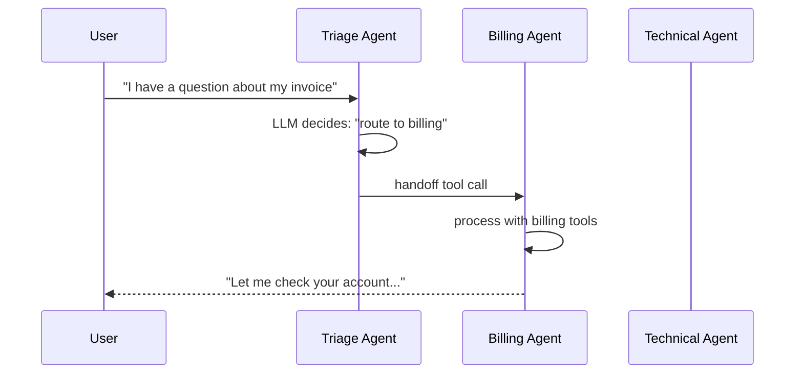

# 🤖 OpenAI Agents SDK — Provider-Native Production Agents

## 🎯 Learning Objectives

- Understand the **OpenAI Agents SDK** as the framework that ships first-class support for the OpenAI Responses API, handoffs, guardrails, and tracing
- Master the **`Runner` class** as the single entry point for running agents (sync, async, streamed)
- Build **multi-agent handoffs** where a triage agent routes to specialized agents (customer support, billing, technical)
- Implement **input and output guardrails** as Pydantic-validated structured checks, not as free-form prompt instructions
- Use **`Sessions` for conversation memory** and **`Tracing` for production observability** via the OpenAI dashboard
- Integrate with the [[../../06 - Large Language Models/19 - LLM Gateway Patterns and LiteLLM/00 - Welcome to LLM Gateway Patterns and LiteLLM.md|LiteLLM Gateway]] when you need multi-provider routing, or with [[../15 - MCP and Agentic Protocols/00 - Welcome to MCP and Agentic Protocols.md|MCP]] for cross-framework tool discovery

---

## Introduction

The OpenAI Agents SDK is the framework that the OpenAI team itself ships and uses for production agents. Released in early 2025 as the successor to the experimental `openai-swarm` library, it is the framework that gives you the **deepest integration with the OpenAI platform**: the Responses API, the Agents tracing dashboard, the hosted vector store, the built-in tools (web search, file search, code interpreter, computer use), and the function-calling semantics that GPT-4o and the o-series models were specifically trained to excel at. Every other framework in this course either wraps the OpenAI API as a third-party (LiteLLM, transformers.agents) or replaces it with a different reasoning engine (smolagents, PydanticAI). The OpenAI Agents SDK is the framework that uses the OpenAI API as a first-class component.

The framework's design choices are deliberately conservative: tools are functions, handoffs are explicit agent-to-agent transfers, guardrails are structured input/output validators, and the runner is the only thing that knows how to execute. There is no code-as-action (use smolagents for that), no Hub-native tool catalog (use transformers.agents for that), no type-safe Pydantic integration (use PydanticAI for that). The value is the integration with the OpenAI platform: tracing in the OpenAI dashboard, hosted tools that are one line to add, and the handoff pattern that is the cleanest multi-agent primitive in any framework of 2026.

For your portfolio projects, the OpenAI Agents SDK is the right choice when you commit to the OpenAI provider. The **LLM Edge Gateway** in Go can be modified to route to OpenAI for the agents-specific path while keeping LiteLLM for the chat-completion path; the **Automated LLM Evaluation Suite** can use the SDK's tracing to log every eval call to the OpenAI dashboard; the **StayBot** Airbnb agent can use the SDK's handoffs to route between property-search, booking, and support sub-agents. The SDK is a poor choice if you need multi-provider routing or open-source model support — for those, see notes 01 (smolagents) and 02 (PydanticAI).

---

## 1. The Problem and Why This Solution Exists

### 1.1 The handoff problem

Every multi-agent framework of the previous generation (LangGraph, CrewAI, AutoGen) implemented multi-agent communication differently. LangGraph used shared state, CrewAI used role-based task delegation, AutoGen used peer-to-peer message passing. The OpenAI Agents SDK's handoff pattern is the simplest: an agent can hand off the conversation to another agent, and the receiving agent takes over with its own instructions, tools, and conversation history. The pattern is recursive (handoff-to-handoff is allowed) and bi-directional (agents can hand off back to a triage agent).

```python
# TRIAGE: a customer support agent routes to billing or technical
from agents import Agent, Runner

triage_agent = Agent(
    name="Triage",
    instructions="Route the user to the billing or technical agent based on their request.",
    handoffs=[billing_agent, technical_agent],
)

result = await Runner.run(triage_agent, "I have a question about my invoice.")
# The triage agent called the handoff tool, billing_agent is now active
# result.final_output is the billing agent's response
```

The handoff is a tool call from the perspective of the LLM: the triage agent has a `transfer_to_billing` and a `transfer_to_technical` tool in its tool list, and the framework handles the transfer transparently. The pattern is more declarative than LangGraph's explicit edge wiring and more explicit than CrewAI's role-based implicit routing.

### 1.2 The guardrails problem

Input validation and output safety in agent systems are usually done with free-form prompt instructions: "if the user asks for X, refuse." The problem is that the LLM may or may not follow the instruction, and the framework has no way to enforce it structurally. The OpenAI Agents SDK's guardrails are **Pydantic-validated structured checks** that run on every input and every output. The check returns a `GuardrailFunctionOutput` that includes a `tripwire_triggered` flag, and the framework raises a `InputGuardrailTripwireTriggered` or `OutputGuardrailTripwireTriggered` exception when the tripwire is triggered.

```python
from agents import Agent, Runner, GuardrailFunctionOutput, input_guardrail
from pydantic import BaseModel

class PIIOutput(BaseModel):
    contains_pii: bool
    explanation: str

@input_guardrail
async def pii_check(ctx, agent, input) -> GuardrailFunctionOutput:
    """Reject inputs that contain personally identifiable information."""
    result = await Runner.run(check_agent, input, context=ctx.context)
    return GuardrailFunctionOutput(
        output_info=result.final_output,
        tripwire_triggered=result.final_output.contains_pii,
    )

agent = Agent(
    name="Support",
    instructions="...",
    input_guardrails=[pii_check],
)
```

The guardrail runs as a separate agent call (with its own model and instructions), and the structured output means the tripwire is deterministic. This is the pattern that the [[../../06 - Large Language Models/15 - LLM Security and Guardrails/00 - Welcome to LLM Security and Guardrails.md|LLM Security and Guardrails]] course covers at a deeper level — the SDK provides the framework, the course provides the threat model.

### 1.3 The tracing problem

Production agents need observability: what tools were called, with what arguments, how long did the LLM take, what was the cost, what was the conversation flow. Every other framework of the previous generation made you wire up your own tracing (LangSmith, Phoenix, OpenTelemetry). The OpenAI Agents SDK ships with **first-class tracing** to the OpenAI dashboard: every `Runner.run()` call creates a trace, every tool call creates a span, and the dashboard shows the full conversation flow with token counts and latencies.

For teams already on the OpenAI platform, the tracing is the killer feature. For teams that need OpenTelemetry, the SDK also exports traces in OTel format, so you can wire them into your own observability stack. The pattern is what the [[../../05 - MLOps y Produccion/31 - Evidently AI and Phoenix/00 - Welcome to Evidently AI and Phoenix|Phoenix note]] covers at a deeper level.

---

## 2. Conceptual Deep Dive

### 2.1 The `Runner` class

`Runner` is the only object that knows how to execute an agent. It has three execution modes:

- `Runner.run(agent, input)`: synchronous, returns a `RunResult` with `final_output`, `messages`, and `new_items`.
- `await Runner.run(agent, input)`: asynchronous, returns the same `RunResult`.
- `Runner.run_streamed(agent, input)`: async generator that yields `StreamEvent` objects (raw_response_events, run_item_stream_event, agent_updated_stream_event) as the agent executes.

The `input` can be a string, a list of `Message` objects, or a list of `ResponseInputItemParam` (for multi-modal input). The `RunResult.final_output` is the agent's final response, typed as `str` by default or as the `output_type` if the agent declares one.

```python
from agents import Agent, Runner

agent = Agent(name="Helper", instructions="You are a helpful assistant.")

# Sync
result = Runner.run_sync(agent, "What is 2 + 2?")
print(result.final_output)  # "4"

# Async
result = await Runner.run(agent, "What is 2 + 2?")

# Streamed
async for event in Runner.run_streamed(agent, "What is 2 + 2?"):
    if event.type == "raw_response_event":
        # Token-level streaming
        print(event.data, end="", flush=True)
    elif event.type == "run_item_stream_event":
        # Tool call / tool result events
        print(f"\n[Event: {event.item.type}]")
```

The Runner is the **only** object that should call the LLM in production. Direct LLM calls bypass tracing, handoffs, and guardrails, which is the wrong pattern for production. The discipline is: every LLM call goes through `Runner.run()` or `Runner.run_streamed()`.

### 2.2 The handoff pattern in detail

A handoff is a tool call from the perspective of the LLM. The framework adds a tool to the source agent's tool list for each target agent in the `handoffs` list. The tool is named `transfer_to_<target_name>` and its description is the target agent's `instructions` field. When the LLM emits the tool call, the framework transfers the conversation to the target agent, including the conversation history, the context object, and the new agent's instructions and tools.



The handoff is **state-preserving**: the new agent sees the full conversation history, the context object, and the input. The handoff can be configured to **skip the run** (just transfer, don't have the LLM generate a final message before transferring) via `handoff(..., is_enabled=True, input_filter=None, tool_name_override=None)`. For complex routing, the handoff tool can be customized with `input_filter` (to modify the conversation before passing it) and `tool_description_override` (to control how the LLM sees the handoff).

### 2.3 The session pattern

`Sessions` is the SDK's conversation memory abstraction. A `Session` is a key-value store where the key is a session ID (e.g., a user ID or a conversation ID) and the value is the conversation history. The SDK ships in-memory and SQLite implementations; the production pattern is to implement a `Session` backed by Redis, Postgres, or a dedicated conversation store.

```python
from agents import Agent, Runner, SQLiteSession

agent = Agent(name="Helper", instructions="...")
session = SQLiteSession("user_42", "conversations.db")

# First turn
result1 = await Runner.run(agent, "Hi, my name is Leandro", session=session)
# Second turn — the agent remembers the name
result2 = await Runner.run(agent, "What's my name?", session=session)
print(result2.final_output)  # "Your name is Leandro."
```

The session is **agent-agnostic**: the same session can be used with multiple agents, and the conversation history is shared. For multi-agent handoffs, the session is passed through the handoff, so the new agent sees the full conversation history. For production, the Redis-backed session gives you persistence, TTL, and multi-instance access.

### 2.4 The guardrail pattern

Guardrails are Pydantic-validated structured checks that run on inputs and outputs. There are two kinds:

- **Input guardrails** run on the user input before the agent is invoked. They can reject the input (tripwire triggered) or pass it through. They run in parallel with the agent's first LLM call, so they add zero latency in the happy path.
- **Output guardrails** run on the agent's final response. They can reject the response (tripwire triggered) or pass it through. They run in parallel with the agent's last LLM call.

The guardrail is itself an `Agent` (a separate LLM call with its own instructions and output schema). The result is a `BaseModel` with a `tripwire_triggered` boolean. The framework raises an exception when the tripwire is triggered, and the caller can catch and handle the exception.

```python
from agents import Agent, Runner, input_guardrail, output_guardrail, GuardrailFunctionOutput
from pydantic import BaseModel

class TopicCheck(BaseModel):
    on_topic: bool
    explanation: str

check_agent = Agent(
    name="TopicCheck",
    instructions="Decide if the user's input is on-topic for our support bot.",
    output_type=TopicCheck,
)

@input_guardrail
async def topic_guardrail(ctx, agent, input):
    result = await Runner.run(check_agent, input, context=ctx.context)
    return GuardrailFunctionOutput(
        output_info=result.final_output,
        tripwire_triggered=not result.final_output.on_topic,
    )

main_agent = Agent(
    name="Support",
    instructions="...",
    input_guardrails=[topic_guardrail],
)

# If the input is off-topic, the framework raises:
try:
    result = await Runner.run(main_agent, "What's the meaning of life?")
except Exception as e:
    print(f"Rejected: {e}")
```

The guardrail is a **second LLM call**, which means it doubles the latency in the worst case. The framework runs it in parallel with the agent's first call, so the latency is max(check_latency, agent_first_latency), not the sum. For latency-sensitive workloads, the guardrail can be a non-LLM function (regex, classifier) — the SDK accepts any async function that returns a `GuardrailFunctionOutput`.

### 2.5 The tracing pattern

`Tracing` is automatic: every `Runner.run()` call creates a trace, every tool call creates a span, and the trace is sent to the OpenAI dashboard if `OPENAI_API_KEY` is set. For custom observability, the SDK accepts a `trace_include_sensitive_data` flag (default False in production) and an `OpenAIAgentsTracingProcessor` for custom trace destinations. The trace export is in OpenTelemetry format, so any OTel-compatible backend (Phoenix, Jaeger, Langfuse, Arize) can receive the traces.

```python
from agents import Agent, Runner, set_tracing_processor
from agents.tracing.processor import OpenAIAgentsTracingProcessor

# Custom processor for self-hosted Phoenix
from phoenix.otel import register
tracer_provider = register(project_name="my-agents")
# ... configure the OpenAIAgentsTracingProcessor to use the OTel exporter
```

For your **Automated LLM Evaluation Suite**, the tracing export is the same backend as your eval dashboard — Phoenix or Langfuse — and the eval results and the agent traces can be correlated by `trace_id`. This is the same pattern the [[../../05 - MLOps y Produccion/31 - Evidently AI and Phoenix/00 - Welcome to Evidently AI and Phoenix|Phoenix note]] covers in depth.

### 2.6 MCP and hosted tools

The SDK has **first-class support for hosted tools** (web search, file search, code interpreter, computer use) and for [[../15 - MCP and Agentic Protocols/00 - Welcome to MCP and Agentic Protocols.md|MCP]] servers. The hosted tools are one line:

```python
from agents import Agent, WebSearchTool, FileSearchTool, CodeInterpreterTool, ComputerUseTool

agent = Agent(
    name="Researcher",
    instructions="...",
    tools=[
        WebSearchTool(),  # OpenAI's hosted web search
        FileSearchTool(vector_store_ids=["vs_abc123"]),  # hosted vector store
        CodeInterpreterTool(),  # OpenAI's hosted sandbox
        ComputerUseTool(),  # computer use (screenshot-to-action)
    ],
)
```

The hosted tools are powered by OpenAI's infrastructure, not by your code. The file search tool queries a hosted vector store (you upload files, OpenAI embeds and indexes them), the code interpreter runs in a hosted sandbox, the web search hits OpenAI's index, and the computer use tool runs the same screenshot-to-action loop that the [[../15 - MCP and Agentic Protocols/04 - Computer Use and Browser Agents.md|computer use note]] covers. For your portfolio, the hosted tools are the fastest path to a working agent: add a vector store, add a web search, and you have a RAG agent in 5 lines.

MCP integration:

```python
from agents import Agent, MCPServerStdio

mcp_server = MCPServerStdio(command="python", args=["my_server.py"], cache_tools_list=True)
agent = Agent(name="MCPAgent", mcp_servers=[mcp_server], tools=[])

async with mcp_server:
    result = await Runner.run(agent, "Use the MCP tools to answer this.")
```

The `mcp_servers` parameter is the list of MCP servers the agent can call, and the framework handles the tool discovery, the call routing, and the response parsing. The same MCP servers that smolagents (note 01) and PydanticAI (note 02) can use, the OpenAI Agents SDK can use too.

---

## 3. Production Reality

### 3.1 Latency profile

The OpenAI Agents SDK has the same per-step latency as any tool-calling framework: one LLM turn per tool call, plus the guardrail LLM call (if configured). The handoff is one extra LLM turn (the source agent emits the handoff tool call). A 5-tool run with GPT-4o is 3-6 seconds. A handoff to a sub-agent adds 1-2 seconds for the sub-agent's first turn. Guardrails in parallel add zero latency in the happy path.

The hosted tools add their own latency: web search is 1-3 seconds, file search is 200-500ms, code interpreter is 5-30 seconds (sandbox startup + execution). For sub-100ms responses, the SDK is the wrong tool — use a pre-scripted workflow.

### 3.2 Cost profile

The OpenAI Agents SDK is OpenAI-priced: GPT-4o is $2.50/M input + $10/M output, GPT-4o-mini is $0.15/M + $0.60/M, o3 is $10/M + $40/M. A 5-tool run with GPT-4o-mini costs ~$0.005-0.02. A 5-tool run with GPT-4o costs ~$0.05-0.15. A 20-tool run with o3 costs $1-3. Hosted tools are priced separately (web search $10/1k calls, file search $0.10/GB-day).

For cost-sensitive workloads, the [[../../06 - Large Language Models/19 - LLM Gateway Patterns and LiteLLM/00 - Welcome to LLM Gateway Patterns and LiteLLM.md|LiteLLM]] integration gives you Redis semantic caching for free. The SDK does not have a first-class caching layer, but you can wrap the agent with a custom runner that checks the cache before invoking the SDK.

### 3.3 Production case — customer support triage at scale

The most common 2026 production pattern for the OpenAI Agents SDK is **customer support triage**: a triage agent that routes to specialized sub-agents (billing, technical, account, retention), with input guardrails for PII / off-topic / abusive content, output guardrails for compliance, and tracing to the OpenAI dashboard for audit. The pattern is used by fintechs, SaaS companies, and any business that gets more than 1,000 support tickets a day.

The architecture: a single `Runner.run()` call per ticket, the triage agent routes to a sub-agent in 1-2 turns, the sub-agent resolves or escalates, the trace is logged to the dashboard for analysis. The cost is ~$0.10-0.30 per ticket (depending on the model and the conversation length), and the resolution rate is typically 60-80% without human intervention.

### 3.4 Failure modes

| Failure mode | Symptom | Fix |
|--------------|---------|-----|
| OpenAI API is down or rate-limited | `RateLimitError` or `APIConnectionError` | Add retry with exponential backoff; switch to a fallback provider via LiteLLM |
| Guardrail rejects all inputs | All requests fail with `InputGuardrailTripwireTriggered` | Loosen the guardrail prompt; add an override for specific cases |
| Handoff loops infinitely | Two agents hand off to each other repeatedly | Add a `max_turns` limit; break the loop with a sentinel agent |
| Hosted tool times out | `TimeoutError` on the tool call | Set per-tool timeout; add a fallback to a local tool |
| Session storage is full | `SQLiteSession` raises `DatabaseError` | Use Redis with TTL; archive old sessions to cold storage |
| Tracing quota exceeded | OpenAI dashboard rejects traces | Switch to self-hosted OTel exporter (Phoenix, Jaeger) |

### 3.5 Comparison: OpenAI Agents SDK vs the other five frameworks

| Framework | Provider-native | Best for | Worst for |
|-----------|:--------------:|----------|-----------|
| **OpenAI Agents SDK** | ✅ OpenAI | OpenAI-only stacks, hosted tools, handoffs | Multi-provider, open-source models |
| **smolagents** | ⚠️ Any | Composable multi-step workflows | Hosted tools, handoffs |
| **PydanticAI** | ⚠️ Any | Type-safe production backends | Hosted tools, OpenAI tracing |
| **transformers.agents** | ⚠️ Any + HF Hub | Hub models, multi-modal | Hosted tools, handoffs |
| **Google ADK** | ✅ Google | GCP deployments, Vertex AI | Non-Google stacks |
| **CrewAI 1.0** | ⚠️ Any | Multi-agent role-playing | Hosted tools, structured single-agent |

---

## 4. Code in Practice

### 4.1 Minimal example: one agent, one tool, hosted vector store

```python
# 🤖 MINIMAL: OpenAI Agents SDK with one tool
# Install: pip install openai-agents

import asyncio
from agents import Agent, Runner, function_tool

@function_tool
def get_weather(city: str) -> str:
    """Get the current weather for a city.

    Args:
        city: City name, e.g. "Medellín"
    """
    return f"Weather in {city}: 22°C, partly cloudy"

agent = Agent(
    name="WeatherAgent",
    instructions="You are a helpful weather assistant. Use the get_weather tool when asked about weather.",
    tools=[get_weather],
)

async def main():
    result = await Runner.run(agent, "What is the weather in Medellín?")
    print(result.final_output)  # "The weather in Medellín is 22°C, partly cloudy."

asyncio.run(main())
```

### 4.2 Multi-agent handoff: customer support

```python
# HANDOFFS: triage routes to billing or technical sub-agents
from agents import Agent, Runner, function_tool, RunContextWrapper

@function_tool
def get_account_balance(ctx: RunContextWrapper, account_id: str) -> str:
    """Look up the balance for an account.

    Args:
        account_id: The account ID
    """
    return f"Account {account_id} has a balance of $1,234.56"  # mock

@function_tool
def lookup_error(ctx: RunContextWrapper, error_code: str) -> str:
    """Look up a system error code.

    Args:
        error_code: The error code, e.g. "E_TIMEOUT"
    """
    return f"Error {error_code}: connection timeout after 30s"  # mock

billing_agent = Agent(
    name="Billing",
    instructions="You handle billing inquiries. Be precise about account numbers and balances.",
    tools=[get_account_balance],
)

technical_agent = Agent(
    name="Technical",
    instructions="You handle technical issues. Be helpful and walk users through solutions.",
    tools=[lookup_error],
)

triage_agent = Agent(
    name="Triage",
    instructions=(
        "You are a triage agent. Route the user to the Billing agent for account "
        "questions, the Technical agent for error messages, or handle the request "
        "yourself if neither applies."
    ),
    handoffs=[billing_agent, technical_agent],
)

async def main():
    # The triage agent decides which sub-agent to route to
    result = await Runner.run(triage_agent, "I got error E_TIMEOUT, what does it mean?")
    print(result.final_output)
    # The technical agent's response
```

### 4.3 Guardrails: reject PII in inputs

```python
# GUARDRAILS: PII detection on every input
from agents import Agent, Runner, input_guardrail, GuardrailFunctionOutput
from pydantic import BaseModel

class PIICheck(BaseModel):
    contains_pii: bool
    explanation: str

pii_check_agent = Agent(
    name="PIICheck",
    instructions=(
        "You check if the user's input contains personally identifiable information "
        "(SSN, credit card, email, phone, address). Reply with contains_pii=True if it does."
    ),
    output_type=PIICheck,
)

@input_guardrail
async def pii_guardrail(ctx, agent, input):
    result = await Runner.run(pii_check_agent, input, context=ctx.context)
    return GuardrailFunctionOutput(
        output_info=result.final_output,
        tripwire_triggered=result.final_output.contains_pii,
    )

main_agent = Agent(
    name="Support",
    instructions="...",
    input_guardrails=[pii_guardrail],
)

# If the input contains PII, the framework raises InputGuardrailTripwireTriggered
try:
    result = await Runner.run(main_agent, "My SSN is 123-45-6789, can you help me?")
except Exception as e:
    print(f"Rejected: {e}")
```

### 4.4 Sessions: multi-turn memory

```python
# SESSIONS: SQLite-backed conversation memory
from agents import Agent, Runner, SQLiteSession

agent = Agent(
    name="Assistant",
    instructions="You are a friendly assistant. Remember the user's name across turns.",
)

async def main():
    session = SQLiteSession("user_42", "conversations.db")

    r1 = await Runner.run(agent, "Hi, my name is Leandro", session=session)
    print(r1.final_output)  # "Hello Leandro! How can I help you?"

    r2 = await Runner.run(agent, "What is my name?", session=session)
    print(r2.final_output)  # "Your name is Leandro."

asyncio.run(main())
```

### 4.5 Hosted RAG with file search

```python
# HOSTED RAG: file search against a hosted vector store (one line)
from agents import Agent, Runner, FileSearchTool

# Vector store created via the OpenAI dashboard or API: vs_abc123
agent = Agent(
    name="DocsAgent",
    instructions="Answer questions based on the documents in the vector store.",
    tools=[FileSearchTool(vector_store_ids=["vs_abc123"], max_num_results=5)],
)

async def main():
    result = await Runner.run(agent, "What is the refund policy?")
    print(result.final_output)  # "According to the refund policy document..."

asyncio.run(main())
```

### 4.6 Common pitfalls

| Pitfall | Consequence | Solution |
|---------|-------------|----------|
| Bypassing `Runner` with direct LLM calls | No tracing, no handoffs, no guardrails | Always go through `Runner.run()` |
| `@function_tool` without docstring | Tool not callable, agent confused | Write a clear docstring with parameter descriptions |
| Guardrail rejects all inputs | All requests fail | Loosen the guardrail prompt; test with a diverse input set |
| Handoff loops (A→B→A→B) | Infinite loop, no result | Add `max_turns=10`; add a sentinel "I cannot help" agent |
| Session storage is in-memory | Lost on restart | Use `SQLiteSession` or a custom `Session` backed by Redis |
| `output_type` is a `BaseModel` but the LLM ignores it | Validation fails, retries exhausted | Add `output_type` examples in the system prompt |

> 💡 **Tip**: For portfolio demos, the hosted tools (`FileSearchTool`, `WebSearchTool`) are the fastest path to a working RAG or web-search agent. The vector store is created in 1 line via the OpenAI dashboard, and the file upload is 1 API call. Total time to a working RAG demo: under 30 minutes.

---

## 📦 Compression Code

```python
# NOTE: 04 - OpenAI Agents SDK
# Repo: github.com/openai/openai-agents-python (MIT, 3k+ stars, v0.5+)
# Single entry point: Runner.run() / Runner.run_streamed() / Runner.run_sync()
# Handoffs: declarative multi-agent routing, tool-call-based, state-preserving
# Guardrails: input_guardrail + output_guardrail, Pydantic-validated, parallel with agent
# Sessions: SQLiteSession (default) or custom (Redis, Postgres) for conversation memory
# Tracing: automatic to OpenAI dashboard, OTel export for self-hosted (Phoenix, Jaeger)
# Hosted tools: WebSearchTool, FileSearchTool, CodeInterpreterTool, ComputerUseTool
# MCP: MCPServerStdio, MCPServerHTTP, same servers as smolagents and PydanticAI
# Models: gpt-4o, gpt-4o-mini, o3, o4-mini (and any model on the Responses API)
# Cross-cuts: not provider-agnostic (use LiteLLM Gateway as api_base for multi-provider)

import asyncio
from agents import Agent, Runner, function_tool, input_guardrail, GuardrailFunctionOutput, SQLiteSession
from pydantic import BaseModel

@function_tool
def get_weather(city: str) -> str:
    """Get the current weather for a city.
    Args:
        city: City name
    """
    return f"Weather in {city}: 22°C"

class PIICheck(BaseModel):
    contains_pii: bool

@input_guardrail
async def pii_guard(ctx, agent, input):
    # In production, use a separate Agent + Runner.run() to check
    return GuardrailFunctionOutput(output_info=PIICheck(contains_pii=False), tripwire_triggered=False)

agent = Agent(
    name="WeatherAgent",
    instructions="You are a helpful weather assistant.",
    tools=[get_weather],
    input_guardrails=[pii_guard],
)

async def main():
    session = SQLiteSession("user_42", "conversations.db")
    result = await Runner.run(agent, "What is the weather in Medellín?", session=session)
    print(result.final_output)

asyncio.run(main())
```

## 🎯 Key Takeaways

- **The OpenAI Agents SDK is the deepest integration with the OpenAI platform** — Responses API, hosted tools, handoffs, tracing all first-class
- **Handoffs are declarative multi-agent routing** — the LLM sees them as tool calls, the framework handles the transfer
- **Guardrails are Pydantic-validated structured checks** — not free-form prompt instructions, deterministic tripwires
- **Hosted tools (web search, file search, code interpreter, computer use) are one line** — fastest path to a working RAG or web agent
- **Tracing is automatic to the OpenAI dashboard, with OTel export for self-hosted backends** (Phoenix, Jaeger, Langfuse)

## References

- OpenAI Agents SDK documentation: https://openai.github.io/openai-agents-python/
- OpenAI Agents SDK GitHub: https://github.com/openai/openai-agents-python
- OpenAI Agents SDK examples: https://github.com/openai/openai-agents-python/tree/main/examples
- Handoffs guide: https://openai.github.io/openai-agents-python/handoffs/
- Guardrails guide: https://openai.github.io/openai-agents-python/guardrails/
- Sessions guide: https://openai.github.io/openai-agents-python/sessions/
- Tracing guide: https://openai.github.io/openai-agents-python/tracing/
- OpenAI Responses API: https://platform.openai.com/docs/api-reference/responses
