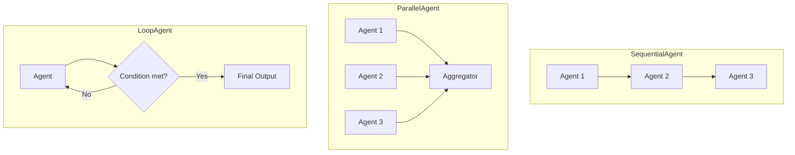

# 🔷 Google ADK — Sequential, Parallel and Loop Agents on Vertex AI

## 🎯 Learning Objectives

- Understand the **Google Agent Development Kit (ADK)** as Google's provider-native answer to multi-agent orchestration on Vertex AI
- Master the **agent hierarchy**: `LlmAgent` (the base), `SequentialAgent` (pipeline), `ParallelAgent` (fan-out), and `LoopAgent` (iterative refinement)
- Use the **Agent2Agent (A2A) protocol** for cross-framework delegation, integrating with [[../15 - MCP and Agentic Protocols/00 - Welcome to MCP and Agentic Protocols.md|MCP servers]] in the same agent graph
- Deploy to **Vertex AI Agent Engine** with one command and get managed scaling, tracing, and observability for free
- Compose ADK agents with **callbacks** for input validation, output guardrails, and tool call interception — the SDK's structured equivalent of PydanticAI's `RunContext` and OpenAI's guardrails
- Integrate with [[../../06 - Large Language Models/19 - LLM Gateway Patterns and LiteLLM/00 - Welcome to LLM Gateway Patterns and LiteLLM.md|LiteLLM]] for multi-provider routing when you want a fallback to non-Google models

---

## Introduction

Google's Agent Development Kit (ADK) is the framework the Google Cloud team ships for production agents, designed from day one to deploy on **Vertex AI Agent Engine** — Google's managed runtime for agents that handles scaling, tracing, session management, and integration with the broader Google Cloud ecosystem (BigQuery, Cloud Storage, Cloud SQL, AlloyDB, Vertex AI Search, Vertex AI Vector Search). Released in 2025 and at v0.5+ in 2026, ADK is the framework that gives you the **deepest integration with the Google Cloud platform**: every Google service is one tool away, every Gemini model (1.5 Pro, 2.5 Pro, Gemma 3) is one parameter away, and the deployment story is `adk deploy` to a managed runtime.

The framework's design is the most "structured" of the six in this course. The base agent is `LlmAgent` (a single LLM with a system prompt and a set of tools), and the four composition patterns are explicit Python classes: `SequentialAgent` (one after another, with state passing), `ParallelAgent` (fan-out, fan-in), `LoopAgent` (iterate until a condition), and `Agent2Agent` (cross-framework delegation via the A2A protocol). There is no code-as-action (use smolagents for that), no Hub-native tool catalog (use transformers.agents for that), no hosted tools (use OpenAI Agents SDK for that). The value is the **structured composition primitives** and the **Vertex AI deployment story**.

For your portfolio, ADK is the right choice when you commit to the Google Cloud platform. The **Multi-Agent Research System** can be re-expressed as a `SequentialAgent(Research, FactAudit, Synthesis)` with the same cyclic semantics as your LangGraph implementation. The **StayBot** Airbnb agent can use `ParallelAgent` to fan out to multiple property-search queries and aggregate the results. The **Automated LLM Evaluation Suite** can deploy to Vertex AI Agent Engine for managed eval runs. The framework is a poor choice if you are on AWS or Azure, or if you need open-source model support — for those, see notes 01-04.

---

## 1. The Problem and Why This Solution Exists

### 1.1 The composition problem

Every agent framework of the previous generation made the same architectural choice: the agent is a single LLM with a set of tools, and the developer wires up multi-agent flows with framework-specific primitives (LangGraph's `StateGraph`, CrewAI's `Crew`, AutoGen's `GroupChat`). The Google ADK's contribution is the **four composition primitives** that cover the four patterns that show up in production:

- **Sequential** (`SequentialAgent`): one agent runs, the next one runs, state is passed. Used for pipelines (research → fact-audit → synthesis).
- **Parallel** (`ParallelAgent`): N agents run concurrently, results are aggregated. Used for fan-out / fan-in queries.
- **Loop** (`LoopAgent`): an agent runs until a condition is met. Used for iterative refinement (generate → critique → regenerate).
- **Agent2Agent** (A2A): an agent delegates to another agent on a different framework. Used for cross-framework composition (ADK agent calls a LangGraph agent via the A2A protocol).

The four patterns cover the four most common multi-agent topologies. The framework's design is "pick the right primitive, not the right graph DSL."

### 1.2 The deployment problem

The other half of the equation is the deployment story. Every other framework of the previous generation made you wire up your own deployment: containerize the agent, set up the API server, configure the LLM provider, wire up the tracing, set up the load balancer, and pray. The Google ADK ships with **Vertex AI Agent Engine**, a managed runtime that takes care of scaling, session management, and observability. The deployment is one command:

```bash
adk deploy --project=my-project --region=us-central1 --staging_bucket=gs://my-bucket
```

The agent runs as a managed service, scales to zero when idle, and integrates with Vertex AI's tracing, logging, and BigQuery export. For a team that is already on Google Cloud, this is the lowest-friction deployment story of any framework in this course.

### 1.3 The Google Cloud ecosystem problem

ADK is the only framework of the six that treats **Google Cloud services as first-class tools**: BigQuery, Cloud Storage, Cloud SQL, AlloyDB, Vertex AI Search, Vertex AI Vector Search, Vertex AI Model Registry, Cloud Functions, Cloud Run, Pub/Sub, and Firestore. Each of these is a pre-built tool class in the ADK, and the authentication is handled by the runtime (the agent's service account). For a team that has its data in BigQuery and its vector store in Vertex AI Vector Search, the integration is the natural fit.

```python
from google.adk.tools import bigquery_tool, vertex_search_tool, cloud_storage_tool

agent = LlmAgent(
    model="gemini-2.5-pro",
    tools=[
        bigquery_tool(project="my-project", dataset="my_dataset"),
        vertex_search_tool(datastore="my-datastore"),
        cloud_storage_tool(bucket="my-bucket"),
    ],
)
```

For the **Second Brain RAG** portfolio project (Plan C from the planning session), the natural deployment is ADK on Vertex AI Agent Engine with Vertex AI Vector Search as the vector store, BigQuery for analytics, and Cloud Storage for the document corpus. The agent that queries your Learning vault is one deployment command away.

---

## 2. Conceptual Deep Dive

### 2.1 The `LlmAgent` base class

The `LlmAgent` is the foundational building block. It has a name, a model, an instruction (system prompt), a list of tools, and optional sub-agents. The `LlmAgent.run()` method takes a query, calls the model with the system prompt and the tool list, and returns a `RunResult` with the model's final response, the tool calls, and the conversation history.

```python
from google.adk.agents import LlmAgent
from google.adk.tools import google_search

agent = LlmAgent(
    name="research_agent",
    model="gemini-2.5-pro",
    instruction="You are a research agent. Use the google_search tool to find information.",
    tools=[google_search],
)

result = await agent.run("What is the latest news on Multi-Agent Systems?")
print(result.output)
```

The `LlmAgent` is intentionally minimal: a model, a prompt, a tool list. The composition is handled by the parent classes, not by the base. This is the right design: the base is simple, the composition is explicit.

### 2.2 Sequential, Parallel, and Loop agents

The three composition primitives are subclasses of `BaseAgent` that wrap a list of sub-agents and orchestrate them:



| Primitive | Pattern | Use case |
|-----------|---------|----------|
| `SequentialAgent` | One after another, state passing | Research → Audit → Synthesis pipelines |
| `ParallelAgent` | Fan-out, fan-in | Multi-query search, multi-perspective analysis |
| `LoopAgent` | Iterate until condition | Critique → regenerate, until quality threshold |

```python
from google.adk.agents import SequentialAgent, ParallelAgent, LoopAgent

# Sequential: research → fact-audit → synthesis
pipeline = SequentialAgent(
    name="research_pipeline",
    sub_agents=[research_agent, fact_audit_agent, synthesis_agent],
)

# Parallel: 3 search agents + 1 aggregator
fanout = ParallelAgent(
    name="multi_query",
    sub_agents=[search_agent_arxiv, search_agent_web, search_agent_github],
    aggregator=aggregator_agent,  # receives a dict of results
)

# Loop: generate → critique until quality threshold
refiner = LoopAgent(
    name="refiner",
    sub_agents=[generator_agent, critic_agent],
    condition=lambda state: state["critic_score"] > 0.8,
    max_iterations=5,
)
```

The three primitives are composable: a `SequentialAgent` can contain a `ParallelAgent`, a `LoopAgent` can contain a `SequentialAgent`, and so on. The full graph is a tree of these primitives, not a free-form graph. The constraint is deliberate: the four patterns cover the four topologies that show up in production, and the framework forces you to pick one.

### 2.3 The Agent2Agent (A2A) protocol

A2A is Google's open protocol for cross-framework agent delegation, the natural complement to [[../15 - MCP and Agentic Protocols/00 - Welcome to MCP and Agentic Protocols.md|MCP]]. Where MCP standardizes tool discovery, A2A standardizes agent delegation. The ADK has first-class support for A2A: an ADK agent can declare itself as an A2A server, expose its capabilities as an "agent card" (similar to OpenAPI for APIs), and accept delegation requests from any A2A-compatible client (LangGraph, smolagents, custom frameworks).

```python
from google.adk.agents import LlmAgent
from google.adk.a2a import expose_as_a2a_server

agent = LlmAgent(name="researcher", model="gemini-2.5-pro", tools=[...])

# Expose this agent as an A2A server
expose_as_a2a_server(agent, port=8080, name="ResearcherAgent")

# Any A2A-compatible client can now call this agent:
# from a2a import A2AClient
# async with A2AClient("http://localhost:8080") as client:
#     result = await client.delegate("researcher", query="What is MLA?")
```

The A2A integration is what makes the **multi-framework RAG agent** capstone (note 07) possible: an ADK `SequentialAgent` orchestrates the high-level workflow, and the retrieval step delegates to a smolagents RAG agent via A2A, and the synthesis step delegates to a PydanticAI extraction agent via A2A. Three frameworks, one workflow, no code rewrite.

### 2.4 Callbacks and the `CallbackContext`

The ADK's callback system is the structured equivalent of PydanticAI's `RunContext` and OpenAI's guardrails. A callback is a Python function that runs at one of seven lifecycle points: `before_agent`, `after_agent`, `before_model`, `after_model`, `before_tool`, `after_tool`, `on_error`. The callback receives a `CallbackContext` that exposes the agent's state, the conversation history, the tool call arguments, and the LLM response.

```python
from google.adk.agents import LlmAgent, CallbackContext
from google.adk.events import Event, EventActions

def log_token_usage(callback_context: CallbackContext, llm_response) -> None:
    """Log token usage to BigQuery for cost tracking."""
    usage = llm_response.usage_metadata
    callback_context.state["total_tokens"] = (
        callback_context.state.get("total_tokens", 0) + usage.total_token_count
    )

def validate_input(callback_context: CallbackContext, user_input: str) -> None:
    """Reject inputs that look like prompt injection attempts."""
    if "ignore previous instructions" in user_input.lower():
        raise ValueError("Potential prompt injection detected")

agent = LlmAgent(
    name="agent",
    model="gemini-2.5-pro",
    instruction="...",
    before_agent_callback=validate_input,
    after_model_callback=log_token_usage,
)
```

The callback system is what the [[../../06 - Large Language Models/15 - LLM Security and Guardrails/00 - Welcome to LLM Security and Guardrails.md|LLM Security]] and [[../../05 - MLOps y Produccion/21 - Monitoreo y Mantenimiento/00 - Bienvenida|Monitoreo]] courses use in production: validate inputs, log token usage, intercept tool calls, and raise on errors. The callbacks are **synchronous Python functions**, not LLM calls, so they add zero latency in the happy path.

### 2.5 The `Tool` class and pre-built tools

The `Tool` class is a Pydantic-validated structured tool definition. The framework ships pre-built tools for the most common Google Cloud services:

| Tool | Purpose | Use case |
|------|---------|----------|
| `bigquery_tool` | Run BigQuery SQL queries | Analytics, ETL, data warehousing |
| `vertex_search_tool` | Search a Vertex AI Search datastore | Enterprise search, RAG |
| `vertex_vector_search_tool` | Query Vertex AI Vector Search | RAG, semantic search |
| `cloud_storage_tool` | Read/write Cloud Storage | Document corpus, file uploads |
| `alloydb_tool` | Query AlloyDB | OLTP, feature store |
| `firestore_tool` | Query Firestore | Document DB, session storage |
| `pubsub_tool` | Publish/subscribe Pub/Sub | Event-driven agent workflows |
| `google_search_tool` | Web search via Google | Research, fact-checking |
| `code_execution_tool` | Run Python in a sandbox | Code generation, data analysis |
| `function_tool` | Wrap a Python function as a tool | Custom logic |

Each pre-built tool is **authenticated via the agent's service account** — no API keys to manage, no OAuth flows to wire up. The runtime handles the credentials.

```python
from google.adk.agents import LlmAgent
from google.adk.tools import bigquery_tool, vertex_vector_search_tool, function_tool

@function_tool
def get_user_profile(user_id: str) -> dict:
    """Look up a user profile from the application database.

    Args:
        user_id: The user ID, e.g. "user_42"
    """
    # Custom application logic
    return {"user_id": user_id, "name": "Leandro", "plan": "pro"}

agent = LlmAgent(
    name="customer_support",
    model="gemini-2.5-pro",
    instruction="You are a customer support agent. Use the tools to find information.",
    tools=[
        bigquery_tool(project="my-project", dataset="users"),
        vertex_vector_search_tool(index="my-vector-index", endpoint="my-endpoint"),
        get_user_profile,
    ],
)
```

The combination of pre-built tools (for Google Cloud services) and `@function_tool` (for custom logic) means the agent can interact with the entire Google Cloud ecosystem and your application logic with a single `tools=[...]` list.

### 2.6 Deployment to Vertex AI Agent Engine

The deployment story is the killer feature for teams on Google Cloud. The `adk deploy` command packages the agent, uploads it to a Cloud Storage staging bucket, and deploys to Vertex AI Agent Engine. The runtime handles scaling, session management, and observability.

```bash
# Deploy to Vertex AI Agent Engine
adk deploy \
    --project=my-project \
    --region=us-central1 \
    --staging_bucket=gs://my-staging-bucket \
    --agent=agent.py \
    --display_name="My Agent"

# Get the deployed agent's endpoint
adk get-endpoint --agent=my-agent

# Test the deployed agent
curl -X POST https://us-central1-aiplatform.googleapis.com/v1/projects/my-project/locations/us-central1/reasoningEngines/12345:query \
    -H "Authorization: Bearer $(gcloud auth print-access-token)" \
    -d '{"input": {"user_input": "What is the refund policy?"}}'
```

The deployed agent is a **managed reasoning engine**: it scales to zero when idle, scales up under load, integrates with Vertex AI's tracing and logging, and supports multi-region deployment. The cost is per-query, with a free tier for development. For teams on Google Cloud, the deployment story is the lowest-friction in the industry.

---

## 3. Production Reality

### 3.1 Latency profile

The ADK has the same per-step latency as any tool-calling framework: one Gemini call per tool call, plus callback overhead (synchronous, ~1-5ms per callback). A 5-tool run with Gemini 2.5 Pro is 3-6 seconds. A `SequentialAgent` of 3 sub-agents is 9-18 seconds. A `ParallelAgent` of 3 sub-agents is max(3, 6, 4) = 6 seconds (the longest sub-agent). A `LoopAgent` with 3 iterations is 9-18 seconds.

For sub-100ms responses, the ADK is the wrong tool — use a pre-scripted workflow. For multi-second responses with structured composition, the ADK is the right tool.

### 3.2 Cost profile

Gemini 2.5 Pro is priced at $1.25/M input + $10/M output for prompts under 200k tokens, $2.50/M + $15/M for longer prompts. A 5-tool run with Gemini 2.5 Pro costs ~$0.02-0.06. Gemini 2.5 Flash is $0.075/M + $0.30/M, ~$0.001-0.005 per 5-tool run. Vertex AI Agent Engine adds a per-query fee ($0.01-0.05 per 1k queries) on top of the model cost.

For cost-sensitive workloads, the [[../../06 - Large Language Models/19 - LLM Gateway Patterns and LiteLLM/00 - Welcome to LLM Gateway Patterns and LiteLLM.md|LiteLLM]] integration is via the `LiteLlm` model class: pass any LiteLLM-supported model string, and the agent uses the corresponding provider. The ADK supports LiteLLM as a first-class model adapter.

### 3.3 Production case — enterprise RAG on Vertex AI

The most common 2026 production pattern for the Google ADK is **enterprise RAG on Vertex AI**: an agent that queries Vertex AI Vector Search, synthesizes a response, and includes citations, deployed as a managed reasoning engine. The pattern is used by enterprises that have their document corpus in Cloud Storage, their vector store in Vertex AI Vector Search, and want managed scaling and observability.

The architecture: a `SequentialAgent(QueryRewriter, Retriever, Synthesizer)` where the QueryRewriter reformulates the user's query, the Retriever calls Vertex AI Vector Search, and the Synthesizer uses Gemini 2.5 Pro to generate the response. The agent is deployed to Vertex AI Agent Engine, exposes a REST endpoint, and is consumed by a Cloud Run frontend. The whole stack is Google Cloud, and the deployment is `adk deploy`.

### 3.4 Failure modes

| Failure mode | Symptom | Fix |
|--------------|---------|-----|
| Vertex AI API is down or rate-limited | `google.api_core.exceptions.ResourceExhausted` | Add retry with exponential backoff; switch to a fallback provider via LiteLLM |
| Callback raises an exception | Agent loop crashes | Wrap callbacks in `try/except`; use `on_error_callback` to log |
| `LoopAgent` runs forever | Iteration limit hit | Set `max_iterations` (default 10); add a `condition` that always terminates |
| BigQuery query times out | `google.cloud.exceptions.DeadlineExceeded` | Set per-tool timeout; pre-filter the dataset |
| A2A server unreachable | `ConnectionError` on the delegation call | Add retry with backoff; cache the delegation result |
| Deployment fails on `adk deploy` | `Permission denied` on the staging bucket | Grant the service account `roles/storage.objectAdmin` on the bucket |

### 3.5 Comparison: Google ADK vs the other five frameworks

| Framework | Cloud-native | Best for | Worst for |
|-----------|:-----------:|----------|-----------|
| **Google ADK** | ✅ Google Cloud | GCP deployments, structured composition, Vertex AI | Non-Google stacks, code-as-action |
| **OpenAI Agents SDK** | ✅ OpenAI | OpenAI-only stacks, hosted tools, handoffs | Multi-provider, Google Cloud |
| **smolagents** | ⚠️ Any | Composable multi-step workflows | Managed deployment, structured composition |
| **PydanticAI** | ⚠️ Any | Type-safe production backends | Managed deployment, structured composition |
| **transformers.agents** | ⚠️ Any + HF Hub | Hub models, multi-modal | Managed deployment, structured composition |
| **CrewAI 1.0** | ⚠️ Any | Multi-agent role-playing | Managed deployment, structured composition |

---

## 4. Code in Practice

### 4.1 Minimal example: one `LlmAgent` with one tool

```python
# 🔷 MINIMAL: Google ADK with one LlmAgent and one tool
# Install: pip install google-adk

from google.adk.agents import LlmAgent
from google.adk.tools import google_search

agent = LlmAgent(
    name="researcher",
    model="gemini-2.5-flash",
    instruction="You are a research agent. Use the google_search tool to find information.",
    tools=[google_search],
)

# Run locally
result = await agent.run("What is the latest news on Multi-Agent Systems?")
print(result.output)
```

### 4.2 Sequential pipeline: research → fact-audit → synthesis

```python
# SEQUENTIAL: research pipeline with 3 sub-agents
from google.adk.agents import LlmAgent, SequentialAgent

research = LlmAgent(
    name="research",
    model="gemini-2.5-pro",
    instruction="Search the web and write 3 paragraphs about the topic.",
    tools=[google_search],
    output_key="research_draft",  # stores output in shared state under this key
)

fact_audit = LlmAgent(
    name="fact_audit",
    model="gemini-2.5-pro",
    instruction="Review the research draft. Flag any unsupported claims and add citations.",
    output_key="audited_draft",
)

synthesis = LlmAgent(
    name="synthesis",
    model="gemini-2.5-pro",
    instruction="Write a final summary based on the audited draft.",
)

pipeline = SequentialAgent(
    name="research_pipeline",
    sub_agents=[research, fact_audit, synthesis],
)

result = await pipeline.run("What is the current state of Multi-Agent Systems?")
print(result.output)  # The synthesis agent's final output
```

### 4.3 Parallel: fan-out to 3 search agents

```python
# PARALLEL: fan-out to 3 specialized search agents
from google.adk.agents import LlmAgent, ParallelAgent

arxiv_search = LlmAgent(
    name="arxiv_search",
    model="gemini-2.5-flash",
    instruction="Search arXiv for recent papers on the topic.",
    output_key="arxiv_results",
)

web_search = LlmAgent(
    name="web_search",
    model="gemini-2.5-flash",
    instruction="Search the web for the latest news on the topic.",
    output_key="web_results",
)

github_search = LlmAgent(
    name="github_search",
    model="gemini-2.5-flash",
    instruction="Search GitHub for relevant repositories and trending projects.",
    output_key="github_results",
)

aggregator = LlmAgent(
    name="aggregator",
    model="gemini-2.5-pro",
    instruction="Synthesize the arxiv_results, web_results, and github_results into a unified summary.",
)

fanout = ParallelAgent(
    name="multi_source_search",
    sub_agents=[arxiv_search, web_search, github_search],
    aggregator=aggregator,  # receives all results in shared state
)

result = await fanout.run("What is the state of Open Source LLMs?")
print(result.output)
```

### 4.4 Loop: critique → regenerate until quality threshold

```python
# LOOP: iterative refinement with a critic
from google.adk.agents import LlmAgent, LoopAgent
from pydantic import BaseModel

class CritiqueOutput(BaseModel):
    quality_score: float
    feedback: str

generator = LlmAgent(
    name="generator",
    model="gemini-2.5-pro",
    instruction="Write a short essay on the topic.",
    output_key="draft",
)

critic = LlmAgent(
    name="critic",
    model="gemini-2.5-pro",
    instruction=(
        "Read the draft. Score its quality from 0.0 to 1.0 in quality_score, "
        "and provide specific feedback for improvement."
    ),
    output_type=CritiqueOutput,
    output_key="critique",
)

refiner = LoopAgent(
    name="refiner",
    sub_agents=[generator, critic],
    condition=lambda state: state["critique"]["quality_score"] > 0.85,
    max_iterations=5,
)

result = await refiner.run("Write an essay on the importance of agent sandboxes.")
print(result.output)
```

### 4.5 A2A: expose an agent for cross-framework delegation

```python
# A2A: expose this agent as an A2A server
from google.adk.agents import LlmAgent
from google.adk.a2a import expose_as_a2a_server
from google.adk.tools import google_search

agent = LlmAgent(
    name="researcher",
    model="gemini-2.5-pro",
    instruction="Answer the user's research question using web search.",
    tools=[google_search],
)

# Start the A2A server
server = expose_as_a2a_server(agent, port=8080, name="ResearcherAgent")
await server.serve()  # Runs forever; consume with any A2A client
```

A smolagents or PydanticAI agent can now call this ADK agent:

```python
# In a different process / framework: A2A client
from a2a import A2AClient

async with A2AClient("http://localhost:8080") as client:
    result = await client.delegate("researcher", query="What is MLA?")
    print(result.output)
```

### 4.6 Common pitfalls

| Pitfall | Consequence | Solution |
|---------|-------------|----------|
| Forgetting `output_key` in `SequentialAgent` sub-agents | State is not passed between sub-agents | Set `output_key="..."` on every sub-agent that produces output for the next |
| `LoopAgent` without a `condition` | Runs until `max_iterations` (default 10), may waste compute | Always set a `condition` lambda that reads from state |
| `ParallelAgent` with too many sub-agents | Token cost multiplies, latency hits the slowest sub-agent | Limit to 3-5 sub-agents; use `SequentialAgent` for deep pipelines |
| Callback raises an exception | Agent loop crashes | Wrap in `try/except`; use `on_error_callback` to log |
| Vertex AI API rate limit | `ResourceExhausted` error | Add retry with exponential backoff; use Gemini Flash for development |
| A2A server port conflict | Server fails to start | Use a config file for the port; check with `lsof -i :8080` |

> 💡 **Tip**: For portfolio demos, the `adk deploy` command is the fastest path from a working agent to a managed cloud service. The same agent that runs locally runs on Vertex AI Agent Engine with one command, and the deployed endpoint is REST-compatible with any frontend.

---

## 📦 Compression Code

```python
# NOTE: 05 - Google ADK (Agent Development Kit)
# Repo: github.com/google/adk-python (Apache-2.0, 2k+ stars, v0.5+)
# Base agent: LlmAgent (model + instruction + tools + output_key)
# Composition: SequentialAgent, ParallelAgent, LoopAgent (the four topologies)
# Cross-framework: A2A protocol for agent-to-agent delegation, MCP for tool discovery
# Deployment: adk deploy to Vertex AI Agent Engine (managed scaling + tracing)
# Pre-built tools: BigQuery, Vertex AI Search, Vertex Vector Search, Cloud Storage, AlloyDB, Firestore, Pub/Sub
# Custom tools: @function_tool wraps a Python function (Pydantic-validated schema)
# Callbacks: 7 lifecycle points, CallbackContext for state access, no latency in happy path
# Models: gemini-2.5-pro, gemini-2.5-flash, gemini-1.5-pro (and any LiteLlm model string)
# Cross-cuts: A2A to delegate to smolagents/PydanticAI, MCP for tool discovery, LiteLLM for multi-provider

from google.adk.agents import LlmAgent, SequentialAgent, ParallelAgent, LoopAgent
from google.adk.tools import google_search, function_tool

@function_tool
def get_weather(city: str) -> str:
    """Get the current weather for a city.
    Args:
        city: City name
    """
    return f"Weather in {city}: 22°C"

research = LlmAgent(name="research", model="gemini-2.5-flash", tools=[google_search], output_key="draft")
fact_audit = LlmAgent(name="audit", model="gemini-2.5-flash", instruction="Audit the draft", output_key="audited")
synthesis = LlmAgent(name="synthesis", model="gemini-2.5-flash", instruction="Synthesize the audited draft")

pipeline = SequentialAgent(name="research_pipeline", sub_agents=[research, fact_audit, synthesis])
result = await pipeline.run("What is the state of Multi-Agent Systems in 2026?")
print(result.output)
```

## 🎯 Key Takeaways

- **The four composition primitives** (`SequentialAgent`, `ParallelAgent`, `LoopAgent`, A2A) cover the four topologies that show up in production
- **`output_key` is the state-passing mechanism** — every sub-agent that produces output for the next must declare one
- **Vertex AI Agent Engine is the deployment story** — `adk deploy` to a managed runtime with scaling and tracing
- **Pre-built tools for the entire Google Cloud ecosystem** — BigQuery, Cloud Storage, Vertex AI Search, Vertex Vector Search
- **A2A protocol enables cross-framework delegation** — ADK agent can call a smolagents or PydanticAI agent and vice versa

## References

- Google ADK documentation: https://google.github.io/adk-docs/
- Google ADK GitHub: https://github.com/google/adk-python
- Google ADK examples: https://github.com/google/adk-python/tree/main/examples
- Vertex AI Agent Engine: https://cloud.google.com/vertex-ai/generative-ai/docs/agent-engine/overview
- A2A protocol: https://github.com/google/A2A
- Google ADK + MCP integration: https://google.github.io/adk-docs/tools/mcp-tools/
- Gemini API: https://ai.google.dev/gemini-api/docs
- LiteLLM model adapter: https://google.github.io/adk-docs/agents/models/#litellm
