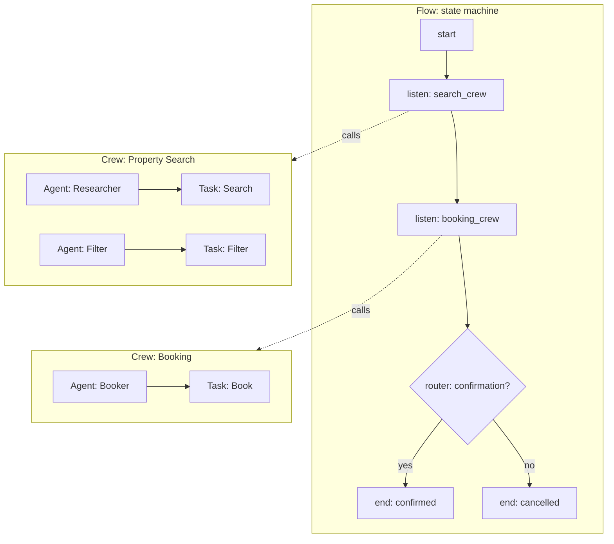

# 👥 CrewAI 1.0 — Production Multi-Agent Flows with Roles and Tasks

## 🎯 Learning Objectives

- Understand **CrewAI 1.0** as the framework that rethinks multi-agent orchestration around the **role-task-flow** mental model, replacing the 0.x agent-crew paradigm
- Master the new **Flow API** as the production state-machine that orchestrates crews with explicit state, persistence, and event listeners
- Author crews in **declarative YAML** for non-developer authors, or programmatically in Python for full control
- Use **structured outputs** with Pydantic models so every crew produces a typed result, not a free-form string
- Wire **observability** with the built-in `crewai-telemetry`, or export traces to [[../../05 - MLOps y Produccion/31 - Evidently AI and Phoenix/00 - Welcome to Evidently AI and Phoenix|Phoenix]] via OpenTelemetry
- Migrate a CrewAI 0.x crew to 1.0 syntax, and decide when CrewAI 1.0 is the right framework vs [[../15 - MCP and Agentic Protocols/04 - Computer Use and Browser Agents.md|OpenAI Agents SDK]] (handoffs) or [[../15 - MCP and Agentic Protocols/00 - Welcome to MCP and Agentic Protocols.md|Google ADK]] (SequentialAgent)

---

## Introduction

CrewAI 1.0 (released late 2025, v1.0+ in 2026) is the second major version of the framework that introduced **role-based multi-agent orchestration** to the agent ecosystem. The 0.x version was beloved for its elegant mental model — "agents have roles, crews have tasks, crews execute sequentially" — but was critiqued for its lack of production primitives: no explicit state, no event listeners, no structured outputs, and no way to compose crews with each other. The 1.0 release rethinks the framework around three new concepts: **Agents** (the role), **Tasks** (the work), and **Flows** (the production state machine that orchestrates crews).

The role-task-flow mental model maps to a familiar pattern in any team: an agent has a role (researcher, writer, editor), the role is assigned a task (write a report), and a flow orchestrates which tasks run in which order, with what state, and with what persistence. The pattern is the same as a real team lead assigning work to specialists and tracking progress in a project management tool. The framework's design is "agents are employees, flows are the org chart."

For your portfolio, the **StayBot** Airbnb agent is the natural migration target. The 0.x version of StayBot used a single crew of three agents (property searcher, booking agent, support agent) running sequentially. The 1.0 migration wraps the crew in a `Flow` with explicit state (user session, search history, booking status), event listeners (on_booking_confirmed → send email), and a Pydantic-typed output (`BookingResult`). The result is the same role-based mental model with production-grade state management.

CrewAI 1.0 is a poor choice if you need fine-grained control over the agent loop (use LangGraph), or if you need a managed deployment story (use Google ADK). The framework's strength is the role-task mental model for teams that think in roles, not graphs. For the **Multi-Agent Research System**, the migration from LangGraph to CrewAI 1.0 is a useful exercise: it shows how the same workflow can be expressed in two paradigms (graph vs roles), and the comparison clarifies when each is the right choice.

---

## 1. The Problem and Why This Solution Exists

### 1.1 The role-based mental model

The previous generation of agent frameworks (LangGraph, AutoGen) made the agent the fundamental unit and forced the developer to wire up multi-agent interactions with framework-specific primitives (`StateGraph`, `GroupChat`). CrewAI 0.x flipped this: the fundamental unit was the **role** (an agent with a specific persona, goal, and backstory), and the **crew** was a collection of agents with sequential or hierarchical task delegation. The mental model was so intuitive that it became the default for non-developer audiences — product managers, designers, and executives could read a CrewAI definition and understand it.

The 0.x version had three problems that limited its production use:

1. **No explicit state**: the crew had a `memory` attribute, but it was opaque and hard to inspect.
2. **No event listeners**: there was no way to react to "task X completed" or "agent Y started".
3. **No structured outputs**: tasks returned free-form strings, and the consumer had to parse them.

CrewAI 1.0 solves all three by introducing the **Flow** abstraction.

### 1.2 The Flow as a state machine

A Flow is a Python class that orchestrates one or more crews. The Flow has:

- **State**: an `@state` decorated Pydantic model that holds the persistent state across the flow's lifetime. State is **type-safe** (every attribute is a typed Pydantic field) and **serializable** (can be saved to Redis, Postgres, or a file).
- **Methods**: regular Python methods decorated with `@start`, `@listen`, `@router`, or `@and_` to define the flow's control flow.
- **Crews**: the crews are invoked from the flow methods, and the flow passes state to the crew and reads the result back.

```python
from crewai.flow.flow import Flow, start, listen, router
from pydantic import BaseModel

class BookingState(BaseModel):
    user_id: str
    search_query: str = ""
    properties: list[dict] = []
    booking_status: str = "pending"

class StayBotFlow(Flow[BookingState]):
    @start()
    def get_user_query(self):
        # Read the user's input, set the initial state
        self.state.search_query = "Apartment in Medellín for 2 nights"

    @listen(get_user_query)
    def search_properties(self):
        # Run a crew that searches for properties
        crew = PropertySearchCrew()
        result = crew.kickoff(inputs={"query": self.state.search_query})
        self.state.properties = result.pydantic.properties

    @listen(search_properties)
    def confirm_booking(self):
        # Run a crew that books the selected property
        crew = BookingCrew()
        result = crew.kickoff(inputs={"properties": self.state.properties})
        self.state.booking_status = "confirmed" if result.pydantic.confirmed else "cancelled"

flow = StayBotFlow()
flow.kickoff()
```

The Flow is a **state machine with Pydantic state, event listeners, and async support**. The pattern is the same as Temporal workflows (covered in [[../../05 - MLOps y Produccion/33 - Temporal for ML Pipelines/00 - Welcome to Temporal for ML Pipelines|Temporal note]]) or AWS Step Functions, but expressed in Python with the agent-crew primitives on top.

### 1.3 The declarative YAML crew

The other half of the 1.0 release is the **declarative YAML crew** definition. A crew can be defined in a `crew.yaml` file and loaded at runtime, which means non-developers (PMs, designers) can author crews without writing Python:

```yaml
# crew.yaml
agents:
  - role: Research Analyst
    goal: Find the most relevant academic papers on the topic
    backstory: You are an expert academic researcher with 10 years of experience
    llm: openai/gpt-4o-mini
    tools:
      - arxiv_search
      - web_search
  - role: Writer
    goal: Write a clear summary of the research findings
    backstory: You are a skilled technical writer
    llm: openai/gpt-4o-mini

tasks:
  - description: Search for 5 papers on {topic} and summarize each
    agent: Research Analyst
    expected_output: A list of 5 paper summaries with citations
    output_pydantic: PaperSummaries
  - description: Write a final report based on the paper summaries
    agent: Writer
    expected_output: A 2-page report in markdown
    output_pydantic: FinalReport

crew:
  process: sequential
  verbose: true
```

The YAML crew is loaded with `crew = Crew.from_yaml("crew.yaml")` and the framework constructs the agents, tasks, and crew. The `output_pydantic` field is the CrewAI 1.0 answer to the "untyped output" problem: every task declares a Pydantic model as its output type, and the framework validates the agent's response before returning.

---

## 2. Conceptual Deep Dive

### 2.1 Agents, Tasks, Crews, and Flows — the four layers

The framework has four distinct layers, each with its own purpose:

| Layer | Purpose | Key class |
|-------|---------|-----------|
| **Agent** | A role, goal, backstory, LLM, and tools | `Agent` |
| **Task** | A unit of work assigned to an agent, with an expected output | `Task` |
| **Crew** | A collection of agents and tasks, with a process (sequential, hierarchical) | `Crew` |
| **Flow** | A state machine that orchestrates crews with state, persistence, and events | `Flow` |

The four layers are **composable**: an agent can be reused across tasks, a task can be reused across crews, a crew can be invoked from a flow method, and a flow can invoke multiple crews. The mental model is "agents are roles, tasks are work, crews are teams, flows are org charts."



### 2.2 The Agent class

An Agent has a role, a goal, a backstory, an LLM, and a list of tools. The role-goal-backstory triple is the **persona** that the LLM adopts; the framework injects it into the system prompt as a `Persona:` block. The LLM is a string in the `provider/model` format (e.g., `openai/gpt-4o`, `anthropic/claude-sonnet-4.5`); the framework uses LiteLLM under the hood for provider routing.

```python
from crewai import Agent

researcher = Agent(
    role="Research Analyst",
    goal="Find the most relevant academic papers on the topic",
    backstory="You are an expert academic researcher with 10 years of experience",
    llm="openai/gpt-4o-mini",
    tools=[arxiv_search, web_search],
    verbose=True,
    allow_delegation=False,
)
```

The `allow_delegation` flag controls whether the agent can hand off to other agents in the crew. The default is False; set to True for the 0.x-style hierarchical process where the manager agent can delegate tasks.

### 2.3 The Task class

A Task is a unit of work. It has a description, an expected output, an agent, and an optional Pydantic output type. The description is templated with the input variables; the expected output is the natural-language description that the agent sees in the task prompt; the Pydantic output type is the structured schema that the agent's response is validated against.

```python
from crewai import Task
from pydantic import BaseModel, Field

class PaperSummary(BaseModel):
    title: str = Field(description="Paper title")
    authors: list[str] = Field(description="List of author names")
    key_claim: str = Field(description="The main claim of the paper")
    year: int = Field(description="Publication year")

search_task = Task(
    description="Search arXiv for 5 papers on {topic} and summarize each.",
    expected_output="A list of 5 paper summaries with title, authors, key claim, and year.",
    agent=researcher,
    output_pydantic=PaperSummary,  # The framework validates against this model
)
```

The `output_pydantic` is the **1.0 answer to structured outputs**: the agent's response is parsed and validated against the Pydantic model, and the result is accessible at `result.pydantic` (a Pydantic instance, not a string). The validation retry pattern is the same as PydanticAI (note 02): the LLM is re-prompted with the validation error until it produces a valid response, or the framework fails loudly.

### 2.4 The Crew class

A Crew is a collection of agents and tasks, with a process (sequential, hierarchical, or consensual). The process determines how tasks are assigned to agents:

- **Sequential**: tasks run in order, each task's output is the next task's input.
- **Hierarchical**: a manager agent decides which agent handles each task.
- **Consensual** (1.0 new): agents discuss and reach consensus on the output.

```python
from crewai import Crew, Process

crew = Crew(
    agents=[researcher, writer],
    tasks=[search_task, write_task],
    process=Process.sequential,  # or Process.hierarchical, Process.consensual
    verbose=True,
    memory=True,  # 1.0 new: persistent memory across crew runs
)

result = crew.kickoff(inputs={"topic": "Multi-Agent Systems"})
print(result.pydantic)  # Pydantic instance of the last task's output_pydantic
```

The `memory=True` flag enables **persistent memory** across crew runs: the crew maintains a long-term memory store (in-memory, SQLite, or Redis) that agents can read and write. The memory is the 1.0 answer to the "agents forget between runs" problem of the 0.x version.

### 2.5 The Flow class

A Flow is a state machine that orchestrates crews. The Flow has typed Pydantic state, decorated methods for control flow, and event listeners. The methods can be:

- `@start()`: the entry point. Exactly one per flow.
- `@listen(method_name)`: runs after the named method completes.
- `@router(method_name)`: a router that returns a string label, which routes to the corresponding `@listen(label)` method.
- `@and_(method1, method2)`: runs after both method1 and method2 complete (parallel fan-in).
- `@or_(method1, method2)`: runs after either method1 or method2 completes (parallel fan-out).

```python
from crewai.flow.flow import Flow, start, listen, router, and_

class ResearchFlowState(BaseModel):
    query: str = ""
    arxiv_results: list[dict] = []
    web_results: list[dict] = []
    final_report: str = ""

class ResearchFlow(Flow[ResearchFlowState]):
    @start()
    def init_query(self):
        self.state.query = "Multi-Agent Systems"

    @listen(init_query)
    def search_arxiv(self):
        crew = ArxivSearchCrew()
        result = crew.kickoff(inputs={"query": self.state.query})
        self.state.arxiv_results = result.pydantic.papers

    @listen(init_query)
    def search_web(self):
        crew = WebSearchCrew()
        result = crew.kickoff(inputs={"query": self.state.query})
        self.state.web_results = result.pydantic.pages

    @and_(search_arxiv, search_web)
    def synthesize(self):
        # Runs after both search_arxiv and search_web complete
        crew = SynthesisCrew()
        result = crew.kickoff(inputs={
            "arxiv_results": self.state.arxiv_results,
            "web_results": self.state.web_results,
        })
        self.state.final_report = result.pydantic.report

flow = ResearchFlow()
flow.kickoff()
print(flow.state.final_report)
```

The Flow pattern is the **most powerful primitive** in CrewAI 1.0: it gives you explicit state, event listeners, parallel fan-out, and conditional routing in a single Python class. For the **Multi-Agent Research System** portfolio project, the migration from LangGraph to a CrewAI 1.0 Flow is the clearest demonstration of the role-based mental model's production expressiveness.

### 2.6 Observability and tracing

The framework ships with `crewai-telemetry` for built-in observability: every crew run, every task, every tool call is traced. The traces can be exported to the OpenAI dashboard (via the LiteLLM integration), to Phoenix (via OpenTelemetry), or to a custom backend.

For your portfolio, the Phoenix integration is the natural fit (you already use Phoenix for the **Automated LLM Evaluation Suite**):

```python
from phoenix.otel import register
from openinference.instrumentation.crewai import CrewAIInstrumentor

tracer_provider = register(project_name="my-crewai-agents")
CrewAIInstrumentor().instrument(tracer_provider=tracer_provider)
```

The same Phoenix dashboard can show traces from your CrewAI 1.0 flows, your PydanticAI agents, and your smolagents code — one observability backend, three frameworks.

---

## 3. Production Reality

### 3.1 Latency profile

A CrewAI 1.0 run has the same per-step latency as any tool-calling framework: one LLM turn per tool call, plus the Flow overhead (state management, event listeners, ~5-20ms per method). A 3-task sequential crew with GPT-4o-mini is 6-12 seconds. A Flow with 2 parallel crews and 1 synthesis crew is max(crew1, crew2) + synthesis = 6-15 seconds. A consensual crew (1.0 new) is 2-3x slower because agents discuss.

For sub-100ms responses, CrewAI 1.0 is the wrong tool — use a pre-scripted workflow. For multi-second multi-agent orchestration with explicit state, CrewAI 1.0 is the right tool.

### 3.2 Cost profile

CrewAI 1.0 uses LiteLLM under the hood for provider routing, so the cost profile is the same as any LiteLLM-routed agent: GPT-4o-mini ~$0.005-0.02 per 5-tool run, Claude Sonnet 4.5 ~$0.05-0.15, Gemini 2.5 Flash ~$0.001-0.005. The `memory=True` flag adds a small per-run cost (storage and retrieval). The `output_pydantic` validation adds 0-2 LLM turns for the retry mechanism.

For cost-sensitive workloads, the LiteLLM integration gives you Redis semantic caching for free, plus the [[../../06 - Large Language Models/19 - LLM Gateway Patterns and LiteLLM/00 - Welcome to LLM Gateway Patterns and LiteLLM.md|LiteLLM Gateway]] for routing.

### 3.3 Production case — the multi-agent content team

The most common 2026 production pattern for CrewAI 1.0 is **content team automation**: a Flow that orchestrates a research crew, a writing crew, and an editing crew, with state that tracks the article's progress, and event listeners that notify the team lead when each stage completes. The pattern is used by content marketing teams, news organizations, and any business that produces large volumes of long-form content.

The architecture: a `Flow` with `@start()` that reads the topic, `@listen()` that runs the research crew, `@listen()` that runs the writing crew, `@router()` that checks the editor's verdict (publish or revise), and `@and_()` that publishes to the CMS when the editor approves. The state is persisted to Postgres, the traces are exported to Phoenix, and the whole flow is deployed as a FastAPI endpoint.

### 3.4 Migration from 0.x to 1.0

The 0.x → 1.0 migration is non-trivial but well-documented. The main changes are:

1. **`memory=True`** replaces the 0.x `memory` attribute on the Crew.
2. **`output_pydantic`** replaces the 0.x `output_json` attribute on the Task.
3. **Flow** replaces the 0.x pattern of nesting crews.
4. **`@start`, `@listen`, `@router`** replace the 0.x `allow_delegation` and `manager` attributes.

For your **StayBot** portfolio project, the migration is:

```python
# 0.x style (legacy)
crew = Crew(agents=[...], tasks=[...], process=Process.sequential, memory=True)
result = crew.kickoff(inputs={...})

# 1.0 style (modern)
class StayBotFlow(Flow[BookingState]):
    @start()
    def start(self): ...
    @listen(start)
    def search(self):
        result = PropertySearchCrew().kickoff(inputs={...})
flow = StayBotFlow()
flow.kickoff()
```

The 1.0 style is more code, but the state is explicit, the event listeners are first-class, and the structured output is guaranteed. For production, the 1.0 style is the right choice.

### 3.5 Failure modes

| Failure mode | Symptom | Fix |
|--------------|---------|-----|
| Output does not match `output_pydantic` | `ValidationError` after retries | Add `output_pydantic` examples in the task prompt |
| Crew runs forever (consensual process) | `max_iterations` reached | Set `max_iterations` on the crew; switch to sequential |
| Flow state is not persisted | State lost on restart | Use `flow.kickoff(state_id="...")` and a persistent storage backend |
| Memory grows unbounded | Slow retrieval, high storage cost | Set `memory_ttl` on the crew; periodically clean up |
| LiteLLM rate limit hit | `RateLimitError` | Switch to a fallback provider; add retry with backoff |
| Agent delegates to itself | Infinite loop | Set `allow_delegation=False` on all agents except the manager |

### 3.6 Comparison: CrewAI 1.0 vs the other five frameworks

| Framework | Mental model | Best for | Worst for |
|-----------|--------------|----------|-----------|
| **CrewAI 1.0** | Role-task-flow | Multi-agent role-playing, content teams | Fine-grained control over agent loop |
| **OpenAI Agents SDK** | Handoff-based | OpenAI-only stacks, hosted tools | Role-based mental model |
| **Google ADK** | Composition primitives | GCP deployments, structured composition | Role-based mental model |
| **smolagents** | Code-as-action | Composable multi-step workflows | Multi-agent role-playing |
| **PydanticAI** | Type-safe | Production backends, structured extraction | Multi-agent role-playing |
| **transformers.agents** | Hub-native | Hub models, multi-modal | Multi-agent role-playing |

---

## 4. Code in Practice

### 4.1 Minimal example: one crew with two agents and two tasks

```python
# 👥 MINIMAL: CrewAI 1.0 with one crew, two agents, two tasks
# Install: pip install crewai

from crewai import Agent, Task, Crew, Process
from pydantic import BaseModel, Field
from crewai_tools import SerperDevTool

class PaperSummary(BaseModel):
    title: str = Field(description="Paper title")
    key_claim: str = Field(description="Main claim of the paper")

researcher = Agent(
    role="Research Analyst",
    goal="Find the most relevant academic papers on the topic",
    backstory="You are an expert academic researcher with 10 years of experience",
    llm="openai/gpt-4o-mini",
    tools=[SerperDevTool()],
    verbose=True,
)

writer = Agent(
    role="Technical Writer",
    goal="Write a clear and concise summary of the research findings",
    backstory="You are a skilled technical writer who makes complex topics accessible",
    llm="openai/gpt-4o-mini",
    verbose=True,
)

search_task = Task(
    description="Search for 3 papers on {topic} and write a PaperSummary for each.",
    expected_output="A list of 3 PaperSummary objects with title and key_claim.",
    agent=researcher,
    output_pydantic=list[PaperSummary],
)

write_task = Task(
    description="Write a 2-paragraph summary of the research findings.",
    expected_output="A clear, accessible summary in markdown.",
    agent=writer,
)

crew = Crew(
    agents=[researcher, writer],
    tasks=[search_task, write_task],
    process=Process.sequential,
    verbose=True,
)

result = crew.kickoff(inputs={"topic": "Multi-Agent Systems"})
print(result.raw)  # Final markdown summary
```

### 4.2 Flow with state and event listeners

```python
# FLOW: state machine with parallel fan-out and event listeners
from crewai.flow.flow import Flow, start, listen, and_
from pydantic import BaseModel
from crewai import Crew, Agent, Task, Process

class ResearchState(BaseModel):
    topic: str = ""
    arxiv_results: list[str] = []
    web_results: list[str] = []
    final_report: str = ""

def make_search_crew(name: str, source: str) -> Crew:
    agent = Agent(role=f"{name} Researcher", goal=f"Search {source}", backstory="...", llm="openai/gpt-4o-mini")
    task = Task(description=f"Search {source} for 3 results on {{topic}}", expected_output="...", agent=agent)
    return Crew(agents=[agent], tasks=[task], process=Process.sequential)

class ResearchFlow(Flow[ResearchState]):
    @start()
    def init_topic(self):
        print(f"[Flow] Starting research on: {self.state.topic}")
        self.state.topic = "Multi-Agent Systems"

    @listen(init_topic)
    def search_arxiv(self):
        crew = make_search_crew("ArXiv", "arXiv")
        result = crew.kickoff(inputs={"topic": self.state.topic})
        self.state.arxiv_results = result.raw.split("\n")

    @listen(init_topic)
    def search_web(self):
        crew = make_search_crew("Web", "the web")
        result = crew.kickoff(inputs={"topic": self.state.topic})
        self.state.web_results = result.raw.split("\n")

    @and_(search_arxiv, search_web)
    def synthesize(self):
        # Runs after both parallel searches complete
        writer = Agent(role="Writer", goal="Synthesize the results", llm="openai/gpt-4o-mini")
        task = Task(
            description="Combine the arxiv and web results into a unified report.",
            expected_output="A 2-page markdown report.",
            agent=writer,
        )
        crew = Crew(agents=[writer], tasks=[task])
        result = crew.kickoff(inputs={
            "arxiv_results": "\n".join(self.state.arxiv_results),
            "web_results": "\n".join(self.state.web_results),
        })
        self.state.final_report = result.raw

flow = ResearchFlow()
flow.kickoff()
print(flow.state.final_report)
```

### 4.3 Declarative YAML crew

```python
# YAML: declarative crew definition
from crewai import Crew

crew = Crew.from_yaml("research_crew.yaml")
result = crew.kickoff(inputs={"topic": "Multi-Agent Systems"})
```

```yaml
# research_crew.yaml
agents:
  - role: Research Analyst
    goal: Find the most relevant academic papers on the topic
    backstory: You are an expert academic researcher with 10 years of experience
    llm: openai/gpt-4o-mini
  - role: Technical Writer
    goal: Write a clear and concise summary of the research findings
    backstory: You are a skilled technical writer
    llm: openai/gpt-4o-mini

tasks:
  - description: Search for 3 papers on {topic}
    agent: Research Analyst
    expected_output: A list of 3 paper titles and key claims
  - description: Write a 2-paragraph summary
    agent: Technical Writer
    expected_output: A clear, accessible summary

crew:
  process: sequential
  verbose: true
```

### 4.4 Phoenix observability integration

```python
# OBSERVABILITY: export CrewAI traces to Phoenix
from phoenix.otel import register
from openinference.instrumentation.crewai import CrewAIInstrumentor

tracer_provider = register(project_name="my-crewai-agents")
CrewAIInstrumentor().instrument(tracer_provider=tracer_provider)

# Now every crew.kickoff() and flow.kickoff() call is traced to Phoenix
result = crew.kickoff(inputs={"topic": "Multi-Agent Systems"})
```

### 4.5 Common pitfalls

| Pitfall | Consequence | Solution |
|---------|-------------|----------|
| Forgetting `output_pydantic` on a Task | Returns a free-form string, no validation | Add `output_pydantic=YourModel` to every structured task |
| `process=Process.hierarchical` without a manager agent | Crew fails to start | Either add a `manager_agent` or use `Process.sequential` |
| Flow state not persisted across runs | State lost on restart | Use `flow.kickoff(state_id="...")` with a persistent backend |
| `consensual` process with 5+ agents | Crew runs forever | Set `max_iterations`; reduce to 2-3 agents |
| Memory grows unbounded | Slow retrieval, high cost | Set `memory_ttl` on the crew |
| Agent backstory is too verbose | LLM wastes tokens on the persona | Keep backstory to 1-2 sentences |

> 💡 **Tip**: For portfolio demos, the **Flow pattern is the strongest feature of CrewAI 1.0**: explicit state, parallel fan-out, and event listeners make the multi-agent workflow self-documenting. The same demo in LangGraph requires graph DSL; in CrewAI 1.0 it's a Python class with decorators.

---

## 📦 Compression Code

```python
# NOTE: 06 - CrewAI 1.0
# Repo: github.com/crewAIInc/crewAI (MIT, 30k+ stars, v1.0+)
# Four layers: Agent (role) -> Task (work) -> Crew (team) -> Flow (state machine)
# Mental model: agents are employees, crews are teams, flows are org charts
# Flow API: @start, @listen, @router, @and_, @or_ decorators + Pydantic state
# Declarative YAML: Crew.from_yaml("crew.yaml") for non-developer authors
# Structured outputs: output_pydantic on every Task, Pydantic-validated
# Memory: persistent across crew runs, in-memory / SQLite / Redis backend
# LLM: LiteLLM under the hood, any provider/model string
# Observability: crewai-telemetry built-in, OpenTelemetry export to Phoenix
# Use case: StayBot migration from 0.x to 1.0, content team automation

from crewai import Agent, Task, Crew, Process
from crewai.flow.flow import Flow, start, listen, and_
from pydantic import BaseModel

class PaperSummary(BaseModel):
    title: str
    key_claim: str

researcher = Agent(role="Researcher", goal="Find papers", backstory="...", llm="openai/gpt-4o-mini")
search_task = Task(description="Find 3 papers on {topic}", expected_output="...", agent=researcher, output_pydantic=list[PaperSummary])
crew = Crew(agents=[researcher], tasks=[search_task], process=Process.sequential)
result = crew.kickoff(inputs={"topic": "Multi-Agent Systems"})

# Flow with state and parallel fan-out
class ResearchState(BaseModel):
    topic: str = ""
    results: list = []

class ResearchFlow(Flow[ResearchState]):
    @start()
    def init(self): self.state.topic = "Multi-Agent Systems"

    @listen(init)
    def run_search(self):
        result = crew.kickoff(inputs={"topic": self.state.topic})
        self.state.results = result.pydantic

flow = ResearchFlow()
flow.kickoff()
print(flow.state.results)
```

## 🎯 Key Takeaways

- **The role-task-flow mental model maps to a familiar team structure** — agents are roles, crews are teams, flows are org charts
- **The Flow API is the most powerful primitive** — explicit Pydantic state, parallel fan-out (`@and_`), event listeners, and conditional routing (`@router`)
- **Structured outputs via `output_pydantic`** — every task declares a Pydantic model, the framework validates the agent's response
- **Declarative YAML crews** enable non-developer authors to define agent teams without writing Python
- **LiteLLM under the hood** — the framework uses the same model routing as the [[../../06 - Large Language Models/19 - LLM Gateway Patterns and LiteLLM/00 - Welcome to LLM Gateway Patterns and LiteLLM.md|LiteLLM Gateway]], with provider fallback chains and cost tracking

## References

- CrewAI documentation: https://docs.crewai.com/
- CrewAI GitHub: https://github.com/crewAIInc/crewAI
- CrewAI 1.0 migration guide: https://docs.crewai.com/migration
- Flow API guide: https://docs.crewai.com/flows
- CrewAI Tools: https://github.com/crewAIInc/crewAI-Tools
- OpenInference CrewAI instrumentation: https://github.com/Arize-ai/openinference/tree/main/python/instrumentation/openinference-instrumentation-crewai
- Phoenix: https://docs.arize.com/phoenix
- Comparison with LangGraph: https://docs.crewai.com/comparison
