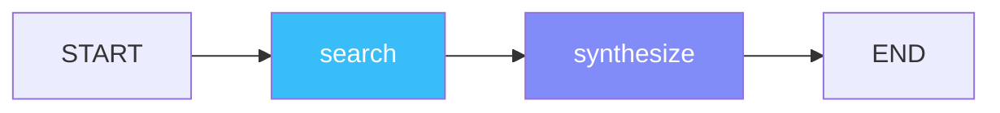
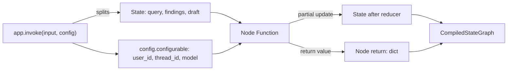

# 🕸️ StateGraph Fundamentals — Nodes, Edges, State and Reducers

The `StateGraph` is LangGraph's only primitive. Every LangGraph agent — from the simplest "call an LLM" one-shot to the cyclic [[../15 - MCP and Agentic Protocols/03 - LangGraph + MCP Integration.md|LangGraph + MCP]] graph or the [[../../../13 - Go Engineering/05 - Local AI with Go/04 - RAG Pipelines with Go and Vector DBs.md|Go RAG pipelines]] that pass messages back and forth — is a `StateGraph`. Once you internalize the four contracts (state, node, edge, runtime), the framework becomes predictable: every "advanced" feature is a permutation of those four.

This note builds that mental model from first principles. We start with the simplest possible graph and progressively add state, reducers, partial updates, and the `config["configurable"]` runtime context. By the end, you will be able to read any LangGraph source code in the wild and predict the state transitions.

## 🎯 Learning Objectives

- Define a typed state schema with `TypedDict` and `Annotated` reducers.
- Write node functions as pure `(state) -> partial_state` transformations.
- Wire `START`, `END`, and `add_edge` to compose a directed graph.
- Distinguish **partial state updates** from **full state replacement** — and when each is right.
- Use `Annotated[..., reducer]` to control how repeated writes merge (append, override, last-write-wins).
- Inject runtime context via `config["configurable"]` (model name, user ID, thread ID).
- Compile and invoke a graph, and reason about the resulting `StateSnapshot`.
- Recognize the `Pydantic BaseModel` alternative and when to pick it over `TypedDict`.

## 1. The Problem: Why a Graph, Not a Loop

Before LangGraph, the typical "agent loop" looked like this:

```python
# ❌ The pre-LangGraph agent loop
def agent(messages: list[dict]) -> str:
    while True:
        response = llm.invoke(messages)
        if response.tool_calls:
            for call in response.tool_calls:
                result = run_tool(call)
                messages.append({"role": "tool", "content": result})
        else:
            return response.content
```

That code works for a single agent with a single tool. It breaks the moment you need:

- **Multiple agents with hand-offs** (triage → billing vs technical).
- **Pause-and-resume** across user messages ("yes, that flight" on Monday, "what about hotels?" on Friday).
- **Human-in-the-loop approval** ("confirm before booking").
- **Real-time token streaming** while still emitting "searching Tavily..." status events.

All four problems have the same shape: **the agent's state is non-trivial, and the next action depends on a typed snapshot of that state plus runtime context**. LangGraph's answer is to make state explicit, typed, and routable. Instead of `messages.append(...)` inside a `while True`, you write a `StateGraph` whose nodes read and return partial state and whose edges declare the control flow.



That's the entire framework. Two nodes, two edges, a `START`/`END` pair. Everything else — conditional routing, persistence, subgraphs, streaming — is a refinement of this skeleton.

## 2. State: TypedDict with Annotated Reducers

The state is a `TypedDict`. Every node reads the full state and returns a **partial** update. The framework merges the partial update into the state using the field's reducer (default: override).

```python
from typing import Annotated, TypedDict

# The schema
class ResearchState(TypedDict):
    query: str                  # plain field — default reducer (override)
    findings: Annotated[        # custom reducer (append)
        list[str],
        lambda old, new: old + new,
    ]
    draft: str
```

Three things to notice:

1. **`TypedDict` is structural, not nominal.** LangGraph doesn't enforce that every field is set at initialization; it just expects the shape to be consistent at runtime. If a node tries to write a field not in the schema, you get a `KeyError` at runtime, not a static error.
2. **`Annotated[T, reducer]` declares the merge rule.** Without it, `findings: list[str]` would be **replaced** on every write — exactly the wrong behavior for an append-only log.
3. **The reducer is `(old, new) -> merged`.** It receives the current value of the field and the value being written. The return value is what becomes the new value.

> ⚠️ **Advertencia**: Reducers are called on every write, including from `invoke(input)`. If your `invoke()` payload contains `{"findings": ["seed"]}` and your reducer is `lambda old, new: old + new`, then `old = []` (initial state) and `findings` becomes `["seed"]`. That is correct — but the order of merges matters when multiple nodes write in one super-step.

### Default Reducer (Override)

```python
class State(TypedDict):
    draft: str  # no Annotated — default reducer is full replacement

def synthesize(state: State) -> dict:
    return {"draft": f"Final answer for {state['query']}"}
```

Each write replaces the prior value. This is the right reducer for terminal fields like `draft`, `final_answer`, or `status`.

### Append-Only Reducer (Operator.add)

```python
from operator import add

class State(TypedDict):
    log: Annotated[list[str], add]  # equivalent to lambda old, new: old + new

def node_a(state: State) -> dict:
    return {"log": ["a ran"]}
```

`operator.add` works for both `list` (concatenation) and `int` (addition). For dicts, you'd need a custom `lambda old, new: {**old, **new}`.

> 💡 **Tip:** `operator.add` is the canonical "append" reducer. Use it for `messages`, `log`, `findings`, `events`, `errors`. Importing `add` is more readable than a `lambda old, new: old + new` and is the convention in LangGraph docs.

### Last-Write-Wins (Custom)

```python
class State(TypedDict):
    # Last value wins, but only if non-empty (defensive against None)
    current_step: Annotated[str, lambda _, new: new if new else "unknown"]
```

This is useful when nodes may write `""` or `None` as "I haven't decided yet" and you want the previous non-empty value preserved.

### ❌/✅ Antipattern: State Fields With No Reducer, Multi-Writer

```python
# ❌ Two nodes write to the same field with no reducer — last writer wins, debug hell
class State(TypedDict):
    answer: str

def node_a(state: State) -> dict:
    return {"answer": "A says X"}

def node_b(state: State) -> dict:
    return {"answer": "B says Y"}

# Whichever node runs last wins. The other node's output is silently discarded.
```

```python
# ✅ Append reducer when both nodes contribute to the same list
class State(TypedDict):
    answers: Annotated[list[str], add]

def node_a(state: State) -> dict:
    return {"answers": ["A says X"]}

def node_b(state: State) -> dict:
    return {"answers": ["B says Y"]}

# Both contributions preserved.
```

## 3. Nodes: Pure Functions Returning Partial State

A node is a Python callable that takes the current state (and optionally `config`) and returns a partial state update:

```python
def my_node(state: ResearchState, config: RunnableConfig) -> dict:
    """Pure-ish: reads state, returns partial dict."""
    user_id = config["configurable"]["user_id"]
    return {"findings": [f"Found something for user {user_id}"]}
```

**The contract:**

- **Input:** full state (a `dict`-like object matching the `TypedDict`).
- **Optional input:** `config: RunnableConfig` — the second positional arg, only if you need runtime context.
- **Output:** a `dict` whose keys are state field names. Values go through the field's reducer.
- **Side effects:** allowed (LLM calls, DB writes), but discouraged if you can avoid them — pure nodes are testable.

```python
# Two equivalent signatures
def node_a(state: State) -> dict: ...
def node_b(state: State, config: RunnableConfig) -> dict: ...
```

> ⚠️ **Advertencia:** A node that returns `None` or an empty dict is a valid no-op. A node that returns a non-state field (e.g., `{"step_count": 1}` for a state without that field) raises `InvalidUpdateError` at runtime. Always double-check that your return dict matches the state schema.

### Async Nodes

```python
async def async_node(state: State) -> dict:
    response = await llm.ainvoke(state["messages"])
    return {"messages": [response]}
```

LangGraph supports async natively — `await app.ainvoke(...)` runs async nodes concurrently where the graph structure allows. We revisit this in [[06 - Streaming Modes - values, messages, updates, custom|note 06]].

### Nodes That Read But Don't Write

```python
def log_node(state: State) -> dict:
    print(f"Current state: {state}")
    return {}  # no state update — pure side-effect node
```

This is valid. Useful for debugging, metrics emission, or guard nodes (e.g., a node that calls a rate limiter and returns nothing).

## 4. Edges: START, END, and add_edge

```python
from langgraph.graph import StateGraph, START, END

graph = StateGraph(ResearchState)
graph.add_node("search", search_fn)
graph.add_node("synthesize", synthesize_fn)

# Linear edges
graph.add_edge(START, "search")
graph.add_edge("search", "synthesize")
graph.add_edge("synthesize", END)
```

`START` and `END` are sentinels — they are not nodes you define; they are the implicit entry and exit points. `START` always points to the first real node; `END` is reached when no more edges fire.


> 💡 **Tip:** Every graph must have at least one outgoing edge from `START`. A graph with `START` pointing to nothing raises `GraphRecursionError` immediately. Likewise, if a node has no outgoing edges and is not `END`, the graph halts with the node's state as the final output.

## 5. Compile and Invoke

```python
app = graph.compile()
result = app.invoke({"query": "LangGraph reducers"})
print(result["draft"])
```

`compile()` does three things:

1. **Validates the graph** — every node referenced in edges must exist; every edge's source/target must be valid; `START` and `END` must be wired.
2. **Freezes the schema** — the compiled graph is immutable; you cannot `add_node` after `compile()`.
3. **Returns a `CompiledStateGraph`** — the runnable object that supports `invoke`, `ainvoke`, `stream`, `astream`, `get_state`, `update_state`, etc.

```python
# Result is the final state, not just the last node's output
result = app.invoke({"query": "X"})
# {"query": "X", "findings": [...], "draft": "..."}
```

The `invoke()` payload is the **initial** state. Fields not provided in the input are initialized to whatever the reducer produces for an empty old value — for a plain `str`, that's `""`; for `Annotated[list, add]`, that's `[]`. Missing required fields with no reducer may cause `KeyError` downstream.

### Re-invoking With Same State (Stateless by Default)

```python
result1 = app.invoke({"query": "A"})
result2 = app.invoke({"query": "B"})
# result2 has no memory of result1. Each invoke is independent.
```

Without a **checkpointer**, every `invoke()` is a fresh start. This is what most introductory tutorials show, and it's also what makes LangGraph feel like overkill. The persistence layer (note 03) is where the framework earns its complexity.

## 6. The Configurable Runtime Context

The second positional arg to a node is `config: RunnableConfig`. The most important key is `config["configurable"]`, a free-form dict that the caller passes at `invoke()` time:

```python
def synthesize(state: ResearchState, config: RunnableConfig) -> dict:
    user_id = config["configurable"]["user_id"]
    model_name = config["configurable"].get("model", "gpt-4o-mini")
    llm = ChatOpenAI(model=model_name)
    prompt = f"User {user_id} asks: {state['query']}"
    return {"draft": llm.invoke(prompt).content}

# Caller controls runtime context
app.invoke(
    {"query": "Best restaurant in Medellín"},
    config={"configurable": {"user_id": "u-42", "model": "gpt-4o"}},
)
```

The `configurable` dict is also where the **checkpointer** reads `thread_id` from (note 03) and where `interrupt()` reads its payload (note 05). It is the **only** way to inject runtime values into a graph without baking them into the state.

> 💡 **Tip:** Treat `config["configurable"]` as the **request-scoped context** (user ID, tenant ID, trace ID, feature flags, model name) and the **state** as the **long-lived workflow context** (query, findings, draft). Mixing them is a common source of bugs.



## 7. Pydantic BaseModel Alternative

LangGraph supports `BaseModel` schemas as a drop-in replacement for `TypedDict`:

```python
from pydantic import BaseModel, Field
from typing import Annotated
from operator import add

class ResearchState(BaseModel):
    query: str
    findings: Annotated[list[str], add] = Field(default_factory=list)
    draft: str = ""
```

The tradeoff:

| Aspect | `TypedDict` | `Pydantic BaseModel` |
|--------|-------------|----------------------|
| Validation | None (structural) | Full validation on input + output |
| Defaults | None (KeyError if missing) | `Field(default_factory=...)` |
| Serialization | Manual (`dict(state)`) | `state.model_dump()` |
| Performance | Fastest | Slower (Pydantic validation overhead) |
| IDE support | Weaker (structural) | Strong (Pydantic models are classes) |
| Best for | High-throughput paths, simple state | Complex state, validation requirements |

**Recommendation:** Use `TypedDict` for performance-critical hot paths (high-frequency agents, streaming token updates). Use `BaseModel` for state with nested structures, validators, or when you want auto-generated JSON schemas for LangGraph Studio's visualizer.

## 8. The StateSnapshot — Inspecting Graph State

Every `invoke` and `stream` emits a `StateSnapshot` you can query:

```python
snapshot = app.get_state(config)
print(snapshot.values)      # current state dict
print(snapshot.next)        # tuple of next node names
print(snapshot.config)      # the RunnableConfig used
print(snapshot.metadata)    # step count, source, writes
```

This is the API that makes LangGraph **inspectable**. The `Multi-Agent Research System` capstone (note 09) uses `get_state` to render the agent's current node in the FastAPI surface so the UI can show "Researching... / Fact-Auditing... / Synthesizing...".

> 💡 **Tip:** `app.get_state_history(config)` returns every snapshot the graph has ever produced — the full execution trace. With a checkpointer (note 03), this is a **time-travel debugger**: you can rewind to any prior step and resume from there.

## 9. Production Reality: Why StateGraph Beats ad-hoc Loops

**Caso real — Multi-Agent Research System:** Your portfolio agent is a cyclic `StateGraph`: `Research → FactAudit → Synthesis → Research` (with a counter that breaks the cycle after N iterations). Implemented as a `while True`, the cycle was impossible to debug — when the agent looped infinitely on a malformed Tavily response, you had to add print statements and re-run. As a `StateGraph` with a checkpointer, you can `get_state_history()` after the failure, see exactly which step introduced the bad response, and rewind. The same agent went from "works on my laptop" to "explainable in interviews" by adopting the state graph primitive.

**Caso real — StayBot:** Your CrewAI Airbnb agent does a role-based crew for property search. The production version (note 09 of [[../17 - Production Agent Frameworks/06 - CrewAI 1.0 - Production Multi-Agent Flows.md|CrewAI 1.0]]) uses LangGraph internally for the conditional routing that decides between "show availability", "negotiate price", and "confirm booking". The state graph handles the "if the user accepted, dispatch; otherwise re-prompt" branch that role-based orchestration makes awkward.

## 📦 Compression Code

```python
# 📦 Compression: StateGraph fundamentals in 60 lines
# Covers: TypedDict state, Annotated reducers, nodes, edges, compile, invoke, configurable

from typing import Annotated, TypedDict
from operator import add
from langgraph.graph import StateGraph, START, END
from langgraph.runnables import RunnableConfig

# 1. State schema with two reducer styles
class SupportState(TypedDict):
    query: str
    log: Annotated[list[str], add]      # append-only
    answer: str                          # last-write-wins

# 2. Three pure node functions
def classify(state: SupportState) -> dict:
    intent = "billing" if "refund" in state["query"].lower() else "general"
    return {"log": [f"classified as {intent}"], "answer": intent}

def enrich(state: SupportState, config: RunnableConfig) -> dict:
    user = config["configurable"]["user_id"]
    return {"log": [f"enriched for {user}"]}

def finalize(state: SupportState) -> dict:
    return {"answer": f"{state['answer']}: processed {len(state['log'])} steps"}

# 3. Wire the graph
graph = StateGraph(SupportState)
graph.add_node("classify", classify)
graph.add_node("enrich", enrich)
graph.add_node("finalize", finalize)
graph.add_edge(START, "classify")
graph.add_edge("classify", "enrich")
graph.add_edge("enrich", "finalize")
graph.add_edge("finalize", END)

# 4. Compile (no checkpointer — note 03 covers persistence)
app = graph.compile()

# 5. Invoke with configurable runtime context
result = app.invoke(
    {"query": "I want a refund"},
    config={"configurable": {"user_id": "u-7"}},
)
print(result)
# {'query': 'I want a refund',
#  'log': ['classified as billing', 'enriched for u-7'],
#  'answer': 'billing: processed 2 steps'}
```

This file is the entry point. The next note ([[02 - Conditional Routing and Dynamic Edges|note 02]]) extends the same graph with `add_conditional_edges` to dispatch between billing and general flows. Note 03 adds persistence so the same `thread_id` resumes from `finalize` if the user comes back the next day.

## 🎯 Key Takeaways

1. **`StateGraph` is the only primitive.** Every LangGraph feature — persistence, subgraphs, HITL, streaming — is a refinement of `add_node` + `add_edge` + `compile`.
2. **State is a `TypedDict` (or `BaseModel`) with `Annotated` reducers.** The reducer controls how multiple writes merge. `operator.add` is the canonical append reducer.
3. **Nodes are pure functions returning partial state.** A node that returns `None` is a no-op; a node that returns a non-schema field raises `InvalidUpdateError`.
4. **`START` and `END` are sentinels**, not nodes. Every graph needs `START` wired; `END` halts the graph.
5. **`config["configurable"]` is the runtime context** — user_id, thread_id, model name. State is the workflow context. Mixing them is a bug.
6. **`get_state` and `get_state_history` are the inspectability primitive.** With a checkpointer, they enable time-travel debugging.
7. **Default reducer is override; use `Annotated` for append/dict-merge.** A two-node graph writing to a plain `list[str]` field will silently lose one writer's output.

## References

- [[00 - Welcome to LangGraph Deep Patterns|Welcome]] — course map and prerequisites.
- [[../15 - MCP and Agentic Protocols/03 - LangGraph + MCP Integration.md|LangGraph + MCP Integration]] — applies `StateGraph` to dynamic tool discovery.
- [[../../../03 - Advanced Python/06 - Pydantic Deep Dive/01 - BaseModel, Field and Type System.md|Pydantic BaseModel]] — the alternative state schema.
- [[../../../03 - Advanced Python/03 - Python Avanzado/05 - Type Hints y Anotaciones.md|Type Hints y Anotaciones]] — the `Annotated` syntax from PEP 593.
- LangGraph StateGraph API: https://langchain-ai.github.io/langgraph/reference/graphs/#langgraph.graph.StateGraph