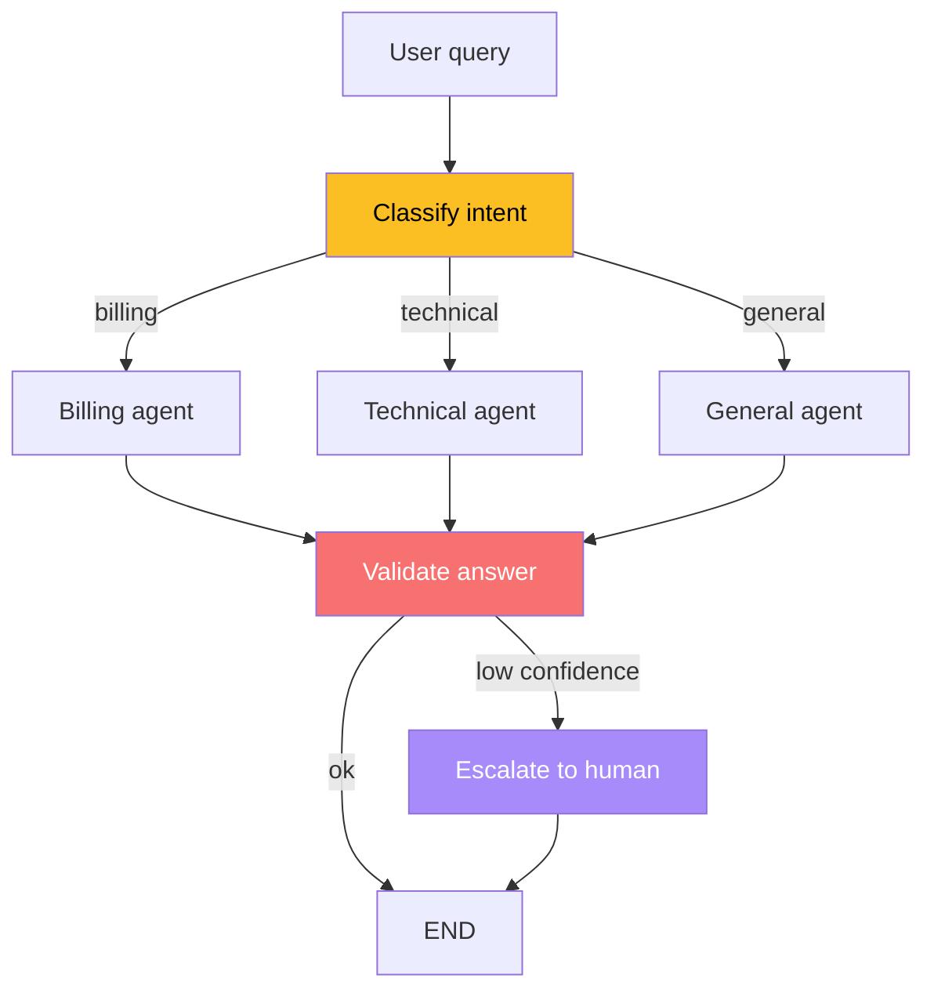
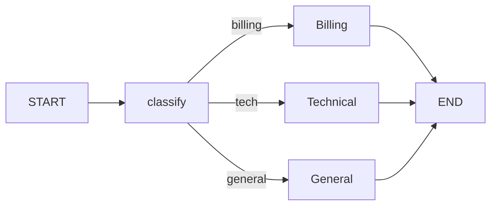
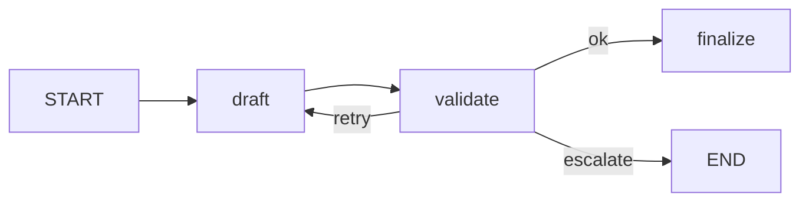
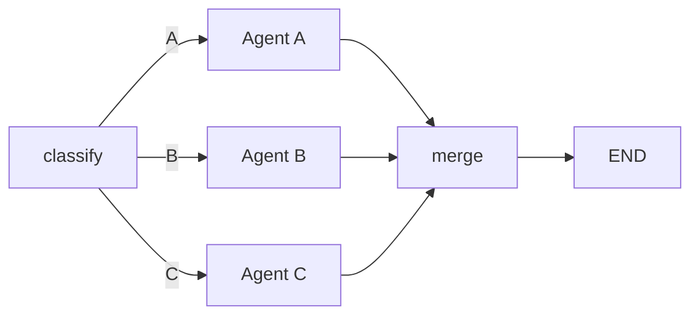

# 🔀 Conditional Routing and Dynamic Edges

A linear graph — `START → search → synthesize → END` — covers the trivial case. Every real agent needs to **decide** at runtime: dispatch the user's query to the billing agent or the technical agent, run the synthesizer if the research is complete, escalate to a human if confidence is low. LangGraph's conditional routing is the primitive that turns a static flowchart into a decision-aware workflow. The `add_conditional_edges` API is small (one method, three arguments), but the patterns it unlocks — triage, multi-paths, validation gates, retry loops, parallel fan-in — cover every dispatch shape you will encounter in production.

This note covers the path function API, the path map, common dispatch patterns, and the difference between `add_conditional_edges` and `add_edge`. By the end you will read `add_conditional_edges` calls in the wild and predict the dispatcher output without running the code.

## 🎯 Learning Objectives

- Write path functions that read state and return a node name (or a list of names).
- Use `path_map` to decouple path function output from internal node names.
- Compose conditional edges for triage, validation, multi-choice dispatch, and dynamic fan-in.
- Distinguish `add_conditional_edges` (branch on node output) from `add_edge` (always-firing edge).
- Avoid the four most common routing bugs (missing END, dead-end nodes, missing path_map entry, returning `None` from a path function).
- Combine conditional edges with subgraphs (note 04) to build composable routing hierarchies.

## 1. The Linear Graph Is Not Enough

The graph from [[01 - StateGraph Fundamentals - Nodes Edges State and Reducers|note 01]] is linear: every node runs in order. Real agents look like this:



That branching — `T` chooses between `B`, `Tech`, and `G`, and `Val` chooses between `END` and `H` — is exactly what `add_conditional_edges` provides.

## 2. The `add_conditional_edges` API

```python
graph.add_conditional_edges(
    source: str | type[START],     # the node whose output is being routed
    path: Callable[[State], str],  # decision function: state -> node name
    path_map: dict[str, str] | None = None,  # optional mapping
)
```

Three arguments, three roles:

| Argument | Purpose |
|----------|---------|
| `source` | The node after which to branch. Can be `START` (route the very first decision) or any defined node. |
| `path` | A function `(state) -> str`. The string is the **next** node name. The function reads state and decides. |
| `path_map` | An optional mapping from path function output to actual node names. Useful when the path function returns semantic labels (`"billing"`) but the node name is `BillingAgent_v2`. |

```python
# Triage agent: dispatch by intent
def classify_then_route(state: SupportState) -> Literal["billing", "technical", "general"]:
    return state["intent"]  # already classified by an earlier node

graph.add_conditional_edges(
    "classify",
    classify_then_route,
    path_map={
        "billing": "billing_agent",
        "technical": "technical_agent",
        "general": "general_agent",
    },
)
```

If `path_map` is omitted, the path function's return value must match a node name exactly.

> ⚠️ **Advertencia:** If the path function returns a string with no matching node name (and no `path_map` entry), LangGraph raises `InvalidTransitionError` at runtime. **Always** provide either a `path_map` or a function that returns only valid node names.

## 3. Path Functions: Pure `(state) -> str`

A path function is a **pure function** of the state. It receives the current state after the source node has merged its update, and returns the name of the next node. Common shapes:

### Triage by Intent

```python
def triage(state: SupportState) -> str:
    intent = state["intent"]
    return {"billing": "billing_agent", "technical": "tech_agent"}.get(intent, "general_agent")
```

### Validation Gate

```python
def validate(state: ResearchState) -> str:
    if state["confidence"] >= 0.8:
        return "respond"
    return "escalate"  # human in the loop
```

### Loop Until Done

```python
def should_retry(state: ResearchState) -> str:
    if state["attempts"] >= 3:
        return "fail"
    if state["is_valid"]:
        return "synthesize"
    return "search"  # loop back
```

### Branch on List Length

```python
def fan_in(state: ResearchState) -> str:
    if len(state["findings"]) >= 5:
        return "synthesize"
    return "more_search"
```

> 💡 **Tip:** Path functions should be **fast** — they run on every transition. Logic that requires an LLM call belongs in a node, not a path function.

## 4. The `path_map` Decoupling

`path_map` is not just a convenience; it's a **decoupling layer** between the dispatcher (which returns semantic labels) and the graph topology (which has versioned node names).

```python
# Path function returns semantic labels
def route_by_priority(state: SupportState) -> str:
    return state["priority"]  # "low", "medium", "high"

# Topological mapping — change the routing without rewriting the path function
graph.add_conditional_edges(
    "triage",
    route_by_priority,
    path_map={
        "low": "automated_response",
        "medium": "agent_review",
        "high": "escalation_agent",
    },
)
```

If you later rename `escalation_agent` → `escalation_v2`, only `path_map` changes. The path function, the state, and all callers stay put. This is the same indirection that HTTP routers provide for URLs.

## 5. Conditional Edges from START

The first node is often decided by the request itself:

```python
graph.add_conditional_edges(
    START,
    lambda state: "billing" if state["intent"] == "billing" else "general",
    path_map={"billing": "billing_agent", "general": "general_agent"},
)
```

This eliminates the need for an explicit "triage" node when the classification logic is trivial (e.g., a single-field check). For complex classification (an LLM call), use a real node.

## 6. Common Routing Patterns

### Triage Router (1-of-N)



Used for: customer support, multi-tenant routing, skill-based dispatch.

### Validation Gate (1-of-2)



Used for: confidence-based escalation, JSON schema validation, PII redaction checks.

### Cyclic Loop (1-of-2 with terminator)


Used for: iterative research (Tavily + fact-check + re-research), agent self-correction, multi-pass refinement.

### Multi-Path Fan-In (N-of-1)



Two implementations:
1. **3 separate conditional edges** from `classify` to each agent, with an exclusivity predicate (only one fires).
2. **`Send` API** — covered in [[04 - Subgraphs and Send API|note 04]] — for true parallel execution.

### Self-Loop Counter

```python
def loop_until(state: LoopState) -> str:
    if state["counter"] >= state["max_iterations"]:
        return END  # reserved sentinel for "halt"
    return "node_self"

graph.add_conditional_edges("node_self", loop_until)
```

Returning the `END` sentinel from a path function is the idiomatic way to halt the graph. **No edge definition needed** — `END` is implicit.

## 7. ❌/✅ Antipatterns

### ❌ No END in path function

```python
def route(state: State) -> str:
    return "finish"  # no node named "finish" exists

graph.add_conditional_edges("process", route)
# Raises GraphRecursionError or InvalidTransitionError at runtime
```

### ✅ Always return END or a node name

```python
def route(state: State) -> str:
    if state["done"]:
        return END  # special sentinel
    return "process"

graph.add_conditional_edges("process", route)
```

### ❌ Mixing add_edge and add_conditional_edges from same node

```python
graph.add_edge("triage", "billing_agent")            # always fires
graph.add_conditional_edges("triage", path_fn, ...)  # branch — but already have one!
# Only the conditional edge wins; the unconditional one is ignored.
```

### ✅ Pick one routing strategy per source node

```python
# If logic is conditional, use only add_conditional_edges.
# If logic is unconditional, use only add_edge.
```

### ❌ Path function with side effects

```python
# ❌ LLM call in path function — slow, breaks purity
def path(state: State) -> str:
    decision = llm.invoke(state["query"]).content  # side effect inside path
    return "agent_a" if "refund" in decision else "agent_b"
```

### ✅ Move logic to a dedicated node

```python
# Path function is pure; complex decision is in a node that writes to state
def classify(state: State) -> dict:
    decision = llm.invoke(state["query"]).content
    return {"intent": "refund" if "refund" in decision else "question"}

def path(state: State) -> str:
    return state["intent"]  # 1 line, pure

graph.add_node("classify", classify)
graph.add_conditional_edges("classify", path, path_map={...})
```

> ⚠️ **Advertencia:** A path function should run in microseconds. If it does I/O or LLM calls, the dispatch latency dominates the workflow.

## 8. Conditional Routing in Production

**Caso real — Customer support triage:** A Shopify-style agent receives a customer query, runs an LLM-based intent classifier (writes `intent` to state), and `add_conditional_edges` dispatches to one of 6 specialized agents (Billing, Returns, Technical, Shipping, Account, General). The path function is a 3-line `dict.get(state["intent"], "general_agent")`. Each agent is a node; the graph is 6 wide, 1 deep. The path function runs in <1ms.

**Caso real — Multi-Agent Research System self-correction:** The validator node (note 09's capstone) returns `is_valid: bool`. The conditional edge routes to `synthesize` on success or back to `research` on failure. The path function checks `state["attempts"] < MAX_RETRIES` to bound the loop — without this guard, a malformed Tavily response would loop forever.

## 9. Combining Routing and State

The most powerful pattern: **a single state field controls many conditional edges**. By updating one field, every router in the graph re-evaluates.

```python
class WorkflowState(TypedDict):
    mode: str  # "research" | "coding" | "deployment"
    log: Annotated[list[str], add]

# Router 1
def stage_router(state: WorkflowState) -> str:
    return state["mode"]

# Router 2
def log_size_check(state: WorkflowState) -> str:
    return "ok" if len(state["log"]) >= 3 else "more"

graph.add_conditional_edges("start", stage_router, path_map={
    "research": "research_node",
    "coding": "coding_node",
    "deployment": "deployment_node",
})

graph.add_conditional_edges("research_node", log_size_check, path_map={
    "more": "research_node",  # loop
    "ok": "synthesize",
})
```

A single write to `state["mode"]` from any node reshapes the entire graph topology. This is how the [[09 - Capstone - Rebuilding the Multi-Agent Research System|Capstone]] uses `mode` to switch between human-supervised and autonomous execution.

## 📦 Compression Code

```python
# 📦 Compression: Conditional routing in one file
# Covers: triage, validation gate, cyclic retry, default END, path_map

from typing import Annotated, Literal, TypedDict
from operator import add
from langgraph.graph import StateGraph, START, END

class State(TypedDict):
    intent: str
    quality: float
    attempts: int
    log: Annotated[list[str], add]

# --- Nodes ---
def classify(state: State) -> dict:
    return {"intent": "billing", "log": ["classified"]}

def billing(state: State) -> dict:
    return {"quality": 0.4, "attempts": state["attempts"] + 1, "log": ["billing-drafted"]}

def retry(state: State) -> dict:
    return {"quality": 0.95, "log": ["rescored"]}

def respond(state: State) -> dict:
    return {"log": ["responded"]}

# --- Path functions ---
def route_by_intent(state: State) -> Literal["billing", "general"]:
    return state["intent"] if state["intent"] in ("billing", "general") else "general"

def quality_gate(state: State) -> Literal["respond", "retry"]:
    return "respond" if state["quality"] >= 0.8 or state["attempts"] >= 3 else "retry"

# --- Graph ---
graph = StateGraph(State)
graph.add_node("classify", classify)
graph.add_node("billing", billing)
graph.add_node("retry", retry)
graph.add_node("respond", respond)

graph.add_edge(START, "classify")
graph.add_conditional_edges("classify", route_by_intent,
                            path_map={"billing": "billing", "general": "respond"})
graph.add_conditional_edges("billing", quality_gate,
                            path_map={"respond": "respond", "retry": "retry"})
graph.add_edge("retry", "respond")
graph.add_edge("respond", END)

app = graph.compile()
print(app.invoke({"intent": "", "quality": 0.0, "attempts": 0, "log": []}))
# {'intent': 'billing', 'quality': 0.95, 'attempts': 2,
#  'log': ['classified', 'billing-drafted', 'rescored', 'responded']}
```

## 🎯 Key Takeaways

1. **`add_conditional_edges(source, path_fn, path_map)`** is the only routing primitive — there is no `if/else` inside the graph.
2. **Path functions are pure `(state) -> str`.** LLM calls, I/O, and complex logic belong in nodes, not path functions.
3. **`path_map` decouples semantic labels from node names**, enabling topology changes without rewriting dispatchers.
4. **Returning `END` from a path function** is the idiomatic halt — no need to add an explicit edge.
5. **One source node can only have one routing primitive** — `add_conditional_edges` XOR `add_edge`, not both.
6. **A single state field can control many conditional edges** by being read by multiple path functions.

## References

- [[01 - StateGraph Fundamentals - Nodes Edges State and Reducers|StateGraph Fundamentals]] — the linear foundation this note extends.
- [[03 - Persistence, Checkpointers and thread_id|Persistence]] — conditional edges + thread_id is the production pattern.
- [[04 - Subgraphs and Send API|Subgraphs]] — `Send` API is the parallel-fan-in counterpart to `add_conditional_edges`.
- LangGraph Graph API: https://langchain-ai.github.io/langgraph/reference/graphs/