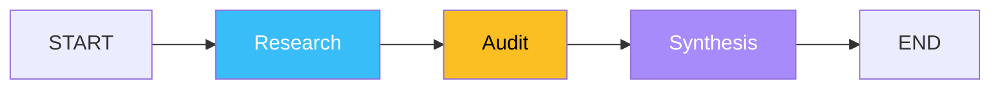
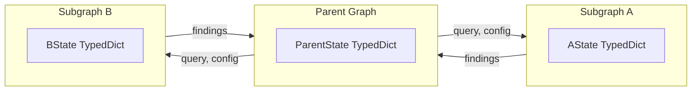
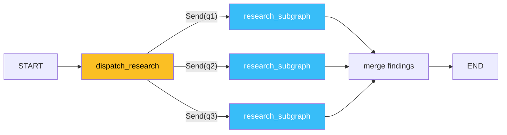
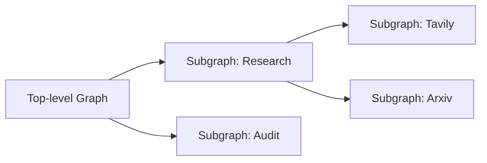

# 🧩 Subgraphs and the Send API

A 20-node graph is a maintenance hazard. The answer is **subgraphs**: each agent — Research, FactAudit, Synthesis — is its own `StateGraph`, compiled independently, and added to a parent graph as if it were a single node. The parent graph sees a clean contract (input schema, output schema, internal state hidden); the subgraph owns its own state schema, its own conditional edges, and its own thread of execution. The 20-node monolith becomes four subgraphs of 5 nodes each — and the parent graph is a 4-node linear flow that any intern can read.

The `Send` API is the **parallel counterpoint** to `add_conditional_edges`. Where `add_conditional_edges` routes control flow to a single next node, `Send` fires one node per item in a list — three queries → three parallel research calls. Combined with subgraph composition, `Send` enables the map-reduce pattern that the Multi-Agent Research System capstone ([[09 - Capstone - Rebuilding the Multi-Agent Research System|note 09]]) uses to dispatch a research query to all four specialized search agents in parallel.

## 🎯 Learning Objectives

- Compose a parent graph from subgraph nodes (graph-as-node pattern).
- Design subgraph state schemas that **hide internal state** from the parent.
- Map parent state to subgraph input and subgraph output to parent state via typed reducers.
- Use the `Send` API to fan out to multiple parallel subgraph invocations.
- Implement the map-reduce pattern (map across queries, reduce the results).
- Distinguish `Send` (parallel, runtime-dispatched) from `add_conditional_edges` (mutually exclusive, one path).
- Avoid the four most common subgraph bugs (state leakage, reducer mismatch, async vs sync, namespace collisions).

## 1. The Problem: Monolithic Graphs Don't Scale

```mermaid
flowchart LR
    START --> R1[research.llm_call]
    R1 --> R2[research.parse_results]
    R2 --> R3[research.deduplicate]
    R3 --> F1[audit.fact_check]
    F1 --> F2[audit.score_confidence]
    F2 --> F3[audit.escalate_if_low]
    F3 --> S1[synthesis.draft]
    S1 --> S2[synthesis.polish]
    S2 --> END
    style R1 fill:#38bdf8
    style R2 fill:#38bdf8
    style R3 fill:#38bdf8
    style F1 fill:#fbbf24
    style F2 fill:#fbbf24
    style F3 fill:#fbbf24
    style S1 fill:#a78bfa
    style S2 fill:#a78bfa
```



This 10-node graph is functionally correct, but:
- **State field bloat.** Research state, audit state, and synthesis state coexist in one `TypedDict`. Every field is reachable from every node. A typo in `research.parsed_results` instead of `audit.parsed_results` is a silent bug.
- **No isolation.** A bad Tavily response in `research.parse_results` can poison the entire workflow; the audit and synthesis sub-flows see untrusted data.
- **No reuse.** Want a second instance of the research agent for a different query? You have to copy-paste the three nodes and rename them.
- **Testing hell.** Unit testing one stage means mocking the entire upstream.

Subgraphs fix all four. The same workflow becomes:



Each subgraph is its own compiled `StateGraph`, tested independently, reused across parent graphs.

## 2. Subgraph as a Node

A subgraph is added to a parent graph like any other node:

```python
from langgraph.graph import StateGraph, START, END

# === 1. Define the subgraph ===
class ResearchState(TypedDict):
    query: str
    findings: list[str]

def do_research(state: ResearchState) -> dict:
    # Simulated Tavily call
    return {"findings": [f"Result for {state['query']}"]}

research_graph = StateGraph(ResearchState)
research_graph.add_node("do_research", do_research)
research_graph.add_edge(START, "do_research")
research_graph.add_edge("do_research", END)
research_subgraph = research_graph.compile()

# === 2. Parent graph uses the compiled subgraph as a node ===
class ParentState(TypedDict):
    queries: list[str]
    all_findings: list[str]

parent = StateGraph(ParentState)
parent.add_node("research", research_subgraph)  # subgraph as node!
parent.add_edge(START, "research")
parent.add_edge("research", END)

app = parent.compile()
```

The parent's `research` node receives the **full parent state**, but reads only `query` and writes to `findings`. LangGraph handles the field mapping based on the **subgraph's input/output schemas**.

### Subgraph Schema Isolation



The parent and subgraph have **independent state schemas**. Fields that exist in the subgraph but not the parent (e.g., a `confidence` field used internally by an audit subgraph) are visible only inside the subgraph. Fields that exist only in the parent (e.g., `thread_owner_email`) never enter the subgraph.

> 💡 **Tip:** Treat each subgraph's state as a **private contract**. The parent should only know about the subgraph's input fields (what it reads) and output fields (what it writes). This is the same discipline as REST API design: the consumer knows the request/response schema and nothing else.

## 3. The Full Pattern: Multi-Subgraph Parent

```python
# --- Research subgraph ---
class ResearchState(TypedDict):
    query: str
    findings: Annotated[list[str], add]

def search_node(state: ResearchState) -> dict:
    return {"findings": [f"Tavily({state['query']})"]}

research = StateGraph(ResearchState)
research.add_node("search", search_node)
research.add_edge(START, "search")
research.add_edge("search", END)
research_subgraph = research.compile()

# --- Audit subgraph ---
class AuditState(TypedDict):
    findings: list[str]
    score: float

def audit_node(state: AuditState) -> dict:
    score = 0.9 if state["findings"] else 0.0
    return {"score": score}

audit = StateGraph(AuditState)
audit.add_node("audit", audit_node)
audit.add_edge(START, "audit")
audit.add_edge("audit", END)
audit_subgraph = audit.compile()

# --- Synthesis subgraph ---
class SynthesisState(TypedDict):
    findings: list[str]
    score: float
    draft: str

def synthesize_node(state: SynthesisState) -> dict:
    return {"draft": f"[score={state['score']}] {state['findings']}"}

synthesis = StateGraph(SynthesisState)
synthesis.add_node("synth", synthesize_node)
synthesis.add_edge(START, "synth")
synthesis.add_edge("synth", END)
synthesis_subgraph = synthesis.compile()

# --- Parent graph ---
class ParentState(TypedDict):
    query: str
    findings: Annotated[list[str], add]
    score: float
    draft: str

parent = StateGraph(ParentState)
parent.add_node("research", research_subgraph)
parent.add_node("audit", audit_subgraph)
parent.add_node("synthesis", synthesis_subgraph)
parent.add_edge(START, "research")
parent.add_edge("research", "audit")
parent.add_edge("audit", "synthesis")
parent.add_edge("synthesis", END)

app = parent.compile()
print(app.invoke({"query": "LangGraph"}))
# {'query': 'LangGraph', 'findings': ['Tavily(LangGraph)'],
#  'score': 0.9, 'draft': '[score=0.9] [\'Tavily(LangGraph)\']'}
```

The parent passes `{"query": "..."}` and receives the merged state. Each subgraph reads what it needs (`query`, `findings`) and writes what it produces. The parent's `findings` reducer (`add`) accumulates across subgraph invocations if you ever invoke the research subgraph multiple times.

## 4. The `Send` API — Parallel Fan-Out

`add_conditional_edges` is mutually exclusive (one path fires). `Send` is **parallel fan-out**: one invocation becomes N parallel invocations.

```python
from langgraph.graph import Send

class MultiQueryState(TypedDict):
    queries: list[str]
    findings: Annotated[list[str], add]

def dispatch_research(state: MultiQueryState) -> list[Send]:
    """One Send per query — each becomes a parallel research subgraph invocation."""
    return [
        Send("research_subgraph", {"query": q})  # subgraph node + payload
        for q in state["queries"]
    ]

graph = StateGraph(MultiQueryState)
graph.add_node("research_subgraph", research_subgraph)  # compiled subgraph
graph.add_node("merge", lambda s: {"findings": []})
graph.add_conditional_edges(START, dispatch_research, ["research_subgraph"])
graph.add_edge("research_subgraph", "merge")
graph.add_edge("merge", END)
```



Three queries → three parallel subgraph invocations → state reducers merge the results.

> ⚠️ **Advertencia:** `Send` payloads must include every input field the subgraph reads. If the research subgraph reads `{"query", "context"}` and you Send only `{"query": q}`, the subgraph crashes with `KeyError: 'context'`.

## 5. `Send` vs `add_conditional_edges`

| Aspect | `add_conditional_edges` | `Send` |
|--------|------------------------|--------|
| Cardinality | 1-of-N (one path) | N-of-N (all fire) |
| Execution | Sequential (one transition) | Parallel (concurrent) |
| Payload | State itself | Custom dict per item |
| Use case | Triage, validation, fallback | Map-reduce, parallel dispatch |
| Cycle safety | Loop terminator required | No cycles (one-shot per Send) |

Use `add_conditional_edges` when **exactly one** downstream node should run. Use `Send` when **all** downstream nodes should run and their results should be merged.

## 6. ❌/✅ Antipatterns

### ❌ Subgraph with shared mutable state

```python
# ❌ Parent and subgraph both write to the same field; reducer confusion
class SharedState(TypedDict):
    findings: list[str]  # NO reducer — override semantics!

def parent_node(state: SharedState) -> dict:
    return {"findings": ["parent"]}

def subgraph_node(state: SharedState) -> dict:
    return {"findings": ["subgraph"]}

# Whichever runs last wins. No merge.
```

### ✅ Subgraph with append reducer or independent fields

```python
# ✅ Append reducer enables accumulation
class SharedState(TypedDict):
    findings: Annotated[list[str], add]

# ✅ OR independent fields per subgraph
class ParentState(TypedDict):
    research_findings: list[str]
    audit_findings: list[str]
```

### ❌ Sync subgraph in async parent

```python
# ❌ Async parent invoking sync subgraph blocks the event loop
async def async_parent_node(state):
    return await async_subgraph.ainvoke(...)  # fine

# But if the async node is in a graph that contains a SYNC subgraph, you block.
```

### ✅ Match sync vs async throughout

```python
# ✅ All async OR all sync. If mixing, wrap sync nodes with asyncio.run_in_executor.
```

### ❌ Forgetting to compile the subgraph

```python
parent.add_node("research", research_graph)  # not compiled
# raises AttributeError: 'StateGraph' object has no attribute 'invoke'
```

### ✅ Always compile before adding as a node

```python
research_subgraph = research_graph.compile()
parent.add_node("research", research_subgraph)
```

### ❌ Subgraph named to collide with a state field

```python
class ParentState(TypedDict):
    research: str  # ⚠️ field name shadows the subgraph node name

parent.add_node("research", research_subgraph)
# Confusing — node name `research` and state field `research`.
```

### ✅ Distinguish node names from state fields

```python
class ParentState(TypedDict):
    research_output: str  # different from node name

parent.add_node("research", research_subgraph)
```

## 7. Production Patterns

### Multi-Tenant Research Dispatch

One parent graph, N user queries, each research subgraph scoped via `config["configurable"]["tenant_id"]`. Persistence threads are prefixed with tenant ID ([[03 - Persistence, Checkpointers and thread_id|note 03]]). The `Send` API dispatches one subgraph per query, each isolated, results merged with `add` reducer.

### Reusable Agents Across Products

A `customer_support_agent` subgraph compiled once, reused in three parent graphs: (a) Slack bot, (b) email triage, (c) WhatsApp integration. Each parent defines its own input/output contract; the subgraph is the shared kernel.

### Recursive Subgraphs

A subgraph can itself contain subgraphs. This enables hierarchical workflows where each layer abstracts the layer below:



The depth limit is a soft concern (3 levels is typical); deeper hierarchies become debugging nightmares.

## 8. Production Reality

**Caso real — Multi-Agent Research System:** Pre-subgraph, the system was a 12-node flat graph. The post-subgraph version is a parent graph with three subgraphs (`research`, `fact_audit`, `synthesis`), and the `research` subgraph itself contains three sub-subgraphs (`tavily_search`, `arxiv_search`, `web_scrape`). The `Send` API dispatches all three search subgraphs in parallel for each query. Total speedup: 3× (parallel searches), maintainability: 1 PR per subgraph without breaking others.

**Caso real — StayBot property search:** The `search_properties` subgraph contains three sub-subgraphs (`airbnb`, `booking`, `vrbo`). When a user adds a new source (e.g., a fourth aggregator), it's a new subgraph node in the parent — zero changes to existing subgraphs. This is the production version of "open/closed principle" applied to agent systems.

## 📦 Compression Code

```python
# 📦 Compression: subgraphs + Send API in 60 lines
# Covers: subgraph-as-node, schema isolation, parallel fan-out via Send, map-reduce

from typing import Annotated, TypedDict
from operator import add
from langgraph.graph import StateGraph, START, END
from langgraph.constants import Send

# --- Subgraph: Research ---
class ResearchState(TypedDict):
    query: str
    findings: Annotated[list[str], add]

def search(state: ResearchState) -> dict:
    return {"findings": [f"hit({state['query']})"]}

research = StateGraph(ResearchState)
research.add_node("search", search).add_edge(START, "search").add_edge("search", END)
research_subgraph = research.compile()

# --- Parent: Multi-query dispatch ---
class ParentState(TypedDict):
    queries: list[str]
    findings: Annotated[list[str], add]

def dispatch(state: ParentState):
    return [Send("research_subgraph", {"query": q}) for q in state["queries"]]

def merge(state: ParentState) -> dict:
    return {"findings": []}  # reducer already accumulated

parent = StateGraph(ParentState)
parent.add_node("research_subgraph", research_subgraph)
parent.add_node("merge", merge)
parent.add_conditional_edges(START, dispatch, ["research_subgraph"])
parent.add_edge("research_subgraph", "merge")
parent.add_edge("merge", END)

app = parent.compile()
result = app.invoke({"queries": ["a", "b", "c"], "findings": []})
print(result["findings"])  # ['hit(a)', 'hit(b)', 'hit(c)']

# Subgraph isolation: parent has no fields like 'confidence' or 'parsed_results'
# that the subgraph might expose internally — those would leak without isolation.
print(sorted(result.keys()))  # ['findings', 'queries']
```

## 🎯 Key Takeaways

1. **Subgraphs isolate state, contracts, and testing boundaries.** The parent sees only input/output fields; the subgraph owns its internals.
2. **A subgraph is added as a node** to a parent via `parent.add_node(name, compiled_subgraph)`. The subgraph must be compiled first.
3. **`Send` API does parallel fan-out** — N items in, N parallel subgraph invocations out, results merged by reducers.
4. **`Send` vs `add_conditional_edges`:** mutually-exclusive dispatch vs parallel broadcast.
5. **Schema mismatches crash silently:** a subgraph reading a field the parent doesn't pass raises `KeyError` at runtime — write end-to-end integration tests.
6. **Sync vs async must match throughout the graph.** A sync subgraph inside an async parent blocks the event loop.
7. **Subgraphs compose hierarchically** — a 3-level tree (parent → subgraph → sub-subgraph) is the practical depth limit.

## References

- [[01 - StateGraph Fundamentals - Nodes Edges State and Reducers|StateGraph Fundamentals]] — the `TypedDict` and reducer primitives used inside subgraphs.
- [[02 - Conditional Routing and Dynamic Edges|Conditional Routing]] — `add_conditional_edges` and `Send` are routed from the same path function.
- [[09 - Capstone - Rebuilding the Multi-Agent Research System|Capstone]] — applies subgraphs + `Send` to parallel research dispatch.
- LangGraph Subgraphs: https://langchain-ai.github.io/langgraph/concepts/subgraphs/
- LangGraph Send: https://langchain-ai.github.io/langgraph/concepts/branching/