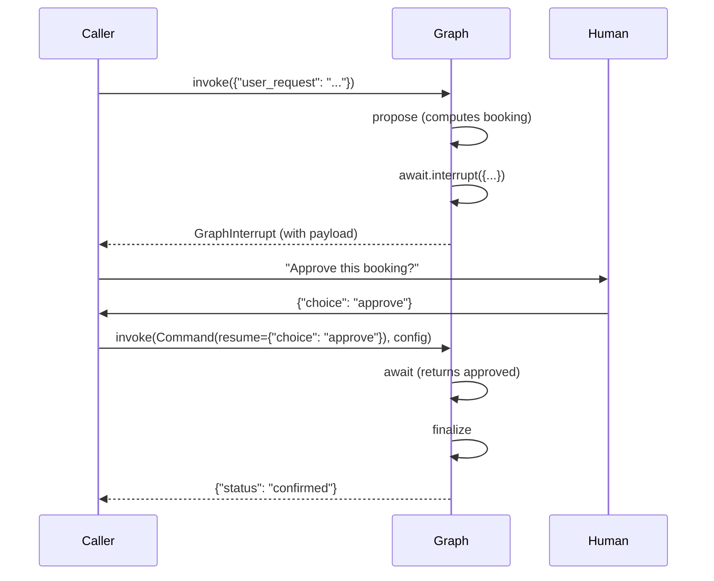

# 🛑 Human-in-the-Loop with `interrupt()` and `Command`

The most important LangGraph primitive you haven't used yet. `interrupt()` pauses graph execution at any node and surfaces a payload to the caller; the caller (a FastAPI endpoint, a Slack message, an admin console) responds with a `Command` that resumes execution with new state. Without `interrupt()`, every approval flow in production is a custom dance of "kill the worker, write a flag, restart from offset" — fragile, undebuggable, and impossible to audit. With `interrupt()`, the entire approval workflow is a typed primitive that lives inside the graph.

This is the feature that distinguishes LangGraph from every alternative framework. CrewAI can do role-based routing; AutoGen can do peer-to-peer messaging; smolagents can write code. None of them can pause mid-execution, surface a structured payload, accept human input, and resume — without the framework leaking control flow into your application code. LangGraph's `interrupt()` makes HITL a **declarative property** of the graph, not an implementation detail of the host application.

## 🎯 Learning Objectives

- Pause graph execution at any node with `interrupt(payload)`.
- Resume execution with `Command(resume=value)` and inject the human's response into state.
- Distinguish `interrupt()` (dynamic, in-node) from `interrupt_before` / `interrupt_after` (static, configuration-based).
- Design approval flows for tool calls, content moderation, and escalation.
- Combine `interrupt()` with persistence ([[03 - Persistence, Checkpointers and thread_id|note 03]]) for multi-day approval windows.
- Avoid the four most common HITL bugs (state leakage on resume, double-interrupt, missing `Command`, async edge cases).

## 1. The Problem: Approval Flows Need State, Not Flags

A typical "approve this tool call" flow, pre-LangGraph:

```python
# ❌ Pre-LangGraph approval: external state machine
approved = False
result = None
while not approved:
    tool_call = agent.propose_tool_call(input)
    response = slack.ask_human(tool_call.summary)  # Slack thread
    if response == "approve":
        approved = True
        result = agent.execute(tool_call)
    elif response == "reject":
        result = agent.rephrase(input)
    else:
        continue  # timeout, retry
```

This code works for a single agent on a single machine. It breaks the moment:

- The agent crashes mid-approval — `approved` is in-memory, the next worker has no idea.
- Multiple approvals stack up — there is no audit trail beyond "approved = True".
- The agent needs to surface structured information ("here are 3 options: approve, reject, modify parameter X") — the Slack thread model doesn't carry that.
- The agent is part of a multi-agent workflow — the audit trail needs to show which agent proposed which tool call.

`interrupt()` solves all four by making approval a graph-level primitive with built-in persistence and structured payloads.

## 2. The `interrupt()` Primitive

```python
from langgraph.graph import StateGraph, START, END
from langgraph.types import interrupt, Command
from langgraph.checkpoint.memory import MemorySaver

class BookingState(TypedDict):
    user_request: str
    booking_details: dict
    approved: bool

def propose_booking(state: BookingState) -> dict:
    # Compute the proposed booking
    return {"booking_details": {"hotel": "Marriott", "nights": 3, "total": 450}}

def await_approval(state: BookingState) -> dict:
    # Pause execution, surface the proposal to the caller
    approval = interrupt({
        "question": "Approve this booking?",
        "details": state["booking_details"],
        "options": ["approve", "reject", "modify"],
    })
    return {"approved": approval["choice"] == "approve"}

def finalize(state: BookingState) -> dict:
    if state["approved"]:
        return {"booking_details": {**state["booking_details"], "status": "confirmed"}}
    return {"booking_details": {**state["booking_details"], "status": "cancelled"}}

graph = StateGraph(BookingState)
graph.add_node("propose", propose_booking)
graph.add_node("await", await_approval)
graph.add_node("finalize", finalize)
graph.add_edge(START, "propose")
graph.add_edge("propose", "await")
graph.add_edge("await", "finalize")
graph.add_edge("finalize", END)
app = graph.compile(checkpointer=MemorySaver())

# === First call: graph runs until interrupt, then pauses ===
config = {"configurable": {"thread_id": "user-42"}}
result = app.invoke({"user_request": "Book Marriott"}, config)
# Raises GraphInterrupt (caller catches it)

# === Caller sees the interrupt payload ===
snapshot = app.get_state(config)
print(snapshot.next)  # ('await',) — node that paused
print(snapshot.tasks)  # list of pending interrupts

# === Human responds ===
final = app.invoke(Command(resume={"choice": "approve"}), config)
print(final["booking_details"])  # {... "status": "confirmed"}
```



The graph **halts** at the `await` node, the **caller** receives the interrupt payload, and the **human** decides. The graph does not consume CPU or hold a worker while waiting.

## 3. The `Command` Resume API

To resume, the caller invokes the graph with a `Command` object:

```python
from langgraph.types import Command

# Resume with a value (whatever the interrupt returned)
app.invoke(Command(resume={"choice": "approve"}), config)

# Update state AND resume (e.g., human corrected the booking)
app.invoke(
    Command(resume={"choice": "modify", "nights": 5}, update={"approved": True}),
    config,
)

# Resume without a value (rare — for "I just want to continue" flows)
app.invoke(Command(resume=None), config)
```

`Command(resume=...)` is the **typed resume signal**. The value you pass becomes the return value of the original `interrupt(payload)` call inside the node.

> 💡 **Tip:** `Command(resume=...)` and `Command(update=...)` are independent — you can pass either, both, or neither. `resume` is the interrupt return; `update` is a state patch.

## 4. Three Forms of Interrupt

LangGraph supports three interrupt styles; pick by use case.

### Dynamic Interrupt (in-node)

```python
def risky_tool_node(state):
    if state["amount"] > 1000:
        approval = interrupt({"needs_approval_for": state["amount"]})
        if not approval["ok"]:
            return {"error": "rejected"}
    return {"result": run_tool(state["args"])}
```

Best for: tool calls, multi-option approvals, conditional gates.

### Static Interrupt Before / After (configuration)

```python
app = graph.compile(
    checkpointer=MemorySaver(),
    interrupt_before=["synthesize"],   # pause before this node
    interrupt_after=["research"],      # pause after this node
)

# Every invoke pauses before "synthesize"
result = app.invoke({"query": "x"}, config)
# Caller must call again with Command(resume=...) to proceed past the interrupt
```

Best for: debug breakpoints, mandatory review points, slow workflows where the operator wants to inspect intermediate state.

### Dynamic Interrupt in Path Function

```python
def route(state):
    if state["needs_human"]:
        raise NodeInterrupt("Operator review needed")
    return "auto_path"

graph.add_conditional_edges("triage", route, path_map={"auto_path": "auto"})
```

Best for: emergent conditions that the path function can detect but the node can't.

> ⚠️ **Advertencia:** `NodeInterrupt` (raised in path functions) is older than `interrupt()` (returned from nodes). Prefer `interrupt()` for new code — it composes better with async, has structured payloads, and integrates with `get_state`.

## 5. Approval Flow Patterns

### Tool-Call Approval

```python
def invoke_tool(state: AgentState) -> dict:
    tool_call = state["pending_tool_call"]
    if tool_call["risk_level"] >= 2:
        approval = interrupt({
            "tool": tool_call["name"],
            "args": tool_call["args"],
            "risk_level": tool_call["risk_level"],
        })
        if approval["choice"] == "reject":
            return {"pending_tool_call": None, "error": "Tool call rejected by user"}
    return {"tool_result": run_tool(tool_call)}
```

This is the production pattern for **sensitive tools** (database writes, email sends, payments, file deletions). The risk-level check decides whether approval is needed.

### Content Moderation

```python
def moderate_response(state: DraftState) -> dict:
    if state["contains_pii"] or state["toxicity_score"] > 0.7:
        review = interrupt({
            "draft": state["draft"],
            "issues": ["PII detected", "high toxicity"],
            "options": ["approve", "redact", "reject"],
        })
        if review["choice"] == "redact":
            return {"draft": redact_pii(state["draft"])}
        if review["choice"] == "reject":
            return {"draft": None}
    return {}
```

The moderator (a human or another LLM) sees the offending draft, picks an action, and the graph resumes with the corrected state.

### Escalation with Resume Token

```python
def low_confidence_node(state: ResearchState) -> dict:
    if state["confidence"] < 0.6:
        expert_input = interrupt({
            "kind": "expert_review",
            "context": state["findings"],
            "question": "What's the canonical answer?",
        })
        return {"findings": expert_input["answer"]}
    return {}
```

Used for: low-confidence research output, novel questions outside the agent's training, sensitive decisions. The expert's answer is appended to findings and the agent continues.

## 6. Multi-Day Approvals

The killer combination: `interrupt()` + `PostgresSaver`. The pause can last days; the graph resumes when the human is ready.

```python
# Day 1: agent proposes, human is offline
config = {"configurable": {"thread_id": "u-42-ticket-7"}}
app.invoke({"query": "Approve refund?"}, config)
# → GraphInterrupt, persisted to Postgres

# Day 3: human returns, hits Slack button
app.invoke(Command(resume={"choice": "approve"}), config)
# → Graph resumes from where it paused, 2 days later
```

The `PostgresSaver` ([[03 - Persistence, Checkpointers and thread_id|note 03]]) handles the durability. The FastAPI endpoint (note 08) is the entry point for the resume call.

## 7. `get_state` Inspection During Interrupt

```python
snapshot = app.get_state(config)
print(snapshot.values)        # State right before the interrupt
print(snapshot.next)          # ('await',) — node that paused
print(snapshot.interrupts)    # List of pending interrupt payloads
print(snapshot.tasks)         # Pending tasks including the interrupt
```

The interrupt payload is **always inspectable**. A admin console can render `snapshot.interrupts[0].value` to show the human the pending question.

## 8. ❌/✅ Antipatterns

### ❌ Forget to pass `config` on resume

```python
# ❌ Resume without config — no thread, no checkpoint, fresh start
app.invoke(Command(resume={"choice": "approve"}))
# Restarts the graph; the interrupt context is lost.
```

### ✅ Always pass the same `config`

```python
config = {"configurable": {"thread_id": "u-42"}}
app.invoke({"query": "x"}, config)
app.invoke(Command(resume={"choice": "approve"}), config)  # same config
```

### ❌ Two interrupts in one super-step

```python
def node(state):
    a = interrupt({"q": "first"})
    b = interrupt({"q": "second"})  # ⚠️ both pause, but only one resumes at a time
    return {"a": a, "b": b}
```

### ✅ Sequential interrupts with explicit resume loop

```python
def node(state):
    a = interrupt({"q": "first"})
    return {"a": a}

def node2(state):
    b = interrupt({"q": "second"})
    return {"b": b}

# Graph pauses twice, but each resume advances one node.
```

### ❌ Using `time.sleep` to wait for human

```python
# ❌ Blocks the worker for the human response time
approval = interrupt(...)
while not human_responded():
    time.sleep(5)  # blocks worker
```

### ✅ Let the graph pause; resume is a separate call

```python
# ✅ Worker releases immediately after interrupt; human response triggers new invoke
```

### ❌ Interrupt in async node without proper config propagation

```python
async def node(state):
    approval = interrupt(...)  # works in async, but config must propagate via ainvoke
```

### ✅ Use `ainvoke` for async + interrupt

```python
await app.ainvoke({"query": "x"}, config)
await app.ainvoke(Command(resume={"choice": "approve"}), config)
```

## 9. Production Reality

**Caso real — StayBot booking confirmation:** The CrewAI version asked "should I book this?" with a custom Slack thread and a polling loop that held a worker for up to 10 minutes. The LangGraph version uses `interrupt()` with a `{"question", "details", "options"}` payload. The FastAPI surface (note 08) catches `GraphInterrupt`, sends a Slack message with interactive buttons, and the button click triggers `app.invoke(Command(resume={"choice": "..."}))`. Workers are never held idle; the approval workflow survives server restarts because the state is in `PostgresSaver`.

**Caso real — Multi-Agent Research System escalation:** When the validator returns `confidence < 0.6`, the graph hits an `interrupt()` with the findings and a human expert input request. The expert reviews via a Slack thread, types the canonical answer, and the graph resumes with the corrected state. This pattern was the difference between "the agent gives wrong answers confidently" and "the agent asks for help when uncertain".

## 📦 Compression Code

```python
# 📦 Compression: HITL with interrupt() and Command in 60 lines
# Covers: dynamic interrupt, Command resume, multi-step approval, async

import asyncio
from typing import Annotated, TypedDict
from operator import add
from langgraph.graph import StateGraph, START, END
from langgraph.types import interrupt, Command
from langgraph.checkpoint.memory import MemorySaver

class State(TypedDict):
    query: str
    log: Annotated[list[str], add]
    approved: bool

def propose(state: State) -> dict:
    return {"log": [f"proposed for {state['query']}"]}

def await_approval(state: State) -> dict:
    # Pause here; caller receives the payload
    response = interrupt({
        "question": "Approve?",
        "options": ["approve", "reject"],
        "details": state["log"],
    })
    return {"approved": response["choice"] == "approve"}

def finalize(state: State) -> dict:
    action = "CONFIRMED" if state["approved"] else "REJECTED"
    return {"log": [action]}

graph = StateGraph(State)
graph.add_node("propose", propose)
graph.add_node("await", await_approval)
graph.add_node("finalize", finalize)
graph.add_edge(START, "propose")
graph.add_edge("propose", "await")
graph.add_edge("await", "finalize")
graph.add_edge("finalize", END)
app = graph.compile(checkpointer=MemorySaver())

config = {"configurable": {"thread_id": "u-1"}}

# Step 1: run until interrupt
async def run():
    try:
        await app.ainvoke({"query": "book hotel"}, config)
    except Exception as e:
        # In production: catch GraphInterrupt specifically
        snapshot = await app.aget_state(config)
        print("Paused at:", snapshot.next)  # ('await',)

    # Step 2: human responds
    result = await app.ainvoke(Command(resume={"choice": "approve"}), config)
    print(result["log"])  # ['proposed for book hotel', 'CONFIRMED']

asyncio.run(run())
```

## 🎯 Key Takeaways

1. **`interrupt()` pauses graph execution with a structured payload.** The graph does not hold a worker while waiting.
2. **`Command(resume=...)` is the typed resume signal.** The resume value becomes the return of the original `interrupt()` call.
3. **Persistence is mandatory for HITL.** Without `PostgresSaver` ([[03 - Persistence, Checkpointers and thread_id|note 03]]), multi-day approvals crash on worker restart.
4. **Three interrupt forms:** `interrupt()` (dynamic, in-node), `interrupt_before/after` (static, compile-time), `NodeInterrupt` (path function — legacy).
5. **`get_state` exposes pending interrupts** — admin consoles render `snapshot.interrupts[0].value` to show the human the pending question.
6. **`config` must match across pause and resume.** Without the same `thread_id`, the resume is a fresh start.
7. **Async + interrupt works** via `ainvoke` + `Command(resume=...)`. Sync and async checkpointers are separate types.

## References

- [[03 - Persistence, Checkpointers and thread_id|Persistence]] — `PostgresSaver` is the prerequisite for durable HITL.
- [[08 - Production Deployment - Studio, CLI, FastAPI|Production Deployment]] — FastAPI endpoints catch `GraphInterrupt` and surface the payload to the human.
- [[09 - Capstone - Rebuilding the Multi-Agent Research System|Capstone]] — applies `interrupt()` for expert escalation and tool-call approval.
- LangGraph Interrupt: https://langchain-ai.github.io/langgraph/concepts/human_in_the_loop/