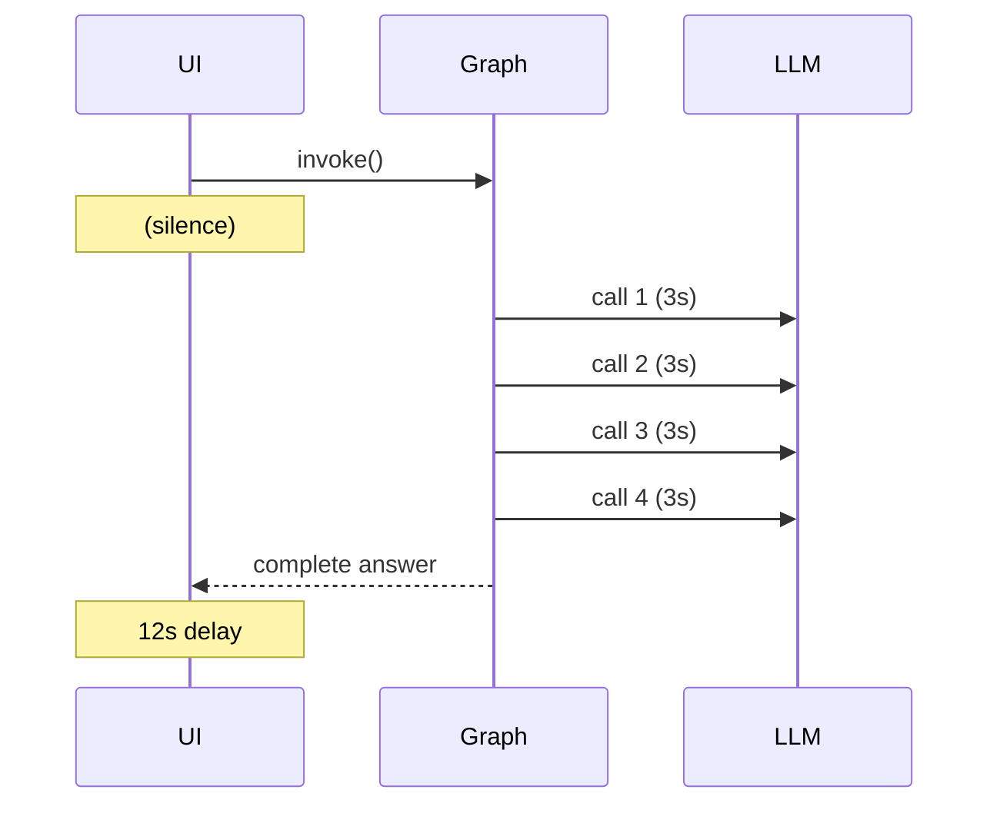
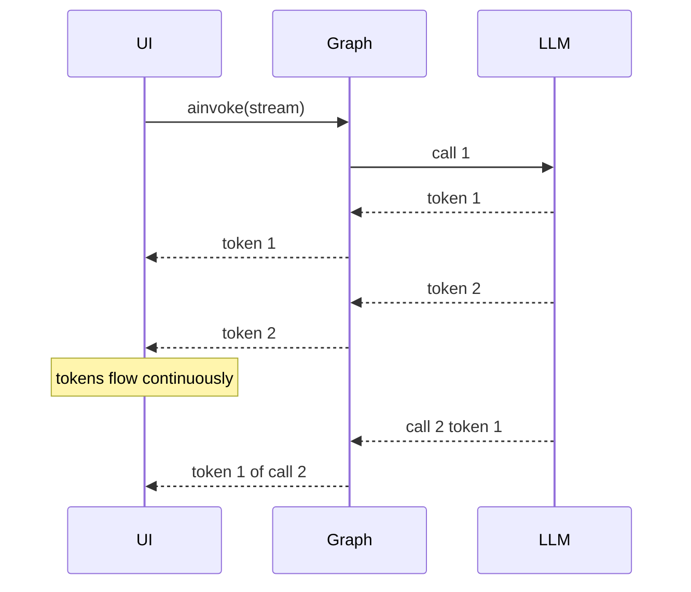

# 🌊 Streaming Modes — `values`, `updates`, `messages`, `custom`

The user clicked "Send". They expect feedback within 100ms — a typing indicator, the first token, the agent's current step. A 30-second pause followed by a complete answer is a UX failure. Streaming is how LangGraph turns a synchronous agent into a real-time experience. The framework exposes four `stream_mode`s — `values`, `updates`, `messages`, `custom` — each surfacing a different slice of the agent's execution. Pick the right one for the surface (terminal, IDE, web UI, WebSocket) and the LLM latency disappears into perceived responsiveness.

This note covers all four modes, the `astream` async API, the `writer` callable inside nodes, and the production pattern for token-by-token streaming to a FastAPI + WebSocket surface. By the end you will be able to wire any LangGraph agent into a real-time UI without bolting on callbacks or third-party libraries.

## 🎯 Learning Objectives

- Stream full state after each step with `stream_mode="values"`.
- Stream only state diffs with `stream_mode="updates"` for bandwidth-efficient UIs.
- Stream LLM tokens with `stream_mode="messages"` for chat surfaces.
- Emit custom events from inside nodes with `stream_mode="custom"` for status indicators.
- Distinguish sync `stream` from async `astream` and pick by host (FastAPI = async).
- Build a FastAPI + WebSocket surface that streams LangGraph tokens in real time.
- Avoid the four most common streaming bugs (buffering, mode mismatches, sync-in-async, lost events).

## 1. The Problem: Latency Hides Everything

Without streaming, the user waits for the entire graph to complete. For a 5-node agent with 4 LLM calls (~10 seconds total), the perceived latency is the **sum** of all calls. For a chat surface, that's unacceptable — even 2 seconds of silence feels broken.



With streaming, the perceived latency collapses to the **first token**:



The user sees activity within ~100ms of the first LLM token, regardless of total execution time. That single UX difference separates "feels fast" from "feels broken".

## 2. The Four `stream_mode`s

### `stream_mode="values"` — Full State Per Step

```python
for state in app.stream({"query": "x"}, config, stream_mode="values"):
    print(state)
# {'query': 'x'}
# {'query': 'x', 'log': ['A(x)']}
# {'query': 'x', 'log': ['A(x)', 'B']}
```

Each yield is the **full state after the node completed**. Best for: simple logging, debugging, terminal output. Drawback: bandwidth grows with state size; you re-send unchanged fields on every step.

### `stream_mode="updates"` — Diffs Per Step

```python
for update in app.stream({"query": "x"}, config, stream_mode="updates"):
    print(update)
# {'search': {'findings': ['result(x)']}}
# {'synthesize': {'draft': '...'}}
```

Each yield is a `dict[node_name, partial_state]`. Best for: production UIs that only need to know "what changed". Bandwidth-efficient. Drawback: requires the consumer to merge updates into a local state copy.

```mermaid
flowchart LR
    A[Node A runs] -->|updates: A={x:1}| UI
    B[Node B runs] -->|updates: B={y:2}| UI
    C[Node C runs] -->|updates: C={z:3}| UI
    UI --> Merge[Local state: x=1, y=2, z=3]
```

### `stream_mode="messages"` — LLM Tokens

```python
from langgraph.graph import MessagesState

async for msg, metadata in app.astream(
    {"messages": [("user", "Tell me a joke")]},
    config,
    stream_mode="messages",
):
    print(f"[{metadata['langgraph_node']}] {msg.content}", end="", flush=True)
# [chatbot] Sure
# [chatbot]  — why did the chicken cross the road?
# [chatbot]  To get to the other side!
```

Each yield is a `(message_chunk, metadata)` tuple — the message contains token deltas, the metadata identifies the source node. **Only works with chat models that stream** (`ChatOpenAI`, `ChatAnthropic`, etc.). Best for: chat UIs that show token-by-token text.

### `stream_mode="custom"` — Manual Events

```python
from langgraph.config import get_stream_writer

def long_running_node(state: State) -> dict:
    writer = get_stream_writer()
    writer({"event": "started", "tool": "tavily"})
    result = tavily.search(state["query"])
    writer({"event": "completed", "tool": "tavily", "results": len(result)})
    return {"findings": result}

async for event in app.astream({"query": "x"}, config, stream_mode="custom"):
    print(event)
# {'event': 'started', 'tool': 'tavily'}
# {'event': 'completed', 'tool': 'tavily', 'results': 5}
```

Each yield is whatever the node writes via `get_stream_writer()`. Best for: status indicators ("Searching Tavily..."), progress bars, custom telemetry, intermediate visualizations. Combines with other modes — `stream_mode=["updates", "custom"]` yields both simultaneously.

## 3. Multi-Mode Streaming

```python
async for chunk in app.astream({"query": "x"}, config, stream_mode=["updates", "custom"]):
    mode, payload = chunk
    # mode is "updates" or "custom"
    if mode == "updates":
        for node, update in payload.items():
            print(f"[{node}] {update}")
    else:
        print(f"[event] {payload}")
```

The chunk is a `(mode, payload)` tuple. Useful when you want both state diffs (for the UI's state model) and custom events (for status text) in one stream.

> 💡 **Tip:** Most production apps use `stream_mode=["messages", "custom"]` for chat UIs (token flow + status events) or `stream_mode=["updates", "custom"]` for dashboards (state diffs + progress).

## 4. Sync vs Async Streaming

| Method | Best for |
|--------|----------|
| `stream(...)` | Local scripts, debugging, Jupyter |
| `astream(...)` | FastAPI, async workers, WebSockets |

The async version is **mandatory** for production web surfaces. The sync version holds a worker thread; the async version releases the worker between LLM token yields.

```python
# FastAPI endpoint pattern
from fastapi import FastAPI
from fastapi.responses import StreamingResponse

app = FastAPI()

@app.post("/chat/stream")
async def chat_stream(message: str, thread_id: str):
    config = {"configurable": {"thread_id": thread_id}}

    async def event_generator():
        async for msg, meta in langgraph_app.astream(
            {"messages": [("user", message)]},
            config,
            stream_mode="messages",
        ):
            # SSE format
            yield f"data: {msg.content}\n\n"

    return StreamingResponse(event_generator(), media_type="text/event-stream")
```

## 5. WebSocket Pattern

```python
from fastapi import WebSocket

@app.websocket("/ws/{thread_id}")
async def chat_ws(websocket: WebSocket, thread_id: str):
    await websocket.accept()
    config = {"configurable": {"thread_id": thread_id}}

    try:
        while True:
            user_msg = await websocket.receive_text()
            async for chunk in langgraph_app.astream(
                {"messages": [("user", user_msg)]},
                config,
                stream_mode=["messages", "custom"],
            ):
                mode, payload = chunk
                await websocket.send_json({"mode": mode, "data": str(payload)})
    except WebSocketDisconnect:
        pass
```

The client receives token-by-token updates over the WebSocket and renders them in the UI as they arrive.

> ⚠️ **Advertencia:** WebSocket connections are stateful — a worker death drops all connections. For multi-worker deployments, the WebSocket endpoint must connect to the same LangGraph checkpointer (PostgresSaver) so reconnections resume from the last checkpoint. Use `thread_id` to scope the connection.

## 6. Backpressure and Flow Control

Streaming without flow control can flood the client. Three techniques:

### Throttle by Yield Size

```python
buffer = []
async for chunk in app.astream(input, config, stream_mode="messages"):
    buffer.append(chunk.content)
    if len(buffer) >= 10 or chunk.endswith((".", "!", "?")):
        await websocket.send_text("".join(buffer))
        buffer.clear()
if buffer:
    await websocket.send_text("".join(buffer))
```

Buffer tokens until a sentence boundary; reduces WebSocket frames by 5-10×.

### Yield Control with Queue

```python
import asyncio

async def stream_to_queue():
    queue = asyncio.Queue()
    async def consumer():
        async for chunk in app.astream(input, config, stream_mode="messages"):
            await queue.put(chunk)
        await queue.put(None)

    task = asyncio.create_task(consumer())
    while True:
        chunk = await queue.get()
        if chunk is None:
            break
        await websocket.send_json(chunk)
        await asyncio.sleep(0)  # yield to event loop
```

### Last-Token-Wins for Status

For status indicators (`{"event": "Searching Tavily..."}`), the client should debounce and only render the latest event:

```javascript
let pendingStatus = null;
socket.onmessage = (e) => {
    const {mode, data} = JSON.parse(e.data);
    if (mode === 'custom') {
        pendingStatus = data;
        clearTimeout(renderHandle);
        renderHandle = setTimeout(() => updateStatus(pendingStatus), 50);
    }
};
```

## 7. ❌/✅ Antipatterns

### ❌ Sync stream in async context

```python
# ❌ Holds the worker thread
async def endpoint():
    for chunk in app.stream(...):  # blocks event loop
        await send(chunk)
```

### ✅ Use `astream` for async contexts

```python
async def endpoint():
    async for chunk in app.astream(...):
        await send(chunk)
```

### ❌ Stream-mode mismatch

```python
# ❌ Expecting tokens but streaming values
async for state in app.astream(input, config, stream_mode="values"):
    print(state["messages"][-1].content)  # only the full final message
```

### ✅ Match stream_mode to surface

```python
# ✅ Tokens for chat UIs
async for msg, meta in app.astream(input, config, stream_mode="messages"):
    print(msg.content, end="")
```

### ❌ Forgetting to consume the generator

```python
# ❌ Streaming without iterating
async def handler():
    app.astream(input, config)  # generator created but never consumed
    return {"status": "started"}  # graph never actually runs
```

### ✅ Iterate to drive execution

```python
async def handler():
    async for _ in app.astream(input, config):
        pass
    return {"status": "completed"}
```

### ❌ Mixing `stream_mode` and `get_stream_writer` without `custom`

```python
async for chunk in app.astream(input, config, stream_mode="values"):
    # custom writes are silently dropped
    pass
```

### ✅ Include `"custom"` to receive writer events

```python
async for chunk in app.astream(input, config, stream_mode=["values", "custom"]):
    mode, payload = chunk
```

## 8. Production Reality

**Caso real — LLM Edge Gateway:** The Go/Fiber gateway's WebSocket surface was originally polling `/chat/status` every 500ms. The Python LangGraph agent replaced this with `astream(stream_mode=["messages", "custom"])`, dropping perceived latency from ~1.5s (next poll) to ~100ms (first token). The combined SSE + custom-event pattern let the UI show "Routing to Gemini..." before the token stream started.

**Caso real — Multi-Agent Research System UI:** The agent's UI shows the current node ("Researching Tavily..." → "Fact-Auditing..." → "Synthesizing...") via `stream_mode="custom"` events from inside each node, while the synthesis answer streams via `stream_mode="messages"`. The user sees both workflow progress and final answer in one stream.

## 📦 Compression Code

```python
# 📦 Compression: streaming in all four modes in 80 lines
# Covers: values, updates, messages, custom, multi-mode, async

import asyncio
from typing import Annotated, TypedDict
from operator import add
from langgraph.graph import StateGraph, START, END
from langgraph.config import get_stream_writer
from langchain_openai import ChatOpenAI

class State(TypedDict):
    query: str
    log: Annotated[list[str], add]
    answer: str

def emit_node(state: State) -> dict:
    writer = get_stream_writer()
    writer({"step": "searching", "query": state["query"]})
    return {"log": ["searched"]}

def chat_node(state: State) -> dict:
    llm = ChatOpenAI(model="gpt-4o-mini", streaming=True)
    response = llm.invoke(f"Answer: {state['query']}")
    return {"answer": response.content}

graph = StateGraph(State)
graph.add_node("emit", emit_node).add_node("chat", chat_node)
graph.add_edge(START, "emit").add_edge("emit", "chat").add_edge("chat", END)
app = graph.compile()

async def demo():
    # Mode 1: values — full state
    print("=== values ===")
    async for state in app.astream({"query": "x"}, stream_mode="values"):
        print("state:", state)

    # Mode 2: updates — diffs
    print("\n=== updates ===")
    async for u in app.astream({"query": "y"}, stream_mode="updates"):
        print("update:", u)

    # Mode 3: messages — tokens
    print("\n=== messages ===")
    async for msg, meta in app.astream({"query": "z"}, stream_mode="messages"):
        if msg.content:
            print(msg.content, end="", flush=True)
    print()

    # Mode 4: multi-mode (messages + custom)
    print("\n=== messages + custom ===")
    async for mode, payload in app.astream(
        {"query": "w"}, stream_mode=["messages", "custom"]
    ):
        if mode == "custom":
            print(f"\n[event] {payload}", end="")
        elif mode == "messages":
            msg, _ = payload
            if msg.content:
                print(msg.content, end="", flush=True)
    print()

asyncio.run(demo())
```

## 🎯 Key Takeaways

1. **Four `stream_mode`s**: `values` (full state), `updates` (diffs), `messages` (LLM tokens), `custom` (manual events).
2. **Multi-mode streaming** combines modes: `stream_mode=["messages", "custom"]` yields both chat tokens and status events.
3. **`astream` is mandatory for FastAPI/WebSocket surfaces.** Sync `stream` blocks the worker.
4. **`get_stream_writer()` inside nodes** emits custom events that the consumer receives when `stream_mode="custom"` is requested.
5. **`stream_mode="messages"` requires a chat model with `streaming=True`** — non-streaming LLMs yield only the final message.
6. **Throttle and debounce** for bandwidth: buffer tokens to sentence boundaries, debounce status events.
7. **WebSocket connections drop on worker death** — always pair streaming with a Postgres-backed checkpointer ([[03 - Persistence, Checkpointers and thread_id|note 03]]) and `thread_id` for reconnection.

## References

- [[01 - StateGraph Fundamentals - Nodes Edges State and Reducers|StateGraph Fundamentals]] — `state` is what `stream_mode="values"` emits.
- [[02 - Conditional Routing and Dynamic Edges|Conditional Routing]] — path function decisions do not produce stream events; only nodes do.
- [[05 - Human-in-the-Loop with interrupt() and Command|Human-in-the-Loop]] — `interrupt()` works with streaming; `astream` yields the interrupt payload as a special chunk.
- [[08 - Production Deployment - Studio, CLI, FastAPI|Production Deployment]] — FastAPI + SSE/WebSocket surfaces.
- LangGraph Streaming: https://langchain-ai.github.io/langgraph/concepts/streaming/