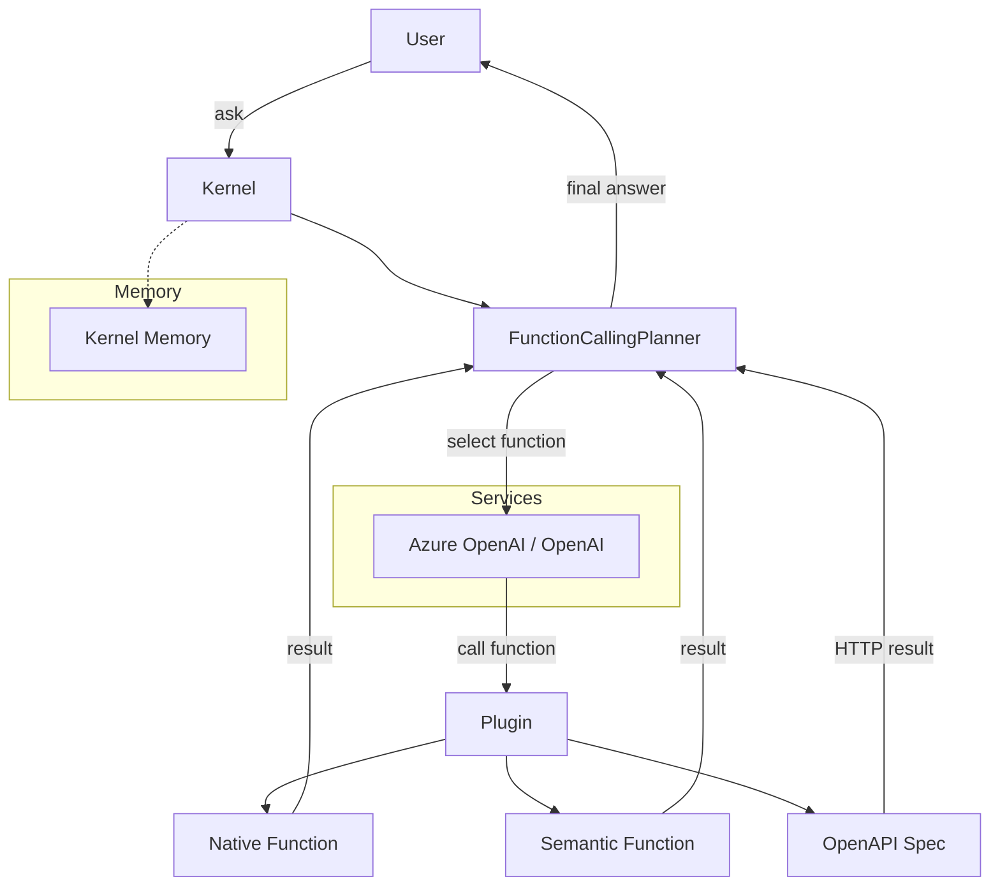

# 🎯 01 - Semantic Kernel Fundamentals — Kernel, Plugins, Functions

> **The enterprise plugin orchestration layer. Multi-language, Azure-native, typed functions. The Microsoft answer to LangChain's `Tool` abstraction with first-class C#, Java, and TypeScript support.**

## 🎯 Learning Objectives
- Understand the Kernel architecture: services, plugins, functions, memories, planners
- Define native functions (Python) and semantic functions (templated prompts) inside a plugin
- Wire Azure OpenAI and OpenAI as chat completion services
- Use function calling to let the LLM invoke typed functions automatically
- Compose plugins into a single Kernel and register them with the planner
- See the same Kernel definition compile to Python, .NET, and TypeScript

## Introduction

Semantic Kernel (SK) is Microsoft's enterprise SDK for building AI agents. It treats agent capabilities as a registry of **typed functions** organized into **plugins**, executed by an LLM-driven **planner** that selects which functions to call based on the user's request. The mental model is identical to LangChain's `Tool` and CrewAI's `Tool` — but with Microsoft's commitment to **multi-language parity** (Python, .NET/C#, Java, TypeScript) and **first-class Azure integration**.

The library was open-sourced in 2023 after internal use at Microsoft for the Copilot stack. As of 2026 it sits at 23k+ GitHub stars, ships v1.x releases monthly, and is the foundation of Azure AI Agent Service, Microsoft 365 Copilot, and several Fortune 500 internal agents. The Python SDK (`semantic-kernel` on PyPI) is the most active; the .NET SDK (`Microsoft.SemanticKernel`) ships in lockstep with breaking changes announced 3 months ahead.

The kernel itself is a small object — essentially a service registry + plugin registry + function dispatcher. Plugins are collections of functions (Python methods, prompt templates, or OpenAPI specs). The planner interprets the user's request, calls the LLM with the available functions, executes the function the LLM chose, feeds the result back, and repeats until completion. This is the classic ReAct loop from [[07 - AI Agents y Agentic Systems/11 - Fundamentos de Agentes AI]] — but expressed with typed functions, observable execution, and Azure-native credentials.

For the AI/ML Engineer profile, SK is the **enterprise-readiness upgrade**. Where LangChain and LangGraph (covered in [[07 - AI Agents y Agentic Systems/18 - LangGraph Deep Patterns]]) are open-source Python, SK is multi-language, Azure-certified, and supported by Microsoft. Hiring managers at Microsoft shops (any company with a Microsoft Enterprise Agreement) recognize SK immediately.




---

## 1. The Kernel Object — Bootstrapping

A Kernel is a thin service registry. You instantiate it, register services (chat, embedding, memory), register plugins, and ask it to solve problems.

```python
import asyncio
import os
from semantic_kernel import Kernel
from semantic_kernel.connectors.ai.open_ai import AzureChatCompletion

# Initialize
kernel = Kernel()

# Register Azure OpenAI as the chat service
kernel.add_service(
    AzureChatCompletion(
        deployment_name=os.getenv("AZURE_OPENAI_DEPLOYMENT", "gpt-4o"),
        endpoint=os.getenv("AZURE_OPENAI_ENDPOINT"),
        api_key=os.getenv("AZURE_OPENAI_API_KEY"),
    )
)

# Register plugins later (Notes 1.3 and 1.4)

# Use the kernel
result = await kernel.invoke_prompt("What is the capital of France?")
print(result)  # 'Paris'
```

The `Kernel.invoke_prompt()` shortcut is the simplest entry point — it sends a single prompt to the registered chat service. For real agent behavior, you register plugins and let the LLM choose which functions to call.

For OpenAI (instead of Azure):

```python
from semantic_kernel.connectors.ai.open_ai import OpenAIChatCompletion

kernel.add_service(
    OpenAIChatCompletion(
        ai_model_id="gpt-4o-mini",
        api_key=os.getenv("OPENAI_API_KEY"),
    )
)
```

The same Kernel can hold multiple chat services; you can route to different models per task via filters or kernel arguments.

💡 **Tip:** SK uses the term "service" rather than "model" because the same interface handles chat, embedding, image generation, and text-to-speech. The `Kernel` object is model-agnostic.

---

## 2. Native Functions — Typed Python Methods

A **native function** is a regular Python method decorated with `@kernel_function`. The decorator tells SK to register the method as a callable for the LLM planner.

```python
from semantic_kernel.functions import kernel_function
from semantic_kernel import Kernel
from pydantic import BaseModel, Field
from typing import Annotated


class CalendarPlugin:
    """Plugin for calendar operations."""
    
    @kernel_function(
        name="get_calendar_events",
        description="Retrieve upcoming calendar events for a user within a date range.",
    )
    def get_events(
        self,
        user_id: Annotated[str, "The user ID to retrieve events for"],
        start_date: Annotated[str, "ISO date format, e.g. '2026-07-23'"],
        end_date: Annotated[str, "ISO date format"],
    ) -> list[dict]:
        # Real implementation would call the calendar API
        return [
            {"title": "Team standup", "date": "2026-07-24", "time": "09:00"},
            {"title": "1:1 with manager", "date": "2026-07-24", "time": "14:00"},
        ]
    
    @kernel_function(
        name="schedule_meeting",
        description="Schedule a new meeting on the calendar.",
    )
    def schedule(
        self,
        title: Annotated[str, "Meeting title"],
        start_time: Annotated[str, "ISO datetime"],
        duration_minutes: Annotated[int, "Duration in minutes"],
        attendees: Annotated[list[str], "List of attendee email addresses"],
    ) -> dict:
        return {"status": "scheduled", "title": title, "start": start_time}
```

Three rules for `@kernel_function`:

1. **Type hints are mandatory.** The LLM uses them to construct function calls. `Annotated[T, "description"]` provides the description the LLM sees.
2. **The `description` parameter is critical.** The LLM chooses functions based on descriptions. Be specific: "Schedule a meeting on the calendar" beats "Create event".
3. **Return JSON-serializable types.** Dict, list, str, int, float, bool, BaseModel (auto-serialized), or Pydantic instances.

Register the plugin:

```python
kernel.add_plugin(CalendarPlugin(), plugin_name="Calendar")
```

Now `kernel.plugins["Calendar"]["schedule_meeting"]` is available, and the planner can invoke it automatically.

---

## 3. Semantic Functions — Templated Prompts

A **semantic function** is a prompt template with parameters. SK substitutes parameters and sends the result to the LLM.

```python
from semantic_kernel.prompt_template import PromptTemplateConfig

# Define inline
summarize = kernel.add_function(
    prompt="{{$input}}\n\nSummarize the above in one sentence.",
    function_name="summarize",
    plugin_name="TextPlugin",
    description="Summarize the input text in one sentence.",
)

result = await kernel.invoke(summarize, input="Semantic Kernel is Microsoft's enterprise SDK...")
print(result)  # 'Semantic Kernel provides typed function orchestration...'
```

For production semantic functions, store the prompt in a YAML file:

```yaml
# plugins/TextPlugin/sentiment_analyzer.yaml
name: sentiment_analyzer
description: Classify the sentiment of a piece of text.
template: |
    Classify the sentiment of the following text as positive, negative, or neutral.

    Text: {{$input}}

    Sentiment: 
input_variables:
    - name: input
      description: The text to classify
      type: string
config:
    max_tokens: 10
    temperature: 0
```

Load and use:

```python
from semantic_kernel.functions import KernelFunction

with open("plugins/TextPlugin/sentiment_analyzer.yaml") as f:
    func = kernel.add_function_from_yaml(f.read(), function_name="sentiment_analyzer")
```

The same YAML works in Python, .NET, and TypeScript — multi-language parity out of the box.

💡 **Tip:** Semantic functions are essentially "templated prompts" — they have no tool-call semantics, no code execution, just LLM invocation with variable substitution. Use them for prompts you want to version and share across services.

---

## 4. The Planner — Automatic Function Selection

The planner is the LLM-driven decision layer. Given the user's request and the registered plugins, it decides which function to call, in what order, with what arguments.

```python
from semantic_kernel.planners import FunctionCallingPlanner

planner = FunctionCallingPlanner()

# Ask the kernel to plan and execute
plan = await planner.create_plan(
    goal="Schedule a 30-minute meeting with John tomorrow at 2 PM about Q3 planning.",
    kernel=kernel,
)

result = await plan.invoke(kernel=kernel)
print(result)  # {"status": "scheduled", ...}
```

Behind the scenes, the planner:
1. Lists all available functions across all plugins
2. Sends the user request + function list to the LLM
3. The LLM returns a structured function call (e.g., `schedule_meeting(title="Q3 planning", start_time="2026-07-24T14:00", duration_minutes=30, attendees=["john@example.com"])`)
4. The planner executes the function, captures the result, and feeds it back
5. Repeats until the LLM signals completion

This is the **function-calling pattern** from [[06 - Large Language Models/22 - Instructor and Structured Generation]], expressed at the agentic orchestration level.

There are three planner strategies:

| Planner | Use case |
|---------|----------|
| `FunctionCallingPlanner` | Default; uses OpenAI's native function calling |
| `HandlebarsPlanner` | Generates Handlebars-templated programs; better for complex plans |
| `SequentialPlanner` | Plans a fixed sequence of functions; deprecated in v1.x |

For 2026 production, **`FunctionCallingPlanner` is the standard** — it uses the native provider-side function calling and is the most reliable.

---

## 5. Multi-Language Parity — .NET Example

The same Kernel definition compiles to C# with identical semantics:

```csharp
using Microsoft.SemanticKernel;
using Microsoft.SemanticKernel.Connectors.OpenAI;

var kernel = Kernel.CreateBuilder()
    .AddAzureOpenAIChatCompletion(
        deploymentName: "gpt-4o",
        endpoint: Environment.GetEnvironmentVariable("AZURE_OPENAI_ENDPOINT"),
        apiKey: Environment.GetEnvironmentVariable("AZURE_OPENAI_API_KEY")
    )
    .Build();

var calendarPlugin = kernel.ImportPluginFromType<CalendarPlugin>();

var result = await kernel.InvokeAsync(
    calendarPlugin["schedule_meeting"],
    new KernelArguments {
        ["title"] = "Q3 planning",
        ["start_time"] = "2026-07-24T14:00",
        ["duration_minutes"] = 30,
        ["attendees"] = new[] { "john@example.com" }
    }
);
```

The plugin class definition in C#:

```csharp
public class CalendarPlugin
{
    [KernelFunction("schedule_meeting")]
    [Description("Schedule a new meeting on the calendar.")]
    public async Task<Dictionary<string, object>> Schedule(
        [Description("Meeting title")] string title,
        [Description("ISO datetime")] string startTime,
        [Description("Duration in minutes")] int durationMinutes,
        [Description("Attendee emails")] string[] attendees)
    {
        // Real implementation
        return new Dictionary<string, object> {
            ["status"] = "scheduled",
            ["title"] = title,
            ["start"] = startTime
        };
    }
}
```

Same name, same description, same parameters — the same YAML semantic function loads in both languages. This is **multi-language parity by design**, not by accident.

Caso real: A fintech with a Python data science team and a C# .NET core banking system uses SK to share one agent definition across both. The Python team prototypes; the .NET team ships to production. Same functions, same plugin registry, same LLM behavior.

---

## 6. Plugin Composition and Dependency Injection

A real agent often has 5-15 plugins. SK supports composition via `add_plugin_from_directory` for batch loading:

```python
from semantic_kernel import Kernel

kernel = Kernel()
# ... register services ...

# Load all plugins from a directory
kernel.add_plugin_from_directory(
    parent_directory="./plugins",
    plugin_name=None,  # use each subdirectory name as plugin name
)
```

Directory layout:

```
plugins/
├── Calendar/
│   ├── schedule_meeting.yaml
│   └── get_events.yaml
├── CRM/
│   ├── lookup_customer.yaml
│   └── update_contact.yaml
└── Documents/
    ├── search.yaml
    └── summarize.yaml
```

For dependency injection (e.g., plugins that need a database connection), use the constructor pattern:

```python
class DocumentPlugin:
    def __init__(self, db_connection):
        self._db = db_connection
    
    @kernel_function(name="search", description="Search internal documents")
    async def search(self, query: Annotated[str, "Search query"]) -> list[dict]:
        return await self._db.search(query)

# Register with DI
kernel.add_plugin(DocumentPlugin(db_connection), plugin_name="Documents")
```

The plugin class is instantiated once, held by the kernel, and reused for every function call. This is the standard pattern for production agents.

---

## 7. Observability

Every kernel function call emits structured logs:

```python
import logging

logging.basicConfig(level=logging.INFO)
# Each function call logs:
# - kernel function invoked: name=schedule_meeting, args={...}
# - LLM call: model=gpt-4o, tokens=120
# - Result: ...
```

For OpenTelemetry-compatible traces, enable the auto-instrumentor:

```python
from semantic_kernel.telemetry import enable_telemetry

enable_telemetry(kernel)
```

This integrates with [[09 - MLOps y Produccion/34 - OpenTelemetry for AI Engineers]] and [[09 - MLOps y Produccion/36 - LangFuse - Open-Source LLM Observability|LangFuse]] — every function call becomes an OTel span.

For Phoenix (covered in [[09 - MLOps y Produccion/31 - Evidently AI and Phoenix]]):

```python
from phoenix.otel import register

tracer_provider = register(
    project_name="sk-agent",
    endpoint="http://localhost:6006/v1/traces",
)
```

Then `enable_telemetry(kernel)` automatically pushes spans to Phoenix.

---

## 8. Antipatterns

### 8.1 Antipattern 1: Vague function descriptions

```python
# ❌ The LLM can't choose between similar functions
@kernel_function(name="do_thing", description="Does a thing")
def do_thing(self, x: Annotated[str, "input"]): ...

# ✅ Specific, action-oriented descriptions
@kernel_function(
    name="schedule_meeting",
    description="Schedule a new meeting on the user's primary calendar. Requires title, start_time, duration_minutes, and attendee emails.",
)
def schedule(...): ...
```

### 8.2 Antipattern 2: Missing type hints

```python
# ❌ No hints = LLM hallucinates args
@kernel_function(name="query", description="Run a query")
def query(self, q): return ...

# ✅ Annotated hints = LLM constructs correct args
@kernel_function(name="query", description="Run a SQL query against the database")
def query(self, sql: Annotated[str, "SQL SELECT statement"]): return ...
```

### 8.3 Antipattern 3: Functions that don't return JSON-serializable types

```python
# ❌ Custom object = serialization error
@kernel_function(name="get_user", description="Get user")
def get_user(self, id: Annotated[str, "User ID"]) -> User:
    return User(id=id, name="Alice")  # can't serialize

# ✅ Pydantic or dict
@kernel_function(name="get_user", description="Get user")
def get_user(self, id: Annotated[str, "User ID"]) -> dict:
    return {"id": id, "name": "Alice"}
```

### 8.4 Antipattern 4: Using `HandlebarsPlanner` for simple cases

```python
# ❌ Handlebars is overkill for "schedule a meeting"
planner = HandlebarsPlanner()

# ✅ FunctionCallingPlanner is faster and more reliable for single-function cases
planner = FunctionCallingPlanner()
```

### 8.5 Antipattern 5: Registering 30+ functions without grouping

```python
# ❌ The LLM sees 30 functions, gets confused, picks the wrong one
kernel.add_plugin_from_directory("./plugins", plugin_name=None)

# ✅ Group related functions into plugins; aim for 3-7 functions per plugin
# Plugin names like "Calendar", "CRM", "Documents" help the LLM reason
```

---

## 🎯 Key Takeaways

- Semantic Kernel is Microsoft's enterprise agent SDK: multi-language, Azure-native, typed functions.
- The `Kernel` object is a service + plugin registry. `add_service()` registers models; `add_plugin()` registers capabilities.
- `@kernel_function` defines a typed Python method callable by the LLM. Type hints + descriptions are mandatory.
- Semantic functions are prompt templates in YAML — shareable across Python, .NET, JS, Java.
- `FunctionCallingPlanner` uses the LLM's native function calling to select which function to invoke.
- Multi-language parity: same plugin definition compiles to C#, Python, JS, Java with identical behavior.
- Observability via OpenTelemetry auto-instrumentation; integrates with LangFuse and Phoenix.
- Avoid vague descriptions, missing type hints, non-JSON-serializable returns, Handlebars for simple cases, and 30+ flat functions.

## References

- Semantic Kernel docs — [learn.microsoft.com/en-us/semantic-kernel](https://learn.microsoft.com/en-us/semantic-kernel/)
- Semantic Kernel Python GitHub — [github.com/microsoft/semantic-kernel](https://github.com/microsoft/semantic-kernel)
- AutoFunction Calling — [learn.microsoft.com/en-us/semantic-kernel/concepts/ai-services/chat-completion/function-calling](https://learn.microsoft.com/en-us/semantic-kernel/concepts/ai-services/chat-completion/function-calling)
- [[06 - Large Language Models/22 - Instructor and Structured Generation|Instructor and Structured Generation]] — Pydantic validation pattern
- [[07 - AI Agents y Agentic Systems/11 - Fundamentos de Agentes AI|Fundamentos de Agentes AI]] — ReAct loop pattern
- [[07 - AI Agents y Agentic Systems/17 - Production Agent Frameworks|Production Agent Frameworks]] — agent framework landscape
- [[07 - AI Agents y Agentic Systems/18 - LangGraph Deep Patterns|LangGraph Deep Patterns]] — cyclic state machine alternative
- [[09 - MLOps y Produccion/31 - Evidently AI and Phoenix|Evidently AI and Phoenix]] — observability
- [[09 - MLOps y Produccion/34 - OpenTelemetry for AI Engineers|OpenTelemetry for AI Engineers]] — protocol layer
- [[09 - MLOps y Produccion/36 - LangFuse - Open-Source LLM Observability|LangFuse Deep Dive]] — self-hosted traces
- [[07 - AI Agents y Agentic Systems/19 - Semantic Kernel and AutoGen Deep Dive/02 - Semantic Kernel Process Framework and Memory|Note 02 — SK Process Framework]]
- [[07 - AI Agents y Agentic Systems/19 - Semantic Kernel and AutoGen Deep Dive/03 - AutoGen Fundamentals - Conversable Agents and GroupChat|Note 03 — AutoGen Fundamentals]]