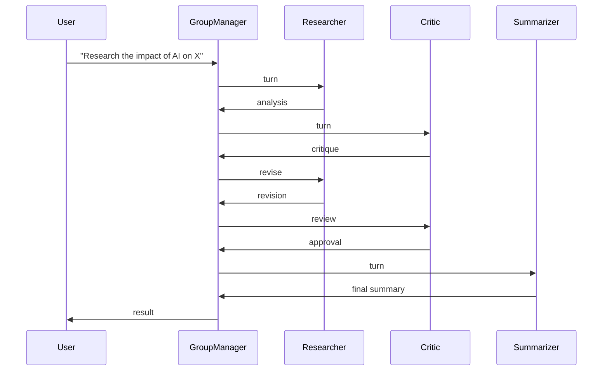

# 🎯 03 - AutoGen Fundamentals — Conversable Agents and GroupChat

> **Multi-agent conversation research. Researcher-critic, swarm, group chat, human-in-the-loop. The Microsoft Research framework for agents that need to debate, reflect, and reason together.**

## 🎯 Learning Objectives
- Distinguish `UserProxyAgent`, `AssistantAgent`, `ConversableAgent`, and the v0.4 actor model
- Build a 3-agent GroupChat (researcher + critic + summarizer) for iterative refinement
- Configure termination conditions: max messages, token limits, function calls
- Add human-in-the-loop moderation with custom reply functions
- Execute code safely via Docker containers (CodeExecutor pattern)
- Compare AutoGen with LangGraph supervisors, CrewAI crews, and Semantic Kernel plugins

## Introduction

AutoGen is Microsoft's research framework for **multi-agent conversation**. Where LangGraph models agents as nodes in a state machine and Semantic Kernel models them as function-callers, AutoGen models them as **conversational partners**. Each agent has a role, a system prompt, and a turn-taking protocol. The agents exchange messages in a chat; the conversation evolves toward the goal. This is the **canonical pattern for reflection, debate, and swarm intelligence**.

The framework originated in 2023 from Microsoft Research (paper: "AutoGen: Enabling Next-Gen LLM Applications via Multi-Agent Conversation"). The original v0.2 was research-grade; the v0.4 (2024) and v0.5 (2025) rewrites added an **actor model** with type-safe messages, async-first design, and modern Python packaging. AG2 (2025) is a community fork that tracks upstream with extra features.

AutoGen's killer feature is the **GroupChat orchestrator**: a special agent that selects which speaker is next based on the conversation history. Combined with termination conditions and human-in-the-loop moderation, this gives you the research-grade multi-agent patterns that no other framework matches out of the box.

For the AI/ML Engineer profile, AutoGen complements LangGraph ([[07 - AI Agents y Agentic Systems/18 - LangGraph Deep Patterns]]) and Semantic Kernel (Note 01) by providing **multi-agent debate** — a pattern that requires explicit cyclic orchestration in LangGraph but is the default in AutoGen. If your agent needs to think by talking to itself (researcher → critic → revision → critic → final), AutoGen is the most ergonomic tool.




---

## 1. The Agent Hierarchy — v0.5

AutoGen v0.5 (2025) introduced the actor model. The hierarchy:

```
RoutedAgent (base, async-first)
├── ConversableAgent    (turn-taking, message passing)
│   ├── AssistantAgent  (LLM-driven)
│   └── UserProxyAgent  (human-in-the-loop + code exec)
└── SwarmAgent          (handoff-based, no central orchestrator)
```

### 1.1 AssistantAgent — LLM-driven agent

The most common agent type. Takes the role of an LLM that responds to messages.

```python
from autogen_agentchat.agents import AssistantAgent
from autogen_ext.models.openai import OpenAIChatCompletionClient

model_client = OpenAIChatCompletionClient(
    model="gpt-4o-mini",
    api_key=os.getenv("OPENAI_API_KEY"),
)

researcher = AssistantAgent(
    name="researcher",
    model_client=model_client,
    system_message="You are a research analyst. Find relevant information and present it concisely.",
    description="An agent that researches topics using web search and presents findings.",
)
```

The `system_message` defines the agent's role; the `description` is used by the GroupChat manager to decide when to invoke the agent.

### 1.2 UserProxyAgent — human-in-the-loop + code execution

A human-or-tool proxy. By default, simulates a human reply; can be configured to execute code via Docker:

```python
from autogen_agentchat.agents import UserProxyAgent
from autogen_ext.code_executors.docker import DockerCommandLineCodeExecutor

# Code execution in an isolated Docker container
code_executor = DockerCommandLineCodeExecutor(
    image="python:3.12-slim",
    work_dir="/tmp/code_executor",
    timeout=60,
)

executor_proxy = UserProxyAgent(
    name="executor",
    code_executor=code_executor,
    # Default behavior: when another agent suggests code, execute it and return the result
)
```

The Docker executor runs suggested Python in a sandboxed container with a 60-second timeout. This is **safe code execution** — production AutoGen runs untrusted agent-suggested code in containers, not on the host.

### 1.3 ConversableAgent — base turn-taking

A pure message-passing agent with no LLM dependency. Use it for routing, filtering, or custom logic:

```python
from autogen_agentchat.agents import ConversableAgent

router = ConversableAgent(
    name="router",
    # Custom reply function decides what to do with each message
    custom_reply_function=lambda messages, context: route_decision(messages),
)
```

Custom reply functions are the extension point for adding validation, cost tracking, or routing logic between agents.

---

## 2. GroupChat — Multi-Agent Orchestration

The GroupChat orchestrator manages a chat between multiple agents. A `GroupChatManager` (an LLM-driven agent) selects the next speaker at each turn.

### 2.1 Three-agent GroupChat — researcher + critic + summarizer

```python
from autogen_agentchat.agents import AssistantAgent
from autogen_agentchat.teams import RoundRobinGroupChat, SelectorGroupChat
from autogen_agentchat.conditions import MaxMessageTermination, TextMentionTermination
from autogen_agentchat.ui import Console

model_client = OpenAIChatCompletionClient(model="gpt-4o-mini", api_key=os.getenv("OPENAI_API_KEY"))

researcher = AssistantAgent(
    name="researcher",
    model_client=model_client,
    system_message="You are a research analyst. Provide detailed analysis on the topic.",
)

critic = AssistantAgent(
    name="critic",
    model_client=model_client,
    system_message="You are a critical reviewer. Challenge assumptions, point out gaps, and demand evidence.",
)

summarizer = AssistantAgent(
    name="summarizer",
    model_client=model_client,
    system_message="You are a summarizer. After the researcher and critic complete, synthesize a final answer.",
)

# Round-robin: each agent takes turns in order
team = RoundRobinGroupChat(
    participants=[researcher, critic, summarizer],
    termination_condition=MaxMessageTermination(max_messages=12),
)

# Run
result = await team.run(task="What is the impact of generative AI on software engineering jobs?")
print(result.messages[-1].content)
```

The `RoundRobinGroupChat` cycles through agents in order: researcher → critic → summarizer → researcher → ... until the termination condition triggers.

### 2.2 SelectorGroupChat — LLM-driven speaker selection

For richer patterns, use `SelectorGroupChat` where an LLM chooses the next speaker based on the conversation history:

```python
from autogen_agentchat.teams import SelectorGroupChat

team = SelectorGroupChat(
    participants=[researcher, critic, summarizer],
    model_client=model_client,  # the selector LLM
    termination_condition=MaxMessageTermination(max_messages=12) | TextMentionTermination("TERMINATE"),
    selector_prompt="""Select the next speaker based on the conversation.
    Choose 'researcher' if the topic needs more analysis.
    Choose 'critic' if a recent claim needs verification.
    Choose 'summarizer' if all major points are covered and a synthesis is needed.
    """,
)
```

The selector LLM sees all messages and chooses the next speaker based on the prompt. This is more flexible than round-robin but adds latency (an extra LLM call per turn).

### 2.3 Termination conditions

Stop the chat when:

| Condition | Use case |
|-----------|----------|
| `MaxMessageTermination(max_messages=N)` | Cap on total messages |
| `TextMentionTermination("TERMINATE")` | Agent says "TERMINATE" (or custom signal) |
| `TokenUsageTermination(max_tokens=N)` | Cap on total tokens |
| `TimeoutTermination(seconds=N)` | Wall-clock timeout |
| `FunctionCallTermination()` | A specific function is called |

Compose with `|` (OR) and `&` (AND):

```python
from autogen_agentchat.conditions import (
    MaxMessageTermination, TokenUsageTermination, TextMentionTermination
)

termination = (
    MaxMessageTermination(max_messages=20)
    | TextMentionTermination("TERMINATE")
    | TokenUsageTermination(max_tokens=100_000)
)
```

### 2.4 Custom reply functions

Add moderation, validation, or routing by intercepting messages:

```python
def moderation_hook(messages, context):
    """Block any message containing PII."""
    for msg in messages:
        if contains_pii(msg.content):
            return "Message blocked: contains PII"
    return None  # pass through to next agent

team = SelectorGroupChat(
    participants=[researcher, critic, summarizer],
    model_client=model_client,
    termination_condition=termination,
    custom_reply_functions=[moderation_hook],
)
```

This is the **human-in-the-loop** pattern for AutoGen: intercept messages, allow/block, modify, or inject moderator responses.

---

## 3. Human-in-the-Loop Moderation

For research and high-stakes workflows, add a human moderator:

```python
from autogen_agentchat.agents import UserProxyAgent
from autogen_agentchat.ui import Console

human = UserProxyAgent(
    name="human",
    input_func=input,  # default: read from stdin
)

team = RoundRobinGroupChat(
    participants=[researcher, critic, human, summarizer],
    termination_condition=MaxMessageTermination(max_messages=20),
)

# When the human is selected, the framework prompts for input
result = await team.run(task="...")
```

In production, replace `input_func=input` with a custom function that pulls from a moderation queue (Postgres, Redis, RabbitMQ):

```python
def moderator_input(messages, context):
    """Pull human moderation from a queue."""
    # Block until a moderator approves / rejects
    task_id = context["task_id"]
    while True:
        decision = moderation_queue.get(task_id, timeout=10)
        if decision:
            return decision["response"]
        time.sleep(5)

human = UserProxyAgent(name="human", input_func=moderator_input)
```

This is the **human-in-the-loop at scale** pattern: 1000s of agent actions per hour, with 1-3 human moderators reviewing the most uncertain cases. The agent graph pauses; humans respond asynchronously; the agent resumes.

---

## 4. Code Execution via Docker

AutoGen v0.5 ships with `DockerCommandLineCodeExecutor` and `LocalCommandLineCodeExecutor`. The Docker version is the production standard:

```python
from autogen_ext.code_executors.docker import DockerCommandLineCodeExecutor

executor = DockerCommandLineCodeExecutor(
    image="python:3.12-slim",  # base image with Python
    work_dir="/tmp/agent_code",
    timeout=60,  # kill runaway code
    extra_volumes={
        "/host/data": {"bind": "/data", "mode": "ro"},  # read-only mount
    },
    extra_kwargs={"network_mode": "none"},  # no network access for safety
)

# Register with the user proxy
user_proxy = UserProxyAgent(
    name="user_proxy",
    code_executor=executor,
)

# Now when another agent produces code, the user proxy executes it and returns the result
```

The combination of `timeout=60`, `network_mode=none`, and read-only volumes makes the executor **production-safe** for executing agent-suggested code.

Caso real: A data analytics team uses AutoGen with Docker execution to let the research agent write Python code to query their database. The researcher proposes a SQL query; the user proxy executes it; the critic reviews the result. The data never leaves the Docker container; timeout prevents runaway queries; read-only volumes prevent data corruption.

---

## 5. Reflection and Self-Improvement Patterns

AutoGen excels at **reflection**: an agent critiques its own output and iterates.

### 5.1 Two-agent reflection loop

```python
from autogen_agentchat.agents import AssistantAgent
from autogen_agentchat.teams import RoundRobinGroupChat
from autogen_agentchat.conditions import TextMentionTermination

writer = AssistantAgent(
    name="writer",
    model_client=model_client,
    system_message="You are a technical writer. Draft a response to the user's question.",
)

reviewer = AssistantAgent(
    name="reviewer",
    model_client=model_client,
    system_message="You are a reviewer. Critique the writer's draft. Say 'APPROVED' if it's ready, otherwise suggest improvements.",
)

team = RoundRobinGroupChat(
    participants=[writer, reviewer],
    termination_condition=TextMentionTermination("APPROVED") | MaxMessageTermination(max_messages=8),
)

result = await team.run(task="Explain transformer attention mechanism")
```

The writer drafts, the reviewer critiques, the writer revises, until approved or max messages reached.

### 5.2 Three-agent debate pattern

```python
debater_a = AssistantAgent(name="debater_a", model_client=model_client,
    system_message="Argue FOR the proposition.")
debater_b = AssistantAgent(name="debater_b", model_client=model_client,
    system_message="Argue AGAINST the proposition.")
judge = AssistantAgent(name="judge", model_client=model_client,
    system_message="After 4 rounds, declare a winner with reasoning.")

team = RoundRobinGroupChat(
    participants=[debater_a, debater_b, judge],
    termination_condition=MaxMessageTermination(max_messages=10),
)
```

Two debaters argue, the judge decides. This is the canonical **multi-agent debate** pattern — proven to improve factuality and reasoning depth over single-agent generation.

---

## 6. Streaming and Observability

### 6.1 Streaming

For real-time UIs, stream the conversation:

```python
from autogen_agentchat.ui import Console

await Console(team.run_stream(task="..."))
```

Each message prints as it arrives. Use `run_stream` instead of `run` for streaming.

### 6.2 Observability

AutoGen v0.5 emits OpenTelemetry-compatible spans:

```python
from autogen_core import SingleThreadedAgentRuntime
from opentelemetry import trace
from opentelemetry.sdk.trace import TracerProvider
from opentelemetry.exporter.otlp.proto.http.trace_exporter import OTLPSpanExporter

trace.set_tracer_provider(TracerProvider())
trace.get_tracer_provider().add_span_processor(
    BatchSpanProcessor(OTLPSpanExporter(endpoint="http://localhost:4317/v1/traces"))
)
```

The spans include each agent's messages, model calls, and tool executions. Compatible with LangFuse (covered in [[09 - MLOps y Produccion/36 - LangFuse - Open-Source LLM Observability]]) and Phoenix (covered in [[09 - MLOps y Produccion/31 - Evidently AI and Phoenix]]).

---

## 7. Comparison — AutoGen vs LangGraph vs CrewAI vs Semantic Kernel

| Property | AutoGen | LangGraph | CrewAI | Semantic Kernel |
|----------|:-------:|:---------:|:------:|:---------------:|
| **Topology** | Group chat | State machine | Crews + roles | Plugins + planners |
| **Multi-agent debate** | ✅ Default | ⚠️ Manual | ⚠️ Roles only | ❌ |
| **Cyclic state** | ⚠️ Manual | ✅ Default | ⚠️ Manual | ⚠️ Manual (Process Framework) |
| **Human-in-the-loop** | ✅ Built-in | ✅ Interrupt | ⚠️ Tools | ⚠️ Manual |
| **Code execution** | ✅ Docker | ⚠️ External | ⚠️ External | ❌ |
| **Multi-language** | Python, .NET | Python | Python | Python, .NET, JS, Java |
| **Type safety** | ✅ v0.5 typed messages | ✅ TypedDict state | ⚠️ | ✅ Pydantic |
| **Production hardening** | 🟡 Research | ✅ LangSmith/LangFuse | 🟡 CrewAI 1.0 | ✅ Microsoft support |

Use **AutoGen** when the workflow is conversational and benefits from debate. Use **LangGraph** when the workflow has explicit state and conditional transitions. Use **CrewAI** when roles alone suffice. Use **Semantic Kernel** when plugins + Azure are the priority.

For complex production systems, **all four compose** — the capstone (Note 05) shows how.

---

## 8. Antipatterns

### 8.1 Antipattern 1: Letting agents loop forever

```python
# ❌ No termination: agents loop infinitely on disagreement
team = SelectorGroupChat(participants=[researcher, critic], model_client=model_client)

# ✅ Always set explicit termination
team = SelectorGroupChat(
    participants=[researcher, critic],
    model_client=model_client,
    termination_condition=MaxMessageTermination(max_messages=10) | TextMentionTermination("RESOLVED"),
)
```

### 8.2 Antipattern 2: Executing code on the host

```python
# ❌ Security: agent-suggested code runs on the host
executor = LocalCommandLineCodeExecutor(work_dir="/tmp")

# ✅ Use Docker with network disabled and timeout
executor = DockerCommandLineCodeExecutor(
    image="python:3.12-slim",
    timeout=60,
    extra_kwargs={"network_mode": "none"},
)
```

### 8.3 Antipattern 3: Vague agent descriptions

```python
# ❌ The selector LLM can't choose between similar agents
researcher = AssistantAgent(name="researcher", description="A researcher.")
critic = AssistantAgent(name="critic", description="A critic.")

# ✅ Specific, distinct descriptions
researcher = AssistantAgent(
    name="researcher",
    description="An agent that researches topics using web search and presents findings.",
)
critic = AssistantAgent(
    name="critic",
    description="An agent that challenges claims, points out gaps, and demands evidence.",
)
```

### 8.4 Antipattern 4: Long-running conversations without state persistence

```python
# ❌ 50-message conversation with no checkpoint — crash = lost work
team = RoundRobinGroupChat(participants=[researcher, critic], ...)

# ✅ Use the v0.5 runtime with checkpointing
runtime = SingleThreadedAgentRuntime(checkpoint_store=...)
await runtime.start_process(team, initial_event=..., thread_id="...")
```

### 8.5 Antipattern 5: Mixing models in the same conversation without thinking

```python
# ❌ Mixed quality: researcher on gpt-4o, critic on gpt-4o-mini
researcher = AssistantAgent(name="researcher", model_client=gpt4o_client)
critic = AssistantAgent(name="critic", model_client=gpt4o_mini_client)

# ✅ Use strong models for both speaker and critic, or weak for both
# (LLM-as-judge biases from [[06 - Large Language Models/20 - RAG Evaluation Deep Dive]] apply)
```

---

## 🎯 Key Takeaways

- AutoGen is Microsoft's multi-agent conversation research framework; v0.5 introduced the actor model with type-safe messages.
- Three core agent types: `AssistantAgent` (LLM-driven), `UserProxyAgent` (human-in-the-loop + code exec), `ConversableAgent` (custom logic).
- `RoundRobinGroupChat` for predictable order; `SelectorGroupChat` for LLM-driven speaker selection.
- Termination conditions: `MaxMessageTermination`, `TextMentionTermination`, `TokenUsageTermination`, `TimeoutTermination`.
- Human-in-the-loop via `UserProxyAgent(input_func=...)` with a moderation queue.
- Docker code executor with `network_mode=none` and `timeout` for safe agent-suggested code execution.
- Reflection and debate patterns: 2-agent self-critique, 3-agent debate with judge.
- Avoid infinite loops, host code execution, vague descriptions, no checkpointing, mixed model quality.

## References

- AutoGen docs — [microsoft.github.io/autogen](https://microsoft.github.io/autogen/)
- AutoGen v0.5 GitHub — [github.com/microsoft/autogen](https://github.com/microsoft/autogen)
- AG2 fork — [github.com/ag2ai/ag2](https://github.com/ag2ai/ag2)
- AutoGen paper — Wu et al., 2023, "AutoGen: Enabling Next-Gen LLM Applications via Multi-Agent Conversation"
- [[07 - AI Agents y Agentic Systems/11 - Fundamentos de Agentes AI|Fundamentos de Agentes AI]] — ReAct loop pattern
- [[07 - AI Agents y Agentic Systems/17 - Production Agent Frameworks|Production Agent Frameworks]] — agent framework landscape
- [[07 - AI Agents y Agentic Systems/18 - LangGraph Deep Patterns|LangGraph Deep Patterns]] — cyclic state machine alternative
- [[07 - AI Agents y Agentic Systems/19 - Semantic Kernel and AutoGen Deep Dive/01 - Semantic Kernel Fundamentals - Kernel, Plugins, Functions|Note 01 — SK Fundamentals]]
- [[07 - AI Agents y Agentic Systems/19 - Semantic Kernel and AutoGen Deep Dive/04 - AutoGen Advanced - RAG, Tools and Production Patterns|Note 04 — AutoGen Advanced]]
- [[06 - Large Language Models/20 - RAG Evaluation Deep Dive|RAG Evaluation Deep Dive]] — LLM-as-judge biases
- [[09 - MLOps y Produccion/36 - LangFuse - Open-Source LLM Observability|LangFuse Deep Dive]] — observability for AutoGen traces
- [[09 - MLOps y Produccion/31 - Evidently AI and Phoenix|Evidently AI and Phoenix]] — Phoenix spans for AutoGen