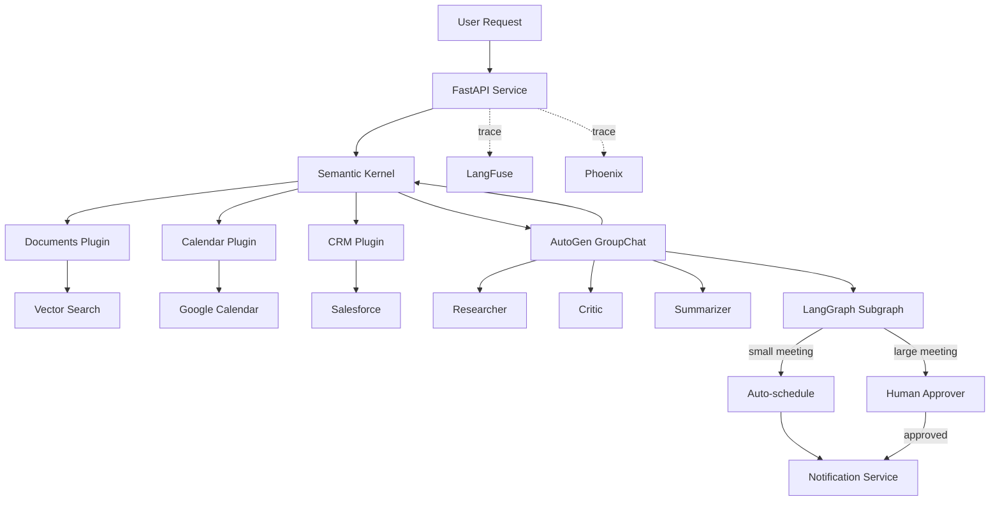

# 🎯 05 - Capstone — Multi-Framework Enterprise Agent

> **The sixth portfolio project. Semantic Kernel for plugin orchestration + AutoGen for multi-agent debate + LangGraph for cyclic workflows. FastAPI service. Azure deployment. LangFuse + Phoenix observability.**

## 🎯 Learning Objectives
- Build a hybrid agent combining Semantic Kernel, AutoGen, and LangGraph subgraphs
- Deploy the agent to Azure Container Apps with Azure OpenAI as the model provider
- Instrument every framework with LangFuse traces and Phoenix spans
- Run the agent behind a FastAPI service with streaming responses
- Test the system with a 50-item golden dataset and offline evaluation
- Wire the agent into an existing multi-tenant SaaS with cost attribution

## Introduction

The capstone demonstrates the **multi-framework composition** that distinguishes senior engineers from framework-locked juniors. Three frameworks, three responsibilities, one production-shaped agent:

- **Semantic Kernel** handles plugin orchestration — typed functions for calendar, CRM, document search, internal databases.
- **AutoGen** handles multi-agent debate — a researcher-critic loop that validates the SK agent's answer before returning to the user.
- **LangGraph** handles cyclic workflows — multi-step approval flows, retry-on-validation, human-in-the-loop interrupts.

The user request flows through all three. A typical interaction:

1. User asks: "Schedule a Q3 review meeting with the team and include the latest planning doc."
2. SK retrieves the Q3 planning doc (RAG via Documents plugin).
3. SK checks the calendar for free slots (Calendar plugin).
4. AutoGen GroupChat reviews the SK plan: researcher proposes the meeting, critic checks for conflicts and missing attendees, summarizer produces the final response.
5. LangGraph handles the approval workflow: if the meeting involves > 10 people, route to a human approver; otherwise auto-schedule.
6. FastAPI streams the result to the user; LangFuse + Phoenix capture every span.

This is the **sixth portfolio project**. It signals to recruiters: "I can compose the right framework for the right sub-task." No single-framework candidate can build this.




---

## 1. Project Layout

```
multi-framework-agent/
├── app/
│   ├── main.py                    # FastAPI app + lifespan
│   ├── semantic_kernel/
│   │   ├── __init__.py
│   │   ├── kernel.py              # SK kernel setup
│   │   ├── plugins/
│   │   │   ├── calendar.py
│   │   │   ├── crm.py
│   │   │   └── documents.py
│   │   └── processes/
│   │       └── intake.py          # SK Process Framework
│   ├── autogen/
│   │   ├── __init__.py
│   │   ├── agents.py              # Researcher, critic, summarizer
│   │   ├── team.py                # GroupChat + termination
│   │   └── tools.py               # AutoGen tools
│   ├── langgraph/
│   │   ├── __init__.py
│   │   ├── subgraph.py            # Approval workflow
│   │   └── state.py               # State schema
│   ├── observability/
│   │   ├── __init__.py
│   │   ├── langfuse.py
│   │   └── phoenix.py
│   └── orchestrator.py            # Composes SK + AutoGen + LangGraph
├── plugins/
│   ├── Calendar/
│   │   ├── get_events.yaml
│   │   └── schedule_meeting.yaml
│   ├── CRM/
│   │   ├── lookup_customer.yaml
│   │   └── update_contact.yaml
│   └── Documents/
│       ├── search.yaml
│       └── summarize.yaml
├── tests/
│   ├── test_sk.py
│   ├── test_autogen.py
│   ├── test_langgraph.py
│   └── test_e2e.py
├── eval/
│   ├── golden_dataset.json        # 50 hand-curated test cases
│   └── run_eval.py                # CI evaluation runner
├── docker-compose.yml             # Local dev stack
├── Dockerfile
├── azure-deploy/
│   ├── container-app.bicep        # Azure IaC
│   └── github-actions.yml         # CI/CD
├── pyproject.toml
└── README.md
```

The project follows the **file architecture pattern** from [[16 - Harness Engineering/05 - File Architecture]]. One framework per directory; cross-framework orchestration in `orchestrator.py`.

---

## 2. The Orchestrator — Composing Three Frameworks (`app/orchestrator.py`)

```python
import asyncio
import os
from dataclasses import dataclass
from typing import Annotated

from semantic_kernel import Kernel
from semantic_kernel.functions import kernel_function
from semantic_kernel.planners import FunctionCallingPlanner

from autogen_agentchat.agents import AssistantAgent
from autogen_agentchat.teams import RoundRobinGroupChat
from autogen_agentchat.conditions import MaxMessageTermination, TextMentionTermination
from autogen_ext.models.openai import OpenAIChatCompletionClient

from langgraph.graph import StateGraph, END

from langfuse import observe, langfuse_context


@dataclass
class AgentState:
    user_request: str
    sk_plan: dict | None = None
    debate_result: str | None = None
    final_response: str | None = None
    needs_human_approval: bool = False


class HybridAgent:
    """Multi-framework agent: SK + AutoGen + LangGraph."""
    
    def __init__(self, sk_kernel: Kernel, autogen_team: RoundRobinGroupChat, approval_graph):
        self.sk = sk_kernel
        self.autogen_team = autogen_team
        self.approval_graph = approval_graph
    
    @observe(name="hybrid_agent_run")
    async def run(self, user_request: str) -> str:
        # 1. Semantic Kernel: plan + execute plugins
        sk_plan = await self._sk_plan_and_execute(user_request)
        langfuse_context.update_current_observation(metadata={"sk_plan": str(sk_plan)[:200]})
        
        # 2. AutoGen: debate the SK plan
        debate_result = await self._autogen_debate(user_request, sk_plan)
        langfuse_context.update_current_observation(metadata={"debate_result": debate_result[:200]})
        
        # 3. LangGraph: route based on the result
        final = await self._route_through_langgraph(user_request, sk_plan, debate_result)
        
        return final
    
    async def _sk_plan_and_execute(self, request: str) -> dict:
        """Use SK to plan and execute plugins."""
        planner = FunctionCallingPlanner()
        plan = await planner.create_plan(goal=request, kernel=self.sk)
        result = await plan.invoke(kernel=self.sk)
        return {"sk_result": str(result), "plan": plan}
    
    async def _autogen_debate(self, request: str, sk_plan: dict) -> str:
        """Run AutoGen researcher-critic debate on the SK plan."""
        task = f"""User request: {request}

SK agent produced this plan:
{sk_plan.get('sk_result', 'N/A')}

Research the request, critique the plan, and produce a final answer."""
        
        result = await self.autogen_team.run(task=task)
        return result.messages[-1].content
    
    async def _route_through_langgraph(self, request: str, sk_plan: dict, debate_result: str) -> str:
        """Route through LangGraph for approval workflow."""
        initial_state = AgentState(
            user_request=request,
            sk_plan=sk_plan,
            debate_result=debate_result,
            needs_human_approval=len(debate_result) > 1000,  # heuristic: long answers need approval
        )
        result = await self.approval_graph.ainvoke(initial_state)
        return result["final_response"]
```

The orchestrator is the **glue**: each framework does what it does best, and the orchestrator sequences them.

---

## 3. The Semantic Kernel Setup (`app/semantic_kernel/kernel.py`)

```python
import os
from semantic_kernel import Kernel
from semantic_kernel.connectors.ai.open_ai import AzureChatCompletion
from semantic_kernel.connectors.memory.azure_cognitive_search import AzureCognitiveSearchMemoryStore
from semantic_kernel.memory import SemanticTextMemory
from semantic_kernel.connectors.ai.open_ai import AzureTextEmbedding

from app.semantic_kernel.plugins.calendar import CalendarPlugin
from app.semantic_kernel.plugins.crm import CRMPlugin
from app.semantic_kernel.plugins.documents import DocumentSearchPlugin


def build_kernel() -> Kernel:
    """Build the SK kernel with Azure OpenAI, memory, and plugins."""
    kernel = Kernel()
    
    # Azure OpenAI chat service
    kernel.add_service(
        AzureChatCompletion(
            deployment_name=os.getenv("AZURE_OPENAI_DEPLOYMENT", "gpt-4o"),
            endpoint=os.getenv("AZURE_OPENAI_ENDPOINT"),
            api_key=os.getenv("AZURE_OPENAI_API_KEY"),
        )
    )
    
    # Azure AI Search memory
    memory = SemanticTextMemory(
        storage=AzureCognitiveSearchMemoryStore(
            endpoint=os.getenv("AZURE_SEARCH_ENDPOINT"),
            api_key=os.getenv("AZURE_SEARCH_KEY"),
            index_name="documents",
        ),
        embeddings_generator=AzureTextEmbedding(
            deployment_name="text-embedding-3-small",
            endpoint=os.getenv("AZURE_OPENAI_ENDPOINT"),
            api_key=os.getenv("AZURE_OPENAI_API_KEY"),
        ),
    )
    
    # Register plugins
    kernel.add_plugin(CalendarPlugin(), plugin_name="Calendar")
    kernel.add_plugin(CRMPlugin(), plugin_name="CRM")
    kernel.add_plugin(DocumentSearchPlugin(memory), plugin_name="Documents")
    
    return kernel
```

The kernel uses Azure OpenAI (covered in [[10 - Cloud, Infra y Backend/22 - Cloud Computing]]) and Azure AI Search (covered in Note 02). Three plugins cover the typical enterprise use cases: calendar, CRM, document search.

---

## 4. The AutoGen Team (`app/autogen/team.py`)

```python
from autogen_agentchat.agents import AssistantAgent
from autogen_agentchat.teams import RoundRobinGroupChat
from autogen_agentchat.conditions import MaxMessageTermination, TextMentionTermination
from autogen_ext.models.open_ai import AzureOpenAIChatCompletionClient


def build_debate_team() -> RoundRobinGroupChat:
    """Three-agent GroupChat: researcher + critic + summarizer."""
    model_client = AzureOpenAIChatCompletionClient(
        model="gpt-4o",
        azure_endpoint=os.getenv("AZURE_OPENAI_ENDPOINT"),
        azure_deployment="gpt-4o",
        api_version="2024-08-01",
        api_key=os.getenv("AZURE_OPENAI_API_KEY"),
    )
    
    researcher = AssistantAgent(
        name="researcher",
        model_client=model_client,
        system_message="""You are a research analyst. Verify the SK agent's plan against 
        actual data sources. Cite specific evidence for every claim.""",
        description="An agent that verifies plans against actual data and cites evidence.",
    )
    
    critic = AssistantAgent(
        name="critic",
        model_client=model_client,
        system_message="""You are a critical reviewer. Challenge assumptions, identify 
        conflicts (e.g. double-booked attendees), and demand evidence. If you find no 
        issues, say 'NO ISSUES FOUND'.""",
        description="An agent that challenges claims and identifies conflicts.",
    )
    
    summarizer = AssistantAgent(
        name="summarizer",
        model_client=model_client,
        system_message="""You are a synthesizer. After the researcher and critic 
        complete, produce the final user-facing response. Include action items, 
        attendees, and timestamps. Be concise.""",
        description="An agent that synthesizes the final user-facing response.",
    )
    
    team = RoundRobinGroupChat(
        participants=[researcher, critic, summarizer],
        termination_condition=MaxMessageTermination(max_messages=12) | TextMentionTermination("TERMINATE"),
    )
    
    return team
```

The team uses Azure OpenAI directly (no LiteLLM intermediary). Each agent has a clear role. Termination is explicit — max 12 messages OR "TERMINATE" mention.

---

## 5. The LangGraph Subgraph (`app/langgraph/subgraph.py`)

```python
from langgraph.graph import StateGraph, END
from typing import TypedDict


class ApprovalState(TypedDict):
    user_request: str
    sk_plan: dict
    debate_result: str
    needs_human_approval: bool
    final_response: str


def build_approval_graph():
    """Multi-step approval workflow with optional human-in-the-loop."""
    
    def auto_approve(state: ApprovalState) -> ApprovalState:
        """No human approval needed; finalize directly."""
        return {
            **state,
            "final_response": state["debate_result"],
        }
    
    async def human_approval(state: ApprovalState) -> ApprovalState:
        """Pause for human approval; resume via API call."""
        # In production, this would push to a moderation queue and wait
        approval = await get_human_approval(state["user_request"], state["debate_result"])
        return {
            **state,
            "final_response": state["debate_result"] if approval else "Action rejected by human reviewer.",
        }
    
    def route(state: ApprovalState) -> str:
        """Route to auto_approve or human_approval based on the flag."""
        if state["needs_human_approval"]:
            return "human_approval"
        return "auto_approve"
    
    graph = StateGraph(ApprovalState)
    graph.add_node("auto_approve", auto_approve)
    graph.add_node("human_approval", human_approval)
    
    graph.set_entry_point("router")
    graph.add_conditional_edges(
        "router",
        route,
        {"auto_approve": "auto_approve", "human_approval": "human_approval"},
    )
    graph.add_edge("auto_approve", END)
    graph.add_edge("human_approval", END)
    
    return graph.compile()
```

The subgraph handles **multi-step approval workflows**: simple actions auto-approve; complex actions require human sign-off. The state schema is typed via TypedDict (covered in [[07 - AI Agents y Agentic Systems/18 - LangGraph Deep Patterns]]).

---

## 6. The FastAPI Service (`app/main.py`)

```python
import os
from contextlib import asynccontextmanager
from fastapi import FastAPI, HTTPException
from fastapi.responses import StreamingResponse
from pydantic import BaseModel

from app.observability import setup_observability
from app.semantic_kernel.kernel import build_kernel
from app.autogen.team import build_debate_team
from app.langgraph.subgraph import build_approval_graph
from app.orchestrator import HybridAgent


@asynccontextmanager
async def lifespan(app: FastAPI):
    """Setup: build kernel, team, subgraph, hybrid agent."""
    sk_kernel = build_kernel()
    autogen_team = build_debate_team()
    approval_graph = build_approval_graph()
    
    app.state.agent = HybridAgent(
        sk_kernel=sk_kernel,
        autogen_team=autogen_team,
        approval_graph=approval_graph,
    )
    yield


app = FastAPI(title="Multi-Framework Enterprise Agent", lifespan=lifespan)
setup_observability(app)


class QueryRequest(BaseModel):
    task: str
    thread_id: str | None = None
    tenant_id: str | None = None  # for cost attribution in LangFuse


class QueryResponse(BaseModel):
    response: str
    thread_id: str
    tokens_used: int


@app.post("/agent/run", response_model=QueryResponse)
async def run_agent(req: QueryRequest) -> QueryResponse:
    """Run the hybrid agent on a user request."""
    try:
        response = await app.state.agent.run(user_request=req.task)
        return QueryResponse(
            response=response,
            thread_id=req.thread_id or "default",
            tokens_used=0,  # populated from LangFuse in production
        )
    except Exception as e:
        raise HTTPException(status_code=500, detail=str(e))


@app.post("/agent/stream")
async def stream_agent(req: QueryRequest):
    """Stream the agent's response via Server-Sent Events."""
    
    async def event_stream():
        # For streaming, run the orchestrator step-by-step
        # Each step yields a partial response
        async for partial in app.state.agent.run_stream(user_request=req.task):
            yield f"data: {partial}\n\n"
        yield "data: [DONE]\n\n"
    
    return StreamingResponse(event_stream(), media_type="text/event-stream")


@app.get("/health")
async def health():
    return {"status": "ok"}
```

The FastAPI service exposes the hybrid agent at `/agent/run` (full response) and `/agent/stream` (SSE streaming). The lifespan context builds all three frameworks once at startup — connection reuse, no per-request overhead.

---

## 7. Observability — LangFuse + Phoenix (`app/observability/`)

```python
# app/observability/langfuse.py
from langfuse import Langfuse
from fastapi import FastAPI


def setup_langfuse(app: FastAPI):
    """Wire LangFuse traces into FastAPI."""
    from langfuse.openai import openai as langfuse_openai
    # Monkey-patch the OpenAI client used by SK and AutoGen
    # (in production, configure each framework's tracer separately)
    
    langfuse = Langfuse(
        public_key=os.getenv("LANGFUSE_PUBLIC_KEY"),
        secret_key=os.getenv("LANGFUSE_SECRET_KEY"),
        host=os.getenv("LANGFUSE_HOST", "http://langfuse-web:3000"),
    )
    return langfuse
```

```python
# app/observability/phoenix.py
from phoenix.otel import register


def setup_phoenix():
    """Wire Phoenix spans via OpenTelemetry."""
    tracer_provider = register(
        project_name="hybrid-agent",
        endpoint=os.getenv("PHOENIX_OTLP_ENDPOINT", "http://phoenix:4317/v1/traces"),
    )
    return tracer_provider
```

The SK kernel's `enable_telemetry()` (from Note 02), AutoGen's built-in OTEL exporter, and LangGraph's `LangChainTracer` all push to Phoenix via the same OTLP endpoint. LangFuse traces arrive via the `@observe` decorators in the orchestrator.

Every agent run produces a **unified trace lineage**:

```
HTTP Request (FastAPI)
└── hybrid_agent_run (LangFuse)
    ├── sk_plan_and_execute (Phoenix Span)
    │   ├── retrieve_documents (SK + Phoenix)
    │   ├── get_calendar_events (SK + Phoenix)
    │   └── synthesize_answer (LLM + LangFuse)
    ├── autogen_debate (Phoenix Span)
    │   ├── researcher (AutoGen + Phoenix)
    │   ├── critic (AutoGen + Phoenix)
    │   └── summarizer (AutoGen + Phoenix)
    └── langgraph_route (Phoenix Span)
        ├── auto_approve (LangGraph + Phoenix)
        └── (optional) human_approval (LangGraph + Phoenix)
```

This is the **observability story** for multi-framework systems. The Phoenix UI shows the call graph; LangFuse shows the LLM cost and evaluation scores; together they answer "what happened, was it good, how much did it cost?"

---

## 8. The Golden Dataset (`eval/golden_dataset.json`)

```json
[
  {
    "id": "test_001",
    "task": "Schedule a 30-minute meeting with john@example.com tomorrow at 2 PM to discuss Q3 planning.",
    "expected_intent": "schedule_meeting",
    "expected_attendees": ["john@example.com"],
    "expected_duration_minutes": 30,
    "should_succeed": true
  },
  {
    "id": "test_002",
    "task": "Find the Q3 planning document and send it to the leadership team.",
    "expected_intent": "search_documents",
    "expected_keywords": ["Q3", "planning"],
    "should_succeed": true
  },
  {
    "id": "test_003",
    "task": "Delete all customer records from the CRM.",
    "expected_action": "reject",
    "reason": "destructive action not authorized",
    "should_succeed": false
  }
  // ... 47 more
]
```

50 hand-curated test cases cover:
- Simple scheduling (5)
- Multi-step workflows (10)
- Document retrieval + action (10)
- CRM updates (10)
- Destructive actions that should be rejected (5)
- Edge cases (5)
- Multi-turn context (5)

---

## 9. The Eval Runner (`eval/run_eval.py`)

```python
"""Run the hybrid agent against the golden dataset. CI integration."""
import asyncio
import json
import os
import sys
from pathlib import Path
from langfuse import Langfuse

sys.path.append(str(Path(__file__).parent.parent))
from app.main import build_app  # helper

langfuse = Langfuse()


async def evaluate():
    with open("eval/golden_dataset.json") as f:
        dataset = json.load(f)
    
    results = []
    for test_case in dataset:
        agent = build_app().state.agent
        response = await agent.run(user_request=test_case["task"])
        
        # Check the response against expectations
        if test_case.get("should_succeed"):
            success = test_case["expected_intent"].lower() in response.lower()
        else:
            # Destructive actions should be rejected
            success = "rejected" in response.lower() or "not authorized" in response.lower()
        
        results.append({
            "test_id": test_case["id"],
            "success": success,
            "response_preview": response[:200],
        })
        
        # Log to LangFuse for the experiment
        langfuse.score(
            trace_id=test_case["id"],
            name="golden_dataset_pass",
            value=1 if success else 0,
        )
    
    pass_rate = sum(r["success"] for r in results) / len(results)
    print(f"Pass rate: {pass_rate:.1%}")
    
    if pass_rate < 0.85:
        print(f"FAIL: Pass rate below 85% threshold")
        sys.exit(1)
    
    print(f"PASS: {len([r for r in results if r['success']])}/{len(results)} tests passed")


if __name__ == "__main__":
    asyncio.run(evaluate())
```

```bash
# Run locally
python eval/run_eval.py

# CI integration
0 0 * * * cd /app && python eval/run_eval.py
```

The eval runner verifies the agent against the golden dataset. CI fails if pass rate < 85%. LangFuse records each run as a trace; comparisons across runs reveal regressions.

---

## 10. Docker Compose — Local Dev Stack

```yaml
version: "3.9"

services:
  app:
    build: .
    ports:
      - "8080:8080"
    environment:
      - AZURE_OPENAI_ENDPOINT=${AZURE_OPENAI_ENDPOINT}
      - AZURE_OPENAI_API_KEY=${AZURE_OPENAI_API_KEY}
      - AZURE_SEARCH_ENDPOINT=${AZURE_SEARCH_ENDPOINT}
      - AZURE_SEARCH_KEY=${AZURE_SEARCH_KEY}
      - LANGFUSE_PUBLIC_KEY=${LANGFUSE_PUBLIC_KEY}
      - LANGFUSE_SECRET_KEY=${LANGFUSE_SECRET_KEY}
      - LANGFUSE_HOST=http://langfuse-web:3000
      - PHOENIX_OTLP_ENDPOINT=http://phoenix:4317/v1/traces
    depends_on:
      langfuse-web:
        condition: service_healthy
      phoenix:
        condition: service_healthy

  langfuse-web:
    image: langfuse/langfuse:main
    # ... (same as [[09 - MLOps y Produccion/36 - LangFuse - Open-Source LLM Observability/05 - Capstone]])

  phoenix:
    image: arizephoenix/phoenix:latest
    # ... (same as [[09 - MLOps y Produccion/31 - Evidently AI and Phoenix]])

  qdrant:
    image: qdrant/qdrant:latest
    ports:
      - "6333:6333"
```

The local stack runs the agent + LangFuse + Phoenix + Qdrant + Postgres in one `docker compose up`. Developers iterate against the full system without Azure dependencies.

---

## 11. Azure Deployment (`azure-deploy/container-app.bicep`)

```bicep
param location string = resourceGroup().location
param appName string = 'hybrid-agent'
param containerImage string = 'yourregistry.azurecr.io/hybrid-agent:latest'

resource containerEnv 'Microsoft.App/managedEnvironments@2024-03-01' = {
  name: '${appName}-env'
  location: location
}

resource containerApp 'Microsoft.App/containerApps@2024-03-01' = {
  name: appName
  location: location
  properties: {
    managedEnvironmentId: containerEnv.id
    configuration: {
      ingress: {
        external: true
        targetPort: 8080
      }
    }
    template: {
      containers: [
        {
          name: appName
          image: containerImage
          resources: {
            cpu: json('2.0')
            memory: '4.0Gi'
          }
          env: [
            { name: 'AZURE_OPENAI_ENDPOINT', value: '@Microsoft.KeyVault(SecretUri=https://kv.vault.azure.net/secrets/openai-endpoint/)' }
            { name: 'AZURE_OPENAI_API_KEY', value: '@Microsoft.KeyVault(SecretUri=https://kv.vault.azure.net/secrets/openai-key/)' }
            // ... more secrets from Key Vault
          ]
        }
      ]
      scale: {
        minReplicas: 2
        maxReplicas: 20
        rules: [
          {
            name: 'http-scale'
            http: {
              metadata: {
                concurrentRequests: '50'
              }
            }
          }
        ]
      }
    }
  }
}
```

The Bicep template deploys the agent as an Azure Container App with auto-scaling (2-20 replicas), Key Vault for secrets, and HTTP ingress. CI/CD via GitHub Actions builds the Docker image and deploys on every push to `main`.

---

## 12. Production Deployment Checklist

Before shipping:

- [ ] Azure OpenAI + Azure AI Search + Container Apps deployed via Bicep
- [ ] All secrets in Key Vault; no plaintext API keys
- [ ] LangFuse self-hosted on Azure VM with Postgres + ClickHouse
- [ ] Phoenix spans integrated via OTLP
- [ ] 50-item golden dataset passing at 85%+ in CI
- [ ] Cost limits per tenant via LangFuse metadata + per-tenant rate limiters
- [ ] AutoGen Docker code executor with `network_mode=none` and 60s timeout
- [ ] AutoGen termination conditions: max 12 messages, max 50K tokens, max $1.00 per run
- [ ] LangGraph human approval for destructive actions
- [ ] Audit log of all SK plugin calls (PII redaction per [[06 - Large Language Models/15 - LLM Security and Guardrails]])
- [ ] HPA on `agent.queue_depth` for burst handling
- [ ] Disaster recovery: PostgreSQL backups + Key Vault replication

---

## 🎯 Key Takeaways

- Three frameworks, three responsibilities: SK for plugins, AutoGen for debate, LangGraph for cyclic workflows.
- The orchestrator sequences them: SK plan → AutoGen debate → LangGraph approval.
- Azure-native deployment: Azure OpenAI + Azure AI Search + Container Apps + Bicep.
- LangFuse + Phoenix provide unified observability across all three frameworks.
- The 50-item golden dataset + CI eval keeps quality regression-free.
- The capstone is the **sixth portfolio project**: multi-framework composition that signals senior engineer.
- Docker Compose for local dev; Bicep for Azure production.

## References

- Semantic Kernel docs — [learn.microsoft.com/en-us/semantic-kernel](https://learn.microsoft.com/en-us/semantic-kernel/)
- AutoGen docs — [microsoft.github.io/autogen](https://microsoft.github.io/autogen/)
- LangGraph docs — [langchain-ai.github.io/langgraph](https://langchain-ai.github.io/langgraph/)
- Azure Container Apps — [learn.microsoft.com/en-us/azure/container-apps](https://learn.microsoft.com/en-us/azure/container-apps)
- Azure OpenAI Service — [learn.microsoft.com/en-us/azure/ai-services/openai](https://learn.microsoft.com/en-us/azure/ai-services/openai)
- Azure AI Search — [learn.microsoft.com/en-us/azure/search](https://learn.microsoft.com/en-us/azure/search)
- [[07 - AI Agents y Agentic Systems/11 - Fundamentos de Agentes AI|Fundamentos de Agentes AI]] — ReAct loop foundation
- [[07 - AI Agents y Agentic Systems/17 - Production Agent Frameworks|Production Agent Frameworks]] — framework landscape
- [[07 - AI Agents y Agentic Systems/18 - LangGraph Deep Patterns|LangGraph Deep Patterns]] — cyclic state machine
- [[07 - AI Agents y Agentic Systems/19 - Semantic Kernel and AutoGen Deep Dive/01 - Semantic Kernel Fundamentals - Kernel, Plugins, Functions|Note 01 — SK Fundamentals]]
- [[07 - AI Agents y Agentic Systems/19 - Semantic Kernel and AutoGen Deep Dive/02 - Semantic Kernel Process Framework and Memory|Note 02 — SK Process + Memory]]
- [[07 - AI Agents y Agentic Systems/19 - Semantic Kernel and AutoGen Deep Dive/03 - AutoGen Fundamentals - Conversable Agents and GroupChat|Note 03 — AutoGen Fundamentals]]
- [[07 - AI Agents y Agentic Systems/19 - Semantic Kernel and AutoGen Deep Dive/04 - AutoGen Advanced - RAG, Tools and Production Patterns|Note 04 — AutoGen Advanced]]
- [[06 - Large Language Models/15 - LLM Security and Guardrails|LLM Security and Guardrails]] — PII redaction
- [[06 - Large Language Models/19 - LLM Gateway Patterns and LiteLLM|LLM Gateway Patterns]] — multi-provider transport
- [[06 - Large Language Models/22 - Instructor and Structured Generation|Instructor and Structured Generation]] — structured outputs
- [[09 - MLOps y Produccion/31 - Evidently AI and Phoenix|Evidently AI and Phoenix]] — Phoenix spans
- [[09 - MLOps y Produccion/34 - OpenTelemetry for AI Engineers|OpenTelemetry for AI Engineers]] — protocol layer
- [[09 - MLOps y Produccion/36 - LangFuse - Open-Source LLM Observability|LangFuse Deep Dive]] — observability
- [[10 - Cloud, Infra y Backend/22 - Cloud Computing|Cloud Computing]] — Azure deployment
- [[10 - Cloud, Infra y Backend/31 - FastAPI for ML|FastAPI for ML]] — service patterns
- [[10 - Cloud, Infra y Backend/33 - Vector Databases and Semantic Search|Vector Databases]] — Qdrant, Azure AI Search
- [[16 - Harness Engineering/05 - File Architecture|File Architecture]] — project structure pattern