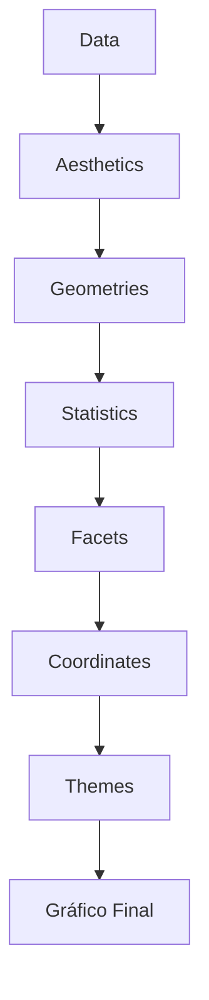
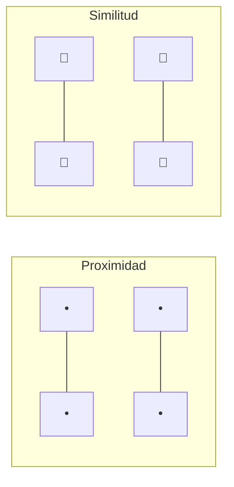
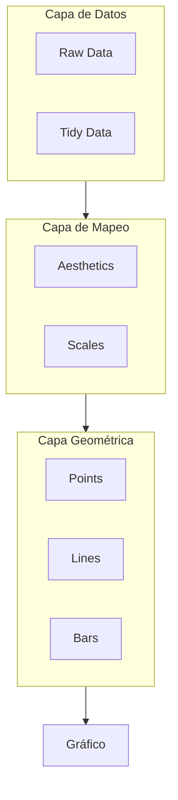

# 📊 Principios de Visualización de Datos

Para un ML/AI Engineer, entender los principios fundamentales de la visualización es equivalente a entender la arquitectura de una red neuronal. Una visualización mal construida no solo es estéticamente deficiente: puede inducir a errores de interpretación que propagan sesgos en pipelines de producción. En esta nota, exploramos la gramática de gráficos, la percepción humana y las matemáticas detrás de una representación honesta.

---

## 1. La Gramática de los Gráficos

La gramática de gráficos, formalizada por Leland Wilkinson y popularizada por `ggplot2`, propone que cualquier visualización se construye a partir de componentes independientes. En el ecosistema Python, esta filosofía se refleja en librerías como `plotnine` y en la API de alto nivel de Seaborn.

Los siete componentes fundamentales son:

1. **Data:** El conjunto de datos subyacente.
2. **Aesthetics (aes):** El mapeo de variables a propiedades visuales (ejes, color, tamaño).
3. **Geometries (geom):** Los objetos visuales que representan los datos (puntos, líneas, barras).
4. **Statistics (stat):** Transformaciones matemáticas aplicadas a los datos antes de graficar (binning, suavizado).
5. **Facets:** Subconjuntos de datos graficados en paneles separados.
6. **Coordinates (coord):** El sistema de coordenadas (cartesianas, polares, etc.).
7. **Themes:** La apariencia no relacionada con los datos (fuentes, fondos, márgenes).



La utilidad de esta descomposición es que permite construir visualizaciones complejas de manera sistemática. Por ejemplo, un histograma no es más que `data + aes(x=variable) + geom_bar(stat="bin")`.

---

## 2. Tipos de Gráficos y Cuándo Usarlos

La selección del gráfico correcto depende del tipo de variable (categórica vs. numérica) y de la pregunta analítica.

| Tipo de Gráfico | Variables | Pregunta que Responde | Ejemplo en ML |
|-----------------|-----------|----------------------|---------------|
| **Bar chart** | Categórica vs. Numérica (agregada) | ¿Cuál es la magnitud por categoría? | Distribución de clases en un dataset desbalanceado. |
| **Line chart** | Numérica (tiempo) vs. Numérica | ¿Cómo evoluciona una variable? | Pérdida de entrenamiento (`loss`) por época. |
| **Scatter plot** | Numérica vs. Numérica | ¿Existe correlación? | Relación entre `feature_1` y `feature_2`; clusters en embeddings. |
| **Histogram** | Numérica (distribución) | ¿Cuál es la forma de la distribución? | Distribución de valores de una feature; detección de skewness. |
| **Boxplot** | Categórica vs. Numérica | ¿Cuál es la dispersión y existen outliers? | Comparación de métricas AUC across folds de CV. |
| **Heatmap** | Matriz de valores | ¿Dónde están los valores altos/bajos? | Matriz de correlación de features; matriz de confusión. |
| **Violin plot** | Categórica vs. Numérica | ¿Cuál es la distribución por categoría? | Distribución de predicciones por clase verdadera. |
| **Pairplot** | Múltiples numéricas | ¿Cómo se relacionan todas las parejas? | Análisis rápido de correlaciones en EDA. |

### Fórmula del Coeficiente de Correlación de Pearson

Para justificar el uso de scatter plots en la detección de relaciones lineales, recordemos:

$$r = \frac{\sum_{i=1}^{n}(x_i - \bar{x})(y_i - \bar{y})}{\sqrt{\sum_{i=1}^{n}(x_i - \bar{x})^2 \sum_{i=1}^{n}(y_i - \bar{y})^2}}$$

Un $|r| \approx 1$ sugiere una relación lineal fuerte, ideal para representarse con un scatter plot y una línea de regresión superpuesta.

💡 Tip: Si tienes más de 10,000 puntos, un scatter plot tradicional se satura. Considera usar hexbins o sampleo estratificado.

⚠️ Advertencia: Un histograma con bins mal elegidos puede ocultar multimodalidades. La regla de Sturges sugiere $k = \lceil \log_2(n) \rceil + 1$ bins, pero para datos sesgados la regla de Freedman-Diaconis es más robusta:

$$h = 2 \frac{\text{IQR}}{\sqrt[3]{n}}$$

---

## 3. Principios de la Gestalt

La psicología de la Gestalt explica cómo el cerebro humano organiza elementos visuales en patrones. Aplicarlos mejora la legibilidad y reduce la carga cognitiva.

### 3.1 Proximidad
Los elementos cercanos se perciben como un grupo. En un scatter plot, los clusters naturales emergen cuando los puntos están próximos.

### 3.2 Similitud
Los elementos con color, forma o tamaño similares se agrupan mentalmente. Útil para distinguir clases en un gráfico multiclase.

### 3.3 Cierre
El cerebro tiende a completar formas incompletas. Permite usar líneas punteadas o áreas no completamente cerradas sin perder información.

### 3.4 Continuidad
Los elementos alineados en una dirección se perciben como una línea continua. Fundamental para line charts y tendencias temporales.



---

## 4. Teoría del Color en Visualización

El color es un canal de codificación extremadamente potente pero fácil de malutilizar. Las paletas se clasifican según el tipo de dato:

| Tipo de Paleta | Uso Recomendado | Ejemplo |
|----------------|-----------------|---------|
| **Sequential** | Datos ordenados de bajo a alto (sin punto medio) | Intensidad de activación de una neurona. |
| **Diverging** | Datos ordenados con un punto medio crítico | Desviaciones positivas/negativas del error de predicción. |
| **Categorical** | Grupos sin orden inherente | Clases de un clasificador multiclase. |

### Viridis
Viridis es una paleta secuencial perceptualmente uniforme y amigable para daltónicos. Reemplaza al arcoíris (`jet`) que introduce artefactos de percepción. En matplotlib:

```python
import matplotlib.pyplot as plt

# Viridis es la paleta por defecto en muchas funciones modernas
plt.imshow(data, cmap='viridis')
```

💡 Tip: Evita usar rojo y verde juntos para codificar información crítica; el 8% de la población masculina tiene alguna forma de deuteranopía.

---

## 5. Atributos Pre-atentivos y Chart Junk

Los atributos pre-atentivos son propiedades visuales que el cerebro procesa en menos de 250 ms sin esfuerzo consciente. Incluyen:

- **Posición** (la más precisa)
- **Longitud**
- **Orientación**
- **Color (matiz)**
- **Movimiento**

La jerarquía de precisión para estimar valores cuantitativos es:

$$\text{Posición} > \text{Longitud} > \text{Ángulo} > \text{Área} > \text{Volumen} > \text{Color (matiz)}$$

### Chart Junk
Término acuñado por Edward Tufte para describor elementos decorativos que no añaden información. Ejemplos: fondos con texturas, bordes 3D innecesarios, sombras exageradas. El principio de **data-ink ratio** maximiza la tinta dedicada a datos sobre la tinta total:

$$\text{Data-Ink Ratio} = \frac{\text{Tinta usada para representar datos}}{\text{Tinta total usada en el gráfico}}$$

---

## 6. El Factor de Mentira (Lie Factor)

Edward Tufte definió el *lie factor* para cuantificar la distorsión intencional o accidental en una visualización:

$$\text{Lie Factor} = \frac{\text{Tamaño del efecto mostrado en el gráfico}}{\text{Tamaño del efecto en los datos}}$$

Un lie factor de 1.0 es ideal. Valores superiores a 1.05 o inferiores a 0.95 indican distorsión significativa.

Caso real: En 2020, un comunicado de prensa mostró un gráfico de barras donde el eje Y no comenzaba en cero. El aumento real era del 10%, pero la altura de la barra sugería un crecimiento del 300%. El lie factor era aproximadamente 3.0 / 1.1 ≈ 2.7.

⚠️ Advertencia: En ML, truncar el eje de una métrica como el accuracy (que ya vive en [0,1]) puede magnificar diferencias insignificantes entre modelos.

---

## 7. Código Práctico: Matplotlib y Seaborn

```python
import matplotlib.pyplot as plt
import seaborn as sns
import numpy as np
import pandas as pd

# Configuración estética
sns.set_theme(style="whitegrid", palette="viridis")

# Datos de ejemplo: métricas de modelos
np.random.seed(42)
data = pd.DataFrame({
    'Modelo': ['Random Forest', 'XGBoost', 'SVM', 'Logistic Regression'] * 25,
    'Accuracy': np.concatenate([
        np.random.normal(0.85, 0.02, 25),
        np.random.normal(0.88, 0.015, 25),
        np.random.normal(0.82, 0.025, 25),
        np.random.normal(0.80, 0.02, 25)
    ])
})

# Figura combinada
fig, axes = plt.subplots(1, 2, figsize=(14, 5))

# Boxplot: distribución de accuracy por modelo
sns.boxplot(data=data, x='Modelo', y='Accuracy', ax=axes[0])
axes[0].set_title('Distribución de Accuracy por Modelo')
axes[0].set_ylim(0.75, 0.95)

# Violin plot: forma de la distribución
sns.violinplot(data=data, x='Modelo', y='Accuracy', ax=axes[1], inner='quartile')
axes[1].set_title('Densidad de Accuracy por Modelo')
axes[1].set_ylim(0.75, 0.95)

plt.tight_layout()
plt.show()
```

---

## Recursos Visuales

### Jerarquía de la Gramática de Gráficos


### Teoría de la Gestalt - Agrupamiento


*Figura: Ilustración de la ley de proximidad de la Gestalt. Elementos cercanos se perciben como grupos.*

---

📦 Código de Compresión

```python
import zipfile
from pathlib import Path

base = Path("C:/Users/Leito/Documents/Learning/ML and IA Engineering/07 - Research y Ciencia de Datos/27 - Visualizacion de Datos y Storytelling")
files = list(base.glob("*.md"))
out = base.parent / "curso_visualizacion.zip"

with zipfile.ZipFile(out, 'w') as z:
    for f in files:
        z.write(f, f.name)

print(f"Archivo creado: {out}")
```