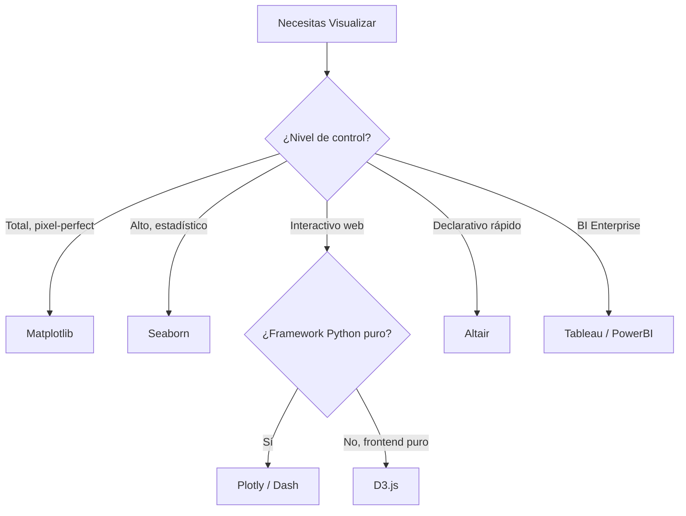
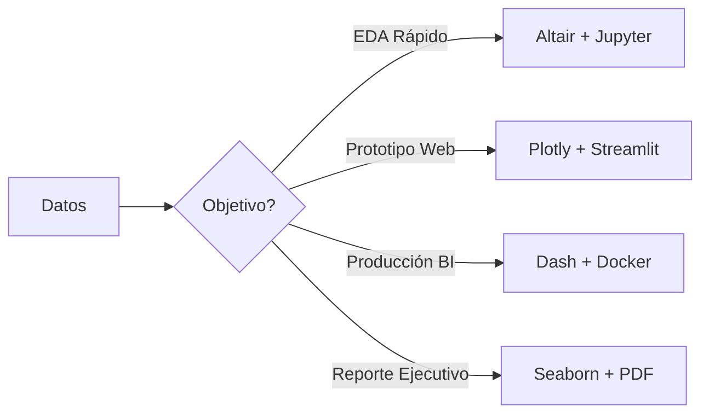
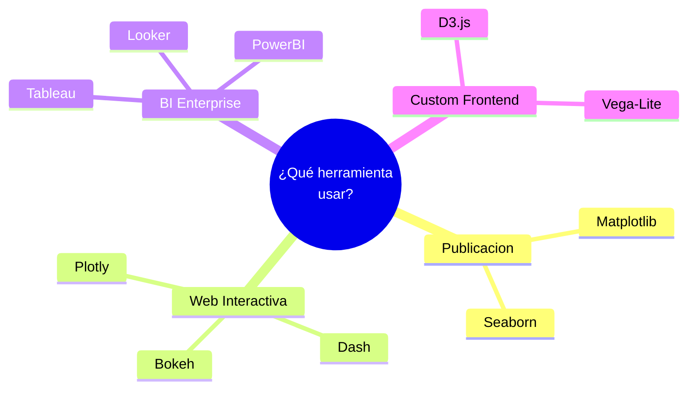

# 🛠️ Herramientas de Visualización

El ecosistema de visualización para ML/AI Engineering es vasto. Elegir la herramienta incorrecta puede ralentizar la iteración de experimentos o generar dashboards inmantenibles. En esta nota, comparamos librerías Python y herramientas BI, estableciendo un marco de decisión basado en control, interactividad y escalabilidad.

---

## 1. Panorama de Librerías en Python

| Herramienta | Paradigma | Nivel de Control | Interactividad | Curva de Aprendizaje | Ideal Para |
|-------------|-----------|------------------|----------------|----------------------|------------|
| **Matplotlib** | Imperativo | Total | Limitada (widgets) | Media | Publicaciones científicas, ajuste fino de figuras. |
| **Seaborn** | Declarativo (alto nivel) | Alto | Limitada | Baja | EDA estadístico, regresiones, distribuciones. |
| **Plotly** | Declarativo | Medio-Alto | Alta | Media | Dashboards web, análisis exploratorio interactivo. |
| **Altair** | Declarativo (Vega-Lite) | Medio | Media-Alta | Media | Visualizaciones concisas, transformaciones declarativas. |
| **Bokeh** | Declarativo/Imperativo | Medio-Alto | Alta | Media-Alta | Aplicaciones web con lógica Python personalizada. |
| **Vega-Lite** | Declarativo (JSON) | Medio | Media-Alta | Media | Especificaciones portables entre lenguajes. |

💡 Tip: Matplotlib sigue siendo el motor de renderizado subyacente de Seaborn. Aprender Matplotlib profundamente te dará superpoderes para debuggear cualquier salida gráfica en Python.

⚠️ Advertencia: D3.js es extremadamente poderoso para visualizaciones web custom, pero su curva de aprendizaje es pronunciada y rara vez es necesario para un ML Engineer a menos que construyas productos de frontend.

---

## 2. Herramientas de Business Intelligence (BI)

Aunque el foco del curso es Python, es inevitable interactuar con equipos de negocio que usan herramientas BI. Conocer sus capacidades facilita la integración de modelos de ML en reportes existentes.

| Herramienta | Tipo | Fortalezas | Integración ML |
|-------------|------|------------|----------------|
| **Tableau** | Desktop/Cloud | Usabilidad, comunidad | TabPy, Python scripts limitados. |
| **Power BI** | Microsoft ecosystem | DAX, integración con Azure | Python/R visual scripts, Azure ML. |
| **Looker** | Cloud (Google) | Git-based modeling, explorabilidad | BigQuery ML nativo. |

Caso real: Un equipo de MLOps en una empresa retail exportaba las predicciones de demanda a BigQuery. El equipo de negocio usaba Looker para explorar las predicciones sin escribir SQL, acelerando la adopción del modelo en un 40%.

---

## 3. ¿Cuándo Usar Cada Herramienta?



### Ecuación de Decisión Simplificada

Podemos modelar la utilidad de una herramienta $U$ como:

$$U = w_1 \cdot \text{Control} + w_2 \cdot \text{Velocidad} + w_3 \cdot \text{Interactivity} - w_4 \cdot \text{LearningCurve}$$

Donde los pesos $w_i$ dependen del contexto del proyecto. Para un prototipo rápido de EDA, $w_2$ domina. Para un paper de investigación, $w_1$ es preponderante.

---

## 4. Plotly: El Estándar para Interactividad

Plotly ha emergido como el estándar de facto para visualizaciones interactivas en Python gracias a su renderizado web nativo y su integración con Dash.

### Ejemplo: Exploración Interactiva de Métricas de ML

```python
import plotly.express as px
import pandas as pd
import numpy as np

np.random.seed(42)
df = pd.DataFrame({
    'Epoch': list(range(1, 51)) * 3,
    'Loss': np.concatenate([
        np.exp(-np.arange(50) * 0.1) + np.random.normal(0, 0.02, 50),
        np.exp(-np.arange(50) * 0.08) + np.random.normal(0, 0.02, 50) + 0.1,
        np.exp(-np.arange(50) * 0.12) + np.random.normal(0, 0.015, 50) - 0.05
    ]),
    'Model': ['ResNet-50'] * 50 + ['VGG-16'] * 50 + ['EfficientNet'] * 50
})

fig = px.line(
    df,
    x='Epoch',
    y='Loss',
    color='Model',
    title='Curvas de Entrenamiento Interactivas',
    labels={'Loss': 'Pérdida (Cross-Entropy)', 'Epoch': 'Época'},
    template='plotly_white'
)

# Anotación de mínimo
fig.add_hline(y=df['Loss'].min(), line_dash="dash", annotation_text="Mínimo global")
fig.show()
```

💡 Tip: Usa `template='plotly_white'` o `'plotly_dark'` para mantener consistencia visual con el tema de tu dashboard. El template por defecto puede lucir desactualizado en presentaciones.

---

## 5. Consideraciones de Rendimiento

| Tamaño de Datos | Recomendación |
|-----------------|---------------|
| < 10k puntos | Cualquier librería (Plotly, Seaborn, Altair). |
| 10k - 100k | Plotly WebGL (`scattergl`), Datashader (Bokeh/HoloViz), sampleo. |
| > 100k | Datashader, Vaex, o pre-agregación con DuckDB antes de visualizar. |

⚠️ Advertencia: Renderizar 1 millón de puntos con Plotly SVG puede congelar el navegador. Siempre considera el modo WebGL para scatter plots masivos.

---

## 6. Stack Tecnológico Recomendado



---

## Recursos Visuales

### Árbol de Decisión de Herramientas


### Ejemplo de Interfaz de Plotly


*Figura: Logo de Plotly, una de las librerías más utilizadas para visualización interactiva en ciencia de datos.*

---

📦 Código de Compresión

```python
import zipfile
from pathlib import Path

source = Path("C:/Users/Leito/Documents/Learning/ML and IA Engineering/07 - Research y Ciencia de Datos/27 - Visualizacion de Datos y Storytelling")
files = sorted(source.glob("*.md"))
archive = source.with_name("modulo_27_visualizacion.zip")

with zipfile.ZipFile(archive, 'w', zipfile.ZIP_DEFLATED) as zf:
    for f in files:
        zf.write(f, arcname=f.name)

print(f"Backup creado: {archive}")
```