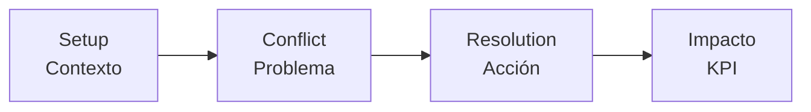
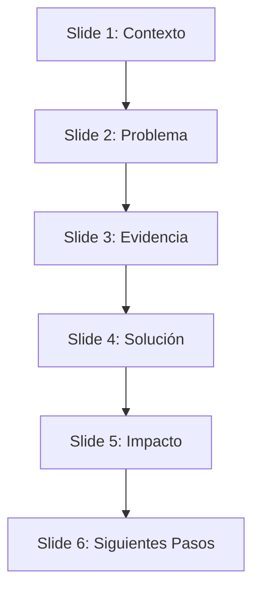
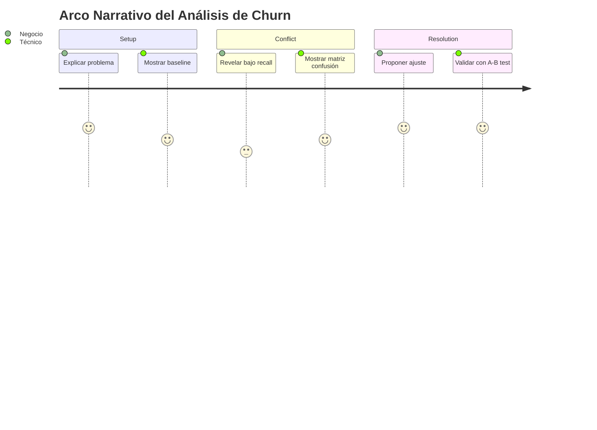

# 📖 Storytelling con Datos

Los modelos de ML no venden por sí solos. Un F1-score de 0.92 es irrelevante si el director ejecutivo no entiende qué significa para el negocio. El storytelling con datos transforma métricas abstractas en narrativas accionables. En esta nota, estudiamos la estructura narrativa, el análisis de audiencia y las técnicas de revelación progresiva.

---

## 1. La Narrativa con Datos: Setup, Conflict, Resolution

Toda historia efectiva, incluida la basada en datos, sigue una estructura de tres actos:

1. **Setup (Contexto):** Presenta el estado actual, las métricas basales y el problema de negocio. Ejemplo: "Nuestro modelo de churn tiene un accuracy del 85%."
2. **Conflict (Complicación):** Revela la tensión o el descubrimiento. Ejemplo: "Sin embargo, el recall para la clase 'churn' es solo del 12%, perdiendo clientes de alto valor."
3. **Resolution (Resolución):** Propone la acción o el resultado. Ejemplo: "Ajustando el threshold a 0.3 y reentrenando con SMOTE, aumentamos el recall al 68% con una pérdida aceptable de precision."



Esta estructura se conoce como **arco narrativo de datos**. Su potencia radica en que alinea la presentación técnica con la toma de decisiones ejecutivas.

---

## 2. Análisis de Audiencia

No todas las audiencias necesitan el mismo nivel de detalle. Adaptar la narrativa es un acto de empatía técnica.

| Audiencia | Enfoque | Métricas | Formato |
|-----------|---------|----------|---------|
| **Executive** | Impacto en negocio, ROI | Revenue protegido, costo evitado | 3-5 slides, alto nivel |
| **Technical** | Arquitectura, sesgos, robustez | AUC-ROC, calibration, SHAP values | Jupyter notebook, deep dives |
| **Business** | Operación, adopción | Conversion rate, ticket medio | Dashboards, tablas |

💡 Tip: La regla del "elevator pitch" aplica aquí. Si no puedes explicar el insight principal de tu modelo en 30 segundos a un ejecutivo, necesitas refinar tu narrativa.

⚠️ Advertencia: No uses "accuracy" como métrica principal ante una audiencia técnica si el dataset está desbalanceado. Te arriesgas a perder credibilidad instantáneamente.

---

## 3. Simplificación sin Distorsión

La simplificación es necesaria; la distorsión es inexcusable. La simplificación implica eliminar ruido visual y enfocarse en el mensaje principal. La distorsión ocurre cuando omitimos contexto crítico.

### Principios de Simplificación

- **Una idea por visualización:** No intentes mostrar accuracy, precision, recall y F1 en un solo gráfico de barras superpuesto si no es necesario.
- **Progresión lógica:** Ordena las visualizaciones para que construyan una cadena deductiva.
- **Anotaciones contextuales:** Usa texto para explicar el "por qué", no solo el "qué".

Caso real: Durante la pandemia de COVID-19, muchos medios mostraron gráficos de líneas acumuladas de casos sin ajustar por población ni por capacidad de testeo. La narrativa simplificada ("casos suben") distorsionó la percepción de riesgo relativo entre países.

---

## 4. Anotaciones y Revelación Escalonada (Stepwise Revelation)

La revelación escalonada presenta la información en pasos secuenciales, controlando la carga cognitiva del espectador. En un entorno de presentación, esto se logra con animaciones. En un notebook, se logra con múltiples celdas o controles interactivos.

### Implementación en Python

```python
import matplotlib.pyplot as plt
import numpy as np

np.random.seed(42)
epochs = np.arange(1, 21)
train_loss = np.exp(-epochs * 0.2) + np.random.normal(0, 0.01, 20)
val_loss = np.exp(-epochs * 0.18) + 0.05 + np.random.normal(0, 0.015, 20)

fig, axes = plt.subplots(1, 3, figsize=(15, 4))

# Paso 1: Solo entrenamiento
axes[0].plot(epochs, train_loss, 'o-', color='#2E86AB', label='Train Loss')
axes[0].set_title('Paso 1: Entrenamiento inicial')
axes[0].set_ylim(0, 1.2)

# Paso 2: Añadir validación
axes[1].plot(epochs, train_loss, 'o-', color='#2E86AB', label='Train Loss')
axes[1].plot(epochs, val_loss, 's--', color='#A23B72', label='Val Loss')
axes[1].set_title('Paso 2: Detectando sobreajuste')
axes[1].set_ylim(0, 1.2)
axes[1].legend()

# Paso 3: Añadir anotación de early stopping
axes[2].plot(epochs, train_loss, 'o-', color='#2E86AB', label='Train Loss')
axes[2].plot(epochs, val_loss, 's--', color='#A23B72', label='Val Loss')
axes[2].axvline(x=12, color='#F18F01', linestyle=':', linewidth=2, label='Early Stop')
axes[2].annotate('Overfitting starts', xy=(12, val_loss[11]), xytext=(15, 0.8),
                 arrowprops=dict(arrowstyle='->', color='#F18F01'))
axes[2].set_title('Paso 3: Acción recomendada')
axes[2].set_ylim(0, 1.2)
axes[2].legend()

plt.tight_layout()
plt.show()
```

---

## 5. Data Comics y Scrollytelling

- **Data Comics:** Secuencia de paneles que combinan visualizaciones y texto narrativo. Son efectivos para audiencias no técnicas porque imitan el lenguaje visual del cómic.
- **Scrollytelling:** Narrativa que se despliega a medida que el usuario hace scroll. Herramientas como `scrollama.js` o plataformas como Shorthand permiten implementarlo sin código complejo.

---

## 6. Storytelling vs Reporting

| Dimensión | Reporting | Storytelling |
|-----------|-----------|--------------|
| **Propósito** | Monitorear estado | Persuadir y generar acción |
| **Estructura** | Tabular, exhaustivo | Narrativa, selectivo |
| **Audiencia** | Operaciones, analistas | Ejecutivos, clientes |
| **Frecuencia** | Recurrente (diario/semanal) | Puntual (lanzamiento, análisis) |
| **Llamada a la acción** | Implícita | Explícita |

---

## 7. Ética en la Visualización

La ética es la brújula del storytelling. Un narrador de datos tiene el poder de moldear la percepción.

- **Transparencia:** Muestra incertidumbres, intervalos de confianza y sesgos conocidos del dataset.
- **Contexto:** Nunca elimines el eje cero sin justificación clara.
- **Privacidad:** En dashboards públicos, agrega datos personales para evitar reidentificación.

⚠️ Advertencia: Un heatmap de SHAP values puede revelar indirectamente información sensible si las features incluyen datos demográficos granulares. Revisa siempre las implicaciones de privacidad antes de compartir.

---

## 8. Flujo de Presentación Efectiva



Este flujo garantiza que cada slide construya sobre el anterior, minimizando la carga cognitiva y maximizando la retención del mensaje.

---

## Recursos Visuales

### Arco Narrativo de Datos


### Hans Rosling y Gapminder


*Figura: Hans Rosling, pionero del storytelling con datos, utilizando animaciones de Gapminder para explicar tendencias globales de salud y economía.*

---

📦 Código de Compresión

```python
import zipfile
from pathlib import Path

root = Path("C:/Users/Leito/Documents/Learning/ML and IA Engineering/07 - Research y Ciencia de Datos/27 - Visualizacion de Datos y Storytelling")
notes = list(root.glob("*.md"))
target = root.parent / "storytelling_modulo.zip"

with zipfile.ZipFile(target, 'w') as z:
    for note in notes:
        z.write(note, note.name)

print(f"Compresión finalizada: {target}")
```