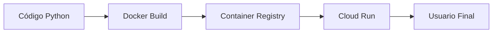
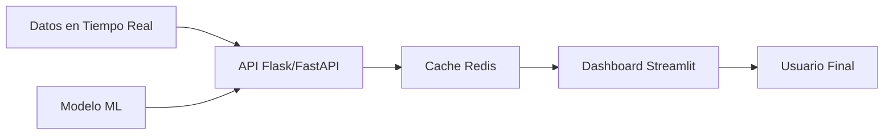

# 🖥️ Dashboards Interactivos

Un dashboard es la interfaz operativa entre un modelo de ML y los humanos que toman decisiones con él. Diseñar un dashboard efectivo requiere equilibrar la densidad de información con la claridad visual. En esta nota, analizamos principios de diseño, frameworks Python y estrategias de despliegue.

---

## 1. Principios de Diseño de Dashboards

Un dashboard de ML exitoso debe responder tres preguntas en menos de 5 segundos:

1. **¿Qué está pasando?** (Estado actual del sistema)
2. **¿Es bueno o malo?** (Comparación contra umbrales)
3. **¿Qué debo hacer?** (Alertas y acciones recomendadas)

### Jerarquía Visual

La disposición espacial debe seguir el patrón de lectura en "F" o "Z":

- **Esquina superior izquierda:** KPIs críticos (accuracy, latencia, drift score).
- **Zona central:** Tendencias temporales (series de tiempo).
- **Zona derecha/inferior:** Detalles desglosados (tablas, distribuciones).

### Frecuencia de Actualización

| Tipo de Dashboard | Refresh | Caso de Uso |
|-------------------|---------|-------------|
| **Estratégico** | Diario/Semanal | Reportes de negocio, adopción de modelo. |
| **Táctico** | Horario | Métricas de rendimiento, consumo de recursos. |
| **Operacional** | Real-time | Detección de fraude, monitoreo de drift. |

---

## 2. Streamlit: Python Puro y Rápido

Streamlit ha democratizado la creación de dashboards de datos. Su modelo de ejecución es secuencial: cada interacción del usuario re-ejecuta el script de arriba a abajo.

### Fortalezas

- **Cero frontend:** Todo es Python.
- **Widgets integrados:** Sliders, selectboxes, file uploader.
- **Caching nativo:** `@st.cache_data` y `@st.cache_resource` para evitar recargar datos o modelos.

### Limitaciones

- State management básico (aunque mejoró con `st.session_state`).
- Personalización de layout más rígida que Dash.
- No es ideal para aplicaciones multi-página complejas (aunque soporta multipage apps).

```python
import streamlit as st
import numpy as np
import pandas as pd

st.set_page_config(page_title="ML Monitor", layout="wide")

st.title("📊 Dashboard de Monitoreo de Modelo")

# Simulación de datos
@st.cache_data
def load_metrics():
    return pd.DataFrame({
        'fecha': pd.date_range('2024-01-01', periods=30),
        'accuracy': np.random.normal(0.88, 0.02, 30),
        'latency_ms': np.random.normal(120, 15, 30)
    })

df = load_metrics()

col1, col2 = st.columns(2)
col1.metric("Accuracy Promedio", f"{df['accuracy'].mean():.2%}")
col2.metric("Latencia Promedio", f"{df['latency_ms'].mean():.1f} ms")

st.line_chart(df.set_index('fecha')[['accuracy', 'latency_ms']])
```

💡 Tip: Usa `st.columns` y `st.metric` para crear layouts tipo "executive summary" en la parte superior de tu app.

---

## 3. Gradio: Demos de ML en Minutos

Gradio está optimizado para crear interfaces de demostración de modelos de ML. Es la herramienta preferida para compartir prototipos de inferencia.

### Cuándo usar Gradio

- Demo de clasificación de imágenes/texto.
- Comparación de múltiples modelos lado a lado.
- Recolección de feedback humano (HF Spaces).

⚠️ Advertencia: Gradio no está diseñado para dashboards de monitoreo continuo. Carece de componentes de series temporales nativos robustos.

---

## 4. Dash: Flexibilidad React-based

Dash, de Plotly, es un framework de aplicaciones web que usa React.js en el frontend y Flask en el backend. Ofrece control total sobre el layout y callbacks.

### Características Clave

- **Callbacks:** Funciones reactivas que actualizan componentes específicos sin re-ejecutar toda la app.
- **Componentes custom:** Puedes integrar componentes React personalizados.
- **Multi-página nativo:** Mejor arquitectura para aplicaciones empresariales complejas.

```python
from dash import Dash, html, dcc, callback, Output, Input
import plotly.express as px
import pandas as pd

app = Dash(__name__)

df = px.data.iris()

app.layout = html.Div([
    html.H1("Dashboard Iris - Dash"),
    dcc.Dropdown(df.species.unique(), 'setosa', id='dropdown-selection'),
    dcc.Graph(id='graph-content')
])

@callback(
    Output('graph-content', 'figure'),
    Input('dropdown-selection', 'value')
)
def update_graph(value):
    dff = df[df.species == value]
    return px.scatter(dff, x='sepal_length', y='sepal_width')

# app.run(debug=True)
```

---

## 5. Panel: El Ecosistema HoloViz

Panel es parte de HoloViz y se integra profundamente con Bokeh, HoloViews y Datashader. Es especialmente poderoso para visualizaciones geoespaciales y dashboards científicos.

---

## 6. Comparativa: Streamlit vs Dash vs Gradio

| Característica | Streamlit | Dash | Gradio |
|----------------|-----------|------|--------|
| **Curva de aprendizaje** | Muy baja | Media | Muy baja |
| **Flexibilidad de layout** | Media | Alta | Baja |
| **Interacción real-time** | Media | Alta | Media |
| **State management** | Session state | Callbacks | Automático |
| **Despliegue** | Streamlit Cloud, Docker | Heroku, AWS, GCP | HF Spaces, Docker |
| **Mejor para** | EDA, prototipos | Producción, BI | Demos de ML |

---

## 7. Caching, State Management y Deployment

### Caching

El caching evita cálculos redundantes. La fórmula de aceleración es:

$$\text{Speedup} = \frac{T_{\text{sin cache}}}{T_{\text{con cache}}}$$

En Streamlit:

```python
@st.cache_data(ttl=3600)
def expensive_computation():
    # Entrenamiento o carga de modelo
    return model
```

### State Management

- **Streamlit:** `st.session_state` para persistir variables entre interacciones.
- **Dash:** Callbacks con `State` y almacenamiento en el navegador (`dcc.Store`).

### Deployment

Opciones comunes:
- **Docker + Cloud Run / AWS Fargate:** Escalable y reproducible.
- **Streamlit Community Cloud:** Gratuito para repos públicos.
- **Hugging Face Spaces:** Ideal para demos abiertas.

Caso real: Un equipo de MLOps en una startup de healthtech dockerizó un dashboard de Dash para monitorear la deriva de un modelo de diagnóstico. Usaron Redis para cachear las predicciones de las últimas 24 horas, reduciendo la carga en la base de datos en un 70%.

---

## 8. Pipeline de Despliegue



---

## Recursos Visuales

### Arquitectura de un Dashboard de ML


### Ejemplo de Layout de Dashboard


*Figura: Icono conceptual de un dashboard. El diseño efectivo prioriza la jerarquía visual y la accesibilidad.*

---

📦 Código de Compresión

```python
import zipfile
from pathlib import Path

base_path = Path("C:/Users/Leito/Documents/Learning/ML and IA Engineering/07 - Research y Ciencia de Datos/27 - Visualizacion de Datos y Storytelling")
md_files = sorted(base_path.glob("*.md"))
zip_path = base_path.parent / "dashboards_modulo_27.zip"

with zipfile.ZipFile(zip_path, 'w', zipfile.ZIP_DEFLATED) as zf:
    for md in md_files:
        zf.write(md, arcname=md.name)

print(f"Backup generado: {zip_path}")
```